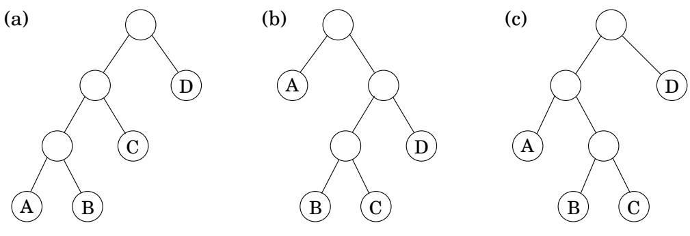

import Guide from '@/components/Guide.astro';
import Knowledge from '@/components/Knowledge.astro';
import Example from '@/components/Example.astro';
import Analysis from '@/components/Analysis.astro';
import Solution from '@/components/Solution.astro';
import Variant from '@/components/Variant.astro';
import Note from '@/components/Note.astro';
import Block from '@/components/Block.astro';
import Method from '@/components/Method.astro';
import Exercise from '@/components/Exercise.astro';

## 6.5 Chain matrix multiplication

Suppose that we want to multiply four matrices, $A \times B \times C \times D$ , of dimensions $5 0 \times 2 0 , 2 0 \times 1$ $1 \times 1 0 ,$ , and $1 0 \times 1 0 0$ , respectively (Figure 6.6). This will involve iteratively multiplying two matrices at a time. Matrix multiplication is not commutative (in general, $A \times B \neq B \times A )$ , but it is associative, which means for instance that $A \times ( B \times C ) = ( A \times B ) \times C$ . Thus we can compute our product of four matrices in many different ways, depending on how we parenthesize it. Are some of these better than others?

Multiplying an $m \times n$ matrix by an $n \times p$ matrix takes mnp multiplications, to a good enough approximation. Using this formula, let's compare several different ways of evaluating $A \times B \times C \times D$

<table><tr><td>Parenthesization</td><td>Cost computation</td><td>Cost</td></tr><tr><td> $A \times ((B \times C) \times D)$ </td><td> $20 \cdot 1 \cdot 10 + 20 \cdot 10 \cdot 100 + 50 \cdot 20 \cdot 100$ </td><td>120,200</td></tr><tr><td> $(A \times (B \times C)) \times D$ </td><td> $20 \cdot 1 \cdot 10 + 50 \cdot 20 \cdot 10 + 50 \cdot 10 \cdot 100$ </td><td>60,200</td></tr><tr><td> $(A \times B) \times (C \times D)$ </td><td> $50 \cdot 20 \cdot 1 + 1 \cdot 10 \cdot 100 + 50 \cdot 1 \cdot 100$ </td><td>7,000</td></tr></table>

As you can see, the order of multiplications makes a big difference in the final running time! Moreover, the natural greedy approach, to always perform the cheapest matrix multiplication available, leads to the second parenthesization shown here and is therefore a failure.

How do we determine the optimal order, if we want to compute $A _ { 1 } \times A _ { 2 } \times \cdots \times A _ { n } ,$ , where the $A _ { i } { \bf \dot { s } }$ are matrices with dimensions $m _ { 0 } \times m _ { 1 } , m _ { 1 } \times m _ { 2 } , \ldots , m _ { n - 1 } \times m _ { n }$ , respectively? The first thing to notice is that a particular parenthesization can be represented very naturally by a binary tree in which the individual matrices correspond to the leaves, the root is the final product, and interior nodes are intermediate products (Figure 6.7). The possible orders in which to do the multiplication correspond to the various full binary trees with n leaves, whose

$$
\overline {{\text { Figure   6.7(a) } ((A \times B) \times C) \times D ; (\mathbf {b}) A \times ((B \times C) \times D) ; (\mathbf {c}) (A \times (B \times C)) \times D .}}
$$

number is exponential in n (Exercise 2.13). We certainly cannot try each tree, and with brute force thus ruled out, we turn to dynamic programming.

The binary trees of Figure 6.7 are suggestive: for a tree to be optimal, its subtrees must also be optimal. What are the subproblems corresponding to the subtrees? They are products of the form $A _ { i } \times A _ { i + 1 } \times \cdots \times A _ { j }$ . Let's see if this works: for $1 \leq i \leq j \leq n$ , define

$$
C (i, j) = \text { minimum   cost   of   multiplying } A _ {i} \times A _ {i + 1} \times \dots \times A _ {j}.
$$

The size of this subproblem is the number of matrix multiplications, $| j - i |$ The smallest subproblem is when $i = j ,$ , in which case there's nothing to multiply, so $C ( i , i ) = 0$ . For $j > i ,$ consider the optimal subtree for $C ( i , j )$ . The first branch in this subtree, the one at the top, will split the product in two pieces, of the form $A _ { i } \times \cdots \times A _ { k }$ and $A _ { k + 1 } \times \cdots \times A _ { j }$ , for some k between i and $j .$ . The cost of the subtree is then the cost of these two partial products, plus the cost of combining them: $C ( i , k ) + C ( k + 1 , j ) + m _ { i - 1 } \cdot m _ { k } \cdot m _ { j }$ . And we just need to find the splitting point k for which this is smallest:

$$
C (i, j) = \min _ {i \leq k <   j} \left\{C (i, k) + C (k + 1, j) + m _ {i - 1} \cdot m _ {k} \cdot m _ {j} \right\}.
$$

We are ready to code! In the following, the variable s denotes subproblem size.

$$
\begin{array}{l} \text {for i = 1 to n: C(i,i) = 0} \\ \text {for s = 1 to n - 1:} \\ \quad \text {for i = 1 to n - s:} \\ \quad j = i + s \\ \quad C (i, j) = \min \{C (i, k) + C (k + 1, j) + m _ {i - 1} \cdot m _ {k} \cdot m _ {j}: i \leq k <   j \} \\ \text {return C(1,n)} \end{array}
$$

The subproblems constitute a two-dimensional table, each of whose entries takes $O ( n )$ time to compute. The overall running time is thus $O ( n ^ { 3 } )$
