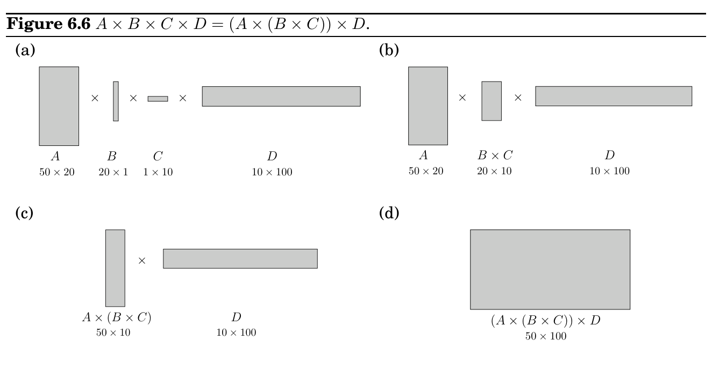

import Guide from '@/components/Guide.astro';
import Knowledge from '@/components/Knowledge.astro';
import Example from '@/components/Example.astro';
import Analysis from '@/components/Analysis.astro';
import Solution from '@/components/Solution.astro';
import Variant from '@/components/Variant.astro';
import Note from '@/components/Note.astro';
import Block from '@/components/Block.astro';
import Method from '@/components/Method.astro';
import Exercise from '@/components/Exercise.astro';

## 6.5 Chain matrix multiplication

Suppose that we want to multiply four matrices, A × B × C × D, of dimensions 50 × 20, 20 × 1, 1 × 10, and 10 × 100, respectively (Figure 6.6). This will involve iteratively multiplying two matrices at a time. Matrix multiplication is not commutative (in general, A×B̸ = B×A), but it is associative, which means for instance that A×(B ×C) = (A×B)×C. Thus we can compute our product of four matrices in many different ways, depending on how we parenthesize it. Are some of these better than others?

Multiplying an m × n matrix by an n × p matrix takes mnp multiplications, to a good enough approximation. Using this formula, let’s compare several different ways of evaluating A × B × C × D:

Parenthesization

Cost computation

Cost

A × ((B × C) × D)

20 · 1 · 10 + 20 · 10 · 100 + 50 · 20 · 100

120, 200 (A × (B × C)) × D

20 · 1 · 10 + 50 · 20 · 10 + 50 · 10 · 100

60, 200 (A × B) × (C × D)

50 · 20 · 1 + 1 · 10 · 100 + 50 · 1 · 100

7, 000

As you can see, the order of multiplications makes a big difference in the final running time! Moreover, the natural greedy approach, to always perform the cheapest matrix multiplication available, leads to the second parenthesization shown here and is therefore a failure.

How do we determine the optimal order, if we want to compute A_&#123;1&#125; × A_&#123;2&#125; × · · · × A_&#123;n&#125;, where the A_&#123;i&#125;’s are matrices with dimensions m_&#123;0&#125; × m_&#123;1&#125;, m_&#123;1&#125; × m_&#123;2&#125;, . . . , m_&#123;n&#125;−1 × m_&#123;n&#125;, respectively? The first thing to notice is that a particular parenthesization can be represented very naturally by a binary tree in which the individual matrices correspond to the leaves, the root is the final product, and interior nodes are intermediate products (Figure 6.7). The possible orders in which to do the multiplication correspond to the various full binary trees with n leaves, whose
