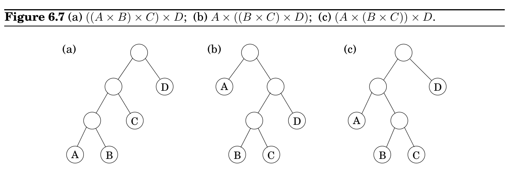
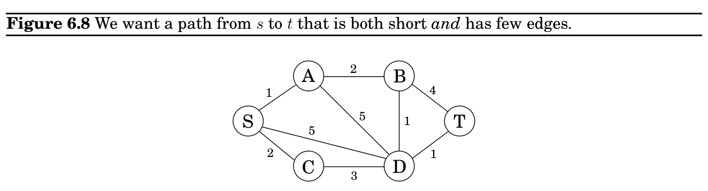
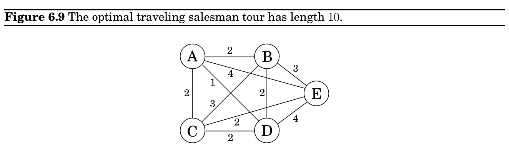

import Guide from '@/components/Guide.astro';
import Knowledge from '@/components/Knowledge.astro';
import Example from '@/components/Example.astro';
import Analysis from '@/components/Analysis.astro';
import Solution from '@/components/Solution.astro';
import Variant from '@/components/Variant.astro';
import Note from '@/components/Note.astro';
import Block from '@/components/Block.astro';
import Method from '@/components/Method.astro';
import Exercise from '@/components/Exercise.astro';

## 6.6 Shortest paths

number is exponential in n (Exercise 2.13). We certainly cannot try each tree, and with brute force thus ruled out, we turn to dynamic programming.

The binary trees of Figure 6.7 are suggestive: for a tree to be optimal, its subtrees must also be optimal. What are the subproblems corresponding to the subtrees? They are products of the form A_&#123;i&#125; × A_&#123;i&#125;+1 × · · · × A_&#123;j&#125;. Let’s see if this works: for 1 ≤i ≤j ≤n, define

C(i, j) = minimum cost of multiplying A_&#123;i&#125; × A_&#123;i&#125;+1 × · · · × A_&#123;j&#125;.

The size of this subproblem is the number of matrix multiplications, |j −i|. The smallest subproblem is when i = j, in which case there’s nothing to multiply, so C(i, i) = 0. For j > i, consider the optimal subtree for C(i, j). The first branch in this subtree, the one at the top, will split the product in two pieces, of the form A_&#123;i&#125; × · · · × A_&#123;k&#125; and A_&#123;k&#125;+1 × · · · × A_&#123;j&#125;, for some k between i and j. The cost of the subtree is then the cost of these two partial products, plus the cost of combining them: C(i, k) + C(k + 1, j) + m_&#123;i&#125;−1 · m_&#123;k&#125; · m_&#123;j&#125;. And we just need to find the splitting point k for which this is smallest:

C(i, j) = min

i≤k&lt;j &#123;C(i, k) + C(k + 1, j) + m_&#123;i&#125;−1 · m_&#123;k&#125; · m_&#123;j&#125;&#125; .

We are ready to code! In the following, the variable s denotes subproblem size.

for i = 1 to n: C(i, i) = 0 for s = 1 to n −1:

for i = 1 to n −s:

j = i + s C(i, j) = min&#123;C(i, k) + C(k + 1, j) + m_&#123;i&#125;−1 · m_&#123;k&#125; · m_&#123;j&#125; : i ≤k &lt; j&#125; return C(1, n)

The subproblems constitute a two-dimensional table, each of whose entries takes O(n) time to compute. The overall running time is thus O(n^&#123;3&#125;).

We started this chapter with a dynamic programming algorithm for the elementary task of finding the shortest path in a dag. We now turn to more sophisticated shortest-path problems

and see how these too can be accommodated by our powerful algorithmic technique.

### Shortest reliable paths

Life is complicated, and abstractions such as graphs, edge lengths, and shortest paths rarely capture the whole truth. In a communications network, for example, even if edge lengths faithfully reflect transmission delays, there may be other considerations involved in choosing a path. For instance, each extra edge in the path might be an extra “hop” fraught with uncertainties and dangers of packet loss. In such cases, we would like to avoid paths with too many edges. Figure 6.8 illustrates this problem with a graph in which the shortest path from S to T has four edges, while there is another path that is a little longer but uses only two edges. If four edges translate to prohibitive unreliability, we may have to choose the latter path.

Suppose then that we are given a graph G with lengths on the edges, along with two nodes s and t and an integer k, and we want the shortest path from s to t that uses at most k edges.

Is there a quick way to adapt Dijkstra’s algorithm to this new task? Not quite: that algorithm focuses on the length of each shortest path without “remembering” the number of hops in the path, which is now a crucial piece of information.

In dynamic programming, the trick is to choose subproblems so that all vital information is remembered and carried forward. In this case, let us define, for each vertex v and each integer i ≤k, dist(v, i) to be the length of the shortest path from s to v that uses i edges. The starting values dist(v, 0) are ∞for all vertices except s, for which it is 0. And the general update equation is, naturally enough,

dist(v, i) = min (u,v)∈E&#123;dist(u, i −1) + ℓ(u, v)&#125;.

Need we say more?

### All-pairs shortest paths

What if we want to find the shortest path not just between s and t but between all pairs of vertices? One approach would be to execute our general shortest-path algorithm from Section 4.6.1 (since there may be negative edges) |V | times, once for each starting node. The total running time would then be O(|V |^&#123;2&#125;|E|). We’ll now see a better alternative, the O(|V |^&#123;3&#125;) dynamic programming-based Floyd-Warshall algorithm.

Is there is a good subproblem for computing distances between all pairs of vertices in a graph? Simply solving the problem for more and more pairs or starting points is unhelpful,

because it leads right back to the O(|V |^&#123;2&#125;|E|) algorithm.

One idea comes to mind: the shortest path u →w_&#123;1&#125; →· · · →w_&#123;l&#125; →v between u and v uses some number of intermediate nodes—possibly none. Suppose we disallow intermediate nodes altogether. Then we can solve all-pairs shortest paths at once: the shortest path from u to v is simply the direct edge (u, v), if it exists. What if we now gradually expand the set of permissible intermediate nodes? We can do this one node at a time, updating the shortest path lengths at each stage. Eventually this set grows to all of V , at which point all vertices are allowed to be on all paths, and we have found the true shortest paths between vertices of the graph!

More concretely, number the vertices in V as &#123;1, 2, . . . , n&#125;, and let dist(i, j, k) denote the length of the shortest path from i to j in which only nodes &#123;1, 2, . . . , k&#125; can be used as intermediates. Initially, dist(i, j, 0) is the length of the direct edge between i and j, if it exists, and is ∞otherwise.

What happens when we expand the intermediate set to include an extra node k? We must reexamine all pairs i, j and check whether using k as an intermediate point gives us a shorter path from i to j. But this is easy: a shortest path from i to j that uses k along with possibly other lower-numbered intermediate nodes goes through k just once (why? because we assume that there are no negative cycles). And we have already calculated the length of the shortest path from i to k and from k to j using only lower-numbered vertices:

dist(k, j, k −1)

k

j

dist(i, k, k −1)

i

dist(i, j, k −1)

Thus, using k gives us a shorter path from i to j if and only if

dist(i, k, k −1) + dist(k, j, k −1) &lt; dist(i, j, k −1),

in which case dist(i, j, k) should be updated accordingly.

Here is the Floyd-Warshall algorithm—and as you can see, it takes O(|V |^&#123;3&#125;) time.

for i = 1 to n:

for j = 1 to n:

dist(i, j, 0) = ∞ for all (i, j) ∈E:

dist(i, j, 0) = ℓ(i, j) for k = 1 to n:

for i = 1 to n:

for j = 1 to n:

dist(i, j, k) = min&#123;dist(i, k, k −1) + dist(k, j, k −1), dist(i, j, k −1)&#125;

### The traveling salesman problem

A traveling salesman is getting ready for a big sales tour. Starting at his hometown, suitcase in hand, he will conduct a journey in which each of his target cities is visited exactly once

before he returns home. Given the pairwise distances between cities, what is the best order in which to visit them, so as to minimize the overall distance traveled?

Denote the cities by 1, . . . , n, the salesman’s hometown being 1, and let D = (d_&#123;ij&#125;) be the matrix of intercity distances. The goal is to design a tour that starts and ends at 1, includes all other cities exactly once, and has minimum total length. Figure 6.9 shows an example involving five cities. Can you spot the optimal tour? Even in this tiny example, it is tricky for a human to find the solution; imagine what happens when hundreds of cities are involved.

It turns out this problem is also difficult for computers. In fact, the traveling salesman problem (TSP) is one of the most notorious computational tasks. There is a long history of attempts at solving it, a long saga of failures and partial successes, and along the way, major advances in algorithms and complexity theory. The most basic piece of bad news about the TSP, which we will better understand in Chapter 8, is that it is highly unlikely to be solvable in polynomial time.

How long does it take, then? Well, the brute-force approach is to evaluate every possible tour and return the best one. Since there are (n −1)! possibilities, this strategy takes O(n!) time. We will now see that dynamic programming yields a much faster solution, though not a polynomial one.

What is the appropriate subproblem for the TSP? Subproblems refer to partial solutions, and in this case the most obvious partial solution is the initial portion of a tour. Suppose we have started at city 1 as required, have visited a few cities, and are now in city j. What information do we need in order to extend this partial tour? We certainly need to know j, since this will determine which cities are most convenient to visit next. And we also need to know all the cities visited so far, so that we don’t repeat any of them. Here, then, is an appropriate subproblem.

For a subset of cities S ⊆&#123;1, 2, . . . , n&#125; that includes 1, and j ∈S, let C(S, j) be the length of the shortest path visiting each node in S exactly once, starting at 1 and ending at j.

When |S| > 1, we define C(S, 1) = ∞since the path cannot both start and end at 1.

Now, let’s express C(S, j) in terms of smaller subproblems. We need to start at 1 and end at j; what should we pick as the second-to-last city? It has to be some i ∈S, so the overall path length is the distance from 1 to i, namely, C(S −&#123;j&#125;, i), plus the length of the final edge,
