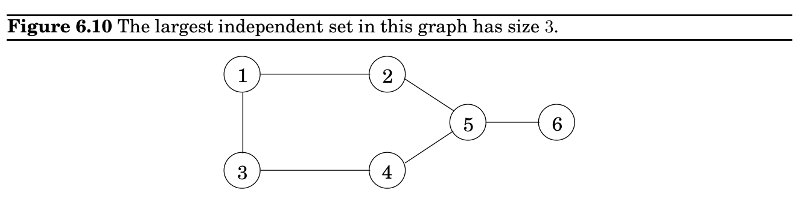

import Guide from '@/components/Guide.astro';
import Knowledge from '@/components/Knowledge.astro';
import Example from '@/components/Example.astro';
import Analysis from '@/components/Analysis.astro';
import Solution from '@/components/Solution.astro';
import Variant from '@/components/Variant.astro';
import Note from '@/components/Note.astro';
import Block from '@/components/Block.astro';
import Method from '@/components/Method.astro';
import Exercise from '@/components/Exercise.astro';

## 6.7 Independent sets in trees

d_&#123;ij&#125;. We must pick the best such i:

C(S, j) = min i∈S:i̸=j C(S −&#123;j&#125;, i) + d_&#123;ij&#125;.

The subproblems are ordered by |S|. Here’s the code.

C(&#123;1&#125;, 1) = 0 for s = 2 to n:

for all subsets S ⊆&#123;1, 2, . . . , n&#125; of size s and containing 1:

C(S, 1) = ∞ for all j ∈S, j̸ = 1:

C(S, j) = min&#123;C(S −&#123;j&#125;, i) + d_&#123;ij&#125; : i ∈S, i̸ = j&#125; return min_&#123;j&#125; C(&#123;1, . . . , n&#125;, j) + d_&#123;j&#125;1

There are at most 2^&#123;n&#125; · n subproblems, and each one takes linear time to solve. The total running time is therefore O(n^&#123;2&#125;2^&#123;n&#125;).

### On time and memory

The amount of time it takes to run a dynamic programming algorithm is easy to discern from the dag of subproblems: in many cases it is just the total number of edges in the dag! All we are really doing is visiting the nodes in linearized order, examining each node’s inedges, and, most often, doing a constant amount of work per edge. By the end, each edge of the dag has been examined once.

But how much computer memory is required? There is no simple parameter of the dag characterizing this. It is certainly possible to do the job with an amount of memory proportional to the number of vertices (subproblems), but we can usually get away with much less. The reason is that the value of a particular subproblem only needs to be remembered until the larger subproblems depending on it have been solved. Thereafter, the memory it takes up can be released for reuse.

For example, in the Floyd-Warshall algorithm the value of dist(i, j, k) is not needed once the dist(·, ·, k + 1) values have been computed. Therefore, we only need two |V | × |V | arrays to store the dist values, one for odd values of k and one for even values: when computing dist(i, j, k), we overwrite dist(i, j, k −2).

(And let us not forget that, as always in dynamic programming, we also need one more array, prev(i, j), storing the next to last vertex in the current shortest path from i to j, a value that must be updated with dist(i, j, k). We omit this mundane but crucial bookkeeping step from our dynamic programming algorithms.)

Can you see why the edit distance dag in Figure 6.5 only needs memory proportional to the length of the shorter string?

A subset of nodes S ⊂V is an independent set of graph G = (V, E) if there are no edges between them. For instance, in Figure 6.10 the nodes &#123;1, 5&#125; form an independent set, but

nodes &#123;1, 4, 5&#125; do not, because of the edge between 4 and 5. The largest independent set is &#123;2, 3, 6&#125;.

Like several other problems we have seen in this chapter (knapsack, traveling salesman), finding the largest independent set in a graph is believed to be intractable. However, when the graph happens to be a tree, the problem can be solved in linear time, using dynamic programming. And what are the appropriate subproblems? Already in the chain matrix multiplication problem we noticed that the layered structure of a tree provides a natural definition of a subproblem—as long as one node of the tree has been identified as a root.

So here’s the algorithm: Start by rooting the tree at any node r. Now, each node defines a subtree—the one hanging from it. This immediately suggests subproblems:

I(u) = size of largest independent set of subtree hanging from u.

Our final goal is I(r).

Dynamic programming proceeds as always from smaller subproblems to larger ones, that is to say, bottom-up in the rooted tree. Suppose we know the largest independent sets for all subtrees below a certain node u; in other words, suppose we know I(w) for all descendants w of u. How can we compute I(u)? Let’s split the computation into two cases: any independent set either includes u or it doesn’t (Figure 6.11).

I(u) = max

 

1 +

X

grandchildren w of u

I(w),

X

children w of u

I(w)

 

.

If the independent set includes u, then we get one point for it, but we aren’t allowed to include the children of u—therefore we move on to the grandchildren. This is the first case in the formula. On the other hand, if we don’t include u, then we don’t get a point for it, but we can move on to its children.

The number of subproblems is exactly the number of vertices. With a little care, the running time can be made linear, O(|V | + |E|).
