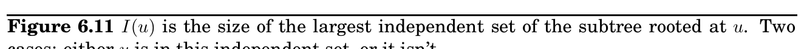
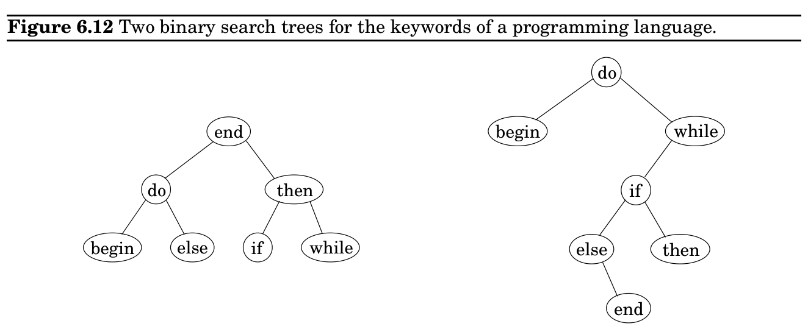

import Guide from '@/components/Guide.astro';
import Knowledge from '@/components/Knowledge.astro';
import Example from '@/components/Example.astro';
import Analysis from '@/components/Analysis.astro';
import Solution from '@/components/Solution.astro';
import Variant from '@/components/Variant.astro';
import Note from '@/components/Note.astro';
import Block from '@/components/Block.astro';
import Method from '@/components/Method.astro';
import Exercise from '@/components/Exercise.astro';

## Chapter 6 Exercises

r

u

<Exercise title="Exercise 6.1">

A contiguous subsequence of a list S is a subsequence made up of consecutive elements of S. For instance, if S is

</Exercise>

5, 15, −30, 10, −5, 40, 10,

then 15, −30, 10 is a contiguous subsequence but 5, 15, 40 is not. Give a linear-time algorithm for the following task:

Input: A list of numbers, a_&#123;1&#125;, a_&#123;2&#125;, . . . , a_&#123;n&#125;. Output: The contiguous subsequence of maximum sum (a subsequence of length zero has sum zero).

For the preceding example, the answer would be 10, −5, 40, 10, with a sum of 55.

(Hint: For each j ∈&#123;1, 2, . . ., n&#125;, consider contiguous subsequences ending exactly at position j.)

<Exercise title="Exercise 6.2">

You are going on a long trip. You start on the road at mile post 0. Along the way there are n hotels, at mile posts a_&#123;1&#125; &lt; a_&#123;2&#125; &lt; · · · &lt; a_&#123;n&#125;, where each a_&#123;i&#125; is measured from the starting point. The only places you are allowed to stop are at these hotels, but you can choose which of the hotels you stop at. You must stop at the final hotel (at distance a_&#123;n&#125;), which is your destination.

</Exercise>

You’d ideally like to travel 200 miles a day, but this may not be possible (depending on the spacing of the hotels). If you travel x miles during a day, the penalty for that day is (200 −x)^&#123;2&#125;. You want to plan your trip so as to minimize the total penalty—that is, the sum, over all travel days, of the daily penalties.

Give an efficient algorithm that determines the optimal sequence of hotels at which to stop.

<Exercise title="Exercise 6.3">

Yuckdonald’s is considering opening a series of restaurants along Quaint Valley Highway (QVH). The n possible locations are along a straight line, and the distances of these locations from the start of QVH are, in miles and in increasing order, m_&#123;1&#125;, m_&#123;2&#125;, . . . , m_&#123;n&#125;. The constraints are as follows:

</Exercise>

• At each location, Yuckdonald’s may open at most one restaurant. The expected profit from opening a restaurant at location i is p_&#123;i&#125;, where p_&#123;i&#125; > 0 and i = 1, 2, . . . , n.

• Any two restaurants should be at least k miles apart, where k is a positive integer.

Give an efficient algorithm to compute the maximum expected total profit subject to the given constraints.

<Exercise title="Exercise 6.4">

You are given a string of n characters s[1 . . . n], which you believe to be a corrupted text document in which all punctuation has vanished (so that it looks something like “itwasthebestoftimes...”). You wish to reconstruct the document using a dictionary, which is available in the form of a Boolean function dict(·): for any string w,

</Exercise>

dict(w) =

 true if w is a valid word false otherwise .

(a) Give a dynamic programming algorithm that determines whether the string s[·] can be

reconstituted as a sequence of valid words. The running time should be at most O(n^&#123;2&#125;), assuming calls to dict take unit time.

(b) In the event that the string is valid, make your algorithm output the corresponding se-

quence of words.

<Exercise title="Exercise 6.5">

Pebbling a checkerboard. We are given a checkerboard which has 4 rows and n columns, and has an integer written in each square. We are also given a set of 2n pebbles, and we want to place some or all of these on the checkerboard (each pebble can be placed on exactly one square) so as to maximize the sum of the integers in the squares that are covered by pebbles. There is one constraint: for a placement of pebbles to be legal, no two of them can be on horizontally or vertically adjacent squares (diagonal adjacency is fine).

</Exercise>

(a) Determine the number of legal patterns that can occur in any column (in isolation, ignoring

the pebbles in adjacent columns) and describe these patterns.

Call two patterns compatible if they can be placed on adjacent columns to form a legal placement. Let us consider subproblems consisting of the first k columns 1 ≤k ≤n. Each subproblem can be assigned a type, which is the pattern occurring in the last column.

(b) Using the notions of compatibility and type, give an O(n)-time dynamic programming algo-

rithm for computing an optimal placement.

<Exercise title="Exercise 6.6">

Let us define a multiplication operation on three symbols a, b, c according to the following table; thus ab = b, ba = c, and so on. Notice that the multiplication operation defined by the table is neither associative nor commutative.

</Exercise>

a b c

a

b b a

b

c b a

c

a c c

Find an efficient algorithm that examines a string of these symbols, say bbbbac, and decides whether or not it is possible to parenthesize the string in such a way that the value of the resulting expression is a. For example, on input bbbbac your algorithm should return yes because ((b(bb))(ba))c = a.

<Exercise title="Exercise 6.7">

A subsequence is palindromic if it is the same whether read left to right or right to left. For instance, the sequence

</Exercise>

A, C, G, T, G, T, C, A, A, A, A, T, C, G

has many palindromic subsequences, including A, C, G, C, A and A, A, A, A (on the other hand, the subsequence A, C, T is not palindromic). Devise an algorithm that takes a sequence x[1 . . . n] and returns the (length of the) longest palindromic subsequence. Its running time should be O(n^&#123;2&#125;).

<Exercise title="Exercise 6.8">

Given two strings x = x_&#123;1&#125;x_&#123;2&#125; · · · x_&#123;n&#125; and y = y_&#123;1&#125;y_&#123;2&#125; · · · y_&#123;m&#125;, we wish to find the length of their longest common substring, that is, the largest k for which there are indices i and j with x_&#123;i&#125;x_&#123;i&#125;+1 · · · x_&#123;i&#125;+k−1 = y_&#123;j&#125;y_&#123;j&#125;+1 · · · y_&#123;j&#125;+k−1. Show how to do this in time O(mn).

</Exercise>

<Exercise title="Exercise 6.9">

A certain string-processing language offers a primitive operation which splits a string into two pieces. Since this operation involves copying the original string, it takes n units of time for a string of length n, regardless of the location of the cut. Suppose, now, that you want to break a string into many pieces. The order in which the breaks are made can affect the total running time. For example, if you want to cut a 20-character string at positions 3 and 10, then making the first cut at position 3 incurs a total cost of 20 + 17 = 37, while doing position 10 first has a better cost of 20 + 10 = 30.

</Exercise>

Give a dynamic programming algorithm that, given the locations of m cuts in a string of length n, finds the minimum cost of breaking the string into m + 1 pieces.

<Exercise title="Exercise 6.10">

Counting heads. Given integers n and k, along with p_&#123;1&#125;, . . . , p_&#123;n&#125; ∈[0, 1], you want to determine the probability of obtaining exactly k heads when n biased coins are tossed independently at random, where p_&#123;i&#125; is the probability that the ith coin comes up heads. Give an O(n^&#123;2&#125;) algorithm for this task.^&#123;2&#125; Assume you can multiply and add two numbers in [0, 1] in O(1) time.

</Exercise>

<Exercise title="Exercise 6.11">

Given two strings x = x_&#123;1&#125;x_&#123;2&#125; · · · x_&#123;n&#125; and y = y_&#123;1&#125;y_&#123;2&#125; · · · y_&#123;m&#125;, we wish to find the length of their longest common subsequence, that is, the largest k for which there are indices i_&#123;1&#125; &lt; i_&#123;2&#125; &lt; · · · &lt; i_&#123;k&#125; and j_&#123;1&#125; &lt; j_&#123;2&#125; &lt; · · · &lt; j_&#123;k&#125; with x_&#123;i&#125;^&#123;1&#125;x_&#123;i&#125;^&#123;2&#125; · · · x_&#123;i&#125;_&#123;k&#125; = y_&#123;j&#125;^&#123;1&#125;y_&#123;j&#125;^&#123;2&#125; · · · y_&#123;j&#125;_&#123;k&#125;. Show how to do this in time O(mn).

</Exercise>

<Exercise title="Exercise 6.12">

You are given a convex polygon P on n vertices in the plane (specified by their x and y coordinates). A triangulation of P is a collection of n −3 diagonals of P such that no two diagonals intersect (except possibly at their endpoints). Notice that a triangulation splits the polygon’s interior into n −2 disjoint triangles. The cost of a triangulation is the sum of the lengths of the diagonals in it. Give an efficient algorithm for finding a triangulation of minimum cost. (Hint: Label the vertices of P by 1, . . . , n, starting from an arbitrary vertex and walking clockwise. For 1 ≤i &lt; j ≤n, let the subproblem A(i, j) denote the minimum cost triangulation of the polygon spanned by vertices i, i + 1, . . . , j.)

</Exercise>

<Exercise title="Exercise 6.13">

Consider the following game. A “dealer” produces a sequence s_&#123;1&#125; · · · s_&#123;n&#125; of “cards,” face up, where each card s_&#123;i&#125; has a value v_&#123;i&#125;. Then two players take turns picking a card from the sequence, but can only pick the first or the last card of the (remaining) sequence. The goal is to collect cards of largest total value. (For example, you can think of the cards as bills of different denominations.) Assume n is even.

</Exercise>

(a) Show a sequence of cards such that it is not optimal for the first player to start by picking

up the available card of larger value. That is, the natural greedy strategy is suboptimal.

(b) Give an O(n^&#123;2&#125;) algorithm to compute an optimal strategy for the first player. Given the

initial sequence, your algorithm should precompute in O(n^&#123;2&#125;) time some information, and then the first player should be able to make each move optimally in O(1) time by looking up the precomputed information.

<Exercise title="Exercise 6.14">

Cutting cloth. You are given a rectangular piece of cloth with dimensions X × Y , where X and Y are positive integers, and a list of n products that can be made using the cloth. For each product i ∈[1, n] you know that a rectangle of cloth of dimensions a_&#123;i&#125; × b_&#123;i&#125; is needed and that the final selling price of the product is c_&#123;i&#125;. Assume the a_&#123;i&#125;, b_&#123;i&#125;, and c_&#123;i&#125; are all positive integers. You have a machine that can cut any rectangular piece of cloth into two pieces either horizontally or vertically. Design an algorithm that determines the best return on the X × Y piece of cloth, that is, a strategy for cutting the cloth so that the products made from the resulting pieces give the

</Exercise>

2In fact, there is also a O(n log^&#123;2&#125; n) algorithm within your reach.

maximum sum of selling prices. You are free to make as many copies of a given product as you wish, or none if desired.

<Exercise title="Exercise 6.15">

Suppose two teams, A and B, are playing a match to see who is the first to win n games (for some particular n). We can suppose that A and B are equally competent, so each has a 50% chance of winning any particular game. Suppose they have already played i + j games, of which A has won i and B has won j. Give an efficient algorithm to compute the probability that A will go on to win the match. For example, if i = n −1 and j = n −3 then the probability that A will win the match is 7/8, since it must win any of the next three games.

</Exercise>

<Exercise title="Exercise 6.16">

The garage sale problem (courtesy of Professor Lofti Zadeh). On a given Sunday morning, there are n garage sales going on, g_&#123;1&#125;, g_&#123;2&#125;, . . . , g_&#123;n&#125;. For each garage sale g_&#123;j&#125;, you have an estimate of its value to you, v_&#123;j&#125;. For any two garage sales you have an estimate of the transportation cost d_&#123;ij&#125; of getting from g_&#123;i&#125; to g_&#123;j&#125;. You are also given the costs d_&#123;0&#125;j and d_&#123;j&#125;0 of going between your home and each garage sale. You want to find a tour of a subset of the given garage sales, starting and ending at home, that maximizes your total benefit minus your total transportation costs.

</Exercise>

Give an algorithm that solves this problem in time O(n^&#123;2&#125;2^&#123;n&#125;). (Hint: This is closely related to the traveling salesman problem.)

<Exercise title="Exercise 6.17">

Given an unlimited supply of coins of denominations x_&#123;1&#125;, x_&#123;2&#125;, . . . , x_&#123;n&#125;, we wish to make change for a value v; that is, we wish to find a set of coins whose total value is v. This might not be possible: for instance, if the denominations are 5 and 10 then we can make change for 15 but not for 12. Give an O(nv) dynamic-programming algorithm for the following problem.

</Exercise>

Input: x_&#123;1&#125;, . . . , x_&#123;n&#125;; v. Question: Is it possible to make change for v using coins of denominations x_&#123;1&#125;, . . . , x_&#123;n&#125;?

<Exercise title="Exercise 6.18">

Consider the following variation on the change-making problem (Exercise 6.17): you are given denominations x_&#123;1&#125;, x_&#123;2&#125;, . . . , x_&#123;n&#125;, and you want to make change for a value v, but you are allowed to use each denomination at most once. For instance, if the denominations are 1, 5, 10, 20, then you can make change for 16 = 1 + 15 and for 31 = 1 + 10 + 20 but not for 40 (because you can’t use 20 twice).

</Exercise>

Input: Positive integers x_&#123;1&#125;, x_&#123;2&#125;, . . . , x_&#123;n&#125;; another integer v. Output: Can you make change for v, using each denomination x_&#123;i&#125; at most once?

Show how to solve this problem in time O(nv).

<Exercise title="Exercise 6.19">

Here is yet another variation on the change-making problem (Exercise 6.17).

</Exercise>

Given an unlimited supply of coins of denominations x_&#123;1&#125;, x_&#123;2&#125;, . . . , x_&#123;n&#125;, we wish to make change for a value v using at most k coins; that is, we wish to find a set of ≤k coins whose total value is v. This might not be possible: for instance, if the denominations are 5 and 10 and k = 6, then we can make change for 55 but not for 65. Give an efficient dynamic-programming algorithm for the following problem.

Input: x_&#123;1&#125;, . . . , x_&#123;n&#125;; k; v. Question: Is it possible to make change for v using at most k coins, of denominations x_&#123;1&#125;, . . . , x_&#123;n&#125;?

<Exercise title="Exercise 6.20">

Optimal binary search trees. Suppose we know the frequency with which keywords occur in programs of a certain language, for instance:

</Exercise>

begin 5% do 40% else 8%

end 4% if 10% then 10% while 23%

We want to organize them in a binary search tree, so that the keyword in the root is alphabetically bigger than all the keywords in the left subtree and smaller than all the keywords in the right subtree (and this holds for all nodes). Figure 6.12 has a nicely-balanced example on the left. In this case, when a keyword is being looked up, the number of comparisons needed is at most three: for instance, in finding “while”, only the three nodes “end”, “then”, and “while” get examined. But since we know the frequency with which keywords are accessed, we can use an even more fine-tuned cost function, the average number of comparisons to look up a word. For the search tree on the left, it is

cost = 1(0.04) + 2(0.40 + 0.10) + 3(0.05 + 0.08 + 0.10 + 0.23) = 2.42.

By this measure, the best search tree is the one on the right, which has a cost of 2.18. Give an efficient algorithm for the following task.

Input: n words (in sorted order); frequencies of these words: p_&#123;1&#125;, p_&#123;2&#125;, . . . , p_&#123;n&#125;. Output: The binary search tree of lowest cost (defined above as the expected number of comparisons in looking up a word).

<Exercise title="Exercise 6.21">

A vertex cover of a graph G = (V, E) is a subset of vertices S ⊆V that includes at least one endpoint of every edge in E. Give a linear-time algorithm for the following task.

</Exercise>

Input: An undirected tree T = (V, E). Output: The size of the smallest vertex cover of T.

For instance, in the following tree, possible vertex covers include &#123;A, B, C, D, E, F, G&#125; and &#123;A, C, D, F&#125; but not &#123;C, E, F&#125;. The smallest vertex cover has size 3: &#123;B, E, G&#125;.

E

D A

B

C F

G

<Exercise title="Exercise 6.22">

Give an O(nt) algorithm for the following task.

</Exercise>

Input: A list of n positive integers a_&#123;1&#125;, a_&#123;2&#125;, . . . , a_&#123;n&#125;; a positive integer t. Question: Does some subset of the a_&#123;i&#125;’s add up to t? (You can use each a_&#123;i&#125; at most once.)

(Hint: Look at subproblems of the form “does a subset of &#123;a_&#123;1&#125;, a_&#123;2&#125;, . . . , a_&#123;i&#125;&#125; add up to s?” )

<Exercise title="Exercise 6.23">

A mission-critical production system has n stages that have to be performed sequentially; stage i is performed by machine M_&#123;i&#125;. Each machine M_&#123;i&#125; has a probability r_&#123;i&#125; of functioning reliably and a probability 1 −r_&#123;i&#125; of failing (and the failures are independent). Therefore, if we implement each stage with a single machine, the probability that the whole system works is r_&#123;1&#125; · r_&#123;2&#125; · · · r_&#123;n&#125;. To improve this probability we add redundancy, by having m_&#123;i&#125; copies of the machine M_&#123;i&#125; that performs stage i. The probability that all m_&#123;i&#125; copies fail simultaneously is only (1 −r_&#123;i&#125;)^&#123;m&#125;_&#123;i&#125;, so the probability that stage i is completed correctly is 1 −(1 −r_&#123;i&#125;)^&#123;m&#125;_&#123;i&#125; and the probability that the whole system works is Qn

</Exercise>

i=1(1 −(1 −r_&#123;i&#125;)^&#123;m&#125;_&#123;i&#125;). Each machine M_&#123;i&#125; has a cost c_&#123;i&#125;, and there is a total budget B to buy machines. (Assume that B and c_&#123;i&#125; are positive integers.) Given the probabilities r_&#123;1&#125;, . . . , r_&#123;n&#125;, the costs c_&#123;1&#125;, . . . , c_&#123;n&#125;, and the budget B, find the redundancies m_&#123;1&#125;, . . . , m_&#123;n&#125; that are within the available budget and that maximize the probability that the system works correctly.

<Exercise title="Exercise 6.24">

Time and space complexity of dynamic programming. Our dynamic programming algorithm for computing the edit distance between strings of length m and n creates a table of size n × m and therefore needs O(mn) time and space. In practice, it will run out of space long before it runs out of time. How can this space requirement be reduced?

</Exercise>

(a) Show that if we just want to compute the value of the edit distance (rather than the optimal

sequence of edits), then only O(n) space is needed, because only a small portion of the table needs to be maintained at any given time. (b) Now suppose that we also want the optimal sequence of edits. As we saw earlier, this problem can be recast in terms of a corresponding grid-shaped dag, in which the goal is to find the optimal path from node (0, 0) to node (n, m). It will be convenient to work with this formulation, and while we’re talking about convenience, we might as well also assume that m is a power of 2. Let’s start with a small addition to the edit distance algorithm that will turn out to be very useful. The optimal path in the dag must pass through an intermediate node (k, m/2) for some k; show how the algorithm can be modified to also return this value k. (c) Now consider a recursive scheme:

procedure find-path

((0, 0) →(n, m)) compute the value k above find-path((0, 0) →(k, m/2)) find-path((k, m/2) →(n, m)) concatenate these two paths, with k in the middle Show that this scheme can be made to run in O(mn) time and O(n) space.

<Exercise title="Exercise 6.25">

Consider the following 3-_&#123;PARTITION&#125; problem. Given integers a_&#123;1&#125;, . . . , a_&#123;n&#125;, we want to determine whether it is possible to partition of &#123;1, . . ., n&#125; into three disjoint subsets I, J, K such that

</Exercise>

X

i∈I

a_&#123;i&#125; =

X

j∈J

a_&#123;j&#125; =

X

k∈K

a_&#123;k&#125; = 1

3

n X

i=1

a_&#123;i&#125;

For example, for input (1, 2, 3, 4, 4, 5, 8) the answer is yes, because there is the partition (1, 8), (4, 5), (2, 3, 4). On the other hand, for input (2, 2, 3, 5) the answer is no. Devise and analyze a dynamic programming algorithm for 3-_&#123;PARTITION&#125; that runs in time polynomial in n and in P

i a_&#123;i&#125;.

<Exercise title="Exercise 6.26">

Sequence alignment. When a new gene is discovered, a standard approach to understanding its function is to look through a database of known genes and find close matches. The closeness of two genes is measured by the extent to which they are aligned. To formalize this, think of a gene as being a long string over an alphabet Σ = &#123;A, C, G, T&#125;. Consider two genes (strings) x = ATGCC and y = TACGCA. An alignment of x and y is a way of matching up these two strings by writing them in columns, for instance:

</Exercise>

− A T − G C C T A − C G C A

Here the “−” indicates a “gap.” The characters of each string must appear in order, and each column must contain a character from at least one of the strings. The score of an alignment is specified by a scoring matrix δ of size (|Σ| + 1) × (|Σ| + 1), where the extra row and column are to accommodate gaps. For instance the preceding alignment has the following score:

δ(−, T) + δ(A, A) + δ(T, −) + δ(−, C) + δ(G, G) + δ(C, C) + δ(C, A).

Give a dynamic programming algorithm that takes as input two strings x[1 . . . n] and y[1 . . . m] and a scoring matrix δ, and returns the highest-scoring alignment. The running time should be O(mn).

<Exercise title="Exercise 6.27">

Alignment with gap penalties. The alignment algorithm of Exercise 6.26 helps to identify DNA sequences that are close to one another. The discrepancies between these closely matched sequences are often caused by errors in DNA replication. However, a closer look at the biological replication process reveals that the scoring function we considered earlier has a qualitative problem: nature often inserts or removes entire substrings of nucleotides (creating long gaps), rather than editing just one position at a time. Therefore, the penalty for a gap of length 10 should not be 10 times the penalty for a gap of length 1, but something significantly smaller.

</Exercise>

Repeat Exercise 6.26, but this time use a modified scoring function in which the penalty for a gap of length k is c_&#123;0&#125; + c_&#123;1&#125;k, where c_&#123;0&#125; and c_&#123;1&#125; are given constants (and c_&#123;0&#125; is larger than c_&#123;1&#125;).

<Exercise title="Exercise 6.28">

Local sequence alignment. Often two DNA sequences are significantly different, but contain regions that are very similar and are highly conserved. Design an algorithm that takes an input two strings x[1 . . . n] and y[1 . . .m] and a scoring matrix δ (as defined in Exercise 6.26), and outputs substrings x^&#123;′&#125; and y^&#123;′&#125; of x and y, respectively, that have the highest-scoring alignment over all pairs of such substrings. Your algorithm should take time O(mn).

</Exercise>

<Exercise title="Exercise 6.29">

Exon chaining. Each gene corresponds to a subregion of the overall genome (the DNA sequence); however, part of this region might be “junk DNA.” Frequently, a gene consists of several pieces called exons, which are separated by junk fragments called introns. This complicates the process of identifying genes in a newly sequenced genome.

</Exercise>

Suppose we have a new DNA sequence and we want to check whether a certain gene (a string) is present in it. Because we cannot hope that the gene will be a contiguous subsequence, we look for partial matches—fragments of the DNA that are also present in the gene (actually, even these partial matches will be approximate, not perfect). We then attempt to assemble these fragments.

Let x[1 . . . n] denote the DNA sequence. Each partial match can be represented by a triple (l_&#123;i&#125;, r_&#123;i&#125;, w_&#123;i&#125;), where x[l_&#123;i&#125; . . . r_&#123;i&#125;] is the fragment and w_&#123;i&#125; is a weight representing the strength of the match (it might be a local alignment score or some other statistical quantity). Many of these potential matches could be false, so the goal is to find a subset of the triples that are consistent (nonoverlapping) and have a maximum total weight.

Show how to do this efficiently.

<Exercise title="Exercise 6.30">

Reconstructing evolutionary trees by maximum parsimony. Suppose we manage to sequence a particular gene across a whole bunch of different species. For concreteness, say there are n species, and the sequences are strings of length k over alphabet Σ = &#123;A, C, G, T&#125;. How can we use this information to reconstruct the evolutionary history of these species?

</Exercise>

Evolutionary history is commonly represented by a tree whose leaves are the different species, whose root is their common ancestor, and whose internal branches represent speciation events (that is, moments when a new species broke off from an existing one). Thus we need to find the following:

• An evolutionary tree with the given species at the leaves.

• For each internal node, a string of length k: the gene sequence for that particular ancestor.

For each possible tree T, annotated with sequences s(u) ∈Σ^&#123;k&#125; at each of its nodes u, we can assign a score based on the principle of parsimony: fewer mutations are more likely.

score(T) =

X

(u,v)∈E(T )

(number of positions on which s(u) and s(v) disagree).

Finding the highest-score tree is a difficult problem. Here we will consider just a small part of it: suppose we know the structure of the tree, and we want to fill in the sequences s(u) of the internal nodes u. Here’s an example with k = 4 and n = 5:

CGCG AGGA ATCA AGTC ATTC

(a) In this particular example, there are several maximum parsimony reconstructions of the

internal node sequences. Find one of them.

(b) Give an efficient (in terms of n and k) algorithm for this task. (Hint: Even though the

sequences might be long, you can do just one position at a time.)
