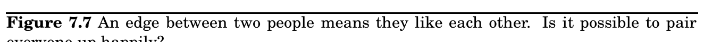
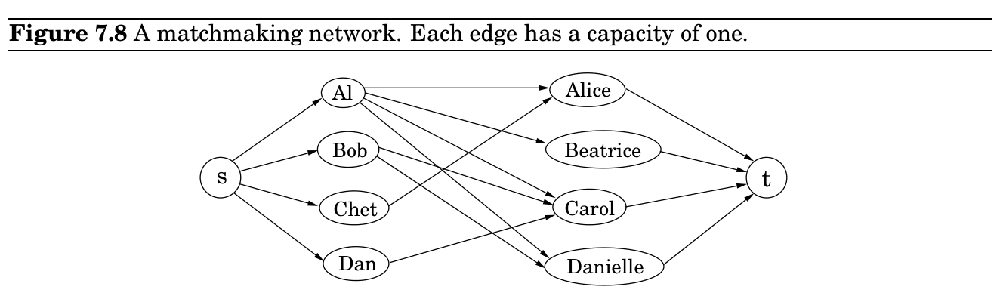

import Guide from '@/components/Guide.astro';
import Knowledge from '@/components/Knowledge.astro';
import Example from '@/components/Example.astro';
import Analysis from '@/components/Analysis.astro';
import Solution from '@/components/Solution.astro';
import Variant from '@/components/Variant.astro';
import Note from '@/components/Note.astro';
import Block from '@/components/Block.astro';
import Method from '@/components/Method.astro';
import Exercise from '@/components/Exercise.astro';

## 7.3 Bipartite matching

Alice

Beatrice

Carol

Danielle

GIRLS

Chet

Dan

Bob

Al

BOYS

Figure 7.7 shows a graph with four nodes on the left representing boys and four nodes on the right representing girls.^&#123;1&#125; There is an edge between a boy and girl if they like each other (for instance, Al likes all the girls). Is it possible to choose couples so that everyone has exactly one partner, and it is someone they like? In graph-theoretic jargon, is there a perfect matching?

This matchmaking game can be reduced to the maximum-flow problem, and thereby to linear programming! Create a new source node, s, with outgoing edges to all the boys; a new sink node, t, with incoming edges from all the girls; and direct all the edges in the original bipartite graph from boy to girl (Figure 7.8). Finally, give every edge a capacity of 1. Then there is a perfect matching if and only if this network has a flow whose size equals the number of couples. Can you find such a flow in the example?

Actually, the situation is slightly more complicated than just stated: what is easy to see is that the optimum integer-valued flow corresponds to the optimum matching. We would be at a bit of a loss interpreting a flow that ships 0.7 units along the edge Al–Carol, for instance! Fortunately, the maximum-flow problem has the following property: if all edge capacities are integers, then the optimal flow found by our algorithm is integral. We can see this directly

1This kind of graph, in which the nodes can be partitioned into two groups such that all edges are between the groups, is called bipartite.
