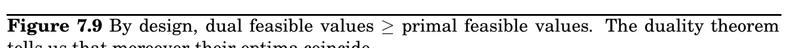
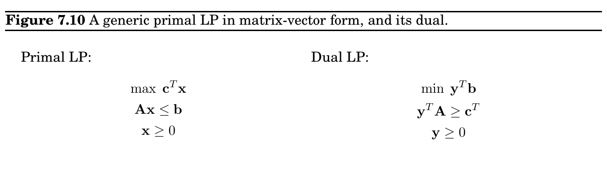
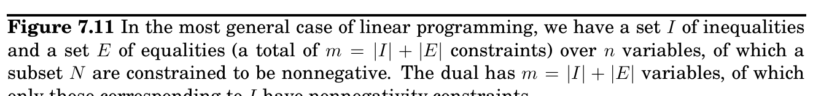

import Guide from '@/components/Guide.astro';
import Knowledge from '@/components/Knowledge.astro';
import Example from '@/components/Example.astro';
import Analysis from '@/components/Analysis.astro';
import Solution from '@/components/Solution.astro';
import Variant from '@/components/Variant.astro';
import Note from '@/components/Note.astro';
import Block from '@/components/Block.astro';
import Method from '@/components/Method.astro';
import Exercise from '@/components/Exercise.astro';

## 7.4 Duality

from the algorithm, which in such cases would increment the flow by an integer amount on each iteration.

Hence integrality comes for free in the maximum-flow problem. Unfortunately, this is the exception rather than the rule: as we will see in Chapter 8, it is a very difficult problem to find the optimum solution (or for that matter, any solution) of a general linear program, if we also demand that the variables be integers.

We have seen that in networks, flows are smaller than cuts, but the maximum flow and minimum cut exactly coincide and each is therefore a certificate of the other’s optimality. Remarkable as this phenomenon is, we now generalize it from maximum flow to any problem that can be solved by linear programming! It turns out that every linear maximization problem has a dual minimization problem, and they relate to each other in much the same way as flows and cuts.

To understand what duality is about, recall our introductory LP with the two types of chocolate:

max x_&#123;1&#125; + 6x_&#123;2&#125;

x_&#123;1&#125; ≤200

x_&#123;2&#125; ≤300

x_&#123;1&#125; + x_&#123;2&#125; ≤400

x_&#123;1&#125;, x_&#123;2&#125; ≥0

Simplex declares the optimum solution to be (x_&#123;1&#125;, x_&#123;2&#125;) = (100, 300), with objective value 1900. Can this answer be checked somehow? Let’s see: suppose we take the first inequality and add it to six times the second inequality. We get

x_&#123;1&#125; + 6x_&#123;2&#125; ≤2000.

This is interesting, because it tells us that it is impossible to achieve a profit of more than 2000. Can we add together some other combination of the LP constraints and bring this upper bound even closer to 1900? After a little experimentation, we find that multiplying the three inequalities by 0, 5, and 1, respectively, and adding them up yields

x_&#123;1&#125; + 6x_&#123;2&#125; ≤1900.

So 1900 must indeed be the best possible value! The multipliers (0, 5, 1) magically constitute a certificate of optimality! It is remarkable that such a certificate exists for this LP—and even if we knew there were one, how would we systematically go about finding it?

Let’s investigate the issue by describing what we expect of these three multipliers, call them y_&#123;1&#125;, y_&#123;2&#125;, y_&#123;3&#125;.

Multiplier Inequality y_&#123;1&#125; x_&#123;1&#125; ≤200 y_&#123;2&#125; x_&#123;2&#125; ≤300 y_&#123;3&#125; x_&#123;1&#125; + x_&#123;2&#125; ≤400

Primal Primal feasible

This duality gap is zero

opt Dual feasible Objective

value opt

Dual

To start with, these y_&#123;i&#125;’s must be nonnegative, for otherwise they are unqualified to multiply inequalities (multiplying an inequality by a negative number would flip the ≤to ≥). After the multiplication and addition steps, we get the bound:

(y_&#123;1&#125; + y_&#123;3&#125;)x_&#123;1&#125; + (y_&#123;2&#125; + y_&#123;3&#125;)x_&#123;2&#125; ≤ 200y_&#123;1&#125; + 300y_&#123;2&#125; + 400y_&#123;3&#125;.

We want the left-hand side to look like our objective function x_&#123;1&#125; + 6x_&#123;2&#125; so that the right-hand side is an upper bound on the optimum solution. For this we need y_&#123;1&#125; + y_&#123;3&#125; to be 1 and y_&#123;2&#125; + y_&#123;3&#125; to be 6. Come to think of it, it would be fine if y_&#123;1&#125; +y_&#123;3&#125; were larger than 1—the resulting certificate would be all the more convincing. Thus, we get an upper bound

x_&#123;1&#125; + 6x_&#123;2&#125; ≤ 200y_&#123;1&#125; + 300y_&#123;2&#125; + 400y_&#123;3&#125; if

 



y_&#123;1&#125;, y_&#123;2&#125;, y_&#123;3&#125; ≥0

y_&#123;1&#125; + y_&#123;3&#125; ≥1 y_&#123;2&#125; + y_&#123;3&#125; ≥6

 

.

We can easily find y’s that satisfy the inequalities on the right by simply making them large enough, for example (y_&#123;1&#125;, y_&#123;2&#125;, y_&#123;3&#125;) = (5, 3, 6). But these particular multipliers would tell us that the optimum solution of the LP is at most 200 · 5 + 300 · 3 + 400 · 6 = 4300, a bound that is far too loose to be of interest. What we want is a bound that is as tight as possible, so we should minimize 200y_&#123;1&#125; + 300y_&#123;2&#125; + 400y_&#123;3&#125; subject to the preceding inequalities. And this is a new linear program!

Therefore, finding the set of multipliers that gives the best upper bound on our original LP is tantamount to solving a new LP:

min 200y_&#123;1&#125; + 300y_&#123;2&#125; + 400y_&#123;3&#125;

y_&#123;1&#125; + y_&#123;3&#125; ≥1

y_&#123;2&#125; + y_&#123;3&#125; ≥6

y_&#123;1&#125;, y_&#123;2&#125;, y_&#123;3&#125; ≥0

By design, any feasible value of this dual LP is an upper bound on the original primal LP. So if we somehow find a pair of primal and dual feasible values that are equal, then they must both be optimal. Here is just such a pair:

Primal : (x_&#123;1&#125;, x_&#123;2&#125;) = (100, 300); Dual : (y_&#123;1&#125;, y_&#123;2&#125;, y_&#123;3&#125;) = (0, 5, 1).

They both have value 1900, and therefore they certify each other’s optimality (Figure 7.9).

Primal LP:

max c_&#123;1&#125;x_&#123;1&#125; + · · · + c_&#123;n&#125;x_&#123;n&#125; a_&#123;i&#125;1x_&#123;1&#125; + · · · + a_&#123;in&#125;x_&#123;n&#125; ≤b_&#123;i&#125; for i ∈I

a_&#123;i&#125;1x_&#123;1&#125; + · · · + a_&#123;in&#125;x_&#123;n&#125; = b_&#123;i&#125; for i ∈E

x_&#123;j&#125; ≥0 for j ∈N

Dual LP:

min b_&#123;1&#125;y_&#123;1&#125; + · · · + b_&#123;m&#125;y_&#123;m&#125; a_&#123;1&#125;jy_&#123;1&#125; + · · · + a_&#123;mj&#125;y_&#123;m&#125; ≥c_&#123;j&#125; for j ∈N

a_&#123;1&#125;jy_&#123;1&#125; + · · · + a_&#123;mj&#125;y_&#123;m&#125; = c_&#123;j&#125; for j̸ ∈N

y_&#123;i&#125; ≥0 for i ∈I

Amazingly, this is not just a lucky example, but a general phenomenon. To start with, the preceding construction—creating a multiplier for each primal constraint; writing a constraint in the dual for every variable of the primal, in which the sum is required to be above the objective coefficient of the corresponding primal variable; and optimizing the sum of the multipliers weighted by the primal right-hand sides—can be carried out for any LP, as shown in Figure 7.10, and in even greater generality in Figure 7.11. The second figure has one noteworthy addition: if the primal has an equality constraint, then the corresponding multiplier (or dual variable) need not be nonnegative, because the validity of equations is preserved when multiplied by negative numbers. So, the multipliers of equations are unrestricted variables. Notice also the simple symmetry between the two LPs, in that the matrix A = (a_&#123;ij&#125;) defines one primal constraint with each of its rows, and one dual constraint with each of its columns.

By construction, any feasible solution of the dual is an upper bound on any feasible solution of the primal. But moreover, their optima coincide!

Duality theorem If a linear program has a bounded optimum, then so does its dual, and the two optimum values coincide.
