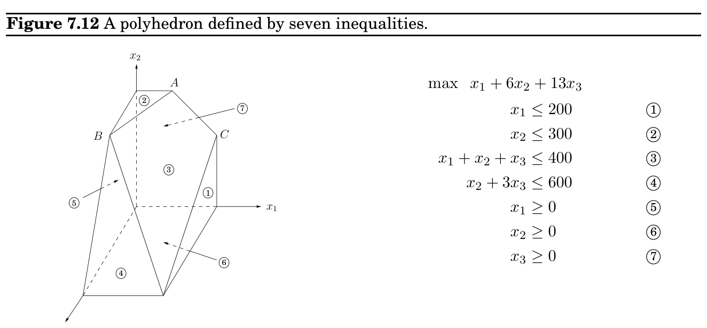
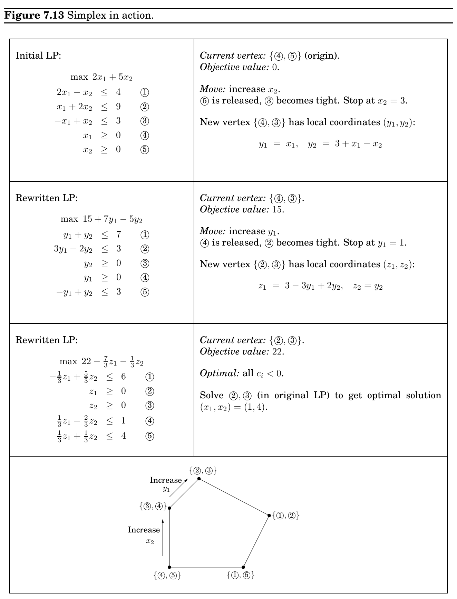

import Guide from '@/components/Guide.astro';
import Knowledge from '@/components/Knowledge.astro';
import Example from '@/components/Example.astro';
import Analysis from '@/components/Analysis.astro';
import Solution from '@/components/Solution.astro';
import Variant from '@/components/Variant.astro';
import Note from '@/components/Note.astro';
import Block from '@/components/Block.astro';
import Method from '@/components/Method.astro';
import Exercise from '@/components/Exercise.astro';

## 7.6 The simplex algorithm

In LP form, this is

min w −3y_&#123;1&#125; + y_&#123;2&#125; + w ≥0

2y_&#123;1&#125; −y_&#123;2&#125; + w ≥0 y_&#123;1&#125; + y_&#123;2&#125; = 1 y_&#123;1&#125;, y_&#123;2&#125; ≥0

The crucial observation now is that these two LPs are dual to each other (see Figure 7.11)! Hence, they have the same optimum, call it V .

Let us summarize. By solving an LP, Row (the maximizer) can determine a strategy for herself that guarantees an expected outcome of at least V no matter what Column does. And by solving the dual LP, Column (the minimizer) can guarantee an expected outcome of at most V , no matter what Row does. It follows that this is the uniquely defined optimal play: a priori it wasn’t even certain that such a play existed. V is known as the value of the game. In our example, it is 1/7 and is realized when Row plays her optimum mixed strategy (3/7, 4/7) and Column plays his optimum mixed strategy (2/7, 5/7).

This example is easily generalized to arbitrary games and shows the existence of mixed strategies that are optimal for both players and achieve the same value—a fundamental result of game theory called the min-max theorem. It can be written in equation form as follows:

max

x min

y

X

i,j

G_&#123;ij&#125;x_&#123;i&#125;y_&#123;j&#125; = min

y max

x

X

i,j

G_&#123;ij&#125;x_&#123;i&#125;y_&#123;j&#125;.

This is surprising, because the left-hand side, in which Row has to announce her strategy first, should presumably be better for Column than the right-hand side, in which he has to go first. Duality equalizes the two, as it did with maximum flows and minimum cuts.

The extraordinary power and expressiveness of linear programs would be little consolation if we did not have a way to solve them efficiently. This is the role of the simplex algorithm.

At a high level, the simplex algorithm takes a set of linear inequalities and a linear objective function and finds the optimal feasible point by the following strategy:

let v be any vertex of the feasible region while there is a neighbor v^&#123;′&#125; of v with better objective value:

set v = v^&#123;′&#125;

In our 2D and 3D examples (Figure 7.1 and Figure 7.2), this was simple to visualize and made intuitive sense. But what if there are n variables, x_&#123;1&#125;, . . . , x_&#123;n&#125;?

Any setting of the x_&#123;i&#125;’s can be represented by an n-tuple of real numbers and plotted in n-dimensional space. A linear equation involving the x_&#123;i&#125;’s defines a hyperplane in this same space R^&#123;n&#125;, and the corresponding linear inequality defines a half-space, all points that are either precisely on the hyperplane or lie on one particular side of it. Finally, the feasible region of the linear program is specified by a set of inequalities and is therefore the intersection of the corresponding half-spaces, a convex polyhedron.

But what do the concepts of vertex and neighbor mean in this general context?

### 7.6.1 Vertices and neighbors in n-dimensional space

Figure 7.12 recalls an earlier example. Looking at it closely, we see that each vertex is the unique point at which some subset of hyperplanes meet. Vertex A, for instance, is the sole point at which constraints 2⃝, 3⃝, and 7⃝are satisfied with equality. On the other hand, the hyperplanes corresponding to inequalities 4⃝and 6⃝do not define a vertex, because their intersection is not just a single point but an entire line.

Let’s make this definition precise.

Pick a subset of the inequalities. If there is a unique point that satisfies them with equality, and this point happens to be feasible, then it is a vertex.

How many equations are needed to uniquely identify a point? When there are n variables, we need at least n linear equations if we want a unique solution. On the other hand, having more than n equations is redundant: at least one of them can be rewritten as a linear combination of the others and can therefore be disregarded. In short,

Each vertex is specified by a set of n inequalities.^&#123;3&#125;

A notion of neighbor now follows naturally.

Two vertices are neighbors if they have n −1 defining inequalities in common.

In Figure 7.12, for instance, vertices A and C share the two defining inequalities &#123;^&#123; &#125;3⃝,^&#123; &#125;7⃝&#125; and are thus neighbors.

3There is one tricky issue here. It is possible that the same vertex might be generated by different subsets of inequalities. In Figure 7.12, vertex B is generated by &#123; 2⃝, 3⃝, 4⃝&#125;, but also by &#123; 2⃝, 4⃝, 5⃝&#125;. Such vertices are called degenerate and require special consideration. Let’s assume for the time being that they don’t exist, and we’ll return to them later.

### 7.6.2 The algorithm

On each iteration, simplex has two tasks:

1. Check whether the current vertex is optimal (and if so, halt).

2. Determine where to move next.

As we will see, both tasks are easy if the vertex happens to be at the origin. And if the vertex is elsewhere, we will transform the coordinate system to move it to the origin!

First let’s see why the origin is so convenient. Suppose we have some generic LP

max c^&#123;T&#125; x

Ax ≤b

x ≥0

where x is the vector of variables, x = (x_&#123;1&#125;, . . . , x_&#123;n&#125;). Suppose the origin is feasible. Then it is certainly a vertex, since it is the unique point at which the n inequalities &#123;x_&#123;1&#125; ≥0, . . . , x_&#123;n&#125; ≥0&#125; are tight. Now let’s solve our two tasks. Task 1:

The origin is optimal if and only if all c_&#123;i&#125; ≤0.

If all c_&#123;i&#125; ≤0, then considering the constraints x ≥0, we can’t hope for a better objective value. Conversely, if some c_&#123;i&#125; > 0, then the origin is not optimal, since we can increase the objective function by raising x_&#123;i&#125;.

Thus, for task 2, we can move by increasing some x_&#123;i&#125; for which c_&#123;i&#125; > 0. How much can we increase it? Until we hit some other constraint. That is, we release the tight constraint x_&#123;i&#125; ≥0 and increase x_&#123;i&#125; until some other inequality, previously loose, now becomes tight. At that point, we again have exactly n tight inequalities, so we are at a new vertex.

For instance, suppose we’re dealing with the following linear program.

max 2x_&#123;1&#125; + 5x_&#123;2&#125; 2x_&#123;1&#125; −x_&#123;2&#125; ≤ 4 1⃝

x_&#123;1&#125; + 2x_&#123;2&#125; ≤ 9 2⃝

−x_&#123;1&#125; + x_&#123;2&#125; ≤ 3 3⃝

x_&#123;1&#125; ≥ 0 4⃝

x_&#123;2&#125; ≥ 0 5⃝

Simplex can be started at the origin, which is specified by constraints 4⃝and_&#123; &#125;5⃝. To move, we release the tight constraint x_&#123;2&#125; ≥0. As x_&#123;2&#125; is gradually increased, the first constraint it runs into is −x_&#123;1&#125; + x_&#123;2&#125; ≤3, and thus it has to stop at x_&#123;2&#125; = 3, at which point this new inequality is tight. The new vertex is thus given by 3⃝and_&#123; &#125;4⃝.

So we know what to do if we are at the origin. But what if our current vertex u is elsewhere? The trick is to transform u into the origin, by shifting the coordinate system from the usual (x_&#123;1&#125;, . . . , x_&#123;n&#125;) to the “local view” from u. These local coordinates consist of (appropriately scaled) distances y_&#123;1&#125;, . . . , y_&#123;n&#125; to the n hyperplanes (inequalities) that define and enclose u:

y_&#123;2&#125; y_&#123;1&#125;

x

u

Specifically, if one of these enclosing inequalities is a_&#123;i&#125; · x ≤b_&#123;i&#125;, then the distance from a point x to that particular “wall” is

y_&#123;i&#125; = b_&#123;i&#125; −a_&#123;i&#125; · x.

The n equations of this type, one per wall, define the y_&#123;i&#125;’s as linear functions of the x_&#123;i&#125;’s, and this relationship can be inverted to express the x_&#123;i&#125;’s as a linear function of the y_&#123;i&#125;’s. Thus we can rewrite the entire LP in terms of the y’s. This doesn’t fundamentally change it (for instance, the optimal value stays the same), but expresses it in a different coordinate frame. The revised “local” LP has the following three properties:

1. It includes the inequalities y ≥0, which are simply the transformed versions of the inequalities defining u.

2. u itself is the origin in y-space.

3. The cost function becomes max c_&#123;u&#125; + ˜c^&#123;T&#125; y, where c_&#123;u&#125; is the value of the objective function at u and ˜c is a transformed cost vector.

In short, we are back to the situation we know how to handle! Figure 7.13 shows this algorithm in action, continuing with our earlier example.

The simplex algorithm is now fully defined. It moves from vertex to neighboring vertex, stopping when the objective function is locally optimal, that is, when the coordinates of the local cost vector are all zero or negative. As we’ve just seen, a vertex with this property must also be globally optimal. On the other hand, if the current vertex is not locally optimal, then its local coordinate system includes some dimension along which the objective function can be improved, so we move along this direction—along this edge of the polyhedron—until we reach a neighboring vertex. By the nondegeneracy assumption (see footnote 3 in Section 7.6.1), this edge has nonzero length, and so we strictly improve the objective value. Thus the process must eventually halt.

### 7.6.3 Loose ends

There are several important issues in the simplex algorithm that we haven’t yet mentioned.

The starting vertex. How do we find a vertex at which to start simplex? In our 2D and 3D examples we always started at the origin, which worked because the linear programs happened to have inequalities with positive right-hand sides. In a general LP we won’t always be so fortunate. However, it turns out that finding a starting vertex can be reduced to an LP and solved by simplex!

To see how this is done, start with any linear program in standard form (recall Section 7.1.4), since we know LPs can always be rewritten this way.

min c^&#123;T&#125; x such that Ax = b and x ≥0.

We first make sure that the right-hand sides of the equations are all nonnegative: if b_&#123;i&#125; &lt; 0, just multiply both sides of the ith equation by −1.

Then we create a new LP as follows:

• Create m new artificial variables z_&#123;1&#125;, . . . , z_&#123;m&#125; ≥0, where m is the number of equations.

• Add z_&#123;i&#125; to the left-hand side of the ith equation.

• Let the objective, to be minimized, be z_&#123;1&#125; + z_&#123;2&#125; + · · · + z_&#123;m&#125;.

For this new LP, it’s easy to come up with a starting vertex, namely, the one with z_&#123;i&#125; = b_&#123;i&#125; for all i and all other variables zero. Therefore we can solve it by simplex, to obtain the optimum solution.

There are two cases. If the optimum value of z_&#123;1&#125; + · · · + z_&#123;m&#125; is zero, then all z_&#123;i&#125;’s obtained by simplex are zero, and hence from the optimum vertex of the new LP we get a starting feasible vertex of the original LP, just by ignoring the z_&#123;i&#125;’s. We can at last start simplex!

But what if the optimum objective turns out to be positive? Let us think. We tried to minimize the sum of the z_&#123;i&#125;’s, but simplex decided that it cannot be zero. But this means that the original linear program is infeasible: it needs some nonzero z_&#123;i&#125;’s to become feasible. This is how simplex discovers and reports that an LP is infeasible.

Degeneracy. In the polyhedron of Figure 7.12 vertex B is degenerate. Geometrically, this means that it is the intersection of more than n = 3 faces of the polyhedron (in this case,

2⃝,^&#123; &#125;3⃝,^&#123; &#125;4⃝,^&#123; &#125;5⃝). Algebraically, it means that if we choose any one of four sets of three inequalities (&#123;^&#123; &#125;2⃝,^&#123; &#125;3⃝,^&#123; &#125;4⃝&#125;, &#123;^&#123; &#125;2⃝,^&#123; &#125;3⃝,^&#123; &#125;5⃝&#125;, &#123;^&#123; &#125;2⃝,^&#123; &#125;4⃝,^&#123; &#125;5⃝&#125;, and &#123;^&#123; &#125;3⃝,^&#123; &#125;4⃝,^&#123; &#125;5⃝&#125;) and solve the corresponding system of three linear equations in three unknowns, we’ll get the same solution in all four cases: (0, 300, 100). This is a serious problem: simplex may return a suboptimal degenerate vertex simply because all its neighbors are identical to it and thus have no better objective. And if we modify simplex so that it detects degeneracy and continues to hop from vertex to vertex despite lack of any improvement in the cost, it may end up looping forever.

One way to fix this is by a perturbation: change each b_&#123;i&#125; by a tiny random amount to b_&#123;i&#125; ± ϵ_&#123;i&#125;. This doesn’t change the essence of the LP since the ϵ_&#123;i&#125;’s are tiny, but it has the effect of differentiating between the solutions of the linear systems. To see why geometrically, imagine that the four planes_&#123; &#125;2⃝,^&#123; &#125;3⃝,^&#123; &#125;4⃝,^&#123; &#125;5⃝were jolted a little. Wouldn’t vertex B split into two vertices, very

close to one another?

Unboundedness. In some cases an LP is unbounded, in that its objective function can be made arbitrarily large (or small, if it’s a minimization problem). If this is the case, simplex will discover it: in exploring the neighborhood of a vertex, it will notice that taking out an inequality and adding another leads to an underdetermined system of equations that has an infinity of solutions. And in fact (this is an easy test) the space of solutions contains a whole line across which the objective can become larger and larger, all the way to ∞. In this case simplex halts and complains.

### 7.6.4 The running time of simplex

What is the running time of simplex, for a generic linear program

max c^&#123;T&#125; x such that Ax ≤0 and x ≥0,

where there are n variables and A contains m inequality constraints? Since it is an iterative algorithm that proceeds from vertex to vertex, let’s start by computing the time taken for a single iteration. Suppose the current vertex is u. By definition, it is the unique point at which n inequality constraints are satisfied with equality. Each of its neighbors shares n−1 of these inequalities, so u can have at most n·m neighbors: choose which inequality to drop and which new one to add.

A naive way to perform an iteration would be to check each potential neighbor to see whether it really is a vertex of the polyhedron and to determine its cost. Finding the cost is quick, just a dot product, but checking whether it is a true vertex involves solving a system of n equations in n unknowns (that is, satisfying the n chosen inequalities exactly) and checking whether the result is feasible. By Gaussian elimination (see the following box) this takes O(n^&#123;3&#125;) time, giving an unappetizing running time of O(mn^&#123;4&#125;) per iteration.

Fortunately, there is a much better way, and this mn^&#123;4&#125; factor can be improved to mn, making simplex a practical algorithm. Recall our earlier discussion (Section 7.6.2) about the local view from vertex u. It turns out that the per-iteration overhead of rewriting the LP in terms of the current local coordinates is just O((m + n)n); this exploits the fact that the local view changes only slightly between iterations, in just one of its defining inequalities.

Next, to select the best neighbor, we recall that the (local view of) the objective function is of the form “max c_&#123;u&#125;+˜c·y” where c_&#123;u&#125; is the value of the objective function at u. This immediately identifies a promising direction to move: we pick any ˜c_&#123;i&#125; > 0 (if there is none, then the current vertex is optimal and simplex halts). Since the rest of the LP has now been rewritten in terms of the y-coordinates, it is easy to determine how much y_&#123;i&#125; can be increased before some other inequality is violated. (And if we can increase y_&#123;i&#125; indefinitely, we know the LP is unbounded.)

It follows that the running time per iteration of simplex is just O(mn). But how many iterations could there be? Naturally, there can’t be more than

m+n

n



, which is an upper bound on the number of vertices. But this upper bound is exponential in n. And in fact, there are examples of LPs for which simplex does indeed take an exponential number of iterations. In other words, simplex is an exponential-time algorithm. However, such exponential examples do not occur in practice, and it is this fact that makes simplex so valuable and so widely used.

### Gaussian elimination

Under our algebraic definition, merely writing down the coordinates of a vertex involves solving a system of linear equations. How is this done?

We are given a system of n linear equations in n unknowns, say n = 4 and

x_&#123;1&#125; −2x_&#123;3&#125; = 2 x_&#123;2&#125; + x_&#123;3&#125; = 3 x_&#123;1&#125; + x_&#123;2&#125; −x_&#123;4&#125; = 4 x_&#123;2&#125; + 3x_&#123;3&#125; + x_&#123;4&#125; = 5

The high school method for solving such systems is to repeatedly apply the following rule: if we add a multiple of one equation to another equation, the overall system of equations remains equivalent. For example, adding −1 times the first equation to the third one, we get the equivalent system

x_&#123;1&#125; −2x_&#123;3&#125; = 2 x_&#123;2&#125; + x_&#123;3&#125; = 3 x_&#123;2&#125; + 2x_&#123;3&#125; −x_&#123;4&#125; = 2 x_&#123;2&#125; + 3x_&#123;3&#125; + x_&#123;4&#125; = 5

This transformation is clever in the following sense: it eliminates the variable x_&#123;1&#125; from the third equation, leaving just one equation with x_&#123;1&#125;. In other words, ignoring the first equation, we have a system of three equations in three unknowns: we decreased n by 1! We can solve this smaller system to get x_&#123;2&#125;, x_&#123;3&#125;, x_&#123;4&#125;, and then plug these into the first equation to get x_&#123;1&#125;.

This suggests an algorithm—once more due to Gauss.

procedure gauss(E, X) Input: A system E = &#123;e_&#123;1&#125;, . . . , e_&#123;n&#125;&#125; of equations in n unknowns X = &#123;x_&#123;1&#125;, . . . , x_&#123;n&#125;&#125;: e_&#123;1&#125; : a_&#123;11&#125;x_&#123;1&#125; + a_&#123;12&#125;x_&#123;2&#125; + · · · + a_&#123;1&#125;nx_&#123;n&#125; = b_&#123;1&#125;; · · · ; e_&#123;n&#125; : a_&#123;n&#125;1x_&#123;1&#125; + a_&#123;n&#125;2x_&#123;2&#125; + · · · + a_&#123;nn&#125;x_&#123;n&#125; = b_&#123;n&#125; Output: A solution of the system, if one exists

if all coefficients a_&#123;i&#125;1 are zero:

halt with message ‘‘either infeasible or not linearly independent’’ if n = 1: return b_&#123;1&#125;/a_&#123;11&#125;

choose the coefficient a_&#123;p&#125;1 of largest magnitude, and swap equations e_&#123;1&#125;, e_&#123;p&#125; for i = 2 to n:

e_&#123;i&#125; = e_&#123;i&#125; −(a_&#123;i&#125;1/a_&#123;11&#125;) · e_&#123;1&#125; (x_&#123;2&#125;, . . . , x_&#123;n&#125;) = gauss(E −&#123;e_&#123;1&#125;&#125;, X −&#123;x_&#123;1&#125;&#125;) x_&#123;1&#125; = (b_&#123;1&#125; −P

j>1 a_&#123;1&#125;jx_&#123;j&#125;)/a_&#123;11&#125; return (x_&#123;1&#125;, . . . , x_&#123;n&#125;)

(When choosing the equation to swap into first place, we pick the one with largest |a_&#123;p&#125;1| for reasons of numerical accuracy; after all, we will be dividing by a_&#123;p&#125;1.)

Gaussian elimination uses O(n^&#123;2&#125;) arithmetic operations to reduce the problem size from n to n −1, and thus uses O(n^&#123;3&#125;) operations overall. To show that this is also a good estimate of the total running time, we need to argue that the numbers involved remain polynomially bounded—for instance, that the solution (x_&#123;1&#125;, . . . , x_&#123;n&#125;) does not require too much more precision to write down than the original coefficients a_&#123;ij&#125; and b_&#123;i&#125;. Do you see why this is true?
