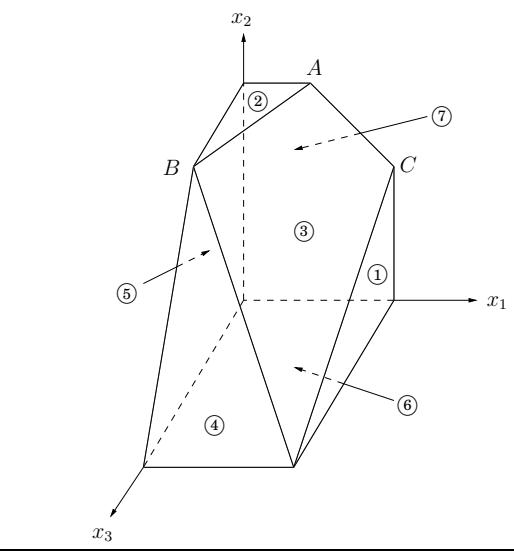
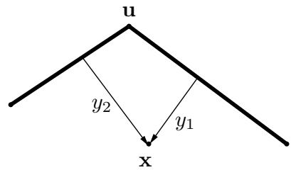
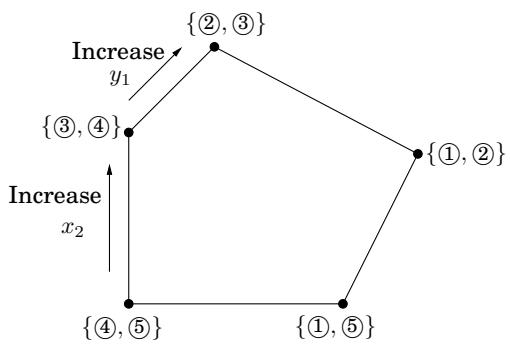

import Guide from '@/components/Guide.astro';
import Knowledge from '@/components/Knowledge.astro';
import Example from '@/components/Example.astro';
import Analysis from '@/components/Analysis.astro';
import Solution from '@/components/Solution.astro';
import Variant from '@/components/Variant.astro';
import Note from '@/components/Note.astro';
import Block from '@/components/Block.astro';
import Method from '@/components/Method.astro';
import Exercise from '@/components/Exercise.astro';
import Algorithm from '@/components/Algorithm.astro';

## 7.6 The simplex algorithm

The extraordinary power and expressiveness of linear programs would be little consolation if we did not have a way to solve them efficiently. This is the role of the simplex algorithm.

At a high level, the simplex algorithm takes a set of linear inequalities and a linear objective function and finds the optimal feasible point by the following strategy:

<Algorithm>
let v be any vertex of the feasible region
while there is a neighbor $v'$ of v with better objective value:
    set $v = v'$
</Algorithm>

In our 2D and 3D examples (Figure 7.1 and Figure 7.2), this was simple to visualize and made intuitive sense. But what if there are n variables, $x _ { 1 } , \ldots , x _ { n } ?$

Any setting of the $x _ { i } \mathbf { \dot { s } }$ can be represented by an n-tuple of real numbers and plotted in n-dimensional space. A linear equation involving the $x _ { i } { \bf \dot { s } }$ defines a hyperplane in this same space $\mathbb { R } ^ { n }$ , and the corresponding linear inequality defines a half-space, all points that are either precisely on the hyperplane or lie on one particular side of it. Finally, the feasible region of the linear program is specified by a set of inequalities and is therefore the intersection of the corresponding half-spaces, a convex polyhedron.

But what do the concepts of vertex and neighbor mean in this general context?

5

6

Figure 7.12 A polyhedron defined by seven inequalities.

$$
\max x _ {1} + 6 x _ {2} + 1 3 x _ {3}
$$

$$
x _ {1} \leq 2 0 0\tag{①}
$$

$$
x _ {2} \leq 3 0 0\tag{②}
$$

$$
x _ {1} + x _ {2} + x _ {3} \leq 4 0 0
$$

$$
x _ {2} + 3 x _ {3} \leq 6 0 0
$$

$$
x _ {1} \geq 0\tag{③}
$$

$$
x _ {2} \geq 0\tag{④}
$$

$$
x _ {3} \geq 0
$$

## 7.6.1 Vertices and neighbors in n-dimensional space

Figure 7.12 recalls an earlier example. Looking at it closely, we see that each vertex is the unique point at which some subset of hyperplanes meet. Vertex A, for instance, is the sole point at which constraints 2 , 3 , and 7 are satisfied with equality. On the other hand, the hyperplanes corresponding to inequalities 4 and 6 do not define a vertex, because their intersection is not just a single point but an entire line.

Let's make this definition precise.

Pick a subset of the inequalities. If there is a unique point that satisfies them with equality, and this point happens to be feasible, then it is a vertex.

How many equations are needed to uniquely identify a point? When there are n variables, we need at least n linear equations if we want a unique solution. On the other hand, having more than n equations is redundant: at least one of them can be rewritten as a linear combination of the others and can therefore be disregarded. In short,

Each vertex is specified by a set of n inequalities.3

A notion of neighbor now follows naturally.

Two vertices are neighbors if they have n  1 defining inequalities in common.

In Figure 7.12, for instance, vertices A and C share the two defining inequalities $\{ \textcircled{3 } , \textcircled{7} \}$ and are thus neighbors.

## 7.6.2 The algorithm

On each iteration, simplex has two tasks:

1. Check whether the current vertex is optimal (and if so, halt).

2. Determine where to move next.

As we will see, both tasks are easy if the vertex happens to be at the origin. And if the vertex is elsewhere, we will transform the coordinate system to move it to the origin!

First let's see why the origin is so convenient. Suppose we have some generic LP

$$
\begin{array}{c} \max \mathbf {c} ^ {T} \mathbf {x} \\ \mathbf {A x} \leq \mathbf {b} \\ \mathbf {x} \geq 0 \end{array}
$$

where x is the vector of variables, $\mathbf { x } = ( x _ { 1 } , \ldots , x _ { n } )$ . Suppose the origin is feasible. Then it is certainly a vertex, since it is the unique point at which the n inequalities $\{ x _ { 1 } \geq 0 , \ldots , x _ { n } \geq 0 \}$ are tight. Now let's solve our two tasks. Task 1:

The origin is optimal if and only if all $c _ { i } \leq 0$

If all $c _ { i } \leq 0$ , then considering the constraints $\mathbf { x } \geq 0$ , we can't hope for a better objective value. Conversely, if some $c _ { i } > 0$ , then the origin is not optimal, since we can increase the objective function by raising $x _ { i }$

Thus, for task 2, we can move by increasing some $x _ { i }$ for which $c _ { i } > 0$ . How much can we increase it? Until we hit some other constraint. That is, we release the tight constraint $x _ { i } \geq 0$ and increase $x _ { i }$ until some other inequality, previously loose, now becomes tight. At that point, we again have exactly n tight inequalities, so we are at a new vertex.

For instance, suppose we're dealing with the following linear program.

$$
\begin{array}{r l r} \max 2 x _ {1} + 5 x _ {2} \\ 2 x _ {1} - x _ {2} & \leq 4 & \text {①} \\ x _ {1} + 2 x _ {2} & \leq 9 & \text {②} \\ - x _ {1} + x _ {2} & \leq 3 & \text {③} \\ x _ {1} & \geq 0 & \text {④} \\ x _ {2} & \geq 0 & \text {⑤} \end{array}
$$

Simplex can be started at the origin, which is specified by constraints $\textcircled{4}$ and $\textcircled{5}$ . To move, we release the tight constraint $x _ { 2 } \geq 0$ . As $x _ { 2 }$ is gradually increased, the first constraint it runs into is $- x _ { 1 } + x _ { 2 } \leq 3$ , and thus it has to stop at $x _ { 2 } = 3$ , at which point this new inequality is tight. The new vertex is thus given by 3 and 4 .

So we know what to do if we are at the origin. But what if our current vertex u is elsewhere? The trick is to transform u into the origin, by shifting the coordinate system from the usual $( x _ { 1 } , \ldots , x _ { n } )$ to the “local view” from u. These local coordinates consist of (appropriately scaled) distances $y _ { 1 } , \ldots , y _ { n }$ to the n hyperplanes (inequalities) that define and enclose u:

Specifically, if one of these enclosing inequalities is $\mathbf { a } _ { i } \cdot \mathbf { x } \leq b _ { i }$ , then the distance from a point x to that particular “wall” is

$$
y _ {i} = b _ {i} - \mathbf {a} _ {i} \cdot \mathbf {x}.
$$

The n equations of this type, one per wall, define the $y _ { i } \mathbf { \vec { s } }$ as linear functions of the $x _ { i } \mathbf { \bar { s } } ,$ , and this relationship can be inverted to express the $x _ { i } { \bf \dot { s } }$ as a linear function of the $y _ { i } \mathbf { \vec { s } }$ . Thus we can rewrite the entire LP in terms of the $y ^ { \prime } \mathbf { s } .$ . This doesn't fundamentally change it (for instance, the optimal value stays the same), but expresses it in a different coordinate frame. The revised “local” LP has the following three properties:

1. It includes the inequalities $\textbf { y } \geq 0$ , which are simply the transformed versions of the inequalities defining u.

2. u itself is the origin in y-space.

3. The cost function becomes max $c _ { \mathbf { u } } + \tilde { \mathbf { c } } ^ { T } \mathbf { y }$ , where $c _ { \mathbf { u } }$ is the value of the objective function at u and c˜ is a transformed cost vector.

In short, we are back to the situation we know how to handle! Figure 7.13 shows this algorithm in action, continuing with our earlier example.

The simplex algorithm is now fully defined. It moves from vertex to neighboring vertex, stopping when the objective function is locally optimal, that is, when the coordinates of the local cost vector are all zero or negative. As we've just seen, a vertex with this property must also be globally optimal. On the other hand, if the current vertex is not locally optimal, then its local coordinate system includes some dimension along which the objective function can be improved, so we move along this direction—along this edge of the polyhedron—until we reach a neighboring vertex. By the nondegeneracy assumption (see footnote 3 in Section 7.6.1), this edge has nonzero length, and so we strictly improve the objective value. Thus the process must eventually halt.

Figure 7.13 Simplex in action.

<table><tr><td>Initial LP: $\max 2x_1 + 5x_2$  $2x_1 - x_2 \leq 4$  1 $x_1 + 2x_2 \leq 9$  2 $-x_1 + x_2 \leq 3$  3 $x_1 \geq 0$  4 $x_2 \geq 0$  5</td><td>Current vertex: &#123;4,5&#125; (origin).Objective value: 0.Move: increase  $x_2$ .5 is released, 3 becomes tight. Stop at  $x_2 = 3$ .New vertex &#123;4,3&#125; has local coordinates  $(y_1, y_2)$ : $y_1 = x_1, \quad y_2 = 3 + x_1 - x_2$ </td></tr><tr><td>Rewritten LP: $\max 15 + 7y_1 - 5y_2$  $y_1 + y_2 \leq 7$  1 $3y_1 - 2y_2 \leq 3$  2 $y_2 \geq 0$  3 $y_1 \geq 0$  4 $-y_1 + y_2 \leq 3$  5</td><td>Current vertex: &#123;4,3&#125;.Objective value: 15.Move: increase  $y_1$ .4 is released, 2 becomes tight. Stop at  $y_1 = 1$ .New vertex &#123;2,3&#125; has local coordinates  $(z_1, z_2)$ : $z_1 = 3 - 3y_1 + 2y_2, \quad z_2 = y_2$ </td></tr><tr><td>Rewritten LP: $\max 22 - \frac{7}{3}z_1 - \frac{1}{3}z_2$  $-\frac{1}{3}z_1 + \frac{5}{3}z_2 \leq 6$  1 $z_1 \geq 0$  2 $z_2 \geq 0$  3 $\frac{1}{3}z_1 - \frac{2}{3}z_2 \leq 1$  4 $\frac{1}{3}z_1 + \frac{1}{3}z_2 \leq 4$  5</td><td>Current vertex: &#123;2,3&#125;.Objective value: 22.Optimal: all  $c_i < 0$ .Solve 2,3 (in original LP) to get optimal solution  $(x_1, x_2) = (1, 4)$ .</td></tr><tr><td colspan="2"></td></tr></table>

## 7.6.3 Loose ends

There are several important issues in the simplex algorithm that we haven't yet mentioned.

The starting vertex. How do we find a vertex at which to start simplex? In our 2D and 3D examples we always started at the origin, which worked because the linear programs happened to have inequalities with positive right-hand sides. In a general LP we won't always be so fortunate. However, it turns out that finding a starting vertex can be reduced to an LP and solved by simplex!

To see how this is done, start with any linear program in standard form (recall Section 7.1.4), since we know LPs can always be rewritten this way.

$$
\min \mathbf {c} ^ {T} \mathbf {x} \text {   such   that   } \mathbf {A x} = \mathbf {b} \text {   and   } \mathbf {x} \geq 0.
$$

We first make sure that the right-hand sides of the equations are all nonnegative: if $b _ { i } < 0$ just multiply both sides of the ith equation by 1.

Then we create a new LP as follows:

Create m new artificial variables $z _ { 1 } , \ldots , z _ { m } \geq 0 $ , where m is the number of equations.

$\mathbf { A d d } \ z _ { i }$ to the left-hand side of the ith equation.

Let the objective, to be minimized, be $z _ { 1 } + z _ { 2 } + \dots + z _ { m }$

For this new LP, it's easy to come up with a starting vertex, namely, the one with $z _ { i } = b _ { i }$ for all i and all other variables zero. Therefore we can solve it by simplex, to obtain the optimum solution.

There are two cases. If the optimum value of $z _ { 1 } + \cdots + z _ { m }$ is zero, then all $z _ { i } \mathbf { \dot { s } }$ obtained by simplex are zero, and hence from the optimum vertex of the new LP we get a starting feasible vertex of the original LP, just by ignoring the $z _ { i } \mathbf { \dot { s } } .$ . We can at last start simplex!

But what if the optimum objective turns out to be positive? Let us think. We tried to minimize the sum of the $z _ { i } \mathbf { \dot { s } } ,$ but simplex decided that it cannot be zero. But this means that the original linear program is infeasible: it needs some nonzero $z _ { i } \mathbf { \dot { s } }$ to become feasible. This is how simplex discovers and reports that an LP is infeasible.

Degeneracy. In the polyhedron of Figure 7.12 vertex B is degenerate. Geometrically, this means that it is the intersection of more than $n = 3$ faces of the polyhedron (in this case, $\textcircled { 2 } , \textcircled { 3 } , \textcircled { 4 } , \textcircled { 5 } )$ . Algebraically, it means that if we choose any one of four sets of three inequalities $( \{ \textcircled { 2 } , \textcircled { 3 } , \textcircled { 4 } \} , \{ \textcircled { 2 } , \textcircled { 3 } , \textcircled { 5 } \} , \{ \textcircled { 2 } , \textcircled { 4 } , \textcircled { 5 } \}$ , and 3 , 4 , 5 ) and solve the corresponding system of three linear equations in three unknowns, we'll get the same solution in all four cases: (0, 300, 100). This is a serious problem: simplex may return a suboptimal degenerate vertex simply because all its neighbors are identical to it and thus have no better objective. And if we modify simplex so that it detects degeneracy and continues to hop from vertex to vertex despite lack of any improvement in the cost, it may end up looping forever.

One way to fix this is by a perturbation: change each $b _ { i }$ by a tiny random amount to $b _ { i } \pm \epsilon _ { i }$ This doesn't change the essence of the LP since the $\epsilon _ { i } \mathbf { \dot { s } }$ are tiny, but it has the effect of differentiating between the solutions of the linear systems. To see why geometrically, imagine that the four planes 2 , 3 , 4 , 5 were jolted a little. Wouldn't vertex B split into two vertices, very

Unboundedness. In some cases an LP is unbounded, in that its objective function can be made arbitrarily large (or small, if it's a minimization problem). If this is the case, simplex will discover it: in exploring the neighborhood of a vertex, it will notice that taking out an inequality and adding another leads to an underdetermined system of equations that has an infinity of solutions. And in fact (this is an easy test) the space of solutions contains a whole line across which the objective can become larger and larger, all the way to $\infty .$ . In this case simplex halts and complains.

## 7.6.4 The running time of simplex

What is the running time of simplex, for a generic linear program

$$
\max \mathbf {c} ^ {T} \mathbf {x} \text {   such   that   } \mathbf {A x} \leq 0 \text {   and   } \mathbf {x} \geq 0,
$$

where there are n variables and A contains m inequality constraints? Since it is an iterative algorithm that proceeds from vertex to vertex, let's start by computing the time taken for a single iteration. Suppose the current vertex is u. By definition, it is the unique point at which n inequality constraints are satisfied with equality. Each of its neighbors shares $n - 1$ of these inequalities, so u can have at most n m neighbors: choose which inequality to drop and which new one to add.

A naive way to perform an iteration would be to check each potential neighbor to see whether it really is a vertex of the polyhedron and to determine its cost. Finding the cost is quick, just a dot product, but checking whether it is a true vertex involves solving a system of n equations in n unknowns (that is, satisfying the n chosen inequalities exactly) and checking whether the result is feasible. By Gaussian elimination (see the following box) this takes $O ( n ^ { 3 } )$ time, giving an unappetizing running time of $O ( m n ^ { 4 } )$ per iteration.

Fortunately, there is a much better way, and this $m n ^ { 4 }$ factor can be improved to $m n ,$ , making simplex a practical algorithm. Recall our earlier discussion (Section 7.6.2) about the local view from vertex u. It turns out that the per-iteration overhead of rewriting the LP in terms of the current local coordinates is just $O ( ( m + n ) n )$ ; this exploits the fact that the local view changes only slightly between iterations, in just one of its defining inequalities.

Next, to select the best neighbor, we recall that the (local view of) the objective function is of the form “max $c _ { \mathbf { u } } + \tilde { \mathbf { c } } { \cdot } \mathbf { y } ^ { \mathfrak { n } }$ where $c _ { \mathbf { u } }$ is the value of the objective function at u. This immediately identifies a promising direction to move: we pick any $\tilde { c } _ { i } > 0$ (if there is none, then the current vertex is optimal and simplex halts). Since the rest of the LP has now been rewritten in terms of the y-coordinates, it is easy to determine how much $y _ { i }$ can be increased before some other inequality is violated. (And if we can increase $y _ { i }$ indefinitely, we know the LP is unbounded.)

It follows that the running time per iteration of simplex is just $O ( m n )$ . But how many iterations could there be? Naturally, there can't be more than $\textstyle { \binom { m + n } { n } }$ , which is an upper bound on the number of vertices. But this upper bound is exponential in n. And in fact, there are examples of LPs for which simplex does indeed take an exponential number of iterations. In other words, simplex is an exponential-time algorithm. However, such exponential examples do not occur in practice, and it is this fact that makes simplex so valuable and so widely used.

<Knowledge title="Box: Gaussian elimination">

Under our algebraic definition, merely writing down the coordinates of a vertex involves solving a system of linear equations. How is this done?
We are given a system of n linear equations in n unknowns, say n = 4 and
 $x_{1} - 2x_{3} = 2$ $x_{2} + x_{3} = 3$ $x_{1} + x_{2} - x_{4} = 4$ $x_{2} + 3x_{3} + x_{4} = 5$ 
The high school method for solving such systems is to repeatedly apply the following rule: if we add a multiple of one equation to another equation, the overall system of equations remains equivalent. For example, adding -1 times the first equation to the third one, we get the equivalent system
 $x_{1} - 2x_{3} = 2$ $x_{2} + x_{3} = 3$ $x_{2} + 2x_{3} - x_{4} = 2$ $x_{2} + 3x_{3} + x_{4} = 5$ 
This transformation is clever in the following sense: it eliminates the variable  $x_{1}$  from the third equation, leaving just one equation with  $x_{1}$ . In other words, ignoring the first equation, we have a system of three equations in three unknowns: we decreased n by 1! We can solve this smaller system to get  $x_{2}, x_{3}, x_{4}$ , and then plug these into the first equation to get  $x_{1}$ .
This suggests an algorithm—once more due to Gauss.

<Algorithm title="procedure gauss(E, X)">
Input:  A system $E = \{e_1, \ldots, e_n\}$ of equations in n unknowns $X = \{x_1, \ldots, x_n\}$:
        $e_1: a_{11}x_1 + a_{12}x_2 + \cdots + a_{1n}x_n = b_1; \cdots; e_n: a_{n1}x_1 + a_{n2}x_2 + \cdots + a_{nn}x_n = b_n$
Output: A solution of the system, if one exists

if all coefficients $a_{i1}$ are zero:
    halt with message "either infeasible or not linearly independent"
if n = 1: return $b_1/a_{11}$

choose the coefficient $a_{p1}$ of largest magnitude, and swap equations $e_1, e_p$
for i = 2 to n:
    $e_i = e_i - (a_{i1}/a_{11}) \cdot e_1$
$(x_2, \ldots, x_n) = \text{gauss}(E - \{e_1\}, X - \{x_1\})$
$x_1 = (b_1 - \sum_{j>1} a_{1j}x_j) / a_{11}$
return $(x_1, \ldots, x_n)$
</Algorithm>

(When choosing the equation to swap into first place, we pick the one with largest  $|a_{p1}|$  for reasons of numerical accuracy; after all, we will be dividing by  $a_{p1}$ .)
Gaussian elimination uses  $O(n^{2})$  arithmetic operations to reduce the problem size from n to n - 1, and thus uses  $O(n^{3})$  operations overall. To show that this is also a good estimate of the total running time, we need to argue that the numbers involved remain polynomially bounded—for instance, that the solution  $(x_{1}, \ldots, x_{n})$  does not require too much more precision to write down than the original coefficients  $a_{ij}$  and  $b_{i}$ . Do you see why this is true?

</Knowledge>

<Knowledge title="Box: Linear programming in polynomial time">

Simplex is not a polynomial time algorithm. Certain rare kinds of linear programs cause it to go from one corner of the feasible region to a better corner and then to a still better one, and so on for an exponential number of steps. For a long time, linear programming was considered a paradox, a problem that can be solved in practice, but not in theory!

Then, in 1979, a young Soviet mathematician called Leonid Khachiyan came up with the ellipsoid algorithm, one that is very different from simplex, extremely simple in its conception (but sophisticated in its proof) and yet one that solves any linear program in polynomial time. Instead of chasing the solution from one corner of the polyhedron to the next, Khachiyan's algorithm confines it to smaller and smaller ellipsoids (skewed highdimensional balls). When this algorithm was announced, it became a kind of “mathematical Sputnik,” a splashy achievement that had the U.S. establishment worried, in the height of the Cold War, about the possible scientific superiority of the Soviet Union. The ellipsoid algorithm turned out to be an important theoretical advance, but did not compete well with simplex in practice. The paradox of linear programming deepened: A problem with two algorithms, one that is efficient in theory, and one that is efficient in practice!

A few years later Narendra Karmarkar, a graduate student at UC Berkeley, came up with a completely different idea, which led to another provably polynomial algorithm for linear programming. Karmarkar's algorithm is known as the interior point method, because it does just that: it dashes to the optimum corner not by hopping from corner to corner on the surface of the polyhedron like simplex does, but by cutting a clever path in the interior of the polyhedron. And it does perform well in practice.

But perhaps the greatest advance in linear programming algorithms was not Khachiyan's theoretical breakthrough or Karmarkar's novel approach, but an unexpected consequence of the latter: the fierce competition between the two approaches, simplex and interior point, resulted in the development of very fast code for linear programming.

</Knowledge>
