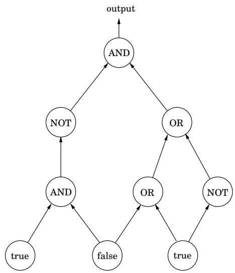
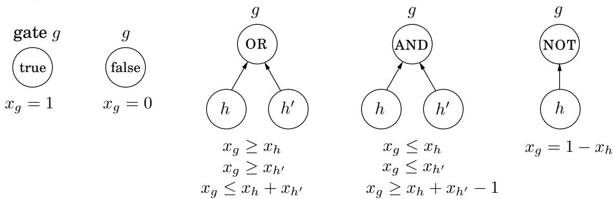

import Guide from '@/components/Guide.astro';
import Knowledge from '@/components/Knowledge.astro';
import Example from '@/components/Example.astro';
import Analysis from '@/components/Analysis.astro';
import Solution from '@/components/Solution.astro';
import Variant from '@/components/Variant.astro';
import Note from '@/components/Note.astro';
import Block from '@/components/Block.astro';
import Method from '@/components/Method.astro';
import Exercise from '@/components/Exercise.astro';

## 7.7 Postscript: circuit evaluation

The importance of linear programming stems from the astounding variety of problems that reduce to it and thereby bear witness to its expressive power. In a sense, this next one is the ultimate application.

We are given a Boolean circuit, that is, a dag of gates of the following types.

Input gates have indegree zero, with value true or false.

AND gates and OR gates have indegree 2.

NOT gates have indegree 1.

In addition, one of the gates is designated as the output. Here's an example.

The CIRCUIT VALUE problem is the following: when the laws of Boolean logic are applied to the gates in topological order, does the output evaluate to true?

There is a simple, automatic way of translating this problem into a linear program. Create a variable $x _ { g }$ for each gate g, with constraints $^ { g , }$ $0 \leq x _ { g } \leq 1$ . Add additional constraints for each type of gate:

These constraints force all the gates to take on exactly the right values—0 for false, and 1 for true. We don't need to maximize or minimize anything, and we can read the answer off from the variable $x _ { o }$ corresponding to the output gate.

This is a straightforward reduction to linear programming, from a problem that may not seem very interesting at first. However, the CIRCUIT VALUE problem is in a sense the most general problem solvable in polynomial time! After all, any algorithm will eventually run on a computer, and the computer is ultimately a Boolean combinational circuit implemented on a chip. If the algorithm runs in polynomial time, it can be rendered as a Boolean circuit consisting of polynomially many copies of the computer's circuit, one per unit of time, with the values of the gates in one layer used to compute the values for the next. Hence, the fact that CIRCUIT VALUE reduces to linear programming means that all problems that can be solved in polynomial time do!

In our next topic, NP-completeness, we shall see that many hard problems reduce, much the same way, to integer programming, linear programming's difficult twin.

Another parting thought: by what other means can the circuit evaluation problem be solved? Let's think—a circuit is a dag. And what algorithmic technique is most appropriate for solving problems on dags? That's right: dynamic programming! Together with linear programming, the world's two most general algorithmic techniques.
