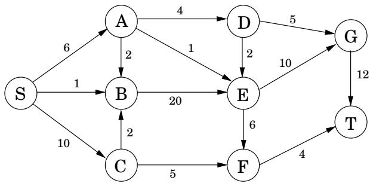
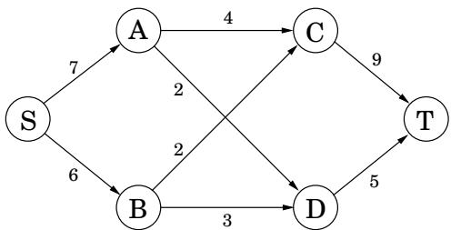
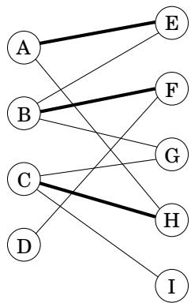
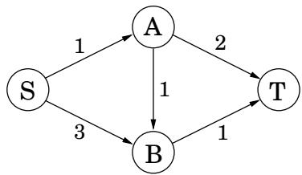
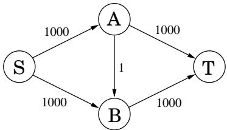

import Guide from '@/components/Guide.astro';
import Knowledge from '@/components/Knowledge.astro';
import Example from '@/components/Example.astro';
import Analysis from '@/components/Analysis.astro';
import Solution from '@/components/Solution.astro';
import Variant from '@/components/Variant.astro';
import Note from '@/components/Note.astro';
import Block from '@/components/Block.astro';
import Method from '@/components/Method.astro';
import Exercise from '@/components/Exercise.astro';

## Chapter 7 Exercises

<Exercise title="Exercise 7.1">

Consider the following linear program.

$$
\begin{array}{c} \text {maximize} 5 x + 3 y \\ 5 x - 2 y \geq 0 \\ x + y \leq 7 \\ x \leq 5 \\ x \geq 0 \\ y \geq 0 \end{array}
$$

Plot the feasible region and identify the optimal solution.

</Exercise>

<Exercise title="Exercise 7.2">

Duckwheat is produced in Kansas and Mexico and consumed in New York and California. Kansas produces 15 shnupells ofduckwheat and Mexico 8. Meanwhile, New York consumes 10 shnupells and California 13. The transportation costs per shnupell are \$4 from Mexico to New York, \$1 from Mexico to California, \$2 from Kansas to New York, and \$3 and from Kansas to California. Write a linear program that decides the amounts of duckwheat (in shnupells and fractions of a shnupell) to be transported from each producer to each consumer, so as to minimize the overall transportation cost.

</Exercise>

<Exercise title="Exercise 7.3">

A cargo plane can carry a maximum weight of 100 tons and a maximum volume of 60 cubic meters. There are three materials to be transported, and the cargo company may choose to carry any amount of each, upto the maximum available limits given below.

Material 1 has density 2 tons/cubic meter, maximum available amount 40 cubic meters, and revenue \$1,000 per cubic meter.

Material 2 has density 1 ton/cubic meter, maximum available amount 30 cubic meters, and revenue \$1,200 per cubic meter.

Material 3 has density 3 tons/cubic meter, maximum available amount 20 cubic meters, and revenue \$12,000 per cubic meter.

Write a linear program that optimizes revenue within the constraints.

</Exercise>

<Exercise title="Exercise 7.4">

Moe is deciding how much Regular Duffbeer and how much Duff Strong beer to order each week. Regular Duff costs Moe \$1 per pint and he sells it at \$2 per pint; Duff Strong costs Moe \$1.50 per pint and he sells it at \$3 per pint. However, as part of a complicated marketing scam, the Duff company will only sell a pint of Duff Strong for each two pints or more of Regular Duff that Moe buys. Furthermore, due to past events that are better left untold, Duff will not sell Moe more than 3,000 pints per week. Moe knows that he can sell however much beer he has. Formulate a linear program for deciding how much Regular Duff and how much Duff Strong to buy, so as to maximize Moe's profit. Solve the program geometrically.

</Exercise>

<Exercise title="Exercise 7.5">

The Canine Products company offers two dog foods, Frisky Pup and Husky Hound, that are made from a blend of cereal and meat. A package of Frisky Pup requires 1 pound of cereal and 1.5 pounds of meat, and sells for \$7. A package of Husky Hound uses 2 pounds of cereal and 1 pound of meat, and sells for \$6. Raw cereal costs \$1 per pound and raw meat costs \$2 per pound. It also costs \$1.40 to package the Frisky Pup and \$0.60 to package the Husky Hound. A total of 240,000 pounds of cereal and 180,000 pounds of meat are available each month. The only production bottleneck is that the factory can only package 110,000 bags of Frisky Pup per month. Needless to say, management would like to maximize profit.

(a) Formulate the problem as a linear program in two variables.

(b) Graph the feasible region, give the coordinates of every vertex, and circle the vertex maximizing profit. What is the maximum profit possible?

</Exercise>

<Exercise title="Exercise 7.6">

Give an example of a linear program in two variables whose feasible region is infinite, but such that there is an optimum solution of bounded cost.

</Exercise>

<Exercise title="Exercise 7.7">

Find necessary and sufficient conditions on the reals a and b under which the linear program

$$
\begin{array}{c} \max x + y \\ a x + b y \leq 1 \\ x, y \geq 0 \end{array}
$$

(a) Is infeasible.

(b) Is unbounded.

(c) Has a unique optimal solution.

</Exercise>

<Exercise title="Exercise 7.8">

You are given the following points in the plane:

$$
(1, 3), (2, 5), (3, 7), (5, 1 1), (7, 1 4), (8, 1 5), (1 0, 1 9).
$$

You want to find a line $a x + b y = c$ that approximately passes through these points (no line is a perfect fit). Write a linear program (you don't need to solve it) to find the line that minimizes the maximum absolute error,

$$
\max _ {1 \leq i \leq 7} | a x _ {i} + b y _ {i} - c |.
$$

</Exercise>

<Exercise title="Exercise 7.9">

A quadraticprogramming problem seeks to maximize a quadratric objective function (with terms like 3x2 or $5 x _ { 1 } x _ { 2 } )$ subject to a set of linear constraints. Give an example of a quadratic program in two variables $x _ { 1 } , x _ { 2 }$ such that the feasible region is nonempty and bounded, and yet none of the vertices of this region optimize the (quadratic) objective.

</Exercise>

<Exercise title="Exercise 7.10">

For the following network, with edge capacities as shown, find the maximum flow from S to $T _ { i }$ , along with a matching cut.

</Exercise>

<Exercise title="Exercise 7.11">

Write the dual to the following linear program.

$$
\begin{array}{c} \max x + y \\ 2 x + y \leq 3 \\ x + 3 y \leq 5 \\ x, y \geq 0 \end{array}
$$

Find the optimal solutions to both primal and dual LPs.

</Exercise>

<Exercise title="Exercise 7.12">

For the linear program

$$
\begin{array}{r} \max x _ {1} - 2 x _ {3} \\ x _ {1} - x _ {2} \leq 1 \\ 2 x _ {2} - x _ {3} \leq 1 \\ x _ {1}, x _ {2}, x _ {3} \geq 0 \end{array}
$$

prove that the solution $( x _ { 1 } , x _ { 2 } , x _ { 3 } ) = ( 3 / 2 , 1 / 2 , 0 )$ is optimal.

</Exercise>

<Exercise title="Exercise 7.13">

Matching pennies. In this simple two-player game, the players (call them R and C) each choose an outcome, heads or tails. If both outcomes are equal, C gives a dollar to $R ;$ if the outcomes are different, R gives a dollar to C.

(a) Represent the payoffs by $\phantom { - } 1 2 \times 2$ matrix.

(b) What is the value of this game, and what are the optimal strategies for the two players?

</Exercise>

<Exercise title="Exercise 7.14">

The pizza business in Little Town is split between two rivals, Tony and Joey. They are each investigating strategies to steal business away from the other. Joey is considering either lowering prices or cutting bigger slices. Tony is looking into starting up a line ofgourmet pizzas, or offering outdoor seating, or giving free sodas at lunchtime. The effects of these various strategies are summarized in the following payoff matrix (entries are dozens of pizzas, Joey's gain and Tony's loss).

<table><tr><td colspan="2"></td><td>Gourmet</td><td>TONY Seating</td><td>Free soda</td></tr><tr><td rowspan="2">JOEY</td><td>Lower price</td><td>+2</td><td>0</td><td>-3</td></tr><tr><td>Bigger slices</td><td>-1</td><td>-2</td><td>+1</td></tr></table>

For instance, if Joey reduces prices and Tony goes with the gourmet option, then Tony will lose 2 dozen pizzas worth of business to Joey.

What is the value of this game, and what are the optimal strategies for Tony and Joey?

</Exercise>

<Exercise title="Exercise 7.15">

Find the value of the game specified by the following payoff matrix.

$$
\begin{array}{c c c c} 0 & 0 & - 1 & - 1 \\ 0 & 1 & - 2 & - 1 \\ - 1 & - 1 & 1 & 1 \\ - 1 & 0 & 0 & 1 \\ 1 & - 2 & 0 & - 3 \\ 1 & - 1 & - 1 & - 1 \\ 0 & - 3 & 2 & - 1 \\ 0 & - 2 & 1 & - 1 \end{array}
$$

(Hint: Consider the mixed strategies $( 1 / 3 , 0 , 0 , 1 / 2 , 1 / 6 , 0 , 0 , 0 ) \mathrm { { a n d } ( 2 / 3 , 0 , 0 , 1 / 3 ) . ) }$

</Exercise>

<Exercise title="Exercise 7.16">

A salad is any combination of the following ingredients: (1) tomato, (2) lettuce, (3) spinach, (4) carrot, and (5) oil. Each salad must contain: (A) at least 15 grams of protein, (B) at least 2 and at most 6 grams of fat, (C) at least 4 grams of carbohydrates, (D) at most 100 milligrams of sodium. Furthermore, (E) you do not want your salad to be more than 50% greens by mass. The nutritional contents of these ingredients (per 100 grams) are

<table><tr><td>ingredient</td><td>energy (kcal)</td><td>protein (grams)</td><td>fat (grams)</td><td>carbohydrate (grams)</td><td>sodium (milligrams)</td></tr><tr><td>tomato</td><td>21</td><td>0.85</td><td>0.33</td><td>4.64</td><td>9.00</td></tr><tr><td>lettuce</td><td>16</td><td>1.62</td><td>0.20</td><td>2.37</td><td>8.00</td></tr><tr><td>spinach</td><td>371</td><td>12.78</td><td>1.58</td><td>74.69</td><td>7.00</td></tr><tr><td>carrot</td><td>346</td><td>8.39</td><td>1.39</td><td>80.70</td><td>508.20</td></tr><tr><td>oil</td><td>884</td><td>0.00</td><td>100.00</td><td>0.00</td><td>0.00</td></tr></table>

Find a linear programming applet on the Web and use it to make the salad with the fewest calories under the nutritional constraints. Describe your linear programming formulation and the optimal solution (the quantity of each ingredient and the value). Cite the Web resources that you used.

</Exercise>

<Exercise title="Exercise 7.17">

Consider the following network (the numbers are edge capacities).

(a) Find the maximum flow f and a minimum cut.

(b) Draw the residual graph $G _ { f }$ (along with its edge capacities). In this residual network, mark the vertices reachable from S and the vertices from which T is reachable.

(c) An edge of a network is called a bottleneck edge if increasing its capacity results in an increase in the maximum flow. List all bottleneck edges in the above network.

(d) Give a very simple example (containing at most four nodes) of a network which has no bottleneck edges.

(e) Give an efficient algorithm to identify all bottleneck edges in a network. (Hint: Start by running the usual network flow algorithm, and then examine the residual graph.)

</Exercise>

<Exercise title="Exercise 7.18">

There are many common variations of the maximum flow problem. Here are four of them.

(a) There are many sources and many sinks, and we wish to maximize the total flow from all sources to all sinks.

(b) Each vertex also has a capacity on the maximum flow that can enter it.

(c) Each edge has not only a capacity, but also a lower bound on the flow it must carry.

(d) The outgoing flow from each node u is not the same as the incoming flow, but is smaller by a factor of $( 1 - \epsilon _ { u } )$ , where $\epsilon _ { u }$ is a loss coefficient associated with node u.

Each of these can be solved efficiently. Show this by reducing (a) and (b) to the original max-flow problem, and reducing (c) and (d) to linear programming.

</Exercise>

<Exercise title="Exercise 7.19">

Suppose someone presents you with a solution to a max-flow problem on some network. Give a linear time algorithm to determine whether the solution does indeed give a maximum flow.

</Exercise>

<Exercise title="Exercise 7.20">

Consider the following generalization of the maximum flow problem.

You are given a directed network $G = ( V , E )$ with edge capacities $\{ c _ { e } \}$ . Instead of a single $( s , t )$ pair, you are given multiple pairs $( s _ { 1 } , t _ { 1 } ) , ( s _ { 2 } , t _ { 2 } ) , \ldots , ( s _ { k } , t _ { k } )$ , where the $s _ { i }$ are sources of G and the $t _ { i }$ are sinks of G. You are also given k demands $d _ { 1 } , \ldots , d _ { k }$ . The goal is to find k flows $f ^ { ( 1 ) } , \ldots , f ^ { ( k ) }$ with the following properties:

$f ^ { ( i ) }$ is a valid flow from $s _ { i }$ to $t _ { i }$ .

For each edge $e ,$ the total flow $f _ { e } ^ { ( 1 ) } + f _ { e } ^ { ( 2 ) } + \cdot \cdot \cdot + f _ { e } ^ { ( k ) }$ does not exceed the capacity $c _ { e }$ .

The size of each flow $f ^ { ( i ) }$ is at least the demand $d _ { i }$ .

The size of the total flow (the sum of the flows) is as large as possible.

How would you solve this problem?

</Exercise>

<Exercise title="Exercise 7.21">

An edge of a flow network is called critical if decreasing the capacity of this edge results in a decrease in the maximum flow. Give an efficient algorithm that finds a critical edge in a network.

</Exercise>

<Exercise title="Exercise 7.22">

In a particular network $G = ( V , E )$ whose edges have integer capacities $c _ { e } ,$ we have already found the maximum flow $f$ from node s to node t. However, we now find out that one of the capacity values we used was wrong: for edge $( u , v )$ we used $c _ { u v }$ whereas it should have been $c _ { u v } - 1$ . This is unfortunate because the flow $f$ uses that particular edge at full capacity: $f _ { u v } = c _ { u v }$

We could redo the flow computation from scratch, but there's a faster way. Show how a new optimal flow can be computed in $O ( | V | + | E | )$ time.

</Exercise>

<Exercise title="Exercise 7.23">

A vertex cover of an undirected graph $G = ( V , E )$ is a subset of the vertices which touches every edge—that is, a subset $S \subset V$ such that for each edge $\{ u , v \} \in E$ , one or both of $u , v$ are in S.

Show that the problem of finding the minimum vertex cover in a bipartite graph reduces to maximum flow. (Hint: Can you relate this problem to the minimum cut in an appropriate network?)

</Exercise>

<Exercise title="Exercise 7.24">

Direct bipartite matching. We've seen how to find a maximum matching in a bipartite graph via reduction to the maximum flow problem. We now develop a direct algorithm.

Let $G = ( V _ { 1 } \cup V _ { 2 } , E )$ be a bipartite graph (so each edge has one endpoint in $V _ { 1 }$ and one endpoint in $V _ { 2 } )$ , and let $M \in E$ be a matching in the graph (that is, a set of edges that don't touch). A vertex is said to be covered by M if it is the endpoint of one of the edges in M. An alternating path is a path of odd length that starts and ends with a non-covered vertex, and whose edges alternate between M and $E - M$

(a) In the bipartite graph below, a matching M is shown in bold. Find an alternating path.

(b) Prove that a matching M is maximal if and only if there does not exist an alternating path with respect to it.

(c) Design an algorithm that finds an alternating path in $O ( | V | + | E | )$ time using a variant of breadth-first search.

(d) Give a direct $O ( | V | \cdot | E | )$ algorithm for finding a maximal matching in a bipartite graph.

</Exercise>

<Exercise title="Exercise 7.25">

The dual of maximum flow. Consider the following network with edge capacities.

(a) Write the problem of finding the maximum flow from $S$ to $T$ as a linear program.

(b) Write down the dual of this linear program. There should be a dual variable for each edge of the network and for each vertex other than S, T.

Now we'll solve the same problem in full generality. Recall the linear program for a general maximum flow problem (Section 7.2).

(c) Write down the dual of this general flow LP, using a variable $y _ { e }$ for each edge and $x _ { u }$ for each vertex u $\neq s , t .$

(d) Show that any solution to the general dual LP must satisfy the following property: for any directed path from s to t in the network, the sum of the $y _ { e }$ values along the path must be at least 1.

(e) What are the intuitive meanings of the dual variables? Show that any $s - t$ cut in the network can be translated into a dual feasible solution whose cost is exactly the capacity of that cut.

</Exercise>

<Exercise title="Exercise 7.26">

In a satisfiable system of linear inequalities

$$
\begin{array}{r c l} a _ {1 1} x _ {1} + \dots + a _ {1 n} x _ {n} & \leq & b _ {1} \\ & \vdots \\ a _ {m 1} x _ {1} + \dots + a _ {m n} x _ {n} & \leq & b _ {m} \end{array}
$$

we describe the jth inequality as forced-equal if it is satisfied with equality by every solution $\mathbf { x } = ( x _ { 1 } , \ldots , x _ { n } )$ of the system. Equivalently, $\textstyle \sum _ { i } a _ { j i } x _ { i } \leq b _ { j }$ is not forced-equal if there exists an x that satisfies the whole system and such that $\textstyle \sum _ { i } a _ { j i } x _ { i } < b _ { j }$

$$
\begin{array}{r c l} x _ {1} + x _ {2} & \leq & 2 \\ - x _ {1} - x _ {2} & \leq & - 2 \\ x _ {1} & \leq & 1 \\ - x _ {2} & \leq & 0 \end{array}
$$

the first two inequalities are forced-equal, while the third and fourth are not. A solution x to the system is called characteristic if, for every inequality I that is not forced-equal, x satisfies I without equality. In the instance above, such a solution is $( x _ { 1 } , x _ { 2 } ) = ( - 1 , 3 )$ , for which $x _ { 1 } < 1$ and $- x _ { 2 } < 0$ while $x _ { 1 } + x _ { 2 } = 2$ and $- x _ { 1 } - x _ { 2 } = - 2$

(a) Show that any satisfiable system has a characteristic solution.

(b) Given a satisfiable system of linear inequalities, show how to use linear programming to determine which inequalities are forced-equal, and to find a characteristic solution.

</Exercise>

<Exercise title="Exercise 7.27">

Show that the change-making problem (Exercise 6.17) can be formulated as an integer linear program. Can we solve this program as an LP, in the certainty that the solution will turn out to be integral (as in the case of bipartite matching)? Either prove it or give a counterexample.

</Exercise>

<Exercise title="Exercise 7.28">

A linear program for shortest path. Suppose we want to compute the shortest path from node s to node t in a directed graph with edge lengths $l _ { e } > 0$

(a) Show that this is equivalent to finding an $s - t$ flow $f$ that minimizes $\sum _ { e } l _ { e } f _ { e }$ subject to size $( f ) = 1$ . There are no capacity constraints.

(b) Write the shortest path problem as a linear program.

(c) Show that the dual LP can be written as

$$
\begin{array}{c} \max x _ {s} - x _ {t} \\ x _ {u} - x _ {v} \leq l _ {u v} \textbf {f o r a l l} (u, v) \in E \end{array}
$$

(d) An interpretation for the dual is given in the box on page 210. Why isn't our dual LP identical to the one on that page?

</Exercise>

<Exercise title="Exercise 7.29">

Hollywood. A film producer is seeking actors and investors for his new movie. There are n available actors; actor i charges $s _ { i }$ dollars. For funding, there are m available investors. Investor j will provide $p _ { j }$ dollars, but only on the condition that certain actors $L _ { j } \ \subseteq \ \{ 1 , 2 , \ldots , n \}$ are included in the cast (all of these actors $L _ { j }$ must be chosen in order to receive funding from investor j).

The producer's profit is the sum of the payments from investors minus the payments to actors. The goal is to maximize this profit.

(a) Express this problem as an integer linear program in which the variables take on values &#123;0, 1&#125;.

(b) Now relax this to a linear program, and show that there must in fact be an integral optimal solution (as is the case, for example, with maximum flow and bipartite matching).

</Exercise>

<Exercise title="Exercise 7.30">

Hall's theorem. Returning to the matchmaking scenario of Section 7.3, suppose we have a bipartite graph with boys on the left and an equal number of girls on the right. Hall's theorem says that there is a perfect matching if and only if the following condition holds: any subset S of boys is connected to at least S girls.

Prove this theorem. (Hint: The max-flow min-cut theorem should be helpful.)

</Exercise>

<Exercise title="Exercise 7.31">

Consider the following simple network with edge capacities as shown.

(a) Show that, ifthe Ford-Fulkerson algorithm is run on this graph, a careless choice ofupdates might cause it to take 1000 iterations. Imagine if the capacities were a million instead of 1000!

We will now find a strategy for choosing paths under which the algorithm is guaranteed to terminate in a reasonable number of iterations.

Consider an arbitrary directed network $( G = ( V , E ) , s , t , \{ c _ { e } \} )$ in which we want to find the maximum flow. Assume for simplicity that all edge capacities are at least 1, and define the capacity of an s t path to be the smallest capacity of its constituent edges. The fattest path from s to t is the path with the most capacity.

(b) Show that the fattest $s - t$ path in a graph can be computed by a variant of Dijkstra's algorithm.

(c) Show that the maximum flow in G is the sum of individual flows along at most $| E |$ paths from s to $t .$

(d) Now show that if we always increase flow along the fattest path in the residual graph, then the Ford-Fulkerson algorithm will terminate in at most $O ( | E | \log F )$ iterations, where $F$ is the size of the maximum flow. (Hint: It might help to recall the proof for the greedy set cover algorithm in Section 5.4.)

In fact, an even simpler rule—finding a path in the residual graph using breadth-first search— guarantees that at most $O ( | V | \cdot | E | )$ iterations will be needed.

</Exercise>
