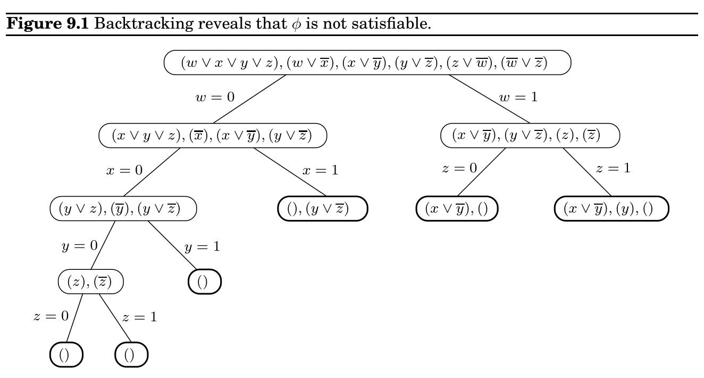
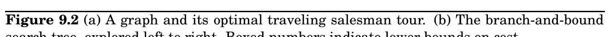

import Guide from '@/components/Guide.astro';
import Knowledge from '@/components/Knowledge.astro';
import Example from '@/components/Example.astro';
import Analysis from '@/components/Analysis.astro';
import Solution from '@/components/Solution.astro';
import Variant from '@/components/Variant.astro';
import Note from '@/components/Note.astro';
import Block from '@/components/Block.astro';
import Method from '@/components/Method.astro';
import Exercise from '@/components/Exercise.astro';

## 9.1 Intelligent exhaustive search

### Coping with NP-completeness

You are the junior member of a seasoned project team. Your current task is to write code for solving a simple-looking problem involving graphs and numbers. What are you supposed to do?

If you are very lucky, your problem will be among the half-dozen problems concerning graphs with weights (shortest path, minimum spanning tree, maximum flow, etc.), that we have solved in this book. Even if this is the case, recognizing such a problem in its natural habitat—grungy and obscured by reality and context—requires practice and skill. It is more likely that you will need to reduce your problem to one of these lucky ones—or to solve it using dynamic programming or linear programming.

But chances are that nothing like this will happen. The world of search problems is a bleak landscape. There are a few spots of light—brilliant algorithmic ideas—each illuminating a small area around it (the problems that reduce to it; two of these areas, linear and dynamic programming, are in fact decently large). But the remaining vast expanse is pitch dark: NPcomplete. What are you to do?

You can start by proving that your problem is actually NP-complete. Often a proof by generalization (recall the discussion on page 254 and Exercise 8.10) is all that you need; and sometimes a simple reduction from 3_&#123;SAT&#125; or_&#123; &#125;ZOE is not too difficult to find. This sounds like a theoretical exercise, but, if carried out successfully, it does bring some tangible rewards: now your status in the team has been elevated, you are no longer the kid who can’t do, and you have become the noble knight with the impossible quest.

But, unfortunately, a problem does not go away when proved NP-complete. The real question is, What do you do next?

This is the subject of the present chapter and also the inspiration for some of the most important modern research on algorithms and complexity. NP-completeness is not a death certificate—it is only the beginning of a fascinating adventure.

Your problem’s NP-completeness proof probably constructs graphs that are complicated and weird, very much unlike those that come up in your application. For example, even though_&#123; &#125;SAT is NP-complete, satisfying assignments for_&#123; &#125;HORN SAT (the instances of_&#123; &#125;SAT that come up in logic programming) can be found efficiently (recall Section 5.3). Or, suppose the graphs that arise in your application are trees. In this case, many NP-complete problems, such as_&#123; &#125;INDEPENDENT SET, can be solved in linear time by dynamic programming (recall Section 6.7).

Unfortunately, this approach does not always work. For example, we know that 3_&#123;SAT&#125; is NP-complete. And the_&#123; &#125;INDEPENDENT SET problem, along with many other NP-complete problems, remains so even for planar graphs (graphs that can be drawn in the plane without crossing edges). Moreover, often you cannot neatly characterize the instances that come up in your application. Instead, you will have to rely on some form of intelligent exponential search—procedures such as backtracking and branch and bound which are exponential time in the worst-case, but, with the right design, could be very efficient on typical instances that come up in your application. We discuss these methods in Section 9.1.

Or you can develop an algorithm for your NP-complete optimization problem that falls short of the optimum but never by too much. For example, in Section 5.4 we saw that the greedy algorithm always produces a set cover that is no more than log n times the optimal set cover. An algorithm that achieves such a guarantee is called an approximation algorithm. As we will see in Section 9.2, such algorithms are known for many NP-complete optimization problems, and they are some of the most clever and sophisticated algorithms around. And the theory of NP-completeness can again be used as a guide in this endeavor, by showing that, for some problems, there are even severe limits to how well they can be approximated—unless of course P = NP.

Finally, there are heuristics, algorithms with no guarantees on either the running time or the degree of approximation. Heuristics rely on ingenuity, intuition, a good understanding of the application, meticulous experimentation, and often insights from physics or biology, to attack a problem. We see some common kinds in Section 9.3.

### 9.1.1 Backtracking

Backtracking is based on the observation that it is often possible to reject a solution by looking at just a small portion of it. For example, if an instance of_&#123; &#125;SAT contains the clause (x_&#123;1&#125; ∨x_&#123;2&#125;), then all assignments with x_&#123;1&#125; = x_&#123;2&#125; = 0 (i.e., false) can be instantly eliminated. To put it differently, by quickly checking and discrediting this partial assignment, we are able to prune a quarter of the entire search space. A promising direction, but can it be systematically exploited?

Here’s how it is done. Consider the Boolean formula φ(w, x, y, z) specified by the set of clauses

(w ∨x ∨y ∨z), (w ∨

x), (x ∨

y), (y ∨

z), (z ∨

w), (

w ∨

z).

We will incrementally grow a tree of partial solutions. We start by branching on any one variable, say w:

Initial formula φ

w = 1 w = 0

Plugging w = 0 and w = 1 into φ, we find that no clause is immediately violated and thus neither of these two partial assignments can be eliminated outright. So we need to keep

branching. We can expand either of the two available nodes, and on any variable of our choice. Let’s try this one:

Initial formula φ

w = 1 w = 0

x = 0 x = 1

This time, we are in luck. The partial assignment w = 0, x = 1 violates the clause (w ∨

x) and can be terminated, thereby pruning a good chunk of the search space. We backtrack out of this cul-de-sac and continue our explorations at one of the two remaining active nodes.

In this manner, backtracking explores the space of assignments, growing the tree only at nodes where there is uncertainty about the outcome, and stopping if at any stage a satisfying assignment is encountered.

In the case of Boolean satisfiability, each node of the search tree can be described either by a partial assignment or by the clauses that remain when those values are plugged into the original formula. For instance, if w = 0 and x = 0 then any clause with

w or

x is instantly satisfied and any literal w or x is not satisfied and can be removed. What’s left is

(y ∨z), (

y), (y ∨

z).

Likewise, w = 0 and x = 1 leaves

(), (y ∨

z),

with the “empty clause” ( ) ruling out satisfiability. Thus the nodes of the search tree, representing partial assignments, are themselves_&#123; &#125;SAT subproblems.

This alternative representation is helpful for making the two decisions that repeatedly arise: which subproblem to expand next, and which branching variable to use. Since the benefit of backtracking lies in its ability to eliminate portions of the search space, and since this happens only when an empty clause is encountered, it makes sense to choose the subproblem that contains the smallest clause and to then branch on a variable in that clause. If this clause happens to be a singleton, then at least one of the resulting branches will be terminated. (If there is a tie in choosing subproblems, one reasonable policy is to pick the one lowest in the tree, in the hope that it is close to a satisfying assignment.) See Figure 9.1 for the conclusion of our earlier example.

More abstractly, a backtracking algorithm requires a test that looks at a subproblem and quickly declares one of three outcomes:

1. Failure: the subproblem has no solution.

2. Success: a solution to the subproblem is found.

3. Uncertainty.

In the case of_&#123; &#125;SAT, this test declares failure if there is an empty clause, success if there are no clauses, and uncertainty otherwise. The backtracking procedure then has the following format.

Start with some problem P_&#123;0&#125; Let S = &#123;P_&#123;0&#125;&#125;, the set of active subproblems Repeat while S is nonempty:

choose

a subproblem P ∈S and remove it from S expand

it into smaller subproblems P_&#123;1&#125;, P_&#123;2&#125;, . . . , P_&#123;k&#125; For each P_&#123;i&#125;:

If test

(P_&#123;i&#125;) succeeds: halt and announce this solution If test

(P_&#123;i&#125;) fails: discard P_&#123;i&#125; Otherwise: add P_&#123;i&#125; to S Announce that there is no solution

For_&#123; &#125;SAT, the choose procedure picks a clause, and expand picks a variable within that clause. We have already discussed some reasonable ways of making such choices.

With the right test, expand, and choose routines, backtracking can be remarkably effective in practice. The backtracking algorithm we showed for_&#123; &#125;SAT is the basis of many successful satisfiability programs. Another sign of quality is this: if presented with a 2_&#123;SAT&#125; instance, it will always find a satisfying assignment, if one exists, in polynomial time (Exercise 9.1)!

### 9.1.2 Branch-and-bound

The same principle can be generalized from search problems such as_&#123; &#125;SAT to optimization problems. For concreteness, let’s say we have a minimization problem; maximization will

follow the same pattern.

As before, we will deal with partial solutions, each of which represents a subproblem, namely, what is the (cost of the) best way to complete this solution? And as before, we need a basis for eliminating partial solutions, since there is no other source of efficiency in our method. To reject a subproblem, we must be certain that its cost exceeds that of some other solution we have already encountered. But its exact cost is unknown to us and is generally not efficiently computable. So instead we use a quick lower bound on this cost.

Start with some problem P_&#123;0&#125; Let S = &#123;P_&#123;0&#125;&#125;, the set of active subproblems bestsofar = ∞ Repeat while S is nonempty:

choose

a subproblem (partial solution) P ∈S and remove it from S expand

it into smaller subproblems P_&#123;1&#125;, P_&#123;2&#125;, . . . , P_&#123;k&#125; For each P_&#123;i&#125;:

If P_&#123;i&#125; is a complete solution: update bestsofar else if lowerbound

(P_&#123;i&#125;) &lt; bestsofar: add P_&#123;i&#125; to S return bestsofar

Let’s see how this works for the traveling salesman problem on a graph G = (V, E) with edge lengths d_&#123;e&#125; > 0. A partial solution is a simple path a ⇝b passing through some vertices S ⊆V , where S includes the endpoints a and b. We can denote such a partial solution by the tuple [a, S, b]—in fact, a will be fixed throughout the algorithm. The corresponding subproblem is to find the best completion of the tour, that is, the cheapest complementary path b ⇝a with intermediate nodes V −S. Notice that the initial problem is of the form [a, &#123;a&#125;, a] for any a ∈V of our choosing.

At each step of the branch-and-bound algorithm, we extend a particular partial solution [a, S, b] by a single edge (b, x), where x ∈V −S. There can be up to |V −S| ways to do this, and each of these branches leads to a subproblem of the form [a, S ∪&#123;x&#125;, x].

How can we lower-bound the cost of completing a partial tour [a, S, b]? Many sophisticated methods have been developed for this, but let’s look at a rather simple one. The remainder of the tour consists of a path through V −S, plus edges from a and b to V −S. Therefore, its cost is at least the sum of the following:

1. The lightest edge from a to V −S.

2. The lightest edge from b to V −S.

3. The minimum spanning tree of V −S.

(Do you see why?) And this lower bound can be computed quickly by a minimum spanning tree algorithm. Figure 9.2 runs through an example: each node of the tree represents a partial tour (specifically, the path from the root to that node) that at some stage is considered by the branch-and-bound procedure. Notice how just 28 partial solutions are considered, instead of the 7! = 5,040 that would arise in a brute-force search.

(a)

A B

C

D

E F

G

H

1

2

1

1 1

2

1

2

5

1 1

1

A B

C

D

E F

G

H

1 1

1 1

1

1 1

1

(b)

A

E

H F

G

B

F

G

D

15

14

8

B D

C

D H

G

H 8

E C G

inf

8

10

13

12

8

8 14

8

8

8

8

10

C 10

G E

F

G

H

D

11

11

11

11

inf

H

G

14

14 10 10

Cost: 11 Cost: 8
