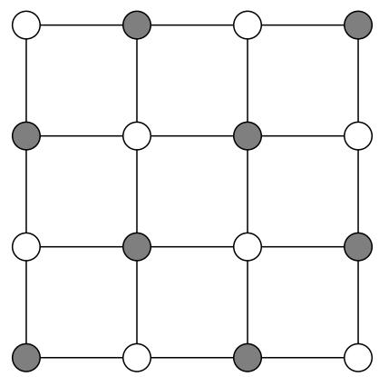
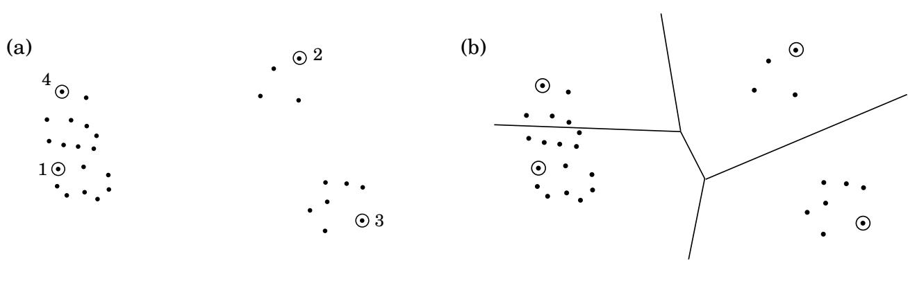
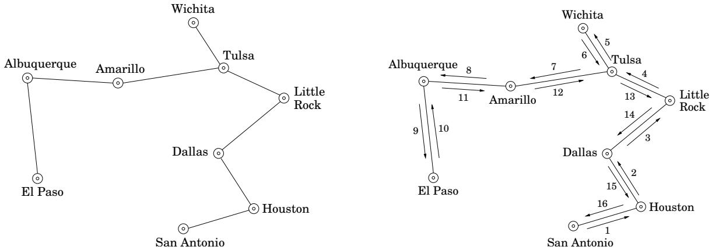
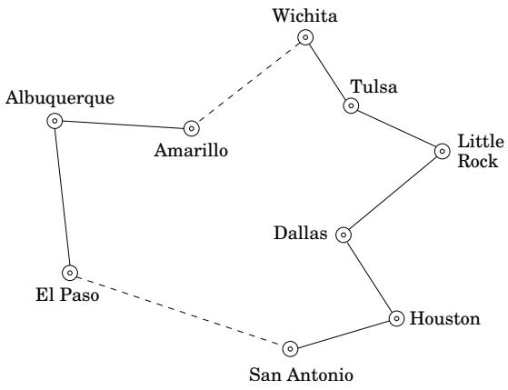

import Guide from '@/components/Guide.astro';
import Knowledge from '@/components/Knowledge.astro';
import Example from '@/components/Example.astro';
import Analysis from '@/components/Analysis.astro';
import Solution from '@/components/Solution.astro';
import Variant from '@/components/Variant.astro';
import Note from '@/components/Note.astro';
import Block from '@/components/Block.astro';
import Method from '@/components/Method.astro';
import Exercise from '@/components/Exercise.astro';
import Algorithm from '@/components/Algorithm.astro';

## 9.2 Approximation algorithms

In an optimization problem we are given an instance I and are asked to find the optimum solution—the one with the maximum gain if we have a maximization problem like INDEPEN-DENT SET, or the minimum cost if we are dealing with a minimization problem such as the TSP. For every instance I, let us denote by OPT(I) the value (benefit or cost) of the optimum solution. It makes the math a little simpler (and is not too far from the truth) to assume that OPT(I) is always a positive integer.

We have already seen an example of a (famous) approximation algorithm in Section 5.4: the greedy scheme for SET COVER. For any instance I of size n, we showed that this greedy algorithm is guaranteed to quickly find a set cover of cardinality at most OPT(I) log n. This log n factor is known as the approximation guarantee of the algorithm.

More generally, consider any minimization problem. Suppose now that we have an algorithm  for our problem which, given an instance I, returns a solution with value (I). The approximation ratio of algorithm is defined to be

$$
\alpha_ {\mathcal {A}} = \max _ {I} \frac {\mathcal {A} (I)}{\mathrm{OPT} (I)}.
$$

In other words, $\alpha _ { A }$ measures by the factor by which the output of algorithm exceeds the optimal solution, on the worst-case input. The approximation ratio can also be defined for maximization problems, such as INDEPENDENT SET, in the same way—except that to get a number larger than 1 we take the reciprocal.

So, when faced with an NP-complete optimization problem, a reasonable goal is to look for an approximation algorithm whose $\alpha _ { A }$ is as small as possible. But this kind of guarantee might seem a little puzzling: How can we come close to the optimum if we cannot determine the optimum? Let's look at a simple example.

## 9.2.1 Vertex cover

We already know the VERTEX COVER problem is NP-hard.

VERTEX COVER

Input: An undirected graph $G = ( V , E )$

Output: A subset of the vertices $S \subseteq V$ that touches every edge.

Goal: Minimize S .

See Figure 9.3 for an example.

Since VERTEX COVER is a special case of SET COVER, we know from Chapter 5 that it can be approximated within a factor of O(log n) by the greedy algorithm: repeatedly delete the vertex of highest degree and include it in the vertex cover. And there are graphs on which the greedy algorithm returns a vertex cover that is indeed log n times the optimum.

A better approximation algorithm for VERTEX COVER is based on the notion of a matching, a subset of edges that have no vertices in common (Figure 9.4). A matching is maximal if no more edges can be added to it. Maximal matchings will help us find good vertex covers, and moreover, they are easy to generate: repeatedly pick edges that are disjoint from the ones chosen already, until this is no longer possible.

Figure 9.3 A graph whose optimal vertex cover, shown shaded, is of size 8.

Figure 9.4 (a) A matching, (b) its completion to a maximal matching, and (c) the resulting vertex cover.

<table><tr><td>(a)</td><td>○</td><td>○—○</td><td>○</td></tr><tr><td></td><td>○—○</td><td>○</td><td>○</td></tr><tr><td></td><td>○</td><td>○</td><td>○</td></tr><tr><td></td><td>○</td><td>○</td><td>○—○</td></tr></table>

What is the relationship between matchings and vertex covers? Here is the crucial fact: any vertex cover of a graph G must be at least as large as the number of edges in any matching in G; that is, any matching provides a lower bound on OPT. This is simply because each edge of the matching must be covered by one of its endpoints in any vertex cover! Finding such a lower bound is a key step in designing an approximation algorithm, because we must compare the quality of the solution found by our algorithm to OPT, which is NP-complete to compute.

One more observation completes the design of our approximation algorithm: let S be a set that contains both endpoints of each edge in a maximal matching M. Then S must be a vertex cover—if it isn't, that is, if it doesn't touch some edge $e \in E ,$ , then M could not possibly be maximal since we could still add e to it. But our cover S has 2 M vertices. And from the previous paragraph we know that any vertex cover must have size at least M . So we're done.

Here's the algorithm for VERTEX COVER.

Find a maximal matching $M \subseteq E$

Return S = all endpoints of edges in M

This simple procedure always returns a vertex cover whose size is at most twice optimal!

In summary, even though we have no way of finding the best vertex cover, we can easily find another structure, a maximal matching, with two key properties:

1. Its size gives us a lower bound on the optimal vertex cover.

2. It can be used to build a vertex cover, whose size can be related to that of the optimal cover using property 1.

Thus, this simple algorithm has an approximation ratio of $\alpha _ { A } \leq 2$ . In fact, it is not hard to find examples on which it does make a 100% error; hence $\alpha _ { \mathscr A } = 2$

## 9.2.2 Clustering

We turn next to a clustering problem, in which we have some data (text documents, say, or images, or speech samples) that we want to divide into groups. It is often useful to define “dis tances” between these data points, numbers that capture how close or far they are from one another. Often the data are true points in some high-dimensional space and the distances are the usual Euclidean distance; in other cases, the distances are the result of some “similarity tests” to which we have subjected the data points. Assume that we have such distances and that they satisfy the usual metric properties:

1. $d ( x , y ) \geq 0$ for all $x , y .$

2. $d ( x , y ) = 0$ if and only if $x = y$

3. $d ( x , y ) = d ( y , x )$

4. (Triangle inequality) $d ( x , y ) \leq d ( x , z ) + d ( z , y )$

We would like to partition the data points into groups that are compact in the sense of having small diameter.

k-CLUSTER

Input: Points $X = \{ x _ { 1 } , \ldots , x _ { n } \}$ with underlying distance metric $d ( \cdot , \cdot ) _ { \ i }$ ; integer $k .$

Output: A partition of the points into k clusters $C _ { 1 } , \ldots , C _ { k }$

Goal: Minimize the diameter of the clusters,

$$
\max _ {j} \max _ {x _ {a}, x _ {b} \in C _ {j}} d (x _ {a}, x _ {b}).
$$

One way to visualize this task is to imagine n points in space, which are to be covered by k spheres of equal size. What is the smallest possible diameter of the spheres? Figure 9.5 shows an example.

This problem is NP-hard, but has a very simple approximation algorithm. The idea is to pick k of the data points as cluster centers and to then assign each of the remaining points to the center closest to it, thus creating k clusters. The centers are picked one at a time, using an intuitive rule: always pick the next center to be as far as possible from the centers chosen so far (see Figure 9.6).

Pick any point $\mu _ { 1 } \in X$ as the first cluster center

for $i = 2 \ \textrm { t o } \ k \colon$

Let $\mu _ { i }$ be the point in X that is farthest from $\mu _ { 1 } , \ldots , \mu _ { i - 1 }$

$( \mathrm { ~ i ~ . ~ e ~ . ~ } ,$ that maximizes min $_ { \cdot j < i } d ( \cdot , \mu _ { j } ) )$

Create k clusters: $C _ { i } = \{ \mathsf { a l l } \ x \in X$ whose closest center is $\mu _ { i } \}$

Figure 9.5 Some data points and the optimal k = 4 clusters.

Figure 9.6 (a) Four centers chosen by farthest-first traversal. (b) The resulting clusters.

It's clear that this algorithm returns a valid partition. What's more, the resulting diameter is guaranteed to be at most twice optimal.

Here's the argument. Let $x \in X$ be the point farthest from $\mu _ { 1 } , \ldots , \mu _ { k }$ (in other words the next center we would have chosen, if we wanted $k + 1$ of them), and let r be its distance to its closest center. Then every point in X must be within distance r of its cluster center. By the triangle inequality, this means that every cluster has diameter at most $2 r$

But how does r relate to the diameter of the optimal clustering? Well, we have identified $k + 1$ points $\{ \mu _ { 1 } , \mu _ { 2 } , \ldots , \mu _ { k } , x \}$ that are all at a distance at least r from each other (why?). Any partition into k clusters must put two of these points in the same cluster and must therefore have diameter at least r.

This algorithm has a certain high-level similarity to our scheme for VERTEX COVER. Instead of a maximal matching, we use a different easily computable structure—a set of k points that cover all of X within some radius r, while at the same time being mutually separated by a distance of at least r. This structure is used both to generate a clustering and to give a lower bound on the optimal clustering.

We know of no better approximation algorithm for this problem.

## 9.2.3 TSP

The triangle inequality played a crucial role in making the k-CLUSTER problem approximable. It also helps with the TRAVELING SALESMAN PROBLEM: if the distances between cities satisfy the metric properties, then there is an algorithm that outputs a tour of length at most 1.5 times optimal. We'll now look at a slightly weaker result that achieves a factor of 2.

Continuing with the thought processes of our previous two approximation algorithms, we can ask whether there is some structure that is easy to compute and that is plausibly related to the best traveling salesman tour (as well as providing a good lower bound on OPT). A little thought and experimentation reveals the answer to be the minimum spanning tree.

Let's understand this relation. Removing any edge from a traveling salesman tour leaves a path through all the vertices, which is a spanning tree. Therefore,

$$
\mathrm{TSPcost} \geq \text { cost   of   this   path } \geq \mathrm{MSTcost}.
$$

Now, we somehow need to use the MST to build a traveling salesman tour. If we can use each edge twice, then by following the shape of the MST we end up with a tour that visits all the cities, some of them more than once. Here's an example, with the MST on the left and the resulting tour on the right (the numbers show the order in which the edges are taken).

Therefore, this tour has a length at most twice the MST cost, which as we've already seen is at most twice the TSP cost.

This is the result we wanted, but we aren't quite done because our tour visits some cities multiple times and is therefore not legal. To fix the problem, the tour should simply skip any city it is about to revisit, and instead move directly to the next new city in its list:

By the triangle inequality, these bypasses can only make the overall tour shorter.

## General TSP

But what if we are interested in instances of TSP that do not satisfy the triangle inequality? It turns out that this is a much harder problem to approximate.

Here is why: Recall that on page 259 we gave a polynomial-time reduction which given any graph G and integer any $C > 0$ produces an instance $I ( G , C )$ of the TSP such that:

(i) If G has a Rudrata path, then OPT $( I ( G , C ) ) = n _ { \mathrm { ; } }$ , the number of vertices in G.

(ii) If G has no Rudrata path, then OPT $( I ( G , C ) ) \geq n + C .$

This means that even an approximate solution to TSP would enable us to solve RUDRATA PATH! Let's work out the details.

Consider an approximation algorithm for TSP and let $\alpha _ { A }$ denote its approximation ratio. From any instance G of RUDRATA PATH, we will create an instance $I ( G , C )$ of TSP using the specific constant $C = n \alpha _ { \mathcal { A } }$ . What happens when algorithm is run on this TSP instance? In case (i), it must output a tour of length at most $\alpha _ { \mathcal { A } } \mathrm { O P T } ( I ( G , C ) ) = n \alpha _ { \mathcal { A } }$ , whereas in case (ii) it must output a tour of length at least OPT $\because I ( G , C ) ) > n \alpha _ { \mathcal { A } }$ . Thus we can figure out whether G has a Rudrata path! Here is the resulting procedure:

<Algorithm>
Given any graph $G$:
    compute $I(G, C)$ (with $C = n \cdot \alpha_{\mathcal{A}}$) and run algorithm $\mathcal{A}$ on it
    if the resulting tour has length $\leq n\alpha_{\mathcal{A}}$:
        conclude that $G$ has a Rudrata path
    else:
        conclude that $G$ has no Rudrata path
</Algorithm>

This tells us whether or not G has a Rudrata path; by calling the procedure a polynomial number of times, we can find the actual path (Exercise 8.2).

We've shown that if TSP has a polynomial-time approximation algorithm, then there is a polynomial algorithm for the NP-complete RUDRATA PATH problem. So, unless $\mathbf { P } = \mathbf { N P }$ there cannot exist an efficient approximation algorithm for the TSP.

## 9.2.4 Knapsack

Our last approximation algorithm is for a maximization problem and has a very impressive guarantee: given any $\epsilon > 0 _ { : }$ , it will return a solution of value at least $( 1 - \epsilon )$ times the optimal value, in time that scales only polynomially in the input size and in $1 / \epsilon .$

The problem is KNAPSACK, which we first encountered in Chapter 6. There are n items, with weights $w _ { 1 } , \ldots , w _ { n }$ and values $v _ { 1 } , \ldots , v _ { n }$ (all positive integers), and the goal is to pick the most valuable combination of items subject to the constraint that their total weight is at most W.

Earlier we saw a dynamic programming solution to this problem with running time $O ( n W )$ Using a similar technique, a running time of $O ( n V )$ can also be achieved, where V is the sum of the values. Neither of these running times is polynomial, because $W$ and V can be very large, exponential in the size of the input.

Let's consider the $O ( n V )$ algorithm. In the bad case when V is large, what if we simply scale down all the values in some way? For instance, if

$$
v _ {1} = 1 1 7, 5 8 6, 0 0 3, v _ {2} = 7 3 8, 4 9 3, 2 9 1, v _ {3} = 2 3 8, 8 2 7, 4 5 3,
$$

we could simply knock off some precision and instead use 117, 738, and 238. This doesn't change the problem all that much and will make the algorithm much, much faster!

Now for the details. Along with the input, the user is assumed to have specified some approximation factor $\epsilon > 0 .$

<Algorithm>
Discard any item with weight > W
Let $v_{\max} = \max_i v_i$
Rescale values $\widehat{v}_i = \left\lfloor v_i \cdot \frac{n}{\epsilon v_{\max}} \right\rfloor$
Run the dynamic programming algorithm with values $\{\widehat{v}_i\}$
Output the resulting choice of items
</Algorithm>

Let's see why this works. First of all, since the rescaled values $\widehat { v _ { i } }$ are all at most $n / \epsilon$ , the dynamic program is efficient, running in time $O ( n ^ { 3 } / \epsilon )$

Now suppose the optimal solution to the original problem is to pick some subset of items S, with total value $K ^ { * }$ . The rescaled value of this same assignment is

$$
\sum_ {i \in S} \widehat {v _ {i}} = \sum_ {i \in S} \left\lfloor v _ {i} \cdot \frac {n}{\epsilon v _ {\mathrm{max}}} \right\rfloor \geq \sum_ {i \in S} \left(v _ {i} \cdot \frac {n}{\epsilon v _ {\mathrm{max}}} - 1\right) \geq K ^ {*} \cdot \frac {n}{\epsilon v _ {\mathrm{max}}} - n.
$$

Therefore, the optimal assignment for the shrunken problem, call it ${ \widehat { S } } ,$ , has a rescaled value of at least this much. In terms of the original values, assignment $\widehat { S }$ bhas a value of at least

$$
\sum_ {i \in \widehat {S}} v _ {i} \geq \sum_ {i \in \widehat {S}} \widehat {v} _ {i} \cdot \frac {\epsilon v _ {\mathrm{max}}}{n} \geq \left(K ^ {*} \cdot \frac {n}{\epsilon v _ {\mathrm{max}}} - n\right) \cdot \frac {\epsilon v _ {\mathrm{max}}}{n} = K ^ {*} - \epsilon v _ {\mathrm{max}} \geq K ^ {*} (1 - \epsilon).
$$

## 9.2.5 The approximability hierarchy

Given any NP-complete optimization problem, we seek the best approximation algorithm possible. Failing this, we try to prove lower bounds on the approximation ratios that are achievable in polynomial time (we just carried out such a proof for the general TSP). All told, NP-complete optimization problems are classified as follows:

Those for which, like the TSP, no finite approximation ratio is possible.

Those for which an approximation ratio is possible, but there are limits to how small this can be. VERTEX COVER, k-CLUSTER, and the TSP with triangle inequality belong here. (For these problems we have not established limits to their approximability, but these limits do exist, and their proofs constitute some of the most sophisticated results in this field.)

Down below we have a more fortunate class of NP-complete problems for which approximability has no limits, and polynomial approximation algorithms with error ratios arbitrarily close to zero exist. KNAPSACK resides here.

Finally, there is another class of problems, between the first two given here, for which the approximation ratio is about log n. SET COVER is an example.

(A humbling reminder: All this is contingent upon the assumption P = NP. Failing this, this hierarchy collapses down to P, and all NP-complete optimization problems can be solved exactly in polynomial time.)

A final point on approximation algorithms: often these algorithms, or their variants, perform much better on typical instances than their worst-case approximation ratio would have you believe.
