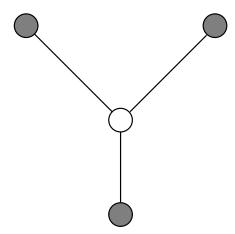

import Guide from '@/components/Guide.astro';
import Knowledge from '@/components/Knowledge.astro';
import Example from '@/components/Example.astro';
import Analysis from '@/components/Analysis.astro';
import Solution from '@/components/Solution.astro';
import Variant from '@/components/Variant.astro';
import Note from '@/components/Note.astro';
import Block from '@/components/Block.astro';
import Method from '@/components/Method.astro';
import Exercise from '@/components/Exercise.astro';

## Chapter 9 Exercises

<Exercise title="Exercise 9.1">

In the backtracking algorithm for SAT, suppose that we always choose a subproblem (CNF formula) that has a clause that is as small as possible; and we expand it along a variable that appears in this small clause. Show that this is a polynomial-time algorithm in the special case in which the input formula has only clauses with two literals (that is, it is an instance of 2SAT).

</Exercise>

<Exercise title="Exercise 9.2">

Devise a backtracking algorithm for the RUDRATA PATH problem from a fixed vertex s. To fully specify such an algorithm you must define:

(a) What is a subproblem?

(b) How to choose a subproblem.

(c) How to expand a subproblem.

Argue briefly why your choices are reasonable.

</Exercise>

<Exercise title="Exercise 9.3">

Devise a branch-and-bound algorithm for the SET COVER problem. This entails deciding:

(a) What is a subproblem?

(b) How do you choose a subproblem to expand?

(c) How do you expand a subproblem?

(d) What is an appropriate lowerbound?

Do you think that your choices above will work well on typical instances of the problem? Why?

</Exercise>

<Exercise title="Exercise 9.4">

Given an undirected graph $G = ( V , E )$ in which each node has degree $\leq d ,$ show how to efficiently find an independent set whose size is at least $1 / ( d + 1 )$ times that of the largest independent set.

</Exercise>

<Exercise title="Exercise 9.5">

Local search for minimum spanning trees. Consider the set of all spanning trees (not just minimum ones) of a weighted, connected, undirected graph $G = ( V , E )$

Recall from Section 5.1 that adding an edge e to a spanning tree $T$ creates an unique cycle, and subsequently removing any other edge $e ^ { \prime } \neq e$ from this cycle gives back a different spanning tree $T ^ { \prime }$ . We will say that T and $\overline { { T ^ { \prime } } }$ differ by a single edge swap $( e , e ^ { \prime } )$ and that they are neighbors.

(a) Show that it is possible to move from any spanning tree $T$ to any other spanning tree $T ^ { \prime }$ by performing a series of edge-swaps, that is, by moving from neighbor to neighbor. At most how many edge-swaps are needed?

(b) Show that $\mathrm { i f } T ^ { \prime }$ is an MST, then it is possible to choose these swaps so that the costs of the spanning trees encountered along the way are nonincreasing. In other words, if the sequence of spanning trees encountered is

$$
T = T _ {0} \rightarrow T _ {1} \rightarrow T _ {2} \rightarrow \dots \rightarrow T _ {k} = T ^ {\prime},
$$

then cost $( T _ { i + 1 } ) \leq \mathsf { c o s t } ( T _ { i } )$ for all $i < k ,$

(c) Consider the following local search algorithm which is given as input an undirected graph G.

Let $T$ be any spanning tree of $G$
while there is an edge-swap $(e, e')$ which reduces $\text{cost}(T)$:
$T \leftarrow T + e - e'$
return $T$

Show that this procedure always returns a minimum spanning tree. At most how many iterations does it take?

</Exercise>

<Exercise title="Exercise 9.6">

In the MINIMUM STEINER TREE problem, the input consists of: a complete graph $G = ( V , E )$ with distances $d _ { u v }$ between all pairs of nodes; and a distinguished set of terminal nodes $V ^ { \prime } \subseteq V$ The goal is to find a minimum-cost tree that includes the vertices $V ^ { \prime } .$ . This tree may or may not include nodes in $V - V ^ { \prime }$

Suppose the distances in the input are a metric (recall the definition on page 277). Show that an efficient ratio-2 approximation algorithm for MINIMUM STEINER TREE can be obtained by ignoring the nonterminal nodes and simply returning the minimum spanning tree on $V ^ { \prime }$ . (Hint: Recall our approximation algorithm for the TSP.)

</Exercise>

<Exercise title="Exercise 9.7">

In the MULTIWAY CUT problem, the input is an undirected graph $G = ( V , E )$ and a set of terminal nodes $s _ { 1 } , s _ { 2 } , \ldots , s _ { k } \in V$ . The goal is to find the minimum set of edges in E whose removal leaves all terminals in different components.

(a) Show that this problem can be solved exactly in polynomial time when $k = 2 .$

(b) Give an approximation algorithm with ratio at most 2 for the case $k = 3 .$

(c) Design a local search algorithm for multiway cut.

</Exercise>

<Exercise title="Exercise 9.8">

In the MAX SAT problem, we are given a set of clauses, and we want to find an assignment that satisfies as many of them as possible.

(a) Show that if this problem can be solved in polynomial time, then so can SAT.

(b) Here's a very naive algorithm.

$$
\begin{array}{l} \text {for each variable:} \\ \text {set its value to either 0 or 1 by flipping a coin} \end{array}
$$

Suppose the input has m clauses, of which the jth has $k _ { j }$ literals. Show that the expected number of clauses satisfied by this simple algorithm is

$$
\sum_ {j = 1} ^ {m} \left(1 - \frac {1}{2 ^ {k _ {j}}}\right) \geq \frac {m}{2}.
$$

In other words, this is a 2-approximation in expectation! And if the clauses all contain k literals, then this approximation factor improves to $1 + 1 / ( 2 ^ { k } - 1 )$ 1

(c) Can you make this algorithm deterministic? (Hint: Instead of flipping a coin for each variable, select the value that satisfies the most of the as of yet unsatisfied clauses. What fraction of the clauses is satisfied in the end?)

</Exercise>

<Exercise title="Exercise 9.9">

In the MAXIMUM CUT problem we are given an undirected graph $G = ( V , E )$ with a weight $w ( e )$ on each edge, and we wish to separate the vertices into two sets S and $V - S$ so that the total weight of the edges between the two sets is as large as possible.

For each $S \subseteq V$ define $w ( S )$ to be the sum of all $w ( e )$ over all edges $\{ u , v \}$ such that $| S \cap \{ u , v \} | = 1$ Obviously, MAX CUT is about maximizing $w ( S )$ over all subsets of V.

Consider the following local search algorithm for MAX CUT:

start with any  $S \subseteq V$ 
while there is a subset  $S' \subseteq V$  such that
 $||S'| - |S|| = 1$  and  $w(S') > w(S)$  do:
set  $S = S'$

(a) Show that this is an approximation algorithm for MAX CUT with ratio 2.

(b) But is it a polynomial-time algorithm?

</Exercise>

<Exercise title="Exercise 9.10">

Let us call a local search algorithm exact when it always produces the optimum solution. For example, the local search algorithm for the minimum spanning tree problem introduced in Problem 9.5 is exact. For another example, simplex can be considered an exact local search algorithm for linear programming.

(a) Show that the 2-change local search algorithm for the TSP is not exact.

(b) Repeat for the n -change local search algorithm, where n is the number of cities.

(c) Show that the (n  1)-change local search algorithm is exact.

(d) IfA is an optimization problem, define A-IMPROVEMENT to be the following search problem: Given an instance x of A and a solution s of A, find another solution of x with better cost (or report that none exists, and thus s is optimum). For example, in TSP IMPROVEMENT we are given a distance matrix and a tour, and we are asked to find a better tour. It turns out that TSP IMPROVEMENT is NP-complete, and so is SET COVER IMPROVEMENT. (Can you prove this?)

(e) We say that a local search algorithm has polynomial iteration if each execution of the loop requires polynomial time. For example, the obvious implementations of the (n  1)-change local search algorithm for the TSP defined above do not have polynomial iteration. Show that, unless P = NP, there is no exact local search algorithm with polynomial iteration for the TSP and SET COVER problems.

</Exercise>

