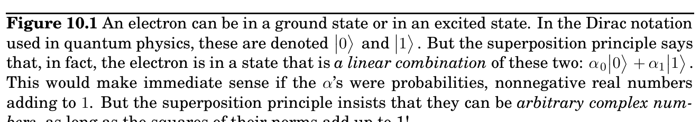
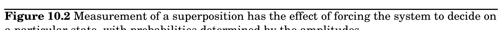

import Guide from '@/components/Guide.astro';
import Knowledge from '@/components/Knowledge.astro';
import Example from '@/components/Example.astro';
import Analysis from '@/components/Analysis.astro';
import Solution from '@/components/Solution.astro';
import Variant from '@/components/Variant.astro';
import Note from '@/components/Note.astro';
import Block from '@/components/Block.astro';
import Method from '@/components/Method.astro';
import Exercise from '@/components/Exercise.astro';

## 10.1 Qubits, superposition, and measurement

### Quantum algorithms

This book started with the world’s oldest and most widely used algorithms (the ones for adding and multiplying numbers) and an ancient hard problem (_&#123;FACTORING&#125;). In this last chapter the tables are turned: we present one of the latest algorithms—and it is an efficient algorithm for

FACTORING!

There is a catch, of course: this algorithm needs a quantum computer to execute.

Quantum physics is a beautiful and mysterious theory that describes Nature in the small, at the level of elementary particles. One of the major discoveries of the nineties was that quantum computers—computers based on quantum physics principles—are radically different from those that operate according to the more familiar principles of classical physics. Surprisingly, they can be exponentially more powerful: as we shall see, quantum computers can solve_&#123; &#125;FACTORING in polynomial time! As a result, in a world with quantum computers, the systems that currently safeguard business transactions on the Internet (and are based on the RSA cryptosystem) will no longer be secure.

In this section we introduce the basic features of quantum physics that are necessary for understanding how quantum computers work.^&#123;1&#125;

In ordinary computer chips, bits are physically represented by low and high voltages on wires. But there are many other ways a bit could be stored—for instance, in the state of a hydrogen atom. The single electron in this atom can either be in the ground state (the lowest energy configuration) or it can be in an excited state (a high energy configuration). We can use these two states to encode for bit values 0 and 1, respectively.

Let us now introduce some quantum physics notation. We denote the ground state of our electron by

0

, since it encodes for bit value 0, and likewise the excited state by

1

. These are the two possible states of the electron in classical physics. Many of the most counterintuitive aspects of quantum physics arise from the superposition principle which states that if a

1This field is so strange that the famous physicist Richard Feynman is quoted as having said, “I think I can safely say that no one understands quantum physics.” So there is little chance you will understand the theory in depth after reading this section! But if you are interested in learning more, see the recommended reading at the book’s end.

ground state

0

excited state

1

superposition α_&#123;0&#125;

0

+ α_&#123;1&#125;

1

quantum system can be in one of two states, then it can also be in any linear superposition of those two states. For instance, the state of the electron could well be 1

√

2 0

+ 1

√

2 1

or

1

√

2 0

− 1

√

2 1

; or an infinite number of other combinations of the form α_&#123;0&#125;

0

+ α_&#123;1&#125;

1

. The

coefficient α_&#123;0&#125; is called the amplitude of state

0

, and similarly with α_&#123;1&#125;. And—if things aren’t already strange enough—the α’s can be complex numbers, as long as they are normalized so that |α_&#123;0&#125;|^&#123;2&#125; + |α_&#123;1&#125;|^&#123;2&#125; = 1. For example, 1

√

5 0

+^&#123; &#125;2i

√

5 1

(where i is the imaginary unit, √

−1) is a

perfectly valid quantum state! Such a superposition, α_&#123;0&#125;

0

+α_&#123;1&#125;

1

, is the basic unit of encoded information in quantum computers (Figure 10.1). It is called a qubit (pronounced “cubit”).

The whole concept of a superposition suggests that the electron does not make up its mind about whether it is in the ground or excited state, and the amplitude α_&#123;0&#125; is a measure of its inclination toward the ground state. Continuing along this line of thought, it is tempting to think of α_&#123;0&#125; as the probability that the electron is in the ground state. But then how are we to make sense of the fact that α_&#123;0&#125; can be negative, or even worse, imaginary? This is one of the most mysterious aspects of quantum physics, one that seems to extend beyond our intuitions about the physical world.

This linear superposition, however, is the private world of the electron. For us to get a glimpse of the electron’s state we must make a measurement, and when we do so, we get a single bit of information—0 or 1. If the state of the electron is α_&#123;0&#125;

0

+ α_&#123;1&#125;

1

, then the outcome of the measurement is 0 with probability |α_&#123;0&#125;|^&#123;2&#125; and 1 with probability |α_&#123;1&#125;|^&#123;2&#125; (luckily we normalized so |α_&#123;0&#125;|^&#123;2&#125; + |α_&#123;1&#125;|^&#123;2&#125; = 1). Moreover, the act of measurement causes the system to change its state: if the outcome of the measurement is 0, then the new state of the system is 0

(the ground state), and if the outcome is 1, the new state is

1

(the excited state). This feature of quantum physics, that a measurement disturbs the system and forces it to choose (in this case ground or excited state), is another strange phenomenon with no classical analog.

The superposition principle holds not just for 2-level systems like the one we just described, but in general for k-level systems. For example, in reality the electron in the hydrogen atom can be in one of many energy levels, starting with the ground state, the first excited state, the

with prob |α_&#123;0&#125;|^&#123;2&#125;

with prob |α_&#123;1&#125;|^&#123;2&#125; α_&#123;0&#125;

0

+ α_&#123;1&#125;

1

state

0

state

1

second excited state, and so on. So we could consider a k-level system consisting of the ground state and the first k −1 excited states, and we could denote these by

0

,

1

,

2

, . . . ,

k −1

. The superposition principle would then say that the general quantum state of the system is α_&#123;0&#125;

0

+ α_&#123;1&#125;

1

+ · · · + α_&#123;k&#125;−1

k −1

, where Pk−1

j=0 |α_&#123;j&#125;|^&#123;2&#125; = 1. Measuring the state of the system would now reveal a number between 0 and k −1, and outcome j would occur with probability |α_&#123;j&#125;|^&#123;2&#125;. As before, the measurement would disturb the system, and the new state would actually become

j

or the jth excited state. How do we encode n bits of information? We could choose k = 2^&#123;n&#125; levels of the hydrogen atom. But a more promising option is to use n qubits.

Let us start by considering the case of two qubits, that is, the state of the electrons of two hydrogen atoms. Since each electron can be in either the ground or excited state, in classical physics the two electrons have a total of four possible states—00, 01, 10, or 11—and are therefore suitable for storing 2 bits of information. But in quantum physics, the superposition principle tells us that the quantum state of the two electrons is a linear combination of the four classical states,

α

= α_&#123;00&#125;

00

+ α_&#123;01&#125;

01

+ α_&#123;10&#125;

10

+ α_&#123;11&#125;

11

,

normalized so that P

x∈&#123;0,1&#125;^&#123;2&#125;|α_&#123;x&#125;|^&#123;2&#125; = 1.^&#123;2&#125; Measuring the state of the system now reveals 2 bits of information, and the probability of outcome x ∈&#123;0, 1&#125;^&#123;2&#125; is |α_&#123;x&#125;|^&#123;2&#125;. Moreover, as before, if the outcome of measurement is jk, then the new state of the system is

jk

: if jk = 10, for example, then the first electron is in the excited state and the second electron is in the ground state.

An interesting question comes up here: what if we make a partial measurement? For instance, if we measure just the first qubit, what is the probability that the outcome is 0? This is simple. It is exactly the same as it would have been had we measured both qubits, namely,

2Recall that &#123;0, 1&#125;^&#123;2&#125; denotes the set consisting of the four 2-bit binary strings and in general &#123;0, 1&#125;^&#123;n&#125; denotes the set of all n-bit binary strings.

### Entanglement

Suppose we have two qubits, the first in the state α_&#123;0&#125;

0

+ α_&#123;1&#125;

1

and the second in the state β_&#123;0&#125;

0

+ β_&#123;1&#125;

1

. What is the joint state of the two qubits? The answer is, the (tensor) product of the two: α_&#123;0&#125;β_&#123;0&#125;

00

+ α_&#123;0&#125;β_&#123;1&#125;

01

+ α_&#123;1&#125;β_&#123;0&#125;

10

+ α_&#123;1&#125;β_&#123;1&#125;

11

. Given an arbitrary state of two qubits, can we specify the state of each individual qubit in this way? No, in general the two qubits are entangled and cannot be decomposed into the states of the individual qubits. For example, consider the state

ψ

= 1

√

2 00

+^&#123; &#125;1

√

2 11

, which is one of the famous Bell states. It cannot be decomposed into states of the two individual qubits (see Exercise 10.1). Entanglement is one of the most mysterious aspects of quantum mechanics and is ultimately the source of the power of quantum computation.

Pr &#123;1st bit = 0&#125; = Pr &#123;00&#125; + Pr &#123;01&#125; = |α_&#123;00&#125;|^&#123; &#125;2 + |α_&#123;01&#125;|^&#123; &#125;2. Fine, but how much does this partial measurement disturb the state of the system?

The answer is elegant. If the outcome of measuring the first qubit is 0, then the new superposition is obtained by crossing out all terms of

α

that are inconsistent with this outcome (that is, whose first bit is 1). Of course the sum of the squares of the amplitudes is no longer 1, so we must renormalize. In our example, this new state would be

α^&#123;new&#125;

= α_&#123;00&#125;

q

|α_&#123;00&#125;|^&#123; &#125;2 + |α_&#123;01&#125;|^&#123; &#125;2

00

+ α_&#123;01&#125;

q

|α_&#123;00&#125;|^&#123; &#125;2 + |α_&#123;01&#125;|^&#123; &#125;2

01

.

Finally, let us consider the general case of n hydrogen atoms. Think of n as a fairly small number of atoms, say n = 500. Classically the states of the 500 electrons could be used to store 500 bits of information in the obvious way. But the quantum state of the 500 qubits is a linear superposition of all 2^&#123;500&#125; possible classical states:

X

x∈&#123;0,1&#125;^&#123;n&#125;

α_&#123;x&#125;

x

.

It is as if Nature has 2^&#123;500&#125; scraps of paper on the side, each with a complex number written on it, just to keep track of the state of this system of 500 hydrogen atoms! Moreover, at each moment, as the state of the system evolves in time, it is as though Nature crosses out the complex number on each scrap of paper and replaces it with its new value.

Let us consider the effort involved in doing all this. The number 2^&#123;500&#125; is much larger than estimates of the number of elementary particles in the universe. Where, then, does Nature store this information? How could microscopic quantum systems of a few hundred atoms contain more information than we can possibly store in the entire classical universe? Surely this is a most extravagant theory about the amount of effort put in by Nature just to keep a tiny system evolving in time.

In this phenomenon lies the basic motivation for quantum computation. After all, if Nature is so extravagant at the quantum level, why should we base our computers on classical physics? Why not tap into this massive amount of effort being expended at the quantum level?

But there is a fundamental problem: this exponentially large linear superposition is the private world of the electrons. Measuring the system only reveals n bits of information. As before, the probability that the outcome is a particular 500-bit string x is |α_&#123;x&#125;|^&#123;2&#125;. And the new state after measurement is just

x

.
