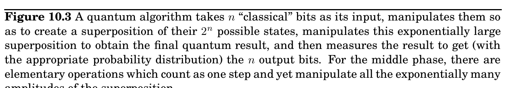

import Guide from '@/components/Guide.astro';
import Knowledge from '@/components/Knowledge.astro';
import Example from '@/components/Example.astro';
import Analysis from '@/components/Analysis.astro';
import Solution from '@/components/Solution.astro';
import Variant from '@/components/Variant.astro';
import Note from '@/components/Note.astro';
import Block from '@/components/Block.astro';
import Method from '@/components/Method.astro';
import Exercise from '@/components/Exercise.astro';

## 10.2 The plan

Exponential superposition

Input x Output y n-bit string n-bit string

A quantum algorithm is unlike any you have seen so far. Its structure reflects the tension between the exponential “private workspace” of an n-qubit system and the mere n bits that can be obtained through measurement.

The input to a quantum algorithm consists of n classical bits, and the output also consists of n classical bits. It is while the quantum system is not being watched that the quantum effects take over and we have the benefit of Nature working exponentially hard on our behalf.

If the input is an n-bit string x, then the quantum computer takes as input n qubits in state

x

. Then a series of quantum operations are performed, by the end of which the state of the n qubits has been transformed to some superposition P

y α_&#123;y&#125;

y

. Finally, a measurement is made, and the output is the n-bit string y with probability |α_&#123;y&#125;|^&#123;2&#125;. Observe that this output is random. But this is not a problem, as we have seen before with randomized algorithms such as the one for primality testing. As long as y corresponds to the right answer with high enough probability, we can repeat the whole process a few times to make the chance of failure miniscule.

Now let us look more closely at the quantum part of the algorithm. Some of the key quantum operations (which we will soon discuss) can be thought of as looking for certain kinds of patterns in a superposition of states. Because of this, it is helpful to think of the algorithm as having two stages. In the first stage, the n classical bits of the input are “unpacked” into an exponentially large superposition, which is expressly set up so as to have an underlying pattern or regularity that, if detected, would solve the task at hand. The second stage then consists of a suitable set of quantum operations, followed by a measurement, which reveals
