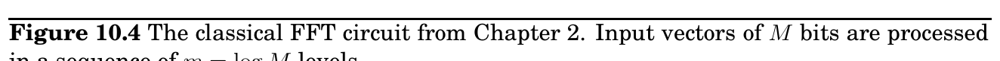

import Guide from '@/components/Guide.astro';
import Knowledge from '@/components/Knowledge.astro';
import Example from '@/components/Example.astro';
import Analysis from '@/components/Analysis.astro';
import Solution from '@/components/Solution.astro';
import Variant from '@/components/Variant.astro';
import Note from '@/components/Note.astro';
import Block from '@/components/Block.astro';
import Method from '@/components/Method.astro';
import Exercise from '@/components/Exercise.astro';

## 10.3 The quantum Fourier transform

the hidden pattern.

All this probably sounds quite mysterious at the moment, but more details are on the way. In Section 10.3 we will give a high-level description of the most important operation that can be efficiently performed by a quantum computer: a quantum version of the fast Fourier transform (FFT). We will then describe certain patterns that this quantum FFT is ideally suited to detect, and will show how to recast the problem of factoring an integer N in terms of detecting precisely such a pattern. Finally we will see how to set up the initial stage of the quantum algorithm, which converts the input N into an exponentially large superposition with the right kind of pattern.

The algorithm to factor a large integer N can be viewed as a sequence of reductions (and everything shown here in italics will be defined in good time):

• F_&#123;ACTORING&#125; is reduced to finding a nontrivial square root of 1 modulo N.

• Finding such a root is reduced to computing the order of a random integer modulo N.

• The order of an integer is precisely the period of a particular periodic superposition.

• Finally, periods of superpositions can be found by the quantum FFT.

We begin with the last step.

Recall the fast Fourier transform (FFT) from Chapter 2. It takes as input an M-dimensional, complex-valued vector α (where M is a power of 2, say M = 2^&#123;m&#125;), and outputs an M-dimensional complex-valued vector β:





β_&#123;0&#125; β_&#123;1&#125; β_&#123;2&#125;

... β_&#123;M&#125;−1





= 1

√

M





1 1 1 · · · 1 1 ω ω^&#123;2&#125; · · · ω^&#123;M&#125;−1

1 ω^&#123;2&#125; ω^&#123;4&#125; · · · ω^&#123;2(&#125;M−1) ... 1 ω^&#123;j&#125; ω^&#123;2&#125;j · · · ω^&#123;(&#125;M−1)j ... 1 ω^&#123;(&#125;M−1) ω^&#123;2(&#125;M−1) · · · ω^&#123;(&#125;M−1)(M−1)









α_&#123;0&#125; α_&#123;1&#125; α_&#123;2&#125;

... α_&#123;M&#125;−1





,

where ω is a complex Mth root of unity (the extra factor of

√

M is new and has the effect of ensuring that if the |α_&#123;i&#125;|^&#123;2&#125; add up to 1, then so do the |β_&#123;i&#125;|^&#123;2&#125;). Although the preceding equation suggests an O(M^&#123; &#125;2) algorithm, the classical FFT is able to perform this calculation in just O(M log M) steps, and it is this speedup that has had the profound effect of making digital signal processing practically feasible. We will now see that quantum computers can implement the FFT exponentially faster, in O(log^&#123;2&#125; M) time!

But wait, how can any algorithm take time less than M, the length of the input? The point is that we can encode the input in a superposition of just m = log M qubits: after all, this superposition consists of 2^&#123;m&#125; amplitude values. In the notation we introduced earlier, we would write the superposition as

α

= PM−1

j=0 α_&#123;j&#125;

j

where α_&#123;i&#125; is the amplitude of the m-bit binary string corresponding to the number i in the natural way. This brings up an important

α_&#123;0&#125;

α_&#123;4&#125;

α_&#123;2&#125;

α_&#123;6&#125;

α_&#123;1&#125;

α_&#123;5&#125;

α_&#123;7&#125;

α_&#123;3&#125;

1

4

4

4

4

6

6 7

4

4

2

2 6 3

2 5

4

β_&#123;0&#125;

β_&#123;1&#125;

β_&#123;2&#125;

β_&#123;3&#125;

β_&#123;4&#125;

β_&#123;5&#125;

β_&#123;6&#125;

β_&#123;7&#125;

point: the

j

notation is really just another way of writing a vector, where the index of each entry of the vector is written out explicitly in the special bracket symbol.

Starting from this input superposition

α

, the quantum Fourier transform (QFT) manipulates it appropriately in m = log M stages. At each stage the superposition evolves so that it encodes the intermediate results at the same stage of the classical FFT (whose circuit, with m = log M stages, is reproduced from Chapter 2 in Figure 10.4). As we will see in Section 10.5, this can be achieved with m quantum operations per stage. Ultimately, after m such stages and m^&#123;2&#125; = log^&#123;2&#125; M elementary operations, we obtain the superposition

β

that corresponds to the desired output of the QFT.

So far we have only considered the good news about the QFT: its amazing speed. Now it is time to read the fine print. The classical FFT algorithm actually outputs the M complex numbers β_&#123;0&#125;, . . . , β_&#123;M&#125;−1. In contrast, the QFT only prepares a superposition

β

= PM−1

j=0 β

j

. And, as we saw earlier, these amplitudes are part of the “private world” of this quantum system.

Thus the only way to get our hands on this result is by measuring it! And measuring the state of the system only yields m = log M classical bits: specifically, the output is index j with probability |β_&#123;j&#125;|^&#123;2&#125;.

So, instead of QFT, it would be more accurate to call this algorithm quantum Fourier sampling. Moreover, even though we have confined our attention to the case M = 2^&#123;m&#125; in this section, the algorithm can be implemented for arbitrary values of M, and can be summarized as follows:
