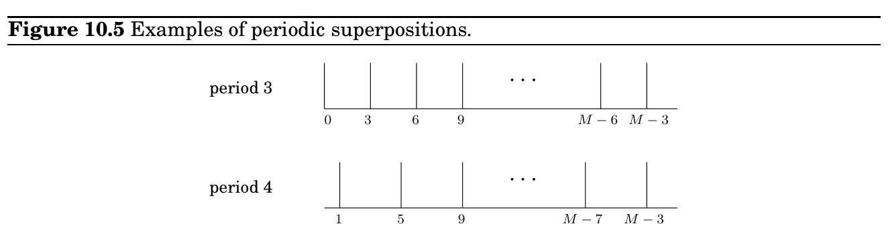

import Guide from '@/components/Guide.astro';
import Knowledge from '@/components/Knowledge.astro';
import Example from '@/components/Example.astro';
import Analysis from '@/components/Analysis.astro';
import Solution from '@/components/Solution.astro';
import Variant from '@/components/Variant.astro';
import Note from '@/components/Note.astro';
import Block from '@/components/Block.astro';
import Method from '@/components/Method.astro';
import Exercise from '@/components/Exercise.astro';

## 10.4 Periodicity

Input: A superposition of m = log M qubits,

α

= PM−1

j=0 α_&#123;j&#125;

j

.

Method: Using O(m^&#123;2&#125;) = O(log^&#123;2&#125; M) quantum operations perform the quantum FFT to obtain the superposition

β

= PM−1

j=0 β_&#123;j&#125;

j

.

Output: A random m-bit number j (that is, 0 ≤j ≤M −1), from the probability distribution Pr[j] = |β_&#123;j&#125;|^&#123;2&#125;.

Quantum Fourier sampling is basically a quick way of getting a very rough idea about the output of the classical FFT, just detecting one of the larger components of the answer vector. In fact, we don’t even see the value of that component—we only see its index. How can we use such meager information? In which applications of the FFT is just the index of the large components enough? This is what we explore next.

Suppose that the input to the QFT,

α

= (α_&#123;0&#125;, α_&#123;1&#125;, . . . , α_&#123;M&#125;−1), is such that α_&#123;i&#125; = α_&#123;j&#125; whenever i ≡j mod k, where k is a particular integer that divides M. That is, the array α consists of M/k repetitions of some sequence (α_&#123;0&#125;, α_&#123;1&#125;, . . . , α_&#123;k&#125;−1) of length k. Moreover, suppose that exactly one of the k numbers α_&#123;0&#125;, . . . , α_&#123;k&#125;−1 is nonzero, say α_&#123;j&#125;. Then we say that

α

is periodic with period k and offset j.

It turns out that if the input vector is periodic, we can use quantum Fourier sampling to compute its period! This is based on the following fact, proved in the next box:

Suppose the input to quantum Fourier sampling is periodic with period k, for some k that divides M. Then the output will be a multiple of M/k, and it is equally likely to be any of the k multiples of M/k.

Now a little thought tells us that by repeating the sampling a few times (repeatedly preparing the periodic superposition and doing Fourier sampling), and then taking the greatest common divisor of all the indices returned, we will with very high probability get the number M/k— and from it the period k of the input!

### The Fourier transform of a periodic vector

Suppose the vector

α

= (α_&#123;0&#125;, α_&#123;1&#125;, . . . , α_&#123;M&#125;−1) is periodic with period k and with no offset (that is, the nonzero terms are α_&#123;0&#125;, α_&#123;k&#125;, α_&#123;2&#125;k, . . .). Thus,

α

=

M/k−1 X

j=0

q

k

M

jk

.

We will show that its Fourier transform

β

= (β_&#123;0&#125;, β_&#123;1&#125;, . . . , β_&#123;M&#125;−1) is also periodic, with period M/k and no offset.

Claim

β

= 1

√

k

Pk−1

j=0

jM

k

.

Proof. In the input vector, the coefficient α_&#123;ℓ&#125;is

p

k/M if k divides ℓ, and is zero otherwise. We can plug this into the formula for the jth coefficient of

β

:

β_&#123;j&#125; = 1

√

M

M−1 X

ℓ=0

ω^&#123;jℓ&#125;α_&#123;ℓ&#125;=

√

k

M

M/k−1 X

i=0

ω^&#123;jik&#125;.

The summation is a geometric series, 1 + ω^&#123;jk&#125; + ω^&#123;2&#125;jk + ω^&#123;3&#125;jk + · · · , containing M/k terms and with ratio ω^&#123;jk&#125; (recall that ω is a complex Mth root of unity). There are two cases. If the ratio is exactly 1, which happens if jk ≡0 mod M, then the sum of the series is simply the number of terms. If the ratio isn’t 1, we can apply the usual formula for geometric series to find that the sum is_&#123; &#125;1−ω^&#123;jk&#125;(M/k)

1−ω^&#123;jk&#125; =^&#123; &#125;1−ω^&#123;Mj&#125;

1−ω^&#123;jk&#125; = 0.

Therefore β_&#123;j&#125; is 1/

√

k if M divides jk, and is zero otherwise.

More generally, we can consider the original superposition to be periodic with period k, but with some offset l &lt; k:

α

=

M/k−1 X

j=0

q

k

M

jk + l

.

Then, as before, the Fourier transform

β

will have nonzero amplitudes precisely at multiples of M/k:

Claim

β

= 1

√

k

Pk−1

j=0 ω^&#123;ljM/k&#125; jM

k

.

The proof of this claim is very similar to the preceding one (Exercise 10.5).

We conclude that the QFT of any periodic superposition with period k is an array that is everywhere zero, except at indices that are multiples of M/k, and all these k nonzero coefficients have equal absolute values. So if we sample the output, we will get an index that is a multiple of M/k, and each of the k such indices will occur with probability 1/k.
