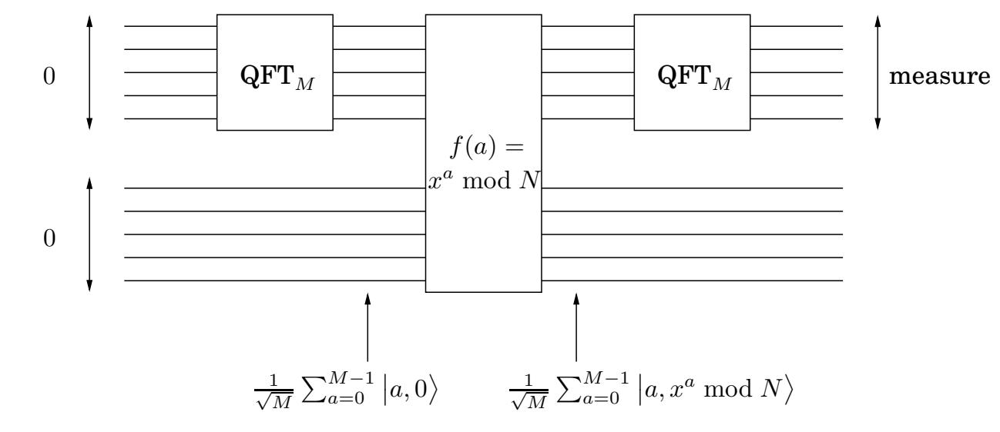

import Guide from '@/components/Guide.astro';
import Knowledge from '@/components/Knowledge.astro';
import Example from '@/components/Example.astro';
import Analysis from '@/components/Analysis.astro';
import Solution from '@/components/Solution.astro';
import Variant from '@/components/Variant.astro';
import Note from '@/components/Note.astro';
import Block from '@/components/Block.astro';
import Method from '@/components/Method.astro';
import Exercise from '@/components/Exercise.astro';

## 10.7 The quantum algorithm for factoring

We can now put together all the pieces of the quantum algorithm for FACTORING (see Figure 10.6). Since we can test in polynomial time whether the input is a prime or a prime power, we'll assume that we have already done that and that the input is an odd composite number with at least two distinct prime factors.

Input: an odd composite integer N.

Output: a factor of N.

1. Choose x uniformly at random in the range $1 \leq x \leq N - 1$

2. Let M be a power of 2 near N (for reasons we cannot get into here, it is best to choose $M \approx N ^ { 2 } )$ .

3. Repeat s = 2 log N times:

(a) Start with two quantum registers, both initially 0, the first large enough to store a number modulo M and the second modulo N.

Figure 10.6 Quantum factoring.  

(b) Use the periodic function $f ( a ) \equiv x ^ { a }$ mod N to create a periodic superposition $\left| \alpha \right.$ of length M as follows (see box for details):

i. Apply the $\mathbf { Q F T }$ to the first register to obtain the superposition $\textstyle \sum _ { a = 0 } ^ { M - 1 } { \frac { 1 } { \sqrt { M } } } { \big | } a , 0 \rangle$

ii. Compute $f ( a ) \ : = \ : x ^ { a }$ mod N using a quantum circuit, to get the superposition $\textstyle \sum _ { a = 0 } ^ { M - 1 } { \frac { 1 } { \sqrt { M } } } { \dot { | a , x ^ { a } } }$ mod $N \rangle$

iii. Measure the second register. Now the first register contains the periodic superposition $\begin{array} { r } { \left| \alpha \right. = \sum _ { j = 0 } ^ { M / r - 1 } \sqrt { \frac { r } { M } } \big | j r + k \big \rangle } \end{array}$ where k is a random offset between 0 and $r - 1$ (recall that r is the order of x modulo N).

(c) Fourier sample the superposition $\left| \alpha \right.$ to obtain an index between 0 and $M - 1$

Let $g$ be the gcd of the resulting indices $j _ { 1 } , \dots , j _ { s }$

4. If $M / g$ is even, then compute $\operatorname* { g c d } ( N , x ^ { M / 2 g } + 1 )$ and output it if it is a nontrivial factor of $N ;$ otherwise return to step 1.

From previous lemmas, we know that this method works for at least half the choices of $x ,$ and hence the entire procedure has to be repeated only a couple of times on average before a factor is found.

But there is one aspect of this algorithm, having to do with the number M, that is still quite unclear: M, the size of our FFT, must be a power of 2. And for our period-detecting idea to work, the period must divide M—hence it should also be a power of 2. But the period in our case is the order of $x ,$ definitely not a power of 2!

The reason it all works anyway is the following: the quantum Fourier transform can detect the period of a periodic vector even $i f$ it does not divide M. But the derivation is not as clean as in the case when the period does divide $M ,$ so we shall not go any further into this.

Let n = log N be the number of bits of the input N. The running time of the algorithm is dominated by the 2 log $N = O ( n )$ repetitions of step 3. Since modular exponentiation takes

$O ( n ^ { 3 } )$ steps (as we saw in Section 1.2.2) and the quantum Fourier transform takes $O ( n ^ { 2 } )$ steps, the total running time for the quantum factoring algorithm is $O ( n ^ { 3 } \log { n } )$ 1

<Knowledge title="Box: Quantum physics meets computation">

In the early days of computer science, people wondered whether there were much more powerful computers than those made up of circuits composed of elementary gates. But since the seventies this question has been considered well settled. Computers implementing the von Neumann architecture on silicon were the obvious winners, and it was widely accepted that any other way of implementing computers is polynomially equivalent to them. That is, a T-step computation on any computer takes at most some polynomial in T steps on another. This fundamental principle is called the extended Church-Turing thesis. Quantum computers violate this fundamental thesis and therefore call into question some of our most basic assumptions about computers.

Can quantum computers be built? This is the challenge that is keeping busy many research teams of physicists and computer scientists around the world. The main problem is that quantum superpositions are very fragile and need to be protected from any inadvertent measurement by the environment. There is progress, but it is very slow: so far, the most ambitious reported quantum computation was the factorization of the number 15 into its factors 3 and 5 using nuclear magnetic resonance (NMR). And even in this experiment, there are questions about how faithfully the quantum factoring algorithm was really implemented. The next decade promises to be really exciting in terms of our ability to physically manipulate quantum bits and implement quantum computers.

But there is another possibility: What if all these efforts at implementing quantum computers fail? This would be even more interesting, because it would point to some fundamental flaw in quantum physics, a theory that has stood unchallenged for a century.

Quantum computation is motivated as much by trying to clarify the mysterious nature of quantum physics as by trying to create novel and superpowerful computers.

</Knowledge>
