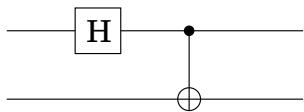
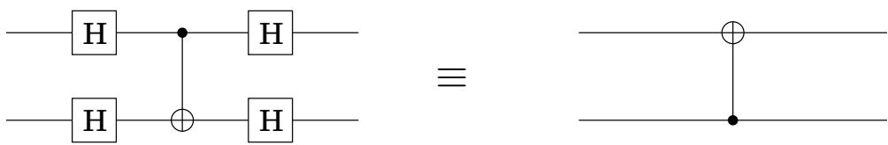

import Guide from '@/components/Guide.astro';
import Knowledge from '@/components/Knowledge.astro';
import Example from '@/components/Example.astro';
import Analysis from '@/components/Analysis.astro';
import Solution from '@/components/Solution.astro';
import Variant from '@/components/Variant.astro';
import Note from '@/components/Note.astro';
import Block from '@/components/Block.astro';
import Method from '@/components/Method.astro';
import Exercise from '@/components/Exercise.astro';

## Chapter 10 Exercises

<Exercise title="Exercise 10.1">

$\textstyle { \left| { \psi } \right. } \ = \ { \frac { 1 } { \sqrt { 2 } } } { \left| { 0 0 } \right. } \ + \ { \frac { 1 } { \sqrt { 2 } } } { \left| { 1 1 } \right. }$ is one of the famous “Bell states,” a highly entangled state of its two qubits. In this question we examine some of its strange properties.

(a) Suppose this Bell state could be decomposed as the (tensor) product of two qubits (recall the box on page 298), the first in state $\alpha _ { 0 } | 0 \rangle + \alpha _ { 1 } | 1 \rangle$ and the second in state $\beta _ { 0 } | 0 \rangle + \beta _ { 1 } | 1 \rangle$ Write four equations that the amplitudes $\alpha _ { 0 } , \alpha _ { 1 } , \beta _ { 0 }$ , and $\beta _ { 1 }$ must satisfy. Conclude that the Bell state cannot be so decomposed.

(b) What is the result of measuring the first qubit of $| \psi \rangle \ ?$

(c) What is the result of measuring the second qubit after measuring the first qubit?

(d) If the two qubits in state $\left| \psi \right.$ are very far from each other, can you see why the answer to (c) is surprising?

</Exercise>

<Exercise title="Exercise 10.2">

Show that the following quantum circuit prepares the Bell state $\begin{array} { r } { { \left| { \psi } \right. } = \frac { 1 } { \sqrt { 2 } } { \left| { 0 0 } \right. } + \frac { 1 } { \sqrt { 2 } } { \left| { 1 1 } \right. } } \end{array}$ on input 00 : apply a Hadamard gate to the first qubit followed by a CNOT with the first qubit as the control and the second qubit as the target.

What does the circuit output on input 10, 01, and 11? These are the rest of the Bell basis states.

</Exercise>

<Exercise title="Exercise 10.3">

What is the quantum Fourier transform modulo M of the uniform superposition $\begin{array} { r } { \frac { 1 } { \sqrt { M } } \sum _ { j = 0 } ^ { M - 1 } \left| j \right. \ ? } \end{array}$

</Exercise>

<Exercise title="Exercise 10.4">

What is the QFT modulo M of $\vert j \rangle \ ?$

</Exercise>

<Exercise title="Exercise 10.5">

Convolution-Multiplication. Suppose we shift a superposition $\begin{array} { r } { | \alpha \rangle \ = \ \sum _ { j } \alpha _ { j } | j \rangle } \end{array}$ by l to get the superposition $\begin{array} { r } { \left| \alpha ^ { \prime } \right. = \sum _ { j } \alpha _ { j } \left| j + l \right. } \end{array}$ . If the QFT of $\left| \alpha \right.$ is $| \beta \rangle$ , show that the QFT of $\alpha ^ { \prime }$ is $\beta ^ { \prime }$ , where $\beta _ { j } ^ { \prime } = \beta _ { j } \omega ^ { l j }$ . Conclude that if $\begin{array} { r } { \left| \alpha ^ { \prime } \right. = \sum _ { j = 0 } ^ { M / k - 1 } \sqrt { \frac { k } { M } } \left| j k + l \right. } \end{array}$ , then $\begin{array} { r } { \left| \beta ^ { \prime } \right. = \frac { 1 } { \sqrt { k } } \sum _ { j = 0 } ^ { k - 1 } \omega ^ { l j M / k } \big | j M / k \big \rangle } \end{array}$

</Exercise>

<Exercise title="Exercise 10.6">

Show that if you apply the Hadamard gate to the inputs and outputs of a CNOT gate, the result is a CNOT gate with control and target qubits switched:

</Exercise>

<Exercise title="Exercise 10.7">

The CONTROLLED SWAP (C-SWAP) gate takes as input 3 qubits and swaps the second and third if and only if the first qubit is a 1.

(a) Show that each of the NOT, CNOT, and C-SWAP gates are their own inverses.

(b) Show how to implement an AND gate using a C-SWAP gate, i.e., what inputs $a , b ,$ c would you give to a C-SWAP gate so that one of the outputs is $a \wedge b ?$

(c) How would you achieve fanout using just these three gates? That is, on input a and 0, output a and a.

(d) Conclude therefore that for any classical circuit C there is an equivalent quantum circuit $Q$ using just NOT and C-SWAP gates in the following sense: if C outputs y on input $x ,$ then $Q$ outputs $\left| x , y , z \right.$ on input $| x , 0 , 0 \rangle$ . (Here z is some set of junk bits that are generated during this computation).

(e) Now show that that there is a quantum circuit $Q ^ { - 1 }$ that outputs $| x , 0 , 0 \rangle$ on input $\left| x , y , z \right.$

(f) Show that there is a quantum circuit $Q ^ { \prime }$ made up of NOT, CNOT, and C-SWAP gates that outputs $| x , y , 0 \rangle$ on input $| x , 0 , 0 \rangle$

</Exercise>

<Exercise title="Exercise 10.8">

In this problem we will show that if $N = p q$ is the product of two odd primes, and if $x$ is chosen uniformly at random between 0 and $N - 1$ , such that $\operatorname* { g c d } ( x , N ) = 1$ , then with probability at least $3 / 8 _ { ! }$ , the order r of x mod N is even, and moreover $x ^ { r / 2 }$ is a nontrivial square root of 1 mod N.

(a) Let $p$ be an odd prime and let x be a uniformly random number modulo $p .$ Show that the order of x mod p is even with probability at least $1 / 2$ . (Hint: Use Fermat's little theorem (Section 1.3).)

(b) Use the Chinese remainder theorem (Exercise 1.37) to show that with probability at least $3 / 4$ , the order r of x mod N is even.

(c) If r is even, prove that the probability that $x ^ { r / 2 } \equiv \pm 1$ is at most $1 / 2$

</Exercise>
