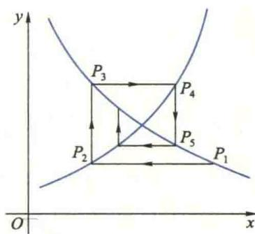

import Guide from '@/components/Guide.astro';
import Knowledge from '@/components/Knowledge.astro';
import Example from '@/components/Example.astro';
import Analysis from '@/components/Analysis.astro';
import Solution from '@/components/Solution.astro';
import Variant from '@/components/Variant.astro';
import Note from '@/components/Note.astro';
import Block from '@/components/Block.astro';
import Method from '@/components/Method.astro';

<Block title="第1章习题">
1. 选择题(在每小题给出的四个选项中只有一个是正确的,试选择正确的选项并说明理由.)

(1) $\forall \varepsilon > 0$ , 有无穷多个 $x_{n} \in (a - \varepsilon, a + \varepsilon)$ 是数列 $\{x_{n}\}$ 收敛于 a 的 ( ) .

(A) 充分条件,但非必要条件 (B) 必要条件,但非充分条件

(C) 充要条件 (D) 既非充分条件,也非必要条件

(2) 设数列 $\{a_{n}\},\{b_{n}\},\{c_{n}\}$ 满足 $a_{n}\leqslant b_{n}\leqslant c_{n}$ ，且 $\lim_{n\to\infty}(c_{n}-a_{n})=0$ ，则数列 $\{b_{n}\}$ 的极限（）.

(A) 存在且为零

(B) 存在但不一定为零

(C) 一定不存在

(D) 不一定存在

(3) 设数列 $\{x_{n}\}$ 与 $\{y_{n}\}$ 满足 $\lim_{n\to\infty}x_{n}y_{n}=0$ ，则下列断言正确的是（）.

(A) 若 $x_{n}$ 发散，则 $y_{n}$ 必发散 (B) 若 $x_{n}$ 无界，则 $y_{n}$ 必无界(C) 若 $x_{n}$ 有界, 则 $y_{n}$ 必为无穷小 (D) 若 $\frac{1}{x_{n}}$ 为无穷小, 则 $y_{n}$ 必为无穷小

(4) 设有数列 $\{x_{n}\}$ 与 $\{y_{n}\}$ ，以下结论正确的是（）.

(A) 若 $\lim_{n\to\infty}x_ny_n=0$ ，则必有 $\lim_{n\to\infty}x_n=0$ 或 $\lim_{n\to\infty}y_n=0$ (B) 若 $\lim_{n\to\infty}x_ny_n=\infty$ ，则必有 $\lim_{n\to\infty}x_n=\infty$ 或 $\lim_{n\to\infty}y_n=\infty$ (C) 若 $\{x_{n}y_{n}\}$ 有界，则必有 $\{x_{n}\}$ 与 $\{y_{n}\}$ 都有界

(D) 若 $\{x_{n}y_{n}\}$ 无界，则必有 $\{x_{n}\}$ 无界或 $\{y_{n}\}$ 无界

(5) 当 $x \to 0$ 时, 变量 $\frac{1}{x^{2}} \sin \frac{1}{x}$ 是().  

(A) 无穷小量 (B) 无穷大量  

(C) 有界的但不是无穷小量 (D) 无界的但不是无穷大量

(6) 设 $f(x), \varphi(x)$ 在 $(-∞, +∞)$ 上有定义， $f(x)$ 为连续函数，且 $f(x) \neq 0, \varphi(x)$ 有间断点，则 (A).  

(A) $\varphi[f(x)]$ 必有间断点  

(B) $[\varphi(x)]^{2}$ 必有间断点  

(C) $f[\varphi(x)]$ 必有间断点  

(D) $\frac{\varphi(x)}{f(x)}$ 必有间断点

(7) x=0 是函数 $f(x)=\frac{2+\mathrm{e}^{\frac{1}{x}}}{1+\mathrm{e}^{\frac{4}{x}}}+\frac{\sin x}{|x|}$ 的 ( ). 

(A) 跳跃间断点 (B) 可去间断点

(C) 无穷间断点 (D) 振荡间断点

(8) 设函数 $f(x)=\frac{x}{a+\mathrm{e}^{bx}}$ 在 $(-∞,+∞)$ 上连续，且 $\lim_{x\to-\infty}f(x)=0$ ，则常数 a,b 满足（）.

(A) a&lt;0, b&lt;0

(B) a>0, b>0

(C) $a \leqslant 0, b > 0$ (D) $a \geqslant 0, b < 0$

(9) 已知函数 $f(x) = \frac{(x^2 + a^2)(x - 1)}{\mathrm{e}^{\frac{1}{x}} + b}$ 在 $(- \infty, + \infty)$ 上有一个可去间断点和一个跳跃间断点，则

(A) $a=1,b=-1$ (B) $a=0,b=1$ (C) $a\neq0,b=-e$ (D) $a=e,b=-1$

2. 已知 $f(x) = \sin x, f(\varphi(x)) = 1 - x^2$ ，试求 $\varphi(x)$ 及其定义域.

3. 求下列极限：

(1) $\lim_{n\to\infty}\left(\frac{1}{n^{2}+n+1}+\frac{2}{n^{2}+n+2}+\cdots+\frac{n}{n^{2}+n+n}\right)$ ; (2) $\lim_{n\to\infty}n^{2}\left(\mathrm{e}^{\frac{1}{n}}-\mathrm{e}^{\frac{1}{n+1}}\right)$ ;

(3) $\lim_{x\to0}\frac{\sqrt{1+\tan x}-\sqrt{1+\sin x}}{x\sin^{2}x}$ ; (4) $\lim_{x\to1}\frac{x+x^{2}+\cdots+x^{n}-n}{x-1}$ ;

(5) $\lim_{x\to0}\frac{(1+2\sin x)^{x}-1}{x^{2}};$ (6) $\lim_{x\to0}\frac{(a+x)^{x}-a^{x}}{x^{2}}(a>0).$

4. 试确定常数 $a$ 与 $n$ 的一组值，使得当 $x \to 0$ 时， $\mathrm{e}^{2x^2} - \ln [\mathrm{e}(1 + x^2)]$ 与 $ax^n$ 为等价无穷小.

5. 设 $f(x) = \lim_{t \to x} \left( \frac{\sin t}{\sin x} \right)^{\frac{x}{\sin t - \sin x}}$ ，试确定 $f(x)$ 的间断点，并指出其类型.

6. 设 $f(x) = \lim_{n\to \infty}\frac{x^{2n - 1} + ax^2 + bx}{x^{2n} + 1}$ 在 $(- \infty, + \infty)$ 内连续，试确定常数 $a$ 和 $b$ .

7. 某人为了孩子的教育,打算在银行存入一笔资金,希望这笔资金10年后价值为12 000元.

（1）如果银行以年利率 9%、每年支付复利四次的方式付息，问此人一开始应在银行存入多少元？

(2) 如果复利是连续的, 此人一开始应在银行存入多少元?

8. 设有方程 $x^{n}+nx-1=0$ ，其中 n 为正整数。证明此方程存在唯一正实根 $x_{n}$ ，并证明 $\lim_{n\to\infty}x_{n}=0$ 。

9. 设 $f(x)$ 在 $(- \infty, + \infty)$ 上连续，且 $\lim_{x \to \infty} \frac{f(x)}{x} = 0$ ，试证明存在 $\xi \in (-\infty, + \infty)$ ，使 $f(\xi) + \xi = 0$ .

## 综合练习题

1. 设有一对新出生的兔子,两个月之后成年.从第三个月开始,每个月产一对小兔,且新生的每对小兔也在出生两个月之后成年,第三个月开始每月生一对小兔.假定出生的兔均无死亡,(1)问一年后共有几对兔子?(2)问n个月之后有多少对兔子?(3)若n个月之后有 $F_{n}$ 对兔子,试求 $\lim_{n\to\infty}\frac{F_{n}}{F_{n+1}}$ (题中所讲的一对兔子均是雌雄异性的).

说明:该问题是意大利数学家 Fibonacci 于 13 世纪初(1202 年)研究兔子繁殖过程中数量变化规律时提出来的,其中的数列 $\{F_{n}\}$ 被后人称为 Fibonacci 数列.有趣的是,极限 $\lim_{n\to\infty}\frac{F_{n}}{F_{n+1}}=\frac{\sqrt{5}-1}{2}\approx0.618$ 正是“黄金分割”数,在优选法及许多领域得到很多新应用.

2. 所谓蛛网模型是在研究市场经济的一种循环现象中提出来的, 现以猪肉的产量与价格之间的关系为例来说明. 若去年猪肉的产量供过于求, 它的价格就会降低; 价格降低会使今年养猪者减少, 使猪肉的产量供不应求, 于是肉价上扬; 价格上扬又使明年猪肉产量增加, 造成新的供过于求, 如此循环下去. 设 $x_{n}$ 为第 $n$ 年的猪肉产量, $y_{n}$ 为其价格, 由于当年的产量确定当年价格, 所以 $y_{n} = f(x_{n})$ , 称为需求函数. 而第 $n$ 年的价格又决定第 $n + 1$ 年的产量, 故 $x_{n+1} = g(y_{n})$ , 称为供应函数. 产销关系呈现出如下过程:

$$

x _ {1} \rightarrow y _ {1} \rightarrow x _ {2} \rightarrow y _ {2} \rightarrow x _ {3} \rightarrow y _ {3} \rightarrow x _ {4} \rightarrow \dots .

$$

在平面直角坐标系中描出下面的点列：

$$

\begin{array}{r l} & P _ {1} (x _ {1}, y _ {1}), \quad P _ {2} (x _ {2}, y _ {1}), \quad P _ {3} (x _ {2}, y _ {2}), \quad P _ {4} (x _ {3}, y _ {2}), \quad \dots \\ & \qquad P _ {2 k - 1} (x _ {k}, y _ {k}), \quad P _ {2 k} (x _ {k + 1}, y _ {k}) (k = 1, 2, \dots), \end{array}

$$

其中所有的点 $P_{2k}$ 都满足 $x=g(y)$ , $P_{2x-1}$ 满足 $y=f(x)$ ，如图所示。由于这种关系很像一个蛛网，所以称为蛛网模型。

据统计,某城市1991年猪肉产量为30万吨,肉价为6元/千克;1992年猪肉产量为25万吨,肉价为8元/千克.已知1993年的猪肉产量为28万吨.若维持目前的消费水平和生产模式,并假定猪肉当年的价格与当年的产量之间、来年的产量与当年的价格之间都是线性关系.

(1) 试确定需求函数 $y_{n}=f(x_{n})$ 和供应函数 $x_{n+1}=g(y_{n})$ ;

(2) 求 $\lim_{n\to\infty}x_{n+1}$ 与 $\lim_{n\to\infty}y_{n+1}$ ;

（3）问若干年后猪肉的产量与价格是否会趋于稳定？若能够稳定，求出稳定的产量和价格.

  

(第2题图)
</Block>
