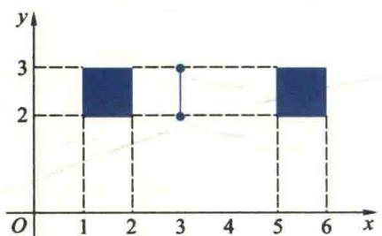
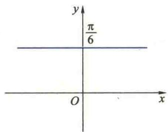

import Guide from '@/components/Guide.astro';
import Knowledge from '@/components/Knowledge.astro';
import Example from '@/components/Example.astro';
import Analysis from '@/components/Analysis.astro';
import Solution from '@/components/Solution.astro';
import Variant from '@/components/Variant.astro';
import Note from '@/components/Note.astro';
import Block from '@/components/Block.astro';
import Method from '@/components/Method.astro';

<Block title="习题1.1 答案">
(A)

1. (1) $\{1,2,3,4,5,6,7,8\},\{8\},\{1,3,5,7\},\{2,4,6\}$ ;

(2) 平行四边形全体构成的集, 矩形全体构成的集, 除矩形之外的平行四边形构成的集, ∅;

(3) $A, B, \{0\}, \varnothing$ .

2. $[-1, 2)$ . 3. $\bigcap_{i=1}^{5} A_i^c = \left( \bigcup_{i=1}^{5} A_i \right)^c = \{5, 9\}$ .

4. (1)

(2)

8. (1) $\sup A = 1, \inf A = \frac{1}{2}, \sup B = \sqrt{5}, \inf B = -1$ ;

(2) $\max A$ 不存在, $\min A = \frac{1}{2}$ , $\max B = \sqrt{5}$ , $\min B$ 不存在.

9.（1）满射；（2）满射；（3）单射.

12.（1）不相等，因定义域不同；(2)相等，因 $f(x)=\left|x\right|$ ；(3)不相等，因 $f(x)=\left|\sin x\right|$

(4) 相等. 定义域都是 $[1, +\infty)$ ，且 $f(x) = \ln \frac{1}{x - \sqrt{x^{2} - 1}} = g(x)$ ;

(5) 相等, 因 $f(x)$ 与 $g(t)$ 仅自变量的符号不同.

13. 都是 $x$ 的函数.

15. $f(x)=\left\{\begin{aligned}&5-3x,&x\leqslant1,\\ &3-x,&1<x<2,\\ &3x-5,&x\geqslant2.\end{aligned}\right.$

16. (1) $y = u^3, u = \sin v, v = \sqrt{1 - 2x} \left( x \leqslant \frac{1}{2} \right)$ ; (2) $y = \arccos u, u = \frac{x - 2}{2}$ ( $0 \leqslant x \leqslant 4$ ); (3) $y = \frac{1}{1 + u}, u =$

$$

\arctan v, v = 2 x \left(x \neq k \pi - \frac {\pi}{8}, k \in \mathbf {Z}\right); (4) y = \sqrt {1 + u ^ {2}}, u = \ln v, v = \arcsin x (0 <   x \leqslant 1).

$$

17. $(f \circ \varphi)(x) = \sin^{3}2x - \sin 2x, x \in (-\infty, +\infty)$ ,

$$

(\varphi \circ f) (x) = \sin 2 (x ^ {3} - x), x \in (- \infty , + \infty)

$$

$$

(f \circ f) (x) = (x ^ {3} - x) ^ {3} - (x ^ {3} - x), x \in (- \infty , + \infty).

$$

18. (1) $y = \begin{cases} 0, & -\infty < x < -1, \\ h(x + 1), & -1 \leqslant x < 0, \\ -h(x - 1), & 0 \leqslant x \leqslant 1, \\ 0, & 1 < x < +\infty; \end{cases}$ (2) $y = \begin{cases} 0, & -\infty < x < -1, \\ \sqrt{1 - x^2}, & -1 \leqslant x \leqslant 1, \\ \frac{\sqrt{3}}{3}(x - 1), & 1 < x < +\infty. \end{cases}$

19. 根据池中水的高度 x 与池中水的质量 T 的函数关系 $x = -5 + \sqrt{25 + 0.02T}$ ( $T \in [0, 10\,000]$ ) 设计标尺刻度的位置.

20. $V = \frac{R^3\theta^2}{24\pi^2}\sqrt{4\pi^2 - \theta^2}$ （ $0 <   \theta <  2\pi$ ）.

(B)

4. (1) $(f \circ g)(x) = 0 (x = 0), (g \circ f)(x) = \sqrt{2 - x^2} (1 \leqslant |x| \leqslant \sqrt{2})$ ;

$$

(2) (f \circ g) (x) = \arcsin \left(\frac {x}{2} - 1\right) (0 \leqslant x \leqslant 4), (g \circ f) (x) = \left\{ \begin{array}{l l} \frac {1}{2} \arcsin (x - 1), & 0 \leqslant x \leqslant 1, \\ \frac {1}{2} \arcsin \left(\frac {x ^ {2}}{2} - 1\right), & 1 <   x \leqslant 2. \end{array} \right.

$$

5. $f^{-1}(x) = \left\{ \begin{array}{ll} - \sqrt{x + 1}, & -1 <   x\leqslant 0,\\ \sqrt{x - 1}, & 1\leqslant x\leqslant 2. \end{array} \right.$

7. $f(x)=x+1.$

8. 提示：取 $y = 1$ ，得 $f(x) = xf(x) + f(1)$ . 再取 $x = y = 1$ ，可得 $f(1) = 0$ ，从而得证.

9. $f(x)=x^{2}-2, x\in(-\infty,-2]\cup[2,+\infty)$ ,

$$

f \left(x - \frac {1}{x}\right) = x ^ {2} + \frac {1}{x ^ {2}} - 4, x \in (- \infty , - (\sqrt {2} + 1) ] \cup [ \sqrt {2} + 1, + \infty).

$$

## 习题1.2

(A)

1.（1）不能.对无穷多个 $\varepsilon >0$ 满足(2.2)式，不能推出对任意 $\varepsilon >0$ 满足(2.2)式

(2) 不能. 对于任意的 $\varepsilon > 0$ , 存在 $N \in \mathbf{N}_{+}$ , 当 $n > N$ 时, 有无穷多项 $a_{n}$ , 使不等式 $|a_{n} - a| < \varepsilon$ 成立. 不能推出对任意给定的 $\varepsilon > 0$ , 存在 $N \in \mathbf{N}_{+}$ , 当 $n > N$ 时的所有的 $a_{n}$ , 使不等式 $|a_{n} - a| < \varepsilon$ 成立.

(3) 不能.

3. 若 $\{a_{n}\}$ , $\{b_{n}\}$ 都发散, 它们的和与积不一定发散, 例如 $a_{n}=(-1)^{n}, b_{n}=(-1)^{n+1}$ , 则 $a_{n}+b_{n}=0, a_{n}b_{n}=-1$ . 若 $\{a_{n}\}, \{b_{n}\}$ 中有一个收敛, 则其和必发散 (用反证法), 积不一定. 若 $\lim_{n\to\infty}a_{n}\neq0$ , 则 $\{a_{n}b_{n}\}$ 必发散;

若 $\lim_{n\to \infty}a_n = 0$ ，则 $\{a_nb_n\}$ 可能收敛（举例说明）.

4.（1）不正确.本题不是有限项和；

(2) 不正确. 本题不是有限项乘积;

(3) 不正确. 等式两边取极限要求等式两边极限存在, 但 $\lim_{n\to\infty}q^{n}$ 不存在.

5. 不能. 如 $a_{n} = \frac{1}{n} < b_{n} = \frac{2}{n}$ , 但 $\lim_{n\to \infty}a_n = \lim_{n\to \infty}b_n = 0.$

6.（1）正确（给出证明）；（2）不正确，如 $a_{n} = (-1)^{n}$ ；（3）正确；（4）正确；

（5）不正确，如 $a_{n} = \frac{1}{n!},\lim_{n\to \infty}a_n = 0$ ，但 $\lim_{n\to \infty}\frac{a_{n + 1}}{a_n} = \lim_{n\to \infty}\frac{1}{n + 1} = 0\neq 1;$

(6) 正确. 设 $\alpha > 0, \lim_{n \to \infty} a_n = \lim_{n \to \infty} \left( \alpha a_n \cdot \frac{1}{\alpha} \right) = \alpha A \cdot \frac{1}{\alpha} = A.$

7.（1）提示： $\left|\frac{1}{n}\sin \frac{n\pi}{2} -0\right|\leqslant \frac{1}{n};$

(2) 提示: $\left|n - \sqrt{n^2 - n} - \frac{1}{2}\right| = \left|\frac{n}{n + \sqrt{n^2 - n}} - \frac{1}{2}\right| < \frac{1}{2n}$ ;

(3) 提示: $\left|\frac{1+\cos n}{n^{2}}-0\right|\leqslant\frac{2}{n^{2}};$

（4）提示：令 $\left|\sqrt[n]{n}-1\right|=\sqrt[n]{n}-1=\alpha_{n}$ ，则 $\alpha_{n}>0$ ，且 $n=(1+\alpha_{n})^{n}=1+n\alpha_{n}+\frac{n(n-1)}{2!}\alpha_{n}^{2}+\cdots+\alpha_{n}^{n}>\frac{n(n-1)}{2!}\alpha_{n}^{2}$

从而有 $\alpha_{n} <   \sqrt{\frac{2}{n - 1}}.$

10. (1) $\frac{1}{5}$ ; (2) $\frac{1}{3}$ ; (3) $-\frac{1}{2}$ ; (4) 2; (5) 2; (6) 1; (7) $\frac{1}{3}$ ; (8) e; (9) $\frac{1}{e}$ ; (10) e.

11.（1）收敛；（2）收敛；（3）收敛；（4）收敛；（5）收敛.

13. (1) 0,1; (2) 5,1; (3) 0.

14. $x_{n + 1} = 1 - (1 - x_1)^{1 / 2^n}\rightarrow 0,\frac{x_{n + 1}}{x_n} = \frac{1}{1 + \sqrt{1 - x_n}}\rightarrow \frac{1}{2},n\to \infty .$

15. 因 $x_{n+1} \geqslant \sqrt{x_n \cdot \frac{a}{x_n}} = \sqrt{a}, \frac{x_{n+1}}{x_n} = \frac{1}{2}\left(1 + \frac{a}{x_n^2}\right) \leqslant 1$ ，令 $\lim_{n \to \infty} x_n = A$ ，则 $A^2 = \frac{1}{2}(A^2 + a)$ ，故 $A = \sqrt{a}$ .

16. 可先证 $\{a_{n}\}$ 有上界，且 $\{b_{n}\}$ 有下界，进而完成证明.

(B)

1. 提示：利用 Cauchy 收敛原理.

2. (1) $|x| > 1, 1; |x| < 1, -1; x = 1, \frac{-1}{3}; x = -1$ , 发散. (2) $\frac{3}{4}$ ; (3) $\frac{1}{2}$ ; (4) 1; (5) $e^{-3}$ ; (6) $e^4$ .

3.（1）提示：由 $a_{n}\rightarrow 0$ 知， $\forall \varepsilon >0,\exists N_0\in \mathbf{N}_+$ ，使 $\forall n > N_0,|a_n| <   \frac{\varepsilon}{2}$ 所以

$$

\begin{array}{r l} \left| b _ {n} \right| & = \left| \frac {a _ {1} + \cdots + a _ {N _ {0}}}{n} + \frac {a _ {N _ {0} + 1} + \cdots + a _ {n}}{n} \right| \\ & \leqslant \frac {\left| a _ {1} + \cdots + a _ {N _ {0}} \right|}{n} + \frac {\left| a _ {N _ {0} + 1} \right| + \cdots + \left| a _ {n} \right|}{n} <   \frac {\left| a _ {1} + \cdots + a _ {N _ {0}} \right|}{n} + \frac {\varepsilon}{2}, \end{array}

$$

而 $\frac{\left|a_{1}+\cdots+a_{N_{0}}\right|}{n}<\frac{\varepsilon}{2}$ （只要n充分大）；

(2) 提示: 令 $\widetilde{a}_n = a_n - a$ , 则 $\widetilde{a}_n \to 0$ , 再利用 (1) 中的结论.

4.（1）0；(2)可先证 $a_{n}$ 单调增，有上界 $\sqrt{a} + 1$ ，进而知其收敛，极限值为 $\frac{1}{2} (1 + \sqrt{1 + 4a})$

(3) $\left|x_{n+1}-\sqrt{3}\right|=\left|\frac{(3-\sqrt{3})(x_n-\sqrt{3})}{x_n+3}\right|\leqslant\left(1-\frac{\sqrt{3}}{3}\right)^n\left|x_1-\sqrt{3}\right|$ , $x_n \to \sqrt{3}$ , $n \to \infty$ ; (4) $\sqrt{2}$ .

6. 提示： $a_{2n}=\left(1-\frac{1}{2}\right)+\left(\frac{1}{3}-\frac{1}{4}\right)+\cdots+\left(\frac{1}{2n-1}-\frac{1}{2n}\right)$ 单调增，又 $a_{2n}=1-\left(\frac{1}{2}-\frac{1}{3}\right)-\left(\frac{1}{4}-\frac{1}{5}\right)+\cdots-\left(\frac{1}{2n-2}-\frac{1}{2n-1}\right)-\frac{1}{2n}\leqslant1$ 上有界，则 $a_{2n}$ 收敛， $a_{2n+1}=a_{2n}+\frac{1}{2n+1}$ ，则 $\lim_{n\to\infty}a_{2n+1}=\lim_{n\to\infty}a_{2n}$ ，故 $\lim_{n\to\infty}a_n$ 存在.

## 习题1.3

(A)

2. 不能.

3. 可以;未必.

5.（1）不正确，如 $f_{0}(x) = \left\{ \begin{array}{ll}1, & x\in \mathbf{Q},\\ -1, & x\in \mathbf{Q}; \end{array} \right.$ （2）正确；（3）不正确，如(1)中 $f_0(x)$ ；（4）正确；

(5) 不正确, 如 $f(x)=x, g(x)=f_{0}(x)$ (见(1)), $x_{0}=0$ ; (6) 不正确, 如 $f(x)=\left\{\begin{aligned}x^{2}, & x\neq0, \\ 1, & x=0,\end{aligned}\right.$ $x_{0}=0, a=0.$

6. 不对. 在 3 的任一邻域内, 函数有无穷多个点无定义.

9.（1）错，分母极限为零；（2）错，分子极限不存在；（3）错，第二个因式无极限

11. (1) $x_{k} = \frac{1}{2k\pi}, y_{k} = \frac{1}{2k\pi + \frac{\pi}{2}}, k \to \infty$ ; (2) $x_{k} = 2k\pi + \frac{3\pi}{2}, y_{k} = 2k\pi, k \to \infty$ .

12. (1) -3; (2) -1; (3) $\frac{a}{2}$ ; (4) $\sqrt{2}$ ; (5) $\frac{mn(n - m)}{2}$ ; (6) $\frac{1}{2}$ ; (7) $nx^{n-1}$ ; (8) $\cos x$ ; (9) $-\sin x$ ; (10) $\frac{1}{n}$ .

13. (1) $\frac{1}{2}$ ; (2) $\frac{1}{2}$ ; (3) $(-1)^n$ ; (4) $\frac{2}{\pi}$ ; (5) $\mathrm{e}^{-6}$ ; (6) $\mathrm{e}^{-2}$ ; (7) $\pi$ ; (8) $\mathrm{e}^2$ .

14. (1) 不存在; (2) 不存在; (3) 0.

15. 提示： $\left[\frac{1}{x}\right] \leqslant \frac{1}{x} < \left[\frac{1}{x}\right] + 1.$

16. a = -1, b = -2.

17. (1) $\mathrm{e}^{-2}$ ; (2) $\mathrm{e}^{\frac{2}{\pi}}$ ; (3) $\mathrm{e}^{-\frac{1}{2}}$ ; (4) $\frac{\pi}{2}$ .

(B)

1. 提示：选取有理点列 $|x_k|$ 和无理点列 $\{y_k\}$ ，分别考察极限 $\lim_{k \to \infty} D(x_k)$ 和 $\lim_{k \to \infty} D(y_k)$ .

2. 提示：反证法.

3. 提示：反证. 若无界，则 $\exists \{x_{k}\} \subseteq [a,b], f(x_{k})\to \infty ,k\to \infty$ . 进而有子列 $\{x_{k_l}\} \subseteq \{x_k\} ,x_{k_l}\rightarrow x_0$ ，考察 $f(x_{k_l})$ ，导致矛盾.

4. 提示：利用无界的定义.

## 习题1.4

(A)

2.（1）不正确；（2）前一说法不正确，后一说法正确；（3）正确；（4）不正确；（5）不正确；（6）不正确.

3.（1）不正确，相加减项不能用等价无穷小代换；（2）不正确.

4.（1）同阶无穷小，一阶；（2）低阶无穷小， $\frac{1}{2}$ 阶；（3）等价无穷小；（4）高阶无穷小， $\frac{5}{3}$ 阶；（5）同阶无穷小，一阶.

7. (1) $\frac{1}{2}$ ; (2) $\frac{3}{4}$ ; (3) $\frac{1}{2}$ ; (4) $\frac{1}{2}$ ; (5) $\frac{1}{3}$ ; (6) $-\frac{\sqrt{2}}{2}$ .

8. (1) $-4x^{9/2}, x \to \infty$ ; (2) $\frac{1}{\sqrt[3]{(x-1)^2}}, x \to 1$ .

(B)

1.（1）提示：从 $\lim_{x\to \infty}(f(x) - (kx + b)) = 0$ 可推得；(2） $k = 1,b = -1.$

2. (1) $a = 1, b = \frac{1}{2}$ ; (2) $a = \frac{3}{16}, b = \frac{1}{2}, c = 2$ .

## 习题1.5

(A)

2. 不一定, 一定. 3. 不成立. 7. 提示: 可选 $\varepsilon_0 = \frac{f(x_0)}{2} > 0$ , 用 $\varepsilon - \delta$ 定义证明之.

8.（1）连续；（2）间断点，可去；（3）间断点，第二类；（4）间断，跳跃.

9. (1) $x = 0$ 为跳跃间断点；(2) $x = 0$ 为第二类间断点；(3) $x = 1$ 为无穷间断点；(4) $x = 0$ 为可去间断点；(5) $x = -1$ 为第二类间断点， $x = 0$ 为跳跃间断点， $x = 1$ 为可去间断点， $x = 3, 5, 7, \cdots$ 为第二类间断点.

10. (1) $\frac{\pi}{4}$ ; (2) $\frac{2}{3}$ ; (3) $-2$ ; (4) $\mathrm{e}^{-\frac{1}{2}}$ ; (5) e.

12. (1) $a = 0$ ; (2) $a = -\frac{\pi}{2}$ ; (3) $a = 2, b = -\frac{3}{2}$ .

14. 提示：利用 $f(x)=x^{n}\left(a_{n}+a_{n-1}\frac{1}{x}+\cdots+a_{0}\frac{1}{x^{n}}\right)$ 及零点存在定理.

15. 提示：先证明 $\frac{1}{\lambda}\sum_{i=1}^{n}\lambda_{i}f(x_{i})$ 介于 $f(x)$ 在 $[a,b]$ 上的最小值与最大值之间，再利用介值定理即可证明之.

(B)

1. 提示：利用可加性先证 $f(0) = 0$ ，再由 $f(x_0 + \Delta x) - f(x_0) = f(\Delta x)$ 及连续的定义可证.

3. 提示：利用 $f(a+0)$ 与 $f(b-0)$ 存在且异号，证明 $\exists\delta>0$ ，使 $f(a+\delta)$ 与 $f(b-\delta)$ 异号.

5. 提示：令 $f(x)=a_{n}\cos nx+a_{n-1}\cos(n-1)x+\cdots+a_{1}\cos x+a_{0}$ . 考察 $f\left(\frac{2\pi}{n}k\right), k=0,1,2,\cdots,n$ 与 $f\left(\frac{2\pi}{n}k+\frac{\pi}{n}\right), k=0,1,2,\cdots,n-1$ .

## 第1章习题

1. (1) (B); (2) (D); (3) (D), 提示: 若 $\frac{1}{x_n}$ 为无穷小, 则 $y_n = (x_n y_n) \cdot \frac{1}{x_n}$ ; (4) (D); (5) (D);

(6) (D), 提示: 由于 $f(x) \neq 0$ , 则 $\varphi(x) = \frac{\varphi(x)}{f(x)} \cdot f(x)$ , 由该式及 $f(x)$ 的连续性知, 如果 $\frac{\varphi(x)}{f(x)}$ 没有间断点, 则 $\varphi(x)$ 没有间断点, 与题设矛盾;

(7) (B);

(8) (D), 提示: 由 $f(x) = \frac{x}{a + \mathrm{e}^{bx}}$ 在 $(- \infty, + \infty)$ 上连续知, 当 $x \in (-\infty, + \infty)$ 时, $a + \mathrm{e}^{bx} \neq 0$ , 从而有 $a \geqslant 0$ , 由 $\lim_{x \to -\infty} \frac{x}{a + \mathrm{e}^{bx}} = 0$ 知, $b < 0$ , 故应选 (D);

(9) (C).

2. $\varphi(x) = \arcsin(1 - x^2), x \in [\sqrt{2}, \sqrt{2}]$ .

3. (1) $\frac{1}{2}$ ; (2) 1; (3) $\frac{1}{4}$ ; (4) $\frac{1}{2} n(n+1)$ ; (5) 2; (6) $\frac{1}{a}$ .

4. $a = 1, n = 2$ .

5. x=0 为可去间断点, $x=k\pi$ ( $k=\pm1,\pm2,\cdots$ ) 为第二类间断点 [提示: 先求出 $f(x)$ 的表达式, 再确定 $f(x)$ 的间断点及其类型].

6. $a = 0, b = 1$ . 提示: 先求出 $f(x)$ 的表达式, 再确定 $a$ 和 $b$ .

7.（1）约等于4927.75元；(2）约等于4878.84元.

8. 提示: 先利用连续函数介值定理证明方程 $x^{n} + nx - 1 = 0$ 在 $(0,1)$ 内至少有一个实根 $x_{n}$ ，然后证明唯一性。最后利用 $x_{n}^{n} + nx_{n} - 1 = 0$ ，从而有 $0 < x_{n} = \frac{1 - x_{n}^{n}}{n} < \frac{1}{n}$ ，由夹逼性可知， $\lim_{n \to \infty} x_{n}^{n} = 0$ 。

9. 提示: 令 $F(x)=f(x)+x$ ，则 $\lim_{x\to\infty}\frac{F(x)}{x}=1>0$ 。再利用极限的保号性与连续函数的零点定理即可证明。

## 综合练习题

1. $F_{n + 2} = F_{n + 1} + F_n$ ，可解得 $F_{n} = \frac{1}{\sqrt{5}}\left[\left(\frac{1 + \sqrt{5}}{2}\right)^{n + 1} - \left(\frac{1 - \sqrt{5}}{2}\right)^{n + 1}\right].$

(1) 233; (2) $F_{n}$ ; (3) $\frac{\sqrt{5} - 1}{2}$ .

2. (1) $y_{n} = -\frac{2}{5} x_{n} + 18, x_{n+1} = \frac{3}{2} y_{n} + 16;$

$$

x _ {n + 1} = - \frac {3}{5} x _ {n} + 4 3, \lim _ {n \rightarrow \infty} x _ {n} = \frac {4 3}{1 + \frac {3}{5}} = \frac {2 1 5}{8} = 2 6 \frac {7}{8}, \lim _ {n \rightarrow \infty} y _ {n} = 7 \frac {1}{4};

$$

(3) $26 \frac{7}{8}$ 万吨, $7 \frac{1}{4}$ 元/千克.
</Block>
