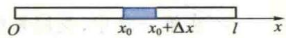
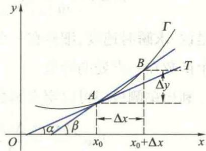
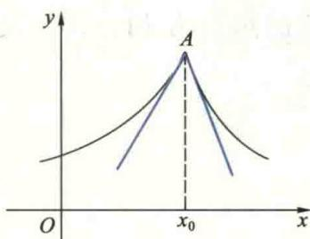
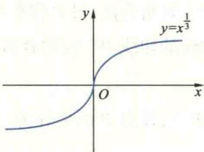
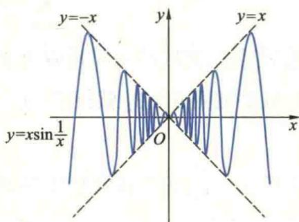
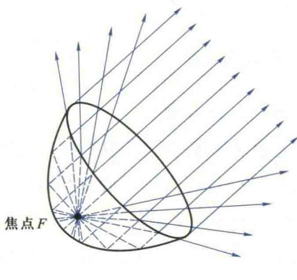

import ExerciseTrigger from '@/components/exercises/ExerciseTrigger.astro';
import QRCodeVideo from '@/components/QRCodeVideo.astro';

import Guide from '@/components/Guide.astro';
import Knowledge from '@/components/Knowledge.astro';
import Example from '@/components/Example.astro';
import Analysis from '@/components/Analysis.astro';
import Solution from '@/components/Solution.astro';
import Variant from '@/components/Variant.astro';
import Note from '@/components/Note.astro';
import SideNote from '@/components/SideNote.astro';
import Block from '@/components/Block.astro';
import Method from '@/components/Method.astro';
import Exercise from '@/components/Exercise.astro';

在第一章中，我们系统地讨论了极限理论，并用极限研究了函数的连续性。从本章开始将要介绍的一元函数的微分学和积分学，就是利用极限理论从局部和整体两个方面对非线性函数变化形态进行更深入的研究。本章讨论的一元函数微分学的主要内容包括：导数与微分的概念和计算法则；微分中值定理与 Taylor 公式以及它们在研究函数性态（单调性、极值与凸性等）中的应用。

## 1.1 导数的定义

本节通过几个实例引入导数的概念，讲解导数的定义，讨论导数的几何意义以及可导与连续的关系，最后举例说明导数在各种不同学科中的具体含义。

在绪论中已经讲过变速直线运动的瞬时速度问题。当时间的改变量 $\Delta t$ 很小时，我们可以通过将位移 $s = s(t)$ 随时间 $t$ 的非均匀变化近似看成均匀变化，将变速直线运动近似看成匀速直线运动，从而，在从 $t_0$ 到 $t_0 + \Delta t$ 的微小时间段内物体的平均速度为：

$$
\bar{v} = \frac{\Delta s}{\Delta t} = \frac{s(t_0 + \Delta t) - s(t_0)}{\Delta t}
$$

就是物体在时刻 $t_0$ 的瞬时速度 $v(t_0)$ 的近似值。$\Delta t$ 越小，这个近似值越精确，于是求变速直线运动的瞬时速度就转化为求平均速度的极限，即

$$
v(t_0) = \lim_{\Delta t \to 0} \frac{s(t_0 + \Delta t) - s(t_0)}{\Delta t} \tag{1.1}
$$

还有很多实际问题都归结为求同样形式的极限，下面再举两个例子。

<Example title="例 1.1 细棒的线密度问题">
设有一物质非均匀分布的细棒，长为 $l$，试求细棒上各点的线密度。

<Solution title="分析与求解">
大家知道，如果细棒上物质的分布是均匀的，就是说细棒上单位长度的质量都相等，那么各点的线密度相同，只要通过除法用公式 $\rho = \frac{M}{l}$ 就能求得，其中 $M$ 为细棒的总质量。现在细棒上的物质是非均匀分布的，细棒上不同部位处单位长度的质量不一定相等，自然不能用上述公式来计算细棒上各点的线密度。为了求出细棒上各点的线密度，先将细棒置于 $x$ 轴上，左端点为坐标原点（图 2.1），则从原点到点 $x$ 一段细棒的质量为非线性函数：

$$
m = m(x), \quad x \in [0, l].
$$

因此，从点 $x_0$ 到点 $x_0 + \Delta x$ 那一小段细棒的质量为：

$$
\Delta m = m(x_0 + \Delta x) - m(x_0).
$$

于是，在微小区间 $[x_0, x_0 + \Delta x]$ 内，质量的变化可近似看作是均匀的，用除法求得的

$$
\frac{\Delta m}{\Delta x} = \frac{m(x_0 + \Delta x) - m(x_0)}{\Delta x}
$$

就表示该小段细棒的平均密度，它只是该小段内细棒上各点线密度的近似值，而不是精确值。但是，如果质量 $m$ 随 $x$ 的变化是连续的，即 $m = m(x)$ 是 $[0, l]$ 上的连续函数，那么，$|\Delta x|$ 越小，上述近似值的精度越高。因此，若 $\Delta x \to 0$ 时平均密度的极限存在，则该极限值就规定为细棒在 $x_0$ 处的线密度，即：

$$
\rho(x_0) = \lim_{\Delta x \to 0} \frac{\Delta m}{\Delta x} = \lim_{\Delta x \to 0} \frac{m(x_0 + \Delta x) - m(x_0)}{\Delta x}. \tag{1.2}
$$
</Solution>

<figure class="vp-figure">
  
  <figcaption>图 2.1 细棒在坐标轴上的分布示意图</figcaption>
</figure>
</Example>

<Example title="例 1.2 平面曲线的切线斜率问题">
我们知道直线的斜率是一个很有用的概念。在很多实际问题中都提出求平面曲线上一点处的切线斜率问题。为此，首先讲解什么是平面曲线上一点处的切线，能否像平面几何中把与圆只有一个交点的直线定义为圆的切线那样来定义一般曲线的切线呢？读者不难举例说明，这样定义曲线上一点处的切线是不恰当的。

<SideNote title="想一想">
举例说明用与曲线只有一个交点的直线来定义该曲线在此点切线是不恰当的。
</SideNote>

下面介绍平面曲线在一点处的切线定义。设 $\Gamma$ 为一条连续的平面曲线，它的方程是 $y = f(x)$（图 2.2），$f$ 是连续函数，$A$ 是 $\Gamma$ 上任一点，$B$ 为另一点。联结 $A$ 与 $B$ 得一割线 $AB$，当点 $B$ 沿着 $\Gamma$ 趋向点 $A$ 时，割线 $AB$ 将绕着点 $A$ 转动。如果当 $B \to A$ 时割线 $AB$ 的极限位置存在，设为直线 $AT$，那么 $AT$ 就称为曲线 $\Gamma$ 在点 $A$ 处的切线。这就是说，曲线 $\Gamma$ 在点 $A$ 处的切线是当 $\Delta x \to 0$ 时割线 $AB$ 的极限位置。

设割线 $AB$ 的倾角为 $\beta$，则其斜率为：
$$
\tan \beta = \frac{\Delta y}{\Delta x} = \frac{f(x_0 + \Delta x) - f(x_0)}{\Delta x}
$$
由于当 $\Delta x \to 0$ 时，割线 $AB$ 就转化为切线 $AT$。因此，自然将割线斜率的极限定义为曲线 $\Gamma$ 在点 $A$ 处切线的斜率：
$$
\tan \alpha = \lim_{\Delta x \to 0} \tan \beta = \lim_{\Delta x \to 0} \frac{f(x_0 + \Delta x) - f(x_0)}{\Delta x} \tag{1.3}
$$

<figure class="vp-figure">
  
  <figcaption>图 2.2 平面曲线及其割线与切线示意图</figcaption>
</figure>
</Example>

上面我们从来自于物理和几何等不同领域的实际问题提出了形如 $(1.1)$、$(1.2)$ 与 $(1.3)$ 式的极限问题，都是当自变量的改变量 $\Delta x \to 0$ 时，函数改变量 $\Delta y$ 与自变量改变量 $\Delta x$ 之比的极限。由于科学技术中还有大量的问题都归结为此类极限问题，因此，人们舍弃上述问题的具体含义，抽象出如下的定义。

<Knowledge title="定义 1.1 导数">
设函数 $f$ 定义在 $x_0$ 的某一邻域 $U(x_0)$ 内。在此邻域内，当自变量在 $x_0$ 处有改变量 $\Delta x$ 时，相应地函数有改变量 $\Delta y = f(x_0 + \Delta x) - f(x_0)$。若当 $\Delta x \to 0$ 时这两个改变量之比的极限存在：

$$
\lim_{\Delta x \to 0} \frac{\Delta y}{\Delta x} = \lim_{\Delta x \to 0} \frac{f(x_0 + \Delta x) - f(x_0)}{\Delta x} \tag{1.4}
$$

则称函数 $f$ 在 $x_0$ 处**可导**，并称该极限值为 $f$ 在 $x_0$ 处的**导数**，记作 $f'(x_0)$ 或 $\left. \frac{\mathrm{d}f(x)}{\mathrm{d}x} \right|_{x=x_0}$。
</Knowledge>

如果函数用 $y = f(x)$ 来表示，则它在 $x_0$ 处的导数也可记作 $y'|_{x=x_0}$ 或 $\left. \frac{\mathrm{d}y}{\mathrm{d}x} \right|_{x=x_0}$。此时，若记 $x = x_0 + \Delta x, \Delta y = f(x) - f(x_0)$，则 $(1.4)$ 式也可写成下面的形式：

$$
f'(x_0) = \lim_{x \to x_0} \frac{f(x) - f(x_0)}{x - x_0} = \lim_{\Delta x \to 0} \frac{\Delta y}{\Delta x}
$$

若极限 $(1.4)$ 不存在，则称 $f$ 在 $x_0$ 处不可导。特别地，若极限 $(1.4)$ 为无穷大，则为方便计，也称 $f$ 在 $x_0$ 处的导数为无穷大，并记作 $f'(x_0) = \infty$。

<SideNote title="注记：无穷大导数">
导数为无穷大，只是一种说法或记法，它是函数导数不存在（即不可导）的一种情况。
</SideNote>

根据导数的定义，$(1.1)$—$(1.3)$ 式可以用导数分别表示为：
$$
v(t_0) = \left. \frac{\mathrm{d}s}{\mathrm{d}t} \right|_{t=t_0}, \quad \rho(x_0) = \left. \frac{\mathrm{d}m}{\mathrm{d}x} \right|_{x=x_0}, \quad \tan \alpha = f'(x_0)
$$
就是说，求瞬时速度、细棒在一点的线密度以及曲线上一点处的切线斜率都归结为求某个函数在一点处的导数。

<QRCodeVideo id="2.1.1" title="导数定义的常见不同形式" url="https://example.com/video/2.1.1" />

### 单侧导数

利用单侧极限可以定义函数的单侧导数。若右（左）极限：
$$
\lim_{\Delta x \to 0^+} \frac{f(x_0 + \Delta x) - f(x_0)}{\Delta x} \quad \left( \lim_{\Delta x \to 0^-} \frac{f(x_0 + \Delta x) - f(x_0)}{\Delta x} \right)
$$
存在，则称此极限值是 $f$ 在 $x_0$ 处的**右（左）导数**，并称 $f$ 在 $x_0$ **右（左）可导**，记作：
$$
f'_+(x_0) = \lim_{\Delta x \to 0^+} \frac{f(x_0 + \Delta x) - f(x_0)}{\Delta x}, \quad f'_-(x_0) = \lim_{\Delta x \to 0^-} \frac{f(x_0 + \Delta x) - f(x_0)}{\Delta x} \tag{1.5}
$$

利用极限与左、右极限的关系立即可得：

$$
\text{函数 } f \text{ 在 } x_0 \text{ 处可导} \iff f \text{ 在 } x_0 \text{ 处左、右导数存在且相等}
$$

<SideNote title="想一想">
试证明函数 $f$ 在 $x_0$ 处可导的充要条件为 $f$ 在 $x_0$ 处左、右导数均存在且相等。
</SideNote>

<Knowledge title="定义 1.2 导函数">
如果函数 $f: I \to \mathbf{R}$ 在区间 $I$ 的每一点都可导（若 $I$ 包含端点，则在端点处可导是指左端点右可导，右端点左可导），则称函数 $f$ 在区间 $I$ 上**可导**。

此时，对于 $I$ 的每一点 $x$，都对应着 $f$ 的一个导数 $f'(x)$，因而 $f$ 的导数 $f'(x)$ 是定义在 $I$ 上的一个新函数 $f': I \to \mathbf{R}$，称它为 $f$ 在 $I$ 上的**导函数**，记作 $\frac{\mathrm{d}f}{\mathrm{d}x}$ 或 $\frac{\mathrm{d}y}{\mathrm{d}x}$。
</Knowledge>

不难看出 $f$ 在一点 $x_0$ 处的导数就是 $f$ 的导函数 $f'$ 在点 $x_0$ 处的值，即 $f'(x_0) = \left. f'(x) \right|_{x=x_0}$。今后，在不致混淆的情况下，简称导函数为导数。

<SideNote title="想一想">
等式 $f'(x_0) = [f(x_0)]'$ 成立吗？
</SideNote>

<Example title="例 1.3 证明常用初等函数的导数公式">
(1) $(C)' = 0$ ($C$ 为常数);  
(2) $(e^x)' = e^x \quad (-\infty < x < +\infty)$;  
(3) $(a^x)' = a^x \ln a \quad (a > 0, a \neq 1, -\infty < x < +\infty)$;  
(4) $(x^\alpha)' = \alpha x^{\alpha-1} \quad (\alpha \in \mathbf{R}, 0 < x < +\infty)$;  
(5) $(\sin x)' = \cos x \quad (-\infty < x < +\infty)$;  
(6) $(\cos x)' = -\sin x \quad (-\infty < x < +\infty)$。

<Solution title="证明">
利用导数的定义以及有关的极限运算法则很容易求得本题中的导数公式。下面证明公式 (1) 与 (3)。由导数的定义：

(1) $(C)' = \lim_{\Delta x \to 0} \frac{f(x+\Delta x) - f(x)}{\Delta x} = \lim_{\Delta x \to 0} \frac{0}{\Delta x} = 0$；

(3) $(a^x)' = \lim_{\Delta x \to 0} \frac{a^{x+\Delta x} - a^x}{\Delta x} = a^x \lim_{\Delta x \to 0} \frac{a^{\Delta x} - 1}{\Delta x}$。

令 $a^{\Delta x} - 1 = t$，则 $\Delta x = \log_a(1+t) = \frac{\ln(1+t)}{\ln a}$。易见，当 $\Delta x \to 0$ 时 $t \to 0$，故：
$$
(a^x)' = a^x \lim_{t \to 0} \frac{t}{\ln(1+t)} \ln a = a^x \ln a
$$
其中利用了等价无穷小代换 $\ln(1+t) \sim t \ (t \to 0)$。
</Solution>
</Example>

<Example title="例 1.4 讨论函数 $f(x) = |x|$ 在原点的可导性">
考察函数 $f(x) = |x|, x \in (-\infty, +\infty)$ 在 $x_0 = 0$ 处的可导性。

<Solution title="解">
由于 $\frac{f(x_0 + \Delta x) - f(x_0)}{\Delta x} = \frac{|\Delta x|}{\Delta x}$，因此：
$$
f'_+(0) = \lim_{\Delta x \to 0^+} \frac{|\Delta x|}{\Delta x} = \lim_{\Delta x \to 0^+} \frac{\Delta x}{\Delta x} = 1
$$
$$
f'_-(0) = \lim_{\Delta x \to 0^-} \frac{|\Delta x|}{\Delta x} = \lim_{\Delta x \to 0^-} \frac{-\Delta x}{\Delta x} = -1
$$
从而 $f'_+(0) \neq f'_-(0)$，故 $f$ 在 $x_0 = 0$ 处不可导。
</Solution>

<SideNote title="注">
在讨论分段函数与抽象函数（指未给出具体数学表达式的函数）可导性的时候，往往需要利用导数（包括单侧导数）的定义。
</SideNote>
</Example>

<Example title="例 1.5 考察函数 $f(x) = x \sin \frac{1}{x}$ 在原点的连续性与可导性">
考察函数
$$
f(x) = \begin{cases} x \sin \frac{1}{x}, & x \neq 0 \\ 0, & x = 0 \end{cases}
$$
在 $x = 0$ 处的连续性与可导性。

<Solution title="解">
根据连续性的定义，由于：
$$
\lim_{x \to 0} f(x) = \lim_{x \to 0} x \sin \frac{1}{x} = 0 = f(0)
$$
所以该函数在 $x = 0$ 处是连续的。又因为：
$$
\frac{f(0 + \Delta x) - f(0)}{\Delta x} = \frac{\Delta x \sin \frac{1}{\Delta x} - 0}{\Delta x} = \sin \frac{1}{\Delta x}
$$
当 $\Delta x \to 0$ 时，$\sin \frac{1}{\Delta x}$ 的极限不存在，故该函数在 $x = 0$ 处不可导。
</Solution>

<SideNote title="想一想">
有人说：在例 1.5 中，由于 $f(0) = 0$，所以 $f'(0) = 0$。对吗？为什么？
</SideNote>

<QRCodeVideo id="2.1.2" title="关于分段函数在分界点处的求导问题" url="https://example.com/video/2.1.2" />
</Example>

<Example title="例 1.6 抽象函数可导性的证明">
设函数 $f: (0, +\infty) \to \mathbf{R}$ 在 $x = 1$ 处可导，且满足：
$$
f(xy) = yf(x) + xf(y), \quad \forall x, y \in (0, +\infty) \tag{1.6}
$$
证明：函数 $f$ 在 $(0, +\infty)$ 内处处可导，并且 $f'(x) = \frac{f(x)}{x} + f'(1)$。

<Solution title="证明">
根据导数的定义：
$$
f'(x) = \lim_{\Delta x \to 0} \frac{f(x + \Delta x) - f(x)}{\Delta x}
$$
为了利用条件 (1.6) 及函数 $f$ 在 $x = 1$ 处的可导性，将 $f(x + \Delta x) - f(x)$ 改写为：
$$
f(x + \Delta x) - f(x) = f\left[ x\left(1 + \frac{\Delta x}{x}\right) \right] - f(x)
$$
将 $1 + \frac{\Delta x}{x}$ 看作 (1.6) 式中的 $y$，从而可得：
$$
\begin{aligned}
\frac{f(x + \Delta x) - f(x)}{\Delta x} &= \frac{f\left[ x\left(1 + \frac{\Delta x}{x}\right) \right] - f(x)}{\Delta x} \\[2mm]
&= \frac{\left(1 + \frac{\Delta x}{x}\right)f(x) + xf\left(1 + \frac{\Delta x}{x}\right) - f(x)}{\Delta x} \\[2mm]
&= \frac{f(x)}{x} + \frac{f\left(1 + \frac{\Delta x}{x}\right)}{\frac{\Delta x}{x}} \tag{1.7}
\end{aligned}
$$
在 (1.6) 式中取 $x = y = 1$，易得 $f(1) = 0$。于是：
$$
f'(x) = \frac{f(x)}{x} + \lim_{\Delta x \to 0} \frac{f\left(1 + \frac{\Delta x}{x}\right) - f(1)}{\frac{\Delta x}{x}} = \frac{f(x)}{x} + f'(1)
$$
</Solution>
</Example>

<SideNote title="注意">
在例 1.6 中，仅由 $f$ 在 $x=1$ 处可导不能推出它在 $(0, +\infty)$ 内处处可导的结论（见二维码 2.1.3），但当 $f$ 同时满足条件 (1.6) 时，可利用该结构建立 $f$ 在任一点的导数与 $f'(1)$ 的联系。
</SideNote>

## 1.2 导数的几何意义

根据例 1.2，如果函数 $f$ 在 $x_0$ 处可导，那么它在 $x_0$ 处的导数 $f'(x_0)$ 在几何上表示曲线 $y = f(x)$ 在点 $(x_0, f(x_0))$ 处的**切线的斜率**。

如果函数 $f$ 在 $x_0$ 处不可导，但该点处的单侧导数存在，则左导数 $f'_-(x_0)$（右导数 $f'_+(x_0)$）表示曲线在点 $A(x_0, f(x_0))$ 处的左侧（右侧）切线的斜率（图 2.3）。若左右导数相等，则该点只有一条切线。

若 $f$ 在 $x_0$ 处连续但 $f'(x_0)$ 为无穷大（含正负无穷），则切线平行于 $y$ 轴。例如 $y = x^{1/3}$ 在 $x = 0$ 处，其切线即为 $y$ 轴（图 2.4）。若割线在两直线间来回振荡，则不存在切线（图 2.5）。

<figure class="vp-figure">
  
  <figcaption>图 2.3 曲线在折点处的单侧切线</figcaption>
</figure>

<figure class="vp-figure">
  
  <figcaption>图 2.4 曲线具有垂直切线</figcaption>
</figure>

<figure class="vp-figure">
  
  <figcaption>图 2.5 割线无限振荡无确定切线</figcaption>
</figure>

根据导数的几何意义及平面直线的点斜式方程，若 $f$ 在 $x_0$ 处可导，则曲线 $y = f(x)$ 在点 $A(x_0, f(x_0))$ 处的**切线方程**为：
$$
y - y_0 = f'(x_0)(x - x_0) \tag{1.8}
$$
其**法线方程**为：
$$
y - y_0 = -\frac{1}{f'(x_0)}(x - x_0) \tag{1.9}
$$

<Example title="例 1.7 抛物镜面的聚光问题">
探照灯、反射式天文望远镜及手电筒的反光镜多采用旋转抛物面。若将光源放在抛物线的焦点处，光线经镜面反射后能变为与对称轴平行的光束。

<figure class="vp-figure">
  
  <figcaption>图 2.6 抛物镜面的聚光几何原理</figcaption>
</figure>

<Solution title="解">
为了证明 $\alpha_1 = \alpha_2$，只需证明焦半径 $FP = FT$。
设点 $P$ 的坐标为 $(x, \sqrt{x})$，则有：
$$
FP = \sqrt{\left(x - \frac{1}{4}\right)^2 + (\sqrt{x})^2} = \sqrt{x^2 - \frac{1}{2}x + \frac{1}{16} + x} = \sqrt{x^2 + \frac{1}{2}x + \frac{1}{16}} = x + \frac{1}{4}
$$
又抛物线 $y = \sqrt{x}$ 在点 $P$ 处的切线方程为：
$$
Y - \sqrt{x} = \frac{1}{2\sqrt{x}}(X - x)
$$
令 $Y = 0$，得切线与 $x$ 轴交点 $T$ 的横坐标 $X = -x$。
由于焦点 $F$ 的坐标为 $(\frac{1}{4}, 0)$，则点 $T$ 到 $F$ 的距离为：
$$
FT = \left| \frac{1}{4} - (-x) \right| = x + \frac{1}{4}
$$
由此可知 $FP = FT$，证毕。
</Solution>
</Example>

## 1.3 可导与连续的关系

根据导数的定义，很容易证明下面的定理。

<Knowledge title="定理 1.1 可导与连续的关系">
设函数 $y = f(x)$ 在 $x_0$ 可导，则该函数必在 $x_0$ 处连续。

<Solution title="证明">
由可导的定义知：
$$
\lim_{\Delta x \to 0} \frac{\Delta y}{\Delta x} = f'(x_0)
$$
利用极限与无穷小的关系，我们有：
$$
\frac{\Delta y}{\Delta x} = f'(x_0) + \alpha(\Delta x) \tag{1.10}
$$
其中 $\Delta x \neq 0$，并且 $\lim_{\Delta x \to 0} \alpha(\Delta x) = 0$。等式两边同乘 $\Delta x$，得：
$$
\Delta y = f'(x_0) \Delta x + \alpha(\Delta x) \Delta x \tag{1.11}
$$
两边取极限得 $\lim_{\Delta x \to 0} \Delta y = 0$，这说明 $f$ 在 $x_0$ 处连续。
</Solution>
</Knowledge>

<SideNote title="核心注意">
证明定理 1.1 的基本思路是：利用函数可导的定义和极限与无穷小量之间的关系建立函数的改变量 $\Delta y$ 与已知条件函数 $y=f(x)$ 在 $x_0$ 处导数之间的关系，从而由连续定义直接得到定理的结论，是用已知解决未知思想的体现。
</SideNote>

定理 1.1 表明，函数 $f$ 在某点连续是函数在该点可导的**必要条件**，但**不是充分条件**。例 1.4 和例 1.5 中的函数都在 $x_0 = 0$ 处连续，却不可导。

<QRCodeVideo id="2.1.3" title="导数概念中的两个值得注意的问题" url="https://example.com/video/2.1.3" />

## 1.4 导数在各学科中的应用举例

在本节开始已经指出，科学技术中有很多重要的量都可以用导数来刻画。为了将导数更广泛地应用于各种不同的科技领域，还应对导数的概念作深入的剖析。首先来分析导数定义中 $\frac{\Delta y}{\Delta x}$ 的含义。

我们知道，$\frac{\Delta y}{\Delta x}$ 是函数 $y = f(x)$ 的改变量 $\Delta y$ 与自变量 $x$ 的改变量 $\Delta x$ 之比，它表示 $x$ 改变一个单位长度时函数改变量的大小，反映了 $y$ 随 $x$ 变化的快慢程度，称之为函数 $y = f(x)$ 在长度为 $\Delta x$ 的区间上关于自变量的平均变化率。

若 $y = f(x)$ 是非线性函数，则平均变化率随 $x_0$ 和 $\Delta x$ 而变。通过取极限得到的导数 $f'(x_0) = \lim_{\Delta x \to 0} \frac{\Delta y}{\Delta x}$ 才是函数 $y = f(x)$ 在点 $x_0$ 的变化率。

求函数 $y = f(x)$ 在点 $x_0$ 的变化率（导数）可归纳为以下两步：
1. **局部均匀化求近似值**：在从 $x_0$ 到 $x_0 + \Delta x$ 的微小局部内，将非均匀变化近似看作是均匀的，利用除法求得近似值：
$$
\frac{\Delta y}{\Delta x} = \frac{f(x_0 + \Delta x) - f(x_0)}{\Delta x}
$$
2. **利用极限求精确值**：
$$
\lim_{\Delta x \to 0} \frac{\Delta y}{\Delta x} = \lim_{\Delta x \to 0} \frac{f(x_0 + \Delta x) - f(x_0)}{\Delta x} = f'(x_0)
$$

<SideNote title="导数物理意义与局部线性化">
函数在一点的导数表示它在该点处的变化率，因此，凡研究非均匀变化的变化率问题，都需要用导数。例如，变速直线运动中位移 $s$ 对时间 $t$ 的导数 $\frac{\mathrm{d}s}{\mathrm{d}t}$ 是瞬时速度，细棒质量 $m$ 对坐标 $x$ 的导数 $\frac{\mathrm{d}m}{\mathrm{d}x}$ 是线密度。求导数的关键第一步是在微小局部“以匀代非”，其本质是以线性函数代替非线性函数，即局部线性化。
</SideNote>

<Example title="例 1.8 电流强度">
在直流电路中，电量 $q = q(t)$ 随时间的变化是均匀的，单位时间内通过导线的电量 $\frac{\Delta q}{\Delta t}$ 是常数即电流强度。在交流电路中，电量随时间非均匀变化，按照上述步骤：
(1) 在 $t_0$ 到 $t_0 + \Delta t$ 的微小时间段内，近似电流强度为：
$$
i(t_0) \approx \frac{\Delta q}{\Delta t} = \frac{q(t_0 + \Delta t) - q(t_0)}{\Delta t}
$$
(2) 令 $\Delta t \to 0$，取极限得精确值：
$$
i(t_0) = \lim_{\Delta t \to 0} \frac{\Delta q}{\Delta t} = q'(t_0)
$$
</Example>

<Example title="例 1.9 生物种群的增长率">
设 $N = N(t)$ 表示某生物种群在时刻 $t$ 个体的数目。若 $N(t)$ 是非线性函数，单位时间内种群个体数量的变化率在时刻 $t_0$ 通过局部均匀化并求极限，得增长率为：
$$
\lim_{\Delta t \to 0} \frac{\Delta N}{\Delta t} = \lim_{\Delta t \to 0} \frac{N(t_0 + \Delta t) - N(t_0)}{\Delta t} = N'(t_0)
$$
注：在数学建模时，由于种群数量巨大，可将离散的 $N(t)$ 近似看作连续函数。
</Example>

<Example title="例 1.10 经济学中的边际成本">
设 $p = p(x)$ 表示生产 $x$ 个某种产品（例如轴承）的总成本。总成本 $p$ 通常是随 $x$ 非均匀变化的非线性函数。生产 $\Delta x$ 个产品的平均成本为：
$$
\frac{\Delta p}{\Delta x} = \frac{p(x_0 + \Delta x) - p(x_0)}{\Delta x}
$$
为了确定在任意产量 $x_0$ 时的成本变化率，通过局部均匀化并求极限可得：
$$
\lim_{\Delta x \to 0} \frac{\Delta p}{\Delta x} = \lim_{\Delta x \to 0} \frac{p(x_0 + \Delta x) - p(x_0)}{\Delta x} = p'(x_0)
$$
它就是函数 $p = p(x)$ 在 $x_0$ 的导数 $p'(x_0)$，在经济学中称为**边际成本**。
</Example>

只要稍微留心就会发现，在实际问题中需要应用变化率的例子很多很多。读者自己可再列举一些应用实例，并把它们归结为导数问题。

<ExerciseTrigger chapter={2} section="2.1" title="2.1 导数的概念 课后真题与自测练习" />
