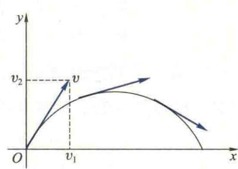
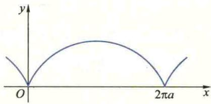
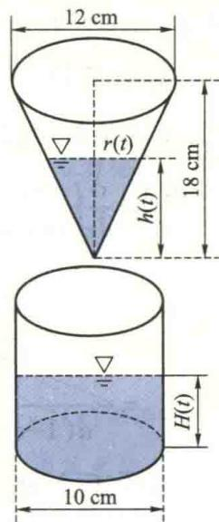
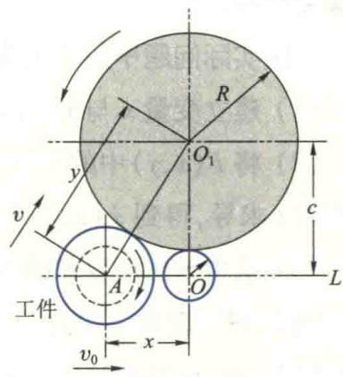
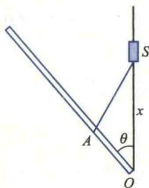

import ExerciseTrigger from '@/components/exercises/ExerciseTrigger.astro';

import Guide from '@/components/Guide.astro';
import Knowledge from '@/components/Knowledge.astro';
import Example from '@/components/Example.astro';
import Analysis from '@/components/Analysis.astro';
import Solution from '@/components/Solution.astro';
import Variant from '@/components/Variant.astro';
import Note from '@/components/Note.astro';
import Block from '@/components/Block.astro';
import Method from '@/components/Method.astro';
import Exercise from '@/components/Exercise.astro';

前一节中,已经说明了导数的概念及其应用的广泛性,因此,怎样求一个已知函数的导数就是亟待解决的重要问题.虽然根据定义可以求一些简单函数的导数,但是,当函数比较复杂时,用定义来计算导数就相当困难了.本节将导出一些求导的基本法则,包括有理运算法则、复合函数和反函数的求导法则,并在此基础上,给出隐函数和参数方程求导法则,从而使导数的计算系统化、简单化.

## 2.1 函数和、差、积、商的求导法则

<Knowledge title="定理 2.1 导数的有理运算法则">
设函数 $u, v: I \rightarrow R$ 在 $x \in I$ 可导，则它们的和、差、积、商（分母为零的点除外）也在 x 可导，且

(1) $(u\pm v)'(x)=u'(x)\pm v'(x)$ ;

(2) $(uv)'(x)=u'(x)v(x)+u(x)v'(x)$ ;

(3) $\left(\frac{u}{v}\right)'(x)=\frac{u'(x)v(x)-u(x)v'(x)}{v^{2}(x)}\quad(v(x)\neq0).$

特别地，有

$(cu)'(x)=cu'(x)(c\in\mathbf{R}$ 为常数 $)$ ,

$$
\left(\frac {1}{u}\right) ^ {\prime} (x) = - \frac {u ^ {\prime} (x)}{u ^ {2} (x)}.
$$

<Solution title="证明">
仅对(2)及(3)加以证明,其余留给读者,证明的基本方法是利用函数可导及导数的定义.
</Solution>
</Knowledge>

证明中通过对 $\Delta y$ 的表达式同

(2) 设 $y=u(x)v(x)$ ，则

$$
\begin{array}{r l} \Delta y & = u (x + \Delta x) v (x + \Delta x) - u (x) v (x) \\ & = u (x + \Delta x) v (x + \Delta x) - u (x) v (x + \Delta x) + \\ & u (x) v (x + \Delta x) - u (x) v (x) \\ & = v (x + \Delta x) \Delta u + u (x) \Delta v. \end{array}
$$

根据导数的定义，

$$
(u v) ^ {\prime} (x) = \lim _ {\Delta x \rightarrow 0} \frac {\Delta y}{\Delta x} = \lim _ {\Delta x \rightarrow 0} v (x + \Delta x) \frac {\Delta u}{\Delta x} + \lim _ {\Delta x \rightarrow 0} u (x) \frac {\Delta v}{\Delta x}.
$$

证明中通过对 $\Delta y$ 的表达式同时加减同一项 $u(x)v(x+\Delta x)$ ，建立 $\Delta y$ 与 $\Delta u, \Delta v$ 之间的联系，进而建立极限 $\lim_{\Delta x \to 0} \frac{\Delta y}{\Delta x}$ （即未知导数 $(uv)'$ ）与极限 $\lim_{\Delta x \to 0} \frac{\Delta u}{\Delta x}$ 与 $\lim_{\Delta x \to 0} \frac{\Delta v}{\Delta x}$ （即已知导数 $u'$ 与 $v'$ ）之间的联系。也就是利用所谓“搭桥”的技巧建立未知（待求）与已知的联系。

已知 $v$ 在 $x$ 可导，由定理1.1， $v$ 在 $x$ 必连续，故 $\lim_{\Delta x \to 0} v(x + \Delta x) = v(x)$ ，因而

$$
(u v) ^ {\prime} (x) = u ^ {\prime} (x) v (x) + u (x) v ^ {\prime} (x).
$$

(3) 设 $y=\frac{1}{v(x)}$ ，则

利用已证的(2)中的结果将

$$
\begin{array}{r l} \Delta y & = \frac {1}{v (x + \Delta x)} - \frac {1}{v (x)} = - \frac {v (x + \Delta x) - v (x)}{v (x) v (x + \Delta x)} \\ & = - \frac {\Delta v}{v (x) v (x + \Delta x)}. \end{array}
$$

(3) 的证明简化为只要证明 $y = \frac{1}{v(x)}$ 可导, 且

$$
\left(\frac {1}{v}\right) ^ {\prime} (x) = - \frac {v ^ {\prime} (x)}{v ^ {2} (x)}.
$$

与(2)中类似, 可知 $\lim_{\Delta x \to 0} v(x + \Delta x) = v(x)$ ，注意到而后者的证明只要利用导数定义. $v(x) \neq 0$ ，从而

$$
\left(\frac {1}{v}\right) ^ {\prime} (x) = \lim _ {\Delta x \rightarrow 0} \frac {\Delta y}{\Delta x} = - \lim _ {\Delta x \rightarrow 0} \frac {\Delta v}{\Delta x} \frac {1}{v (x) v (x + \Delta x)} = - \frac {v ^ {\prime} (x)}{v ^ {2} (x)}.
$$

再由(2)得

$$
\begin{array}{r l} \left(\frac {u}{v}\right) ^ {\prime} (x) & = u ^ {\prime} (x) \frac {1}{v (x)} + u (x) \left(\frac {1}{v}\right) ^ {\prime} (x) \\ & = \frac {u ^ {\prime} (x)}{v (x)} - \frac {u (x) v ^ {\prime} (x)}{v ^ {2} (x)} = \frac {u ^ {\prime} (x) v (x) - u (x) v ^ {\prime} (x)}{v ^ {2} (x)}. \end{array}
$$

定理中的(1)与(2)可以推广到有限个函数的情形,并且容易得到导数运算的线性法则:

$(\alpha u + \beta v)'(x) = \alpha u'(x) + \beta v'(x) \quad (\alpha, \beta \in \mathbb{R} \text{为常数}).$

为什么(1)与(2)的结论仅对有限个函数成立?

<Example title="例 2.1">
已知 $y=2^{x}+\sqrt{x}\ln x$ ，求 $\frac{dy}{dx}$ .

<Solution title="解">
根据定理 2.1 的(1)，(2)及习题 2.1(A)的第 1 题得

$$
\frac {\mathrm{d} y}{\mathrm{d} x} = (2 ^ {x}) ^ {\prime} + (\sqrt {x}) ^ {\prime} \ln x + \sqrt {x} (\ln x) ^ {\prime} = 2 ^ {x} \ln 2 + \frac {\ln x}{2 \sqrt {x}} + \frac {1}{\sqrt {x}}.
$$
</Solution>
</Example>

<Example title="例 2.2">
求正切函数 $y=\tan x$ 和余切函数 $y=\cot x$ 的导数.

<Solution title="解">
根据两个函数商的求导法则,我们有

$$
\begin{array}{r l} (\tan x) ^ {\prime} & = \left(\frac {\sin x}{\cos x}\right) ^ {\prime} = \frac {(\sin x) ^ {\prime} \cos x - \sin x (\cos x) ^ {\prime}}{\cos^ {2} x} \\ & = \frac {\cos^ {2} x + \sin^ {2} x}{\cos^ {2} x} = \sec^ {2} x, \end{array}
$$

故得正切函数的导数公式

$$
(\tan x) ^ {\prime} = \sec^ {2} x \left(x \neq (2 k + 1) \frac {\pi}{2}, k \in \mathbf {Z}\right).
$$

类似可得余切函数的导数公式

$$
(\cot x) ^ {\prime} = - \csc^ {2} x (x \neq k \pi , k \in \mathbf {Z}).
$$
</Solution>
</Example>

<Example title="例 2.3">
求正割函数 $y=\sec x$ 和余割函数 $y=\csc x$ 的导数.

<Solution title="解">
根据定理 2.1, 我们有

$$
(\sec x) ^ {\prime} = \left(\frac {1}{\cos x}\right) ^ {\prime} = - \frac {(\cos x) ^ {\prime}}{\cos^ {2} x} = \frac {\sin x}{\cos^ {2} x} = \sec x \tan x,
$$

故得正割函数的导数公式

$$
(\sec x) ^ {\prime} = \sec x \tan x (x \neq (2 k + 1) \frac {\pi}{2}, k \in \mathbf {Z}).
$$

类似可得余割函数的导数公式

$$
(\csc x) ^ {\prime} = - \csc x \cot x (x \neq k \pi , k \in \mathbf {Z}).
$$
</Solution>
</Example>

## 2.2 复合函数的求导法则

<Knowledge title="定理 2.2 链式法则">
设函数 $u=g(x)$ 在 x 处可导，函数 $y=f(u)$ 在与 x 相对应的 u 处可导，则复合函数 $y=f[g(x)]$ 在 x 处可导，并且

$$
\frac {\mathrm{d} y}{\mathrm{d} x} = f ^ {\prime} (u) g ^ {\prime} (x) \quad \text {或} \quad \frac {\mathrm{d} y}{\mathrm{d} x} = \frac {\mathrm{d} y}{\mathrm{d} u} \cdot \frac {\mathrm{d} u}{\mathrm{d} x}.\tag{2.1}
$$

<Solution title="证明">
由于函数 $y=f(u)$ 在 u 处可导, 由(1.10)式,

$$
\frac {\Delta y}{\Delta u} = f ^ {\prime} (u) + \alpha (\Delta u) (\text {其中} \lim _ {\Delta u \to 0} \alpha (\Delta u) = 0).
$$

若 $\Delta u\neq 0$ ，则

$$
\Delta y = f ^ {\prime} (u) \Delta u + \alpha (\Delta u) \Delta u;\tag{2.2}
$$

若 $\Delta u = 0$ ，则 $\alpha (\Delta u)$ 无意义.由于此时 $\Delta y = f(u + \Delta u) - f(u) = 0$ ，为使(2.2)式当 $\Delta u = 0$ 时也成立，规定当定理2.2为什么要分 $\Delta u\neq 0$ 与 $\Delta u = 0$ 时， $\alpha (\Delta u) = 0$ ，从而知无论 $\Delta u$ 是否为0， $\Delta u = 0$ 两种情况来证明.

(2.2)式都成立.于是

$$
\frac {\Delta y}{\Delta x} = f ^ {\prime} (u) \frac {\Delta u}{\Delta x} + \alpha (\Delta u) \frac {\Delta u}{\Delta x},
$$

所以

$$
\lim _ {\Delta x \rightarrow 0} \frac {\Delta y}{\Delta x} = f ^ {\prime} (u) \lim _ {\Delta x \rightarrow 0} \frac {\Delta u}{\Delta x} + \lim _ {\Delta x \rightarrow 0} \alpha (\Delta u) \frac {\Delta u}{\Delta x}.
$$

已知 $u = g(x)$ 在 $x$ 处可导，它在 $x$ 处必连续，故当 $\Delta x \to 0$ 时， $\Delta u \to 0$ ，从而 $\lim_{\Delta x \to 0} \alpha(\Delta u) = \lim_{\Delta u \to 0} \alpha(\Delta u) = 0.$ 这样，就证明了复合函数在 $x$ 处可导，且

$$
\frac {\mathrm{d} y}{\mathrm{d} x} = f ^ {\prime} (u) g ^ {\prime} (x) = \frac {\mathrm{d} y}{\mathrm{d} u} \cdot \frac {\mathrm{d} u}{\mathrm{d} x}. \quad \text {   II   }
$$
</Solution>
</Knowledge>

求导公式(2.1)可以推广到任意有限个函数复合的情形.使用该公式时,关键在于弄清函数的复合关系,会将一个复合函数分解为几个简单函数的复合,由外向内,一层一层地逐个求导,不能脱节,不能遗漏.因此常把这个法则形象地叫做链式法则.

<Example title="例 2.4">
设 $y=\sin(2x+3)$ ，求 $\frac{dy}{dx}$ .

<Solution title="解">
由于函数 $y = \sin (2x + 3)$ 可以看成是由 $y = \sin u$ 与 $u = 2x + 3$ 复合而成, 所以按照公式(2.1), 我们有

$$
\frac {\mathrm{d} y}{\mathrm{d} x} = \frac {\mathrm{d} y}{\mathrm{d} u} \cdot \frac {\mathrm{d} u}{\mathrm{d} x} = \cos u \cdot 2 = 2 \cos (2 x + 3).
$$
</Solution>
</Example>

<Example title="例 2.5">
求双曲函数的导数.

<Solution title="解">
先求双曲正弦函数 $y = \mathrm{sh}x = \frac{\mathrm{e}^x - \mathrm{e}^{-x}}{2}$ 的导数.根据定理2.1,

$$
(\mathrm{sh} x) ^ {\prime} = \frac {1}{2} [ (\mathrm{e} ^ {x}) ^ {\prime} - (\mathrm{e} ^ {- x}) ^ {\prime} ],
$$

又 $u = \mathrm{e}^{-x}$ 可以看成是 $u = \mathrm{e}^t$ 与 $t = -x$ 的复合函数，故

$$
\frac {\mathrm{d} u}{\mathrm{d} x} = \left(\mathrm{e} ^ {- x}\right) ^ {\prime} = \frac {\mathrm{d} u}{\mathrm{d} t} \cdot \frac {\mathrm{d} t}{\mathrm{d} x} = \mathrm{e} ^ {t} \cdot (- 1) = - \mathrm{e} ^ {- x},
$$

所以

$$
(\mathrm{sh} x) ^ {\prime} = \frac {1}{2} (\mathrm{e} ^ {x} + \mathrm{e} ^ {- x}) = \mathrm{ch} x.
$$

类似可得 $(\operatorname{ch} x)' = \operatorname{sh} x$ . 又

$$
(\operatorname{th} x) ^ {\prime} = \left(\frac {\operatorname{sh} x}{\operatorname{ch} x}\right) ^ {\prime} = \frac {(\operatorname{sh} x) ^ {\prime} \operatorname{ch} x - \operatorname{sh} x (\operatorname{ch} x) ^ {\prime}}{\operatorname{ch} ^ {2} x} = \frac {\operatorname{ch} ^ {2} x - \operatorname{sh} ^ {2} x}{\operatorname{ch} ^ {2} x} = \frac {1}{\operatorname{ch} ^ {2} x},
$$

于是,我们得到双曲函数的导数公式如下:

$$
\begin{array}{r l} (\operatorname{sh} x) ^ {\prime} & = \operatorname{ch} x, \quad (\operatorname{ch} x) ^ {\prime} = \operatorname{sh} x, \quad (\operatorname{th} x) ^ {\prime} = \frac {1}{\operatorname{ch} ^ {2} x} \\ & (- \infty <   x <   + \infty). \end{array}
$$

上面两个例子的计算过程写得比较详细.一旦熟练之后,就不必写出中间变量,只要认清函数的复合层次,默记在心,然后一步一步逐层求导就行了.
</Solution>
</Example>

<Example title="例 2.6">
设 $y = \sqrt[3]{(1 - 2x^2)}$ ，求 $\left.\frac{\mathrm{d}y}{\mathrm{d}x}\right|_{x = -1}$ .

<Solution title="解">
根据链式法则，

$$
\frac {\mathrm{d} y}{\mathrm{d} x} = \left[ (1 - 2 x ^ {2}) ^ {\frac {1}{3}} \right] ^ {\prime} = \frac {1}{3} (1 - 2 x ^ {2}) ^ {- \frac {2}{3}} (1 - 2 x ^ {2}) ^ {\prime} = - \frac {4 x}{3 \sqrt [ 3 ]{(1 - 2 x ^ {2}) ^ {2}}},
$$

所以

$$
\left. \frac {\mathrm{d} y}{\mathrm{d} x} \right| _ {x = - 1} = - \left. \frac {4 x}{3 \sqrt [ 3 ]{\left(1 - 2 x ^ {2}\right) ^ {2}}} \right| _ {x = - 1} = \frac {4}{3}. \quad I
$$
</Solution>
</Example>

<Example title="例 2.7">
设 $y=\ln\tan\frac{x}{2}$ ，求 $\frac{dy}{dx}$ .

<Solution title="解">
这个函数是由三个简单函数复合而成的,由链式法则,

$$
\begin{array}{r l} \frac {\mathrm{d} y}{\mathrm{d} x} & = \frac {1}{\tan \frac {x}{2}} \left(\tan \frac {x}{2}\right) ^ {\prime} = \frac {1}{\tan \frac {x}{2}} \cdot \sec^ {2} \frac {x}{2} \cdot \left(\frac {x}{2}\right) ^ {\prime} \\ & = \frac {1}{\tan \frac {x}{2}} \cdot \sec^ {2} \frac {x}{2} \cdot \frac {1}{2} = \frac {1}{2 \sin \frac {x}{2} \cos \frac {x}{2}} = \frac {1}{\sin x} = \csc x. \end{array}
$$
</Solution>
</Example>

<Example title="例 2.8">
设 $y=e^{\sin^{2}\frac{1}{x}}$ ，求 $\frac{dy}{dx}$ .

<Solution title="解">
根据链式法则，

$$
\begin{array}{r l} \frac {\mathrm{d} y}{\mathrm{d} x} & = \left(\mathrm{e} ^ {\sin^ {2} \frac {1}{x}}\right) ^ {\prime} = \mathrm{e} ^ {\sin^ {2} \frac {1}{x}} \cdot \left(\sin^ {2} \frac {1}{x}\right) ^ {\prime} = \mathrm{e} ^ {\sin^ {2} \frac {1}{x}} \cdot 2 \sin \frac {1}{x} \cdot \left(\sin \frac {1}{x}\right) ^ {\prime} \\ & = \mathrm{e} ^ {\sin^ {2} \frac {1}{x}} \cdot 2 \sin \frac {1}{x} \cdot \cos \frac {1}{x} \cdot \left(\frac {1}{x}\right) ^ {\prime} = \mathrm{e} ^ {\sin^ {2} \frac {1}{x}} \cdot 2 \sin \frac {1}{x} \cdot \cos \frac {1}{x} \cdot \left(- \frac {1}{x ^ {2}}\right) \\ & = - \frac {1}{x ^ {2}} \mathrm{e} ^ {\sin^ {2} \frac {1}{x}} \sin \frac {2}{x}. \end{array}
$$
</Solution>
</Example>

## 2.3 反函数的求导法则

<Knowledge title="定理 2.3 反函数求导法则">
设区间 I 上的严格单调连续函数 $x=f(y)$ 在点 y 处可导，且 $f'(y) \neq 0$ ，则它的反函数 $y=f^{-1}(x)$ 在对应点 x 处可导，并且

$$
(f ^ {- 1}) ^ {\prime} (x) = \frac {1}{f ^ {\prime} (y)} \quad \text {或} \quad \frac {\mathrm{d} y}{\mathrm{d} x} = \frac {1}{\frac {\mathrm{d} x}{\mathrm{d} y}}.\tag{2.3}
$$

<Solution title="证明">
由第一章定理 5.3, f 的反函数 $f^{-1}$ 也是严格单调的连续函数. 故当 $\Delta x \neq 0$ 时,$\Delta y = f^{-1}(x + \Delta x) - f^{-1}(x)\neq 0$ ，并且 $\Delta x\to 0$ 时必有 $\Delta y\rightarrow 0.$ 又 $f^{-1}(x + \Delta x) = f^{-1}(x) + \Delta y =$ $y + \Delta y$ ，故 $x + \Delta x = f(y + \Delta y)$ 或 $\Delta x = f(y + \Delta y) - f(y)$ .因此，

$$
\begin{array}{r l} (f ^ {- 1}) ^ {\prime} (x) & = \lim _ {\Delta x \to 0} \frac {f ^ {- 1} (x + \Delta x) - f ^ {- 1} (x)}{\Delta x} \\ & = \lim _ {\Delta y \to 0} \frac {\Delta y}{f (y + \Delta y) - f (y)} \\ & = \lim _ {\Delta y \to 0} \frac {1}{\frac {f (y + \Delta y) - f (y)}{\Delta y}} = \frac {1}{f ^ {\prime} (y)}. \end{array}
$$
</Solution>
</Knowledge>

由于可导函数必连续,且在第六节中将会证明,若在区间I上 $f'(y) \neq 0$ ,则 $x = f(y)$ 在I中必严格单调,因此定理2.3中函数 $x = f(y)$ 在I上严格单调连续的条件可以省略,今后应用反函数求导法则时,只要验证条件 $f'(y) \neq 0 (y \in I)$ 即可.

定理证毕.

<Example title="例 2.9">
求反三角函数的导数.

<Solution title="解">
先求反正弦函数 $y = \arcsin x (x \in (-1, 1))$ 的导数. 由于它是正弦函数 $x = \sin y (y \in \left(-\frac{\pi}{2}, \frac{\pi}{2}\right))$ 的反函数, 并且当 $y \in \left(-\frac{\pi}{2}, \frac{\pi}{2}\right)$ 时, $(\sin y)' = \cos y \neq 0$ , 所以定理

2.3的所有条件都满足.由(2.3)式,在区间(-1,1)内我们有

$$
(\arcsin x) ^ {\prime} = \frac {1}{(\sin y) ^ {\prime}} = \frac {1}{\cos y} = \frac {1}{\sqrt {1 - \sin^ {2} y}} = \frac {1}{\sqrt {1 - x ^ {2}}},
$$

即

$$
(\arcsin x) ^ {\prime} = \frac {1}{\sqrt {1 - x ^ {2}}}, x \in (- 1, 1).
$$

类似可得

$$
\begin{array}{l} (\arccos x) ^ {\prime} = - \frac {1}{\sqrt {1 - x ^ {2}}}, x \in (- 1, 1), \\ (\arctan x) ^ {\prime} = \frac {1}{1 + x ^ {2}}, x \in (- \infty , + \infty), \\ (\operatorname{arccot} x) ^ {\prime} = - \frac {1}{1 + x ^ {2}}, x \in (- \infty , + \infty). \end{array}
$$
</Solution>
</Example>

<Example title="例 2.10">
求反双曲正弦与反双曲余弦函数的导数.

<Solution title="解">
以反双曲正弦函数 $y = \operatorname{arsh} x (x \in (-\infty, +\infty))$ 为例. 由于它是双曲正弦 $x = \operatorname{sh} y$ 的反函数, 并且满足定理2.3的所有条件, 由(2.3)式, 在 $(- \infty, +\infty)$ 上有

$$
(\operatorname{arsh} x) ^ {\prime} = \frac {1}{(\operatorname{sh} y) ^ {\prime}} = \frac {1}{\operatorname{ch} y} = \frac {1}{\sqrt {1 + \operatorname{sh} ^ {2} y}} = \frac {1}{\sqrt {1 + x ^ {2}}},
$$

即

$$
(\operatorname{arsh} x) ^ {\prime} = \frac {1}{\sqrt {x ^ {2} + 1}}, x \in (- \infty , + \infty).
$$

类似可得

$$
(\operatorname{arch} x) ^ {\prime} = \frac {1}{\sqrt {x ^ {2} - 1}}, x \in (- \infty , - 1) \cup (1, + \infty).
$$

利用定理 2.3 及例 1.3 中的公式(3)，不难证明：

$$
\left(\log_ {a} x\right) ^ {\prime} = \frac {1}{x \ln a}, x \in (0, + \infty).
$$
</Solution>
</Example>

## 2.4 初等函数的求导问题

到现在为止,我们已经求出了所有基本初等函数的导数.由于初等函数是基本初等函数经过有限次的有理运算和复合运算构成的,因此,一般来说,可以利用导数的有理运算法则、链式法则以及基本初等函数导数公式求出它们的导数.从而得知:初等函数的求导问题已告解决,而且可导初等函数的导数仍为初等函数.

为了今后使用方便,将基本初等函数的导数公式列成下面的基本导数表:

$$
(C) ^ {\prime} = 0
$$

$$
(a ^ {x}) ^ {\prime} = a ^ {x} \ln a (a > 0 \text {且} a \neq 1)
$$

$$
\left(x ^ {\alpha}\right) ^ {\prime} = \alpha x ^ {\alpha - 1}
$$

$$
\left(\mathrm{e} ^ {x}\right) ^ {\prime} = \mathrm{e} ^ {x}
$$

$$
(\sin x) ^ {\prime} = \cos x
$$

$$
\left(\log_ {a} x\right) ^ {\prime} = \frac {1}{x \ln a} (a > 0
$$

$$
a \neq 1)
$$

$$
(\cos x) ^ {\prime} = - \sin x
$$

$$
(\ln x) ^ {\prime} = \frac {1}{x}
$$

$$
(\tan x) ^ {\prime} = \sec^ {2} x
$$

$$
(\arcsin x) ^ {\prime} = \frac {1}{\sqrt {1 - x ^ {2}}}
$$

$$
(\cot x) ^ {\prime} = - \csc^ {2} x
$$

$$
(\arccos x) ^ {\prime} = - \frac {1}{\sqrt {1 - x ^ {2}}}
$$

$$
(\sec x) ^ {\prime} = \sec x \tan x
$$

$$
(\arctan x) ^ {\prime} = \frac {1}{1 + x ^ {2}}
$$

$$
(\csc x) ^ {\prime} = - \csc x \cot x
$$

$$
(\operatorname{arccot} x) ^ {\prime} = - \frac {1}{1 + x ^ {2}}
$$

在所有的求导法则中,复合函数求导法则是最基本最重要的,这不仅是因为应用中经常碰到的函数多是复合函数,而且这个法则也是后面介绍的其他求导法的基础.所以,应当熟练而准确地掌握它.下面再举几个例子.

<Example title="例 2.11">
证明 $(\ln |x|)'=\frac{1}{x}(x\neq0)$ .

<Solution title="证明">
若 $x > 0$ ，则 $\ln |x| = \ln x$ ，故

$$
(\ln | x |) ^ {\prime} = (\ln x) ^ {\prime} = \frac {1}{x};
$$

若 $x < 0$ ，则 $\ln |x| = \ln (-x)$ ，故

$$
(\ln | x |) ^ {\prime} = (\ln (- x)) ^ {\prime} = \frac {1}{- x} \cdot (- 1) = \frac {1}{x}.
$$

综合上面两种情况得 $(\ln |x|)'=\frac{1}{x}(x\neq0)$ .
</Solution>
</Example>

<Example title="例 2.12">
设 $y=\ln(1+x+\sqrt{2x+x^{2}})$ ，求 $y'$ .

<Solution title="解">
$y' = \frac{1}{1 + x + \sqrt{2x + x^2}} \left( 1 + \frac{2 + 2x}{2\sqrt{2x + x^2}} \right) = \frac{1}{\sqrt{2x + x^2}}$ .
</Solution>
</Example>

<Example title="例 2.13">
幂指函数的导数. 设 $f(x)=u(x)^{v(x)}$ ，其中 $u=u(x)$ 与 $v=v(x)$ 都是可导函数，并且 $u(x)>0$ ，求 $f'(x)$ .

<Solution title="解">
由于

$$
f (x) = u (x) ^ {v (x)} = \mathrm{e} ^ {v (x) \ln u (x)},
$$

所以

$$
\begin{array}{r l} f ^ {\prime} (x) & = \mathrm{e} ^ {v (x) \ln u (x)} \left[ v ^ {\prime} (x) \ln u (x) + \frac {v (x) u ^ {\prime} (x)}{u (x)} \right] \\ & = u (x) ^ {v (x)} \left[ v ^ {\prime} (x) \ln u (x) + \frac {v (x) u ^ {\prime} (x)}{u (x)} \right]. \end{array}
$$
</Solution>
</Example>

## 2.5 高阶导数

我们知道,变速直线运动的物体在时刻t的速度 $v(t)$ 是位移函数 $s=s(t)$ 在时刻t的导数,即 $v(t)=s'(t)$ .而加速度 $a(t)$ 又是速度 $v(t)$ 对时间t的变化率,即速度函数 $v=v(t)$ 对时间t的导数,故 $a(t)=\frac{\mathrm{d}v}{\mathrm{d}t}=[s'(t)]'$ ,叫做 $s=s(t)$ 对t的二阶导数,记作 $a(t)=\frac{\mathrm{d}^{2}s}{\mathrm{d}t^{2}}=s''(t)$ .一般地,高阶导数的定义如下:

<Knowledge title="定义 2.1">
设函数 $f: I \rightarrow R$ 可导. 如果它的导函数 $f': I \rightarrow R$ 在 $x \in I$ 处可导, 则称 f 在 x 处二阶可导, $f'$ 在 x 处的导数称为 f 在 x 处的二阶导数, 记作 $f''(x) = (f')'(x)$ . 若 f 在 I 上处处二阶可导, 则称 f 在 I 上二阶可导, $f''$ 称为 f 在 I 上的二阶导函数. 一般地, 若 f 的 n-1 阶导函数 $f^{(n-1)}: I \rightarrow R$ 在 $x \in I$ 可导, 则称 f 在 x 处 n 阶可导, $f^{(n-1)}$ 在 x 处的导数称为 f 在 x 处的 n 阶导数, 记作 $f^{(n)}(x) = (f^{(n-1)})'(x)$ . 若 f 在 I 上处处 n 阶可导, 则称 f 在 I 上 n 阶可导, $f^{(n)}$ 称为 f 在 I 上的 n 阶导函数, 简称 n 阶导数.

若函数用 $y=f(x)$ 表示, 则它的 n 阶导数也记成 $y^{(n)}$ 或 $\frac{d^{n}y}{dx^{n}}$ .

若 $f^{(n)}$ 在I上连续，则称f在I上n阶连续可导，或称f为I上的 $C^{(n)}$ 类函数，记作 $f\in C^{(n)}(I)$ .若 $\forall n\in N_{+}$ ，f在I上都是 $C^{(n)}$ 类的，则称f在I上无限阶可导，或称之为I上的 $C^{\infty}$ 类函数，记作 $f\in C^{\infty}(I)$ .

二阶或二阶以上的导数统称为高阶导数.为统一起见,习惯上把 $f'$ 称为f的一阶导数,把f本身称为f的0阶导数.
</Knowledge>

<Example title="例 2.14">
证明下列函数的 n 阶导数公式:

(1) $(\mathrm{e}^x)^{(n)} = \mathrm{e}^x$

(2) $(\sin x)^{(n)} = \sin \left(x + n \cdot \frac{\pi}{2}\right)$ ;

(3) $(\cos x)^{(n)} = \cos \left(x + n \cdot \frac{\pi}{2}\right)$ ;

(4) $(x^{\alpha})^{(n)}=\alpha(\alpha-1)\cdots(\alpha-n+1)x^{\alpha-n}\quad(\alpha\in\mathbf{R},x>0);$

$$
\left(5\right) \left[ \ln (1 + x) \right] ^ {(n)} = (- 1) ^ {n - 1} \frac {(n - 1) !}{(1 + x) ^ {n}} \quad (x > - 1).
$$

<Solution title="证明">
仅证(2)与(5)，其余留给读者.

(2) 由于

$$
(\sin x) ^ {\prime} = \cos x = \sin \left(x + \frac {\pi}{2}\right),
$$

$$
(\sin x) ^ {\prime \prime} = \cos \left(x + \frac {\pi}{2}\right) = \sin \left(x + 2 \cdot \frac {\pi}{2}\right),
$$

假定 $(\sin x)^{(k)} = \sin \left(x + k\cdot \frac{\pi}{2}\right)$ 成立，则

$$
(\sin x) ^ {(k + 1)} = \left[ \sin \left(x + k \cdot \frac {\pi}{2}\right) \right] ^ {\prime} = \cos \left(x + k \cdot \frac {\pi}{2}\right) = \sin \left(x + (k + 1) \cdot \frac {\pi}{2}\right),
$$

由数学归纳法知(2)式对于任何 $n \in N_{+}$ 都成立.

(5) 由于

$$
\left[ \ln (1 + x) \right] ^ {\prime} = \frac {1}{1 + x},
$$

$$
\left[ \ln (1 + x) \right] ^ {\prime \prime} = \left(\frac {1}{1 + x}\right) ^ {\prime} = - \frac {1}{(1 + x) ^ {2}},
$$

$$
\left[ \ln (1 + x) \right] ^ {(3)} = \left[ - \frac {1}{(1 + x) ^ {2}} \right] ^ {\prime} = (- 1) ^ {2} \frac {1 \cdot 2}{(1 + x) ^ {3}},
$$

与(2)类似可由数学归纳法证明：

$$
\left[ \ln (1 + x) \right] ^ {(n)} = (- 1) ^ {n - 1} \frac {(n - 1) !}{(1 + x) ^ {n}}.
$$
</Solution>
</Example>

<Knowledge title="定理 2.4">
设函数 $u, v$ 都是 $n$ 阶可导的，则 $\alpha u + \beta v$ 与 $uv$ 也是 $n$ 阶可导的，并且有：

(1) 线性性质 $(\alpha u + \beta v)^{(n)} = \alpha u^{(n)} + \beta v^{(n)}, \alpha, \beta \in \mathbb{R};$

(2) Leibniz 公式

$$
\begin{array}{r l} (u v) ^ {(n)} & = \sum_ {k = 0} ^ {n} C _ {n} ^ {k} u ^ {(n - k)} v ^ {(k)} \\ & = u ^ {(n)} v + C _ {n} ^ {1} u ^ {(n - 1)} v ^ {\prime} + \dots + C _ {n} ^ {k} u ^ {(n - k)} v ^ {(k)} + \dots + u v ^ {(n)}. \end{array}
$$
</Knowledge>

线性性质显然成立,Leibniz 公式可用数学归纳法来证明.

<Example title="例 2.15">
设 $f(x)=x^{3}\sin x$ ，求 $f^{(n)}(x)$ .

<Solution title="解">
取 $u = \sin x, v = x^3$ ，根据Leibniz公式得
</Solution>
</Example>

$$
\begin{array}{r l r} {f ^ {(n)} (x) = x ^ {3} (\sin x) ^ {(n)} + n \cdot 3 x ^ {2} (\sin x) ^ {(n - 1)} +} & {\text {试在例2.15中取} u = x ^ {3}, v = \sin x} \\ {\frac {n (n - 1)}{2 !} \cdot 6 x (\sin x) ^ {(n - 2)} +} & {\text {用Leibniz公式求} f ^ {(n)} (x), \text {并与左边的方法比较,哪一种更简便?}} \\ {\frac {n (n - 1) (n - 2)}{3 !} \cdot 6 (\sin x) ^ {(n - 3)}} \\ & {= x ^ {3} \sin \left(x + n \cdot \frac {\pi}{2}\right) + 3 n x ^ {2} \sin \left[ x + (n - 1) \cdot \frac {\pi}{2} \right] + 3 n (n - 1) x \sin \left[ x + (n - 2) \cdot \frac {\pi}{2} \right] +} \\ & {n (n - 1) (n - 2) \sin \left[ x + (n - 3) \cdot \frac {\pi}{2} \right].} & {\quad \parallel} \end{array}
$$

## 2.6 隐函数求导法

前面研究的函数都可以表示为 $y = f(x)$ 的形式, 其中 $f(x)$ 是 $x$ 的解析式, 称之为显函数. 在实际问题中, 常常碰到这样一类函数, 它的因变量 $y$ 与自变量 $x$ 间的对应法则是由方程 $F(x, y) = 0$ 确定的. 如果存在一个定义在某区间上的函数 $y = f(x)$ , 使 $F(x, f(x)) \equiv 0$ , 那么称 $y = f(x)$ 为由方程 $F(x, y) = 0$ 所确定的隐函数. 此时我们说由方程 $F(x, y) = 0$ 所确定的隐函数存在.

由给定的方程所确定的隐函数是否存在, 是一个相当复杂的问题, 我们将在第五章中讨论. 即使隐函数存在, 也未必能化成显函数的形式. 例如, 方程 $2x - y + 3 = 0$ 对任何 $x \in R$ 都确定了一个隐函数 y, 而试用连续函数的零点定理证明当x>1时，方程 $e^{y}=y+x$ 能确定一个隐函数 $y=f(x)$ .

且能化成显函数形式 $y=2x+3$ （称它为隐函数的显化）；利用零点定理可以证明，当 x>1 时，方程 $e^{y}=y+x$ 至少有一个实根 y，因此，虽能确定一个隐函数 $y=f(x)$ ，但却无法显化；而方程 $x^{2}+y^{2}+1=0$ 不能确定一个隐函数。

下面在隐函数存在且可导的前提下,讨论隐函数的求导方法.设 $y=f(x)$ 是由方程 $F(x,y)=0$ 所确定的隐函数,则 $F(x,f(x))\equiv0$ .由于此式左端是将 $y=f(x)$ 代入到 $F(x,y)$ 所得到的复合函数,因此根据链式法则将该方程两边对 x 求导,便可得到所要求的导数.

<Example title="例 2.16">
求由方程 $y^{5}+2y^{3}-y+x=0$ 确定的隐函数 $y=f(x)$ 的导数.

<Solution title="解">
注意到方程中 y 是 x 由该方程确定的隐函数, 将它代入方程, 并利用链式法则对方程两端关于 x 求导得

$$
5 y ^ {4} y ^ {\prime} + 6 y ^ {2} y ^ {\prime} - y ^ {\prime} + 1 = 0,
$$

从而解得

$$
y ^ {\prime} = - \frac {1}{5 y ^ {4} + 6 y ^ {2} - 1}.
$$
</Solution>
</Example>

<Example title="例 2.17">
求由方程 $e^{y} + xy = e$ 确定的隐函数 $y = f(x)$ 在 x = 0 处的二阶导数.

<Solution title="解">
注意到 y 是 x 的函数,两端同时对 x 求导得
</Solution>
</Example>

$$
\mathrm{e} ^ {y} y ^ {\prime} + x y ^ {\prime} + y = 0,\tag{2.4}
$$

从而解得

对例 2.17, 下面两种解法对吗?
为什么?

$$
y ^ {\prime} = - \frac {y}{\mathrm{e} ^ {y} + x}.
$$

(1) 将 x=0 代入 (2.5) 式得

$$
y ^ {\prime} \Big | _ {x = 0} = - \frac {y}{\mathrm{e} ^ {y}};\tag{2.5}
$$

将 x=0 代入所给方程, 易得 y=1, 所以

$$
\left. y ^ {\prime} \right| _ {x = 0} = - \frac {y}{\mathrm{e} ^ {y} + x} \Bigg | _ {x = 0} = - \frac {1}{\mathrm{e}}.
$$

(2) 由题解中知 $y' \bigg|_{x=0} = -\frac{1}{e}$ ，所以 $y'' \bigg|_{x=0} = 0$ .

为了求出隐函数的二阶导数,将方程(2.4)两端再对 x 求导,注意到 $y' = f'(x)$ 仍是 x 的函数,得

$$
\mathrm{e} ^ {y} \left(y ^ {\prime}\right) ^ {2} + \mathrm{e} ^ {y} y ^ {\prime \prime} + x y ^ {\prime \prime} + y ^ {\prime} + y ^ {\prime} = 0,
$$

从而

$$
y ^ {\prime \prime} = - \frac {\mathrm{e} ^ {y} (y ^ {\prime}) ^ {2} + 2 y ^ {\prime}}{\mathrm{e} ^ {y} + x}.
$$

将(2.5)式代入上式,解得

$$
y ^ {\prime \prime} = \frac {(2 y - y ^ {2}) \mathrm{e} ^ {y} + 2 x y}{(\mathrm{e} ^ {y} + x) ^ {3}}, \quad y ^ {\prime \prime} | _ {x = 0} = \frac {1}{\mathrm{e} ^ {2}}.
$$

此例中关于二阶导函数 $y''$ 的结果也可以由(2.5)式两边对 x 求导得到,由读者

自己去完成.

## 2.7 由参数方程确定的函数的求导法则

在很多实际问题中,常常用参数方程来表示物体的运动规律.例如,炮弹运动的轨迹(称为弹道曲线)在不计空气阻力的情况下可表示成参数方程

$$
\left\{ \begin{array}{l} x = v _ {1} t, \\ y = v _ {2} t - \frac {1}{2} g t ^ {2}, \end{array} \right.\tag{2.6}
$$

其中 $v_{1}, v_{2}$ 分别表示炮弹的水平和铅垂方向的初速度, g 为重力加速度, t 为时间, x 与 y 分别表示炮弹在铅垂平面内位置的横坐标与纵坐标(图 2.7).

在(2.6)式中，x 与 y 都是 t 的函数，由第一式解出 t 代入第二式，消去 t，就得到 y 与 x 间的一个函数关系式

<figure class="vp-figure">
  
  <figcaption>图2.7</figcaption>
</figure>

$$
y = \frac {v _ {2}}{v _ {1}} x - \frac {g}{2 v _ {1} ^ {2}} x ^ {2},
$$

称之为由参数方程(2.6)所确定的函数.

一般地,由参数方程

$$
\left\{ \begin{array}{l} x = x (t), \\ y = y (t) \end{array} \right.\tag{2.7}
$$

所确定的 y 与 x 间的函数关系式, 称为由参数方程(2.7)确定的函数. 如果参数方程比较复杂, 很难甚至不能由消去参数 t 得到 y 与 x 之间的函数关系式, 怎样求该函数的导数呢? 下面的法则提供了直接求这种函数导数的方法.

<Knowledge title="定理 2.5 参数方程求导法则">
设有参数方程(2.7).

（1）若函数 $x = x(t)$ 与 $y = y(t)$ 在 $(\alpha, \beta)$ 内可导，且 $\dot{x}(t) \neq 0$ （习惯上常用 $\dot{x}, \ddot{x}$ 表示 $x = x(t)$ 对参数 $t$ 的一阶和二阶导数 $x'(t), x''(t)$ ），则

$$
\boxed { \begin{array}{c} \frac {\mathrm{d} y}{\mathrm{d} x} = \frac {\dot {y}}{\dot {x}}; \end{array} }\tag{2.8}
$$

(2) 若 $x = x(t)$ 与 $y = y(t)$ 二阶可导, 则

$$
\frac {\mathrm{d} ^ {2} y}{\mathrm{d} x ^ {2}} = \frac {\dot {x} \ddot {y} - \ddot {x} \dot {y}}{\dot {x} ^ {3}}.\tag{2.9}
$$

<Solution title="证明">
（1）由于 $x = x(t)$ 可导，且 $\dot{x}(t) \neq 0$ ，根据本章定理2.3及其右边框的注意易知它的反函数 $t = x^{-1}(x)$ 在与 $t$ 对应的 $x$ 处可导，且

$$
\frac {\mathrm{d} t}{\mathrm{d} x} = (x ^ {- 1}) ^ {\prime} (x) = \frac {1}{\dot {x} (t)}.
$$

将 $t=x^{-1}(x)$ 代入 $y=y(t)$ ，得恒等式 $y\equiv y(x^{-1}(x))$ ，它的右端是 x 的复合函数。利用链式法则，将该式两端对 x 求导即得

$$
\frac {\mathrm{d} y}{\mathrm{d} x} = \frac {\mathrm{d} y}{\mathrm{d} t} \cdot \frac {\mathrm{d} t}{\mathrm{d} x} = \frac {\dot {y} (t)}{\dot {x} (t)}.
$$

（2）将上式两边继续对 x 求导，注意到它的右端仍是 x 的复合函数，中间变量 $t=x^{-1}(x)$ ，从而得注意:在公式(2.8)与(2.9)中,左端 $\frac{dy}{dx}$ 是x的函数,而右端却是t的函数,应当怎样理解呢?实际上,此处t与x的关系是 $t=\varphi(x)$ ,只要将它代入两公式的右端,那么,它们的两端就都是x的函数了!注意到由 $\dot{x}(t)\neq0$ 可知 $x=x(t)$ 的反函数 $t=x^{-1}(x)$ 必存在,但不一定能解出,因此允许两公式的写法,但应按上面讲的那样理解.

$$
\begin{array}{r l} \frac {\mathrm{d} ^ {2} y}{\mathrm{d} x ^ {2}} & = \frac {\mathrm{d}}{\mathrm{d} x} \left(\frac {\mathrm{d} y}{\mathrm{d} x}\right) = \frac {\mathrm{d}}{\mathrm{d} t} \left(\frac {\mathrm{d} y}{\mathrm{d} x}\right) \cdot \frac {\mathrm{d} t}{\mathrm{d} x} = \frac {\mathrm{d}}{\mathrm{d} t} \left(\frac {\dot {y} (t)}{\dot {x} (t)}\right) \cdot \frac {1}{\dot {x} (t)} \\ & = \frac {\dot {x} (t) \ddot {y} (t) - \ddot {x} (t) \dot {y} (t)}{(\dot {x} (t)) ^ {2}} \cdot \frac {1}{\dot {x} (t)} = \frac {\dot {x} \ddot {y} - \ddot {x} \dot {y}}{\dot {x} ^ {3}}. \end{array}
$$
</Solution>
</Knowledge>

<Example title="例 2.18">
已知摆线(图 2.8, 又称旋轮线)的参数方程为

$$
\left\{ \begin{array}{l} x = a (t - \sin t), \\ y = a (1 - \cos t). \end{array} \right.
$$

（1）求摆线上任一点 P 处的切线和法线的斜率；

图2.8

(2) 求由该参数方程所确定的函数的二阶导数 $\frac{d^{2}y}{dx^{2}}$ .

<Solution title="解">
（1）由(2.8)式可知,摆线在点P处的切线和法线斜率分别为

$$
\begin{array}{r l} & k _ {\text {切}} = \frac {\mathrm{d} y}{\mathrm{d} x} = \frac {a \sin t}{a (1 - \cos t)} = \frac {\sin t}{1 - \cos t}, \\ & k _ {\text {法}} = - \frac {1 - \cos t}{\sin t}. \end{array}\tag{2.10}
$$

(2) 由(2.9)式得

$$
\frac {\mathrm{d} ^ {2} y}{\mathrm{d} x ^ {2}} = \frac {a (1 - \cos t) a \cos t - (a \sin t) a \sin t}{a ^ {3} (1 - \cos t) ^ {3}} = \frac {- 1}{a (1 - \cos t) ^ {2}}.
$$

此例中采用了直接代公式(2.8)与(2.9)的方法.实际上,在求二阶导数 $\frac{d^{2}y}{dx^{2}}$ 时,利用推导公式(2.9)的方法有时更为简便.下面用这种方法另解如下.将(2.10)式两端同时对x求导,并注意t是x的函数,则有
</Solution>
</Example>

在例 2.18 中, 求二阶导数 $y''$ 的下述做法对吗? 为什么?

$$
\begin{array}{r l} \frac {\mathrm{d} ^ {2} y}{\mathrm{d} x ^ {2}} & = \frac {\mathrm{d}}{\mathrm{d} x} \left(\frac {\sin t}{1 - \cos t}\right) = \frac {\mathrm{d}}{\mathrm{d} t} \left(\frac {\sin t}{1 - \cos t}\right) \cdot \frac {\mathrm{d} t}{\mathrm{d} x} \\ & = \frac {\cos t (1 - \cos t) - \sin^ {2} t}{(1 - \cos t) ^ {2}} \cdot \frac {1}{a (1 - \cos t)} \\ & = - \frac {1}{a (1 - \cos t) ^ {2}}. \end{array}
$$

由(2.10)式得

$$
\begin{array}{r l} y ^ {\prime \prime} & = \left(\frac {\sin t}{1 - \cos t}\right) ^ {\prime} \\ & = \frac {\cos t (1 - \cos t) - \sin^ {2} t}{(1 - \cos t) ^ {2}} \\ & = - \frac {1}{1 - \cos t}. \end{array}
$$

若曲线 $\Gamma$ 上每一点都有切线, 并且各点切线是

连续转动的,则称 $\Gamma$ 是一条光滑曲线.因此,若 $f$ 是 $C^{(1)}$ 类函数,根据导数的几何意义,则由方程 $y=f(x)$ 表示的曲线 $\Gamma$ 是光滑曲线.设曲线 $\Gamma$ 由参数方程(2.7)表示,若 $x=x(t)$ 与 $y=y(t)$ 有连续的导数,并且 $\dot{x}^{2}(t)+\dot{y}^{2}(t)\neq0$ ,则由(2.8)式可知, $\frac{\mathrm{d}y}{\mathrm{d}x}\left(\text{或}\frac{\mathrm{d}x}{\mathrm{d}y}\right)$ 是 $t$ 的连续函数,因而 $\Gamma$ 是光滑曲线.如圆和椭圆等都是光滑曲线.若曲线 $\Gamma$ 在整个区间 $(\alpha,\beta)$ 上不是光滑的,但将 $(\alpha,\beta)$ 分为若干子区间, $\Gamma$ 上与各子区间对应的各弧段都是光滑的,称这种曲线为分段光滑曲线.如摆线的每一拱都是光滑的,但该曲线上对应于 $t=2k\pi(k=0,\pm1,\pm2,\cdots)$ 的点处切线斜率为无穷大,所以摆线是一条分段光滑曲线.

## 2.8 相关变化率问题

实际问题中经常提出这样一类问题:在某变化过程中,变量 x 与 y 同随另一变量 t 而变,即 $x=x(t)$ , $y=y(t)$ , 而变量 x 与 y 之间又存在着相互依赖关系, 因而它们的变化率 $\dot{x}(t)$ 与 $\dot{y}(t)$ (假定存在)也相互联系. 研究这两个变化率之间关系的问题称为相关变化率问题.

解决实际问题中的相关变化率问题可采用如下步骤：

(1) 建立变量 x 与 y 之间的关系式 $F(x,y)=0$ ;

(2) 将 $F(x,y)$ 中的 x 与 y 均看成是 t 的函数, 用链式法则将关系式 $F(x,y)=0$ 两端对 t 求导, 得到 $\dot{x}(t)$ 与 $\dot{y}(t)$ 之间的关系式;

(3) 从中解出所要求的变化率.

<Example title="例 2.19">
设有一深为 18 cm、顶部直径为 12 cm 的直圆锥形漏斗装满水, 下面接一直径为 10 cm 的圆柱形水桶(图 2.9), 水由漏斗流入桶内. 当漏斗中水深为 12 cm、水面下降速度为 1 cm/s 时, 求桶中水面上升的速度.

<Solution title="解">
设在时刻 t 漏斗中水面的高度为 $h = h(t)$ ，漏斗在高为 $h(t)$ 处的截面圆的半径为 $r(t)$ ，桶中水面的高度为 $H = H(t)$ .

(1) 建立变量 h 与 H 的关系.

由于在任何时刻 t，漏斗中与水桶中的水量之和应等于开始时装满漏斗的总水量。若设水的密度为 $1 \, g/cm^{3}$ ，则有

$$
\frac {\pi}{3} r ^ {2} (t) h (t) + 5 ^ {2} \pi H (t) = \frac {\pi}{3} \cdot 6 ^ {2} \cdot 1 8 = 6 ^ {3} \pi .
$$

又因为 $\frac{r(t)}{6} = \frac{h(t)}{18}$ , 所以 $r(t) = \frac{1}{3} h(t)$ . 代入上式得

$$
\frac {\pi}{2 7} h ^ {3} (t) + 2 5 \pi H (t) = 6 ^ {3} \pi .
$$

图2.9

(2) 求 $\dot{h}(t)$ 与 $\dot{H}(t)$ 之间的关系. 用链式法则将上式两边对 t 求导得

$$
\frac {\pi}{9} h ^ {2} (t) \dot {h} (t) + 2 5 \pi \dot {H} (t) = 0,
$$

或

$$
h ^ {2} (t) \dot {h} (t) + 9 \times 2 5 \dot {H} (t) = 0.
$$

(3) 由上式解得

$$
\dot {H} (t) = - \frac {h ^ {2} (t)}{9 \times 2 5} \dot {h} (t).
$$

由已知, 当 $h(t)=12\ \text{cm}$ 时, $\dot{h}(t)=-1\ \text{cm/s}$ , 代入上式得

$$
\dot {H} (t) = - \frac {1 2 ^ {2}}{9 \times 2 5} (- 1) = \frac {1 6}{2 5} (\mathrm{cm/s}).
$$

因此,当漏斗中水深为 $12 \, cm$ 、水面下降速度为 $1 \, cm/s$ 时,桶中水面上升的速度

$$
\frac {1 6}{2 5} \mathrm{cm/s}.
$$
</Solution>
</Example>

<Example title="例 2.20">
在机械加工中,经常利用外圆磨床采用所谓切线磨削法来加工圆形工件,图 2.10 是切线磨削法的示意图.在磨削过程中,砂轮绕 $O_{1}$ 轴旋转,工件中心在直线 L 上一面绕其中心 A 旋转,一面沿 L 向右平动.工件在前进过程中不断被砂轮磨削,最后磨出一个圆形工件来.随着工件的不断前进,其中心 A 与点 O 间的距离 x 不断减小,所以 x 是时间 t 的函数,称 $\frac{dx}{dt}$ 为工件的进给速度.由于砂轮的不断磨削,工件中心到砂轮中心 $O_{1}$ 的距离y
也不断减小,所以y也是时间t的函数,称 $v=\frac{dy}{dt}$ 为径向切入速度.求当工件以等速 $v_{0}$ 进给时的径向切入速度.

<figure class="vp-figure">
  
  <figcaption>图2.10</figcaption>
</figure>

<Solution title="解">
为了寻求工件的进给速度与径向切入速度之间的关系,首先必须建立 x 与 y 之间的关系.由图 2.10 中的直角 $\triangle AOO_{1}$ , 易见

$$
y ^ {2} = x ^ {2} + c ^ {2}.
$$

将上式两边对 t 求导, 根据链式法则, 得

$$
2 y \frac {\mathrm{d} y}{\mathrm{d} t} = 2 x \frac {\mathrm{d} x}{\mathrm{d} t}.
$$

由于 $x$ 是 $t$ 的严格单调减函数，并且进给速度是常数 $v_{0}$ ，故 $\frac{\mathrm{d}x}{\mathrm{d}t} = -v_{0}$ ，从而可得

$$
v = \frac {\mathrm{d} y}{\mathrm{d} t} = \frac {x}{y} \cdot \frac {\mathrm{d} x}{\mathrm{d} t} = - \frac {x}{\sqrt {x ^ {2} + c ^ {2}}} v _ {0} = - \frac {v _ {0}}{\sqrt {1 + \left(\frac {c}{x}\right) ^ {2}}}.
$$

由上式可见, 当 x 减少时, 径向切入速度 v 的绝对值也随之减小, 当 $x \to 0$ 时, $v \to 0$ . 这说明在工件等速进给的条件下, 用切线磨削法可一次完成粗磨、精磨和无火花磨削三个阶段, 因此, 它是一种常用的磨削方法.
</Solution>
</Example>

<Block title="习题2.2">
**（A）**

1. 求下列函数的导数：

(1) $y=\sqrt[3]{x}(2+\sqrt{x})$ ;

(2) $y = 3\mathrm{e}^{x}\cos x$ ;

(3) $y = a^{x}(x^{2} - 3x + 1)$ ( $a > 0$ );

(4) $y=\tan x\sec x;$

(5) $y=\frac{1}{1+x+x^{2}}+\ln3;$

(6) $s = \frac{1 + \sin t}{1 + \cos t}$ ;

(7) $y = \frac{10^{x} - 1}{10^{x} + 1};$

(8) $y = \frac{2\csc x}{1 + x^2};$

(9) $y=\sqrt{x+\sqrt{x+\sqrt{x}}}$ ;

(10) $y = \frac{1 + \cot x}{\sqrt[3]{x^2}} + \ln \sqrt{x}$ ;

(11) $y = \frac{1}{\sin x \cos x}$ ;

(12) $y = \frac{\mathrm{e}^x\sec x + 1}{x^2\log_a\frac{1}{\sqrt[3]{x}}} (a > 0);$

(13) $y=x^{2}e^{x}\sin x;$

(14) $y = \frac{2\ln x + \sqrt{x}}{3\ln x + \sqrt[3]{x}} + e^2.$

2. 求下列函数在给定点的导数：

(1) $x = \cos t + 2\tan t, t = \frac{\pi}{4}$ ;

(2) $y = \arcsin x + \arccos x, x = 0.2;$

(3) $y=\arctan x+3\operatorname{arccot} x, x=\pm1;$

(4) $\rho = \varphi \sin \varphi + \frac{1}{2} \cos \varphi, \varphi = \frac{\pi}{4}$ .

3. 求下列函数的导数：

(1) $y=(2x+3)^{5}$ ;

(2) $y = e^{\alpha x} \sin (\omega x + \beta) \quad (\alpha, \beta, \omega \in \mathbb{R})$ ;

(3) $y=\ln(x^{2}+\cos x)$ ;

(4) $y = \sqrt[3]{\frac{1 + x}{1 - x}}$ ;

(5) $y=\left(\arccos\frac{1}{x}\right)^{2}$ ;

(6) $y = \arctan (1 - 2x)^{2}$ ;

(7) $y=\operatorname{arccot}\sqrt{x^{2}-1}$ ;

(8) $y=\ln(\csc x-\cot x)$ ;

(9) $y = \arcsin \sqrt{\frac{1 - x}{1 + x}}$ ;

(10) $y = \sqrt[3]{x} e^{\sin \frac{1}{x}}$ ;

(11) $y=\ln\sqrt{x\sin x\sqrt{1-e^{x}}}$ ;

(12) $y = \frac{\sqrt{1 + x} - \sqrt{1 - x}}{\sqrt{1 + x} + \sqrt{1 - x}}$ ;

(13) $y = x^{a^*} + a^{x^*} + a^{a^*}(a > 0)$ ; (14) $y = x + x^x + x^{x^*}$ .

(15) $y = \arctan \left( e^{\sqrt{x}} \right)$ ; (16) $y = e^{\arcsin \sqrt{x}}$ ;

(17) $y = \ln (\ln \sqrt{x^2 + 1})$ ;

(18) $y = \sin^n t \cos nt (n \in \mathbf{N}_+)$ ;

(19) $y = \sqrt[3]{\frac{1 - \sin 2x}{1 + \sin 2x}}$ ; (20) $y = \arctan \left(\frac{1}{2} \tan \frac{x}{2}\right)$ .

4. 已知 $y=f\left(\frac{3x-2}{3x+2}\right)$ , $f'(x)=\arctan x^{2}$ , 试求 $\left.\frac{dy}{dx}\right|_{x=0}$ .

5. 设有分段函数 $f(x) = \begin{cases} \varphi(x), & x \geqslant x_0, \\ \psi(x), & x < x_0, \end{cases}$ 函数 $\varphi$ 与 $\psi$ 均可导，问 $f'(x) = \begin{cases} \varphi'(x), & x \geqslant x_0, \\ \psi'(x), & x < x_0, \end{cases}$ 是否成立？

6. 求下列函数的导数 $(f, g$ 是可导函数):

(1) $y = f(x^2)$ ; (2) $y = \sqrt{f^2(x) + g^2(x)}$ ;

(3) $y = f(\sin^2 x) + f(\cos^2 x)$ ; (4) $y = f(e^x)e^{g(x)}$ ;

(5) $y = \begin{cases} 1 - x, & -\infty < x < 1, \\ (1 - x)(2 - x), & 1 \leqslant x \leqslant 2, \\ -(2 - x), & 2 < x < +\infty; \end{cases}$ (6) $y = \begin{cases} \frac{x}{1 + \mathrm{e}^{\frac{1}{x}}}, & x \neq 0, \\ 0, & x = 0. \end{cases}$

7. 确定 $a, b, c, d$ 的值，使曲线 $y = ax^4 + bx^3 + cx^2 + d$ 与 $y = 11x - 5$ 在点(1,6)相切，经过点(-1,8)并在点(0,3)有一水平的切线.

8. 证明: 双曲线 xy = a 上任一点处的切线介于两坐标轴间的一段被切点所平分.

9. 求下列函数指定阶的导数：
(1) $f(x)=\mathrm{e}^{x}\cos x$ ，求 $f^{(4)}(x)$ ;
(2) $f(x)=x\operatorname{sh}x$ , 求 $f^{(100)}(x)$ ;
(3) $f(x)=x^{2}\sin 2x$ , 求 $f^{(50)}(x)$ ; (4) $f(x)=\frac{1}{x^{2}-3x+2}$ , 求 $f^{(n)}(x)$ .

10. 设 $f(x) = x(x - 1)(x - 2) \cdots (x - n)$ ( $n \in \mathbf{N}_{+}$ ), 求 $f'(0)$ 及 $f^{(n + 1)}(x)$ .

11. 设 $f(x) = 3x^{3} + x^{2} \mid x \mid$ ，试求使 $f^{(n)}(0)$ 存在的最高阶数 $n$ .

12. 证明：

(1) 可导偶(奇)函数的导函数为奇(偶)函数;

(2) 可导周期函数的导函数为具有相同周期的周期函数.

13. 设 $f(x)$ 二阶可导, $F(x) = \lim_{t \to \infty} t^2 \left[ f\left( x + \frac{\pi}{t} \right) - f(x) \right] \sin \frac{x}{t}$ , 求 $F'(x) (t \in \mathbb{R}$ 且与 $x$ 无关).

14. 求由下列方程确定的隐函数的导数：
(1) $x^{3} + y^{3} - 3xy = 0$ , 求 $\frac{dy}{dx}$ ;

(2) $xy = e^{x+y}$ , 求 $\frac{dy}{dx}$ .

(3) $e^{x+y} + \cos(xy) = 0$ , 求 $\frac{dy}{dx}$ ;

(4) $\ln(x^{2} + y) = x^{3}y + \sin x$ , 求 $\left.\frac{dy}{dx}\right|_{x=0}$ .

(5) $y = \sin(x + y)$ , 求 $\frac{d^{2}y}{dx^{2}}$ ;

(6) $y = 1 + xe^{y}$ , 求 $\left.\frac{d^{2}y}{dx^{2}}\right|_{x=0}$ .

15. 求由 Kepler 方程 $y = x + \varepsilon \sin y (0 < \varepsilon < 1)$ 所确定的曲线在点 $(0, 0)$ 处的切线方程.

16. 对给定的函数两边取自然对数然后再求导的方法称为对数求导法. 例如, 对函数

$$
y = 2 ^ {x} \sin x \sqrt {1 + x ^ {2}}
$$

两边取自然对数,得

$$
\ln | y | = x \ln 2 + \ln | \sin x | + \frac {1}{2} \ln (1 + x ^ {2}).
$$

由此方程确定了 y 是 x 的隐函数, 应用隐函数求导法得

$$
\frac {y ^ {\prime}}{y} = \ln 2 + \cot x + \frac {x}{1 + x ^ {2}},
$$

从而

$$
y ^ {\prime} = y \left(\ln 2 + \cot x + \frac {x}{1 + x ^ {2}}\right) = 2 ^ {x} \sin x \sqrt {1 + x ^ {2}} \left(\ln 2 + \cot x + \frac {x}{1 + x ^ {2}}\right).
$$

试用对数求导法求下列函数的导数：
(1) $y=\frac{(3-x)^{4}\sqrt{x+2}}{(x+1)^{5}}$ ;
(2) $y=\sqrt[5]{\frac{x-5}{\sqrt[3]{x^{2}+2}}}$ ;
(3) $y = x^{\sin x}$ ; (4) $y = (\tan 2x)^{\cot \frac{x}{2}}$ .

17. 若两条曲线在它们交点处的切线互相垂直, 则称两曲线在该点正交. 若一曲线族中每条曲线与另一曲线族中与它相交的曲线均正交, 则称它们是正交曲线族. 证明: 双曲线族 $xy = C_1$ 与 $x^2 - y^2 = C_2$ (其中 $C_1$ 与 $C_2$ 为任意非零常数) 是正交曲线族.

18. 求下列参数方程所确定的函数的导数：

18. 求下列参数方程所确定的函数的导数：
(1) $\left\{\begin{aligned}x &= a\cos^{3}t, \\ y &= a\sin^{3}t,\end{aligned}\right.$ 求 $\frac{dy}{dx};$ (2) $\left\{\begin{aligned}x &= e^{t}\sin t, \\ y &= e^{t}\cos t,\end{aligned}\right.$ 求 $\frac{dy}{dx}\bigg|_{t=\frac{\pi}{3}};$

(3) $\left\{ \begin{array}{l} x = \frac{2at}{1 + t^2}, \\ y = \frac{3at^2}{1 + t^2}, \end{array} \right.$ 求 $\frac{\mathrm{dy}}{\mathrm{dx}}\bigg|_{t=2}$ ( $a$ 为常数); (4) $\left\{ \begin{array}{l} x = 3\mathrm{e}^{-t}, \\ y = 2\mathrm{e}^{t}, \end{array} \right.$ 求 $\frac{\mathrm{d}^2y}{\mathrm{dx}^2}$ ;

(5) $\left\{\begin{aligned}x=f(t),\\ y=tf(t)-f(t),\end{aligned}\right.$ 求 $\frac{d^{2}y}{dx^{2}}$ ，其中 $f''(t)$ 存在且 $f'(t)$ 不为零.

19. 设曲线 $\Gamma$ 由极坐标方程 $r=r(\theta)$ 所确定, 试求该曲线上任意一点的切线斜率, 并将所得公式用于求心形线 $r=a(1-\cos\theta)$ (a>0) 上任一点的斜率.

20. 求曲线 $x^{\frac{2}{3}} + y^{\frac{2}{3}} = a^{\frac{2}{3}} (a > 0)$ 在点 $\left(\frac{\sqrt{2}}{4}a, \frac{\sqrt{2}}{4}a\right)$ 处的切线方程和法线方程. 证明: 在它的任一点处的切线介于坐标轴间部分的长为一常量.

21. 落在平静水面上的石头使水面上产生同心波纹. 若最外一圈波半径的增大率为6 m/s, 问在2 s末被扰动水面面积的增大率为多少?

22. 在中午 12 时, 甲船以 6 km/h 的速率向东行驶, 乙船在甲船之北 16 km 处以 8 km/h 的速率向南行驶, 求下午 1 时两船相离的速率.

23. 当油船破裂时,有体积为 $V \, m^{3}$ 的石油漏入海中.假定石油在海面上以厚度均匀的圆形扩散开来,已知油层的厚度随时间的变化规律为 $h(t)=\frac{k}{\sqrt{t}}(t>0)$ ,试求油层向外扩散的速率.

24. 一个开窗子的机构是由一些刚性细杆做成, 如右图. 其中 S 为滑块, 设 $AO = 3 \, cm, AS = 4 \, cm$ , 求滑块的垂直速度 $\frac{dx}{dt}$ 与 $\theta$ 的角速度 $\frac{d\theta}{dt}$ 之间的关系.

  
(第 24 题图)

25. 在距火箭发射塔 4 000 m 处安装一台摄影机. 为使摄影机的镜头

始终对准火箭,摄影机的仰角应随着火箭的上升不断增加.假设火箭发射后垂直上升到距离地面3 000 m 处时,其速度为600 m/s.试求在此时刻摄影机仰角的变化率.

**（B）**

1. 设 $f(x)=a_{1}\sin x+a_{2}\sin 2x+\cdots+a_{n}\sin nx$ ( $a_{i}\in R, i=1,2,\cdots,n$ )，且 $\left|f(x)\right|\leqslant\left|\sin x\right|$ ，证明： $\left|a_{1}+2a_{2}+\cdots+na_{n}\right|\leqslant1.$

2. 设函数 $\varphi: (-\infty, x_0] \to \mathbf{R}$ 是二阶可导函数. 选择 $a, b, c$ , 使函数

$$
f (x) = \left\{ \begin{array}{l l} \varphi (x), & x \leqslant x _ {0}, \\ a (x - x _ {0}) ^ {2} + b (x - x _ {0}) + c, & x > x _ {0} \end{array} \right.
$$

在 R 上二阶可导.

3. 确定 a, b 的值, 使函数

$$
f (x) = \left\{ \begin{array}{l l} \frac {1}{x} (1 - \cos a x), & x <   0, \\ 0, & x = 0, \\ \frac {1}{x} \ln (b + x ^ {2}), & x > 0 \end{array} \right.
$$

在 $(-∞,+∞)$ 内处处可导,并求它的导函数.

4. 如果函数 $u = \varphi(x)$ 在 $x_0$ 处可导, 而 $y = f(u)$ 在 $u_0 = \varphi(x_0)$ 处可导, 那么复合函数 $y = f[\varphi(x)]$ 在 $x_0$ 处可导, 这是大家所熟知的. 问下列三种情况是否成立? 为什么?

（1）如果 $u = \varphi (x)$ 在 $x_0$ 处不可导，而 $y = f(u)$ 在 $u_0 = \varphi (x_0)$ 处可导，那么复合函数 $y = f[\varphi (x)]$ 在 $x_0$ 处一定不可导；

（2）如果 $u = \varphi (x)$ 在 $x_0$ 处可导，而 $y = f(u)$ 在 $u_0 = \varphi (x_0)$ 处不可导，那么复合函数 $y = f[\varphi (x)]$ 在 $x_0$ 处一定不可导；

（3）如果 $u = \varphi (x)$ 在 $x_0$ 处不可导， $y = f(u)$ 在 $u_0 = \varphi (x_0)$ 处也不可导，那么复合函数 $y = f[\varphi (x)]$ 在 $x_0$ 处一定不可导.

5. 已知 $f(x)$ 具有任意阶导数，且 $f'(x) = [f(x)]^{2}$ ，试求 $f^{(n)}(x)$ (n > 2).

6. 设函数 $f(x) = \lim_{n\to \infty}\frac{x^2\mathrm{e}^{n(x - 1)} + ax + b}{\mathrm{e}^{n(x - 1)} + 1}$ ，试确定常数 $a, b$ ，使 $f(x)$ 连续、可导，并求 $f'(x)$ .

7. 设 $f(x)=\arctan x$ ，求 $f^{(n)}(0)$ .

8. 利用恒等式

$$
\cos \frac {x}{2} \cos \frac {x}{4} \dots \cos \frac {x}{2 ^ {n}} = \frac {\sin x}{2 ^ {n} \sin \frac {x}{2 ^ {n}}}
$$

求出表示和式

$$
S _ {n} = \frac {1}{2} \tan \frac {x}{2} + \frac {1}{4} \tan \frac {x}{4} + \dots + \frac {1}{2 ^ {n}} \tan \frac {x}{2 ^ {n}}
$$

的公式.

9. 设有 n 次多项式

$$
p _ {n} (x) = a _ {0} + a _ {1} \left(x - x _ {0}\right) + a _ {2} \left(x - x _ {0}\right) ^ {2} + \dots + a _ {n} \left(x - x _ {0}\right) ^ {n},
$$

其中 $x_0 \in \mathbf{R}$ , 证明:

$$
p _ {n} (x) = p _ {n} \left(x _ {0}\right) + p _ {n} ^ {\prime} \left(x _ {0}\right) \left(x - x _ {0}\right) + \frac {p _ {n} ^ {\prime \prime} \left(x _ {0}\right)}{2 !} \left(x - x _ {0}\right) ^ {2} + \dots + \frac {p _ {n} ^ {(n)} \left(x _ {0}\right)}{n !} \left(x - x _ {0}\right) ^ {n}.
$$

10. 设 $y=y(x)$ 由方程 $\left\{\begin{aligned} x &= 3t^{2} + 2t + 3, \\ e^{y} \sin t - y + 1 &= 0 \end{aligned}\right.$ 所确定，求 $\frac{d^{2}y}{dx^{2}}\bigg|_{t=0}$ .
</Block>

<ExerciseTrigger chapter={2} section="2.2" title="2.2 求导的基本法则 课后真题与自测练习" />
