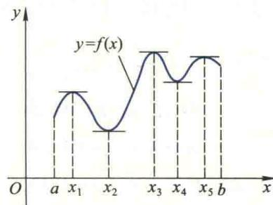
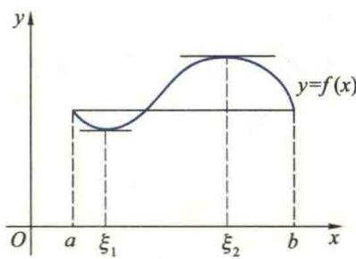
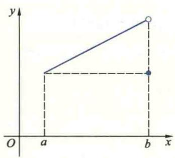
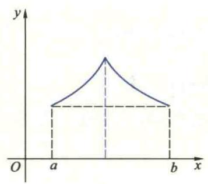
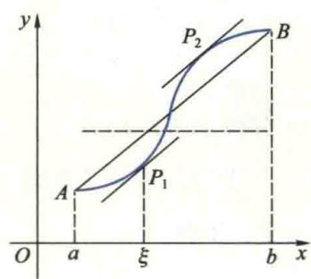

import ExerciseTrigger from '@/components/exercises/ExerciseTrigger.astro';
import QRCodeVideo from '@/components/QRCodeVideo.astro';

import Guide from '@/components/Guide.astro';
import Knowledge from '@/components/Knowledge.astro';
import Example from '@/components/Example.astro';
import Analysis from '@/components/Analysis.astro';
import Solution from '@/components/Solution.astro';
import Variant from '@/components/Variant.astro';
import Note from '@/components/Note.astro';
import Block from '@/components/Block.astro';
import Method from '@/components/Method.astro';
import Exercise from '@/components/Exercise.astro';

我们知道,函数的导数反映了函数在一点附近的局部变化性态,为了利用导数研究函数在某一个区间上整体的变化性态,就需要建立函数在区间上的改变量与导数之间的联系,这就是本节将介绍的几个微分中值定理.微分中值定理在函数的导数与函数在区间上的变化(函数的改变量)之间搭建了一座桥梁,使我们能用导数去研究函数的在一个区间上的某些性态,是利用导数进一步解决函数的许多理论和应用问题的理论基础.

## 4.1 函数的极值及其必要条件

设有函数 $f: I \to \mathbf{R}, x_0 \in I$ ，若 $\exists \delta > 0$ ，使得 $\forall x \in U(x_0, \delta) \subseteq I$ ，恒有 $f(x) \geqslant f(x_0) (\leqslant f(x_0))$ ，则称 $f$ 在 $x_0$ 取得极小（大）值 $f(x_0). f$ 的极小值与极大值统称为 $f$ 的极

值,使f取得极值的点 $x_{0}$ 称为f的极值点.

在图 2.12 中, 函数 f 在 $x_{1}, x_{3}$ 与 $x_{5}$ 分别取得极大值 $f(x_{1}), f(x_{3})$ 与 $f(x_{5})$ , 在 $x_{2}$ 与 $x_{4}$ 分别取得极小值 $f(x_{2})$ 与 $f(x_{4})$ .

应当注意函数的极大(小)值与最大(小)值的区别.函数的极值是就一点的邻域来说的,是局部性概念;而最值(最大、最小值的简称)是对整个区间而言

<figure class="vp-figure">
  
  <figcaption>图2.12</figcaption>
</figure>

的,是整体性概念.函数在区间 I 内部取得的最值一定是极值,反过来不一定成立.而且同一个函数的极小值有可能大于极大值,在图 2.12 中,极小值 $f(x_{4})$ 大于极大值 $f(x_{1})$ .

设函数f在 $(a,b)$ 内可导,从图2.12易见,曲线 $y=f(x)$ 上与f的极值点 $x_{1},x_{2},x_{3},x_{4},x_{5}$ 相对应的点处有水平切线,受这个事实的启发得到下面的定理.

<Knowledge title="定理 4.1 Fermat 定理">
若函数 $f:(a,b)\rightarrow\mathbf{R}$ 在 $x_{0}\in(a,b)$ 处取得极值,且 f 在

$x_{0}$ 处可导, 则 $f'(x_{0})=0$ .

<Solution title="证明">
不妨设 f 在 $x_{0}$ 处取极大值（若 f 在 $x_{0}$ 处取极小值证法类似），则

$\exists\delta>0,$ 使得 $\forall x\in\mathring{U}(x_{0},\delta)\subseteq(a,b),$ 恒有 $f(x)\leqslant f(x_{0}).$

若 $x \in (x_0 - \delta, x_0)$ ，则

$$
\frac {f (x) - f (x _ {0})}{x - x _ {0}} \geqslant 0,
$$

从而由极限的保号性有

$$
f _ {-} ^ {\prime} (x _ {0}) = \lim _ {x \to x _ {0} ^ {-}} \frac {f (x) - f (x _ {0})}{x - x _ {0}} \geqslant 0;
$$

若 $x \in (x_0, x_0 + \delta)$ ，则

$$
\frac {f (x) - f (x _ {0})}{x - x _ {0}} \leqslant 0,
$$
</Solution>
</Knowledge>

为了利用f在 $x_{0}$ 处取极大值且可导这两个已知条件来证明 $f'(x_{0})=0$ ，自然应当用导数的定义，但由于直接用导数定义很难得出此结论，所以我们转而证明f在 $x_{0}$ 的左导数 $f_{-}'(x_{0})\geqslant0$ ，右导数 $f_{+}'(x_{0})\leqslant0$ ，由于f在 $x_{0}$ 处可导，所以必有 $f'(x_{0})=0$ 。

从而有

$$
f _ {+} ^ {\prime} (x _ {0}) = \lim _ {x \to x _ {0} ^ {*}} \frac {f (x) - f (x _ {0})}{x - x _ {0}} \leqslant 0.
$$

由于 $f(x)$ 在 $x_{0}$ 处可导，故必有 $f'(x_{0})=f_{+}'(x_{0})=f_{-}'(x_{0})=0.$

## 4.2 微分中值定理

Rolle 定理也是受一个简单的几何事实的启发得到的. 设函数 f 在 $[a, b]$ 上连续, 在区间的两个端点处函数值相等. 若曲线 $y = f(x)$ 上与 $(a, b)$ 内任一点 x 相对应的点处都有切线存在, 但无与 x 轴垂直的切线, 则由图 2.13 可见, 该曲线上至少有一点具有水平切线.

微分中值定理包括 Rolle 定理、Lagrange 定理与 Cauchy 定理, 下面先介绍 Rolle 定理.

<Knowledge title="定理 4.2 Rolle 定理">
若函数 $f:[a,b]\rightarrow R$ 满足下列条件：

(1) f 在 $[a, b]$ 上连续；(2) f 在 $(a, b)$ 内可导；
</Knowledge>

(3) $f(a)=f(b)$ ,
则至少存在一点 $\xi\in(a,b)$ ，使 $f'(\xi)=0.$

试举例说明 $f'(x_0) = 0$ 只是在 $x_0$ 处可导函数 $f$ 在 $x_0$ 取得极值的必要条件而不是充分条件.

<figure class="vp-figure">
  
  <figcaption>图2.13</figcaption>
</figure>

说明将 Rolle 定理中的条件(1)与(2)换成“f 在闭区间 $[a, b]$ 上可导”，定理的结论仍然成立，试问条件(1)与(2)换成后者好吗？有什么缺陷？

<Solution title="证明">
根据定理 4.1, 只要证明 f 在区间 $(a, b)$ 内有极值点就行了. 由已知, f 在 $[a, b]$ 上连续, 故由闭区间上连续函数最大(小)值定理, 必存在 $x_{1}, x_{2} \in [a, b]$ , 使

$$
f \left(x _ {1}\right) = \max _ {x \in [ a, b ]} f (x) = M, \quad f \left(x _ {2}\right) = \min _ {x \in [ a, b ]} f (x) = m.
$$

若 M = m，则 f 在 $[a, b]$ 上为常数，因此对于 $(a, b)$ 中每个点都可作为 $\xi$ ，使 $f'(\xi) = 0$ .
</Solution>

Rolle 定理结论中使 $f'(\xi)=0$ 的点 $\xi$ 是否一定是函数f的极值点？

若 $M \neq m$ ，则 $M$ 与 $m$ 中至少有一个不等于 $f(a)$ ， $\xi$ 是否一定是函数 $f$ 的极值点？不妨设 $M \neq f(a)$ （若 $m \neq f(a)$ ，可类似地证明）。由条

件(3)知, $M\neq f(b)$ ,最大值M只能被f在 $(a,b)$ 内的点 $x_{1}$ 取得,故 $x_{1}$ 也是f的极值点.由定理4.1, $f'(x_{1})=0$ .

<QRCodeVideo url="http://2d.hep.cn/1254051/25" />

由定理4.2立即可得

<Knowledge title="推论 4.1">
可微函数 f 的任意两个零点之间至少有导函数 $f'$ 的一个零点.
</Knowledge>

<Example title="例 4.1">
证明方程 $x^{3}+2x+1=0$ 在区间 $(-1,0)$ 内有且仅有一个实根.
</Example>

二维码2.4.1如何用Rolle定理证明方程根的存在性.

$$
f (x) = x ^ {3} + 2 x + 1
$$

$$
f (- 1) = - 2 <   0, f (0) = 1 > 0.
$$

函数的零点定理, 在 $(-1,0)$ 内 f 至少有一个零点, 即方程 $x^{3}+2x+1=0$ 在 $(-1,0)$ 内至少有一个根, 设其为 $x_{1}$ . 下面证明该方程在 $(-1,0)$ 内只有一个根. 若它还有一个根 $x_{2}$ , 则由推论 4.1, 在 $x_{1}$ 与 $x_{2}$ 之间至少有一点 $\xi$ , 使 $f'(\xi)=0$ . 然而, $f'(x)=3x^{2}+2>0$ , 即 $f'$ 在 $(-1,0)$ 内没有零点, 从而得到矛盾. 所以, 在 $(-1,0)$ 内该方程有且仅有一个实根.

<Example title="例 4.2">
证明: 若函数 $f:[0,1] \rightarrow R$ 在 $[0,1]$ $f(1)=0$ ，则至少存在一个 $c \in (0,1)$ ，使

$$
f ^ {\prime} (c) = - \frac {f (c)}{c}.
$$

<Solution title="证明">
先作一简单的分析.为了证明结论成立,由于 $c\neq0$ ,只要证明 $cf'(c)+f(c)=0$ 就行了.又因为上连续,在(0,1)内可导,并且
</Solution>
</Example>

证明例4.2的关键在于通过将
要证明的等式变形和分析,构造
满足 Rolle 定理条件的辅助函数 $F(x)=xf(x)$ .

$$
c f ^ {\prime} (c) + f (c) = [ x f (x) ] ^ {\prime} \mid_ {x = c},
$$

所以只要证明 $F(x)=xf(x)$ 满足 Rolle 定理条件就行了. 显然, F 在 $[0,1]$ 上连续, 在 $(0,1)$ 内可导, 又 $F(0)=F(1)=0$ , 根据 Rolle 定理, 至少存在一点 $c\in(0,1)$ , 使 $F'(c)=0$ . 又 $F'(x)=xf'(x)+f(x)$ , 故结论成立.

Rolle 定理的三个条件中只要有一个不满足, 都不能保证定理的结论成立. 例如, 在图 2.14 的 (a), (b) 与 (c) 中, 分别画出了不满足条件 (1), (2) 与 (3) 之一的三个函数的图像, 显然, 这三个函数都不存在使定理结论成立的 $\xi$ .

在图2.14的(c)中,由于 $f(a)\neq f(b)$ ,曲线 $y=f(x)$ 上没有一点的切线平行于x轴.但是,不难看到,曲线上至少有一点(如点 $P_{1}$ 或 $P_{2}$ )处的切线平行于弦AB.由于弦AB的斜率是 $\frac{f(b)-f(a)}{b-a}$ ,该曲线在点 $P_{1}$ 与 $P_{2}$ 处切线的斜率为 $f'(\xi)$ ,故有

$$
\frac {f (b) - f (a)}{b - a} = f ^ {\prime} (\xi), \quad \xi \in (a, b).
$$

  
(a)

  
(b)

<figure class="vp-figure">
  
  <figcaption>图2.14</figcaption>
</figure>
(c)

由此,我们得到下面的重要定理:

<Knowledge title="定理 4.3 Lagrange 定理">
若函数 $f: [a, b] \rightarrow R$ 满足下列条件：

(1) f 在 $[a, b]$ 上连续； (2) f 在 $(a, b)$ 内可导，则至少存在一点 $\xi \in (a, b)$ ，使

$$
f (b) - f (a) = f ^ {\prime} (\xi) (b - a).\tag{4.1}
$$

分析 为了证明结论成立,由于 $b-a\neq0$ ,只要证明至少存在一点 $\xi$ ,使

$$
\frac {f (b) - f (a)}{b - a} - f ^ {\prime} (\xi) = 0
$$

就行了.又因为

$$
\frac {f (b) - f (a)}{b - a} - f ^ {\prime} (\xi) = \left[ \frac {f (b) - f (a)}{b - a} x - f (x) \right] ^ {\prime} \Bigg | _ {x = \xi},
$$

所以, 只要证明 $F(x)=\frac{f(b)-f(a)}{b-a}x-f(x)$ 在 $[a,b]$ 上满足 Rolle 定理的条件就行了.

<Solution title="证明">
作辅助函数

$$
F (x) = \frac {f (b) - f (a)}{b - a} x - f (x).
$$

显然,函数 F 满足 Rolle 定理的条件(1)与(2).又

$$
F (a) = \frac {f (b) - f (a)}{b - a} a - f (a) = \frac {a f (b) - b f (a)}{b - a},
$$

$$
F (b) = \frac {f (b) - f (a)}{b - a} b - f (b) = \frac {a f (b) - b f (a)}{b - a},
$$

故 $F(a)=F(b)$ . 由 Rolle 定理, 至少存在一点 $\xi\in(a,b)$ , 使 $F'(\xi)=0$ , 即

$$
\frac {f (b) - f (a)}{b - a} - f ^ {\prime} (\xi) = 0,
$$

从而有 $f(b)-f(a)=f'(\xi)(b-a)$ .
</Solution>
</Knowledge>

定理4.3的证明思路也是将要证明的等式(4.1)变形,构造一个满足Rolle定理条件的辅助函数,关键在于如何构造符合要求的辅助函数.通过将要证明的结论变形、分析是常用的一种方法,称为分析法,另一种是几何法,定理4.3证明之后给出的另一个辅助函数就是受几何上的启示构造出来的.

证明定理 4.3 的辅助函数的选取不是唯一的.事实上,由于

$$
\left[ f (x) - f (a) - \frac {f (b) - f (a)}{b - a} (x - a) \right] ^ {\prime} \Bigg | _ {x = \xi} = f ^ {\prime} (\xi) - \frac {f (b) - f (a)}{b - a},
$$

因此,也可用

$$
F (x) = f (x) - \left[ f (a) + \frac {f (b) - f (a)}{b - a} (x - a) \right]
$$

作为辅助函数.而且此函数就是曲线 $y=f(x)$ 与弦 AB 方程之差,显然满足 Rolle 定理的条件.

在 Lagrange 定理中, 若 $f(a)=f(b)$ , 则有 $f'(\xi)=0$ . 因此, Rolle 定理是 Lagrange 定理的特例, 而 Lagrange 定理是 Rolle 定理的推广.

公式(4.1)称为 Lagrange 公式. 将两边同乘-1 得

$$
f (a) - f (b) = f ^ {\prime} (\xi) (a - b),
$$

这就是说,无论是 a&lt;b 还是 a>b, Lagrange 公式均成立.

Lagrange 公式还可以写成其他形式. 由于 $\xi \in (a, b)$ , 所以 $0 < \frac{\xi - a}{b - a} < 1$ . 令 $\theta = \frac{\xi - a}{b - a}$ , 则 $\xi = a + \theta(b - a)$ , 于是有

$$
f (b) - f (a) = f ^ {\prime} [ a + \theta (b - a) ] (b - a) \quad (0 <   \theta <   1).\tag{4.2}
$$

如果取 $a = x, b = x + \Delta x$ , Lagrange 公式又可写成

$$
f (x + \Delta x) - f (x) = f ^ {\prime} (x + \theta \Delta x) \Delta x \quad (0 <   \theta <   1),\tag{4.3}
$$

常称(4.3)式为有限改变量公式.它建立了函数 $y=f(x)$ 在区间上的改变量与导数之间的关系,使我们能够用导数研究函数在区间上的变化性态.

<Knowledge title="推论 4.2">
设 $f: I \rightarrow R$ 在 I 上连续, 在 I 内可导, 则在 I 内 $f'(x) \equiv 0$ 的充要条件为

f在I上是常数.

<Solution title="证明">
充分性是显然的,下面证明必要性.

任取 $x_{1}, x_{2} \in I$ ，在闭区间 $[x_{1}, x_{2}]$ 上对 $f$ 应用 Lagrange 定理，存在 $\xi \in (x_{1}, x_{2}) \subseteq (a, b)$ ，使

$$
f \left(x _ {2}\right) - f \left(x _ {1}\right) = f ^ {\prime} (\xi) \left(x _ {2} - x _ {1}\right) = 0,
$$

因此, $f(x_{1})=f(x_{2})$ .由 $x_{1},x_{2}$ 的任意性知f在I上是常数.
</Solution>
</Knowledge>

<Knowledge title="推论 4.3">
设函数 f 在 $[x_{0}, b)$ （或 $(a, x_{0}]$ ）上连续，在 $(x_{0}, b)$ （或 $(a, x_{0})$ ）内可导，且 $\lim_{x \to x_{0}^{+}} f'(x) = A$ （或 $\lim_{x \to x_{0}^{-}} f'(x) = A$ ），则

<QRCodeVideo id="2.4.2" title="求分段函数在分界点处导数的另一种方法." url="http://2d.hep.cn/1254051/49" />

$$
f _ {+} ^ {\prime} (x _ {0}) = \lim _ {x \to x _ {0} ^ {+}} f ^ {\prime} (x) = A (\text {或} f _ {-} ^ {\prime} (x _ {0}) = \lim _ {x \to x _ {0} ^ {-}} f ^ {\prime} (x) = A),
$$

其中 A 为有限或无限.

<Solution title="证明">
根据公式(4.3)，我们有

$$
\frac {f (x _ {0} + \Delta x) - f (x _ {0})}{\Delta x} = f ^ {\prime} (x _ {0} + \theta \Delta x) \quad (0 <   \theta <   1).
$$

所以

$$
f _ {+} ^ {\prime} (x _ {0}) = \lim _ {\Delta x \rightarrow 0 ^ {+}} \frac {f (x _ {0} + \Delta x) - f (x _ {0})}{\Delta x} = \lim _ {\Delta x \rightarrow 0 ^ {+}} f ^ {\prime} (x _ {0} + \theta \Delta x) = A.
$$

同样,可证明关于左导数的结论.

前面曾经指出,在研究分段函数的可导性时,对于使函数有不同表达式的子区间的分界点处的可导性,通常需要利用导数的定义来讨论.但是,如果函数满足推论4.3的条件,那么,利用该推论研究分界点处的可导性比用导数定义更为简便,下面举一个例子来说明.
</Solution>
</Knowledge>

<Example title="例 4.3">
设

$$
f (x) = \left\{ \begin{array}{l l} x ^ {2}, & x <   0, \\ 0, & x = 0, \\ x \sin x, & x > 0, \end{array} \right.
$$

求 $f'(x)$ .

<Solution title="解">
当 $x < 0$ 时, $f'(x) = 2x$ ; 当 $x > 0$ 时, $f'(x) = \sin x + x\cos x$ . 由于 $\lim_{x \to 0^-} f'(x) = \lim_{x \to 0^-} 2x = 0$ , $\lim_{x \to 0^+} f'(x) = \lim_{x \to 0^+} (\sin x + x\cos x) = 0$ , 在区间 $[0, b)(b > 0)$ 与 $(a, 0](a < 0)$ 上分别应用推论4.3, 则有

$$
f _ {+} ^ {\prime} (0) = \lim _ {x \to 0 ^ {+}} f ^ {\prime} (x) = 0, \quad f _ {-} ^ {\prime} (0) = \lim _ {x \to 0 ^ {-}} f ^ {\prime} (x) = 0.
$$

故

$$
f ^ {\prime} (x) = \left\{ \begin{array}{l l} 2 x, & x <   0, \\ 0, & x = 0, \\ \sin x + x \cos x, & x > 0. \end{array} \right.
$$

Lagrange 定理是最常用的一个微分中值定理, 具有重要的理论和应用价值. 下面举例说明它在证明不等式、判断方程根的存在性等方面的应用.
</Solution>
</Example>

<Example title="例 4.4">
证明: 当 x > 0 时,

$$
\frac {x}{1 + x} <   \ln (1 + x) <   x.
$$

<Solution title="证明">
由于 $\ln (1 + x) = \ln (1 + x) - \ln 1$ ，所以为了证明本题中的不等式，只要取 $f(t) = \ln (1 + t)$ 为辅助函数，并对该函数在 $[0, x]$ 上应用Lagrange定理. 容易验证 $f(t)$ 在 $[0, x]$ 上满足Lagrange定理的条件，因而至少存在一点 $\xi \in (0, x)$ ，使

$$
f (x) - f (0) = f ^ {\prime} (\xi) (x - 0),
$$

即

$$
\ln (1 + x) = \frac {x}{1 + \xi}.
$$

<QRCodeVideo id="2.4.3" title="Lagrange 中值定理的含义与应用." url="http://2d.hep.cn/1254051/26" />

又因为 $\xi \in (0, x)$ ，故有

$$
\frac {x}{1 + x} <   \frac {x}{1 + \xi} <   x.
$$

从而有

$$
\frac {x}{1 + x} <   \ln (1 + x) <   x \quad (x > 0).
$$

也可取 $f(t)=\ln t(t\in[1,1+x])$ 作为辅助函数来证明此不等式.
</Solution>
</Example>

<Example title="例 4.5">
设函数 f 在 $[0,1]$ 上可导，值域为 $(0,1)$ ，并且 $\forall x \in (0,1), f'(x) \neq 1$ ，证明 f 有唯一不动点 $c \in (0,1)$ .

<Solution title="证明">
由于 $f$ 的不动点是指满足方程 $f(x) = x$ 的点 $c$ , 所以令 $F(x) = f(x) - x$ , 只要证明存在唯一的 $c$ , 使 $f(c) - c = 0$ . 易见 $F$ 在 $[0,1]$ 上连续, 且 $F(0) = f(0) > 0$ , $F(1) = f(1) - 1 < 0$ . 由零点定理, 至少存在一个 $c \in (0,1)$ , 使 $F(c) = 0$ , 即 $f(c) = c$ , 所以 $f$ 在 $(0,1)$ 内至少有一个不动点.

再证明在(0,1)内f至多有一个不动点. 若存在两点 $c_{1}, c_{2} \in (0,1)$ ，使 $f(c_{1}) = c_{1}, f(c_{2}) = c_{2}$ ，不妨设 $c_{1} < c_{2}$ . 在闭区间 $[c_{1}, c_{2}]$ 上对f应用Lagrange定理，那么，至少存在一个 $c \in (c_{1}, c_{2}) \subseteq (0,1)$ ，使

$$
1 = \frac {f (c _ {2}) - f (c _ {1})}{c _ {2} - c _ {1}} = f ^ {\prime} (c),
$$

这与在(0,1)内 $f'(x)\neq1$ 相矛盾.因此f在(0,1)内有唯一不动点.
</Solution>
</Example>

<Knowledge title="定理 4.4 Cauchy 定理">
设函数 $f, g: [a, b] \rightarrow R$ 满足下列条件：

(1) $f, g$ 在 $[a, b]$ 上连续；

(2) f, g 在 $(a, b)$ 内可导，并且 $\forall x \in (a, b), g'(x) \neq 0$ ，则至少存在一点 $\xi \in (a, b)$ ，使

$$
\frac {f (b) - f (a)}{g (b) - g (a)} = \frac {f ^ {\prime} (\xi)}{g ^ {\prime} (\xi)}.\tag{4.4}
$$

<Solution title="证明">
先证 $g(b) \neq g(a)$ . 若 $g(b) = g(a)$ , 则由 Rolle 定理, 至少存在一点 $\xi \in (a, b)$ , 使 $g'(\xi) = 0$ , 这与假设在 $(a, b)$ 内 $g'(x) \neq 0$ 相矛盾.

为证明定理中的结论,只要证明辅助函数

$F(x)=[f(b)-f(a)]g(x)-[g(b)-g(a)]f(x)$ 的导函数在 $(a,b)$ 内有零点.容易验证 $F(x)$ 满足
Rolle 定理的条件, 因此, 至少存在一点 $\xi \in (a, b)$ 使

$$
\begin{array}{r l} F ^ {\prime} (x) & = [ f (b) - f (a) ] g ^ {\prime} (\xi) - \\ & [ g (b) - g (a) ] f ^ {\prime} (\xi) = 0. \end{array}
$$
</Solution>
</Knowledge>

将定理 4.4 中的函数 f 与 g 的自变量用字母 t 表示, 则 $x = g(t)$ 与 $y = f(t)$ ( $t \in [a, b]$ ) 就是一条以 $A(g(a), f(a))$ , $B(g(b), f(b))$ 为端点的平面曲线 C 的参数方程. (4.4) 式左端就是弦 AB 的斜率, 而右端则是 C 上点 $P(g(\xi), f(\xi))$ 处的切线的斜率. 因此 Cauchy 公式在几何上就表示在 C 上至少有一点 P, 使 C 在 P 处的切线平行于弦 AB, 也就是 Lagrange 公式表示的几何事实的参数形式.

由于 $g'(\xi) \neq 0$ ，将上式变形即得所要证明的等式(4.4).

若取 $g(x) = x$ ，Cauchy定理就变成了Lagrange定理.因此，Cauchy定理是Lagrange定理的推广.

## 4.3 L'Hospital法则

作为 Cauchy 中值定理的一个应用,本段介绍一种求不定式极限的简单而有效的方法——L'Hospital 法则.下面先讲求 $\frac{0}{0}$ 型不定式极限的 L'Hospital 法则.

<Knowledge title="定理 4.5">
$\left(\frac{0}{0}\right)$ 型不定式 设函数 f, g 在区间 $(x_{0}, x_{0} + \delta)$ （其中 $\delta > 0$ ）内满足下列条件：

(1) $\lim_{x\to x_0^+}f(x) = \lim_{x\to x_0^+}g(x) = 0;$

(2) $f, g$ 在 $(x_0, x_0 + \delta)$ 内可导，且 $g'(x) \neq 0$ ;

(3) $\lim_{x\to x_0^+}\frac{f'(x)}{g'(x)} = a$ ( $a$ 为有限实数或无穷大),

$$
\lim _ {x \rightarrow x _ {0} ^ {+}} \frac {f (x)}{g (x)} = \lim _ {x \rightarrow x _ {0} ^ {+}} \frac {f ^ {\prime} (x)}{g ^ {\prime} (x)} = a.\tag{4.5}
$$

<Solution title="证明">
若 $f, g$ 在 $x_0$ 处右连续，则由条件(1)知， $f(x_0) = g(x_0) = 0.$ 任取 $x \in (x_0, x_0 + \delta)$ ，则 $f, g$ 在区间 $[x_0, x]$ 上满足 Cauchy 定理的条件，故存在 $\xi \in (x_0, x)$ ，使

$$
\frac {f (x)}{g (x)} = \frac {f (x) - f (x _ {0})}{g (x) - g (x _ {0})} = \frac {f ^ {\prime} (\xi)}{g ^ {\prime} (\xi)}.
$$

当 $x \to x_0^+$ 时，显然有 $\xi \to x_0^+$ . 又因为 $\lim_{x \to x_0^+} \frac{f'(x)}{g'(x)} = a$ ，从而得

$$
\lim _ {x \rightarrow x _ {0} ^ {+}} \frac {f (x)}{g (x)} = \lim _ {x \rightarrow x _ {0} ^ {+}} \frac {f ^ {\prime} (\xi)}{g ^ {\prime} (\xi)} = \lim _ {\xi \rightarrow x _ {0} ^ {+}} \frac {f ^ {\prime} (\xi)}{g ^ {\prime} (\xi)} = a.
$$

若 $f, g$ 在 $x_0$ 处不右连续，可补充定义 $f(x_0) = g(x_0) = 0$ ，则 $f, g$ 在 $x_0$ 右连续. 这样做并不影响极限 $\lim_{x \to x_0^+} \frac{f(x)}{g(x)}$ 的存在性及其值. 重复上述证明步骤，可证明结论仍成立.

由证明过程不难看出,定理4.5对于当 $x\rightarrow x_{0}^{-},x\rightarrow x_{0}$ 等情形也可得到相应的结论.如果 $x\rightarrow\infty(\pm\infty)$ ,那么可通过变量代换 $x=\frac{1}{t}$ 化为 $t\rightarrow0$ 的情形,得到类似的结论.这里不再一一叙述和推证.
</Solution>
</Knowledge>

<Example title="例 4.6">
求 $\lim_{x\to0}\frac{\tan x-x}{x-\sin x}$ .

<Solution title="解">
显然, 分子与分母在 x=0 的邻域内满足定理 4.5 的条件(1)(2), 应用 L'Hospital 法则,

$$
\text {   原式   } = \lim _ {x \to 0} \frac {\sec^ {2} x - 1}{1 - \cos x}.
$$

由于上式右端仍为 $\frac{0}{0}$ 型，且分子分母仍满足定理4.5的条件(1)(2)，故可再次使用该法则，得
</Solution>
</Example>

在应用 L'Hospital 法则的时候, 应检查 f, g 是否满足条件(1), (2). 如果用一次 L'Hospital 法则后, 得到的极限 $\lim_{x\to x_{0}^{\prime}}\frac{f'(x)}{g'(x)}$ 仍然属于 $\frac{0}{0}$ 型不定式, 只要 $f', g'$ 仍满足定理 4.5 中的相应条件, 那么还可继续使用该法则.

$$
\text {   原式   } = \lim _ {x \to 0} \frac {2 \sec^ {2} x \tan x}{\sin x} = 2 \lim _ {x \to 0} \sec^ {2} x = 2.
$$

读者可能注意到,上面第二个等式利用到了当 $x\to x_{0}$ 时 $\tan x$ 与 $\sin x$ 是等价无穷小这个事实.

<Example title="例 4.7">
求 $\lim_{x\to 0}\frac{2\mathrm{e}^{2x} - \mathrm{e}^x - 3x - 1}{(\mathrm{e}^x - 1)^2\mathrm{e}^x}.$

<Solution title="解">
由于当 $x \to 0$ 时, $\mathrm{e}^x \to 1$ , 且 $\mathrm{e}^x - 1 \sim x$ , 所以

$$
\begin{array}{r l} \text {原式} & = \lim _ {x \to 0} \frac {2 e ^ {2 x} - e ^ {x} - 3 x - 1}{x ^ {2}} = \lim _ {x \to 0} \frac {4 e ^ {2 x} - e ^ {x} - 3}{2 x} \\ & = \frac {1}{2} \lim _ {x \to 0} \frac {8 e ^ {2 x} - e ^ {x}}{1} = \frac {7}{2}. \end{array}
$$
</Solution>
</Example>

与通常求极限过程一样,在应用 L'Hospital 法则时,前面讲过的消去公因子与无穷小等价代换等方法可以同时使用.而且,若式中含有极限不为零的因子,则可先求出该因子的极限值.这样做可以使余下的不定式比较简单,便于继续使用该法则.

<Knowledge title="定理 4.6">
$\left(\frac{\infty}{\infty}\right)$ 型不定式 设 f, g 在 $(x_{0}, x_{0} + \delta)$ 内满足定理 4.5 中的条件(2)与(3)，条件(1)改为

$$
\lim _ {x \to x _ {0} ^ {+}} f (x) = \lim _ {x \to x _ {0} ^ {+}} g (x) = \infty ,
$$

则有同样的结论成立(证明从略).

该法则对于 $x \rightarrow x_{0}^{-}, x \rightarrow x_{0}, x \rightarrow \infty (\pm \infty)$ 等情形也成立.
</Knowledge>

<Example title="例 4.8">
求 $\lim_{x\to +\infty}\frac{\log_a x}{x^\alpha}$ 与 $\lim_{x\to +\infty}\frac{x^\alpha}{a^{\beta_x}} (a > 1, \alpha, \beta > 0)$ .

<Solution title="解">
这两个极限都属于 $\frac{\infty}{\infty}$ 型不定式, 应用 L'Hospital 法则得

$$
\begin{array}{r l} \lim _ {x \to + \infty} \frac {\log_ {a} x}{x ^ {\alpha}} & = \lim _ {x \to + \infty} \frac {\frac {1}{x \ln a}}{\alpha x ^ {\alpha - 1}} = \frac {1}{\alpha \ln a} \lim _ {x \to + \infty} x ^ {- \alpha} = 0, \\ \lim _ {x \to + \infty} \frac {x ^ {\alpha}}{a ^ {\beta x}} & = \lim _ {x \to + \infty} \frac {\alpha x ^ {\alpha - 1}}{\beta a ^ {\beta x} \ln a} = \lim _ {x \to + \infty} \frac {\alpha (\alpha - 1) x ^ {\alpha - 2}}{\beta^ {2} a ^ {\beta x} (\ln a) ^ {2}} \\ & = \dots = \lim _ {x \to + \infty} \frac {\alpha (\alpha - 1) \cdots (\alpha - n + 1) x ^ {\alpha - n}}{\beta^ {n} a ^ {\beta x} (\ln a) ^ {n}} \\ & = \lim _ {x \to + \infty} \frac {\alpha (\alpha - 1) \cdots (\alpha - n)}{\beta^ {n + 1} a ^ {\beta x} (\ln a) ^ {n + 1} x ^ {n + 1 - \alpha}} = 0, \end{array}
$$

其中 $n = [\alpha]$

由例 4.8 易见, 虽然当 $x \to +\infty$ 时, $\log_{a}x, x^{\alpha}, a^{\beta x}$ 都是无穷大量, 但是, $x^{\alpha}$ 是 $\log_{a}x$ 的高阶无穷大, $a^{\beta x}$ 又是 $x^{\alpha}$ 的高阶无穷大. 这反映了当 $x \to +\infty$ 时, 它们是数量级不同的无穷大: 指数函数 $a^{\beta x}$ 的数量级最高, 幂函数 $x^{\alpha}$ 次之, 对数函数 $\log_{a}x$ 的数量级最低. 为便于今后的应用, 希望读者能记住这个事实.

除了 $\frac{0}{0}$ 与 $\frac{\infty}{\infty}$ 型之外, 还有 $0 \cdot \infty, \infty - \infty, 1^{\infty}, 0^{0}, \infty^{0}$ 等类型的不定式, 它们的极限都能化为 $\frac{0}{0}$ 或 $\frac{\infty}{\infty}$ 型不定式来计算. 例如, $0^{0}$ 表示当 $x \to x_{0}$ (或 $x \to \infty$ ) 时, 函数 $f(x)^{g(x)}$ 中的 $f(x) \to 0^{+}, g(x) \to 0$ . 由等式 $f(x)^{g(x)} = \mathrm{e}^{g(x)\ln f(x)}$ 易见, 求该不定式的极限就转化为求 $0 \cdot \infty$ 不定式的极限 $\lim_{x \to x_{0}} g(x) \ln f(x)$ . 下面举例说明.
</Solution>
</Example>

<Example title="例 4.9">
求下列极限：

(1) $\lim_{x\to\frac{\pi}{2}}(\sec x-\tan x)$ ;

(2) $\lim_{x\to+\infty}\left(\frac{\pi}{2}-\arctan x\right)^{\frac{1}{\ln x}}$ .

<Solution title="解">
（1）此极限属于 $\infty -\infty$ 型不定式.由于

$$
\sec x - \tan x = \frac {1 - \sin x}{\cos x},
$$

当 $x \to \frac{\pi}{2}$ 时, 它就转化成 $\frac{0}{0}$ 型不定式. 应用 L'Hospital 法则,

$$
\text {   原式   } = \lim _ {x \to \frac {\pi}{2}} \frac {1 - \sin x}{\cos x} = \lim _ {x \to \frac {\pi}{2}} \left(\frac {- \cos x}{- \sin x}\right) = 0.
$$

(2) 此极限属于 $0^{0}$ 型不定式. 由于

$$
\left(\frac {\pi}{2} - \arctan x\right) ^ {\frac {1}{\ln x}} = \mathrm{e} ^ {\frac {1}{\ln x} \cdot \ln \left(\frac {\pi}{2} - \arctan x\right)},
$$

<QRCodeVideo id="2.4.4" title="使用 L'Hospital" url="http://2d.hep.cn/1254051/27" />

当 $x \to +\infty$ 时, $\frac{\ln\left(\frac{\pi}{2} - \arctan x\right)}{\ln x}$ 属于 $\frac{\infty}{\infty}$ 型不定式. 应用 L'Hospital 法则,

法则应注意的问题.

$$
\begin{array}{r l} \lim _ {x \to + \infty} \frac {\ln \left(\frac {\pi}{2} - \arctan x\right)}{\ln x} & = \lim _ {x \to + \infty} \frac {- \frac {x}{1 + x ^ {2}}}{\frac {\pi}{2} - \arctan x} \\ & = - \lim _ {x \to + \infty} \left[ \frac {1 - x ^ {2}}{(1 + x ^ {2}) ^ {2}} \bigg / \left(- \frac {1}{1 + x ^ {2}}\right) \right] = - 1. \end{array}
$$

所以

$$
\lim _ {x \rightarrow + \infty} \left(\frac {\pi}{2} - \arctan x\right) ^ {\frac {1}{\ln x}} = \frac {1}{\mathrm{e}}.
$$
</Solution>
</Example>

<Example title="例 4.10">
求一个 n 次多项式 $P_{n}(x)=a_{0}+a_{1}x+a_{2}x^{2}+\cdots+a_{n}x^{n}$ ，使

$$
\mathrm{e} ^ {x} = P _ {n} (x) + o \left(x ^ {n}\right).
$$

<Solution title="解">
要使 $\mathrm{e}^x = P_n(x) + o(x^n)$ ，只要使

$$
\mathrm{e} ^ {x} - P _ {n} (x) = o \left(x ^ {n}\right),
$$

也就是使

$$
\lim _ {x \to 0} \frac {\mathrm{e} ^ {x} - P _ {n} (x)}{x ^ {k}} = 0 (k = 0, 1, 2, \dots , n).
$$

取 $k = 0$ ，由 $\lim_{x\to 0}[e^x -P_n(x)] = 0$ ，得知 $a_0 = e^0 = 1$

取 $k = 1$ ，由 $\lim_{x\to 0}\frac{\mathrm{e}^x - P_n(x)}{x} = 0$ ，应用L'Hospital法则得

$$
\begin{array}{r l} \lim _ {x \to 0} \frac {\mathrm{e} ^ {x} - P _ {n} (x)}{x} & = \lim _ {x \to 0} [ (\mathrm{e} ^ {x}) ^ {\prime} - P _ {n} ^ {\prime} (x) ] \\ & = \lim _ {x \to 0} [ (\mathrm{e} ^ {x}) ^ {\prime} - (a _ {1} + 2 a _ {2} x + \dots + n a _ {n} x ^ {n - 1}) ] \\ & = \lim _ {x \to 0} [ (\mathrm{e} ^ {x}) ^ {\prime} - a _ {1} ] = 0, \end{array}
$$

从而得 $a_{1}=(\mathrm{e}^{x})^{\prime}\big|_{x=0}=1.$

取 $k = 2$ ，由 $\lim_{x\to 0}\frac{\mathrm{e}^x - P_n(x)}{x^2} = 0$ ，连续2次应用L'Hospital法则得

$$
\begin{array}{r l} \lim _ {x \to 0} \frac {\mathrm{e} ^ {x} - P _ {n} (x)}{x ^ {2}} & = \lim _ {x \to 0} \frac {(\mathrm{e} ^ {x}) ^ {\prime} - P _ {n} ^ {\prime} (x)}{2 x} = \frac {1}{2 !} \lim _ {x \to 0} [ (\mathrm{e} ^ {x}) ^ {\prime \prime} - P _ {n} ^ {\prime \prime} (x) ] \\ & = \frac {1}{2 !} \lim _ {x \to 0} \{(\mathrm{e} ^ {x}) ^ {\prime \prime} - [ 2! a _ {2} + \dots + n (n - 1) x ^ {n - 2} ] \} \\ & = \frac {1}{2 !} \lim _ {x \to 0} [ (\mathrm{e} ^ {x}) ^ {\prime \prime} - 2! a _ {2} ] = 0, \end{array}
$$

从而得 $a_2 = \frac{1}{2!} (\mathrm{e}^x)''\Bigg|_{x=0} = \frac{1}{2!}$ .

类似可得, $a_{k}=\frac{1}{k!}\left(\mathrm{e}^{x}\right)^{(k)}\bigg|_{x=0}=\frac{1}{k!}\quad(k=3,4,\cdots,n)$ .

因此,我们有

$$
P _ {n} (x) = 1 + x + \frac {1}{2 !} x ^ {2} + \dots + \frac {1}{n !} x ^ {n},
$$

$$
\mathrm{e} ^ {x} = 1 + x + \frac {1}{2 !} x ^ {2} + \dots + \frac {1}{n !} x ^ {n} + o (x ^ {n}).
$$

若记 $f(x)=\mathrm{e}^{x}$ ，则系数 $a_{k}=\frac{1}{k!}=\frac{1}{k!}f^{(k)}(0)$ .这时上式可写成如下形式：

$$
f (x) = f (0) + f ^ {\prime} (0) x + \frac {f ^ {\prime \prime} (0)}{2 !} x ^ {2} + \dots + \frac {f ^ {(n)} (0)}{n !} x ^ {n} + o (x ^ {n}).\tag{4.6}
$$

下一节我们将看到，(4.6)式具有一般性.
</Solution>
</Example>

<Block title="习题2.4">
**（A）**

1. 下列函数在给定的区间上是否满足 Rolle 定理中的条件？如果满足，求出定理中的 $\xi$ ，如果不满足， $\xi$ 是否一定不存在？

(1) $f(x)=\frac{3}{2x^{2}+1},[-1,1]$ ; (2) $f(x)=2-|x|,-2,2$ ;

(3) $f(x)=\left\{\begin{aligned}&x,&-2\leqslant x<0,\\&-x^{2}+2x+1,&0\leqslant x\leqslant3.\end{aligned}\right.$

2. 证明: 对函数 $f(x)=px^{2}+qx+r$ 在某区间上应用 Lagrange 中值定理时所求得的点 $\xi$ 是该区间的中点, 其中 p, q 与 r 是常数.

3. 能否用下面的方法证明 Cauchy 定理？为什么？

对f,g分别应用Lagrange定理得，

$$
\frac {f (b) - f (a)}{g (b) - g (a)} = \frac {f ^ {\prime} (\xi) (b - a)}{g ^ {\prime} (\xi) (b - a)} = \frac {f ^ {\prime} (\xi)}{g ^ {\prime} (\xi)}.
$$

4. 设 $f(x) = (x - 1)(x - 2)(x - 3)(x - 4)$ ，问方程 $f'(x) = 0$ 有几个实根，并指出它们所在的区间.

5. 设 $a_{i} \in \mathbb{R} (i=0,1,\cdots,n)$ ，并且满足 $a_{0} + \frac{a_{1}}{2} + \frac{a_{2}}{3} + \cdots + \frac{a_{n}}{n+1} = 0$ 。证明：方程 $a_{0} + a_{1}x + a_{2}x^{2} + \cdots + a_{n}x^{n} = 0$ 在 $(0,1)$ 内至少有一个实根。

6. 设函数 $f$ 在 $(- \infty, + \infty)$ 内可微，且为奇函数。证明： $\forall a \neq 0$ ，必存在介于 $-a$ 与 $a$ 之间的 $\xi (\xi \neq \pm a)$ ，使 $f'(\xi) = \frac{f(a)}{a}$ 。

7. 设函数 $y = f(x)$ 二阶可导，且 $f(x_{1}) = f(x_{2}) = f(x_{3})$ ，其中 $x_{1} < x_{2} < x_{3}$ . 证明至少存在一点 $\xi \in (x_{1}, x_{3})$ ，使 $f''(\xi) = 0$ .

8. 设 $f, g: [a, b] \to \mathbf{R}$ 在 $[a, b]$ 上连续，在 $(a, b)$ 内可导，并且 $\forall x \in (a, b), f'(x) = g'(x)$ ，证明：在 $[a, b]$ 上

$$
f (x) = g (x) + C \qquad (C \in \mathbf {R} \text {是常数}).
$$

9. 应用 Lagrange 定理证明: 在闭区间 $[-1,1]$ 上, $\arcsin x + \arccos x = \frac{\pi}{2}$ .

10. 设 $f: (-1, 1) \to \mathbb{R}$ 可微, $f(0) = 0$ , $|f'(x)| \leqslant 1$ , 证明: 在 $(-1, 1)$ 内, $|f(x)| < 1$ .

11. 设函数 $f$ 可微, 证明: $f(x)$ 的任何两个零点之间必有 $f(x) + f'(x)$ 的零点.

12. 证明下列不等式：

(1) $|\arctan x - \arctan y| \leqslant |x - y|$ ; (2) $\frac{a - b}{a} < \ln \frac{a}{b} < \frac{a - b}{b} (a > b > 0)$ ;

(3) $e^{x}>xe$ (x>1).

13. 设 $f, g: [a, b] \to \mathbf{R}$ 是可导函数，且 $g' \neq 0$ ，证明：存在 $c \in (a, b)$ ，使

$$
\frac {f (a) - f (c)}{g (c) - g (b)} = \frac {f ^ {\prime} (c)}{g ^ {\prime} (c)}.
$$

14. 证明方程 $x^{5}+x-1=0$ 有唯一的正根.

15. 在下列求极限的过程中都应用了 L'Hospital 法则, 解法有无错误?

(1) $\lim_{x\to 0}\frac{x^2 + 1}{x - 1} = \lim_{x\to 0}\frac{(x^2 + 1)'}{(x - 1)'} = \lim_{x\to 0}\frac{2x}{1} = 0;$

(2) $\lim_{x\to \infty}\frac{\sin x + x}{x} = \lim_{x\to \infty}\frac{(\sin x + x)'}{(x)'} = \lim_{x\to \infty}\frac{\cos x + 1}{1}$ , 极限不存在;

(3) 设 f 在 $x_{0}$ 处二阶可导, 则

$$
\begin{array}{r l} \lim _ {h \to 0} \frac {f (x _ {0} + h) - 2 f (x _ {0}) + f (x _ {0} - h)}{h ^ {2}} & = \lim _ {h \to 0} \frac {f ^ {\prime} (x _ {0} + h) - f ^ {\prime} (x _ {0} - h)}{2 h} \\ & = \lim _ {h \to 0} \frac {f ^ {\prime \prime} (x _ {0} + h) + f ^ {\prime \prime} (x _ {0} - h)}{2} = f ^ {\prime \prime} (x _ {0}). \end{array}
$$

16. 求下列极限：

(1) $\lim_{x\to 0}\frac{\mathrm{e}^x - \mathrm{e}^{-x}}{\sin x};$ (2) $\lim_{x\to \frac{\pi}{2}}\frac{\ln\sin x}{(\pi - 2x)^2};$

(3) $\lim_{x\to +\infty}\frac{\ln\left(1 + \frac{1}{x}\right)}{\arctan x - \frac{\pi}{2}};$ (4) $\lim_{x\to 0}\left(\cot^2 x - \frac{1}{x^2}\right);$

(5) $\lim_{x\to 0}\cot x\ln \frac{1 + x}{1 - x};$ (6) $\lim_{x\to 0}\frac{\tan x - x}{x^2\sin x};$

(7) $\lim_{x\to 0^{+}}\left(\frac{1}{x}\right)^{\tan x};$

(8) $\lim_{x\to \frac{\pi}{4}}(\tan x)^{\tan 2x}$ ;

(9) $\lim_{x\to 0}\left(\frac{\sin x}{x}\right)^{\frac{1}{x^2}};$

(10) $\lim_{x\to 0}\frac{\mathrm{e} - (1 + x)^{\frac{1}{x}}}{x};$

(11) $\lim_{x\to 0}\left[\frac{(1 + x)^{\frac{1}{x}}}{e}\right]^{\frac{1}{x}};$

(12) $\lim_{x\to 0}\left(\frac{1^x + 2^x + 3^x}{3}\right)^{\frac{1}{x}}.$

17. 试用三种方法求 $\lim_{n\to \infty}\left(\cos \frac{1}{n}\right)^{n^2}$ .

18. 试确定常数 $a, b$ , 使极限

$$
\lim _ {x \rightarrow 0} \frac {1 + a \cos 2 x + b \cos 4 x}{x ^ {4}}
$$

存在,并求出它的值.

19. 设函数 f 具有一阶连续导数, $f''(0)$ 存在, 且 $f'(0) = 0$ , $f(0) = 0$ ,

$$
g (x) = \left\{ \begin{array}{c c} \frac {f (x)}{x}, & x \neq 0, \\ a, & x = 0. \end{array} \right.
$$

(1) 确定 a 使 $g(x)$ 处处连续；

(2) 对以上所确定的 a, 证明 $g(x)$ 具有一阶连续导数.

**（B）**

1. 设函数 $f: [0,1] \to \mathbf{R}$ 在 $[0,1]$ 上连续，在 $(0,1)$ 内可导，且 $f(1) = 0$ . 证明：存在点 $x_0 \in (0,1)$ ，使

$$
n f \left(x _ {0}\right) + x _ {0} f ^ {\prime} \left(x _ {0}\right) = 0.
$$

2. 设 $f$ 在 $[a, b]$ 上可微，且 $a$ 与 $b$ 同号，证明：存在 $\xi \in (a, b)$ ，使

(1) $2\xi [f(b) - f(a)] = (b^2 -a^2)f'(\xi);$ (2) $f(b) - f(a) = \xi \left(\ln \frac{b}{a}\right)f'(\xi).$

3. 设 $f$ 在 $[a, b]$ 上连续，在 $(a, b)$ 内可微，且 $f(a) = f(b) = 0$ ，证明： $\forall \lambda \in \mathbb{R}$ ， $\exists c \in (a, b)$ ，使得 $f'(c) = \lambda f(c)$ .

4. 证明不等式: $\frac{1}{9} < \sqrt{66} - 8 < \frac{1}{8}$ .

5. 设 $f, g: [a, b] \to \mathbb{R}$ 在 $[a, b]$ 上连续，在 $(a, b)$ 内可导，证明：存在 $\xi \in (a, b)$ ，使

$$
\left| \begin{array}{c c} f (a) & f (b) \\ g (a) & g (b) \end{array} \right| = (b - a) \left| \begin{array}{c c} f (a) & f ^ {\prime} (\xi) \\ g (a) & g ^ {\prime} (\xi) \end{array} \right|.
$$

6. 设 f 在 x=0 的某邻域内 n 阶可导, $f(0)=f'(0)=\cdots=f^{(n-1)}(0)=0$ , 试用 Cauchy 定理证明:

$$
f (x) = \frac {f ^ {(n)} (\theta x)}{n !} x ^ {n}, \theta \in (0, 1).
$$

7. 设抛物线 $y = -x^2 + Bx + C$ 与 $x$ 轴有两个交点 $x = a, x = b (a < b)$ . 函数 $f$ 在 $[a, b]$ 上二阶可导， $f(a) = f(b) = 0$ ，并且曲线 $y = f(x)$ 与 $y = -x^2 + Bx + C$ 在 $(a, b)$ 内有一个交点. 证明：存在 $\xi \in (a, b)$ ，使 $f''(\xi) = -2$ .

8. 设 $f$ 在 $[a, b]$ 上二阶可微， $f(a) = f(b) = 0, f_{+}^{\prime}(a)f_{-}^{\prime}(b) > 0$ ，则方程 $f''(x) = 0$ 在 $(a, b)$ 内至少有一个根.
</Block>

<ExerciseTrigger chapter={2} section="2.4" title="2.4 微分中值定理及其应用 课后真题与自测练习" />
