import Guide from '@/components/Guide.astro';
import Knowledge from '@/components/Knowledge.astro';
import Example from '@/components/Example.astro';
import Analysis from '@/components/Analysis.astro';
import Solution from '@/components/Solution.astro';
import Variant from '@/components/Variant.astro';
import Note from '@/components/Note.astro';
import Block from '@/components/Block.astro';
import Method from '@/components/Method.astro';

有了微分中值定理和 Taylor 公式, 就可以利用导数来研究函数在区间上的变化性态. 本节主要介绍它们在研究函数的单调性、极值与最值以及曲线的凹凸性等方面的应用.

## 6.1 函数的单调性

单调性是函数的重要性态.然而,利用定义来判定函数的单调性往往是非常困难的.下面介绍一种利用 Lagrange 定理建立的判断可导函数单调性的简便方法.

<Knowledge title="定理 6.1">
设 $f: I \rightarrow R$ 在 I 上连续, 在 I 内可导, 则下述命题成立:
</Knowledge>

<Note>
(1) f 在 I 上单调增 (减) 的充要条件是在 I 内 $f' \geqslant 0 (f' \leqslant 0)$ ;

(2) 若在 I 内 $f' > 0$ ( $f' < 0$ ), 则 f 在 I 上严格单调增(减).
</Note>

<Knowledge title="定理 6.1">
命题(2)的条件改为“若在 $I$ 内 $f' \geqslant 0 (f' \leqslant 0)$ ，但仅在有限个离散点处有 $f' = 0$ ”，结论是否成立？

<Solution title="证明">
（1）充分性 任取 $x_{1}, x_{2} \in I$ ，不妨设 $x_{2} > x_{1}$ ，根据Lagrange定理，

$$

f \left(x _ {2}\right) - f \left(x _ {1}\right) = f ^ {\prime} (\xi) \left(x _ {2} - x _ {1}\right) \geqslant 0 (\leqslant 0), \xi \in \left(x _ {1}, x _ {2}\right),

$$

因此，f 在 I 上单调增（减）.

必要性 设 $f$ 在 $I$ 上单调增（减），对 $I$ 内的任何 $x$ ，取 $\Delta x$ ，使 $x + \Delta x$ 仍在 $I$ 内，则有

$$

\frac {f (x + \Delta x) - f (x)}{\Delta x} \geqslant 0 (\leqslant 0),

$$

二维码2.6.1用导函数在一点的正负能判定该点邻域内函数的单调性吗？

从而

$$

f ^ {\prime} (x) = \lim _ {\Delta x \to 0} \frac {f (x + \Delta x) - f (x)}{\Delta x} \geqslant 0 (\leqslant 0).

$$
</Solution>
</Knowledge>

<Note>
试完成定理 6.1 中结论(2)的证明.

(2) 的证明类似于(1)的充分性,由读者自己去完成.

为了判定给定函数f的单调区间,应先求出方程 $f'(x)=0$ 的根(若f有不可导的点,还应求出这些不可导的点),它们将f的定义区间分成若干子区间,确定 $f'$ 在各子区间上的符号,再根据定理6.1判定f在各子区间上的单调性.
</Note>

<Note>
若 f 在 I 上严格单调增 (减), $f'$ 在 I 内不一定处处为正 (负). 例如, $f(x) = x^{3}$ 在 $(-∞, +∞)$ 上是严格单调增的, 但是 $f'(0) = 0$ , 即在 $(-∞, +∞)$ 内存在着导数为 0 的点.
</Note>

<Example title="例 6.1">
讨论函数 $f(x)=x^{3}-3x^{2}-9x+5$ 的单调性.

<Solution title="解">
由于 $f'(x)=3x^{2}-6x-9=3(x+1)(x-3)$ ，解方程 $f'(x)=0$ 得 $x_{1}=-1, x_{2}=3$ 。当 $x\in(-\infty,-1)$ 时， $f'(x)>0$ ，所以f在 $(-∞,-1)$ 内严格单调增；当 $x\in(-1,3)$ 时， $f'(x)<0$ ，所以f在 $(-1,3)$ 内严格单调减；当 $x\in(3,+\infty)$ 时， $f'(x)>0$ ，所以f在 $(3,+\infty)$ 内严格单调增。

利用函数的单调性,可以证明一些不等式.
</Solution>
</Example>

<Example title="例 6.2">
证明: 当 $x \in \left(0, \frac{\pi}{2}\right)$ 时, $\tan x > x$ .

<Solution title="证明">
令 $f(x) = \tan x - x, x \in \left[0, \frac{\pi}{2}\right)$ ，则

$$

f ^ {\prime} (x) = \sec^ {2} x - 1 = \tan^ {2} x > 0, \quad x \in \left(0, \frac {\pi}{2}\right),

$$

故 $f$ 在 $\left[0, \frac{\pi}{2}\right)$ 上严格单调增. 又 $f(0) = 0$ , 所以在 $\left(0, \frac{\pi}{2}\right)$ 内, $f(x) = \tan x - x > f(0) = 0$ , 即

$$

\tan x > x.

$$
</Solution>
</Example>

<Example title="例 6.3">
证明: 当 0 &lt; x &lt; 1 时, $e^{2x} < \frac{1 + x}{1 - x}$ .

<Solution title="证明">
为了证明此题中的不等式, 只要证明

$$

(1 - x) \mathrm{e} ^ {2 x} <   1 + x \quad (0 <   x <   1).

$$

令 $f(x)=(1-x)\mathrm{e}^{2x}-1-x,x\in[0,1)$ ，则注意:利用函数的单调性证明不等式,是很常用也很重要的方法.一般先将要证的不等式恒等变形,从而构造适当的辅助函数,并证明它的单调性.

$$

f ^ {\prime} (x) = (1 - 2 x) \mathrm{e} ^ {2 x} - 1, f ^ {\prime \prime} (x) = - 4 x \mathrm{e} ^ {2 x}.

$$

由于在(0,1)内， $f''(x)<0$ ，故 $f'$ 在[0,1)上严格单调减，从而在(0,1)内 $f'(x)<f'(0)=0$ 。由此又知f在[0,1)内严格单调减，得

$$

f (x) <   f (0) = 0 \text {或} (1 - x) \mathrm{e} ^ {2 x} <   1 + x,

$$

因此原不等式成立.
</Solution>
</Example>

## 6.2 函数的极值

由Fermat定理(定理4.1)知,若函数 $f$ 在 $x_0$ 处可导,则 $f$ 在 $x_0$ 处取得极值的必要条件是 $f'(x_0) = 0$ .使 $f'(x) = 0$ 的点称为 $f$ 的驻点.因此,可导函数的极值点必定是它的驻点.但是,反过来不一定成立.例如, $x = 0$ 是 $f(x) = x^3$ 的驻点,但不是 $f$ 的极值点.

哪些驻点才是极值点呢？通常可用下面两个定理来判定.

<Knowledge title="定理 6.2">
设 f 在 $x_{0}$ 的某邻域 $U(x_{0})$ 内可导，并且 $f'(x_{0}) = 0$ .

(1) 若 $x < x_{0}$ 时 $f'(x) \geqslant 0, x > x_{0}$ 时 $f'(x) \leqslant 0$ ，则 f 在 $x_{0}$ 处取极大值；

(2) 若 $x < x_{0}$ 时 $f'(x) \leqslant 0, x > x_{0}$ 时 $f'(x) \geqslant 0$ ，则 f 在 $x_{0}$ 处取极小值；

(3) 若 $f'(x)$ 在 $x_{0}$ 的左右两侧符号不变, 则 f 在 $x_{0}$ 处不取极值.

<Solution title="证明">
（1）由定理6.1，当 $x < x_0$ 时， $f$ 单调增；当 $x > x_0$ 时， $f$ 单调减，故 $f$ 在 $x_0$ 处取极大值.
</Solution>
</Knowledge>

<Note>
试证明定理6.2的结论(3).

(2)的证法与(1)类似,(3)由读者补证.

由证明过程易见, 若 f 在 $x_{0}$ 的去心邻域内可导, 在 $x_{0}$ 处连续, 则定理的结论仍成立. 因此, 不可导点也可能是函数的极值点. 在研究函数极值的时候, 应当一并考虑.

由定理 6.2, 我们得到确定函数极值的第一种方法, 步骤如下:

  

二维码2.6.2函数在极值点的左右邻域内一定单调吗？

(1) 求出函数 f 在所讨论区间内的所有驻点与不可导的点；

（2）考察导函数 $f'$ 在各驻点与不可导点左、右两侧符号的变化，判定它们是否为f的极值点，是极大值点还是极小值点；

(3) 求出 f 的极值.
</Note>

<Example title="例 6.4">
求函数 $f(x)=\sqrt[3]{6x^{2}-x^{3}}$ 的极值.

<Solution title="解">
按照上述步骤,我们有

(1) $f'(x)=\frac{4-x}{\sqrt[3]{x}\sqrt[3]{(6-x)^2}}$ ，由 $f'(x)=0$ 解得驻点x=4，并且易见f在x=0与x=6处连续但导数不存在.

(2) 将 $f'$ 在驻点与不可导点两侧符号的变化与 f 的极值点列表如下:

&lt;table>&lt;tr>&lt;td>x&lt;/td>&lt;td>(-∞,0)&lt;/td>&lt;td>0&lt;/td>&lt;td>(0,4)&lt;/td>&lt;td>4&lt;/td>&lt;td>(4,6)&lt;/td>&lt;td>6&lt;/td>&lt;td>(6,+∞)&lt;/td>&lt;/tr>&lt;tr>&lt;td>f&#x27;(x)&lt;/td>&lt;td>-&lt;/td>&lt;td>∞&lt;/td>&lt;td>+&lt;/td>&lt;td>0&lt;/td>&lt;td>-&lt;/td>&lt;td>∞&lt;/td>&lt;td>-&lt;/td>&lt;/tr>&lt;tr>&lt;td>f(x)&lt;/td>&lt;td>严格单调减&lt;/td>&lt;td>极小&lt;/td>&lt;td>严格单调增&lt;/td>&lt;td>极大&lt;/td>&lt;td>严格单调减&lt;/td>&lt;td>非极值点&lt;/td>&lt;td>严格单调减&lt;/td>&lt;/tr>&lt;/table>

(3) f 的极大值为 $f(4)=2\sqrt[3]{4}$ ，极小值为 $f(0)=0$ 。

如果由函数f的一阶导数 $f'$ 的表达式不易确定它在驻点两侧的符号,但函数f在驻点处二阶可导,则可根据下面的定理利用二阶导数来判定该驻点是否为极值点.
</Solution>
</Example>

<Knowledge title="定理 6.3">
设 f 在 $x_{0}$ 处二阶可导，并且 $f'(x_{0}) = 0, f''(x_{0}) \neq 0$ ，则当 $f''(x_{0}) > 0 (< 0)$ 时，f 在 $x_{0}$ 处取极小（大）值.

<Solution title="证明">
由于 $f$ 在 $x_0$ 处二阶可导, 故由带 Peano 余项的二阶 Taylor 公式得

$$

\begin{array}{r l} f (x) & = f (x _ {0}) + f ^ {\prime} (x _ {0}) (x - x _ {0}) + \frac {1}{2 !} f ^ {\prime \prime} (x _ {0}) (x - x _ {0}) ^ {2} + o ((x - x _ {0}) ^ {2}) \\ & = f (x _ {0}) + \frac {1}{2} f ^ {\prime \prime} (x _ {0}) (x - x _ {0}) ^ {2} + o ((x - x _ {0}) ^ {2}), \end{array}

$$

从而有

$$

f (x) - f \left(x _ {0}\right) = \frac {1}{2} f ^ {\prime \prime} \left(x _ {0}\right) \left(x - x _ {0}\right) ^ {2} + o \left(\left(x - x _ {0}\right) ^ {2}\right).

$$

由于右端第二项是第一项的高阶无穷小,因此,在 $x_{0}$ 的充分小邻域内, $f(x)-f(x_{0})$ 的符号取决于第一项.所以,若 $f''(x_{0})>0$ ,则 $f(x)-f(x_{0})>0$ ,即 $f(x)>f(x_{0})$ ,f在 $x_{0}$ 取极小值.类似可证明 $f''(x_{0})<0$ 的情况.

由定理 6.3 又可得到确定函数极值的第二种方法, 步骤如下:

(1) 求出 $f'$ 与 $f''$ ，由方程 $f'(x)=0$ 解得 f 的所有驻点；

(2) 考察 $f''$ 在各驻点处的符号, 判定它们是极大值点还是极小值点;

(3) 求出 f 的极值.
</Solution>
</Knowledge>

<Example title="例 6.5">
求函数 $f(x)=\sin x+\cos x$ 的极值.

<Solution title="解">
由于 $f$ 是以 $2\pi$ 为周期的周期函数, 因此, 只要考察 $f$ 在一个周期 $[0, 2\pi]$ 内的

情况.

(1) $f'(x)=\cos x-\sin x,f''(x)=-(\sin x+\cos x)$ ，解 $f'(x)=0$ 得f的驻点 $x=\frac{\pi}{4},\frac{5\pi}{4}$ .

（2）由于 $f''\left(\frac{\pi}{4}\right)=-\sqrt{2}<0$ ，所以 $x=\frac{\pi}{4}$ 为f的极大值点；又由于 $f''\left(\frac{5\pi}{4}\right)=\sqrt{2}>0$ ，所以 $x=\frac{5\pi}{4}$ 为f的极小值点.

(3) f 的极大值为 $f\left(\frac{\pi}{4}\right)=\sqrt{2}$ ，极小值为 $f\left(\frac{5\pi}{4}\right)=-\sqrt{2}$ .

如果在驻点 $x_0$ 处， $f''(x_0) = 0$ ，那么用定理6.3也不能判定 $x_0$ 是否为极值点。在这种情况下，我们自然想到是否可求助于更高阶的导数。事实上，利用带Peano余项的Taylor公式，可以证明下面的定理（证明留作习题）。
</Solution>
</Example>

<Knowledge title="定理 6.4">
设函数 f 在 $x_{0}$ 处 $n (n \geqslant 2)$ 阶可导，并且 $f'(x_{0}) = f''(x_{0}) = \cdots = f^{(n-1)}(x_{0}) = 0$ ，而 $f^{(n)}(x_{0}) \neq 0$ .

（1）当 $n$ 为偶数时， $x_0$ 必为极值点. 若 $f^{(n)}(x_0) > 0$ ，则 $x_0$ 为极小值点；若 $f^{(n)}(x_0) < 0$ ，则 $x_0$ 为极大值点.

(2) 当 n 为奇数时, $x_{0}$ 不是极值点.
</Knowledge>

## 6.3 函数的最大(小)值

前面已经指出,在闭区间上的连续函数一定能取得最大值与最小值.在很多学科领域与实际问题中,经常提出在一定条件下用料最省、成本最低、时间最短,效益最好等问题.在数学上,它们常归结为在一定条件下求一个函数(称为目标函数)在某区间上的最大(小)值问题,称为最优化问题.本段仅研究一些最简单的最优化问题.

根据闭区间上连续函数的性质以及函数取得极值的条件得知, 若 $f \in C[a, b]$ , 则 f 在 $[a, b]$ 上必能取得最大(小)值, 并且最大(小)值点可能是: (1) f 在 $(a, b)$ 内的极值点. 极值点可能是 f 的驻点, 也可能是 f 的不可导点; (2) 区间 $[a, b]$ 的端点. 因此, 我们只要求出 f 在 $(a, b)$ 内的所有驻点与不可导点, 并将 f 在这些点上的值与端点值 $f(a)$ 与 $f(b)$ 加以比较, 就可以得到 f 在 $[a, b]$ 上的最大值与最小值.

<Example title="例 6.6">
求函数 $f(x)=x^{p}+(1-x)^{p}(p>1)$ 在 $[0,1]$ 上的最值.

<Solution title="解">
由于

$$

f ^ {\prime} (x) = p x ^ {p - 1} - p (1 - x) ^ {p - 1}.

$$

方程 $f'(x)=0$ ，得f的驻点 $x=\frac{1}{2}$ 。又f没有不可导点，且 $f\left(\frac{1}{2}\right)=2^{1-p},f(0)=1$ ，$f(1)=1$ , 比较得知 f 在 $[0,1]$ 上的最小值为 $2^{1-p}$ , 最大值为 1.

由此例立即可得下面的不等式：
</Solution>
</Example>

<Note>
若求得函数 $f(x)$ 在一个区间 I 上的最大值 M (最小值 m) 则有不等式

$$

\frac {1}{2 ^ {p - 1}} \leqslant x ^ {p} + (1 - x) ^ {p} \leqslant 1 \quad (x \in [ 0, 1 ], p > 1).\tag{6.1}

$$

$f(x) \leqslant M (f(x) \geqslant m), x \in I.$ 这种利用函数的最大最小值证明不等式也是证明不等式的常用方法之一.

在研究函数的最值问题的时候,常常会遇到一

些特殊情况.此时,上述步骤可以适当简化.例如:(1)若f是区间 $[a,b]$ 上的单调函数,则其最大(小)值必然在区间 $[a,b]$ 的端点上取得;(2)设f在 $[a,b]$ 上连续,在 $(a,b)$ 内可导,在 $(a,b)$ 内有唯一的驻点 $x_{0}$ ,若 $x_{0}$ 是极大(小)值点,则 $x_{0}$ 就是f在 $[a,b]$ 上的最大(小)值点;(3)在实际问题中,若目标函数f在 $[a,b]$ 上连续,在 $(a,b)$ 内可导,且有唯一的驻点 $x_{0}$ ,如果能根据问题的实际意义,判定f在 $(a,b)$ 内必有最大(小)值,那么 $x_{0}$ 就是f的最大(小)值点.
</Note>

<Example title="例 6.7">
用铁皮做成一个容积一定的圆柱形无盖的容器,问应当如何设计,才能使用料最省?

<Solution title="解">
首先根据问题的要求建立目标函数.用料最省就是要使容器的表面积最小.设其表面积为 S,高为 H,底半径为 R,则

$$

S = 2 \pi R H + \pi R ^ {2} (0 <   H, R <   + \infty).

$$

又设容器的体积为 V, 由题目要求容积一定, 得

$$

\pi R ^ {2} H = V \quad (V \text {为常数}).

$$

由上式解得 $H=\frac{V}{\pi R^{2}}$ ，代入 S 的表达式即得目标函数

$$

S = \frac {2 V}{R} + \pi R ^ {2} (0 <   R <   + \infty).

$$

下面求 S 的最小值. 由于

$$

\frac {\mathrm{d} S}{\mathrm{d} R} = - \frac {2 V}{R ^ {2}} + 2 \pi R,

$$

方程 $\frac{dS}{dR}=0$ ,得驻点 $R=\sqrt[3]{\frac{V}{\pi}}$ .又

$$

\frac {\mathrm{d} ^ {2} S}{\mathrm{d} R ^ {2}} = \frac {4 V}{R ^ {3}} + 2 \pi > 0,

$$

故 $R = \sqrt[3]{\frac{V}{\pi}}$ 是极小值点.由于 $R = \sqrt[3]{\frac{V}{\pi}}$ 是函数 $S = \frac{2V}{R} +\pi R^2$ 在 $(0, + \infty)$ 内的唯一的驻

点(没有不可导点),而且是极小值点,所以它就是最小值点.

将 $R=\sqrt[3]{\frac{V}{\pi}}$ 代入 $H=\frac{V}{\pi R^{2}}$ ，易得 $H=\sqrt[3]{\frac{V}{\pi}}=R$ 。因此，当高 H 和底面半径 R 相等时，用料最省。
</Solution>
</Example>

<Example title="例 6.8">
设海岛 $A_{1}$ 与陆上城市 $A_{2}$ 到海岸线（假设为直线）的垂直距离分别为 $b_{1}$ km 与 $b_{2}$ km，它们之间的水平距离为 a km（图 2.15），需要建立它们之间的运输线。如果轮船的航速为 $v_{1}$ km/h，陆上汽车的速度为 $v_{2}$ km/h ( $v_{1} > v_{2}$ )。问转运站 P 设在海岸线上何处才能使运输时间最短？

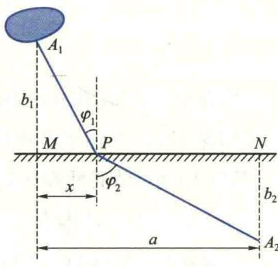

<Solution title="解">
先建立目标函数. 设 $MP = x$ , 则海上运输时间为

图2.15

$$

T _ {1} = \frac {1}{v _ {1}} \sqrt {b _ {1} ^ {2} + x ^ {2}},

$$

陆上运输时间为

$$

T _ {2} = \frac {1}{v _ {2}} \sqrt {b _ {2} ^ {2} + (a - x) ^ {2}}.

$$

因此,问题的目标函数为

$$

T (x) = \frac {1}{v _ {1}} \sqrt {b _ {1} ^ {2} + x ^ {2}} + \frac {1}{v _ {2}} \sqrt {b _ {2} ^ {2} + (a - x) ^ {2}} \quad (0 \leqslant x \leqslant a).

$$

下面求 $T(x)$ 的最小值.由于

$$

\begin{array}{r l} & {\frac {\mathrm{d} T}{\mathrm{d} x} = \frac {1}{v _ {1}} \frac {x}{\sqrt {b _ {1} ^ {2} + x ^ {2}}} - \frac {1}{v _ {2}} \frac {a - x}{\sqrt {b _ {2} ^ {2} + (a - x) ^ {2}}},} \\ & {\frac {\mathrm{d} ^ {2} T}{\mathrm{d} x ^ {2}} = \frac {1}{v _ {1}} \frac {b _ {1} ^ {2}}{(b _ {1} ^ {2} + x ^ {2}) ^ {3 / 2}} + \frac {1}{v _ {2}} \frac {b _ {2} ^ {2}}{\left[ b _ {2} ^ {2} + (a - x) ^ {2} \right] ^ {3 / 2}},} \end{array}\tag{6.2}

$$

显然，在 $[0, a]$ 上， $\frac{\mathrm{d}^2T}{\mathrm{d}x^2} > 0$ ，所以 $\frac{\mathrm{d}T}{\mathrm{d}x}$ 严格单调增，并且

$$

\left. \frac {\mathrm{d} T}{\mathrm{d} x} \right| _ {x = 0} = - \frac {a}{v _ {2} \sqrt {b _ {2} ^ {2} + a ^ {2}}} <   0, \quad \left. \frac {\mathrm{d} T}{\mathrm{d} x} \right| _ {x = a} = \frac {a}{v _ {1} \sqrt {b _ {1} ^ {2} + a ^ {2}}} > 0.

$$

根据零点定理,必有唯一的 $\xi \in (0, a)$ , 使

$$

\left. \frac {\mathrm{d} T}{\mathrm{d} x} \right| _ {x = \xi} = 0.\tag{6.3}

$$

由于 $x=\xi$ 是 $T(x)$ 的唯一的驻点, 根据定理 6.3, 它就是 $T(x)$ 的最小值点.

由于难以直接从(6.3)式求驻点 $x = \xi$ ，因此，我们引入两个辅助角 $\varphi_{1},\varphi_{2}$ .由图2.15易知，

$$

\sin \varphi_ {1} = \frac {x}{\sqrt {b _ {1} ^ {2} + x ^ {2}}}, \quad \sin \varphi_ {2} = \frac {a - x}{\sqrt {b _ {2} ^ {2} + (a - x) ^ {2}}}.

$$

代入(6.2)式并解方程(6.3)可得 $\frac{1}{v_{1}}\sin\varphi_{1}-\frac{1}{v_{2}}\sin\varphi_{2}=0$ ，即

$$

\frac {\sin \varphi_ {1}}{\sin \varphi_ {2}} = \frac {v _ {1}}{v _ {2}}.\tag{6.4}

$$

这就是说,当点 P 取在使(6.4)式成立之处,运输时间最短.

实际上(6.4)式就是光学中的折射定理.根据光学中的Fermat原理,光线在两点之间传播必取用时最短的路线.若光线在两种不同媒质中的传播速度分别为 $v_{1}$ 和 $v_{2}$ ,则光由一种媒质传播到另一种媒质所用时间最短的路线由(6.4)式确定.本例中,由于在海上与陆上两种不同的运输速度相当于光线在两种不同传播媒质中的速度,因而所得结论也与光的折射定理相同.这说明,有很多属于不同学科领域的问题,虽然它们的具体意义不同,但在数量关系上却可以用同一数学模型来描述.
</Solution>
</Example>

## 6.4 函数图像的凹凸性与拐点

函数 $y=f(x)$ 图像(即平面曲线)的凹凸性也是函数变化的重要性态. 例如, $y=x^{2}$ 与 $y=\sqrt{x}$ 在 x>0 处都是严格单调增的, 但它们的图像却有着明显的差异. 前者上凹(下凸), 后者上凸(下凹)(图 2.16). 为了区分它们, 我们需要去判定函数所表示曲线的凹凸性.

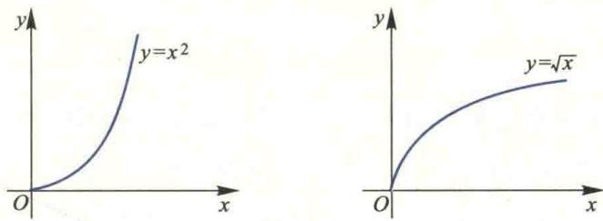  

图2.16

怎样来刻画曲线的凹凸呢？由图2.17我们看到，如果曲线 $\widehat{AB}$ 是上凹的，那么其上任意两点 $P_{1}$ 与 $P_{2}$ 间的弧段 $\widehat{P_1P_2}$ 必位于弦 $\overline{P_1P_2}$ 的下方；而对于上凸的曲线段 $\widehat{AB}$ ，其上任意两点 $P_{1}$ 与 $P_{2}$ 间的弧段 $\widehat{P_1P_2}$ 均位于弦 $\overline{P_1P_2}$ 的上方。由此，我们可以给出以下定义：

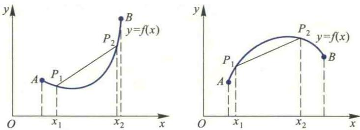  

图2.17

<Knowledge title="定义 6.1">
(函数图像的凹凸性) 设函数 $y=f(x)$ 两点 $x_{1}$ 与 $x_{2}$ ，曲线 $y=f(x)$ 上相应的弧段 $\widehat{P_{1}P_{2}}$ 始终位于弦 $\overline{P_{1}P_{2}}$ 的下（上）方（图 2.17），则称函数 $f(x)$ 在区间 I 中的图像是凹（凸）的，也称曲线 $y=f(x)$ 是凹（凸）的.
</Knowledge>

<Note>
由定义6.1知,若函数 $f(x)$ 的图像在区间I中是凹的,则对于 $\forall x_{1},x_{2}\in I$ ,且 $x_{1}\neq x_{2}$ ,有 $f\left(\frac{x_{1}+x_{2}}{2}\right)<\frac{1}{2}[f(x_{1})+f(x_{2})]$ .

直接利用定义来判断函数图像的凹凸性是比较

困难的. 下面, 我们利用导数来给出可导函数图像凹凸性的简便判别法.

对于可导函数 $f(x)$ 来说,其图像的凹凸性还可以通过切线来刻画.由图2.18可见,若 $f(x)$ 的图像在区间I是凹(凸)的,则在I中对应曲线 $y=f(x)$ 上任一点处的切线除该点外总在此曲线 $y=f(x)$ 的下(上)方.反过来也成立.

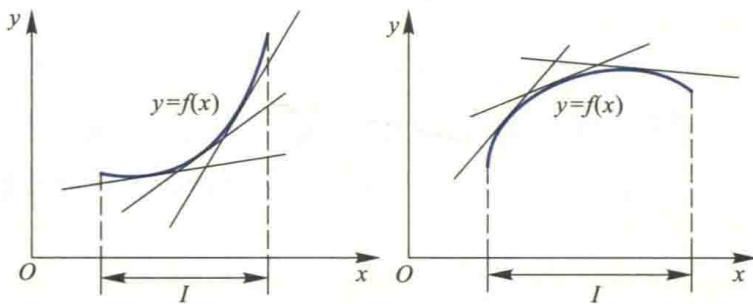  

图2.18

利用这一特性及函数导数的性质,我们可以得到函数图像凹凸性的下述判别法:
</Note>

<Knowledge title="定理 6.5">
设函数 $f(x)$ 在区间 I 中二阶可导, 则

(1) 若在 I 内恒有 $f''(x)>0$ ，则 $f(x)$ 的图像在 I 中是凹的；

(2) 若在 I 内恒有 $f''(x)<0$ ，则 $f(x)$ 的图像在 I 中是凸的.

<Solution title="证明">
设 $x_{0}$ 是 I 中的任意一点, 则曲线 $y=f(x)$ 过点 $(x_{0}, f(x_{0}))$ 的切线方程为

$$

Y = f \left(x _ {0}\right) + f ^ {\prime} \left(x _ {0}\right) \left(x - x _ {0}\right).

$$

从而可知曲线 $y=f(x)$ 在 I 中任一点 x 处的纵坐标 $f(x)$ 与上述切线在相应点处纵坐标之差

$$

f (x) - Y = f (x) - \left[ f \left(x _ {0}\right) + f ^ {\prime} \left(x _ {0}\right) \left(x - x _ {0}\right) \right]

$$

$$

= (f (x) - f \left(x _ {0}\right)) - f ^ {\prime} \left(x _ {0}\right) \left(x - x _ {0}\right).

$$

两次应用 Lagrange 定理, 得

$$

f (x) - Y = \left[ f ^ {\prime} \left(c _ {1}\right) - f ^ {\prime} \left(x _ {0}\right) \right] \left(x - x _ {0}\right) = f ^ {\prime \prime} (c) \left(c _ {1} - x _ {0}\right) \left(x - x _ {0}\right).\tag{6.5}

$$

其中 $c_{1}$ 位于 $x_{0}$ 与 x 之间, c 位于 $c_{1}$ 与 $x_{0}$ 之间, 故 c 位于区间 I 内.

当 $x > x_0$ 时， $c_1 \in (x_0, x)$ ，于是 $(c_1 - x_0)(x - x_0) > 0$ ；

当 $x < x_0$ 时， $c_1 \in (x, x_0)$ ，于是仍有 $(c_1 - x_0)(x - x_0) > 0$ .

因此,由(6.5)式可知,当 $f''(x)>0(<0)$ 时有 $f(x)-Y>0(<0)$ ,从而切线在曲线 $y=f(x)$ 的下(上)方,因而 $y=f(x)$ 在区间I中是凹(凸)的.
</Solution>
</Knowledge>

<Example title="例 6.9">
研究下列函数图像的凹凸性：

(1) $f(x)=x^{\alpha}$ (x>0, $\alpha>1$ ); (2) $f(x)=\ln x$ (x>0).

<Solution title="解">
（1）由于当 $x \in (0, +\infty)$ 时

$$

f ^ {\prime \prime} (x) = \alpha (\alpha - 1) x ^ {\alpha - 2} > 0,

$$

所以幂函数 $f(x)=x^{\alpha}(\alpha>1)$ 的图像在 $(0,+\infty)$ 内是凹的.

(2) 由于当 $x \in (0, +\infty)$ 时

$$

f ^ {\prime \prime} (x) = - \frac {1}{x ^ {2}} <   0,

$$

故对数函数 $f(x)=\ln x$ 在 $(0,+\infty)$ 内是凸的.

连续曲线上凹的图像段与凸的图像段的转变点称为此曲线的拐点,例如图2.19中的点 $P_{1}(x_{1},f(x_{1}))$ 与点 $P_{2}(x_{2},f(x_{2}))$ 都是此曲线 $y=f(x)$ 的拐点.

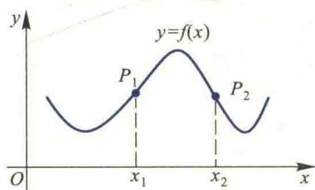  

图2.19
</Solution>
</Example>

<Note>
曲线的拐点, 是该曲线上一点, 它的坐标是用平面有序数组 $(x, f(x))$ 来表示的, 与极值点的坐标仅用一个数来表示不同.

容易看出,对二阶导数连续的函数 $f(x)$ 来说,曲线 $y=f(x)$ 在拐点 $P_{1}(x_{1},f(x_{1}))$ 处必有 $f''(x_{1})=0^{①}$ ,因为若 $f''(x_{1})\neq0$ ,例如 $f''(x_{1})>0$ ,则由 $f''(x)$ 的连续性可知存在 $U(x_{1})$ 使 $\forall x\in U(x_{1})$ 有 $f''(x)>0$ ,从而点 $x_{1}$ 位于函数 $y=f(x)$ 图像凹的区间内,所以 $P_{1}(x_{1},f(x_{1}))$ 点便不是拐点了.
</Note>

<Note>
$f''(x_1) = 0$ 只是曲线 $y = f(x)$ 在点 $P_1(x_1, f(x_1))$ 处取得拐点的必要条件, 并不是充分条件, 例如 $y = x^4$ , 与 $y = x^3$ 都有 $y''|_{x=0} = 0$ , 但显然 $O(0,0)$ 仅仅是 $y = x^3$ 的拐点.

还应指出,正像极值点一样,一般来说拐点除了在使二阶导数为零的点中寻求外,还有可能在使二阶导数不存在的点中出现,读者可自行举出例子.

对于可导函数f来说，由于拐点 $(x_{0},f(x_{0}))$ 的横坐标 $x_{0}$ 就是导函数 $f'(x)$ 单调增、减区间的分界点，所以 $x_{0}$ 也就是导函数 $f'(x)$ 的极值点.

利用曲线的凹凸性也可以证明一些不等式.
</Note>

<Example title="例 6.10">
设 $x_{1}$ 与 $x_{2}$ 为任意两个实数，且 $x_{1} \neq x_{2}$ ，证明不等式 $\mathrm{e}^{\frac{x_{1} + x_{2}}{2}} < \frac{1}{2} (\mathrm{e}^{x_{1}} + \mathrm{e}^{x_{2}})$ .

<Solution title="证明">
设 $f(x) = \mathrm{e}^{x}$ ，则欲证的不等式为 $f\left(\frac{x_1 + x_2}{2}\right) < \frac{1}{2}[f(x_1) + f(x_2)]$ . 由定义6.1的边框中的“注意”知，只要证明 $f(x)$ 的图像在整个实数轴上是凹的即可.

二维码 2.6.3

利用导数证明

不等式的常用

方法.

由于当 $x \in R$ 时 $f''(x) = e^{x} > 0$ ，故 $f(x)$ 的图像在整个实数轴上是凹的，所以有

$$

\mathrm{e} ^ {\frac {x _ {1} + x _ {2}}{2}} <   \frac {1}{2} (\mathrm{e} ^ {x _ {1}} + \mathrm{e} ^ {x _ {2}}). \quad I

$$
</Solution>
</Example>

<Example title="例 6.11">
研究例 6.4 中函数 $f(x)=\sqrt[3]{6x^{2}-x^{3}}$ 图像的凹凸性, 并作出该函数的草图.

<Solution title="解">
易见,该函数的定义区间为 $(-∞,+∞)$ .又

$$

f ^ {\prime \prime} (x) = - \frac {8}{x ^ {4 / 3} (6 - x) ^ {5 / 3}},

$$

$$

f ^ {\prime \prime} (x) = \infty

$$

$$

x \in (- \infty , 0) \cup

$$

(0,6)时, $f''(x)<0$ ;当 $x\in(6,+\infty)$ 时, $f''(x)>0$ .由注意:点(0,0)不是该曲线的拐点.此,可将该曲线 $y=\sqrt[3]{6x^{2}-x^{3}}$ 的凹凸性与拐点列表如下:

&lt;table>&lt;tr>&lt;td>x&lt;/td>&lt;td>(-∞,0)&lt;/td>&lt;td>0&lt;/td>&lt;td>(0,4)&lt;/td>&lt;td>4&lt;/td>&lt;td>(4,6)&lt;/td>&lt;td>6&lt;/td>&lt;td>(6,+∞)&lt;/td>&lt;/tr>&lt;tr>&lt;td>f&#x27;&#x27;(x)&lt;/td>&lt;td>-&lt;/td>&lt;td>∞&lt;/td>&lt;td>-&lt;/td>&lt;td>-&lt;/td>&lt;td>-&lt;/td>&lt;td>∞&lt;/td>&lt;td>+&lt;/td>&lt;/tr>&lt;tr>&lt;td>f(x)&lt;/td>&lt;td>凸&lt;/td>&lt;td>&lt;/td>&lt;td>凸&lt;/td>&lt;td>凸&lt;/td>&lt;td>凸&lt;/td>&lt;td>拐点(6,0)&lt;/td>&lt;td>凹&lt;/td>&lt;/tr>&lt;/table>

在例 6.4 中我们已经知道了函数 $f(x)=\sqrt[3]{6x^{2}-x^{3}}$ 的单调区间和极值。又因为 $f'(6)=\infty$ ，所以对应的曲线 $y=\sqrt[3]{6x^{2}-x^{3}}$ 在点 $(6,0)$ 处有一条平行于 y 轴的切线。再利用习题 1.4(B) 中的第 1 题，还可以求出该曲线的一条斜渐近线 $y=kx+b$ 。事实上，由于

$$

k = \lim _ {x \to \infty} \frac {f (x)}{x} = \lim _ {x \to \infty} \sqrt [ 3 ]{\frac {6}{x} - 1} = - 1,

$$

$$

\begin{array}{r l}b&= \lim _ {x \rightarrow \infty} [ f (x) - k x ] = \lim _ {x \rightarrow \infty} \left(\sqrt [ 3 ]{6 x ^ {2} - x ^ {3}} + x\right)\\&= \lim _ {x \rightarrow \infty} \frac {6 x ^ {2}}{\sqrt [ 3 ]{(6 x ^ {2} - x ^ {3}) ^ {2}} - x (\sqrt [ 3 ]{6 x ^ {2} - x ^ {3}}) + x ^ {2}}\\&= \lim _ {x \rightarrow \infty} \frac {6}{\sqrt [ 3 ]{\left(\frac {6}{x} - 1\right) ^ {2}} - \sqrt [ 3 ]{\frac {6}{x} - 1 + 1}} = 2,\end{array}

$$

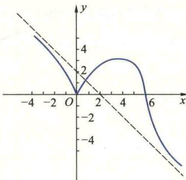

所以 $y = -x + 2$ 就是它的斜渐近线. 根据上述讨论, 可画出该曲线的草图(图 2.20).

图2.20
</Solution>
</Example>

<Block title="习题2.6">
(A)

1. 单调可微函数的导函数仍为单调可微函数, 对吗?

2. 证明定理6.1(2).

3. 求下列函数的单调区间：

(1) $y=2x+\frac{8}{x}(x>0)$ ;

(2) $y=2x^{2}-\ln x;$ (3) $y=\frac{10}{4x^{3}-9x^{2}+6x};$ (4) $y=x+\left|\sin 2x\right|$ .

4. 证明下列不等式：

(1) $\arctan x \leqslant x \quad (x \geqslant 0)$ ;

(2) $\ln(1+x) \geqslant \frac{\arctan x}{1+x} \quad (x \geqslant 0)$ ;

(3) $\frac{2}{\pi}x<\sin x<x\left(0<x<\frac{\pi}{2}\right)$ ; (4) $e^{-x^{2}}<\frac{1}{1+x^{2}}\quad(x\neq0)$ .

5. 证明定理6.2的(2)与(3).

6. 如果函数 $y=f(x)$ 在 $x_{0}$ 处取得极值, 是否一定有 $f'(x_{0})=0$ ?

7. 求下列函数的极值：

(1) $f(x)=2x^{3}-3x^{2}-12x+21$ ;

(2) $f(x)=\frac{x}{1+x^{2}}$ ;

(3) $f(x)=\frac{1}{2}x^{2}e^{-x}$ ;

(4) $f(x)=|x+1|$ ;

(5) $f(x)=\left(1+x+\cdots+\frac{x^{n}}{n!}\right)e^{-x}$ ;

(6) $f(x)=|x|e^{-|x-1|}$ .

8. 试问 $a$ 为何值时, 函数 $f(x) = a \sin x + \frac{1}{3} \sin 3x$ 在 $x = \frac{\pi}{3}$ 处取得极值? 是极大值还是极小值? 并求出此极值.

9. 求下列函数的单调区间与极值：

(1) $f(x)=x-\ln(1+x^{2})$ ; (2) $f(x)=x^{\frac{2}{3}}-\sqrt[3]{x^{2}-1}$ ;

(3) $f(x)=\frac{(x+1)^{\frac{2}{3}}}{x-1}$ ; (4) $f(x)=\left\{\begin{aligned}&x^{3},&x\geqslant0,\\ &\cos x-1,&-\pi\leqslant x<0,\\ &-(x+2+\pi),&x<-\pi.\end{aligned}\right.$

10. 设 $3a^{2}-5b<0$ ，试证方程 $x^{5}+2ax^{3}+3bx+4c=0$ 有唯一实根.

11. 设常数 $k > 0$ ，试确定 $f(x) = \ln x - \frac{x}{\mathrm{e}} + k$ 在 $(0, +\infty)$ 内零点的个数.

12. 求下列函数在给定区间上的最大值和最小值：

(1) $f(x)=\frac{x-1}{x+1}, x\in[0,4]$ ; (2) $f(x)=\sin^{3}x+\cos^{3}x,\quad x\in\left[\frac{\pi}{6},\frac{3\pi}{4}\right]$ ;

(3) $f(x)=x+\sqrt{1-x},\quad x\in[-5,1]$ ; (4) $f(x)=\max\left\{x^{2},(1-x)^{2}\right\},x\in[0,1]$ .

13. 证明下列不等式：

(1) $e^{x} \leqslant \frac{1}{1-x}, x \in (-\infty, 1)$ ; (2) $|3x - x^{3}| \leqslant 2, x \in [-2, 2]$ ;

$$

x ^ {x} \geqslant \mathrm{e} ^ {- \frac {1}{\mathrm{e}}}, x \in (0, + \infty)

$$

14. 某铁路隧道的截面拟建成矩形加半圆的形状如图, 截面积为 $a \, m^{2}$ , 问底宽 x 为多少时, 才能使建造时所用的材料最省?

15. 甲乙两用户共用一台变压器(见图),问变压器设在输电干线何处时,所需输电线最短?

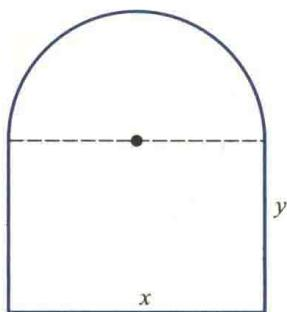  

(第 14 题图)

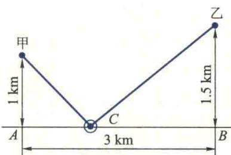  

(第 15 题图)

16. 在 A, B 两城市间铺设铁路, 如果两城市间为两种地质区, 分界线为直线(见图). 在区域 I 内铁路造价为 $C_{1}$ 元/km, 在区域 II 内的造价为 $C_{2}$ 元/km. A, B 与直线的垂直距离分别为 $b_{1}$ km 与 $b_{2}$ km, A, B 间的水平距离为 a km, 问点 P 选在何处造价最低?

17. 设某银行中的总存款量与银行付给存户利率的平方成正比, 若银行以 20% 的年利率把总存款的 90% 贷出, 问它给存户支付的年利率定为多少时才能获得最大利润?

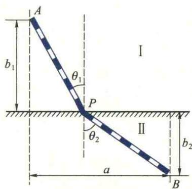  

(第 16 题图)

18. 已知轮船的燃料费与速度的立方成正比, 当速度为 $10 \, km/h$ , 每小时的燃料费为 80 元, 又其他费用每小时需 480 元. 问轮船的速度多大时, 才能使 20 km 航程的总费用最少? 此时每小时的总费用等于多少?

19. 曲线 $y=4-x^{2}$ 与 $y=2x+1$ 相交于 A、B 两点，C 为弧段 AB 上的一点。问点 C 在何处时 $\triangle ABC$ 的面积最大？并求此最大面积。

20. 用仪器测量某零件的长度 n 次, 得到 n 个略有差别的数: $a_{1}, a_{2}, \cdots, a_{n}$ . 证明: 用算术平均值

$$

\bar {x} = \frac {1}{n} \sum_ {i = 1} ^ {n} a _ {i}

$$

作为该零件的长度 x 的近似值, 能使

$$

f (x) = \left(x - a _ {1}\right) ^ {2} + \left(x - a _ {2}\right) ^ {2} + \dots + \left(x - a _ {n}\right) ^ {2}

$$

达到最小.

21. 证明函数 $f(x) = x \arctan x$ 的图像在 $-\infty < x < +\infty$ 上都是凹的.

22. 讨论下列函数图像的凹凸性与相应曲线的拐点：

(1) $f(x)=x^{3}(1-x)$ ; (2) $f(x)=x+\sin x$ ;

(3) $f(x)=\frac{x}{1+x^{2}}$ ; (4) $f(x)=\ln(1+x^{2})$ .

23. 证明下列不等式：

(1) $\frac{1}{2}(a^{n}+b^{n})>\left(\frac{a+b}{2}\right)^{n}(a,b>0,a\neq b,n>1)$ ;

(2) $x \ln x + y \ln y > (x + y) \ln \frac{x + y}{2} (x, y > 0, x \neq y)$ .

24. 求下列函数图形的渐近线：

(1) $y=\frac{(x-1)^{3}}{(x+1)^{2}}$ ;

(2) $y=\frac{4(x+1)}{x^{2}}-2.$

25. 图中三条曲线分别表示函数 $f(x)$ , $f'(x)$ , $f''(x)$ 所对应的曲线, 试确定 $f(x)$ , $f'(x)$ , $f''(x)$ 分别在图中对应哪条曲线.

26. 讨论下列函数的各种性态(包括单调性、极值、凹凸性、拐点与渐近线等),并画出它们的草图:

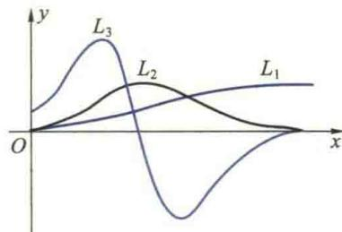

(1) $f(x)=\mathrm{e}^{-x^{2}}$ ; (2) $f(x)=\frac{2x-1}{(x-1)^{2}}$

(第 25 题图)

(B)

1. 证明定理6.4.

2. 证明下列不等式：

(1) $1+\frac{1}{2}x>\sqrt{1+x}$ (x>0); (2) $1+x\ln(x+\sqrt{1+x^{2}})>\sqrt{1+x^{2}}$ (x>0);

(3) $\sin x+\tan x>2x\left(0<x<\frac{\pi}{2}\right)$ ; (4) $\frac{|a+b|}{\pi+|a+b|}\leqslant\frac{|a|}{\pi+|a|}+\frac{|b|}{\pi+|b|}$ ( $a,b\in R$ ).

3. 证明: 方程 $\sin x = x$ 只有一个实根.

4. 设 $0 \leqslant x_{1} < x_{2} < x_{3} \leqslant \pi$ ，证明：

$$

\frac {\sin x _ {2} - \sin x _ {1}}{x _ {2} - x _ {1}} > \frac {\sin x _ {3} - \sin x _ {2}}{x _ {3} - x _ {2}}.

$$

5. 设 $f(x) = (x - x_0)^n g(x), n \in \mathbb{N}_+$ , $g(x)$ 在 $x_0$ 处连续，且 $g(x_0) \neq 0$ . 问 $f(x)$ 在 $x_0$ 处有无极值？6. 求半径为 $R$ 的球的外切直圆锥的最小体积.

7. 求常数 $k$ 的取值范围, 使当 $x > 0$ 时, 方程 $kx + \frac{1}{x^2} = 1$ 有且仅有一个根.

8. 设某产品的成本函数为 $C = a q^{2} + b q + c$ ，需求函数为 $q = \frac{1}{e}(d - p)$ ，其中 C 为成本，q 为需求量（即产量），p 为单价；a, b, c, d, e 都是正的常数，且 d > b。求使利润最大的产量及最大的利润。

9. 一平底从动杆圆弧凸轮机构如图, 当偏心轮以角速度 $\omega$ 绕 O 旋转时, 从动杆上升的距离为 $h = e(1 - \cos \theta)$ , 其中 e 为偏心距, 转角 $\theta = \omega t$ . 试求:

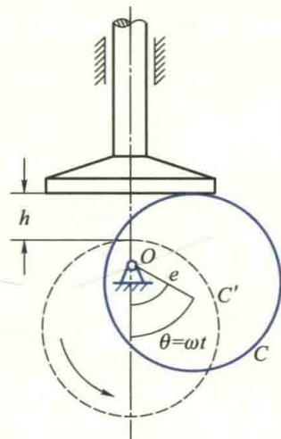

(1) $h(\theta)$ 的最大值和最小值；

(2) 转角 $\theta$ 为多少时,从动杆速度最大或最小?

(3) $\theta$ 为多少时,从动杆加速度最大或最小?

10. 有人说“若 $f'(x_0) > 0$ ，则存在 $x_0$ 的某邻域，在此邻域内

(第9题图)

$f(x)$ 单调增”. 这种说法正确吗? 如果正确, 请给出证明; 如果不正确, 请举例说明并给出正确结论.
</Block>
