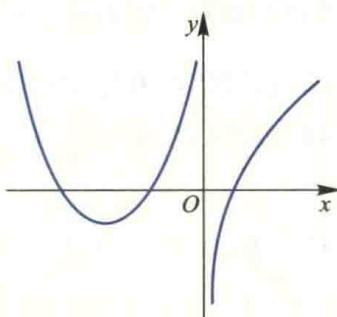

import Guide from '@/components/Guide.astro';
import Knowledge from '@/components/Knowledge.astro';
import Example from '@/components/Example.astro';
import Analysis from '@/components/Analysis.astro';
import Solution from '@/components/Solution.astro';
import Variant from '@/components/Variant.astro';
import Note from '@/components/Note.astro';
import Block from '@/components/Block.astro';
import Method from '@/components/Method.astro';

<Block title="第2章习题">
1. 选择题(在每小题给出的四个选项中只有一个是正确的,试选择正确的选项并说明理由.)

(1) 设 $f(x)=\left\{\begin{aligned}&\frac{1-\cos x}{\sqrt{x}},&x>0,\\ &x^{2}g(x),&x\leqslant0,\end{aligned}\right.$ 其中 $g(x)$ 是有界函数，则 $f(x)$ 在 x=0 处（）.

(A) 极限不存在 (B) 极限存在但不连续  

(C) 连续但不可导 (D) 可导

(2) 设 $f(x)$ 可导, $F(x)=f(x)(1+\left|\sin x\right|)$ . 若使 $F(x)$ 在 x=0 处可导, 则必有 ( ).  

(A) $f(0)=0$ (B) $f'(0)=0$ (C) $f(0)+f'(0)=0$ (D) $f(0)-f'(0)=0$

（3）设函数 $f(x)$ 在区间 $(- \delta, \delta)$ 内有定义. 若当 $x \in (-\delta, \delta)$ 时，恒有 $|f(x)| \leqslant x^2$ ，则 $x = 0$ 必是 $f(x)$ 的（ ）.

(A) 间断点 (B) 连续而不可导的点

(C) 可导的点, 且 $f'(0)=0$ (D) 可导的点, 且 $f'(0)\neq0$

(4) 设 $F(x)=\left\{\begin{aligned}&\frac{f(x)}{x},&x\neq0,\\ &0,&x=0,\end{aligned}\right.$ 其中 $f(x)$ 在 x=0 处可导， $f'(0)\neq0,f(0)=0$ ，则 x=0 是 $F(x)$ 的（）.

(A) 连续点 (B) 第一类间断点

(C) 第二类间断点 (D) 连续点或间断点不能确定

(5) 设 $f(x)$ 在 $(-∞,+∞)$ 内可导，且对任意的 $x_{1}, x_{2}$ ，当 $x_{1}>x_{2}$ 时，都有 $f(x_{1})>f(x_{2})$ ，则（）.

(A) 对任意 $x, f'(x) > 0$ (B) 对任意 $x, f'(-x) \leqslant 0$ (C) 对任意的 $x, f'(x) \geqslant 0$ (D) 对任意的 $x, f'(-x) < 0$

(6) 已知 $f(x)$ 在 x=0 某个邻域内连续，且 $f(0)=0, \lim_{x\to0}\frac{f(x)}{1-\cos x}=2$ ，则在点 x=0 处 $f(x)$ ().

(A) 不可导

(B) 可导且 $f'(0) \neq 0$ (C) 取得极大值

(D) 取得极小值

(7) 设 $f(x)$ 有二阶连续导数，且 $f'(0)=0, \lim_{x\to0}\frac{f''(x)}{|x|}=1$ ，则（）.

(A) $f(0)$ 是 $f(x)$ 的极大值

(B) $f(0)$ 是 $f(x)$ 的极小值

(C) $(0, f(0))$ 是曲线 $y = f(x)$ 的拐点

(D) $f(0)$ 不是 $f(x)$ 的极值， $(0, f(0))$ 也不是曲线 $y = f(x)$ 的拐点

（8）设函数 $f(x)$ 在 $(-∞,+∞)$ 内连续，其导函数的图形如图所示，则 $f(x)$ 有（ ）.

(A) 一个极小值点和两个极大值点

(B) 两个极小值点和一个极大值点

(第1(8)题图)

(C) 两个极小值点和两个极大值点

(D) 三个极小值点和一个极大值点

(9) 曲线 $y=(x-1)(x-2)^{2}(x-3)^{3}(x-4)^{4}$ 的拐点是( ). (A) (1,0) (B) (2,0) (C) (3,0) (D) (4,0)

（10）设函数 $f(x)$ 具有二阶连续导数，且 $f(x)>0, f'(0)=0$ ，则函数 $z=f(x)\ln f(y)$ 在点 $(0,0)$ 处取得极小值的一个充分条件是（ ）.

(A) $f(0)>1, f''(0)>0$ (B) $f(0)>1, f''(0)<0$ (C) $f(0)<1, f''(0)>0$ (D) $f(0)<1, f''(0)<0$

2. 设 $f(x)$ 二阶可导，且 $f(x) \neq 0, \varphi(x) = \lim_{t \to 0} \left[ \frac{f(x + t)}{f(x)} \right]^{\frac{x}{\sin t}}$ ，求 $\varphi'(x)$ .  

3. 设 $y = \sin^4 x + \cos^4 x$ ，求 $y^{(n)}$ .

4. 设 $y=f(x+y)$ ，其中 f 具有二阶导数，且其一阶导数不等于 1，求 $\frac{d^{2}y}{dx^{2}}$ .

5. 设 $f(x) = 3x^{2} + Ax^{-3}$ ，其中 $A > 0, x > 0$ . 试问 $A$ 至少应取何值时，才能使对一切的 $x > 0$ ，都有 $f(x) \geqslant 20$ .

6. 设函数 $y=y(x)$ 由参数方程 $\left\{\begin{aligned}x=t^{3}+3t+1,\\ y=t^{3}-3t+1\end{aligned}\right.$ 所确定，试求使函数 $y=y(x)$ 为凹函数的区间.

7. 试证方程 $2^{x} - x^{2} = 1$ 有且仅有三个实根.

8. 试确定方程 $x\mathrm{e}^{-x} = a (a > 0)$ 的实根个数.

9. 试证下列不等式：

(1) $(x^{2}-1)\ln x\geqslant(x-1)^{2}$ （其中x>0）;

(2) $\ln\frac{b}{a}>\frac{2(b-a)}{a+b}$ （其中b>a>0）.

10. 由 Lagrange 中值定理知, $e^{x}-1=xe^{\theta x}(0<\theta<1)$ ,证明 $\lim_{x\to0}\theta=\frac{1}{2}$ .

11. 求下列极限：

(1) $\lim_{x\to 0}\frac{\sqrt{1 + \tan x} - \sqrt{1 + \sin x}}{x\ln(1 + x) - x^2};$ (2) $\lim_{x\to 0}\frac{\sqrt{1 + x} + \sqrt{1 - x} - 2}{x^2};$

(3) 若 $\lim_{x\to0}\frac{\sin6x+xf(x)}{x^{3}}=0$ , 试求极限 $\lim_{x\to0}\frac{6+f(x)}{x^{2}}$ ;

(4) 设函数 $y=f(x)$ 由方程 $y-x=e^{x(1-y)}$ 确定，求 $\lim_{n\to\infty}n\left[f\left(\frac{1}{n}\right)-1\right]$

12. 已知当 $x \to 0$ 时, $e^{x} - 1 - \sin x$ 与 $ax^{n}$ 为等价无穷小, 试确定常数 a 和 n 的值.

13. 设 $f(x)$ 在 $[a, b]$ 上连续，在 $(a, b)$ 内可导，且 $f(a) = f(b) = 1$ ，试证存在 $\xi, \eta \in (a, b)$ ，使

$$

\mathrm{e} ^ {\eta - \xi} [ f (\eta) + f ^ {\prime} (\eta) ] = 1.

$$

14. 设 $f(x)$ 在 $[0,1]$ 上有二阶连续导数，且 $f(0)=f(1)=0,\min_{0\leqslant x\leqslant1}f(x)=-1$ ，证明 $\max_{0\leqslant x\leqslant1}f''(x)\geqslant8.$

15. 设 $f(x)$ 在 $[0,3]$ 上连续，在 $(0,3)$ 内可导， $f(0) + 2f(1) + 3f(2) = 6, f(3) = 1$ ，试证必存在 $\xi \in (0,3)$ ，使 $f'(\xi) = 0$ .

16. 设 $f(x)$ 在 $[0, +\infty)$ 上可微， $f(0) = 0$ ， $|f'(x)| \leqslant |f(x)|$ ，试证明：在 $[0, +\infty)$ 上 $f(x) \equiv 0$ .

17. 设奇函数 $f(x)$ 在 $[-1, 1]$ 上具有2阶导数，且 $f(1) = 1$ . 证明：

(1) 存在 $\xi \in (0,1)$ ，使得 $f'(\xi) = 1$ ;

(2) 存在 $\eta \in (-1,1)$ ，使得 $f''(\eta) + f'(\eta) = 1$ .

## 综合练习题

最优生产周期问题.

设某工厂既是生产型的又是销售型的,它的任务是把进来的原料加工成产品,再销售出去.为保证生产就必须库存一定数量的原料,为保证销售就必须库存一定数量的产品.设该厂生产线运转时产品的生产速率为 $K$ （常数），产品销售速率为 $r(r < K)$ .每开动一次生产线的成本为 $C$ ，每件产品单位时间的储存费为 $S_{1}$ ，生产一件产品所需原料单位时间的储存费为 $S_{2}$ .工厂的一个生产周期是指从开始生产起到所生产的产品全部销售完所需要的时间.试分别就下列情形讨论如何确定一个最优的生产周期 $T$ ，使得在单位时间内生产的总费用 $W$ 最少

（1）仓库只存放产品不存放原料，在这种情况下，开始一段时间内工厂边生产边销售，到某时刻 t 只销售不生产，直至库存量 Q 减少为零；

(2) 仓库既存放产品, 又存放原料, 并且一个周期生产所需的原料在开始生产时就一次备足;

（3）仓库既存放产品，又存放原料，并且开始生产时就一次备足 $p$ 个周期生产所需的原料.
</Block>
