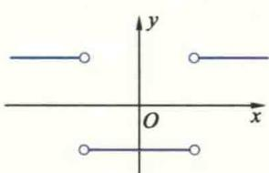
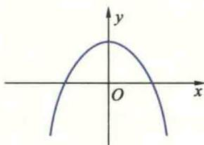
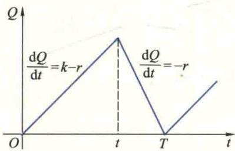
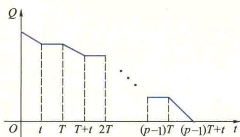

import Guide from '@/components/Guide.astro';
import Knowledge from '@/components/Knowledge.astro';
import Example from '@/components/Example.astro';
import Analysis from '@/components/Analysis.astro';
import Solution from '@/components/Solution.astro';
import Variant from '@/components/Variant.astro';
import Note from '@/components/Note.astro';
import Block from '@/components/Block.astro';
import Method from '@/components/Method.astro';
import Exercise from '@/components/Exercise.astro';

<Block title="习题2.1 答案">
**（A）**

1. (1) $f'(x) = -\sin x$ ; (2) $f'(x) = \frac{1}{x}$ ; (3) $f'(0) = 0$ ; (4) $f'(0) = 0$ .

2. (1) $-f'(x_0)$ ; (2) $2f'(x_0)$ ; (3) $f'(x_0)$ ; (4) $x_0f'(x_0) - f(x_0)$ .

3. (1) $f'(x) = -\frac{2}{3} x^{-\frac{5}{3}}$ , $f'(x_0) = -\frac{1}{48}$ ; (2) $f'(x) = 8^x \ln 8$ , $f'(x_0) = \ln 8$ ; (3) $f'(x) = \frac{1}{x \ln 3}$ , $f'(x_0) = \frac{1}{\ln 3}$ ; (4) $f'(x) = 0$ , $f'(x_0) = 0$ ; (5) $f'(x) = 10e^{10x}$ , $f'(x_0) = 10$ .

4.（1）切线方程为 $y - \frac{\sqrt{3}}{2} = -\frac{1}{2}\left(x - \frac{\pi}{6}\right)$ ，法线方程为 $y - \frac{\sqrt{3}}{2} = 2\left(x - \frac{\pi}{6}\right)$ ；

(2) 切线方程为 $y-1=\frac{1}{e}(x-e)$ ，法线方程为 $y-1=e(e-x)$ .

5. 所求点为(4,8).

6.

  
(a)

  
(b)

7. 提示：利用导数定义.

8. 对 $g(x)=\left|x-a\right|\varphi(x)$ ，当 $\varphi(a)=0$ 时， $g(x)$ 在 x=a 处可导；当 $\varphi(a)\neq0$ 时， $g(x)$ 在 x=a 处不可导.

9. 左(右)可导 $\overrightarrow{+}$ 左(右)连续.

10. $f^{\prime}(x) = \left\{ \begin{array}{ll}\cos x, & x <   0\\ 1, & x\geqslant 0. \end{array} \right.$

11. $a = 2, b = -1$ . 12. $f_{+}^{\prime}(0) = 0, f_{-}^{\prime}(0) = -1, f^{\prime}(0)$ 不存在.

13. $\theta^{\prime}(t_0)$ . 14. $f^{\prime}(t_0)$ . 15. $N^{\prime}(x_0)$ . 17. 不对. 18. 1.

**（B）**

1. 提示： $f(0)=0$ 。
2. 提示：利用导数定义。
3. $e^{\frac{f'(a)}{f(a)}}$ 4. $\sqrt{2}$ .

5. 当 $n \geqslant 1$ 时， $f(x)$ 在 x = 0 处连续；当 $n \geqslant 2$ 时， $f(x)$ 在 x = 0 处可导；当 $n \geqslant 3$ 时， $f'(x)$ 在 x = 0 处连续.

6. 提示：不妨设 $f_{+}^{\prime}(a) > 0, f_{-}^{\prime}(b) > 0$ . 由 $f(a) = 0$ 和 $f_{+}^{\prime}(a) > 0$ 知，存在 $x_{1} \in (a, a + \delta)$ ，使 $f(x_{1}) > 0$ ，同理存在 $x_{2} \in (b - \delta, b)$ ，使 $f(x_{2}) < 0$ ，再用连续函数介值定理即可证明.

## 习题2.2

**（A）**

1. (1) $\frac{2}{3} \frac{1}{\sqrt[3]{x^2}} + \frac{5}{6} \frac{1}{\sqrt[6]{x}}$ ;

(2) $3\mathrm{e}^{x}(\cos x - \sin x)$ ;

(3) $a^x [x^2\ln a + (2 - 3\ln a)x + \ln a - 3]$ ;

(4) $\sec^3 x + \tan^2 x \sec x$ ;

(5) $-\frac{2x+1}{(1+x+x^{2})^{2}};$

(6) $\frac{1+\sin t+\cos t}{(1+\cos t)^{2}};$

(7) $\frac{210^{x}\ln10}{(10^{x}+1)^{2}};$

(8) $\frac{-2\csc x[2x+(1+x^{2})\cot x]}{(1+x^{2})^{2}};$

(9) $\frac{1+2\sqrt{x}+4\sqrt{x}\sqrt{x+\sqrt{x}}}{8\sqrt{x}\sqrt{x+\sqrt{x}}\sqrt{x+\sqrt{x+\sqrt{x}}}}$ ;

(10) $\frac{-\csc^2x\cdot\sqrt[3]{x^2}-\frac{2}{3}x^{-\frac{1}{3}}(1+\cot x)}{\sqrt[3]{x^4}}+\frac{1}{2x};$

(11) -4csc 2xcot 2x;

(12) $\frac{-3\left[(e^x\sec x + e^x\sec x\tan x)x^2\log_a x - \left(2x\log_a x + \frac{x}{\ln a}\right)(e^x\sec x + 1)\right]}{x^4\log_a^2x};$

(13) $2xe^{x}\sin x+x^{2}e^{x}(\sin x+\cos x)$ ;

(14) $\frac{\left(\frac{2}{x} + \frac{1}{2\sqrt{x}}\right)(3\ln x + \sqrt[3]{x}) - \left(\frac{3}{x} + \frac{1}{3\sqrt[3]{x^2}}\right)(2\ln x + \sqrt{x})}{(3\ln x + \sqrt[3]{x})^2}$ .

2. (1) $4 - \frac{\sqrt{2}}{2}$ ; (2) $0$ ; (3) $-1$ ; (4) $\frac{\sqrt{2}}{4} \left(1 + \frac{\pi}{2}\right)$ .

3. (1) $10(2x + 3)^{4}$ ;

$$
\mathrm{e} ^ {\alpha x} [ \alpha \sin (\omega x + \beta) + \omega \cos (\omega x + \beta) ]
$$

(3) $\frac{2x - \sin x}{x^2 + \cos x}$ ; (4) $\frac{-2}{3(x^2 - 1)}\sqrt[3]{\frac{1 + x}{1 - x}}$ ;

(5) $2\arccos \frac{1}{x} \cdot \frac{|x|}{x^2\sqrt{x^2 - 1}};$ (6) $\frac{-4(1 - 2x)}{1 + (1 - 2x)^4};$

(7) $-\frac{1}{x\sqrt{x^{2}-1}};$

(8) $\csc x$ ;

(9) $\frac{-1}{(x + 1)^2}\sqrt{\frac{1 + x}{2x}}\sqrt{\frac{1 + x}{1 - x}};$

(10) $\mathrm{e}^{\sin \frac{1}{x}}\left(\frac{1}{3} x^{-\frac{2}{3}} - x^{-\frac{5}{3}}\cos \frac{1}{x}\right)$ ;

(11) $\frac{1}{2}\left[\frac{1}{x} +\cot x + \frac{\mathrm{e}^x}{2(\mathrm{e}^x - 1)}\right];$

(12) $\frac{1-\sqrt{1-x^{2}}}{x^{2}\sqrt{1-x^{2}}}$ ;

(13) $a^a x^{a^a - 1} + a^{x^a + 1}x^{a - 1}\ln a + a^{a^x + x}\ln^2 a;$

(14) $1 + x^{x}(1 + \ln x) + x^{x}x^{x^{x}}\left(\frac{1}{x} + \ln x + \ln^{2}x\right)$ ;

(15) $\frac{e^{\sqrt{x}}}{2\sqrt{x}(1+e^{2\sqrt{x}})}$ ;

(16) $\frac{1}{2\sqrt{x}\left(\sqrt{1-x}\right)}e^{\arcsin\sqrt{x}};$

(17) $\frac{x}{(1+x^{2})\ln\sqrt{x^{2}+1}};$

(18) $n(\sin^{n-1} t \cos t \cos nt - \sin^n t \sin nt)$ ;

(19) $\frac{1}{3}\left(\frac{1 - \sin 2x}{1 + \sin 2x}\right)^{-\frac{2}{3}}\cdot \frac{-4\cos 2x}{(1 + \sin 2x)^2};$

(20) $\frac{\sec^2\frac{x}{2}}{4 + \tan^2\frac{x}{2}}.$

4. $\frac{3\pi}{4}$ .

6. (1) $2xf'(x^2)$

(2) $\frac{f(x)f'(x)+g(x)g'(x)}{\sqrt{f^{2}(x)+g^{2}(x)}};$

(3) $[f'(\sin^2 x) - f'(\cos^2 x)]\sin 2x;$

(4) $f'(e^{x})e^{g(x)+x}+f(e^{x})e^{g(x)}g'(x);$

(5) $y' = \begin{cases} -1, & -\infty < x < 1, \\ 2x - 3, & 1 \leqslant x \leqslant 2, \\ 1, & 2 < x < +\infty; \end{cases}$

(6) $y'=\left\{\begin{aligned}&\frac{\mathrm{e}^{\frac{1}{x}}\left(1+\frac{1}{x}\right)+1}{\left(1+\mathrm{e}^{\frac{1}{x}}\right)^{2}},&x\neq0,\\ &不存在,\quad&x=0.\end{aligned}\right.$

7. $a = 3, b = -1, c = 1, d = 3.$

9. (1) $-4\mathrm{e}^{x}\cos x$ ;

(2) $x\mathrm{sh}x + 100\mathrm{ch}x;$

(3) $2^{50}x^{2}\sin \left(2x + 50\cdot \frac{\pi}{2}\right) + 100\cdot 2^{49}x\sin \left(2x + 49\cdot \frac{\pi}{2}\right) + 50\cdot 49\cdot 2^{48}\sin \left(2x + 48\cdot \frac{\pi}{2}\right)$

(4) $(-1)^{n} n! \left[ \frac{1}{(x - 2)^{n + 1}} - \frac{1}{(x - 1)^{n + 1}} \right]$ .

10. $f'(0) = (-1)^n n!$ , $f^{(n+1)}(x) = (n+1)!$ .

11. n=2.

13. $F^{\prime}(x) = \pi [f^{\prime}(x) + xf^{\prime \prime}(x)]$

14. (1) $\frac{x^2 - y}{x - y^2}$ ; (2) $\frac{y(x - 1)}{x(1 - y)}$ ; (3) $\frac{y\sin(xy) - e^{x + y}}{e^{x + y} - x\sin(xy)}$ ; (4) 1; (5) $-\frac{y}{[1 - \cos(x + y)]^3}$ ; (6) $2e^2$ .

15. $y=\frac{x}{1-\varepsilon}.$

16. (1) $\frac{(3 - x)^4\sqrt{x + 2}}{(x + 1)^5}\left[\frac{4}{x - 3} +\frac{1}{2(x + 2)} -\frac{1}{5(x + 1)}\right];$

(2) $\frac{1}{5}\sqrt[5]{\frac{x - 5}{\sqrt[3]{x^2 + 2}}}\left[\frac{1}{x - 5} -\frac{2x}{3(x^2 + 2)}\right];$

(3) $x^{\sin x}\left(\cos x\ln x + \frac{\sin x}{x}\right)$ ;

(4) $(\tan 2x)^{\cot \frac{x}{2}}\left(-\frac{1}{2}\csc^2\frac{x}{2} \cdot \ln \tan 2x + 2\cot \frac{x}{2}\cot 2x\sec^2 2x\right)$ .

18. (1) $-\tan t; (2)\sqrt{3}-2; (3)-2; (4)\frac{4}{9}\mathrm{e}^{3t}; (5)\frac{\left[f'(t)\right]^{2}-f''(t)f(t)}{\left[f'(t)\right]^{3}}+\frac{1}{f'(t)}.$

19. $k = \frac{r'(\theta)\sin\theta + r(\theta)\cos\theta}{r'(\theta)\cos\theta - r(\theta)\sin\theta}, \frac{\sin^2\theta + \cos\theta - \cos^2\theta}{2\sin\theta\cos\theta - \sin\theta}.$

21. $144\pi$ . 22. $-\frac{14}{5}$ . 23. $\frac{1}{4}\sqrt{\frac{V}{\pi k}}\frac{1}{\sqrt[4]{t^{3}}}$ . 24. $(x-3\cos\theta)\frac{\mathrm{d}x}{\mathrm{d}t}+3x\sin\theta\frac{\mathrm{d}\theta}{\mathrm{d}t}=0$ . 25. 0.096.

**（B）**

1. 提示：利用 $f(x)$ 在 $x = 0$ 处导数定义证明.

2. $a = \frac{\varphi''(x_0)}{2}, b = \varphi'(x_0), c = \varphi(x_0)$ .

3. $a = \pm \sqrt{2}, b = 1, f'(x) = \begin{cases} \frac{\sqrt{2}x\sin\sqrt{2}x - 1 + \cos\sqrt{2}x}{x^2}, & x < 0, \\ 1, & x = 0, \\ \frac{2x^2 - (1 + x^2)\ln(1 + x^2)}{x^2(1 + x^2)}, & x > 0. \end{cases}$

4.（1）不成立；（2）不成立；（3）不成立.

5. $n!\left[f(x)\right]^{n+1}.$

6. $a = 2, b = -1, f'(x) = \begin{cases} 2, & x \leqslant 1, \\ 2x, & x > 1. \end{cases}$

7. 当 $n = 2m$ ( $m \in \mathbf{Z}$ ) 时, $f^{(2m)}(0) = 0$ ; 当 $n = 2m + 1$ 时, $f^{(2m + 1)}(0) = (-1)^m (2m)!$ .

8. $S_{n} = \frac{1}{2^{n}}\cot \frac{x}{2^{n}} -\cot x.$ 10. $\frac{2\mathrm{e}^2 - 3\mathrm{e}}{4}.$

## 习题2.3

**（A）**

3. (1) $\mathrm{dy} = (\sin 2x + 2x\cos 2x)\mathrm{dx}$ ; (2) $\mathrm{dy} = \frac{\mathrm{dx}}{(1 + x^2)^{3/2}}$ ;

(3) $\mathrm{dy} = \mathrm{e}^{-x}[\sin (3 - x) - \cos (3 - x)]\mathrm{dx};$ (4) $\mathrm{dy} = \frac{-x}{|x|\sqrt{1 - x^2}}\mathrm{dx};$

(5) $\mathrm{dy} = 8x\tan (1 + 2x^2)\sec^2 (1 + 2x^2)\mathrm{dx};$

(6) $\mathrm{dy} = \frac{-2x}{x^4 + 1}\mathrm{dx};$

(7) $\mathrm{dy} = \sqrt[3]{\frac{1 - x}{1 + x}}\frac{2}{3(x^2 - 1)}\mathrm{dx};$

(8) $dy = x^{\sin x} \left( \cos x \ln x + \frac{\sin x}{x} \right) dx.$

4. (1) $x^{\alpha} + C$ ;

(2) $\cos x + C$ ;

(3) $-\frac{1}{2}\mathrm{e}^{-2x} + C;$ (4) $\frac{1}{3}\tan 3x + C;$

(5) $\left\{\begin{aligned}\frac{1}{a}\arctan\frac{x}{a}+C,&a\neq0,\\-\frac{1}{x}+C,&a=0;\end{aligned}\right.$ (6) $\frac{1}{3}\ln\left|3x+1\right|+C;$

(7) $\frac{1}{2}\mathrm{e}^{x^2} + C;$ (8) $\frac{1}{2}\ln^2 |x| + C.$

5. (1) 0.8747; (2) -0.965; (3) 5.04; (4) 0.5238; (5) 0.01; (6) 0.792899.

6. (2) $\delta \approx 3.125\mathrm{mm}$ ; (3) $H \approx 30\mathrm{mm}$ .

7. 1.118 g. 8. 43.2 s. 9. $\mathrm{dy} = \frac{y - \mathrm{e}^{x + y}}{\mathrm{e}^{x + y} - x}\mathrm{dx}$ . 10. $\mathrm{dy} = \frac{\mathrm{e}^y\cos t}{(1 - \mathrm{e}^y\sin t)(6t + 2)}\mathrm{dx}$ .

11. (1) $\frac{(2 - x^2)\sin x - 2x\cos x}{x^3}\mathrm{d}x^2$ ; (2) $\frac{2}{(x + 2y)^3}\mathrm{d}x^2$ .

**（B）**

1. 不正确.
2. 提示：利用微分定义证明.

## 习题2.4

**（A）**

1. (1) 满足 Rolle 定理条件, $\xi = 0$ ; (2) 不满足 Rolle 定理条件, $\xi$ 不存在; (3) 不满足 Rolle 定理条件, $\xi$ 存在, $\xi = 1$ .

4. 三个实根分别在(1,2)，(2,3)，(3,4)中.

5. 提示：对 $f(x)=a_{0}x+\frac{a_{1}}{2}x^{2}+\cdots+\frac{a_{n}}{n+1}x^{n+1}$ 用 Rolle 定理.

6. 提示: $f(0) = 0$ . 对 $f(x)$ 在 $[0, a]$ 上用 Lagrange 定理.

7. 提示：用 Rolle 定理. 8. 提示： $(f(x)-g(x))'\equiv0$ .

11. 提示：考虑函数 $F(x)=\mathrm{e}^{x}f(x)$ .

15.（1）有错误.原题所给极限不是 $\frac{0}{0}$ 型，也不是 $\frac{\infty}{\infty}$ ，不能用L'Hospital法则.

(2) 有错误.用了 L'Hospital 法则后极限不存在不能推知原式的极限不存在.

(3) 有错误.由原题设知 $f(x)$ 仅在 $x_0$ 点二阶可导.所以, 只能用一次 L'Hospital 法则, 然后用导数定义, 即可得到正确结果.

16. (1) 2; (2) $-\frac{1}{8}$ ; (3) -1; (4) $-\frac{2}{3}$ ; (5) 2; (6) $\frac{1}{3}$ ; (7) 1; (8) $\mathrm{e}^{-1}$ ; (9) $\mathrm{e}^{-\frac{1}{6}}$ ; (10) $\frac{\mathrm{e}}{2}$ ; (11) $\mathrm{e}^{-\frac{1}{2}}$ ; (12) $\sqrt[3]{6}$ .  
17. $\mathrm{e}^{-\frac{1}{2}}$ . 18. $a = -\frac{4}{3}$ , $b = \frac{1}{3}, \frac{8}{3}$ . 19. (1) $a = f'(0)$ .

**（B）**

1. 提示：令 $\varphi(x)=x^{n}f(x)$ .
2. 提示：利用 Cauchy 中值定理.

3. 提示：令 $F(x) = \mathrm{e}^{-\lambda x} f(x)$ . 4. 提示：利用 Lagrange 中值定理.

7. 提示：令 $F(x)=f(x)-(-x^{2}+Bx+C)$ .

8. 提示：先利用 $f_{+}^{\prime}(a)f_{-}^{\prime}(b)>0$ 及连续函数介值定理，证明存在 $c\in(a,b)$ 使 $f(c)=0$ ，再利用 Rolle 定理.

## 习题2.5

**（A）**

1. $-1+5(x-1)+5(x-1)^{2}+2(x-1)^{3}.$

2. (1) $1 + x + x^{2} + \cdots + x^{n} + \frac{(-1)^{n+2}}{(\theta x - 1)^{n+3}}x^{n+1}$ (0 &lt; $\theta < 1$ );

(2) $-\left(x+\frac{x^{2}}{2}+\frac{x^{3}}{3}+\cdots+\frac{x^{n}}{n}\right)+\frac{(-1)^{n+1}}{(n+1)(\theta x-1)^{n+1}}x^{n+1}\quad(0<\theta<1)$ ;

(3) $1 + \frac{x^2}{2!} +\frac{x^4}{4!} +\dots +\frac{x^{2n}}{2n!} +\frac{\operatorname{sh}\theta x}{(2n + 1)!} x^{2n + 1}$ （0&lt;θ&lt;1）；

$$
1 + x + \frac {3}{2 !} x ^ {2} + \frac {3 \cdot 5}{3 !} x ^ {3} + \dots + \frac {(2 n - 1) ! !}{n !} x ^ {n} + \frac {(2 n + 1) ! ! x ^ {n + 1}}{(n + 1) ! \sqrt {(1 - 2 \theta x) ^ {2 n + 3}}} (0 <   \theta <   1).
$$

3. (1) $\frac{1}{x} = -\left[1 + (x + 1) + (x + 1)^2 + \dots + (x + 1)^n\right] + o((x + 1)^n) \quad (x \to -1)$ ;

$$
\ln x = (x - 1) - \frac {(x - 1) ^ {2}}{2} + \frac {(x - 1) ^ {3}}{3} - \dots + (- 1) ^ {n - 1} \frac {(x - 1) ^ {n}}{n} + o ((x - 1) ^ {n}) \quad (x \rightarrow 1);
$$

(3) $e^{2x}=e^{2}\left[1+2(x-1)+\frac{2^{2}(x-1)^{2}}{2!}+\cdots+\frac{2^{n}(x-1)^{n}}{n!}\right]+o((x-1)^{n}) \quad (x\to1);$

$$
\begin{array}{r l} \sin x & = \frac {\sqrt {2}}{2} \left[ 1 + \left(x - \frac {\pi}{4}\right) - \frac {1}{2 !} \left(x - \frac {\pi}{4}\right) ^ {2} - \frac {1}{3 !} \left(x - \frac {\pi}{4}\right) ^ {3} + \dots + \right. \\ & \left. \frac {(- 1) ^ {n}}{(2 n) !} \left(x - \frac {\pi}{4}\right) ^ {2 n} + \frac {(- 1) ^ {n}}{(2 n + 1) !} \left(x - \frac {\pi}{4}\right) ^ {2 n + 1} + o \left(\left(x - \frac {\pi}{4}\right) ^ {2 n + 1}\right) \right] \quad (x \to \frac {\pi}{4}). \end{array} \tag {4}
$$

4. -9 702. 5. $\sqrt{\mathrm{e}}\approx 1.65.$

6. (1) 3.1072, 误差小于 $10^{-4}$ ; (2) 0.3090, 误差小于 $10^{-4}$ .

7. (1) $\frac{1}{3}$ ; (2) $\frac{1}{6}$ ; (3) $\frac{1}{2}$ ; (4) $\frac{1}{8}$ .

8. 1.

**（B）**

4. $f(0)=0, f'(0)=0, f''(0)=4; e^{2}.$

## 习题2.6

**（A）**

1. 不对.

3.（1）在 $(0,2)$ 上单调减，在 $(2, +\infty)$ 上单调增；

(2) 在 $\left(0, \frac{1}{2}\right)$ 上单调减，在 $\left(\frac{1}{2}, +\infty\right)$ 上单调增；

(3) 在 $(- \infty, 0)$ , $\left(0, \frac{1}{2}\right), (1, +\infty)$ 上单调减. 在 $\left(\frac{1}{2}, 1\right)$ 上单调增;

(4) 在 $\left(k\pi, k\pi + \frac{\pi}{3}\right)$ , $\left(k\pi + \frac{\pi}{2}, k\pi + \frac{5\pi}{6}\right)$ 上单调增，在 $\left(k\pi + \frac{\pi}{3}, k\pi + \frac{\pi}{2}\right)$ , $\left(k\pi + \frac{5\pi}{6}, (k+1)\pi\right)$ 上单调减 (k 为整数).

6. 不一定. 例如 $f(x) = |x|$ 在 $x = 0$ 有极小值, 但 $f'(0)$ 不存在.

7. (1) $f(x)$ 在 $x = -1$ 取极大值 28, 在 $x = 2$ 取极小值 1;

(2) $f(x)$ 在x=-1取极小值 $-\frac{1}{2}$ ，在x=1取极大值 $\frac{1}{2}$ ;

(3) $f(x)$ 在x=0取极小值0,在x=2取极大值 $2e^{-2}$ ;

(4) $f(x)$ 在 x=-1 取极小值 0;

(5) 当 n 为奇数时, $f(x)$ 在 x=0 取极大值 1, 当 n 为偶数时, $f(x)$ 无极值;

(6) $f(x)$ 在 x=-1 取极大值 $e^{-2}$ ，在 x=0 取极小值 0，在 x=1 取极大值 1.

8. $a = 2$ 时 $f(x)$ 在 $\frac{\pi}{3}$ 有极大值 $\sqrt{3}$ .

9. (1) $f(x)$ 在 $(-\infty, +\infty)$ 上单调增；

(2) $f(x)$ 单调增区间为 $\left(-\infty, -\frac{1}{\sqrt{2}}\right), \left(0, \frac{1}{\sqrt{2}}\right), f(x)$ 单调减区间为 $\left(-\frac{1}{\sqrt{2}}, 0\right), \left(\frac{1}{\sqrt{2}}, +\infty\right)$ ，在 $x = \pm \frac{1}{\sqrt{2}}$ 有极大值 $\sqrt[3]{4}$ ，在 $x = 0$ 有极小值 1；

(3) $f(x)$ 的单调增区间为 $(-5,-1)$ , $f(x)$ 的单调减区间为 $(-∞,-5)$ , $(-1,1)$ , $(1,+∞)$ , 在 x=-1 有极大值 0, 在 x=-5 有极小值 $-\frac{4^{\frac{2}{3}}}{6}$ ;

(4) $f(x)$ 的单调增区间为 $(-π,+∞)$ ， $f(x)$ 的单调减区间为 $(-∞,-π)$ ，在 $x=-π$ 有极小值-2.

11. 2个.

12.（1）最大值 $\frac{3}{5}$ ，最小值-1；(2）最大值1，最小值0；(3）最大值 $\frac{5}{4}$ ，最小值 $\sqrt{6} -5$

(4) 最大值 1, 最小值 $\frac{1}{4}$ .

14. $\sqrt{\frac{8a}{4+\pi}}$ . 15. 变压器应设在距 A 点 1.8 km 处. 16. $\frac{C_{1}}{C_{2}}=\frac{\sin\theta_{2}}{\sin\theta_{1}}$ .

17. 12%. 18. $v=10\sqrt[3]{3}$ km/h, 720元. 19. $C(-1,3)$ , $S_{max}=8$ .

22. (1) $(- \infty, 0)$ 凸, $\left(0, \frac{1}{2}\right)$ 凹, $\left(\frac{1}{2}, +\infty\right)$ 凸, 拐点为 $(0, 0), \left(\frac{1}{2}, \frac{1}{16}\right)$ ;

(2) $(2k\pi,2k\pi+\pi)$ 凸， $(2k\pi+\pi,2k\pi+2\pi)$ 凹，拐点为 $(2k\pi,2k\pi),(2k\pi+\pi,2k\pi+\pi)(k\in\mathbf{Z})$ ;

(3) $(- \infty, -\sqrt{3})$ 凸， $(- \sqrt{3}, 0)$ 凹， $(0, \sqrt{3})$ 凸， $(\sqrt{3}, +\infty)$ 凹，拐点为 $\left(-\sqrt{3}, -\frac{\sqrt{3}}{4}\right), (0, 0), \left(\sqrt{3}, \frac{\sqrt{3}}{4}\right)$ ；

(4) $(-1,1)$ 凹, $(-∞,-1),(1,+∞)$ 凸,拐点为 $(-1,\ln2),(1,\ln2)$ .

24.（1）铅直渐近线 $x = -1$ ，斜渐近线 $y = x - 5$ ；（2）水平渐近线 $y = -2$ ，铅直渐近线 $x = 0$

25. $f(x)$ , $f'(x)$ , $f''(x)$ 分别对应的曲线为 $L_{1}$ , $L_{2}$ , $L_{3}$ .

**（B）**

5. 当 $n$ 为奇数时, $f(x)$ 在 $x_0$ 无极值. 当 $n$ 为偶数时 $f(x)$ 在 $x_0$ 有极值. 若 $g(x_0) > 0$ , 则 $f(x)$ 在 $x_0$ 有极小值; 若 $g(x_0) < 0$ , 则 $f(x)$ 在 $x_0$ 有极大值.

6. $V_{\mathrm{min}} = \frac{8}{3}\pi R^3.$

8. $q=\frac{d-b}{2(e+a)}$ 时利润最大, 最大利润为 $\frac{(d-b)^{2}}{4(e+a)}-c$ .

9.（1）最大值 $2e$ ，最小值0；

(2) 当 $\theta=\frac{\pi}{2}$ 和 $\frac{3\pi}{2}$ 时速度绝对值最大, 为 $e\omega$ ; 当 $\theta=0$ 和 $\pi$ 时速度绝对值最小, 为 0;

(3) 当 $\theta=0$ 和 $\pi$ 时加速度绝对值最大, 为 $e\omega^{2}$ ; 当 $\theta=\frac{\pi}{2}$ 和 $\frac{3}{2}\pi$ 时加速度绝对值最小, 为 0.

## 第2章习题

1. (1) (D); (2) (A);

(3) (C), 提示: 由 $|f(x)| \leqslant x^2$ 知, $f(0) = 0$ , 且 $\lim_{x \to 0} f(x) = 0 = f(0)$ , 则 $f(x)$ 在 $x = 0$ 连续. 再由 $|f(x)| \leqslant x^2$ 、导数的定义及夹逼性可得, $f'(0) = 0$ , 故应选 (C);

(4) (B), 提示: $\lim_{x\to0}F(x)=\lim_{x\to0}\frac{f(x)}{x}=f'(0)\neq0$ , 而 $F(0)=0$ , 则 x=0 为 $F(x)$ 的第一类间断点;

(5) (C);

(6) (D), 提示: 利用极限的保号性和极值的定义;

(7) (B), 提示: 利用极限的保号性和极值点、拐点的判别法;

(8) (C), 提示: 根据 $f'(x)$ 的图形找使 $f'(x)$ 变号的点;

(9) (C); (10) (A).

2. $\frac{[f'(x) + xf''(x)]f(x) - xf'^2(x)}{f^2(x)}\mathrm{e}^{\frac{xf'(x)}{f(x)}}$ 3. $-4^{n - 1}\sin \left(4x + (n - 1)\frac{\pi}{2}\right)$ .

4. $\frac{f''}{(1 - f')^3}$ . 5. $A = 64$ . 6. $[1, +\infty)$ .

8. 当 $a > \frac{1}{\mathrm{e}}$ 时, 无实根; 当 $a = \frac{1}{\mathrm{e}}$ 时, 有唯一实根; 当 $a < \frac{1}{\mathrm{e}}$ 时, 有两个实根.

11. (1) $-\frac{1}{2}$ ; (2) $-\frac{1}{4}$ ; (3) 36; (4) 1.

12. $a=\frac{1}{2}, n=2.$

13. 提示: 分别对 $e^{x}$ 和 $e^{x}f(x)$ 在区间 $[a, b]$ 上用 Lagrange 中值定理.

14. 提示: 由题设知存在 $c \in (0,1)$ ，使 $f(c) = -1$ ，然后对 $f(x)$ 在点 c 用 Taylor 公式.

15. 提示: 由 $f(0)+2f(1)+3f(2)=6$ 知, $\frac{f(0)+2f(1)+3f(2)}{6}=1$ . 由此及连续函数的最大最小值定理和介值定理可证明在区间 $[0,2]$ 上至少存在一点 c, 使 $f(c)=1$ , 然后对 $f(x)$ 在 $[c,3]$ 上用 Rolle 中值定理.

16. 提示：先证在 $[0,1)$ 上 $f(x) \equiv 0$ ，然后把此区间按长度1往外扩展。 $\forall x \in [0,1]$ ， $|f(x)| = |f(x) - f(0)| = |f'(\xi_1)|x \leqslant |f(\xi_1)|x = |f'(\xi_2)|x\xi_1 \leqslant |f(\xi_2)|x\xi_1 \leqslant |f(\xi_2)|x^2$ ，如此反复用Lagrange中值定理可得， $|f(x)| \leqslant |f(\xi_n)|x^n$ ，再令 $n \to +\infty$ ，可得 $f(x) = 0$ .

17. 提示: (1) 在 $[0,1]$ 上对 $f(x)$ 用 Lagrange 中值定理;

(2) 利用(1)的结论及奇函数的导函数是偶函数, 故 $f'(-\xi)=1$ . 在 $[- \xi, \xi] \subseteq [-1, 1]$ 上, 对 $F(x) = \mathrm{e}^{x}(f'(x) - 1)$ 用 Lagrange 中值定理.

## 综合练习题

(1) 仓库内的产品库存量 Q 随时间 t 的变化规律如图(1)所示,

$$
T _ {\mathrm{min}} = \sqrt {\frac {C}{B}}, W _ {\mathrm{min}} = 2 \sqrt {B C}, \text {其中} B = \frac {S _ {1} r (K - r)}{2 K};
$$

(2) $T_{\mathrm{min}} = \sqrt{\frac{C}{B_1}}, B_1 = B + \frac{S_2r^2}{2K};$

(3) 仓库内的原料库存量 Q 随 t 变化规律如图(2)所示, 当 $S_{1} \leqslant S_{2}$ 时, 则 $T_{\min}$ 尽可能地大, 即 p = 1; 当 $S_{1} > S_{2}$ 时, $T_{\min} = \sqrt{\frac{2CK}{r(K-r)(S_{1}-S_{2})}}$ .

  
图(1)

  
图(2)
</Block>
