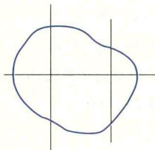
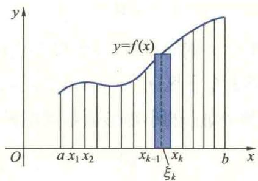
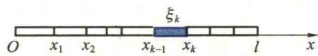
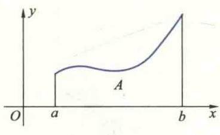
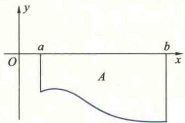
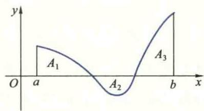
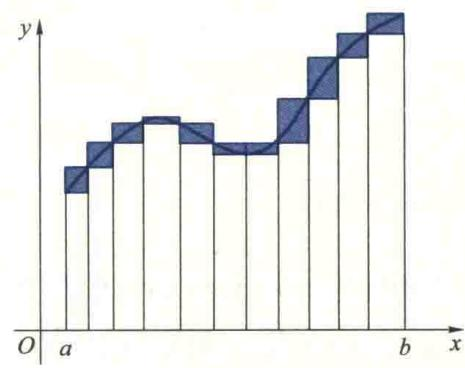
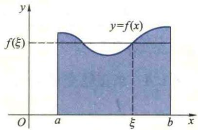

import ExerciseTrigger from '@/components/exercises/ExerciseTrigger.astro';
import QRCodeVideo from '@/components/QRCodeVideo.astro';

import Guide from '@/components/Guide.astro';
import Knowledge from '@/components/Knowledge.astro';
import Example from '@/components/Example.astro';
import Analysis from '@/components/Analysis.astro';
import Solution from '@/components/Solution.astro';
import Variant from '@/components/Variant.astro';
import Note from '@/components/Note.astro';
import Block from '@/components/Block.astro';
import Method from '@/components/Method.astro';
import Exercise from '@/components/Exercise.astro';

本节通过几个实例引出定积分的定义、几何意义以及定积分的存在条件,最后介绍定积分的几个常用性质.

## 1.1 定积分问题举例

在绪论中已经讲过求变速直线运动物体的位移问题.由于变速直线运动中位移随时间 $t$ 的变化是非均匀的.为了在均匀变化的基础上求从 $a$ 到 $b$ 这段时间内物体通过的位移,先将时间区间 $[a,b]$ 任意划分为若干小区间;在每个小区间内将位移随时间的变化近似看成均匀的,用小区间上任一点 $\xi_{k}$ 处的速度作为物体在该小区间上速度的近似值,求出位移的近似值;再将各小区间内通过的位移近似值相加,求得区间 $[a,b]$ 内总位移的近似值;然后,令最大小区间的长度 $d\to 0$ ,通过取极限,将求物体在 $[a,b]$ 内通过的总位移的精确值 $s$ 归结为求下面的极限:

$$
s = \lim _ {d \rightarrow 0} \sum_ {k = 1} ^ {n} v (\xi_ {k}) \Delta t _ {k}.\tag{1.1}
$$

在实际问题中,还有很多几何量与物理量的计算都归结为求与(1.1)式具有同

样形式的极限,下面再举两个例子:

<Example title="例 1.1">
曲边梯形的面积问题 如何计算曲边形的面积是一个古老而有实际意义的问题. 大家知道, 由平面上任一闭曲线所围成的曲边形(图 3.1)都可用一些互相垂直的直线将它划分为若干个如图 3.2 所示的所谓曲边梯形, 即由曲线 $y = f(x)$ 与直线 $x = a, x = b$ 及 $x$ 轴所围成的平面图形①(其中 $f$ 是 $[a, b]$ 上的非负连续函数). 因此, 求曲边形面积的问题就归结为求曲边梯形的面积问题.

<figure class="vp-figure">
  
  <figcaption>图3.1</figcaption>
</figure>

<figure class="vp-figure">
  
  <figcaption>图3.2</figcaption>
</figure>

如果在区间 $[a, b]$ 上， $f(x) = H$ （ $H$ 为正常数），那么曲边梯形便是一个高为 $H$ 的长方形，它的面积 $A$ 的大小仅与底边长度有关，随底边长度的变化而均匀变化。因此，只要用乘法就能求得面积 $A$ ：

$$
A = \text { 底 } \times \text { 高 } = (b - a) H.\tag{1.2}
$$

然而,如果 $f(x)\neq$ 常数,那么曲边梯形的“高” $f(\text{的面积随底边长度的变化是非均匀的(即在不同点}x\text{处,底边长度的改变量}\Delta x\text{相同时,相应的曲边梯形面积的改变量}\Delta A\text{不尽相同})$ ,不能直接用公式(1.2)来计算.怎么办呢?经过众多数学家的长期努力,终于找到了一种解决方法.这种方法的基本思路是:将曲边梯形任意分割成若干小曲边梯形(图3.2),从而 $[a,b]$ 也被分割为若干子区间.由于f在 $[a,b]$ 上连续,所以在每个小曲边梯形中,“高” $f(x)$ 随x的变化很小,可以近似地看成常数.在每个小曲边梯形的底边上任取一点,以 $f(x)$ 在该点的值为高x) 随 x 的变化而变化, 因此, 它注: 早在公元前 3 世纪古希腊著名数学家 Archimedes 就采用内接多边形来逼近曲边形的方法计算由曲线 $y = x^{2}$ 、直线 x = 1 和 x 轴围成的曲边三角形的面积, 他的方法已接近于现在的积分法. 但他用的是等分底边 [0, 1] 为若干个小区间, 取函数 $y = x^{2}$ 在每小区间右端点的值为小矩形的高, 具有很大的特殊性和局限性.

作小矩形.这样,每个小曲边梯形就可近似地看成面积随底边长度均匀变化的小矩形,于是可利用由乘法求得的小矩形面积作为小曲边梯形面积的近似值.从而,所求曲边梯形的面积就近似地等于所有小矩形面积之和.而且, $[a,b]$ 被分割得越细,近似的程度就越好.当 $[a,b]$ 被无限细分,每个小曲边梯形底边的长度都趋于零时,这个近似值的极限就规定为曲边梯形的面积.具体步骤如下:

分 在区间 $(a, b)$ 内任意插入 $n - 1$ 个分点

$$
a = x _ {0} <   x _ {1} <   x _ {2} <   \dots <   x _ {n - 1} <   x _ {n} = b,
$$

则区间 $[a, b]$ 被分割成 $n$ 个子区间. 第 $k$ 个子区间的长度为

$$
\Delta x _ {k} = x _ {k} - x _ {k - 1}, k = 1, 2, \dots , n.
$$

过各分点作平行 y 轴的直线, 曲边梯形就被分成 n 个小曲边梯形;

匀 在第 $k$ 个子区间 $[x_{k-1}, x_k]$ 上任取一点 $\xi_k$ ，将对应小曲边梯形的面积 $\Delta A_k$ 用底为 $\Delta x_k$ 、高为 $f(\xi_k)$ 的小矩形面积近似替代（图3.2），则有

$$
\Delta A _ {k} \approx f (\xi_ {k}) \Delta x _ {k}, k = 1, 2, \dots , n;
$$

合 将所有小曲边梯形面积的近似值相加得到曲边梯形面积 A 的近似值

$$
A = \sum_ {k = 1} ^ {n} \Delta A _ {k} \approx \sum_ {k = 1} ^ {n} f (\xi_ {k}) \Delta x _ {k};
$$

精 当 n 越大并且每个子区间的长度越小时, 上面的表达式越精确. 因此, 当所有子区间长度的最大值 $d = \max_{1 \leqslant k \leqslant n} \left\{ \Delta x_k \right\}$ 趋于零时, 上述和式的极限就规定为曲边梯形的面积 A, 即

$$
A = \lim _ {d \rightarrow 0} \sum_ {k = 1} ^ {n} f (\xi_ {k}) \Delta x _ {k}. \quad \text {I}\tag{1.3}
$$
</Example>

<Example title="例 1.2">
质量非均匀分布的细棒质量问题 设有一质量非均匀分布的细棒, 长为 l. 若已知细棒上各点的线密度 $\rho$ , 试求该细棒的质量 m.

如果质量在细棒上的分布是均匀的, 就是说, 细棒上各点的线密度 $\rho$ 是常数, 那么细棒的质量可以用乘法求得, 即

$$
m = \text { 线密度 } \times \text { 棒长 } = \rho l.
$$

现在,问题的困难在于质量是非均匀分布的,即密度 $\rho$ 不是常数.为了利用均匀分布情况的上述乘法公式来解决这个问题,先建立坐标系如

<figure class="vp-figure">
  
  <figcaption>图3.3</figcaption>
</figure>

图3.3.此时, $\rho=\rho(x)$ ,并设它在 $[0,l]$ 上是连续函数.类似于例1.1的思路,将 $[0,l]$ 任意分割为若干子区间,在每个子区间上线密度 $\rho$ 的变化很小,可以近似地看成是常数.因此,可用每个子区间上任一点的密度作为该子区间上密度的近似值,就是说,质量的分布可近似看成均匀的.从而可以利用乘法求出在每个子区间内细棒质量的近似值,相加并通过取极限便可得到质量m的精确值.求解步骤与例1.1类似.

分 在 $(0, l)$ 内任意插入 $n - 1$ 个分点

$$
0 = x _ {0} <   x _ {1} <   x _ {2} <   \dots <   x _ {n - 1} <   x _ {n} = l,
$$

则 $[0, l]$ 被分割成 $n$ 个子区间. 第 $k$ 个子区间 $[x_{k-1}, x_k]$ 的长度为

$$
\Delta x _ {k} = x _ {k} - x _ {k - 1}, k = 1, 2, \dots , n;
$$

匀 任取 $\xi_{k}\in [x_{k - 1},x_{k}]$ ，则该段细棒质量 $\Delta m_{k}$ 的近似值为

$$
\Delta m _ {k} \approx \rho (\xi_ {k}) \Delta x _ {k}, k = 1, 2, \dots , n;
$$

合 将各段细棒质量的近似值相加,得到所求细棒总质量 m 的近似值

$$
m \approx \sum_ {k = 1} ^ {n} \rho (\xi_ {k}) \Delta x _ {k};
$$

精 令 $d = \max_{1\leqslant k\leqslant n}\{\Delta x_k\} \rightarrow 0$ ，上述和式的极限就规定为细棒的质量，即

$$
m = \lim _ {d \rightarrow 0} \sum_ {k = 1} ^ {n} \rho (\xi_ {k}) \Delta x _ {k}.\tag{1.4}
$$
</Example>

尽管上述各例中问题的实际意义完全不同,但解决问题的思想方法和步骤却是一样的,而且,都归结为求一个具有相同数学结构的和式极限,如(1.1),(1.3)和(1.4)式所示.抛开各个问题的具体含义,仅保留其数学结构,便抽象出定积分的定义.

## 1.2 定积分的定义

<Knowledge title="定义 1.1 定积分">
设函数 f 是定义在区间 $[a, b]$ 上的有界函数，在区间 $(a, b)$ 内任意插入 n-1 个分点

$$
a = x _ {0} <   x _ {1} <   x _ {2} <   \dots <   x _ {n - 1} <   x _ {n} = b,
$$

把 $[a,b]$ 分割成n个子区间,第k个子区间的长度为

$$
\Delta x _ {k} = x _ {k} - x _ {k - 1}, k = 1, 2, \dots , n.
$$

任取 $\xi_{k}\in[x_{k-1},x_{k}]$ ，作乘积 $f(\xi_{k})\Delta x_{k}$ （ $k=1,2,\cdots,n$ ），把所有这些乘积相加得到和式

$$
\sum_ {k = 1} ^ {n} f (\xi_ {k}) \Delta x _ {k}.
$$

如果无论区间 $[a, b]$ 怎样分割，无论点 $\xi_{k}$ 怎样选取，当 $d = \max_{1 \leqslant k \leqslant n} \{\Delta x_{k}\} \rightarrow 0$ 时，该和式都趋于同一个常数，那么称函数 $f$ 在区间 $[a, b]$ 上可积，且称此常数为 $f$ 在区间 $[a, b]$ 上的定积分。记作 $\int_{a}^{b} f(x) \mathrm{d}x$ ，即
</Knowledge>

定积分定义中之所以要假设f在 $[a,b]$ 上有界,是因为若f无界,则和式极限(1.5)必不存在.事实上若f在 $[a,b]$ 上无界,则对任一给定的划分,f必在某一子区间上无界,不妨设其为 $[x_{0},x_{1}]$ ,而在其余子区间上f均有界.于是,对于给定的任意大的常数M>0,可选取 $\xi_{1}\in[x_{0},x_{1}]$ ,使 $|f(\xi_{1})\Delta x_{1}|>M$ .于是

$\left|f(\xi_1)\Delta x_1 + \sum_{k = 2}^{n}f(\xi_k)\Delta x_k\right|$ $\geqslant \left|f(\xi_1)\Delta x_1\right| - \left|\sum_{k = 2}^{n}f(\xi_k)\Delta x_k\right|$ 由于上式右端第二项是一个有限数，而第一项可任意大，因此 $\left|\sum_{k = 1}^{n}f(\xi_k)\Delta x_k\right|$ 可任意大，从而极限不存在.所以可证(1.5)式也不存在.

$$
\int_ {a} ^ {b} f (x) \mathrm{d} x = \lim _ {d \rightarrow 0} \sum_ {k = 1} ^ {n} f (\xi_ {k}) \Delta x _ {k}.\tag{1.5}
$$

称 $f$ 为被积函数， $x$ 为积分变量， $f(x)\mathrm{d}x$ 为被积式， $[a,b]$ 为积分区间， $a,b$ 分别称为积分下限与上限， $\int$ 是积分符号.

<QRCodeVideo url="http://2d.hep.cn/1254051/31" />

对这个定义,还应注意以下几点:

（1）在定义中，当所有子区间长度的最大值 $d \to 0$ 时，则子区间的个数 $n$ 必然趋于无穷大。但不能用 $n \to +\infty$ 来代替 $d \to 0$ ，因为对区间的分割是任意的， $n \to \infty$ 不能保证 $d \to 0$ 。

（2）在构造定义中的和式时，包含了两个任意性，即对区间的分割与 $\xi_{k}$ 的选取都是任意的。显然，对于区间的不同分割和 $\xi_{k}$ 的不同选取，得到的和式一般并非相同。定义要求无论区间如何分割以及点 $\xi_{k}$ 怎样选取，只有得到的不同和式当 $d\to 0$ 时都要趋于同一个数，这样才说函数 $f$ 在 $[a,b]$ 上可积。换句话说，如果对区间的某两种不同分割或 $\xi_{k}$ 的两种不同选取得到的和式趋于不同的数，或者存在一个和式不能趋于一个确定的数，那么 $f$ 在该区间上必不可积。例如，Dirichlet函数

<QRCodeVideo id="3.1.1" title="定积分定义中的和式极限与函数极限有什么不同." url="http://2d.hep.cn/1254051/32" />

$$
D (x) = \left\{ \begin{array}{l l} 1, & x \text {为有理数}, \\ 0, & x \text {为无理数} \end{array} \right.
$$

为什么定积分定义中要强调两个任意性.

在区间 $[0,1]$ 上不可积.事实上，将区间 $[0,1]$ 任意分割为 $n$ 个子区间.若取 $\xi_{k}$ 为子区间 $[x_{k - 1},x_k]$ 中的有理数，则 $D(\xi_k) = 1$ ，从而有

$$
\lim _ {d \to 0} \sum_ {k = 1} ^ {n} D (\xi_ {k}) \Delta x _ {k} = \lim _ {d \to 0} \sum_ {k = 1} ^ {n} \Delta x _ {k} = 1;
$$

此例还表明有界是函数可积的必要条件, 而不是充分条件.

若取 $\xi_{k}$ 为 $[x_{k - 1},x_k]$ 中的无理数，则 $D(\xi_k) = 0$ ，从而有

$$
\lim _ {d \to 0} \sum_ {k = 1} ^ {n} D (\xi_ {k}) \Delta x _ {k} = 0.
$$

因此, $D(x)$ 在 $[0,1]$ 上不可积.

（3）函数 $f$ 在区间 $[a, b]$ 上的定积分 $\int_{a}^{b} f(x) \mathrm{d}x$ 是一个确定的数，它的值仅与被积函数 $f$ 和积分区间 $[a, b]$ 有关，而与积分变量 $x$ 无关。因此，若积分变量 $x$ 改用其他字母（例如用 $t$ ）表示，它的值不会改变，即

$$
\int_ {a} ^ {b} f (x) \mathrm{d} x = \int_ {a} ^ {b} f (t) \mathrm{d} t.
$$

根据定积分的定义,例 1.1 中的曲边梯形的面积与例 1.2 中细棒的质量可分别

表示为定积分

$$
A = \int_ {a} ^ {b} f (x) \mathrm{d} x, \quad m = \int_ {0} ^ {l} \rho (x) \mathrm{d} x,
$$

做变速直线运动物体在时间区间 $[a, b]$ 内通过的位移也可表示为定积分

$$
s = \int_ {a} ^ {b} v (t) \mathrm{d} t.
$$

最后,对定积分再作两点补充规定:

(1) 当积分上限 b 小于下限 a 时, 规定

$$
\int_ {a} ^ {b} f (x) \mathrm{d} x = - \int_ {b} ^ {a} f (x) \mathrm{d} x,
$$

这就是说,互换定积分的上、下限,它的值要改变正负号.

在定义 1.1 的和式中, $\Delta x_{k}$ 表示子区间的长度, 故 $\Delta x_{k} > 0$ . 但当作了补充规定(1)之后, 积分和式中的 $\Delta x_{k}$ 可正可负, 故从 a 到 b 与从 b 到 a 的积分是不同的, 相差一个符号!

(2) 当 a=b 时, 规定 $\int_{a}^{a} f(x) \, dx = 0.$

这样,对定积分上、下限的大小就没有什么限制了.

定积分的几何意义 由例1.1可知,当在 $[a,b]$ 上 $f(x)\geqslant0$ 时,定积分 $\int_{a}^{b}f(x)\mathrm{d}x$ 的值等于由曲线 $y=f(x)$ 与直线x=a,x=b及x轴围成的曲边梯形的面积(图3.4(a)),即

$$
\int_ {a} ^ {b} f (x) \mathrm{d} x = A.
$$

  
(a)

  
(b)  
图3.4

  
(c)

如果在 $[a, b]$ 上 $f(x) \leqslant 0$ ，那么由曲线 $y = f(x)$ ，直线 $x = a, x = b$ 及 $x$ 轴围成的曲边梯形位于 $x$ 轴下方（图3.4(b)). 此时， $f(\xi_k) \Delta x_k$ 的值为负，它的绝对值表示第 $k$ 个子区间上小曲边梯形面积的近似值. 由于曲边梯形的面积总是正的，所以

利用定积分的几何意义
求下列定积分的值:

(1) $\int_{0}^{1}(x + 1)\mathrm{d}x$

(2) $\int_0^\pi \cos x\mathrm{d}x$

$$
\int_ {a} ^ {b} f (x) \mathrm{d} x = - A.
$$

(3) $\int_{0}^{1}\sqrt{1-x^{2}}dx.$

当 $f(x)$ 在区间 $[a,b]$ 上变号时,以图3.4(c)为例,从直观上不难看出,定积分 $\int_{a}^{b}f(x)\mathrm{d}x$ 的值等于三个曲边梯形面积的代数和①,即

$$
\int_ {a} ^ {b} f (x) \mathrm{d} x = A _ {1} - A _ {2} + A _ {3}.
$$

## 1.3 定积分的存在条件

下面讨论定义在区间 $[a,b]$ 上函数的可积条件.

由定积分定义知， $f$ 是定义在区间 $[a, b]$ 上的有界函数。将 $[a, b]$ 任意分割为 $n$ 个子区间 $[x_{k-1}, x_k]$ （ $k=1,2,\cdots,n$ ）， $f$ 在 $[a, b]$ 上的定积分就是形如(1.5)式的和式极限。设 $f$ 在子区间 $[x_{k-1}, x_k]$ 上的上、下确界分别为 $M_k$ 与 $m_k$ ，即

$$
M _ {k} = \sup \left\{f (x) \mid x \in \left[ x _ {k - 1}, x _ {k} \right] \right\}, \quad m _ {k} = \inf \left\{f (x) \mid x \in \left[ x _ {k - 1}, x _ {k} \right] \right\},
$$

称 $\omega_{k} = M_{k} - m_{k}$ 为 $f$ 在子区间 $[x_{k - 1}, x_{k}]$ 上的振幅，和式

$$
S _ {n} = \sum_ {k = 1} ^ {n} M _ {k} \Delta x _ {k}, \quad s _ {n} = \sum_ {k = 1} ^ {n} m _ {k} \Delta x _ {k}
$$

分别称为 $f$ 关于该分割的 Darboux 大和与 Darboux 小和. 如果在 $[a, b]$ 上, $f(x) \geqslant 0$ , 那么 Darboux 大和 $S_{n}$ 在几何上就表示在子区间 $[x_{k-1}, x_{k}]$ 上以 $M_{k}$ 为高所作的 $n$ 个小矩形构成的阶梯形的面积, Darboux 小和则表示在 $[x_{k-1}, x_{k}]$ 上以 $m_{k}$ 为高所作的 $n$ 个小矩形构成的阶梯形的面积, 分别是以曲线 $y = f(x)$ 为曲边的曲边梯形的外包与内含的两个阶梯形的面积. 它们的差

$$
S _ {n} - s _ {n} = \sum_ {k = 1} ^ {n} \omega_ {k} \Delta x _ {k}
$$

就是图3.5中的阴影部分面积.根据定义1.1，函数 $f$ 在 $[a,b]$ 上可积，在几何上就表示该曲边梯形的面积可以求得，并且等于当 $[a,b]$ 被无限细分时上述外包与内含两个阶梯形面积的共同极限.因此，这两个阶梯形面积之差的极限应为零；反之也成立.由此启发，得到如下定理.

<figure class="vp-figure">
  
  <figcaption>图3.5</figcaption>
</figure>

<Knowledge title="定理 1.1 可积的充要条件">
设函数 $f$ 在区间 $[a, b]$ 上有界，则 $f$ 在 $[a, b]$ 上可积的充要条件是： $\forall \varepsilon > 0, \exists \varepsilon > 0$ ，当 $d < \delta$ 时，

$$
\sum_ {k = 1} ^ {n} \omega_ {k} \Delta x _ {k} <   \varepsilon\tag{1.6}
$$

(证明从略).
</Knowledge>

仔细分析不难发现, 当 f 属于下面两种情况之一时, (1.6) 式成立, 从而 f 在 $[a, b]$ 上可积.

第一种情况.任意分割 $[a,b]$ ,使最大子区间的长度 $d$ 充分小, $f$ 在每个子区间上的振幅 $\omega_{k}$ 都能任意小,小于任意给定的 $\varepsilon > 0$ .例如,当 $f$ 是 $[a,b]$ 上的连续函数时就属于这种情况.事实上,我们有

<Knowledge title="定理 1.2">
若 $f \in C[a, b]$ ，则 f 在 $[a, b]$ 上可积.

<Solution title="证明">
因为 $f$ 在 $[a, b]$ 上连续，所以它在 $[a, b]$ 上想一想：

一致连续. 从而 $\forall \varepsilon > 0, \exists \delta > 0$ , 使得 $\forall x^{(1)}, x^{(2)} \in [a,$ 一致连续性在定理1.2的证明中 $b]$ , 当 $|x^{(1)} - x^{(2)}| < \delta$ 时, 必有 起什么作用呢?

$$
\left| f \left(x ^ {(1)}\right) - f \left(x ^ {(2)}\right) \right| <   \varepsilon .
$$

任意分割 $[a,b]$ 为n个子区间 $[x_{k-1},x_{k}]$ （ $k=1,2,\cdots,n$ ），使 $d<\delta$ 。根据闭区间上连续函数的性质， $\exists\xi_{k}^{(1)},\xi_{k}^{(2)}\in[x_{k-1},x_{k}]$ ，使

$$
f (\xi_ {k} ^ {(1)}) = M _ {k}, \quad f (\xi_ {k} ^ {(2)}) = m _ {k},
$$

从而有

$$
\omega_ {k} = f \left(\xi_ {k} ^ {(1)}\right) - f \left(\xi_ {k} ^ {(2)}\right) <   \varepsilon , \quad \forall k = 1, 2, \dots , n.
$$

故当 $d < \delta$ 时，必有

$$
\sum_ {k = 1} ^ {n} \omega_ {k} \Delta x _ {k} <   \varepsilon \sum_ {k = 1} ^ {n} \Delta x _ {k} = \varepsilon (b - a),
$$
</Solution>
</Knowledge>

由定理 1.1 知, f 在 $[a, b]$ 上可积.

第二种情况. 当 $d$ 充分小时, 虽然不能保证 $f$ 在每个子区间上的振幅 $\omega_{k}$ 都任意小, 但使 $\omega_{k}$ 不能任意小的所有子区间长度之和可以小于任意给定的正数. 例如, $f$ 在 $[a, b]$ 上只有有限个第一类间断点或者 $f$ 是 $[a, b]$ 上的单调函数都属于这种情况. 事实上, 可以证明下面的定理 (证明从略).

<Knowledge title="定理 1.3">
如果有界函数 f 在区间 $[a, b]$ 上只有有限个第一类间断点或者在 $[a, b]$ 上单调，则 f 在 $[a, b]$ 上可积.

如果 $f$ 在区间 $[a, b]$ 上可积, 那么在用定义计算它的定积分时, 可对 $[a, b]$ 采用某些特殊的分割方法, $\xi_{k}$ 也可选用某些特殊点.
</Knowledge>

<Example title="例 1.3">
用定义计算定积分 $\int_0^1 x^2\mathrm{d}x$

<Solution title="解">
由于 $f(x)=x^{2}$ 在区间 $[0,1]$ 上连续,因而可积.将 $[0,1]$ 等分为n个子区间

$[x_{k - 1}, x_k]$ , 取 $\xi_k$ 为每个子区间的右端点, 则有

$$
\Delta x _ {k} = \frac {1}{n}, \quad \xi_ {k} = \frac {k}{n} (k = 1, 2, \dots , n).
$$

所以

$$
\begin{array}{r l} \int_ {0} ^ {1} x ^ {2} \mathrm{d} x & = \lim _ {d \to 0} \sum_ {k = 1} ^ {n} \xi_ {k} ^ {2} \Delta x _ {k} = \lim _ {n \to + \infty} \sum_ {k = 1} ^ {n} \left(\frac {k}{n}\right) ^ {2} \frac {1}{n} = \lim _ {n \to + \infty} \frac {1}{n ^ {3}} (1 ^ {2} + 2 ^ {2} + \dots + n ^ {2}) \\ & = \lim _ {n \to + \infty} \frac {n (n + 1) (2 n + 1)}{6 n ^ {3}} = \frac {1}{3}. \end{array}
$$

在例 1.3 中, 尽管被积函数 f 相当简单, 然而计算过程仍然比较复杂. 可见, 利用定义计算定积分是相当困难的. 因而, 研究定积分的性质, 寻求简单可行的积分方法, 就是本章的主要任务之一.
</Solution>
</Example>

## 1.4 定积分的性质

定积分的上述定义是由德国数学家 Riemann 给出的, 因而称为 Riemann 积分, 简称 R 积分. 为书写简便起见, 将在区间 $[a, b]$ 上 Riemann 可积 (即 Riemann 积分存在) 的函数全体构成的集合记作 $\mathcal{R}[a, b]$ . 下面介绍 R 积分的几个常用的重要性质.

<Knowledge title="性质 1.1 线性性质">
设 $f,g\in \mathcal{R}[a,b],\alpha ,\beta \in \mathbf{R}$ ，则 $\alpha f + \beta g\in \mathcal{R}[a,b]$ ，并且

$$
\int_ {a} ^ {b} [ \alpha f (x) + \beta g (x) ] \mathrm{d} x = \alpha \int_ {a} ^ {b} f (x) \mathrm{d} x + \beta \int_ {a} ^ {b} g (x) \mathrm{d} x.\tag{1.7}
$$

这个性质可由定积分的定义和极限的运算法则直接得到.
</Knowledge>

<Knowledge title="性质 1.2 单调性">
设 $f, g \in \mathcal{R}[a, b]$ ，且 $f(x) \leqslant g(x), \forall x \in [a, b]$ ，则

$$
\int_ {a} ^ {b} f (x) \mathrm{d} x \leqslant \int_ {a} ^ {b} g (x) \mathrm{d} x.
$$

这个性质也可由定积分的定义直接得到,由此还可立即得到下面的推论:
</Knowledge>

<Knowledge title="推论 1.1">
设 $f \in \mathcal{R}[a, b]$ , 且

$$
m \leqslant f (x) \leqslant M, \quad \forall x \in [ a, b ],
$$

其中 $m, M$ 是常数，则 $m(b - a) \leqslant \int_{a}^{b} f(x) \mathrm{d}x \leqslant M(b - a)$ .
</Knowledge>

<Knowledge title="性质 1.3">
设 $f \in \mathcal{R}[a, b]$ , 则 $|f| \in \mathcal{R}[a, b]$ , 且

$$
\left| \int_ {a} ^ {b} f (x) \mathrm{d} x \right| \leqslant \int_ {a} ^ {b} | f (x) | \mathrm{d} x.\tag{1.8}
$$
</Knowledge>

<Note title="想一想">
试证明定积分的线性性质和单调性.
</Note>

给定一个 $f\in\mathcal{R}[a,b]$ ，对应一个积分值 $\int_{a}^{b}f(x)\mathrm{d}x$ ，这就定义了 $\mathcal{R}[a,b]$ 到R的一个映射，即定义了 $\mathcal{R}[a,b]$ 上的一个泛函，记作

$$
F (f) = \int_ {a} ^ {b} f (x) \mathrm{d} x.
$$

此时,性质1.2可表示为,设 $f,g\in$ $R[a,b]$ ，且 $f\leqslant g$ ，则

$$
F (f) \leqslant F (g),
$$

即 $F(f)$ 单调增.

<Solution title="证明">
首先,我们证明 $\left|f\right|$ 在 $[a,b]$ 上也可积.任意分割区间 $[a,b]$ ,用 $\omega_{k}(f)$ 与 $\omega_{k}(\left|f\right|)$ 分别表示 f 与 $\left|f\right|$ 在子区间 $[x_{k-1},x_{k}]$ 上的振幅.由于

$$
\mid \mid f (x) \mid - \mid f (y) \mid \mid \leqslant \mid f (x) - f (y) \mid , \forall x, y \in [ x _ {k - 1}, x _ {k} ],
$$

并且不难证明

$$
\omega_ {k} (f) = \sup \left\{\mid f (x) - f (y) \mid \mid , x, y \in \left[ x _ {k - 1}, x _ {k} \right] \right\},
$$

所以 $\omega_{k}(|f|)\leqslant \omega_{k}(f)$ ，从而有

$$
\sum_ {k = 1} ^ {n} \omega_ {k} (| f |) \Delta x _ {k} \leqslant \sum_ {k = 1} ^ {n} \omega_ {k} (f) \Delta x _ {k}.
$$

又因为 $f$ 在 $[a,b]$ 上可积，由定理1.1知， $\forall \varepsilon > 0, \exists \delta > 0$ ，当 $d < \delta$ 时，必有 $\sum_{k=1}^{n} \omega_k(f) \Delta x_k < \varepsilon$ ，从而

$$
\sum_ {k = 1} ^ {n} \omega_ {k} (| f |) \Delta x _ {k} <   \varepsilon ,
$$

故 $|f|$ 在 $[a,b]$ 上可积.

为了证明不等式(1.8)，只要注意到不等式

$$
- | f (x) | \leqslant f (x) \leqslant | f (x) |, \forall x \in [ a, b ],
$$

再利用性质1.2即得

$$
- \int_ {a} ^ {b} | f (x) | \mathrm{d} x \leqslant \int_ {a} ^ {b} f (x) \mathrm{d} x \leqslant \int_ {a} ^ {b} | f (x) | \mathrm{d} x,
$$

从而知(1.8)式成立.
</Solution>

<Knowledge title="性质 1.4 对区间的可加性">
设 I 是一个有限闭区间, $a, b, c \in I$ . 若 f 在 I 上可积, 则 f 在 I 的任一闭子区间都可积, 且

$$
\int_ {a} ^ {b} f (x) \mathrm{d} x = \int_ {a} ^ {c} f (x) \mathrm{d} x + \int_ {c} ^ {b} f (x) \mathrm{d} x.\tag{1.9}
$$

<Solution title="证明">
利用定理 1.1 不难证明 f 在区间 I 的任一个闭子区间上可积, 下面证明等式(1.9).

设 $c$ 在 $(a, b)$ 内. 由于 $f$ 在 $[a, b]$ 上可积, 根据定义, 任意分割区间 $[a, b]$ 所作的积分和式都趋于同一个数. 因此, 可以始终把 $c$ 作为一个分点. 这样, $f$ 在 $[a, b]$ 上的和式就等于它在 $[a, c]$ 上的和式与 $[c, b]$ 上的和式之和, 即

$$
\sum_ {[ a, b ]} f (\xi_ {k}) \Delta x _ {k} = \sum_ {[ a, c ]} f (\xi_ {k}) \Delta x _ {k} + \sum_ {[ c, b ]} f (\xi_ {k}) \Delta x _ {k}.
$$

由于f在子区间 $[a,c]$ 与 $[c,b]$ 上也可积,所以令 $d\rightarrow0$ 就得到等式(1.9).

若 $c$ 在 $[a, b]$ 外，不妨设 $a < b < c$ ，则由上面已证明的结论有

$$
\int_ {a} ^ {c} f (x) \mathrm{d} x = \int_ {a} ^ {b} f (x) \mathrm{d} x + \int_ {b} ^ {c} f (x) \mathrm{d} x,
$$

从而得

$$
\int_ {a} ^ {b} f (x) \mathrm{d} x = \int_ {a} ^ {c} f (x) \mathrm{d} x - \int_ {b} ^ {c} f (x) \mathrm{d} x = \int_ {a} ^ {c} f (x) \mathrm{d} x + \int_ {c} ^ {b} f (x) \mathrm{d} x.
$$

对于其他情况,可用同样方法证明.

利用定理 1.1, 还可证明(从略)
</Solution>
</Knowledge>

<Knowledge title="性质 1.5 乘积性质">
设 $f, g \in \mathcal{R}[a, b]$ ，则 $fg \in \mathcal{R}[a, b]$ .
</Knowledge>

<Knowledge title="性质 1.6 积分中值定理">
设 $f\in C[a,b],g\in \mathcal{R}[a,b]$ ，且 $g$ 在 $[a,b]$ 上不变号.则至少存在一点 $\xi \in [a,b]$ ，使注意：由于 $g$ 在 $[a,b]$ 上不变号，

$$
\int_ {a} ^ {b} f (x) g (x) \mathrm{d} x = f (\xi) \int_ {a} ^ {b} g (x) \mathrm{d} x.\tag{1.10}
$$

<Solution title="证明">
设在 $[a, b]$ 上 $g(x) \geqslant 0, M = \max_{x \in [a, b]} \{f(x)\}$ , $m = \min_{x \in [a, b]} \{f(x)\}$ , 则 $m \leqslant f(x) \leqslant M, \forall x \in [a, b]$ . 从而

$$
m g (x) \leqslant f (x) g (x) \leqslant M g (x), \quad \forall x \in [ a, b ].
$$

故由性质 1.2 与性质 1.5, 得[a,b], 且 g 在 [a,b] 上不变号.
</Solution>
</Knowledge>

由于 g 在 [a,b] 上不变号,
不妨设 $g \geqslant 0$ . 若 $g(x) \equiv 0, x \in [a,b]$ , (1.10) 式显然成立; 若 $g(x) \neq 0, x \in [a,b]$ , 则 $\int_{a}^{b} g(x) \, dx > 0$ . 因此, 证明的主要思想在于证明 $\frac{\int_{a}^{b}f(x)g(x)\mathrm{d}x}{\int_{a}^{b}g(x)\mathrm{d}x}$ 介于 f 在区间
[a,b]上的最大值与最小值之间,
再利用连续函数的介值定理即可得结论.

$$
m \int_ {a} ^ {b} g (x) \mathrm{d} x \leqslant \int_ {a} ^ {b} f (x) g (x) \mathrm{d} x \leqslant M \int_ {a} ^ {b} g (x) \mathrm{d} x.\tag{1.11}
$$

若 $\int_{a}^{b}g(x)\mathrm{d}x > 0$ ，上式两边同除以 $\int_{a}^{b}g(x)\mathrm{d}x,$

得

$$
m \leqslant \frac {\int_ {a} ^ {b} f (x) g (x) \mathrm{d} x}{\int_ {a} ^ {b} g (x) \mathrm{d} x} \leqslant M.
$$

由连续函数的介值定理知, 至少存在一点 $\xi \in [a, b]$ , 使

$$
f (\xi) = \frac {\int_ {a} ^ {b} f (x) g (x) \mathrm{d} x}{\int_ {a} ^ {b} g (x) \mathrm{d} x},
$$

即

$$
\int_ {a} ^ {b} f (x) g (x) \mathrm{d} x = f (\xi) \int_ {a} ^ {b} g (x) \mathrm{d} x.
$$

若 $\int_{a}^{b} g(x) \mathrm{d}x = 0$ ，则由（1.11）式， $\int_{a}^{b} f(x) g(x) \mathrm{d}x = 0$ 。因此，对于任何 $\xi \in [a, b]$ ，等式（1.10）都成立。综合上述情况，定理得证。

<QRCodeVideo id="3.1.3" title="改进积分中值定理(推论1.2)." url="http://2d.hep.cn/1254051/33" />

在性质 1.6 中取 $g(x)=1$ 即得下面的推论.

<Knowledge title="推论 1.2">
设 $f \in C[a, b]$ , 则至少存在一点 $\xi \in [a, b]$ , 使

$$
\int_ {a} ^ {b} f (x) \mathrm{d} x = f (\xi) (b - a).\tag{1.12}
$$
</Knowledge>

当 $f(x)\geqslant0$ 时,推论1.2有着简单的几何意义(图3.6).它表明,若f在 $[a,b]$ 上连续,则在区间 $[a,b]$ 中至少有一点 $\xi$ ,使得高为 $f(\xi)$ 底边长为b-a的矩形面积恰好等于以 $y=f(x)$ 为曲边的曲边梯形的面积.

<figure class="vp-figure">
  
  <figcaption>图3.6</figcaption>
</figure>

通常称

$$
\frac {1}{b - a} \int_ {a} ^ {b} f (x) \mathrm{d} x
$$

为函数f在区间 $[a,b]$ 上的积分中值.因此,很多书上也称推论1.2为积分中值定理,而把性质1.6称为广义积分中值定理.

积分中值也叫积分均值,它是有限个数的算术平均值概念对连续函数的推广.大家知道,n个数 $y_{1}$ , $y_{2},\cdots,y_{n}$ 的算术平均值为

(1) 积分中值是有限个数的算术平均值概念对连续函数在 $[a,b]$ 上平均值的推广;(2) 积分中值定理(推论1.2)告诉我们, 连续函数 $f(x)$ 在 $[a,b]$ 上的平均值一定可由该函数在 $[a,b]$ 上的某一点 $\xi$ 取得;(3) 推出(1)中结论的方法也可用于推得可积函数在 $[a,b]$ 上的平均值, 因此, 对于可积函数也可定义积分中值的概念.

$$
\overline {{y}} = \frac {y _ {1} + y _ {2} + \cdots + y _ {n}}{n} = \frac {1}{n} \sum_ {k = 1} ^ {n} y _ {k}.
$$

但是,在很多实际问题中,还需要求出函数 $y=f(x)$ 在某一区间 $[a,b]$ 上的平均值.例如,求一周内的平均气温、一段时间内气体的平均压强、交流电的平均电流等.如何定义并求出连续函数 $y=f(x)$ 在区间 $[a,b]$ 上的平均值呢?

设 $f \in C[a, b]$ ，则 $f \in \mathcal{R}[a, b]$ . 将 $[a, b]$ 分割为 $n$ 个等长的子区间

$$
a = x _ {0} <   x _ {1} <   x _ {2} <   \dots <   x _ {n} = b,
$$

每个子区间的长度为 $\Delta x_{k}=\frac{b-a}{n}$ . 取 $\xi_{k}$ 为各子区间的右端点 $x_{k}$ （ $k=1,2,\cdots,n$ ），则对应的 n 个函数值 $y_{k}=f(x_{k})$ 的算术平均值为

$$
\bar {y} _ {n} = \frac {1}{n} \sum_ {k = 1} ^ {n} y _ {k} = \frac {1}{n} \sum_ {k = 1} ^ {n} f (x _ {k})
$$
$$
= \frac {1}{b - a} \sum_ {k = 1} ^ {n} f (x _ {k}) \frac {b - a}{n} = \frac {1}{b - a} \sum_ {k = 1} ^ {n} f (x _ {k}) \Delta x _ {k}.
$$

显然， $n$ 增大， $\overline{y}_n$ 就表示函数 $f$ 在 $[a,b]$ 上更多个点处函数值的平均值.令 $n\to \infty ,\overline{y}_n$ 的极限自然就定义为 $f$ 在 $[a,b]$ 上的平均值 $\overline{y}$ ，即

$$
\overline {{y}} = \lim _ {n \to \infty} \overline {{y}} _ {n} = \frac {1}{b - a} \lim _ {n \to \infty} \sum_ {k = 1} ^ {n} f (x _ {k}) \Delta x _ {k} = \frac {1}{b - a} \int_ {a} ^ {b} f (x) \mathrm{d} x.\tag{1.13}
$$

因此,连续函数 $y=f(x)$ 在区间 $[a,b]$ 上的平均值就等于该函数在 $[a,b]$ 上的积分中值.

<Example title="例 1.4">
求正弦交流电流 $i(t)=I_{\mathrm{m}}\sin\omega t$ 在它的半个周期（即从 t=0 到 $t=\frac{\pi}{\omega}$ ）内的平均值.

<Solution title="解">
根据(1.13)式,电流的平均值为

$$
\bar {I} = \frac {1}{\frac {\pi}{\omega} - 0} \int_ {0} ^ {\frac {\pi}{\omega}} i (t) \mathrm{d} t = \frac {\omega I _ {\mathrm{m}}}{\pi} \int_ {0} ^ {\frac {\pi}{\omega}} \sin \omega t \mathrm{d} t.
$$

为了求得 $\bar{I}$ 的具体数值, 必须计算右端的定积分. 但是, 利用定义来求此定积分是比较复杂的 (读者可尝试在 $\omega = 1$ 的情况下用定义来计算). 因此, 寻求简洁的积分法势在必行!
</Solution>
</Example>

<Block title="习题3.1">
**（A）**

1. 用定积分的定义求下列积分的值：

(1) $\int_{0}^{1}x\,dx;$

$$
\int_ {0} ^ {1} \mathrm{e} ^ {x} \mathrm{d} x.
$$

2. 设有一直的金属丝位于 x 轴上从 x=0 到 x=a 处, 其上各点 x 处的密度与 x 成正比, 比例系数为 k, 求该金属丝的质量.

3. 放置于坐标原点的一个带电量为 $Q$ 的点电荷形成一个静电场. 在电场力的作用下, 另一个带电量为 $q$ 的点电荷沿 $x$ 轴从 $x = a$ 移动到 $x = b$ 处, 试用积分式表达该电场力所做的功.

4. 根据定积分的几何意义求下列定积分：
(1) $\int_{-\pi}^{\pi}\sin xdx;$ (2) $\int_{-1}^{1}|x|\mathrm{d}x;$ (3) $\int_{0}^{a}\sqrt{a^{2}-x^{2}}\mathrm{d}x;$ (4) $\int_{-1}^{2}\left|x-\frac{1}{2}\right|\mathrm{d}x.$

5. 设 $f \in \mathcal{R}[-a, a]$ ，根据定积分的几何意义说明：

$$
\int_ {- a} ^ {a} f (x) \mathrm{d} x = \left\{ \begin{array}{l l} 0, & f \text {为奇函数}, \\ 2 \int_ {0} ^ {a} f (x) \mathrm{d} x, & f \text {为偶函数}. \end{array} \right.
$$

6. 设 f 是周期为 T 的周期函数, 且在任一有限区间上可积. 根据定积分的几何意义说明:

$$
\int_ {a} ^ {a + T} f (x) \mathrm{d} x = \int_ {0} ^ {T} f (x) \mathrm{d} x,
$$

其中 a 为任一常数.

7. 设 $f \in C[a, b]$ ，试说明任意改变 $f$ 在有限个点上的值不影响它的可积性和积分 $\int_{a}^{b} f(x) \, \mathrm{d}x$ 的值.

8. 研究下列函数在所给区间上的可积性,并说明理由:

(1) $f(x) = x^{2} + \cos x, x \in (-\infty, +\infty)$ ; (2) $f(x) = \operatorname{sgn} x, x \in [-1, 1]$ ;

(3) $f(x) = \frac{1}{x^2 - 2}, x \in [-2, 2]$ ; (4) $f(x) = \tan x, x \in [0, 2]$ ;

(5) $f(x)=\left\{\begin{aligned}&\frac{\sin x}{x},&x\neq0,\\ &1,&x=0,\end{aligned}\right.$ $x\in[-1,1];$ (6) $f(x)=\left\{\begin{aligned}&0,&x=0,\\ &\frac{1}{n},&x\in\left(\frac{1}{n+1},\frac{1}{n}\right],n\in\mathbf{N}_{+}.\end{aligned}\right.$

9. 下列命题是否正确？若正确，给予证明；否则，举出反例：

(1) 若 $\int_{a}^{b}f(x)\mathrm{d}x\geqslant0$ , 则在 $[a,b]$ 上必有 $f(x)\geqslant0$ ;

(2) 若 $f \in \mathcal{R}[a, b]$ ，则 f 在 $[a, b]$ 上有有限个间断点；

(3) 若 $\left|f\right|\in\mathcal{R}[a,b]$ ，则 $f\in\mathcal{R}[a,b]$ ;

(4) 若 f 与 g 在 $[a, b]$ 上都不可积，则 $f + g$ 在 $[a, b]$ 上也不可积；

(5) $f \in \mathcal{R}[a, b] \Leftrightarrow f^2 \in \mathcal{R}[a, b]$ ;

(6) 若 $f \in C[a, b]$ , $\int_{a}^{b} f(x) \, dx = 0$ , 则 $\exists c \in (a, b)$ , 使 $f(c) = 0 \quad (a \neq b)$ .

10. 设 $f, g \in C[a, b]$ .

(1) 如果在 $[a,b]$ 上 $f(x)\geqslant0$ ，且 $f(x)\neq0$ ，证明： $\int_{a}^{b}f(x)\mathrm{d}x>0;$

(2) 如果在 $[a,b]$ 上 $f(x)\geqslant0$ ，且 $\int_{a}^{b}f(x)\mathrm{d}x=0$ ，证明： $f(x)\equiv0$ ；

(3) 如果在 $[a,b]$ 上 $f(x)\geqslant g(x)$ ，且 $f(x)\neq g(x)$ ，证明： $\int_{a}^{b}f(x)\mathrm{d}x>\int_{a}^{b}g(x)\mathrm{d}x.$

11. 判别下列积分的大小：

(1) $\int_0^1\mathrm{e}^x\mathrm{d}x$ 和 $\int_0^1\mathrm{e}^{x^2}\mathrm{d}x;$ (2) $\int_1^2 2\sqrt{x}\mathrm{d}x$ 和 $\int_1^2\left(3 - \frac{1}{x}\right)\mathrm{d}x;$

(3) $\int_0^1\ln (1 + x)\mathrm{d}x$ 和 $\int_0^1\frac{\arctan x}{1 + x}\mathrm{d}x.$

12. 证明下列不等式：

(1) $1 < \int_{0}^{1}\mathrm{e}^{x^{2}}\mathrm{d}x < \mathrm{e};$ (2) $84 < \int_{-6}^{8}\sqrt{100 - x^2}\mathrm{d}x < 140.$

13. 利用定理 1.1 证明: 若有界函数 f 在有限区间 I 上可积, 则 f 在 I 的任一子区间上也可积.

14. 设 $f$ 在 $[a, b]$ 上二阶可导， $\forall x \in [a, b], f'(x) > 0, f''(x) > 0$ ，证明：

$$
(b - a) f (a) <   \int_ {a} ^ {b} f (x) \mathrm{d} x <   \frac {b - a}{2} [ f (a) + f (b) ].
$$

**（B）**

1. 设函数 $f$ 与 $g$ 在任一有限区间上可积

（1）如果 $\int_{a}^{b}f(x)\mathrm{d}x = \int_{a}^{b}g(x)\mathrm{d}x$ ，那么 $f$ 与 $g$ 在 $[a,b]$ 上是否相等？

(2) 如果在任意一个区间 $[a, b]$ 上都有 $\int_{a}^{b} f(x) \, dx = \int_{a}^{b} g(x) \, dx$ ，那么 f 是否恒等于 g？

(3) 如果(2)中的f与g都是连续函数,那么又有怎样的结论?

2. 证明性质 1.1 与 1.2.

3. 设函数 $f$ 在 $[0, a]$ 上连续，在 $(0, a)$ 内可导，且 $3\int_{\frac{2a}{3}}^{a} f(x) \mathrm{d}x = f(0)a.$ 证明： $\exists \xi \in (0, a)$ ，使 $f'(\xi) = 0$ .

4. 设 $f$ 与 $g$ 在区间 $[a, b]$ 上连续，证明Cauchy不等式：

$$
\int_ {a} ^ {b} f (x) g (x) \mathrm{d} x \leqslant \left(\int_ {a} ^ {b} f ^ {2} (x) \mathrm{d} x\right) ^ {\frac {1}{2}} \left(\int_ {a} ^ {b} g ^ {2} (x) \mathrm{d} x\right) ^ {\frac {1}{2}}.
$$

5. 设 f 与 g 在区间 $[a, b]$ 上连续，利用 Cauchy 不等式证明 Minkowski 不等式：

$$
\left(\int_ {a} ^ {b} [ f (x) + g (x) ] ^ {2} \mathrm{d} x\right) ^ {\frac {1}{2}} \leqslant \left(\int_ {a} ^ {b} f ^ {2} (x) \mathrm{d} x\right) ^ {\frac {1}{2}} + \left(\int_ {a} ^ {b} g ^ {2} (x) \mathrm{d} x\right) ^ {\frac {1}{2}}.
$$

6. 设 $f$ 是 $[a, b]$ 上的连续函数, 利用 Cauchy 不等式证明:

$$
\int_ {a} ^ {b} \mathrm{e} ^ {f (x)} \mathrm{d} x \int_ {a} ^ {b} \mathrm{e} ^ {- f (x)} \mathrm{d} x \geqslant (b - a) ^ {2}.
$$
</Block>

<ExerciseTrigger chapter={3} section="3.1" title="3.1 定积分的概念、存在条件与性质 课后真题与自测练习" />
