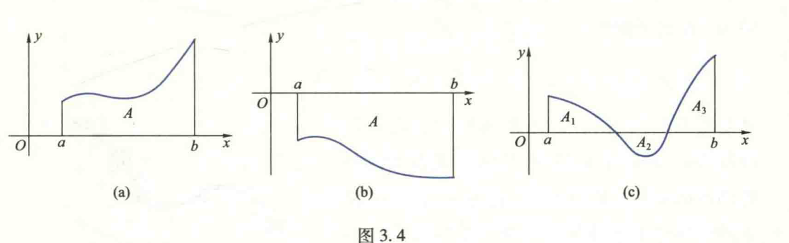

import ExerciseTrigger from '@/components/exercises/ExerciseTrigger.astro';
import QRCodeVideo from '@/components/QRCodeVideo.astro';

import Guide from '@/components/Guide.astro';
import Knowledge from '@/components/Knowledge.astro';
import Example from '@/components/Example.astro';
import Analysis from '@/components/Analysis.astro';
import Solution from '@/components/Solution.astro';
import Variant from '@/components/Variant.astro';
import Note from '@/components/Note.astro';
import SideNote from '@/components/SideNote.astro';
import Block from '@/components/Block.astro';
import Method from '@/components/Method.astro';
import Exercise from '@/components/Exercise.astro';

本节通过几个实例引出定积分的定义、几何意义以及定积分的存在条件，最后介绍定积分的几个常用性质。

### 1.1 定积分问题举例

在绪论中已经讲过求变速直线运动物体的位移问题。由于变速直线运动中位移随时间 $t$ 的变化是非均匀的。为了在均匀变化的基础上求从 $a$ 到 $b$ 这段时间内物体通过的位移，先将时间区间 $[a, b]$ 任意划分为若干小区间；在每个小区间内将位移随时间的变化近似看成均匀的，用小区间上任一点 $\xi_k$ 处的速度作为物体在该小区间上速度的近似值，求位移的近似值；再将各小区间内通过的位移近似值相加，求得区间 $[a, b]$ 内总位移的近似值；然后，令最大小区间长度 $d \to 0$，通过取极限，将物体在 $[a, b]$ 内通过的总位移的精确值 $s$ 归结为求下面的极限：

$$
s = \lim_{d \to 0} \sum_{k=1}^{n} v(\xi_k) \Delta t_k \tag{1.1}
$$

在实际问题中，还有很多几何量与物理量的计算都归结为求与 (1.1) 式具有同样形式的极限，下面再举两个例子：

<Example title="例 1.1 曲边梯形的面积问题">
如何计算曲边形的面积是一个古老而有实际意义的问题。大家知道，由平面上任一闭曲线所围成的曲边形（图 3.1）都可以用相互垂直的直线将它划分为若干个如图 3.2 所示的所谓“曲边梯形”，即由曲线 $y = f(x)$ 与直线 $x = a, x = b$ 及 $x$ 轴所围成的平面图形 $\textcircled{1}$（其中 $f$ 是 $[a, b]$ 上的非负连续函数）。因此，求曲边形面积的问题就归结为求曲边梯形的面积问题。

<figure class="vp-figure">
  
  <figcaption>图 3.1 闭曲线围成的曲边形</figcaption>
</figure>

<figure class="vp-figure">
  
  <figcaption>图 3.2 曲边梯形的划分</figcaption>
</figure>

如果在区间 $[a, b]$ 上，$f(x) = H$（$H$ 为正常数），那么曲边梯形便是一个高为 $H$ 的长方形，它的面积 $A$ 的大小仅与底边长度有关，随底边长度的变化而均匀变化。因此，只要用乘法就能求得面积 $A$：

$$
A = \text{底} \times \text{高} = (b - a)H \tag{1.2}
$$

然而，如果 $f(x) \neq \text{常数}$，那么曲边梯形的“高” $f(x)$ 随 $x$ 的变化而变化，因此，它的面积随底边长度的变化是非均匀的（即在不同点 $x$ 处，底边长度的改变量 $\Delta x$ 同时时，相应的曲边梯形面积的改变量 $\Delta A$ 不尽相同），不能直接用公式 (1.2) 来计算。

<SideNote title="思路分析">
早在公元前 3 世纪古希腊著名数学家 Archimedes 就采用内接多边形来逼近曲边形的方法计算由曲线 $y = x^2$、直线 $x = 1$ 和 $x$ 轴围成的曲边三角形的面积，他的方法已接近于现在的积分法。但他用的是等分底边 $[0, 1]$ 为若干个小区间，取函数 $y = x^2$ 在每个小区间右端点的值为小矩形的高，具有很大的特殊性和局限性。
</SideNote>

怎么办呢？经过众多数学家的长期努力，终于找到了一种解决方法。这种方法的基本思路是：将曲边梯形任意分割成若干小曲边梯形（图 3.2），从而 $[a, b]$ 也被划分为若干子区间。由于 $f$ 在 $[a, b]$ 上连续，所以在每个小曲边梯形中，“高” $f(x)$ 随 $x$ 的变化很小，可以近似地看成常数。在每个小曲边梯形的底边上任取一点，以 $f(x)$ 在该点的值为高作小矩形，这样每个小曲边梯形就可以近似地看作面积随底边长度均匀变化的小矩形，于是可利用由乘法求得的小矩形面积作为小曲边梯形面积的近似值。从而，所求曲边梯形的面积就近似地等于所有小矩形面积之和。而且，$[a, b]$ 被分割得越细，近似的程度就越好。当 $[a, b]$ 被无限细分，每个小曲边梯形底边的长度都趋于零时，这个近似值的极限就规定为曲边梯形的面积。具体步骤如下：

**分**：在区间 $(a, b)$ 内任意插入 $n-1$ 个点

$$
a = x_0 < x_1 < x_2 < \cdots < x_{n-1} < x_n = b,
$$
则区间 $[a, b]$ 被分割成 $n$ 个子区间。第 $k$ 个子区间的长度为
$$
\Delta x_k = x_k - x_{k-1}, \quad k = 1, 2, \cdots, n.
$$

**过**：各分点作平行 $y$ 轴的直线，曲边梯形就被分成 $n$ 个小曲边梯形；

**匀**：在第 $k$ 个子区间 $[x_{k-1}, x_k]$ 上任取一点 $\xi_k$，对应应用小曲边梯形的面积 $\Delta A_k$ 用底为 $\Delta x_k$、高为 $f(\xi_k)$ 的小矩形面积近似代替（图 3.2），则有
$$
\Delta A_k \approx f(\xi_k) \Delta x_k, \quad k = 1, 2, \cdots, n;
$$

**合**：将所有小曲边梯形面积的近似值相加得到曲边梯形面积 $A$ 的近似值
$$
A = \sum_{k=1}^{n} \Delta A_k \approx \sum_{k=1}^{n} f(\xi_k) \Delta x_k;
$$

**精**：当 $n$ 越大并且每个子区间的长度越小时，上面的表达式越精确。因此，当所有子区间长度的最大值 $d = \max_{1 \le k \le n} \{\Delta x_k\}$ 趋于零时，上述和式的极限就规定为曲边梯形的面积 $A$，即

$$
A = \lim_{d \to 0} \sum_{k=1}^{n} f(\xi_k) \Delta x_k \tag{1.3}
$$

---
$\textcircled{1}$ 若曲边梯形的一条底边退缩为一点，则称之为曲边三角形。
</Example>

<Example title="例 1.2 质量非均匀分布的细棒质量问题">
设有质量非均匀分布的细棒，长为 $l$。若已知细棒上各点的线密度 $\rho$，试求该细棒的质量 $m$。

如果质量在细棒上的分布是均匀的，就是说，细棒上各点的线密度 $\rho$ 是常数，那么细棒的质量可以用乘法求得，即

$$
m = \text{线密度} \times \text{棒长} = \rho l.
$$

现在，问题的困难在于质量是非均匀分布的，即密度 $\rho$ 不是常数。为了利用均匀分布情况上的上述公式来解决这个问题，先建立坐标系如图 3.3。此时，$\rho = \rho(x)$，并设它在 $[0, l]$ 上是连续函数。类似于例 1.1 的思路，将 $[0, l]$ 任意分割为若干子区间，在每个子区间上线密度 $\rho$ 的变化很小，可以近似地看成是常数。因此，可用每个子区间上任一点的密度作为该子区间上密度的近似值，就是说，质量的分布可近似看成均匀的。从而可以利用乘法求出在每个子区间内细棒质量的近似值，相加并通过取极限便可得到质量 $m$ 的精确值。求解步骤与例 1.1 类似。

<figure class="vp-figure">
  
  <figcaption>图 3.3 细棒的质量分布示意图</figcaption>
</figure>
</Example>

### 1.2 定积分的定义

<Knowledge title="定义 1.1 (定积分)">
设函数 $f$ 是定义在区间 $[a, b]$ 上的有界函数，在区间 $(a, b)$ 内任意插入 $n-1$ 个分点
$$
a = x_0 < x_1 < x_2 < \cdots < x_{n-1} < x_n = b, \tag{1.5}
$$

把 $[a, b]$ 分割成 $n$ 个子区间，第 $k$ 个子区间的长度为

$$
\Delta x_k = x_k - x_{k-1}, \quad k = 1, 2, \cdots, n.
$$
任取 $\xi_k \in [x_{k-1}, x_k]$，乘积 $f(\xi_k) \Delta x_k$ ($k = 1, 2, \cdots, n$)，把所有这些乘积相加得到和式
$$
\sum_{k=1}^n f(\xi_k) \Delta x_k.
$$
如果无论区间 $[a, b]$ 怎样分割，无论点 $\xi_k$ 怎样选取，当 $d = \max_{1 \le k \le n} \{\Delta x_k\} \to 0$ 时，该和式都趋于同一个常数，那么称函数 $f$ 在区间 $[a, b]$ 上可积，且称此常数为 $f$ 在区间 $[a, b]$ 上的定积分。记作 $\int_a^b f(x) \mathrm{d}x$，即
$$
\int_a^b f(x) \mathrm{d}x = \lim_{d \to 0} \sum_{k=1}^n f(\xi_k) \Delta x_k. \tag{1.6}
$$

</Knowledge>

称 $f$ 为被积函数，$x$ 为积分变量，$f(x) \mathrm{d}x$ 为被积式，$[a, b]$ 为积分区间，$a, b$ 分别为积分下限与上限，$\int$ 是积分符号。

对这个定义，还应注意以下几点：

(1) 在定义中，当所有子区间长度的最大值 $d \to 0$ 时，则子区间的个数 $n$ 必然趋于无穷大。但不能用 $n \to +\infty$ 来代替 $d \to 0$，因为对区间的分割是任意的，$n \to \infty$ 不能保证 $d \to 0$。

<SideNote title="思考">
二维码 3.1.1：定积分定义中的和式极限与函数极限有什么不同？
</SideNote>

(2) 在构造定义中的和式时，包含了两个任意性，即对区间的分割与 $\xi_k$ 的选取都是任意的。显然，对于区间的不同分割和 $\xi_k$ 的不同选取，得到的和式一般并非相同。定义要求无论区间如何分割以及点 $\xi_k$ 怎样选取，只有得到的不同的和式当 $d \to 0$ 时都要趋于同一个数，这样才说函数 $f$ 在 $[a, b]$ 上可积。换句话说，如果对区间的某两种不同分割或 $\xi_k$ 的两种不同选取得到的和式趋于不同的数，或者存在一个和式不能趋于一个确定的数，那么 $f$ 在该区间上必不可积。例如，Dirichlet 函数

$$
D(x) = \begin{cases} 1, & x \text{ 为有理数}, \\ 0, & x \text{ 为无理数}. \end{cases}
$$
在区间 $[0, 1]$ 上不可积。事实上，将区间 $[0, 1]$ 任意分为 $n$ 个子区间。若取 $\xi_k$ 为子区间 $[x_{k-1}, x_k]$ 中的有理数，则 $D(\xi_k) = 1$，从而有
$$
\lim_{d \to 0} \sum_{k=1}^n D(\xi_k) \Delta x_k = \lim_{d \to 0} \sum_{k=1}^n \Delta x_k = 1;
$$
若取 $\xi_k$ 为 $[x_{k-1}, x_k]$ 中的无理数，则 $D(\xi_k) = 0$，从而有
$$
\lim_{d \to 0} \sum_{k=1}^n D(\xi_k) \Delta x_k = 0.
$$
因此，$D(x)$ 在 $[0, 1]$ 上不可积。

<SideNote title="注意">
二维码 3.1.2：为什么定积分定义中强调两个任意性？
</SideNote>

<SideNote title="注意">
此例还表明有界是函数可积的必要条件，而不是充分条件。
</SideNote>

(3) 函数 $f$ 在区间 $[a, b]$ 上的定积分 $\int_a^b f(x) \mathrm{d}x$ 是一个确定的数，它的值仅与被积函数 $f$ 和积分区间 $[a, b]$ 有关，而与积分变量 $x$ 无关。因此，若积分变量 $x$ 改用其他字母（如用 $t$）表示，它的值不会改变，即
$$
\int_a^b f(x) \mathrm{d}x = \int_a^b f(t) \mathrm{d}t.
$$

根据定积分的定义，例 1.1 中的曲边梯形的面积与例 1.2 中细棒的质量可分别表示为定积分：
$$
A = \int_a^b f(x) \mathrm{d}x, \quad m = \int_0^l \rho(x) \mathrm{d}x,
$$
做变速直线运动物体在时间区间 $[a, b]$ 内通过的位移也可表示为定积分
$$
s = \int_a^b v(t) \mathrm{d}t.
$$

最后，对定积分再作两点补充规定：

(1) 当积分上限 $b$ 小于下限 $a$ 时，规定
$$
\int_a^b f(x) \mathrm{d}x = -\int_b^a f(x) \mathrm{d}x,
$$
这就是说，互换积分的上、下限，它的值要改变正负号。

<SideNote title="注意">
在定义 1.1 的和式中，$\Delta x_k$ 表示子区间的长度，故 $\Delta x_k > 0$。但当做了补充规定 (1) 之后，积分和式中的 $\Delta x_k$ 可正可负，故从 $a$ 到 $b$ 与从 $b$ 到 $a$ 的积分是不同的，相差一个符号！
</SideNote>

(2) 当 $a = b$ 时，规定 $\int_a^a f(x) \mathrm{d}x = 0$。

这样，对定积分上、下限的大小就没有什么限制了。

### 定积分的几何意义

由例 1.1 可知，当在 $[a, b]$ 上 $f(x) \ge 0$ 时，定积分 $\int_a^b f(x) \mathrm{d}x$ 的值等于由曲线 $y = f(x)$ 与直线 $x = a, x = b$ 及 $x$ 轴围成的曲边梯形的面积（图 3.4(a)），即
$$
\int_a^b f(x) \mathrm{d}x = A.
$$

<figure class="vp-figure">
  
  <figcaption>图 3.4 定积分的几何意义</figcaption>
</figure>

如果在 $[a, b]$ 上 $f(x) \le 0$，那么由曲线 $y = f(x)$，直线 $x = a, x = b$ 及 $x$ 轴围成的曲边梯形位于 $x$ 轴下方（图 3.4(b)）。此时，$f(\xi_k) \Delta x_k$ 的值为负，它的绝对值表示第 $k$ 个子区间上小曲边梯形面积的近似值。由于曲边梯形的面积总是正的，所以
$$
\int_a^b f(x) \mathrm{d}x = -A.
$$

<SideNote title="想一想">
利用定积分的几何意义求下列定积分的值：
(1) $\int_0^1 (x + 1) \mathrm{d}x$;
(2) $\int_0^\pi \cos x \mathrm{d}x$;
(3) $\int_0^1 \sqrt{1 - x^2} \mathrm{d}x$.
</SideNote>

当 $f(x)$ 在区间 $[a, b]$ 上变号时，以图 3.4(c) 为例，从直观上不难看出，定积分 $\int_a^b f(x) \mathrm{d}x$ 的值等于三个曲边梯形面积的代数和，即

$$
\int_a^b f(x) \mathrm{d}x = A_1 - A_2 + A_3.
$$

### 1.3 定积分的存在条件

下面讨论定义在区间 $[a, b]$ 上函数的可积条件。

由定积分定义知，$f$ 是定义在区间 $[a, b]$ 上的有界函数。将 $[a, b]$ 任意分割为 $n$ 个子区间 $[x_{k-1}, x_k]$ ($k=1, 2, \dots, n$)，$f$ 在 $[a, b]$ 上的定积分就是形如 (1.5) 式的和式的极限。设 $f$ 在子区间 $[x_{k-1}, x_k]$ 上的上、下确界分别为 $M_k$ 与 $m_k$，即

$$
M_k = \sup\{f(x) \mid x \in [x_{k-1}, x_k]\}, \quad m_k = \inf\{f(x) \mid x \in [x_{k-1}, x_k]\},
$$

称 $\omega_k = M_k - m_k$ 为 $f$ 在子区间 $[x_{k-1}, x_k]$ 上的振幅，和式

$$
S_n = \sum_{k=1}^n M_k \Delta x_k, \quad s_n = \sum_{k=1}^n m_k \Delta x_k
$$

分别称为 $f$ 关于该分割的 Darboux 大和与 Darboux 小和。如果在 $[a, b]$ 上，$f(x) \ge 0$，那么 Darboux 大和 $S_n$ 在几何上就表示在子区间 $[x_{k-1}, x_k]$ 上以 $M_k$ 为高所作的 $n$ 个小矩形构成的阶梯形的面积，Darboux 小和则表示在 $[x_{k-1}, x_k]$ 上以 $m_k$ 为高所作的 $n$ 个小矩形构成的阶梯形的面积，分别是以曲线 $y=f(x)$ 为曲边的曲边梯形的外包与内含的两个阶梯形的面积。它们的差

$$
S_n - s_n = \sum_{k=1}^n \omega_k \Delta x_k
$$

就是图 3.5 中的阴影部分面积。根据定义 1.1，函数 $f$ 在 $[a, b]$ 上可积，在几何上就表示该曲边梯形的面积可以求得，并且等于当 $[a, b]$ 被无限细分时上述外包与内含两个阶梯形面积的共同极限。因此，这两个阶梯形面积之差的极限应为零；反之也成立。由此启发，得到如下定理。

<Knowledge title="定理 1.1 (可积的充要条件)">
设函数 $f$ 在区间 $[a, b]$ 上有界，则 $f$ 在 $[a, b]$ 上可积的充要条件是：
$\forall \varepsilon > 0, \exists \delta > 0$, 当 $d < \delta$ 时，

$$
\sum_{k=1}^n \omega_k \Delta x_k < \varepsilon \tag{1.6}
$$

(证明从略)。
</Knowledge>

仔细分析不难发现，当 $f$ 属于下面两种情况之一时，(1.6) 式成立，从而 $f$ 在 $[a, b]$ 上可积。

第一种情况：任意分割 $[a, b]$，使最大子区间的长度 $d$ 充分小，$f$ 在每个子区间上的振幅 $\omega_k$ 都能任意小，小于任意给定的 $\varepsilon > 0$。例如，当 $f$ 是 $[a, b]$ 上的连续函数时就属于这种情况。事实上，我们有

<Knowledge title="定理 1.2">
若 $f \in C[a, b]$，则 $f$ 在 $[a, b]$ 上可积。
</Knowledge>

<Solution title="证明">
因为 $f$ 在 $[a, b]$ 上连续，所以在 $[a, b]$ 上一致连续。从而 $\forall \varepsilon > 0, \exists \delta > 0$，使得 $\forall x^{(1)}, x^{(2)} \in [a, b]$，当 $|x^{(1)} - x^{(2)}| < \delta$ 时，必有

$$
|f(x^{(1)}) - f(x^{(2)})| < \varepsilon.
$$

任意分割 $[a, b]$ 为 $n$ 个子区间 $[x_{k-1}, x_k]$ ($k=1, 2, \dots, n$)，使 $d < \delta$。根据闭区间上连续函数的性质，$\exists \xi_k^{(1)}, \xi_k^{(2)} \in [x_{k-1}, x_k]$，使

$$
f(\xi_k^{(1)}) = M_k, \quad f(\xi_k^{(2)}) = m_k,
$$

从而有

$$
\omega_k = f(\xi_k^{(1)}) - f(\xi_k^{(2)}) < \varepsilon, \quad \forall k=1, 2, \dots, n.
$$

故当 $d < \delta$ 时，必有

$$
\sum_{k=1}^n \omega_k \Delta x_k < \varepsilon \sum_{k=1}^n \Delta x_k = \varepsilon(b - a),
$$

由定理 1.1 知，$f$ 在 $[a, b]$ 上可积。
</Solution>

<SideNote title="想一想">
一致连续性在定理 1.2 的证明中起什么作用呢？
</SideNote>

第二种情况：当 $d$ 充分小时，虽然不能保证 $f$ 在每个子区间上的振幅 $\omega_k$ 都任意小，但使 $\omega_k$ 不能任意小的所有子区间长度之和可以小于任意给定的正数。例如，$f$ 在 $[a, b]$ 上只有有限个第一类间断点或者 $f$ 是 $[a, b]$ 上单调函数都属于这种情况。事实上，可以证明下面的定理（证明从略）。

<Knowledge title="定理 1.3">
如果有界函数 $f$ 在区间 $[a, b]$ 上只有有限个第一类间断点或者在 $[a, b]$ 上单调，则 $f$ 在 $[a, b]$ 上可积。
</Knowledge>

如果 $f$ 在 $[a, b]$ 上可积，那么在用定义计算它的定积分时，可对 $[a, b]$ 采用某些特殊的分割方法，$\xi_k$ 也可选用某些特殊点。

<Example title="例 1.3 用定义计算定积分 $\int_0^1 x^2 \mathrm{d}x$">
</Example>

<Solution title="解">
由于 $f(x) = x^2$ 在区间 $[0, 1]$ 上连续，因此可积。将 $[0, 1]$ 等分为 $n$ 个子区间 $[x_{k-1}, x_k]$，取 $\xi_k$ 为每个子区间的右端点，则有

$$
\Delta x_k = \frac{1}{n}, \quad \xi_k = \frac{k}{n} \quad (k=1, 2, \dots, n).
$$

所以

$$
\int_0^1 x^2 \mathrm{d}x = \lim_{d \to 0} \sum_{k=1}^n \xi_k^2 \Delta x_k = \lim_{n \to +\infty} \sum_{k=1}^n \left(\frac{k}{n}\right)^2 \frac{1}{n} = \lim_{n \to +\infty} \frac{1}{n^3} (1^2 + 2^2 + \dots + n^2)
$$

$$
= \lim_{n \to +\infty} \frac{n(n+1)(2n+1)}{6n^3} = \frac{1}{3}.
$$
</Solution>

在例 1.3 中，尽管被积函数 $f$ 相当简单，然而计算过程仍然比较复杂。可见，利用定义计算定积分是相当困难的。因此，研究定积分的性质，寻求简单可行的积分方法，就是本章的主要任务之一。

### 1.4 定积分的性质

定积分的上述定义是由德国数学家 Riemann 给出的，因此称为 **Riemann 积分**，简称 **R 积分**。为书写简便起见，将在区间 $[a, b]$ 上 Riemann 可积（即 Riemann 积分存在）的函数全体构成的集合记作 $\mathscr{R}[a, b]$。下面介绍 R 积分的几个常用的重要性质。

<Knowledge title="性质 1.1 (线性性质)">
设 $f, g \in \mathscr{R}[a, b], \alpha, \beta \in \mathbb{R}$，则 $\alpha f + \beta g \in \mathscr{R}[a, b]$，并且

$$
\int_a^b [\alpha f(x) + \beta g(x)] \mathrm{d}x = \alpha \int_a^b f(x) \mathrm{d}x + \beta \int_a^b g(x) \mathrm{d}x. \tag{1.7}
$$

这个性质可由定积分的定义和极限的运算法则直接得到。
</Knowledge>

<Knowledge title="性质 1.2 (单调性)">
设 $f, g \in \mathscr{R}[a, b]$，且 $f(x) \le g(x), \forall x \in [a, b]$，则

$$
\int_a^b f(x) \mathrm{d}x \le \int_a^b g(x) \mathrm{d}x.
$$

这个性质也可由定积分的定义直接得到，由此还可立即得到下面的推论：
</Knowledge>

<Knowledge title="推论 1.1">
设 $f \in \mathscr{R}[a, b]$，且 $m \le f(x) \le M, \forall x \in [a, b]$，其中 $m, M$ 是常数，则 $m(b-a) \le \int_a^b f(x) \mathrm{d}x \le M(b-a)$。
</Knowledge>

<SideNote title="想一想">
试证明定积分的线性性质和单调性。
</SideNote>

<SideNote title="注">
给定一个 $f \in \mathscr{R}[a, b]$，对应一个积分值 $\int_a^b f(x) \mathrm{d}x$，这就定义了 $\mathscr{R}[a, b]$ 到 $\mathbb{R}$ 的一个映射，即定义了 $\mathscr{R}[a, b]$ 上的一个泛函，记作 $F(f) = \int_a^b f(x) \mathrm{d}x$。此时，性质 1.2 可表示为，设 $f, g \in \mathscr{R}[a, b]$，且 $f \le g$，即 $F(f) \le F(g)$，即 $F(f)$ 单调增。
</SideNote>

<Knowledge title="性质 1.3">
设 $f \in \mathscr{R}[a, b]$，则 $|f| \in \mathscr{R}[a, b]$，且

$$
\left| \int_a^b f(x) \mathrm{d}x \right| \le \int_a^b |f(x)| \mathrm{d}x. \tag{1.8}
$$

</Knowledge>

<SideNote title="思路分析">
证明 $|f|$ 在 $[a, b]$ 上可积的核心在于利用振幅 $\omega_k$ 的性质。通过比较 $|f|$ 与 $f$ 在子区间上的振幅，建立不等式关系，进而利用 $f$ 的可积性推导出 $|f|$ 的可积性。
</SideNote>

首先，我们证明 $|f|$ 在 $[a, b]$ 上也可积。任意分割区间 $[a, b]$，用 $\omega_k(f)$ 与 $\omega_k(|f|)$ 分别表示 $f$ 与 $|f|$ 在子区间 $[x_{k-1}, x_k]$ 上的振幅。由于

$$
||f(x)| - |f(y)|| \le |f(x) - f(y)|, \quad \forall x, y \in [x_{k-1}, x_k] \tag{1.8}
$$

并且不难证明

$$
\omega_k(f) = \sup \{ |f(x) - f(y)|, x, y \in [x_{k-1}, x_k] \}
$$

所以 $\omega_k(|f|) \le \omega_k(f)$，从而有

$$
\sum_{k=1}^n \omega_k(|f|) \Delta x_k \le \sum_{k=1}^n \omega_k(f) \Delta x_k
$$

又因为 $f$ 在 $[a, b]$ 上可积，由定理 1.1 知，$\forall \varepsilon > 0, \exists \delta > 0$，当 $d < \delta$ 时，必有 $\sum_{k=1}^n \omega_k(f) \Delta x_k < \varepsilon$，从而

$$
\sum_{k=1}^n \omega_k(|f|) \Delta x_k < \varepsilon
$$

故 $|f|$ 在 $[a, b]$ 上可积。

为了证明不等式 (1.8)，只要注意到不等式

$$
-|f(x)| \le f(x) \le |f(x)|, \quad \forall x \in [a, b]
$$

再利用性质 1.2 即得

$$
-\int_a^b |f(x)| \mathrm{d}x \le \int_a^b f(x) \mathrm{d}x \le \int_a^b |f(x)| \mathrm{d}x
$$

从而知 (1.8) 式成立。

<Knowledge title="性质 1.4 (对区间的可加性)">
设 $I$ 是一个有限闭区间，$a, b, c \in I$。若 $f$ 在 $I$ 上可积，则 $f$ 在 $I$ 的任一子区间都可积，且

$$
\int_a^b f(x) \mathrm{d}x = \int_a^c f(x) \mathrm{d}x + \int_c^b f(x) \mathrm{d}x \tag{1.9}
$$

</Knowledge>

<Solution title="证明">
利用定理 1.1 不难证明 $f$ 在区间 $I$ 的任一个闭子区间上可积，下面证明等式 (1.9)。

设 $c$ 在 $(a, b)$ 内。由于 $f$ 在 $[a, b]$ 上可积，根据定义，任意分割区间 $[a, b]$ 所作的积分和式都趋于同一个数。因此，可以始终把 $c$ 作为一分点。这样，$f$ 在 $[a, b]$ 上的和式就等于它在 $[a, c]$ 上的和式与 $[c, b]$ 上的和式之和，即

$$
\sum_{[a,b]} f(\xi_k) \Delta x_k = \sum_{[a,c]} f(\xi_k) \Delta x_k + \sum_{[c,b]} f(\xi_k) \Delta x_k
$$

由于 $f$ 在子区间 $[a, c]$ 与 $[c, b]$ 上也可积，所以令 $d \to 0$ 就得到等式 (1.9)。

若 $c$ 在 $[a, b]$ 外，不妨设 $a < b < c$，则上面已证明的结论有

$$
\int_a^c f(x) \mathrm{d}x = \int_a^b f(x) \mathrm{d}x + \int_b^c f(x) \mathrm{d}x
$$

从而得

$$
\int_a^b f(x) \mathrm{d}x = \int_a^c f(x) \mathrm{d}x - \int_b^c f(x) \mathrm{d}x = \int_a^c f(x) \mathrm{d}x + \int_c^b f(x) \mathrm{d}x
$$

对于其他情况，可用同样方法证明。
</Solution>

<Knowledge title="性质 1.5 (乘积性性质)">
设 $f, g \in \mathcal{R}[a, b]$，则 $fg \in \mathcal{R}[a, b]$。
</Knowledge>

<Knowledge title="性质 1.6 (积分中值定理)">
设 $f \in C[a, b], g \in \mathcal{R}[a, b]$，且 $g$ 在 $[a, b]$ 上不变号，则至少存在一点 $\xi \in [a, b]$，使

$$
\int_a^b f(x)g(x) \mathrm{d}x = f(\xi) \int_a^b g(x) \mathrm{d}x \tag{1.10}
$$

</Knowledge>

<SideNote title="几何解释">
$\frac{\int_a^b f(x)g(x) \mathrm{d}x}{\int_a^b g(x) \mathrm{d}x}$ 介于 $f$ 在区间 $[a, b]$ 上的最大值与最小值之间，再利用连续函数的介值定理即可得出结论。
</SideNote>

<SideNote title="注意">
由于 $g$ 在 $[a, b]$ 上不变号，不妨设 $g \ge 0$。若 $g(x) \equiv 0, x \in [a, b]$，(1.10) 式显然成立；若 $g(x) \neq 0, x \in [a, b]$，则 $\int_a^b g(x) \mathrm{d}x > 0$。因此，证明的主要思想在于证明...
</SideNote>

<Solution title="证明">
设在 $[a, b]$ 上 $g(x) \ge 0, M = \max_{x \in [a, b]} \{f(x)\}, m = \min_{x \in [a, b]} \{f(x)\}$，则 $m \le f(x) \le M, \forall x \in [a, b]$。从而

$$
mg(x) \le f(x)g(x) \le Mg(x), \quad \forall x \in [a, b]
$$

故由性质 1.2 与性质 1.5，得

$$
m \int_a^b g(x) \mathrm{d}x \le \int_a^b f(x)g(x) \mathrm{d}x \le M \int_a^b g(x) \mathrm{d}x \tag{1.11}
$$

若 $\int_a^b g(x) \mathrm{d}x > 0$，上式两边同除以 $\int_a^b g(x) \mathrm{d}x$，得

$$
m \le \frac{\int_a^b f(x)g(x) \mathrm{d}x}{\int_a^b g(x) \mathrm{d}x} \le M
$$

由连续函数的介值定理知，至少存在一点 $\xi \in [a, b]$，使

$$
f(\xi) = \frac{\int_a^b f(x)g(x) \mathrm{d}x}{\int_a^b g(x) \mathrm{d}x}
$$

即

$$
\int_a^b f(x)g(x) \mathrm{d}x = f(\xi) \int_a^b g(x) \mathrm{d}x
$$

若 $\int_a^b g(x) \mathrm{d}x = 0$，则由 (1.11) 式，$\int_a^b f(x)g(x) \mathrm{d}x = 0$。因此，对于任何 $\xi \in [a, b]$，等式 (1.10) 都成立。综合上述情况，定理得证。
</Solution>

<QRCodeVideo id="3.1.2" title="改进积分中值定理（推论 1.2）" url="#" />

<Knowledge title="推论 1.2">
设 $f \in C[a, b]$，则至少存在一点 $\xi \in [a, b]$，使

$$
\int_a^b f(x) \mathrm{d}x = f(\xi)(b - a) \tag{1.12}
$$

</Knowledge>

<SideNote title="几何解释">
当 $f(x) \ge 0$ 时，推论 1.2 有着简单的几何意义（图 3.6）。它表明，若 $f$ 在 $[a, b]$ 上连续，则在区间 $[a, b]$ 中至少有一点 $\xi$，使得高为 $f(\xi)$ 底边长为 $b-a$ 的矩形面积恰好等于 $y=f(x)$ 为曲线的曲边梯形的面积。
</SideNote>

<figure class="vp-figure">
  
  <figcaption>图 3.6 积分中值定理的几何意义</figcaption>
</figure>

通常称

$$
\frac{1}{b-a} \int_a^b f(x) \mathrm{d}x
$$

为函数 $f$ 在区间 $[a, b]$ 上的积分中值。因此，很多书也称推论 1.2 为积分中值定理，而把性质 1.6 称为广义积分中值定理。

积分中值也叫积分均值，它是有限个算术平均值概念对连续函数概念的推广。大家知道，$n$ 个数 $y_1, y_2, \dots, y_n$ 的算术平均值为

$$
\bar{y} = \frac{y_1 + y_2 + \dots + y_n}{n} = \frac{1}{n} \sum_{k=1}^n y_k
$$

但是在很多实际问题中，还需要要求函数 $y=f(x)$ 在某区间 $[a, b]$ 上的平均值。例如，求一周内的平均气温、一段时间内气体的平均压强、交流电的平均电流等。如何定义连续函数 $y=f(x)$ 在区间 $[a, b]$ 上的平均值呢？

设 $f \in C[a, b]$，则 $f \in \mathcal{R}[a, b]$。将 $[a, b]$ 分割为 $n$ 个等长的子区间

$$
a = x_0 < x_1 < x_2 < \dots < x_n = b
$$

每个子区间的长度为 $\Delta x_k = \frac{b-a}{n}$。取 $\xi_k$ 为各子区间的右端点 $x_k$ ($k=1, 2, \dots, n$)，则对应的 $n$ 个函数值 $y_k = f(x_k)$ 的算术平均值为

$$
\bar{y}_n = \frac{1}{n} \sum_{k=1}^n y_k = \frac{1}{n} \sum_{k=1}^n f(x_k)
$$

<SideNote title="思路分析">
通过对函数在区间 $[a, b]$ 上更多采样点的函数值求平均，当采样点趋于无穷多时，该平均值即为函数在该区间上的平均值。
</SideNote>

$$
=\frac{1}{b-a} \sum_{k=1}^{n} f(x_k) \frac{b-a}{n} = \frac{1}{b-a} \sum_{k=1}^{n} f(x_k) \Delta x_k
$$

显然，$n$ 增大，$\overline{y}_n$ 就表示函数 $f$ 在 $[a, b]$ 上更多点处函数值的平均值。令 $n \to \infty$，$\overline{y}_n$ 的极限自然就定义为 $f$ 在 $[a, b]$ 上的平均值 $\overline{y}$，即

$$
\overline{y} = \lim_{n \to \infty} \overline{y}_n = \frac{1}{b-a} \lim_{n \to \infty} \sum_{k=1}^{n} f(x_k) \Delta x_k = \frac{1}{b-a} \int_{a}^{b} f(x) \mathrm{d}x \tag{1.13}
$$

因此，连续函数 $y=f(x)$ 在区间 $[a, b]$ 上的平均值就等于该函数在 $[a, b]$ 上的积分中值。

<Example title="例 1.4 正弦交流电流的平均值">
求正弦交流电流 $i(t) = I_{\mathrm{m}} \sin \omega t$ 在它的半个周期（即从 $t=0$ 到 $t=\frac{\pi}{\omega}$）内的平均值。
</Example>

<Solution title="解">
根据 (1.13) 式，电流的平均值为

$$
\overline{I} = \frac{1}{\frac{\pi}{\omega} - 0} \int_{0}^{\frac{\pi}{\omega}} i(t) \mathrm{d}t = \frac{\omega I_{\mathrm{m}}}{\pi} \int_{0}^{\frac{\pi}{\omega}} \sin \omega t \mathrm{d}t
$$

为了求 $\overline{I}$ 的具体数值，必须计算右端的定积分。但是，利用定义来求此定积分是比较复杂的（读者可尝试在 $\omega=1$ 的情况下用定义来计算）。因此，寻求简洁的积分法势在必行！
</Solution>

<ExerciseTrigger chapter={3} section="3.1" title="3.1 定积分的概念存在条件与性质 课后真题与自测练习" />
