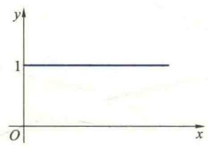
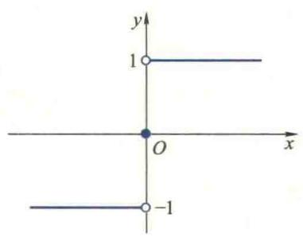
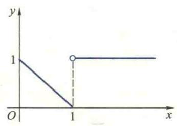
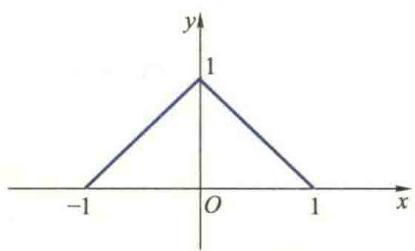

import ExerciseTrigger from '@/components/exercises/ExerciseTrigger.astro';
import QRCodeVideo from '@/components/QRCodeVideo.astro';

import Guide from '@/components/Guide.astro';
import Knowledge from '@/components/Knowledge.astro';
import Example from '@/components/Example.astro';
import Analysis from '@/components/Analysis.astro';
import Solution from '@/components/Solution.astro';
import Variant from '@/components/Variant.astro';
import Note from '@/components/Note.astro';
import Block from '@/components/Block.astro';
import Method from '@/components/Method.astro';
import Exercise from '@/components/Exercise.astro';

本节将在讲解微积分基本公式(即 Newton-Leibniz 公式)与基本定理的基础上,阐述微分与积分的关系,将定积分的计算问题转化为求被积函数的原函数或不定积分的问题,说明求积分是求微分的逆运算.

## 2.1 微积分基本公式

为了寻求计算定积分简便易行的方法,我们再来讨论已知速度求位移问题.第一节中已经讲过,如果已知变速直线运动的速度 $v = v(t)$ ,那么物体从时刻 t = a 到时刻

$t = b$ 所通过的位移为

$$
s = \int_ {a} ^ {b} v (t) \mathrm{d} t.
$$

另一方面,如果已知物体运动的位移函数 $s=s(t)$ ,那么在时间区间 $[a,b]$ 内物体所通过的位移也可表示为

$$
s = s (b) - s (a).
$$

因此,如果能从速度函数 $v(t)$ 求出位移函数 $s(t)$ ,那么就有

$$
\int_ {a} ^ {b} v (t) \mathrm{d} t = s (b) - s (a).
$$

这样, 定积分 $\int_{a}^{b} v(t) \, dt$ 的值就可由函数 $s = s(t)$ 在 t = b 与 t = a 的值之差得到. 问题的关键在于如何从 $v(t)$ 求得 $s(t)$ . 由于 $s'(t) = v(t)$ , 所以由 $v(t)$ 求 $s(t)$ 是求导运算的逆运算.

受上述问题的启发,人们得到计算定积分的一个基本公式.为了建立这个公式,先引入下面的概念:

<Knowledge title="定义 2.1 原函数">
如果在区间 I 上, $F'(x)=f(x)$ , 那么称 F 是 f 在 I 上的一个原函数.

由定义 2.1 易知, 位移函数 $s(t)$ 是速度函数 $v(t)$ 的一个原函数. 从而, 就可以从上述物理模型抽象出下面的著名公式:
</Knowledge>

<Knowledge title="定理 2.1 Newton-Leibniz 公式">
设 $f \in R[a, b]$ ，且 f 在区间 $[a, b]$ 上有一个原函数 F，则
</Knowledge>

共性常寓于个性之中,从某些特例出发,分析、发掘某些共性和规律,探索它是否具有一般性及可否被推广,是一种“合情推理”的思想方法.“合情推理”常用于“发现问题”,是研究数学的一种重要方法.但是这种“合情推理”是否正确,在数学中尚要通过逻辑推理来加以验证.本小段就采用了这种思想方法.

$$
\boxed {\int_ {a} ^ {b} f (x) \mathrm{d} x = F (b) - F (a) = F (x) \Bigg | _ {a} ^ {b}.}\tag{2.1}
$$

<Solution title="证明">
在区间 $[a, b]$ 内任意插入 $n - 1$ 个分点

$$
a = x _ {0} <   x _ {1} <   \dots <   x _ {n} = b,
$$

那么， $[a,b]$ 就被分割为 n 个子区间 $\left[x_{k-1},x_{k}\right](k=1,2,\cdots,n)$ . 根据 Lagrange 中值定理，必存在 $\xi_{k}\in(x_{k-1},x_{k})$ ，使

$$
F (x _ {k}) - F (x _ {k - 1}) = F ^ {\prime} (\xi_ {k}) \Delta x _ {k}.
$$

所以

$$
F (b) - F (a) = \sum_ {k = 1} ^ {n} [ F (x _ {k}) - F (x _ {k - 1}) ]
$$

$$
= \sum_ {k = 1} ^ {n} F ^ {\prime} (\xi_ {k}) \Delta x _ {k} = \sum_ {k = 1} ^ {n} f (\xi_ {k}) \Delta x _ {k}.
$$

由于 $f \in \mathcal{R}[a, b]$ ，在上式中令 $d = \max_{1 \leqslant k \leqslant n} \{\Delta x_k\} \to 0$ ，即得

$$
F (b) - F (a) = \int_ {a} ^ {b} f (x) \mathrm{d} x.
$$

Newton-Leibniz 公式(2.1)将定积分的计算问题归结为求被积函数 f 在区间 $[a,b]$ 上的一个原函数问题,而求 f 在 $[a,b]$ 上的原函数 F 是求导运算的逆运算,因此,该公式将定积分的计算与求导运算联系了起来,常称为微积分基本公式.
</Solution>

<Example title="例 2.1">
求下列定积分：

(1) $\int_{0}^{1}\frac{dx}{1+x^{2}};$ (2) $\int_{0}^{\frac{\pi}{2}}\sin^{2}\frac{x}{2}dx.$

<Solution title="解">
（1）由于 $(\arctan x)' = \frac{1}{1 + x^2}$ ，所以 $\arctan x$ 是 $\frac{1}{1 + x^2}$ 的一个原函数。根据 Newton-Leibniz 公式，

$$
\int_ {0} ^ {1} \frac {\mathrm{d} x}{1 + x ^ {2}} = \arctan x \Bigg | _ {0} ^ {1} = \frac {\pi}{4}.
$$

（2）由于 $\sin^2\frac{x}{2} = \frac{1}{2} (1 - \cos x)$ ，并且， $\frac{1}{2} (x - \sin x)$ 是 $\frac{1}{2} (1 - \cos x)$ 的一个原函数，故由Newton-Leibniz公式，得

$$
\begin{array}{r l} \int_ {0} ^ {\frac {\pi}{2}} \sin^ {2} \frac {x}{2} \mathrm{d} x & = \frac {1}{2} \int_ {0} ^ {\frac {\pi}{2}} (1 - \cos x) \mathrm{d} x \\ & = \frac {1}{2} (x - \sin x) \Bigg | _ {0} ^ {\frac {\pi}{2}} = \frac {1}{2} \left(\frac {\pi}{2} - 1\right). \end{array}
$$

为了求出例1.4中的平均电流 $\overline{I}$ 必须计算定积分 $\int_0^{\frac{\pi}{\omega}}\sin \omega t\mathrm{d}t.$ 由于 $\left(-\frac{1}{\omega}\cos \omega t\right)' = \sin \omega t,$

所以 $-\frac{1}{\omega}\cos \omega t$ 是 $\sin \omega t$ 的一个原函数.根据Newton-Leibniz公式，得知

$$
\bar {I} = \frac {\omega I _ {\mathrm{m}}}{\pi} \left(- \frac {1}{\omega} \cos \omega t\right) \Bigg | _ {0} ^ {\frac {\pi}{\omega}} = \frac {2}{\pi} I _ {\mathrm{m}}.
$$

为了利用 Newton-Leibniz 公式计算定积分, 被积函数 f 必须有原函数存在并且能求出它的一个原函数. 自然要问: f 满足什么条件才有原函数? 如何求 f 的原函数? 首先讨论第一个问题.
</Solution>
</Example>

## 2.2 微积分基本定理

设函数 $f: [a, b] \to \mathbf{R}$ 可积，则对任意的 $x \in [a, b]$ ， $f$ 在 $[a, x]$ 上也可积。对于区间 $[a, b]$ 上任取一值 $x$ ，定积分 $\int_{a}^{x} f(x) \, \mathrm{d}x$ 就有唯一确定的值与它相对应。因此，该积分在区间 $[a, b]$ 上确定了一个函数 $\Phi: [a, b] \to \mathbf{R}$ ，即

$$
\Phi (x) = \int_ {a} ^ {x} f (x) \mathrm{d} x.
$$

该积分的上限 x 与积分变量 x 的含义不同.积分上限 x 表示积分区间 $[a, x]$ 的右端点,而积分变量 x 则在区间 $[a, x]$ 中变化.为避免混淆,常把积分变量改用其他字母表示.例如换成 t,则上式变为

$$
\Phi (x) = \int_ {a} ^ {x} f (t) \mathrm{d} t, \quad x \in [ a, b ],\tag{2.2}
$$

通常称它为变上限积分.

<Knowledge title="定理 2.2 微积分第一基本定理">
设 $f \in C[a, b]$ ，则由（2.2）式所确定的函数 $\Phi: [a, b] \to R$ 在 $[a, b]$ 上可导，并且

$$
\Phi^ {\prime} (x) = \frac {\mathrm{d}}{\mathrm{d} x} \int_ {a} ^ {x} f (t) \mathrm{d} t = f (x).\tag{2.3}
$$

若其中的 x 为区间 $[a, b]$ 的端点，则 $\Phi'(x)$ 是单侧导数.

<Solution title="证明">
设 $x \in (a, b)$ , 由于

<QRCodeVideo id="3.2.1" title="微积分第一基本定理的重要意义." url="http://2d.hep.cn/1254051/34" />

$$
\begin{array}{r l} \Delta \Phi & = \Phi (x + \Delta x) - \Phi (x) = \int_ {a} ^ {x + \Delta x} f (t) \mathrm{d} t - \int_ {a} ^ {x} f (t) \mathrm{d} t \\ & = \int_ {a} ^ {x + \Delta x} f (t) \mathrm{d} t + \int_ {x} ^ {a} f (t) \mathrm{d} t = \int_ {x} ^ {x + \Delta x} f (t) \mathrm{d} t, \end{array}
$$

根据积分中值定理,在 x 与 $x+\Delta x$ 之间(含 x 和 $x+\Delta x$ ) 至少存在一个 $\xi$ , 使得

$$
\Delta \Phi = f (\xi) \Delta x.
$$

已知f是 $[a,b]$ 上的连续函数,所以

$$
\Phi^ {\prime} (x) = \lim _ {\Delta x \to 0} \frac {\Delta \Phi}{\Delta x} = \lim _ {\Delta x \to 0} f (\xi) = f (x).
$$

若 x 是区间 $[a, b]$ 的端点，则可类似地证明.

定理 2.2 的重要意义在于它建立了微分(导数)与积分之间的联系. 它表明, 变上限积分是上限的一个函数, 该积分对上限的导数等于被积函数在上限处的值. 由这个定理立即得到原函数存在的一个充分条件.

<QRCodeVideo id="3.2.2" title="函数的连续性、可积性与其原函数的存在性之间的联系." url="http://2d.hep.cn/1254051/52" />
</Solution>
</Knowledge>

<Knowledge title="推论 2.1">
设 $f \in C[a, b]$ ，则 f 在区间 $[a, b]$ 上必有原函数，且变上限积分 (2.2) 就是它的一个原函数.
</Knowledge>

<Example title="例 2.2">
设 $\Phi(x)=\int_{0}^{\sqrt{x}}\cos t^{2}\mathrm{d}t$ ，求 $\Phi'(x)$ .

<Solution title="解">
由于函数 $\Phi(x)$ 可以看作 $g(u) = \int_{0}^{u}\cos t^2\mathrm{d}t$ 与 $u = \varphi(x) = \sqrt{x}$ 的复合函数, 根据链式法则与定理 2.2 得

$$
\Phi^ {\prime} (x) = g ^ {\prime} (u) \varphi^ {\prime} (x) = \frac {\mathrm{d}}{\mathrm{d} u} \left(\int_ {0} ^ {u} \cos t ^ {2} \mathrm{d} t\right) \cdot \frac {1}{2 \sqrt {x}} = \cos u ^ {2} \cdot \frac {1}{2 \sqrt {x}} = \frac {1}{2 \sqrt {x}} \cos x.
$$

一般地，若 $\varphi (x)$ 与 $\psi (x)$ 是可导函数， $f$ 连续，不难证明：

$$
\begin{array}{r l} & {\frac {\mathrm{d}}{\mathrm{d} x} \Big (\int_ {\psi (x)} ^ {\varphi (x)} f (t) \mathrm{d} t \Big)} \\ & {= f (\varphi (x)) \varphi^ {\prime} (x) - f (\psi (x)) \psi^ {\prime} (x).} \end{array}
$$
</Solution>
</Example>

<Example title="例 2.3">
求 $\lim_{x\to 0}\frac{\int_{\cos x}^{1}\mathrm{e}^{-t^2}\mathrm{d}t}{\sin^2x}.$

(2.4)

<Solution title="解">
此题为 $\frac{0}{0}$ 型不定式, 可用 L'Hospital 法则计算. 由公式(2.4),

$$
\frac {\mathrm{d}}{\mathrm{d} x} \left(\int_ {\cos x} ^ {1} \mathrm{e} ^ {- t ^ {2}} \mathrm{d} t\right) = - \mathrm{e} ^ {- \cos^ {2} x} (- \sin x) = \sin x \mathrm{e} ^ {- \cos^ {2} x}.
$$
</Solution>
</Example>

变上限积分对上限的导数并不等于被积函数, 而是等于被积函数在上限处的值. 例如 $\frac{\mathrm{d}}{\mathrm{d}(x^{2})}\int_{0}^{x^{2}}\mathrm{e}^{t}\mathrm{d}t=\mathrm{e}^{x^{2}}$ , 这从定理 2.2 的证明中容易看出. 事实上, 该定理在证明的最后一个等式 $\lim_{\Delta x\to0}f(\xi)=f(x)$ 中的 x 是积分 $\int_{x}^{x+\Delta x}f(t)\mathrm{d}t$ 的下限, 也就是原积分 $\int_{a}^{x}f(t)\mathrm{d}t$ 的上限.

所以

$$
\text {   原式   } = \lim _ {x \to 0} \frac {\sin x \mathrm{e} ^ {- \cos^ {2} x}}{2 \sin x \cos x} = \frac {1}{2 \mathrm{e}}.
$$

根据原函数的定义,如果 F 是 f 在区间 I 上的一个原函数,C 是任意常数,那么 $F+C$ 也是 f 在 I 上的原函数.因此,若 f 在 I 上有原函数,则其原函数就不止一个.由于 C 的任意性,f 的原函数有无穷多个.试问, $F+C$ (C 为任意常数)是否包含了 f 的所有原函数呢?下面的定理回答了这个问题.

<Knowledge title="定理 2.3 微积分第二基本定理">
设 F 是 f 在区间 I 上的一个原函数, C 为任意常数, 则 $F + C$ 就是 f 在 I 上的所有原函数.

<Solution title="证明">
用 A 表示 f 在 I 上的一切形如 $F + C$ 的原函数构成的集合, 即

$A = \{F + C \mid F \text{ 是 } f \text{ 在 } I \text{ 上的一个原函数, } C \text{ 为任意常数}\}$ ,

B 表示 f 在 I 上所有原函数构成的集合, 即

$$
B = \{G \mid G ^ {\prime} (x) = f (x), x \in I \}.
$$

为证明此定理,只需证明 A=B.事实上, $A\subseteq B$ 是显然的,下面证明 $B\subseteq A$ .任取 $G\in B$ ,由于

$$
[ G (x) - F (x) ] ^ {\prime} = G ^ {\prime} (x) - F ^ {\prime} (x) = 0, \quad x \in I,
$$

由Lagrange定理的推论4.2，可知 $G(x) - F(x)$ 在 $I$ 上是一个常数，即

$$
G (x) - F (x) = C, \quad x \in I,
$$

或 $G(x)=F(x)+C$ , 故 $G\in A$ , 从而 $B\subseteq A$ .

根据集合相等的定义知 A=B.
</Solution>
</Knowledge>

微积分第二基本定理给出了 f 在 I 上所有原函数的一般表达式. 只要求出 f 的一个原函数 F, 其他原函数都可由表达式 $F + C$ 通过适当选择常数 C 得到.

<QRCodeVideo url="http://2d.hep.cn/1254051/35" />

<Example title="例 2.4">
求 $f(x)=2x$ 的一个原函数 $F(x)$ ，使它满足条件 $F(0)=1$ .

<Solution title="解">
由于 $x^{2}$ 是 $2x$ 的一个原函数, 所以 $2x$ 的所有原函数可表示为

$$
F (x) = x ^ {2} + C \quad (C \text {为任意常数}).
$$

代入条件 $F(0)=1$ ，得 C=1，故所求原函数为

$$
F (x) = x ^ {2} + 1.
$$

二维码 3.2.3
能否用 Newton-Leibniz 公式求分段连续函数的定积分.

应当注意,如果被积函数f在区间 $[a,b]$ 上是分段连续的(即除去有限个第一类间断点外,f在 $[a,b]$ 上连续),那么,虽然f在 $[a,b]$ 上可积,但是,可以证明它在 $[a,b]$ 上不存在原函数(参见二维码3.2.2).因此,Newton-Leibniz公式不能直接应用.在这种情况下,先利用 $f(x)$ 在 $[a,b]$ 上的间断点将该区间分为若干个子区间,在使f连续的每个子区间上分别用Newton-Leibniz公式,再利用定积分对区间的可加性,把每个子区间上的积分值相加便可得到 $f(x)$ 在区间 $[a,b]$ 上的定积分.
</Solution>
</Example>

<Example title="例 2.5">
设 $f(x) = \begin{cases} x^2, & x \in [0,1), \\ 1 + x, & x \in [1,2], \end{cases}$ 求 $\int_0^2 f(x)\mathrm{d}x.$
</Example>

(1) $\frac{1}{3} x^3$ 是例2.5中的 $f(x)$ 在[0,1]区间上的原函数吗？

<Solution title="解">
由于 x=1 是该函数的跳跃间断点, 所以, f 是 $[0,2]$ 上的分段连续函数, 不能直接应用 Newton-Leibniz 公式, 而要用上述方法来计算.

(2) 等式 $\int_{0}^{1}f(x)\mathrm{d}x=\frac{1}{3}x^{3}\bigg|_{0}^{1}$ 为什么成立？

$$
\begin{array}{r l} \int_ {0} ^ {2} f (x) \mathrm{d} x & = \int_ {0} ^ {1} f (x) \mathrm{d} x + \int_ {1} ^ {2} f (x) \mathrm{d} x \\ & = \int_ {0} ^ {1} x ^ {2} \mathrm{d} x + \int_ {1} ^ {2} (1 + x) \mathrm{d} x \\ & = \frac {1}{3} x ^ {3} \bigg | _ {0} ^ {1} + \left(x + \frac {x ^ {2}}{2}\right) \bigg | _ {1} ^ {2} = 2 \frac {5}{6}. \end{array}
$$
</Solution>

## 2.3 不定积分

<Knowledge title="定义 2.2 不定积分">
函数 f 在区间 I 上的所有原函数的一般表达式称为 f 在 I 上的不定积分，记作 $\int f(x) \, dx$ ，其中 f 称为被积函数， $f(x) \, dx$ 称为被积式.

若 $F$ 是 $f$ 在 $I$ 上的一个原函数，则

$$
\int f (x) \mathrm{d} x = F (x) + C,
$$

其中任意常数 C 称为积分常数.例如，

$$
\int 2 x \mathrm{d} x = x ^ {2} + C, \quad \int \cos x \mathrm{d} x = \sin x + C.
$$
</Knowledge>

我们已经知道,求导数与求不定积分(或原函数)是两种互逆运算,前者是由原函数求导函数,后者是由导函数求原函数.以变速直线运动为例,前者是已知物体的运动规律(位移函数 $s=s(t)$ )求变化率(速度函数 $v=v(t)$ ),而后者则是已知变化率求运动规律.不定积分的下述性质(证明留给读者)进一步揭示了这种互逆性.

<Knowledge title="性质 2.1">
$$
\left(\int f (x)   \mathrm{d} x\right) ^ {\prime} = f (x) \quad \text {或} \quad \mathrm{d} \int f (x)   \mathrm{d} x = f (x)   \mathrm{d} x,\tag{2.5}
$$

$$
\int f ^ {\prime} (x) \mathrm{d} x = f (x) + C \quad \text {或} \quad \int \mathrm{d} f (x) = f (x) + C.\tag{2.6}
$$
</Knowledge>

根据积分和微分(或导数)的这种互逆关系,可以在求导公式和运算法则(有理运算与复合求导运算法则)的基础上反过来得到对应的积分公式和运算法则.

$|x|$ 是分段函数 $f(x)=\left\{\begin{aligned}-1,x&<0,\\ 1,x&\geqslant0\end{aligned}\right.$

首先,由基本导数表可得基本积分表:

的原函数吗？

<table><tr><td> $\int k\mathrm{d}x = kx + C$ (k为常数)</td><td> $\int a^{x}\mathrm{d}x = \frac{a^{x}}{\ln a} + C$ (a&gt;0,a≠1)</td></tr><tr><td> $\int x^{\alpha}\mathrm{d}x = \frac{x^{\alpha+1}}{\alpha+1} + C$ (α≠-1)</td><td> $\int e^{x}\mathrm{d}x = e^{x} + C$ </td></tr><tr><td> $\int \frac{\mathrm{d}x}{x} = \ln |x| + C$ </td><td> $\int \cos x\mathrm{d}x = \sin x + C$ </td></tr></table>

$\begin{array}{l}\int \sin x\mathrm{d}x = -\cos x + C\\ \int \sec^2 x\mathrm{d}x = \tan x + C\\ \int \csc^2 x\mathrm{d}x = -\cot x + C\\ \int \sec x\tan x\mathrm{d}x = \sec x + C\\ \int \csc x\cot x\mathrm{d}x = -\csc x + C \end{array}$

这些基本积分公式是求不定积分的基础,读者必须熟记,切想一想:
不可与求导公式混淆.
怎样理解积分公式

其次,与导数的线性运算法则对应,有不定积分的线性运算法则. $\int\frac{dx}{x}=\ln|x|+C?$

<Knowledge title="性质 2.2">
设 f 与 g 在区间 I 上的原函数存在, 则

$$
\int \left[ \alpha f (x) + \beta g (x) \right] \mathrm{d} x = \alpha \int f (x) \mathrm{d} x + \beta \int g (x) \mathrm{d} x,\tag{2.7}
$$

其中 $\alpha$ 与 $\beta$ 为任意常数.

<Solution title="证明">
根据不定积分的定义, 只要证明等式(2.7)两边求导后所得到的函数相同即可. 事实上, 由性质2.1,

$$
\left(\int [ \alpha f (x) + \beta g (x) ] \mathrm{d} x\right) ^ {\prime} = \alpha f (x) + \beta g (x).
$$

又

$$
\left(\alpha \int f (x) \mathrm{d} x + \beta \int g (x) \mathrm{d} x\right) ^ {\prime} = \alpha \left(\int f (x) \mathrm{d} x\right) ^ {\prime} + \beta \left(\int g (x) \mathrm{d} x\right) ^ {\prime} = \alpha f (x) + \beta g (x),
$$

故

$$
\int \left[ \alpha f (x) + \beta g (x) \right] \mathrm{d} x = \alpha \int f (x) \mathrm{d} x + \beta \int g (x) \mathrm{d} x.
$$
</Solution>
</Knowledge>

<Example title="例 2.6">
求 $\int \frac{2x + \sqrt{x} + 1}{x}\mathrm{d}x.$

<Solution title="解">
由性质2.2和基本积分表得

$$
\begin{array}{r l} \int \frac {2 x + \sqrt {x} + 1}{x} \mathrm{d} x & = 2 \int \mathrm{d} x + \int \frac {\mathrm{d} x}{\sqrt {x}} + \int \frac {1}{x} \mathrm{d} x \\ & = 2 x + 2 \sqrt {x} + \ln | x | + C. \end{array}
$$
</Solution>
</Example>

<Example title="例 2.7">
求 $\int \frac{1 + 2x^2}{x^2(1 + x^2)}\mathrm{d}x.$
</Example>

例 2.6 中的积分被分为三项后,每一个不定积分的结果中都应有一任意常数.由于三个任意常数之和仍是一个任意常数,所以最后的结果只写一个任意常数就行了.今后遇到这种情况均照此办理,不再一一说明,但应切记千万不能丢掉任意常数 C!

<Solution title="解">
由于 $1 + 2x^{2} = x^{2} + (1 + x^{2})$ ，所以

$$
\int \frac {1 + 2 x ^ {2}}{x ^ {2} (1 + x ^ {2})} \mathrm{d} x = \int \frac {1}{1 + x ^ {2}} \mathrm{d} x + \int \frac {1}{x ^ {2}} \mathrm{d} x = \arctan x - \frac {1}{x} + C.
$$
</Solution>

<Example title="例 2.8">
求 $\int \frac{\mathrm{d}x}{\sin^2 x \cos^2 x}$ .

<Solution title="解">
根据三角恒等式 $\sin^2 x + \cos^2 x = 1$ 得

$$
\int \frac {\mathrm{d} x}{\sin^ {2} x \cos^ {2} x} = \int \frac {\sin^ {2} x + \cos^ {2} x}{\sin^ {2} x \cos^ {2} x} \mathrm{d} x = \int \sec^ {2} x \mathrm{d} x + \int \csc^ {2} x \mathrm{d} x = \tan x - \cot x + C.
$$

由于定积分与不定积分的计算都归结为求被积函数的原函数,因此,求定积分与不定积分的方法统称为积分法.
</Solution>
</Example>

<Block title="习题3.2">
**（A）**

1. 函数 $f$ 在区间 $[a, b]$ 上的定积分与原函数有何区别与联系？试通过在区间 $[0, 1]$ 上的函数 $f(x) = x$ 的定积分与原函数说明之.

2. 证明: $\sin^2 x, -\cos^2 x$ 与 $-\frac{1}{2} \cos 2x$ 都是同一个函数的原函数. 你能解释为什么同一个函数的原函数在形式上的这种差异吗?

3. 用 Newton-Leibniz 公式计算下列定积分：

(1) $\int_0^1 4x^2\mathrm{d}x;$

(2) $\int_{1}^{e}\frac{dx}{x};$

(3) $\int_0^\pi \sin x\mathrm{d}x;$

(4) $\int_{-1}^{1}|x|\mathrm{d}x;$

(5) $\int_{0}^{\frac{\pi}{3}}\left(\frac{\sqrt{3}}{2}\cos x - \frac{1}{2}\sin x\right)\mathrm{d}x;$

(6) 设 $f(x)=\left\{\begin{aligned}x,&\quad x\leqslant0,\\ x^{2},&\quad x>0,\end{aligned}\right.$ 求 $\int_{-1}^{1}f(x)\mathrm{d}x$ ;

(7) $\int_{1}^{2}\left(x^{2} + \frac{8}{x^{2}}\right)\mathrm{d}x;$

(8) $\int_{0}^{\frac{\pi}{4}}\tan^{2}t\mathrm{d}t.$

4. 求下列各函数的导数：

(1) $f(x)=\int_{0}^{x}\arctan t dt;$

(2) $f(x) = \int_{x}^{b}\frac{\mathrm{d}t}{1 + t^{4}};$

(3) $F(x) = \int_{0}^{\sqrt{x}} e^{t^2} dx;$

(4) $F(x) = \int_{\sin x}^{0}\frac{t}{1 - t^2}\mathrm{d}t;$

(5) $y = \int_{\sqrt{x}}^{\sqrt{x}} \ln (1 + t^6) \, \mathrm{d}t;$

(6) $y = \int_{\sin x}^{\cos x} \cos (\pi t^2) \, \mathrm{d}t;$

(7) $y = \int_{x^2}^{x^3}(x + t)\varphi(t)\mathrm{d}t$ , 其中 $\varphi$ 为连续函数.

(1)

5. 指出下列运算中有无错误, 错在何处:

(1) $\frac{\mathrm{d}}{\mathrm{d}x}\left(\int_{0}^{x^2}\sqrt{t + 1}\mathrm{d}t\right) = \sqrt{x^2 + 1};$ (2) $\int_0^{x^2}\left(\frac{\mathrm{d}}{\mathrm{d}t}\sqrt{t + 1}\right)\mathrm{d}t = \sqrt{x^2 + 1};$

(3) $\int_{-1}^{1}\frac{\mathrm{d}x}{x} = \ln |x|\bigg|_{-1}^{1} = 0;$

(4) $\int_{0}^{2\pi}\sqrt{1 - \cos^2x}\mathrm{d}x = \int_{0}^{2\pi}\sin x\mathrm{d}x = -\cos x\Bigg|_{0}^{2\pi} = 0.$

6. 求由参数方程

$$
x = \int_ {0} ^ {t} \sin^ {2} u \mathrm{d} u, \qquad y = \int_ {0} ^ {t ^ {2}} \cos \sqrt {u} \mathrm{d} u
$$

所确定的函数 $y=f(x)$ 的一阶导数.

7. 求由方程

$$
\int_ {0} ^ {y} \mathrm{e} ^ {t ^ {2}} \mathrm{d} t + \int_ {0} ^ {x ^ {2}} t \mathrm{e} ^ {t} \mathrm{d} t = 0
$$

所确定的隐函数 $y=f(x)$ 的一阶导数.

8. 设 $y=f(x)$ 的图像如图所示, 画出函数

$$
F (x) = \int_ {0} ^ {x} f (t) \mathrm{d} t
$$

的图像.

  
(2)

(3)  

(4)  
  
(第8题图)

9. 求下列极限：

(1) $\lim_{x\to 0}\frac{\int_0^x\sin t^2\mathrm{d}t}{\sin^3x};$

$$
\lim _ {x \rightarrow + \infty} \frac {\int_ {0} ^ {x} (\arctan t) ^ {2} \mathrm{d} t}{\sqrt {x ^ {2} + 1}}.
$$

10. 求函数 $y = \int_{0}^{x}\sqrt{t}(t - 1)(t + 1)^2\mathrm{d}t$ 的定义域、单调区间和极值点.

11. 设 $f(x) = \begin{cases} x^2, & x \leqslant 0, \\ \sin x, & x > 0. \end{cases}$

(1) 求函数 $F(x) = \int_{0}^{x} f(t) \, dt;$ (2) 讨论函数 $F(x)$ 连续性和可导性.

12. 如果函数 f 在有限区间 I 上连续, F 为 f 在 I 上的一个原函数, 试问下列式子哪些正确? 哪些不正确? 为什么?

(1) $\int_{a}^{x}f(t)\mathrm{d}t=F(x)+C$ （其中a为I中一点，C为一个常数）；
(2) $\frac{\mathrm{d}}{\mathrm{d}x}\int f(t)\mathrm{d}t=F'(x);$ (3) $\int f(x)\mathrm{d}x=\int_{a}^{x}f(t)\mathrm{d}t+C$ (C为任意常数);
(4) $\frac{\mathrm{d}}{\mathrm{d}x}\int f(t)\mathrm{d}t=\frac{\mathrm{d}}{\mathrm{d}x}\int f(x)\mathrm{d}x;$ (5) $\int_{a}^{x}F'(x)\mathrm{d}x=\int F'(x)\mathrm{d}x;$

$$
\int_ {0} ^ {x} F ^ {\prime} (x) \mathrm{d} x = F (x)
$$

13. 求下列不定积分：
(1) $\int\frac{3x+5}{\sqrt{x}}dx;$ (2) $\int\frac{x^{2}-1}{x-1}dx;$ (3) $\int\frac{3x^{2}}{1+x^{2}}dx;$ (4) $\int2^{x-1}e^{x}dx;$ (5) $\int\tan^{2}xdx;$ (6) $\int\frac{\cos 2t}{\cos^{2}t\sin^{2}t}dt.$

14. 设 $f$ 在 $[a, b]$ 上连续，在 $(a, b)$ 内可导，并且在 $(a, b)$ 内， $f'(x) \leqslant 0$ . 证明

$$
F (x) = \frac {1}{x - a} \int_ {a} ^ {x} f (t) \mathrm{d} t \quad (x \in (a, b))
$$

在 $(a,b)$ 内单调减.

**（B）**

1. 设 $f$ 在区间 $[a, b]$ 上可积，证明函数 $F(x) = \int_{a}^{x} f(t) \mathrm{d}t$ 在 $[a, b]$ 上连续.

2. 试确定 a, b 的值, 使

$$
\lim _ {x \rightarrow 0} \frac {\int_ {0} ^ {x} \frac {t ^ {2}}{\sqrt {a + t}} \mathrm{d} t}{b x - \sin x} = 1.
$$

3. 设函数 f 在 x=1 的邻域内可导，且 $f(1)=0, \lim_{x\to1}f'(x)=1$ ，计算

$$
\lim _ {x \rightarrow 1} \frac {\int_ {1} ^ {x} \left(t \int_ {t} ^ {1} f (u) \mathrm{d} u\right) \mathrm{d} t}{(1 - x) ^ {3}}.
$$

4. 证明推论1.2中的 $\xi$ 可在开区间 $(a, b)$ 内取得，即若 $f \in C[a, b]$ ，则至少存在一点 $\xi \in (a, b)$ ，使得

$$
\int_ {a} ^ {b} f (x) \mathrm{d} x = f (\xi) (b - a).
$$

5. 设函数 $f$ 在 $[a, c]$ 上连续，在 $(a, c)$ 内可导，且 $\int_{a}^{b} f(x) \mathrm{d}x = \int_{b}^{c} f(x) \mathrm{d}x = 0$ ，其中 $b \in (a, c)$ . 证明至少存在一点 $\xi \in (a, c)$ ，使 $f'(\xi) = 0$ .

6. 设 $f, g \in C[a, b]$ , 证明至少存在一点 $\xi \in (a, b)$ 使

$$
f (\xi) \int_ {\xi} ^ {b} g (x) \mathrm{d} x = g (\xi) \int_ {a} ^ {\xi} f (x) \mathrm{d} x.
$$
</Block>

<ExerciseTrigger chapter={3} section="3.2" title="3.2 微积分基本公式与基本定理 课后真题与自测练习" />
