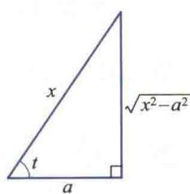
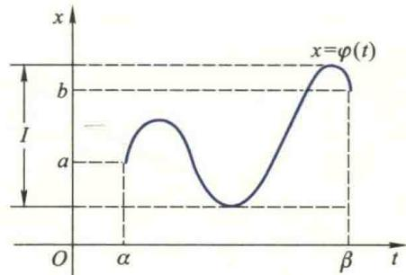

import ExerciseTrigger from '@/components/exercises/ExerciseTrigger.astro';
import QRCodeVideo from '@/components/QRCodeVideo.astro';

import Guide from '@/components/Guide.astro';
import Knowledge from '@/components/Knowledge.astro';
import Example from '@/components/Example.astro';
import Analysis from '@/components/Analysis.astro';
import Solution from '@/components/Solution.astro';
import Variant from '@/components/Variant.astro';
import Note from '@/components/Note.astro';
import SideNote from '@/components/SideNote.astro';
import Block from '@/components/Block.astro';
import Method from '@/components/Method.astro';
import Exercise from '@/components/Exercise.astro';

利用积分的线性性质和基本积分表，只能计算某些简单函数的积分。因此，还需要进一步寻求计算积分的其他方法。本节介绍两种基本积分法，即换元法与分部积分法，它们分别对应于微分法中的复合函数求导法则与函数乘积的求导法则，也是其他各种特殊积分方法的基础，读者应当熟练掌握。

# 第三节 两种基本积分法

利用积分的线性性质和基本积分表，只能计算某些简单函数的积分。因此，还需要进一步寻求计算积分的其他方法。本节介绍两种基本积分法，即换元法与分部积分法，它们分别对应于微分法中的复合函数求导法则与函数乘积的求导法则，也是其他各种特殊积分方法的基础，读者应当熟练掌握。

## 3.1 换元积分法

将复合函数求导法则反过来用于积分就得到了所谓的换元法，它是计算积分的最重要的方法。

### 1. 不定积分的换元法则 (I)

设 $F(u)$ 是 $f(u)$ 在区间 $I$ 上的一个原函数，即 $F'(u) = f(u), u \in I$。若 $u = \varphi(x)$ 可微，且 $R(\varphi) \subseteq I$，则由链式法则：

$$
(F[\varphi(x)])' = F'[\varphi(x)]\varphi'(x) = f[\varphi(x)]\varphi'(x)
$$

又若 $f(u)$ 与 $\varphi'(x)$ 均连续，则有

$$
\int f[\varphi(x)]\varphi'(x) \mathrm{d}x = F[\varphi(x)] + C
$$

又因为

$$
\int f(u) \mathrm{d}u = F(u) + C
$$

所以

$$
\left( \int f(u) \mathrm{d}u \right)_{u=\varphi(x)} = F[\varphi(x)] + C = \int f[\varphi(x)]\varphi'(x) \mathrm{d}x
$$

于是得到下述定理：

<Knowledge title="定理 3.1 不定积分的换元法则 (I)">
设 $f$ 是连续函数，$\varphi$ 有连续的导数，且 $\varphi$ 的值域包含于 $f$ 的定义域，则

$$
\int f[\varphi(x)]\varphi'(x) \mathrm{d}x = \left( \int f(u) \mathrm{d}u \right)_{u=\varphi(x)} \tag{3.1}
$$

</Knowledge>

定理 3.1 表述的就是不定积分的换元法则 (I)。按照这个法则，如果待求积分 $\int g(x) \mathrm{d}x$ 能够表示成 (3.1) 式左端的形式，也就是被积式 $g(x) \mathrm{d}x$ 能化成 $f[\varphi(x)]\varphi'(x) \mathrm{d}x = f[\varphi(x)] \mathrm{d}\varphi(x)$ 的形式，那么通过变量代换 $u = \varphi(x)$，待求积分就变为 (3.1) 式右端的形式。如果积分 $\int f(u) \mathrm{d}u = F(u) + C$ 容易求得，那么将 $u = \varphi(x)$ 代入 $F(u)$ 便得所求积分

$$
\int g(x) \mathrm{d}x = F[\varphi(x)] + C
$$

为了将 $g(x) \mathrm{d}x$ 化成 $f[\varphi(x)] \mathrm{d}\varphi(x)$ 的形式，设法将 $g(x)$ 分解成两个因子的乘积，使其中一个因子与 $\mathrm{d}x$ 的乘积凑成微分 $\mathrm{d}\varphi(x)$，而将另一个因子化成 $\varphi(x)$ 的函数 $f[\varphi(x)]$，必要时可以添加常数。因此，换元法则 (I) 也称为凑微分法。用这种方法求积分并无一般的规律可循，读者应在熟记基本积分公式的基础上，通过不断练习，总结经验，才能灵活运用。

<Example title="例 3.1 求下列积分">
(1) $\int \cos(3x + 1) \mathrm{d}x$;

(2) $\int (ax + b)^\alpha \mathrm{d}x \quad (a \neq 0, \alpha \neq -1)$;

(3) $\int \frac{\mathrm{d}x}{a^2 + x^2} \quad (a > 0)$;

(4) $\int \frac{\mathrm{d}x}{x^2 + 2x + 3}$;

(5) $\int \frac{\mathrm{d}x}{\sqrt{a^2 - x^2}} \quad (a > 0)$;

(6) $\int \frac{\mathrm{d}x}{a^2 - x^2} \quad (a > 0)$.
</Example>

<Solution title="解">
(1) 由于基本积分表中只有公式 $\int \cos x \mathrm{d}x = \sin x + C$，因此为了求出 (1) 中的积分，按照换元法则 (I)，注意到 $\cos(3x + 1)$ 是 $3x + 1$ 的函数，而 $\mathrm{d}(3x + 1) = 3\mathrm{d}x$，于是可将该积分变成如下形式：

$$
\int \cos(3x + 1) \mathrm{d}x = \frac{1}{3} \int \cos(3x + 1) \mathrm{d}(3x + 1)
$$

令 $u = 3x + 1$，得

$$
\int \cos(3x + 1) \mathrm{d}x = \frac{1}{3} \int \cos u \mathrm{d}u = \frac{1}{3} \sin u + C
$$

再将 $u = 3x + 1$ 代入上式中，得

$$
\int \cos(3x + 1) \mathrm{d}x = \frac{1}{3} \sin(3x + 1) + C
$$

(2) 在基本积分表中只有公式 $\int x^\alpha \mathrm{d}x = \frac{x^{\alpha+1}}{\alpha + 1} + C$，为了求出题中积分，与 (1) 类似，将它变成

$$
\int (ax + b)^\alpha \mathrm{d}x = \frac{1}{a} \int (ax + b)^\alpha \mathrm{d}(ax + b)
$$

令 $u = ax + b$，得

$$
\int (ax + b)^\alpha \mathrm{d}x = \left( \frac{1}{a} \int u^\alpha \mathrm{d}u \right)_{u=ax+b} = \left( \frac{1}{(\alpha + 1)a} u^{\alpha+1} + C \right)_{u=ax+b} = \frac{(ax + b)^{\alpha+1}}{(\alpha + 1)a} + C
$$

(3) 为了应用积分公式 $\int \frac{\mathrm{d}x}{1 + x^2} = \arctan x + C$，将所求积分变为

$$
\int \frac{\mathrm{d}x}{a^2 + x^2} = \frac{1}{a} \int \frac{\mathrm{d}\left(\frac{x}{a}\right)}{1 + \left(\frac{x}{a}\right)^2}
$$

令 $u = \frac{x}{a}$，则

$$
\int \frac{\mathrm{d}x}{a^2 + x^2} = \left( \frac{1}{a} \int \frac{\mathrm{d}u}{1 + u^2} \right)_{u=\frac{x}{a}} = \left( \frac{1}{a} \arctan u + C \right)_{u=\frac{x}{a}} = \frac{1}{a} \arctan \frac{x}{a} + C
$$

(4) 由于

$$
\int \frac{\mathrm{d}x}{x^2 + 2x + 3} = \int \frac{\mathrm{d}x}{2 + (x + 1)^2}
$$

仿照上题的方法有

$$
\int \frac{\mathrm{d}x}{x^2 + 2x + 3} = \frac{1}{\sqrt{2}} \int \frac{\mathrm{d}\left(\frac{x + 1}{\sqrt{2}}\right)}{1 + \left(\frac{x + 1}{\sqrt{2}}\right)^2} = \left( \frac{1}{\sqrt{2}} \int \frac{\mathrm{d}u}{1 + u^2} \right)_{u=\frac{x+1}{\sqrt{2}}}
$$

$$
= \left( \frac{1}{\sqrt{2}} \arctan u + C \right)_{u=\frac{x+1}{\sqrt{2}}} = \frac{1}{\sqrt{2}} \arctan \frac{x + 1}{\sqrt{2}} + C
$$
</Solution>

在解法比较熟练之后，解题步骤可以写得简单点。例如，变量代换 $u=\varphi(x)$ 可以不写出来，只需默记在心中。

$$
\int \frac{\mathrm{d}x}{\sqrt{a^2-x^2}} = \int \frac{\mathrm{d}\left(\frac{x}{a}\right)}{\sqrt{1-\left(\frac{x}{a}\right)^2}} = \arcsin \frac{x}{a} + C \tag{5}
$$

$$
\text{由于 } \frac{1}{a^2-x^2} = \frac{1}{2a}\left(\frac{1}{a-x} + \frac{1}{a+x}\right), \text{ 所以}

$$
$$
\begin{aligned}
\int \frac{\mathrm{d}x}{a^2-x^2} &= \frac{1}{2a} \int \left( \frac{1}{a-x} + \frac{1}{a+x} \right) \mathrm{d}x = \frac{1}{2a} \left[ \int \frac{\mathrm{d}(a+x)}{a+x} - \int \frac{\mathrm{d}(a-x)}{a-x} \right] \\
&= \frac{1}{2a} (\ln |a+x| - \ln |a-x|) + C = \frac{1}{2a} \ln \left| \frac{a+x}{a-x} \right| + C
\end{aligned} \tag{6}
$$

<Example title="例 3.2 求下列积分">

(1) $\int \frac{\sin x}{\cos^2 x} \mathrm{d}x$;

(2) $\int \tan x \mathrm{d}x$;

(3) $\int \sin^3 x \mathrm{d}x$;

(4) $\int \sin^2 x \mathrm{d}x$;

(5) $\int \sin x \cos 2x \mathrm{d}x$.

</Example>

<Solution title="解">

(1) $\int \frac{\sin x}{\cos^2 x} \mathrm{d}x = -\int \frac{\mathrm{d}(\cos x)}{\cos^2 x} = \frac{1}{\cos x} + C$.

(2) $\int \tan x \mathrm{d}x = \int \frac{\sin x}{\cos x} \mathrm{d}x = -\int \frac{\mathrm{d}(\cos x)}{\cos x} = -\ln |\cos x| + C$.

(3) $\int \sin^3 x \mathrm{d}x = -\int (1 - \cos^2 x) \mathrm{d}(\cos x) = -\cos x + \frac{1}{3} \cos^3 x + C$.

(4) $\int \sin^2 x \mathrm{d}x = \int \frac{1 - \cos 2x}{2} \mathrm{d}x = \frac{1}{2} \int \mathrm{d}x - \frac{1}{4} \int \cos 2x \mathrm{d}(2x) = \frac{x}{2} - \frac{1}{4} \sin 2x + C$.

(5) 根据积化和差公式得

$$
\sin x \cos 2x = \frac{1}{2}(\sin 3x - \sin x),
$$
所以
$$
\int \sin x \cos 2x \mathrm{d}x = \frac{1}{2} \int (\sin 3x - \sin x) \mathrm{d}x = -\frac{1}{6} \cos 3x + \frac{1}{2} \cos x + C.
$$

</Solution>

例 3.2 中五个积分的被积函数都是三角函数。对这类积分，在使用换元法时，大都利用三角恒等式先将被积函数适当变形，然后再进行变量代换。实际上，要熟练掌握积分技术，中学已学过的各种代数和三角运算技巧都是不可少的，读者在解题中应注意运用。

<Example title="例 3.3 求下列积分">

(1) $\int \frac{\mathrm{d}x}{x(1+\ln x)}$;

(2) $\int \frac{\sqrt{\arctan x}}{1+x^2} \mathrm{d}x$;

(3) $\int \frac{\arccos \sqrt{x}}{\sqrt{x(1-x)}} \mathrm{d}x$.

</Example>

<Solution title="解">

(1) $\int \frac{\mathrm{d}x}{x(1+\ln x)} = \int \frac{\mathrm{d}(1+\ln x)}{1+\ln x} = \ln |1+\ln x| + C$.

(2) $\int \frac{\sqrt{\arctan x}}{1+x^2} \mathrm{d}x = \int \sqrt{\arctan x} \mathrm{d}(\arctan x) = \frac{2}{3}(\arctan x)^{\frac{3}{2}} + C$.

(3) 表面上看，这个积分似乎很复杂，但是，如果读者对微分公式 $\mathrm{d}\sqrt{x} = \frac{1}{2\sqrt{x}}\mathrm{d}x$ 与 $\mathrm{d}(\arccos x) = -\frac{1}{\sqrt{1-x^2}}\mathrm{d}x$ 很熟悉，那么这个积分便可以按如下步骤求解：

$$
\begin{aligned}
\int \frac{\arccos \sqrt{x}}{\sqrt{x(1-x)}} \mathrm{d}x &= 2 \int \frac{\arccos \sqrt{x}}{\sqrt{1-x}} \mathrm{d}\sqrt{x} = 2 \left( \int \frac{\arccos u}{\sqrt{1-u^2}} \mathrm{d}u \right)_{u=\sqrt{x}} \\
&= -2 \left( \int \arccos u \mathrm{d}(\arccos u) \right)_{u=\sqrt{x}} = -(\arccos \sqrt{x})^2 + C.
\end{aligned}
$$

在解第 (3) 小题时，用了两个变量代换：$u=\sqrt{x}, v=\arccos u$，但第二个变量代换在解题过程中没有写出。

</Solution>

<Example title="例 3.4 求 $\int \csc x \mathrm{d}x$">

</Example>

<Solution title="解">

**解法一**
$$
\begin{aligned}
\int \csc x \mathrm{d}x &= \int \frac{\mathrm{d}x}{\sin x} = \int \frac{\sin x}{\sin^2 x} \mathrm{d}x \\
&= -\int \frac{\mathrm{d}(\cos x)}{1-\cos^2 x} = -\frac{1}{2} \ln \left| \frac{1+\cos x}{1-\cos x} \right| + C,
\end{aligned}
$$
其中最后一步利用了例 3.1(6) 的结果。

**解法二**
$$
\begin{aligned}
\int \csc x \mathrm{d}x &= \int \frac{\mathrm{d}x}{\sin x} = \int \frac{\mathrm{d}x}{2\sin \frac{x}{2}\cos \frac{x}{2}} = \frac{1}{2} \int \frac{\mathrm{d}x}{\tan \frac{x}{2}\cos^2 \frac{x}{2}} \\
&= \int \frac{1}{\tan \frac{x}{2}} \mathrm{d}\left(\tan \frac{x}{2}\right) = \ln \left| \tan \frac{x}{2} \right| + C.
\end{aligned}
$$

**解法三**
$$
\begin{aligned}
\int \csc x \mathrm{d}x &= \int \frac{\csc x(\csc x + \cot x)}{\csc x + \cot x} \mathrm{d}x \\
&= -\int \frac{\mathrm{d}(\csc x + \cot x)}{\csc x + \cot x} \\
&= -\ln |\csc x + \cot x| + C.
\end{aligned}
$$

<SideNote title="想一想">
此例用三种解法得到了三种形式不同的答案。同一个不定积分，为什么答案不同呢？你能解释这个问题吗？
</SideNote>

</Solution>

### 2. 不定积分的换元法则 (II)

换元法则 (I) 实际上就是将 (3.1) 式左端的积分通过变量代换 $u=\varphi(x)$ 化为右端的积分来计算的。反过来，如果左端的积分更容易求出，那么右端的积分 $\int f(x) \mathrm{d}x$ 就可以通过适当的变量代换 $x=\varphi(t)$ 化为左端的形式来计算，即

$$
\int f(x) \mathrm{d}x = \int f[\varphi(t)] \varphi'(t) \mathrm{d}t.
$$

这就是不定积分的换元法则 (II)，现叙述如下：

<Knowledge title="定理 3.2">
设 $f$ 是连续函数，$\varphi$ 有连续的导数，且 $\varphi'$ 定号，则

$$
\int f(x) \mathrm{d}x = \left( \int f[\varphi(t)] \varphi'(t) \mathrm{d}t \right)_{t=\varphi^{-1}(x)} \tag{3.2}
$$

其中 $\varphi^{-1}$ 是 $\varphi$ 的反函数。
</Knowledge>

<Solution title="证明">
由于 $\varphi'$ 定号，故存在反函数 $\varphi^{-1}$，并且 $\frac{\mathrm{d}t}{\mathrm{d}x} = \frac{1}{\varphi'(t)}$。为了证明等式 (3.2)，只要证明两端的导函数相等就可以了。对 (3.2) 两端分别关于 $x$ 求导，得

$$
\frac{\mathrm{d}}{\mathrm{d}x} \left( \int f(x) \mathrm{d}x \right) = f(x),
$$

$$
\begin{aligned}
\frac{\mathrm{d}}{\mathrm{d}x} \left( \int f[\varphi(t)] \varphi'(t) \mathrm{d}t \right) &= \frac{\mathrm{d}}{\mathrm{d}t} \left( \int f[\varphi(t)] \varphi'(t) \mathrm{d}t \right) \frac{\mathrm{d}t}{\mathrm{d}x} \\
&= f[\varphi(t)] \varphi'(t) \cdot \frac{1}{\varphi'(t)} \\
&= f[\varphi(t)] = f(x),
\end{aligned}
$$

</Solution>

<SideNote title="注意">
使用换元法则 (II) 的关键在于选择满足定理 3.2 条件的变换 $x=\varphi(t)$，使所求积分变为 (3.2) 式右端的积分，并且右端积分容易积出。选择什么样的变换与被积函数有关。
</SideNote>

<SideNote title="思路分析">
由于所求积分的被积函数中含有根式函数，所以选择变换 $x=\varphi(t)$ 去掉根式，使积分变得容易积分。
</SideNote>

<Example title="例 3.5 求 $\int \frac{\mathrm{d}x}{(a^2 - x^2)^{3/2}} \quad (a >

 0)$">
<Solution title="解">
为了去掉被积函数中的根式，令 $x = a \sin t \quad \left(t \in \left(-\frac{\pi}{2}, \frac{\pi}{2}\right)\right)$，
则 $\mathrm{d}x = a \cos t \,\mathrm{d}t$，于是

$$
\int \frac{\mathrm{d}x}{(a^2 - x^2)^{3/2}} = \int \frac{\mathrm{d}t}{a^2 \cos^2 t} = \frac{1}{a^2} \tan t + C.
$$

由图 3.7 知，$\tan t = \frac{x}{\sqrt{a^2 - x^2}}$，所以

$$
\int \frac{\mathrm{d}x}{(a^2 - x^2)^{3/2}} = \frac{1}{a^2} \frac{x}{\sqrt{a^2 - x^2}} + C.
$$
</Solution>
</Example>

<figure class="vp-figure">
  
  <figcaption>图 3.7</figcaption>
</figure>

<Example title="例 3.6 求 $\int \frac{\mathrm{d}x}{\sqrt{x^2 - a^2}} \quad (a >

 0)$">
<Solution title="解">
为了去掉根式，令 $x = a \sec t$。当 $x \in (a, +\infty)$ 时，取 $t \in \left(0, \frac{\pi}{2}\right)$，则 $\mathrm{d}x = a \sec t \tan t \,\mathrm{d}t$，于是

$$
\int \frac{\mathrm{d}x}{\sqrt{x^2 - a^2}} = \int \sec t \,\mathrm{d}t = \ln |\sec t + \tan t| + C_1,
$$

其中第二个等式可利用例 3.4 的类似解法得到。由图 3.8 知，$\sec t = \frac{x}{a}, \tan t = \frac{\sqrt{x^2 - a^2}}{a}$，于是

$$
\int \frac{\mathrm{d}x}{\sqrt{x^2 - a^2}} = \ln \left| \frac{x}{a} + \frac{\sqrt{x^2 - a^2}}{a} \right| + C_1 = \ln(x + \sqrt{x^2 - a^2}) + C,
$$

其中 $C = C_1 - \ln a$。

当 $x \in (-\infty, -a)$ 时，取 $t \in \left(\frac{\pi}{2}, \pi\right)$，类似地可得

$$
\int \frac{\mathrm{d}x}{\sqrt{x^2 - a^2}} = \ln(-x - \sqrt{x^2 - a^2}) + C.
$$

两个区间的不定积分可写成统一的表达式：

$$
\int \frac{\mathrm{d}x}{\sqrt{x^2 - a^2}} = \ln |x + \sqrt{x^2 - a^2}| + C.
$$
</Solution>
</Example>

<figure class="vp-figure">
  
  <figcaption>图 3.8</figcaption>
</figure>

<Example title="例 3.7 求 $\int \frac{\mathrm{d}x}{\sqrt{x^2 + a^2}} \quad (a >

 0)$">
<Solution title="解">
为了去掉被积函数中的根式，令 $x = a \tan t \quad \left(t \in \left(-\frac{\pi}{2}, \frac{\pi}{2}\right)\right)$，则 $\mathrm{d}x = a \sec^2 t \,\mathrm{d}t$，于是

$$
\int \frac{\mathrm{d}x}{\sqrt{a^2 + x^2}} = \int \sec t \,\mathrm{d}t = \ln |\sec t + \tan t| + C_1.
$$

由图 3.9 知，$\tan t = \frac{x}{a}, \sec t = \frac{\sqrt{x^2 + a^2}}{a}$，故

$$
\int \frac{\mathrm{d}x}{\sqrt{a^2 + x^2}} = \ln \left| \frac{x}{a} + \frac{\sqrt{x^2 + a^2}}{a} \right| + C_1 = \ln(x + \sqrt{x^2 + a^2}) + C,
$$

其中 $C = C_1 - \ln a$。
</Solution>
</Example>

<figure class="vp-figure">
  
  <figcaption>图 3.9</figcaption>
</figure>

<SideNote title="注意">
一般来说，如果被积函数中含有：
(1) $\sqrt{a^2 - x^2}$，可作变换 $x = a \sin t$ (或 $x = a \cos t$)；
(2) $\sqrt{x^2 + a^2}$，可作变换 $x = a \tan t$ (或 $x = a \sinh t$)；
(3) $\sqrt{x^2 - a^2}$，可作变换 $x = a \sec t$ (或 $x = a \cosh t$)。
</SideNote>

今后在做题时，不再指明变换 $x = \varphi(t)$ 的定义区间，总认为是在满足定理 3.2 中条件 Interval 内的变换。如果被积函数中含有根式 $\sqrt[n]{ax+b}$，则可直接令 $\sqrt[n]{ax+b} = t$，将根式消去。

<Example title="例 3.8 求 $\int \frac{\mathrm{d}x}{1 + \sqrt[3]{x+2}}$">
<Solution title="解">
令 $\sqrt[3]{x+2} = t$，则 $x = t^3 - 2, \mathrm{d}x = 3t^2 \mathrm{d}t$，于是

$$
\int \frac{\mathrm{d}x}{1 + \sqrt[3]{x+2}} = \int \frac{3t^2 \mathrm{d}t}{1 + t} = 3 \int \left( t - 1 + \frac{1}{t+1} \right) \mathrm{d}t
$$

$$
= 3 \left( \frac{t^2}{2} - t + \ln |t + 1| \right) + C
$$

$$
= \frac{3}{2} \sqrt[3]{(x+2)^2} - 3\sqrt[3]{x+2} + 3\ln |1 + \sqrt[3]{x+2}| + C.
$$
</Solution>
</Example>

<Example title="例 3.9 求 $I = \int \frac{\sin x}{5 + 4\cos x} \mathrm{d}x$">
<Solution title="解">
令 $t = \tan \frac{x}{2}$，则由半角公式得：

$$
\sin x = \frac{2\tan \frac{x}{2}}{1 + \tan^2 \frac{x}{2}} = \frac{2t}{1 + t^2}, \quad \cos x = \frac{1 - \tan^2 \frac{x}{2}}{1 + \tan^2 \frac{x}{2}} = \frac{1 - t^2}{1 + t^2},
$$

$$
\mathrm{d}x = \mathrm{d}(2\arctan t) = \frac{2}{1 + t^2} \mathrm{d}t.
$$

代入所求积分并化简得

$$
I = 4 \int \frac{\frac{t}{1+t^2}}{(9+t^2) \frac{1}{1+t^2}} \mathrm{d}t = \frac{1}{2} \left( \int \frac{t}{1+t^2} \mathrm{d}t - \int \frac{t}{9+t^2} \mathrm{d}t \right)
$$

$$
= \frac{1}{4} \left[ \ln(1+t^2) - \ln(9+t^2) \right] + C = \frac{1}{4} \ln \frac{1+t^2}{9+t^2} + C
$$

$$
= -\frac{1}{4} \ln(5 + 4\cos x) + C.
$$
</Solution>
</Example>

<SideNote title="思路分析">
此例中所用的变量代换称为**半角代换**，它是求解三角有理函数（即由正弦和余弦函数经过有理运算构成的函数）积分普遍适用的方法，所以也称为**万能代换法**。但是，它不一定是求解这类积分最简便的方法。例如，用这种方法来求解积分 $I = \int \frac{\sin x}{5 + 4\cos x} \mathrm{d}x$ 就不如下述方法更简洁：

$$
I = -\frac{1}{4} \int \frac{1}{5 + 4\cos x} \mathrm{d}(5 + 4\cos x) = -\frac{1}{4} \ln(5 + 4\cos x) + C.
$$
</SideNote>

### 3. 定积分换元法

第二节中已经指出，只要求出被积函数的一个原函数，就能用 Newton-Leibniz 公式计算定积分。如果被积函数比较复杂，自然可以先用换元法求它的原函数，再代入积分上、下限从而求出积分的值。然而在许多理论推导与实际计算中，直接利用下面的定积分换元法更为方便。

<Knowledge title="定理 3.3">
设函数 $f$ 在有限区间 $I$ 上连续，$x = \varphi(t)$ 在区间 $[\alpha, \beta]$ (或 $[\beta, \alpha]$) 上有连续的导数，并且 $\varphi$ 的值域 $R(\varphi) \subseteq I$，则
$$
\int_{\varphi(\alpha)}^{\varphi(\beta)} f(x) \mathrm{d}x = \int_{\alpha}^{\beta} f(\varphi(t)) \varphi'(t) \mathrm{d}t.
$$
</Knowledge>

<QRCodeVideo id="3.3.2" title="定积分换元法与不定积分换元法的区别" url="#" />

<SideNote title="思路分析">
通过图 3.10 可以直观理解：变量代换实质上是建立了一个从新变量 $t$ 到原变量 $x$ 的映射关系，积分区间也随之从 $[a, b]$ 变换为 $[\alpha, \beta]$。
</SideNote>

$$
\int_a^b f(x) \mathrm{d}x = \int_\alpha^\beta f[\varphi(t)] \varphi'(t) \mathrm{d}t, \tag{3.3}
$$

其中 $a=\varphi(\alpha), b=\varphi(\beta)$（见图 3.10）。

<figure class="vp-figure">
  
  <figcaption>图 3.10 变量代换的几何关系</figcaption>
</figure>

<Solution title="证明">
由已知条件易知，(3.3) 式两端被积函数的原函数都存在。设 $F$ 是 $f$ 在区间 $I$ 上的一个原函数，则

$$
\int_a^b f(x) \mathrm{d}x = F(b) - F(a). \tag{3.4}
$$

另一方面，由于

$$
\frac{\mathrm{d}}{\mathrm{d}t} F[\varphi(t)] = f[\varphi(t)] \varphi'(t),
$$

所以 $F[\varphi(t)]$ 是 $f[\varphi(t)] \varphi'(t)$ 在 $[\alpha, \beta]$ 上的一个原函数，故

$$
\int_\alpha^\beta f[\varphi(t)] \varphi'(t) \mathrm{d}t = F[\varphi(\beta)] - F[\varphi(\alpha)] = F(b) - F(a). \tag{3.5}
$$

于是由 (3.4) 与 (3.5) 两式知等式 (3.3) 成立。
</Solution>

<Example title="例 3.10 求定积分 $\int_0^1 \sqrt{1-x^2} \mathrm{d}x$">
<SideNote title="注意">
利用定积分换元法时，积分变量 $x$ 通过代换 $x=\varphi(t)$ 换成 $t$ 后，积分上下限必须同时变换成对应的 $t$ 的值。
</SideNote>

解：令 $x=\sin t \quad (t \in [0, \frac{\pi}{2}])$，则 $\mathrm{d}x=\cos t \mathrm{d}t$，且当 $x=0$ 时，$t=0$；当 $x=1$ 时，$t=\frac{\pi}{2}$。于是

$$
\int_0^1 \sqrt{1-x^2} \mathrm{d}x = \int_0^{\frac{\pi}{2}} \cos^2 t \mathrm{d}t = \frac{1}{2} \left( t + \frac{1}{2} \sin 2t \right) \bigg|_0^{\frac{\pi}{2}} = \frac{\pi}{4}.
$$

此例也可先用不定积分换元法则 (II) 求出相应的不定积分，即

$$
\int \sqrt{1-x^2} \mathrm{d}x \xrightarrow[\substack{x=\sin t \\ t \in [0, \frac{\pi}{2}]}]{\quad} \int \cos^2 t \mathrm{d}x = \frac{1}{2} \left( t + \frac{1}{2} \sin 2t \right) + C
$$

$$
= \frac{1}{2} (\arcsin x + x\sqrt{1-x^2}) + C.
$$

再利用 Newton-Leibniz 公式求定积分的值

$$
\int_0^1 \sqrt{1-x^2} \mathrm{d}x = \frac{1}{2} (\arcsin x + x\sqrt{1-x^2}) \bigg|_0^1 = \frac{\pi}{4}.
$$

读者不难看出，这种方法比直接用定积分换元法复杂得多。
</Example>

<Example title="例 3.11 求定积分 $\int_0^\pi \sqrt{\cos^2 x - \cos^4 x} \mathrm{d}x$">
<SideNote title="注意">
因为 $\cos x$ 在积分区间 $[0, \pi]$ 上变号，所以 $\sqrt{\cos^2 x (1-\cos^2 x)} = |\cos x| \sin x$，而不等于 $\cos x \sin x$，这是一种易犯的错误！
</SideNote>

解：由于 $\sqrt{\cos^2 x - \cos^4 x} = \sqrt{\cos^2 x (1-\cos^2 x)} = |\cos x| \sin x$，并且当 $x \in [0, \frac{\pi}{2}]$ 时，$|\cos x| = \cos x$，当 $x \in [\frac{\pi}{2}, \pi]$ 时，$|\cos x| = -\cos x$，所以

$$
\int_0^\pi \sqrt{\cos^2 x - \cos^4 x} \mathrm{d}x = \int_0^\pi |\cos x| \sin x \mathrm{d}x = \int_0^{\frac{\pi}{2}} \sin x \cos x \mathrm{d}x - \int_{\frac{\pi}{2}}^\pi \sin x \cos x \mathrm{d}x.
$$

令 $t = \sin x$，则 $\mathrm{d}t = \cos x \mathrm{d}x$，且当 $x=0$ 时，$t=0$；$x=\frac{\pi}{2}$ 时，$t=1$；$x=\pi$ 时，$t=0$。由公式 (3.3) 得

$$
\int_0^\pi \sqrt{\cos^2 x - \cos^4 x} \mathrm{d}x = \int_0^1 t \mathrm{d}t - \int_1^0 t \mathrm{d}t = \left( \frac{t^2}{2} \right) \bigg|_0^1 - \left( \frac{t^2}{2} \right) \bigg|_1^0 = 1.
$$

在例 3.11 中，可类似于不定积分的换元法则 (I)，不必写出变量代换 $t=\varphi(x)$，也不变换积分上下限，直接求得被积函数的原函数后利用 Newton-Leibniz 公式来计算。即

$$
\int_0^\pi \sqrt{\cos^2 x - \cos^4 x} \mathrm{d}x = \int_0^{\frac{\pi}{2}} \sin x \mathrm{d}(\sin x) - \int_{\frac{\pi}{2}}^\pi \sin x \mathrm{d}(\sin x)
$$

$$
= \left( \frac{1}{2} \sin^2 x \right) \bigg|_0^{\frac{\pi}{2}} - \left( \frac{1}{2} \sin^2 x \right) \bigg|_{\frac{\pi}{2}}^\pi = 1.
$$
</Example>

<Example title="例 3.12 证明 $\int_0^{\frac{\pi}{2}} \sin^n x \mathrm{d}x = \int_0^{\frac{\pi}{2}} \cos^n x \mathrm{d}x$ ($n$ 为正整数)">
<SideNote title="想一想">
试将例 3.12 中的积分等式从右端推出等式左端。
</SideNote>

证：令 $x = \frac{\pi}{2} - t$，则

$$
\int_0^{\frac{\pi}{2}} \sin^n x \mathrm{d}x = \int_{\frac{\pi}{2}}^0 \sin^n \left( \frac{\pi}{2} - t \right) (-\mathrm{d}t) = -\int_{\frac{\pi}{2}}^0 \cos^n t \mathrm{d}t = \int_0^{\frac{\pi}{2}} \cos^n t \mathrm{d}t = \int_0^{\frac{\pi}{2}} \cos^n x \mathrm{d}x.
$$
</Example>

<Example title="例 3.13 证明 $\int_0^\pi x f(\sin x) \mathrm{d}x = \frac{\pi}{2} \int_0^\pi f(\sin x) \mathrm{d}x$ 并计算 $\int_0^\pi \frac{x \sin x}{1+\cos^2 x} \mathrm{d}x$">
解：令 $x = \pi - t$，则

$$
\int_0^\pi x f(\sin x) \mathrm{d}x = \int_\pi^0 (\pi - t) f[\sin(\pi - t)] (-\mathrm{d}t) = \int_0^\pi (\pi - t) f(\sin t) \mathrm{d}t
$$

$$
= \pi \int_0^\pi f(\sin t) \mathrm{d}t - \int_0^\pi t f(\sin t) \mathrm{d}t.
$$

注意到积分与积分变量无关，移项可得

$$
\int_0^\pi x f(\sin x) \mathrm{d}x = \frac{\pi}{2} \int_0^\pi f(\sin x) \mathrm{d}x.
$$

利用这个等式我们有

$$
\int_0^\pi \frac{x \sin x}{1+\cos^2 x} \mathrm{d}x = \frac{\pi}{2} \int_0^\pi \frac{\sin x}{1+\cos^2 x} \mathrm{d}x = -\frac{\pi}{2} \arctan(\cos x) \bigg|_0^\pi = \frac{\pi^2}{4}.
$$
</Example>

## 3.2 分部积分法

分部积分法是与微分学中函数乘积的求导法则相对应的另一种基本积分法。设 $u=u(x)$ 与 $v=v(x)$ 都是可微函数，则

$$
(uv)' = u'v + uv' \quad \text{或} \quad \mathrm{d}(uv) = v\mathrm{d}u + u\mathrm{d}v,
$$

移项得

$$
u\mathrm{d}v = \mathrm{d}(uv) - v\mathrm{d}u.
$$

若进而假定 $u'$ 与 $v'$ 都是连续的，对上式两端求不定积分，并将右端第一项的积分常数合并到第二项的不定积分中，立即可得

$$
\int u \mathrm{d}v = uv - \int v \mathrm{d}u, \tag{3.6}
$$

称之为不定积分的分部积分公式。它表明，若积分 $\int u \mathrm{d}v$ 不易求得，而 $\int v \mathrm{d}u$ 容易求得，则可利用该公式来计算 $\int u \mathrm{d}v$。

<SideNote title="注意">
使用 (3.6) 式的关键在于恰当地选择 $u$ 和 $\mathrm{d}v$，将待求积分的被积式 $f(x) \mathrm{d}x$ 化成 $u \mathrm{d}v$ 的形式，并且 $\int v \mathrm{d}u$ 容易求出。
</SideNote>

<Example title="例 3.14 求下列积分">
*(注：本页末尾例题题干未完整显示，请参考后续页面)*
</Example>

<SideNote title="思路分析">
对于下列类型的积分：
$\int x^n e^x \mathrm{d}x, \int x^n \sin ax \mathrm{d}x, \int x^n \cos ax \mathrm{d}x$
（其中 $n \in \mathbb{N}_+, a \in \mathbb{R}$ 为常数）应当如何选择 $u$ 和 $\mathrm{d}v$ 呢？
</SideNote>

<Example title="例 3.14">
求下列积分：
(1) $\int x^2 \ln x \mathrm{d}x$;
(2) $\int x \arctan x \mathrm{d}x$;
(3) $\int \arcsin x \mathrm{d}x$.
</Example>

<Solution title="解">
(1)

$$
\int x^2 \ln x \mathrm{d}x = \int \ln x \mathrm{d}\left(\frac{x^3}{3}\right) = \frac{x^3}{3} \ln x - \frac{1}{3} \int x^3 \cdot \frac{1}{x} \mathrm{d}x = \frac{1}{3} x^3 \ln x - \frac{1}{9} x^3 + C.
$$

(2) 
$$
\begin{aligned}
\int x \arctan x \mathrm{d}x &= \int \arctan x \mathrm{d}\left(\frac{x^2}{2}\right) = \frac{x^2}{2} \arctan x - \frac{1}{2} \int \frac{x^2}{1 + x^2} \mathrm{d}x \\
&= \frac{x^2}{2} \arctan x - \frac{1}{2} \int \left(1 - \frac{1}{1 + x^2}\right) \mathrm{d}x \\
&= \frac{x^2}{2} \arctan x - \frac{x}{2} + \frac{1}{2} \arctan x + C.
\end{aligned}
$$

(3) 
$$
\int \arcsin x \mathrm{d}x = x \arcsin x - \int \frac{x}{\sqrt{1 - x^2}} \mathrm{d}x = x \arcsin x + \sqrt{1 - x^2} + C.
$$
</Solution>

<Example title="例 3.16 求 $\int e^x \sin x \mathrm{d}x$">
</Example>

<Solution title="解">
根据分部积分公式 (3.6)，有
$$
\int e^x \sin x \mathrm{d}x = \int \sin x \mathrm{d}(e^x) = e^x \sin x - \int e^x \cos x \mathrm{d}x.
$$

对上式右端的积分再次应用分部积分法，又得
$$
\int e^x \cos x \mathrm{d}x = \int \cos x \mathrm{d}(e^x) = e^x \cos x + \int e^x \sin x \mathrm{d}x.
$$

从而有
$$
\int e^x \sin x \mathrm{d}x = e^x \sin x - e^x \cos x - \int e^x \sin x \mathrm{d}x.
$$

移项并将等式两端的不定积分中的任意常数合并移至等式右端可得
$$
\int e^x \sin x \mathrm{d}x = \frac{1}{2} e^x (\sin x - \cos x) + C.
$$
</Solution>

<Example title="例 3.17 求 $I_n = \int \frac{\mathrm{d}x}{(x^2 + a^2)^n} \quad (n \in \mathbb{N}_+)$">
</Example>

<Solution title="解">
根据分部积分公式 (3.6)，我们有 $\left( \text{取 } u = \frac{1}{(x^2 + a^2)^n}, v = x \right)$
$$
\begin{aligned}
I_n &= \int \frac{\mathrm{d}x}{(x^2 + a^2)^n} = \frac{x}{(x^2 + a^2)^n} + \int \frac{2nx^2}{(x^2 + a^2)^{n+1}} \mathrm{d}x \\
&= \frac{x}{(x^2 + a^2)^n} + 2n \int \frac{x^2 + a^2 - a^2}{(x^2 + a^2)^{n+1}} \mathrm{d}x \\
&= \frac{x}{(x^2 + a^2)^n} + 2n \int \frac{\mathrm{d}x}{(x^2 + a^2)^n} - 2na^2 \int \frac{\mathrm{d}x}{(x^2 + a^2)^{n+1}} \\
&= \frac{x}{(x^2 + a^2)^n} + 2n I_n - 2na^2 I_{n+1}.
\end{aligned}
$$

从而得到一个递推公式
$$
I_{n+1} = \frac{1}{2na^2} \left[ \frac{x}{(x^2 + a^2)^n} + (2n - 1) I_n \right] \quad (n \in \mathbb{N}_+).
$$

当 $n=1$ 时，由递推公式得
$$
\begin{aligned}
I_2 &= \int \frac{\mathrm{d}x}{(x^2 + a^2)^2} = \frac{1}{2a^2} \left( \frac{x}{x^2 + a^2} + \int \frac{\mathrm{d}x}{x^2 + a^2} \right) \\
&= \frac{1}{2a^2} \left( \frac{x}{x^2 + a^2} + \frac{1}{a} \arctan \frac{x}{a} \right) + C.
\end{aligned}
$$

代入递推公式可以求得任何 $I_n$。
</Solution>

<Example title="例 3.18 求 $I = \int \frac{x^4 + 2x^2 - x + 1}{x^5 + 2x^3 + x} \mathrm{d}x$">
</Example>

<Solution title="解">
由于
$$
\frac{x^4 + 2x^2 - x + 1}{x^5 + 2x^3 + x} = \frac{(x^2 + 1)^2 - x}{x(x^2 + 1)^2} = \frac{1}{x} - \frac{1}{(x^2 + 1)^2},
$$
所以
$$
I = \int \frac{\mathrm{d}x}{x} - \int \frac{\mathrm{d}x}{(x^2 + 1)^2} = \ln |x| - \frac{x}{2(x^2 + 1)} - \frac{1}{2} \arctan x + C,
$$
其中第二个积分直接利用了例 3.17 的结果。
</Solution>

### 定积分分部积分公式

设函数 $u, v$ 在区间 $[a, b]$ 上有连续的导数，则
$$
\int_a^b u \mathrm{d}v = uv \bigg|_a^b - \int_a^b v \mathrm{d}u. \tag{3.7}
$$

<SideNote title="想一想">
下面的做法错在何处？由分部积分法得
$$
\begin{aligned}
I &= \int_2^3 \frac{\mathrm{d}x}{x \ln x} = \int_2^3 \frac{1}{\ln x} \mathrm{d}(\ln x) \\
&= 1 - \int_2^3 \ln x \left( \frac{1}{\ln x} \right) \mathrm{d}x \\
&= 1 - I, \\
\text{从而 } 0 = 1.
\end{aligned}
$$
</SideNote>

<Example title="例 3.19 求 $\int_0^1 e^{\sqrt{x}} \mathrm{d}x$">
</Example>

<Solution title="解">
令 $\sqrt{x} = t$，则 $x = t^2, \mathrm{d}x = 2t \mathrm{d}t$。由 (3.7) 式得
$$
\int_0^1 e^{\sqrt{x}} \mathrm{d}x = 2 \int_0^1 t e^t \mathrm{d}t = 2 \int_0^1 \mathrm{d}(t e^t) - e^t \big|_0^1 = 2(t e^t \big|_0^1 - e^t \big|_0^1) = 2.
$$
</Solution>

<Example title="例 3.20 求 $\int_0^{\frac{1}{2}} \frac{x \arcsin x}{\sqrt{1 - x^2}} \mathrm{d}x$">
</Example>

<Solution title="解">
根据定积分分部积分公式 (3.7)，有
$$
\begin{aligned}
\int_0^{\frac{1}{2}} \frac{x \arcsin x}{\sqrt{1 - x^2}} \mathrm{d}x &= -\int_0^{\frac{1}{2}} \arcsin x \mathrm{d}\left(\sqrt{1 - x^2}\right) \\
&= -\sqrt{1 - x^2} \arcsin x \bigg|_0^{\frac{1}{2}} + \int_0^{\frac{1}{2}} \mathrm{d}x \\
&= -\frac{\sqrt{3}}{2} \cdot \frac{\pi}{6} + \frac{1}{2} = \frac{1}{2} - \frac{\sqrt{3}}{12}\pi.
\end{aligned}
$$
</Solution>

<Example title="例 3.21 计算下列积分">
(1) $I_n = \int_0^{\frac{\pi}{2}} \sin^n x \mathrm{d}x = \int_0^{\frac{\pi}{2}} \cos^n x \mathrm{d}x \quad (n = 0, 1, 2, \dots)$;
</Example>

<SideNote title="思路分析">
通过对 $I_n = \int_0^{\frac{\pi}{2}} \sin^n x \mathrm{d}x$ 进行分部积分，可以建立 $I_n$ 与 $I_{n-2}$ 之间的递推关系，从而通过迭代求解。
</SideNote>

(2) $\int_0^{\frac{\pi}{2}} \sin^4 x \cos^2 x \mathrm{d}x$; (3) $\int_0^1 x^4 \sqrt{1-x^2} \mathrm{d}x$.

<Solution title="解 (1)">
当 $n \ge 2$ 时,

$$
I_n = \int_0^{\frac{\pi}{2}} \sin^n x \mathrm{d}x = -\int_0^{\frac{\pi}{2}} \sin^{n-1} x \mathrm{d}(\cos x)
$$

$$
= -\sin^{n-1} x \cos x \bigg|_0^{\frac{\pi}{2}} + (n-1) \int_0^{\frac{\pi}{2}} \cos^2 x \sin^{n-2} x \mathrm{d}x
$$

$$
= (n-1) \int_0^{\frac{\pi}{2}} \sin^{n-2} x \mathrm{d}x - (n-1) \int_0^{\frac{\pi}{2}} \sin^n x \mathrm{d}x
$$

$$
= (n-1)I_{n-2} - (n-1)I_n,
$$

所以

$$
I_n = \frac{n-1}{n} I_{n-2} \quad (n=2,3,\dots).
$$

当 $n$ 为奇数时,

$$
I_n = \frac{n-1}{n} I_{n-2} = \frac{n-1}{n} \cdot \frac{n-3}{n-2} I_{n-4} = \dots = \frac{n-1}{n} \cdot \frac{n-3}{n-2} \cdot \dots \cdot \frac{2}{3} I_1;
$$

当 $n$ 为偶数时,

$$
I_n = \frac{n-1}{n} \cdot \frac{n-3}{n-2} \cdot \dots \cdot \frac{3}{4} \cdot \frac{1}{2} I_0.
$$

又因为

$$
I_1 = \int_0^{\frac{\pi}{2}} \sin x \mathrm{d}x = 1, \quad I_0 = \int_0^{\frac{\pi}{2}} \mathrm{d}x = \frac{\pi}{2},
$$

故

$$
I_n = \begin{cases} 
\displaystyle \frac{n-1}{n} \cdot \frac{n-3}{n-2} \cdot \dots \cdot \frac{4}{5} \cdot \frac{2}{3}, & n \text{ 为奇数}, \\ 
\displaystyle \frac{n-1}{n} \cdot \frac{n-3}{n-2} \cdot \dots \cdot \frac{3}{4} \cdot \frac{1}{2} \cdot \frac{\pi}{2}, & n \text{ 为偶数}. 
\end{cases}
$$
</Solution>

<Solution title="解 (2)">
利用 (1) 中的结果, 我们有

$$
\int_0^{\frac{\pi}{2}} \sin^4 x \cos^2 x \mathrm{d}x = \int_0^{\frac{\pi}{2}} \sin^4 x \mathrm{d}x - \int_0^{\frac{\pi}{2}} \sin^6 x \mathrm{d}x
$$

$$
= \frac{3}{4} \cdot \frac{1}{2} \cdot \frac{\pi}{2} - \frac{5}{6} \cdot \frac{3}{4} \cdot \frac{1}{2} \cdot \frac{\pi}{2} = \frac{\pi}{32}.
$$
</Solution>

<Solution title="解 (3)">
令 $x = \sin t$, 则 $\mathrm{d}x = \cos t \mathrm{d}t$, 于是

$$
\int_0^1 x^4 \sqrt{1-x^2} \mathrm{d}x = \int_0^{\frac{\pi}{2}} \sin^4 t \cos^2 t \mathrm{d}t = \frac{\pi}{32}.
$$
</Solution>

### 3.3 初等函数的积分问题

由上面的例子可以看到, 求积分比微分要困难得多. 有些积分分要用很高的技巧才能算出, 有些积分计算很麻烦, 还有许多积分, 即使被积函数很简单, 其原函数也无法用初等函数表示. 例如,

$$
\int e^{x^2} \mathrm{d}x, \quad \int \frac{\sin x}{x} \mathrm{d}x, \quad \int \frac{\mathrm{d}x}{\sqrt{1+x^4}}, \quad \text{等等.}
$$

虽然这些积分的被积函数都是初等函数, 它们在定义区间内是连续的, 因此原函数一定存在, 但是, 原函数却不能用初等函数表示出来. 通常把被积函数的原函数能用初等函数表示的积分叫做“积得出的”, 否则, 叫做“积不出的”. 究竟哪些积分积得出, 哪些积分积不出, 这是一个很复杂的问题, 没有一般的判别方法. 为了应用方便, 人们已将积得出的常用初等函数的积分编成积分表, 供科技人员查阅. 随着计算科学的发展, 在计算机上已能进行符号运算, 可以利用数学软件包在计算机上直接计算积得出的积分. 对于积不出的, 也可用数值方法求出其近似值. 但是, 不能认为就不需要掌握积分法了. 在今后的继续学习和工作中, 常常会碰到积分的运算和推导, 还需要较熟练地掌握一些基本的积分方法, 特别是换元法与分部积分法. 况且, 如果不掌握这些积分法, 连积分表也无法查用.

<ExerciseTrigger chapter={3} section="3.3" title="3.3 两种基本积分法 课后真题与自测练习" />
