import ExerciseTrigger from '@/components/exercises/ExerciseTrigger.astro';
import QRCodeVideo from '@/components/QRCodeVideo.astro';

import Guide from '@/components/Guide.astro';
import Knowledge from '@/components/Knowledge.astro';
import Example from '@/components/Example.astro';
import Analysis from '@/components/Analysis.astro';
import Solution from '@/components/Solution.astro';
import Variant from '@/components/Variant.astro';
import Note from '@/components/Note.astro';
import Block from '@/components/Block.astro';
import Method from '@/components/Method.astro';
import Exercise from '@/components/Exercise.astro';

在科学技术中有很多量都需要用定积分来表达.本节重点阐述建立这些量的积分表达式的常用方法——微元法,通过几何与物理方面的例子说明运用这种方法的

思想和步骤.

## 4.1 建立积分表达式的微元法

应用定积分解决实际问题需要解决两个问题:第一,具备哪些特征的量能用定积分来表达?第二,怎样建立计算这些量的积分表达式?

在本章第一节中我们已经看到,曲边梯形的面积 A、细棒的质量 m 以及做变速直线运动物体的位移 s 等都可用定积分来表达.这些量具有如下共同特征:(1)都是区间 $[a,b]$ 上的非均匀连续分布的量;(2)都具有对区间的可加性,即分布在 $[a,b]$ 上的总量等于分布在 $[a,b]$ 各子区间上的局部量之和.一般情况下,具备这些特征的量都可以用定积分来描述.

在第一节中,上述诸量的积分表达式都是通过“分”“匀”“合”“精”四个步骤来建立的.例如,对于区间 $[a,b]$ 上以 $y=f(x)$ ( $f\in C[a,b],f(x)\geqslant0$ )为曲边的曲边梯形,通过这四步得到的面积A的积分表达式为

$$
A = \lim _ {d \rightarrow 0} \sum_ {k = 1} ^ {n} f (\xi_ {k}) \Delta x _ {k} = \int_ {a} ^ {b} f (x) \mathrm{d} x.
$$

这是建立所求量积分表达式的基本方法.但是,这些步骤书写烦琐,不便于应用.通过分析这种方法实质,不难将四个步骤简化为两步.第一步,包含“分”“匀”两个步骤,也就是通过将 $[a,b]$ 分割为子区间,在每个子区间上用均匀变化近似代替非均匀变化(简称为以“匀”代“非匀”),求得局部量的近似值

$$
\Delta A _ {k} \approx f (\xi_ {k}) \Delta x _ {k},
$$

上式右端对应着积分表达式中的被积式 $f(x)\mathrm{d}x$ ; 第二步, 就是将“合”“精”两个步骤合而为一, 通过将各个局部量的近似值相加并取极限得到整体量的精确值, 即对被积式 $f(x)\mathrm{d}x$ 作积分

$$
A = \int_ {a} ^ {b} f (x) \mathrm{d} x.
$$

上述简化具有一般性. 设 $f \in C[a, b]$ , $Q$ 为由 $y = f(x)$ 所确定的在区间 $[a, b]$ 上非均匀连续分布的量, 并且对区间具有可加性. 为简单计, 省略各子区间的下标 $k$ , 记第 $k$ 个子区间为 $[x, x + \mathrm{d}x]$ . 由于 $f$ 为连续函数, 因而可积, 可取子区间的左端点 $x$ 为 $\xi_k$ . 这样, 建立所求量 $Q$ 的积分表达式的步骤就可归纳为如下两步:

（1）任意分割区间 $[a,b]$ 为若干子区间，任取一个子区间 $[x,x + \mathrm{d}x]$ ，求 $Q$ 在该子区间上局部量 $\Delta Q$ 的近似值

$$
\mathrm{d} Q = f (x) \mathrm{d} x;
$$

(2) 以 $f(x)\mathrm{d}x$ 为被积式, 在 $[a,b]$ 上作积分即得总量Q的精确值

$$
Q = \int_ {a} ^ {b} \mathrm{d} Q = \int_ {a} ^ {b} f (x) \mathrm{d} x.\tag{4.1}
$$

这种建立积分表达式的方法,通常称为微元法.其中 $\mathrm{d}Q=f(x)\mathrm{d}x$ 称为积分微元,简称微元.

上述两步中,求子区间 $[x,x+dx]$ 上局部量 $\Delta Q$ 的近似值是微元法的关键步骤.怎样才能求得局部量 $\Delta Q$ 所需要的近似值呢?为了说明这个问题,我们把分布在区间 $[a,x]$ ( $x\in[a,b]$ )上的量Q记作 $Q(x)$ ,对比(4.1)式可知

$$
Q (x) = \int_ {a} ^ {x} f (t) \mathrm{d} t \qquad (x \in [ a, b ]).
$$

由于f在 $[a,b]$ 上连续,根据微积分学第一基本定理,函数 $Q(x)$ 的微分为

$$
\mathrm{d} Q = f (x) \mathrm{d} x.\tag{4.2}
$$

而 $\Delta Q$ 就是 $Q(x)$ 在区间 $[x, x + dx]$ 上的改变量，因而局部量 $\Delta Q$ 所需要的近似值就是由 (4.2) 式所表示的 $Q(x)$ 的微分，这就为寻求 $\Delta Q$ 所需要的近似值确立了标准。根据改变量 $\Delta Q$ 与微分的关系，只要能找到与 dx 成线性关系并且与 $\Delta Q$ 之差为 dx 高阶无穷小的量 $dQ = f(x)dx$ ，那么，它就是 $\Delta Q$ 所需要的近似值。在实际应用中，通过在子区间 $[x, x + dx]$ 上以“匀”代“非匀”或者把子区间 $[x, x + dx]$ 近似看成一点，用乘法所求得的近似值往往就符合上述要求，可以作为 $\Delta Q$ 所需要的近似值，即为所寻求的积分微元 $dQ = f(x)dx$ 。下面再通过一些实例来说明微元法。

<QRCodeVideo id="3.4.1" title="用微元法建立积分表达式的思想剖析." url="http://2d.hep.cn/1254051/53" />

## 4.2 定积分在几何中的应用举例

<Example title="例 4.1">
求由抛物线 $y=x^{2}-1$ 与 $y=7-x^{2}$ 所围成的平面图形(图 3.11)的面积 A.

<Solution title="解">
联立两抛物线的方程,容易求得它们的交点的横坐标为 $x=\pm2$ .

容易看出,所求面积A是非均匀连续分布在区间 $[-2,2]$ 上且对区间具有可加性的量,因此,可以用定积分来计算.

根据微元法,为求面积微元 dQ,任意分割 $[-2,2]$ ,任取子区间 $[x,x+dx]$ .在此子区间上,图

<figure class="vp-figure">
  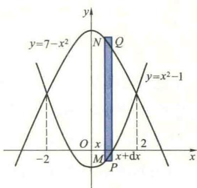
  <figcaption>图3.11</figcaption>
</figure>

形(可以看成由两个小曲边梯形构成)的“高”可以近似看成不变的(即在此小区间上图形面积可看成均匀分布的), 它的面积 $\Delta A$ 可以用在点 x 所对应的 MN 为高、dx 为底的小矩形面积近似代替, 从而得

$$
\Delta A \approx [ (7 - x ^ {2}) - (x ^ {2} - 1) ] \mathrm{d} x = 2 (4 - x ^ {2}) \mathrm{d} x.
$$

可以证明(从略),小矩形面积与 $\Delta A$ 之差是关于 dx 的高阶无穷小,因而它就是所求的面积微元 dA,即

$$
\mathrm{d} A = 2 (4 - x ^ {2}) \mathrm{d} x.
$$

将面积微元在区间 $[-2,2]$ 上作积分,便得所求图形面积

$$
A = \int_ {- 2} ^ {2} \mathrm{d} A = 2 \int_ {- 2} ^ {2} (4 - x ^ {2}) \mathrm{d} x = \frac {6 4}{3}. \quad \text {   I   }
$$
</Solution>
</Example>

<Example title="例 4.2">
求由抛物线 $\sqrt{y}=x$ ，直线 y=-x 及 y=1 围成的平面图形（图 3.12）的面积.

<Solution title="解">
此图形的面积是非均匀连续分布在 y 轴上的区间 $[0,1]$ 上的可加量 A. 任意分割此区间 $[0,1]$ ，任取一个子区间 $[y,y+dy]$ . 在此子区间上，将图形的“宽度”近似看作是不变的（即将图形的面积在此小区间上看成均匀分布的），它的面积可用图 3.12 中阴影部分的面积来代替，则面积微元为

$$
\mathrm{d} A = (\sqrt {y} + y) \mathrm{d} y.
$$

在区间[0,1]上积分即得所求图形的面积为

$$
A = \int_ {0} ^ {1} \mathrm{d} A = \int_ {0} ^ {1} (\sqrt {y} + y) \mathrm{d} y = \frac {7}{6}.
$$
</Solution>
</Example>

<Example title="例 4.3">
求心形线 $\rho=a(1+\cos\theta)$ (a>0) 所围成图形(图 3.13) 的面积.

<figure class="vp-figure">
  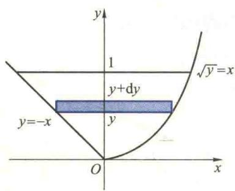
  <figcaption>图3.12</figcaption>
</figure>

<figure class="vp-figure">
  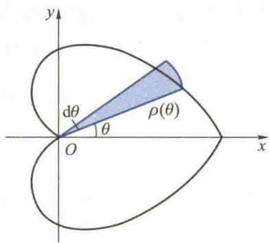
  <figcaption>图3.13</figcaption>
</figure>

<Solution title="解">
由图形的对称性知,所求面积等于它在上半平面部分面积的2倍.

由于心形线的方程是用极坐标给出的,它上面每点处的极径 $\rho$ 随 $\theta$ 而变,故其所围成图形的面积可以看作是非均匀连续分布在关于量 $\theta$ 的区间 $[0,\pi]$ 上的可加量.

以 $\theta$ 作积分变量,任意分割区间 $[0,\pi]$ ,任取子区间 $[\theta,\theta+d\theta]$ . 在该子区间上,可以把 $\rho$ 的值近似看成不变的,也就是将此子区间上图形的面积看成关于 $\theta$ 是均匀分布的,用以 $\rho(\theta)$ 为半径、圆心角为 d $\theta$ 的圆扇形(图 3.13 中的阴影部分)面积近似代替,从而面积微元为

$$
\mathrm{d} A = \frac {1}{2} \rho^ {2} (\theta) \mathrm{d} \theta = \frac {1}{2} a ^ {2} (1 + \cos \theta) ^ {2} \mathrm{d} \theta .
$$

故所求图形的面积为

$$
A = 2 \int_ {0} ^ {\pi} \mathrm{d} A = 2 \cdot \frac {1}{2} \int_ {0} ^ {\pi} \rho^ {2} (\theta) \mathrm{d} \theta = a ^ {2} \int_ {0} ^ {\pi} (1 + \cos \theta) ^ {2} \mathrm{d} \theta = \frac {3}{2} \pi a ^ {2}. \quad \text {   I   }
$$
</Solution>
</Example>

<Example title="例 4.4">
两个半径为 R 的圆柱体中心轴垂直相交, 求它们公共部分的体积 V.

<Solution title="解">
由对称性,我们只画出该图形的1/8并建立坐标系如图3.14所示.过x轴上

区间 $[0, R]$ 中任一点 $x$ 处作垂直于 $x$ 轴的横截面，则该截面为一个正方形（图3.14中阴影部分），其边长为 $y = \sqrt{R^2 - x^2}$ ，面积为

$$
A (x) = y ^ {2} = \left(R ^ {2} - x ^ {2}\right).
$$

容易看出,该图形在第一卦限中部分的体积 $V_{1}$ 是非均匀连续分布在区间 $[0,R]$ 上的可加量,因此可以用定积分来计算.

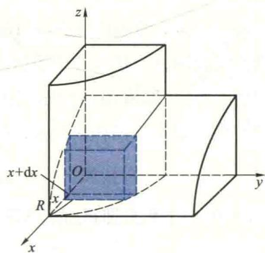

任意分割区间 $[0, R]$ ，任取子区间 $[x, x + \mathrm{d}x]$ . 过子区间 $[x, x + \mathrm{d}x]$ 的两端点分别作

图3.14

垂直于 x 轴的平面, 则介于这两个平面间的“薄片”的上、下底面均为正方形. 当 dx 很小时, 该“薄片”的上、下底面的面积可近似看作是相等的, 也就是将该子区间上“薄片”的体积看成均匀分布的, 近似用柱体的体积代替得体积微元为

$$
\mathrm{d} V = A (x) \mathrm{d} x = \left(R ^ {2} - x ^ {2}\right) \mathrm{d} x,
$$

从而

$$
V _ {1} = \int_ {0} ^ {R} A (x) \mathrm{d} x = \int_ {0} ^ {R} (R ^ {2} - x ^ {2}) \mathrm{d} x = \frac {2}{3} R ^ {3}.
$$

整个立体体积 V 是该部分体积的 8 倍, 因而

$$
V = 8 V _ {1} = \frac {1 6}{3} R ^ {3}. \quad \text {   I   }
$$
</Solution>
</Example>

<Example title="例 4.5">
一个平面图形由双曲线 xy = a (a > 0) 与直线 x = a, x = 2a 及 x 轴围成（图 3.15(a)）. 计算该图形绕下列直线旋转一周所产生的旋转体体积：

(1) x 轴(图 3.15(b));

(2) 直线 y=1(图 3.15(c));

(3) y 轴(图 3.15(d)).

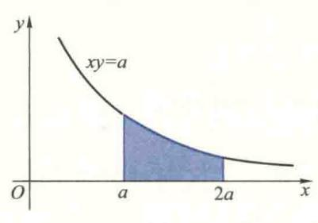  
(a)

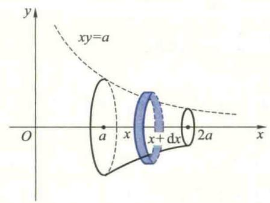  
(b)

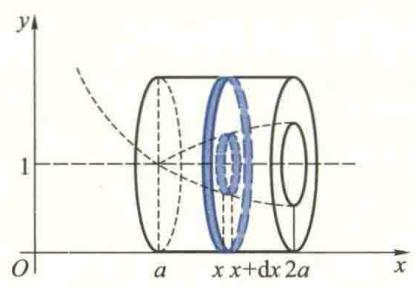  
(c)

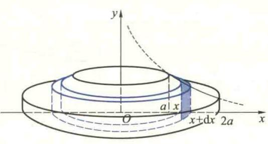  
(d)  
图3.15

<Solution title="解">
此题也是求立体体积问题,类似于例 4.4 的分析,它们都能用定积分来计算,而且建立积分表达式的思路和步骤也相似.

（1）分割区间 $[a,2a]$ ，任取子区间 $[x,x + \mathrm{d}x]$ . 过点 $x$ 与 $x + \mathrm{d}x$ 分别作垂直于 $x$ 轴的平面，则该立体被这两个平面截出一个“薄片”. 该“薄片”的上、下底面积近似相等，所以可以把它近似地看成一圆柱体. 其底面积为

$$
A (x) = \pi y ^ {2} = \pi \left(\frac {a}{x}\right) ^ {2},
$$

高为 $\mathrm{dx}$ ，于是体积微元

$$
\mathrm{d} V _ {1} = A (x) \mathrm{d} x = \pi \left(\frac {a}{x}\right) ^ {2} \mathrm{d} x,
$$

所求旋转体的体积为

$$
V _ {1} = \int_ {a} ^ {2 a} \mathrm{d} V _ {1} = \int_ {a} ^ {2 a} A (x) \mathrm{d} x = \pi \int_ {a} ^ {2 a} \left(\frac {a}{x}\right) ^ {2} \mathrm{d} x = \frac {\pi a}{2}.
$$

(2) 过 x 与 $x + dx$ 且垂直于 x 轴的两平面截出该立体的一块“薄片”，该薄片上、下底面均为圆环,它们的面积可以近似地看成相等.因此,该“薄片”体积的近似值,即所求的体积微元为

$$
\mathrm{d} V _ {2} = A (x) \mathrm{d} x = \left[ \pi \cdot 1 ^ {2} - \pi \left(1 - \frac {a}{x}\right) ^ {2} \right] \mathrm{d} x = \pi \left(2 \frac {a}{x} - \frac {a ^ {2}}{x ^ {2}}\right) \mathrm{d} x,
$$

积分即得所求旋转体的体积

$$
V _ {2} = \int_ {a} ^ {2 a} A (x) \mathrm{d} x = \pi \int_ {a} ^ {2 a} \left(2 \frac {a}{x} - \frac {a ^ {2}}{x ^ {2}}\right) \mathrm{d} x = \pi a \left(2 \ln 2 - \frac {1}{2}\right).
$$

（3）分割区间 $[a,2a]$ ，任取子区间 $[x,x + \mathrm{d}x]$ ，把该子区间对应的小曲边梯形近似地看成是小矩形（图3.15(d)中阴影部分）。因而它绕 $y$ 轴旋转一周产生的立体可以看成是一个内半径为 $x$ ，外半径为 $x + \mathrm{d}x$ ，高为 $y = \frac{a}{x}$ 的“圆柱壳”。从而所求的体积微元为

$$
\mathrm{d} V _ {3} = 2 \pi x y \mathrm{d} x = 2 \pi a \mathrm{d} x,
$$

积分得所求立体的体积

$$
V _ {3} = \int_ {a} ^ {2 a} 2 \pi a \mathrm{d} x = 2 \pi a ^ {2}. \quad \text {I}
$$
</Solution>
</Example>

## 4.3 定积分在物理中的应用举例

<Example title="例 4.6">
有一等腰梯形闸门, 其上底长 10 m, 下底长 6 m, 高为 20 m. 该闸门所在

的面与水面垂直,且上底与水面相齐.求该闸门一侧所受到的水的压力.

<Solution title="解">
首先建立坐标系如图 3.16 所示, 则图中直线段 AB 的方程为 $y = 5 - \frac{x}{10}$ .

问题中闸门受到的压力不能直接用公式“压强×受力面积”来计算,其主要原因在于闸门上各点处压强随该闸门在水下的深度不同而变化.也就是说,闸门所受的水压力在区间[0,20]上的分布是非均匀的,并且关于区间具有可加性,因此,闸门所受到的水压力可用定积分来计算.将深度区间[0,20]进行分割,把闸门分成许多水平细条.由于各细条上的点到水面的距离近似相等,因而细条上各点处压强也近似相等,即在细

<figure class="vp-figure">
  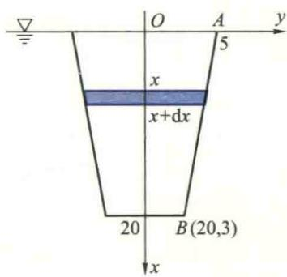
  <figcaption>图3.16</figcaption>
</figure>
</Solution>
</Example>

如果将闸门底边的中点选作坐标原点,x轴正向朝上,试建立闸门所受压力的积分式.

条上压力分布可近似看成均匀的,可用公式“压强 $P \times$ 受力面积 A”算出各细条所受压

力的近似值,将其积分即得整个闸门所受的压力.具体做法如下:

（1）分割 $x$ 轴上的区间[0,20]，任取子区间 $[x, x + \mathrm{d}x]$ . 该子区间所对应的闸门上的水平细条可近似看作是宽为 $2y$ ，高为 $\mathrm{d}x$ 的小矩形，其上各点到水面的距离可近似地看作为 $x$ . 于是该细条所受到水压力的近似值（即压力微元）为

$$
\mathrm{d} F = P \mathrm{d} A = \rho g x \cdot 2 y \mathrm{d} x = 2 g x \left(5 - \frac {x}{1 0}\right) \mathrm{d} x,
$$

其中 P 为该细条上各点处压强的近似值, 它等于 $\rho g$ ( $\rho$ 为液体密度, g 为重力加速度. 此处 $\rho = 1 \, t/m^{3}, g = 10 \, m/s^{2}$ ) 乘深度 x, dA = 2y dx 为该细条面积的近似值.

(2) 在 $[0,20]$ 上作积分就得到整个闸门所受的压力

$$
F = \int_ {0} ^ {2 0} \mathrm{d} F = \int_ {0} ^ {2 0} 2 g x \left(5 - \frac {x}{1 0}\right) \mathrm{d} x = \frac {4 4}{3} \times 1 0 ^ {6} (\mathrm{N}).
$$

<Example title="例 4.7">
一个半球形容器, 其半径为 R m, 容器中盛满了水, 若将容器中水全部从容器口抽出, 问需做功多少?

<Solution title="解">
我们知道,在 K N 常力的作用下物体通过的位移为 H m 时,力所做的功为 W = KH J.

由于不同深度的水层与容器口的距离不同,不同深度处水层的体积不相同,因而

抽出各层水所做的功也不同.也就是说,抽完水需要做的功在 $[0,R]$ 上的分布是非均匀的,并且关于区间具有可加性,因此,不能直接利用上述乘法公式,而要采用积分的方法.在过该容器球心的断面上建立坐标系如图3.17所示,则该断面边界上半圆弧的方程为

<figure class="vp-figure">
  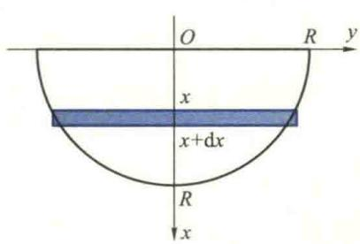
  <figcaption>图3.17</figcaption>
</figure>

$$
x ^ {2} + y ^ {2} = R ^ {2} (x \geqslant 0).
$$
</Solution>
</Example>

分割 x 轴上的区间 $[0, R]$ ，任取子区间 $[x, x + dx]$ ，则与该子区间对应的一薄层水体积的近似值为

如果将此半球的最低点选为坐标原点,x轴正向朝上,如何建立所做功的积分式?

$$
\mathrm{d} V = \pi y ^ {2} \mathrm{d} x = \pi (R ^ {2} - x ^ {2}) \mathrm{d} x.
$$

水的密度 $\rho=1\ t/m^{3}$ ，将这一薄层水抽到容器口所经过的位移可近似地看作是相同的，均为 -x。就是说，在该子区间上抽水需做功的分布可看成是均匀的，因而，把这一薄层水抽到容器口克服重力所做的功微元为

$$
\mathrm{d} W = (- x) (- \rho g \mathrm{d} V) = x \cdot g \pi y ^ {2} \mathrm{d} x = x \cdot g \pi (R ^ {2} - x ^ {2}) \mathrm{d} x,
$$

在区间 $[0,R]$ 上积分便得抽完水所需要做的功(取 $g=10\ m/s^{2}$ )

$$
W = \int_ {0} ^ {R} \mathrm{d} W = g \pi \int_ {0} ^ {R} x (R ^ {2} - x ^ {2}) \mathrm{d} x = \frac {\pi R ^ {4}}{4} \cdot 1 0 ^ {4} (\mathrm{J}).
$$

<Example title="例 4.8">
有一长为 l 的均匀带电直导线, 电荷线密度(即单位长度导线的带电量)为 $\delta$ , 与该导线位于同一直线上相距为 a 处放置一个带电量为 q 的点电荷, 求它们之间的作用力.

<Solution title="解">
根据 Coulomb 定律, 两个带电量分别为 $q_{1}, q_{2}$ 且相距为 r 的点电荷之间的作用力为

$$
F = k \frac {q _ {1} q _ {2}}{r ^ {2}}.
$$

现在与点电荷 q 作用的是一段带电直导线, 其上各点与电点荷 q 间的距离不同, 作用力将随点在导线上的位置不同而变化. 也就是说, 点电荷与导线间的作用力在 $[a, a+l]$ 上

是非均匀分布的,因此不能直接运用 Coulomb 定律.由于导线与点电荷之间的作用力关于区间具有可加性,所以可用定积分来计算.建

<figure class="vp-figure">
  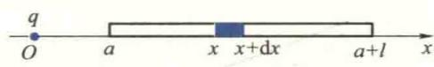
  <figcaption>图3.18</figcaption>
</figure>

立坐标系如图 3.18 所示, 分割区间 $[a, a+l]$ , 把子区间 $[x, x+dx]$ 上一小段导线近似地看成是一个点电荷, 其带电量近似等于 $\delta dx$ . 应用 Coulomb 定律, 这一小段导线与点电荷 q 之间作用力的近似值 (作用力微元) 为

$$
\mathrm{d} F = k \frac {q \delta \mathrm{d} x}{x ^ {2}},
$$

在 $[a, a + l]$ 上作积分得到整个导线与点电荷 $q$ 的作用力为

$$
F = \int_ {a} ^ {a + l} k q \delta \frac {1}{x ^ {2}} \mathrm{d} x = k q \delta \left(\frac {1}{a} - \frac {1}{a + l}\right).
$$
</Solution>
</Example>

<Example title="例 4.9">
在例 4.8 中, 如果点电荷 q 位于导线的中垂线上, 且与导线相距为 a (图 3.19), 求它们之间的作用力.

<Solution title="解">
建立坐标系如图 3.19 所示. 类似于例 4.8 中的分析可知, 若分割 x 轴上的区间 $\left[-\frac{l}{2}, \frac{l}{2}\right]$ , 则子区间 $[x, x + dx]$ 上一小段导线与点电荷 q 的作用力的大小近似等于

$$
\mathrm{d} F = k \frac {q \delta \mathrm{d} x}{r ^ {2}} = k q \delta \frac {\mathrm{d} x}{a ^ {2} + x ^ {2}}.
$$

<figure class="vp-figure">
  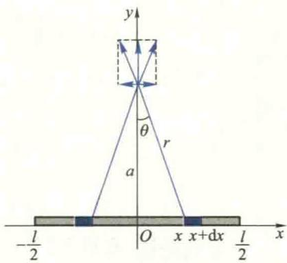
  <figcaption>图3.19</figcaption>
</figure>

值得注意的是,不能直接对上式作积分求导

线与点电荷之间的作用力.这是因为各小段与点电荷作用力的方向不在同一直线上,它们的合力应是“向量和”而不是“代数和”，因而所求作用力对区间不具有可加性。对这种情况，一般的处理方法是，把各小段与 $q$ 的作用力都沿 $x$ 轴与 $y$ 轴分解，由于两个分力都具有对区间的可加性，分别把各小段与 $q$ 的作用力的分力相加，从而求出合力在两坐标轴上的分力。由对称性不难看出，合力 $F$ 在 $x$ 轴上分力 $F_{x} = 0$ ，因而，只要计算 $F$ 在 $y$ 轴上的分力 $F_{y}$ 。由于

$$
\mathrm{d} F _ {y} = \mathrm{d} F \cos \theta = k q \delta \frac {\mathrm{d} x}{a ^ {2} + x ^ {2}} \frac {a}{\sqrt {a ^ {2} + x ^ {2}}} = k q \delta a \frac {\mathrm{d} x}{(a ^ {2} + x ^ {2}) ^ {3 / 2}},
$$

积分得所求作用力为

$$
F = F _ {y} = \int_ {- \frac {l}{2}} ^ {\frac {l}{2}} \mathrm{d} F _ {y} = k q \delta a \int_ {- \frac {l}{2}} ^ {\frac {l}{2}} \frac {\mathrm{d} x}{\left(a ^ {2} + x ^ {2}\right) ^ {3 / 2}} = 2 k q \delta a \frac {l}{\sqrt {4 a ^ {2} + l ^ {2}}}.
$$
</Solution>
</Example>

<ExerciseTrigger chapter={3} section="3.4" title="3.4 定积分的应用 课后真题与自测练习" />
