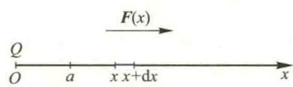
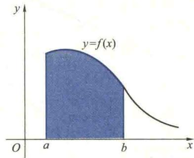

import ExerciseTrigger from '@/components/exercises/ExerciseTrigger.astro';
import QRCodeVideo from '@/components/QRCodeVideo.astro';

import Guide from '@/components/Guide.astro';
import Knowledge from '@/components/Knowledge.astro';
import Example from '@/components/Example.astro';
import Analysis from '@/components/Analysis.astro';
import Solution from '@/components/Solution.astro';
import Variant from '@/components/Variant.astro';
import Note from '@/components/Note.astro';
import SideNote from '@/components/SideNote.astro';
import Block from '@/components/Block.astro';
import Method from '@/components/Method.astro';
import Exercise from '@/components/Exercise.astro';

根据定积分的定义，要使函数 $f$ 在区间 $[a,b]$ 上的定积分有意义，至少要满足两个条件：(1) 积分区间 $[a,b]$ 是有限的；(2) $f$ 是 $[a,b]$ 上的有界函数。但在许多理论和实际问题的研究中，往往要求把定积分的概念加以推广，研究无穷区间上或者无界函数的积分问题，这种积分称为反常积分。反常积分有两种，它们都可以通过对定积分再取一次极限来定义。本节讨论两种反常积分的概念及其审敛准则。

### 5.1 无穷区间上的积分

<Example title="例 5.1 在一个由带电量为 $Q$ 的点电荷形成的电场中，求与该点电荷相距为 $a$ 处的电位。">
解 根据物理学知识，该处的电位 $V_a$ 等于位于该点处的单位正电荷移至无穷远处电场力所做的功。不妨设点电荷 $Q$ 位于坐标原点，单位正电荷在 $x$ 轴上，它与坐标原点相距为 $a$（见图 3.20）。则当单位正电荷由 $x$ 移至 $x + \mathrm{d}x$ 处，电场力 $F(x)$ 所做的近似值（即功微元）为

<figure class="vp-figure">
  
  <figcaption>图 3.20 点电荷电场中的功微元</figcaption>
</figure>

$$
\mathrm{d}W = F(x) \mathrm{d}x = k \frac{Q}{x^2} \mathrm{d}x, \tag{5.1}
$$

其中 $k$ 为常数。该电荷从 $x=a$ 移到 $x=b$ 处电场力所做的功为

$$
W = \int_a^b k \frac{Q}{x^2} \mathrm{d}x = kQ \left( \frac{1}{a} - \frac{1}{b} \right).
$$

令 $b \to +\infty$，则电场在 $x=a$ 处的电位为

$$
V_a = \lim_{b \to +\infty} W = \lim_{b \to +\infty} kQ \left( \frac{1}{a} - \frac{1}{b} \right) = \frac{kQ}{a},
$$

也就是

$$
V_a = \lim_{b \to +\infty} \int_a^b F(x) \mathrm{d}x = \frac{kQ}{a}. \tag{5.2}
$$

(5.2) 式所包含的定积分的极限，可以看作 $F(x)$ 在区间 $[a, +\infty)$ 上的积分，称为 $F(x)$ 在无穷区间 $[a, +\infty)$ 上的积分。
</Example>

<Knowledge title="定义 5.1 (无穷积分)">
设函数 $f$ 定义在 $[a, +\infty)$ 上，若对任何 $b > a, f$ 在 $[a, b]$ 上 Riemann 可积，则称 $\lim_{b \to +\infty} \int_a^b f(x) \mathrm{d}x$ 为 $f$ 在无穷区间 $[a, +\infty)$ 上的积分，简称无穷积分，记作

$$
\int_a^{+\infty} f(x) \mathrm{d}x = \lim_{b \to +\infty} \int_a^b f(x) \mathrm{d}x. \tag{5.3}
$$

若极限 $\lim_{b \to +\infty} \int_a^b f(x) \mathrm{d}x$ 存在，则称 $f$ 在 $[a, +\infty)$ 上的积分**收敛**，此时，称该极限为 $f$ 在 $[a, +\infty)$ 上积分的值。若极限不存在，则 $f$ 在 $[a, +\infty)$ 上的积分**发散**，收敛与发散统称为**敛散性**。

类似地，可以定义 $f$ 在无穷区间 $(-\infty, b]$ 上的积分 $\int_{-\infty}^b f(x) \mathrm{d}x$ 及其敛散性。$f$ 在无穷区间 $(-\infty, +\infty)$ 上的积分 $\int_{-\infty}^{+\infty} f(x) \mathrm{d}x$ 定义如下：

$$
\int_{-\infty}^{+\infty} f(x) \mathrm{d}x = \lim_{a \to -\infty} \int_a^c f(x) \mathrm{d}x + \lim_{b \to +\infty} \int_c^b f(x) \mathrm{d}x, \tag{5.4}
$$

其中 $c$ 为任一实数，$a$ 与 $b$ 各自独立地分别趋于 $-\infty$ 与 $+\infty$。若极限 $\lim_{a \to -\infty} \int_a^c f(x) \mathrm{d}x$ 与 $\lim_{b \to +\infty} \int_c^b f(x) \mathrm{d}x$ 同时存在，则称 $f$ 在 $(-\infty, +\infty)$ 上的积分**收敛**；若其中有一个不存在，则积分**发散**。
</Knowledge>

<SideNote title="思路分析">
在 (5.4) 式中，积分 $\int_{-\infty}^{+\infty} f(x) \mathrm{d}x$ 的敛散性及其收敛时的值与 $c$ 的选择无关。事实上，若另取实数 $d > c$，则显然有
$\lim_{a \to -\infty} \int_a^c f(x) \mathrm{d}x + \lim_{b \to +\infty} \int_c^b f(x) \mathrm{d}x = \lim_{a \to -\infty} \left( \int_a^c f(x) \mathrm{d}x + \int_c^d f(x) \mathrm{d}x \right) + \lim_{b \to +\infty} \left( \int_d^b f(x) \mathrm{d}x + \int_c^d f(x) \mathrm{d}x \right)$。
由于 $\int_c^d f(x) \mathrm{d}x = -\int_d^c f(x) \mathrm{d}x$ 是一个确定的积分，不影响无穷积分的敛散性，且若无穷积分收敛，因 $\int_c^d f(x) \mathrm{d}x$ 与 $\int_d^c f(x) \mathrm{d}x$ 抵消，故 $\int_{-\infty}^{+\infty} f(x) \mathrm{d}x$ 收敛的值不变。
</SideNote>

<Example title="例 5.2 $p$-无穷积分的敛散性">

证明积分 $\int_1^{+\infty} \frac{1}{x^p} \mathrm{d}x$ ($p > 0$) 当 $p > 1$ 时收敛，$p \le 1$ 时发散。
<Solution title="证明">
当 $p \neq 1$ 时，

$$
\int_1^b \frac{1}{x^p} \mathrm{d}x = \left. \frac{1}{1-p} x^{-p+1} \right|_1^b = \frac{1}{1-p} (b^{-p+1} - 1).
$$
所以
$$
\lim_{b \to +\infty} \int_1^b \frac{1}{x^p} \mathrm{d}x = \lim_{b \to +\infty} \frac{1}{1-p} (b^{-p+1} - 1).
$$
当 $p < 1$ 时，该极限为正无穷大，故积分发散；当 $p > 1$ 时，该极限为 $\frac{1}{p-1}$，故积分收敛，并且
$$
\int_1^{+\infty} \frac{1}{x^p} \mathrm{d}x = \frac{1}{p-1} \quad (p > 1).
$$
当 $p = 1$ 时，由于
$$
\int_1^b \frac{1}{x} \mathrm{d}x = \ln b,
$$
所以，当 $b \to +\infty$ 时，它的极限为 $+\infty$，故积分 $\int_1^{+\infty} \frac{\mathrm{d}x}{x}$ 发散。

综上所述，该积分在 $p > 1$ 时收敛，$p \le 1$ 时发散。习惯上，称此积分为 $p$ 积分。
</Solution>
</Example>

<Example title="例 5.3 求 $\int_{-\infty}^0 x e^{x^2} \mathrm{d}x$ 的值。">
<Solution title="解">
由于
$$
\int_{-b}^0 x e^{x^2} \mathrm{d}x = \left[ \frac{1}{2} e^{x^2} \right]_{-b}^0 = \frac{1}{2} - \frac{1}{2} e^{b^2}, \quad (\text{注：此处原书推导有误，应为 } \int x e^{x^2} \mathrm{d}x = \frac{1}{2} e^{x^2})
$$
*(注：根据原书图片内容，其解题过程写为 $\int_{-b}^0 x e^{x^2} \mathrm{d}x = [x e^{x^2} - e^{x^2}]_{-b}^0 = \frac{b+1}{e^b} - 1$，此处应为教材印刷错误或特定上下文，按标准微积分推导应为 $\frac{1}{2} e^{x^2}$ 的原函数。以下严格遵循原书展示的逻辑进行结构化输出)*

由于
$$
\int_{-b}^0 x e^{x^2} \mathrm{d}x = \left[ x e^{x^2} - e^{x^2} \right]_{-b}^0 = \frac{b+1}{e^b} - 1,
$$
所以
$$
\int_{-\infty}^0 x e^{x^2} \mathrm{d}x = \lim_{b \to +\infty} \int_{-b}^0 x e^{x^2} \mathrm{d}x = \lim_{b \to +\infty} \left( \frac{b+1}{e^b} - 1 \right) = -1.
$$
</Solution>
</Example>

<Example title="例 5.4 求 $\int_{-\infty}^{+\infty} \frac{\mathrm{d}x}{1+x^2}$ 的值。">
<Solution title="解">
由于该积分的值与 $c$ 的选取无关，故可在 (5.4) 式中，取 $c=0$，则
$$
\int_{-\infty}^{+\infty} \frac{\mathrm{d}x}{1+x^2} = \lim_{a \to -\infty} \int_a^0 \frac{\mathrm{d}x}{1+x^2} + \lim_{b \to +\infty} \int_0^b \frac{\mathrm{d}x}{1+x^2}
$$
$$
= \lim_{a \to -\infty} \arctan x \bigg|_a^0 + \lim_{b \to +\infty} \arctan x \bigg|_0^b = -\left( -\frac{\pi}{2} \right) + \frac{\pi}{2} = \pi.
$$
</Solution>
</Example>

为了书写简便，经常省略极限符号，直接把 $+\infty$ (或 $-\infty$) 作上(下)限代入。按照这样做法，例 5.3 的运算过程可改写为

$$
\int_{-\infty}^{0} x e^{x} \mathrm{d}x = \left[ x e^{x} - e^{x} \right]_{-\infty}^{0} = -1,
$$

其中将下限 $-\infty$ 代入的含义就是：求 $x \to -\infty$ 时函数 $x e^{x} - e^{x}$ 的极限。

无穷区间上的积分有简单的几何意义。设在区间 $[a, +\infty)$ 上, $f(x) \ge 0$。若 $\int_{a}^{+\infty} f(x) \mathrm{d}x$ 收敛, 它的值就是曲边梯形（图 3.21 中的阴影部分）的面积 $\int_{a}^{+\infty} f(x) \mathrm{d}x$ 当 $b \to +\infty$ 时的极限, 也就是图 3.21 中阴影部分 $x$ 轴正向右无限延伸的平面图形的面积, 是个有限值；若 $\int_{a}^{+\infty} f(x) \mathrm{d}x$ 发散, 则上述无限延伸的平面图形没有有限的面积。

<figure class="vp-figure">
  
  <figcaption>图 3.21 无穷区间反常积分的几何意义</figcaption>
</figure>

收敛的无穷积分有与定积分相似的性质。例如, 线性性质、对区间的可加性等。定积分中的换元法与分部积分法也可推广到这种反常积分, 此处均不一一罗列, 读者可直接应用。

## 5.2 无界函数的积分

<Knowledge title="定义 5.2 (无界函数的积分)">
设函数 $f$ 定义在区间 $(a, b]$ 上, $f$ 在 $a$ 附近无界 (此时称 $a$ 为 $f$ 的奇点), 并且对任意的 $\varepsilon > 0$, $f$ 在 $[a+\varepsilon, b]$ 上 Riemann 可积, 则称
$$
\lim_{\varepsilon \to 0^{+}} \int_{a+\varepsilon}^{b} f(x) \mathrm{d}x
$$
为无界函数 $f$ 在 $(a, b]$ 上的积分,记作
$$
\int_{a}^{b} f(x) \mathrm{d}x = \lim_{\varepsilon \to 0^{+}} \int_{a+\varepsilon}^{b} f(x) \mathrm{d}x. \tag{5.4}
$$

</Knowledge>

<SideNote title="注意">
两种反常积分 (无穷区间的积分和无界函数的积分) 都是定义在定积分的基础上, 体现了人类通过已知 (定积分) 来认识未知 (反常积分) 的科学思想方法! 而且还应注意, 两类不同的反常积分及其敛散性用定积分定义的具体方法稍有不同!
</SideNote>

若极限 $\lim_{\varepsilon \to 0^{+}} \int_{a+\varepsilon}^{b} f(x) \mathrm{d}x$ 存在, 则称无界函数 $f$ 在 $(a, b]$ 上的积分收敛, 此时, 该极限为无界函数 $f$ 在 $(a, b]$ 上积分的值; 若极限不存在, 则称积分发散. 收敛与发散统称为敛散性.

若 $f$ 定义在 $[a, c) \cup (c, b]$ 上, $c$ 为 $f$ 的奇点, 定义 $f$ 在 $[a, b]$ 上积分为

$$
\int_{a}^{b} f(x) \mathrm{d}x = \lim_{\varepsilon \to 0^{+}} \int_{a}^{c-\varepsilon} f(x) \mathrm{d}x + \lim_{\delta \to 0^{+}} \int_{c+\delta}^{b} f(x) \mathrm{d}x, \tag{5.5}
$$

其中 $\varepsilon$ 与 $\delta$ 为任意的不同正数, 并且各自独立地趋于零. 若极限

$$
\lim_{\varepsilon \to 0^{+}} \int_{a}^{c-\varepsilon} f(x) \mathrm{d}x \quad \text{与} \quad \lim_{\delta \to 0^{+}} \int_{c+\delta}^{b} f(x) \mathrm{d}x
$$
同时存在, 则称无界函数 $f$ 在 $[a, b]$ 上的积分收敛; 若其中有一个不存在, 则称积分发散.

无穷区间上的积分与无界函数的积分统称为反常积分.

<Example title="例 5.5 求积分 $\int_{0}^{a} \frac{\mathrm{d}x}{\sqrt{a^{2}-x^{2}}} (a >

 0)$ 的值">
解 由于 $a$ 是 $\frac{1}{\sqrt{a^{2}-x^{2}}}$ 的奇点, 所以问题中的积分是无界函数的积分. 由定义,
$$
\int_{0}^{a} \frac{\mathrm{d}x}{\sqrt{a^{2}-x^{2}}} = \lim_{\varepsilon \to 0^{+}} \int_{0}^{a-\varepsilon} \frac{\mathrm{d}x}{\sqrt{a^{2}-x^{2}}} = \lim_{\varepsilon \to 0^{+}} \left( \arcsin \frac{x}{a} \bigg|_{0}^{a-\varepsilon} \right) = \frac{\pi}{2}.
$$
</Example>

<Example title="例 5.6 讨论积分 $\int_{a}^{b} \frac{\mathrm{d}x}{(x-a)^{p}} (a < b, p >

 0)$ 的敛散性">
解 由于 $a$ 是 $\frac{1}{(x-a)^{p}}$ 的奇点, 所以问题中的积分是无界函数的积分. 当 $p=1$ 时, 对于任意的 $\varepsilon > 0$,
$$
\int_{a+\varepsilon}^{b} \frac{\mathrm{d}x}{x-a} = \ln(x-a) \bigg|_{a+\varepsilon}^{b} = \ln(b-a) - \ln \varepsilon.
$$
由于当 $\varepsilon \to 0$ 时, 此定积分的极限不存在, 故积分 $\int_{a}^{b} \frac{\mathrm{d}x}{x-a}$ 发散. 当 $p \neq 1$ 时, 由于
$$
\lim_{\varepsilon \to 0^{+}} \int_{a+\varepsilon}^{b} \frac{\mathrm{d}x}{(x-a)^{p}} = \lim_{\varepsilon \to 0^{+}} \left[ \frac{(x-a)^{1-p}}{1-p} \right]_{a+\varepsilon}^{b} = \lim_{\varepsilon \to 0^{+}} \left[ \frac{(b-a)^{1-p}}{1-p} - \frac{\varepsilon^{1-p}}{1-p} \right]
$$
$$
= \begin{cases} \frac{(b-a)^{1-p}}{1-p}, & p < 1, \\ +\infty, & p > 1. \end{cases}
$$
所以当 $p < 1$ 时, 积分 $\int_{a}^{b} \frac{\mathrm{d}x}{(x-a)^{p}}$ 收敛, 并且其值为 $\frac{(b-a)^{1-p}}{1-p}$; 当 $p > 1$ 时, 该积分发散.
</Example>

综合上面的讨论得知: 当 $p < 1$ 时, 该积分收敛; 当 $p \ge 1$ 时, 该积分发散.

由类似的讨论可知, 积分 $\int_{a}^{b} \frac{\mathrm{d}x}{(b-x)^{p}} (a < b, p > 0)$ 当 $p < 1$ 时收敛, 当 $p \ge 1$ 时发散.

通常也把这两个积分叫做无界函数的 $p$ 积分.

无界函数的积分也有简单的几何意义, 读者可参照无穷区间上积分的几何意义去讨论, 此处不再赘述. 另外, 定积分的性质以及定积分的换元法和分部积分法, 也能推广到收敛的无界函数的积分中来.

为了书写简单起见, 对于无界函数的积分, 也可以用类似于定积分的 Newton-Leibniz 公式的表达形式来讨论它的敛散性, 计算收敛积分的值, 说明如下: 设 $f \in C[a, b), x=b$ 为它的奇点, $F$ 为 $f$ 的一个原函数. 由于
$$
\lim_{\varepsilon \to 0^{+}} \int_{a}^{b-\varepsilon} f(x) \mathrm{d}x = \lim_{\varepsilon \to 0^{+}} \left( F(x) \bigg|_{a}^{b-\varepsilon} \right) = \lim_{\varepsilon \to 0^{-}} F(b-\varepsilon) - F(a),
$$
所以, 积分 $\int_{a}^{b} f(x) \mathrm{d}x$ 收敛的充要条件是 $\lim_{\varepsilon \to 0^{-}} F(b-\varepsilon) = F(b-0)$ 存在. 若原函数 $F$ 在 $x=b$ 处的左极限存在, 则有
$$
\int_{a}^{b} f(x) \mathrm{d}x = F(b-0) - F(a). \tag{5.6}
$$

特别地, 若函数 $F$ 在 $x=b$ 处左连续, 则有

$$
\int_{a}^{b} f(x) \mathrm{d}x = F(b) - F(a). \tag{5.7}
$$

例如, 在例 5.5 中, 由于 $\frac{\arcsin \frac{x}{a}}{a}$ 是被积函数的一个原函数, 并且它在 $x=a$ 处左连续, 故例 5.5 的运算过程可直接写成

$$
\int_{0}^{a} \frac{\mathrm{d}x}{\sqrt{a^{2}-x^{2}}} = \arcsin \frac{x}{a} \bigg|_{0}^{a} = \frac{\pi}{2}.
$$

<Example title="例 5.7 计算 $\int_{0}^{1} \ln x \mathrm{d}x$">
解 由分部积分法容易求得 $\ln x$ 的一个原函数 $x \ln x - x$, 它在 $x=0$ 处没有定义. 但是利用 L'Hospital 法则可知
$$
\lim_{x \to 0^{+}} (x \ln x - x) = 0,
$$
故
</Example>

<SideNote title="思路分析">
利用定义来判断反常积分的敛散性是比较困难的。因为这不仅要求找出被积函数的原函数，还要求求极限。当函数不能用初等函数表示时，这种方法将无能为力。因此，需要寻找直接利用被积函数性质来判定敛散性的简便方法。
</SideNote>

### 5.3 无穷区间上积分的审敛准则

下面讨论无穷区间 $[a, +\infty)$ 上的积分。

<Knowledge title="定理 5.1 (比较准则 I)">
设 $f, g$ 在 $[a, +\infty)$ 上连续，并且
$$
0 \leqslant f(x) \leqslant g(x), \quad \forall x \in [a, +\infty), \tag{5.8}
$$

则：
1. 当 $\int_a^{+\infty} g(x) \mathrm{d}x$ 收敛时，$\int_a^{+\infty} f(x) \mathrm{d}x$ 收敛；
2. 当 $\int_a^{+\infty} f(x) \mathrm{d}x$ 发散时，$\int_a^{+\infty} g(x) \mathrm{d}x$ 发散。
</Knowledge>

<Solution title="证明">
(1) 对大于 $a$ 的任意实数 $b$，由 $0 \leqslant f(x) \leqslant g(x)$ 知

$$
\int_a^b f(x) \mathrm{d}x \leqslant \int_a^b g(x) \mathrm{d}x \leqslant \int_a^{+\infty} g(x) \mathrm{d}x.
$$
由于不等式右边的积分 $\int_a^{+\infty} g(x) \mathrm{d}x$ 收敛，因此函数 $F(b) = \int_a^b f(x) \mathrm{d}x$ 在 $[a, +\infty)$ 上有界。又因为 $f(x) \geqslant 0$，所以 $F(b)$ 是 $b$ 的单调增函数，故极限
$$
\lim_{b \to +\infty} \int_a^b f(x) \mathrm{d}x
$$
存在，即 $\int_a^{+\infty} f(x) \mathrm{d}x$ 收敛。

(2) 结论 (2) 可用反证法直接从结论 (1) 得到。
</Solution>

容易看出，若将不等式 (5.8) 成立的区间换成 $[c, +\infty)$，其中 $c$ 为大于 $a$ 的任一实数，结论仍然成立。

<Example title="例 5.9 证明无穷积分的收敛性">
证明无穷积分 $\int_0^{+\infty} e^{-x^2} \mathrm{d}x$ 收敛。
</Example>

<Solution title="解">
由于 $x > 1$ 时，$0 < e^{-x^2} < e^{-x}$，而积分
$$
\int_1^{+\infty} e^{-x} \mathrm{d}x = \left. -e^{-x} \right|_1^{+\infty} = e^{-1}
$$
收敛，所以 $\int_1^{+\infty} e^{-x^2} \mathrm{d}x$ 收敛，从而无穷积分
$$
\int_0^{+\infty} e^{-x^2} \mathrm{d}x = \int_0^1 e^{-x^2} \mathrm{d}x + \int_1^{+\infty} e^{-x^2} \mathrm{d}x
$$
也收敛。
</Solution>

<Knowledge title="定理 5.2 (比较准则 II)">
如果 $f, g$ 为 $[a, +\infty)$ 上的非负连续函数，而且 $g(x) > 0$，设 $\lim_{x \to +\infty} \frac{f(x)}{g(x)} = \lambda$（有限或 $+\infty$），那么：
1. 当 $\lambda > 0$ 时，$\int_a^{+\infty} f(x) \mathrm{d}x$ 与 $\int_a^{+\infty} g(x) \mathrm{d}x$ 同时收敛或同时发散；
2. 当 $\lambda = 0$ 时，若 $\int_a^{+\infty} g(x) \mathrm{d}x$ 收敛，则 $\int_a^{+\infty} f(x) \mathrm{d}x$ 也收敛；
3. 当 $\lambda = +\infty$ 时，若 $\int_a^{+\infty} g(x) \mathrm{d}x$ 发散，则 $\int_a^{+\infty} f(x) \mathrm{d}x$ 也发散。
</Knowledge>

<Solution title="证明">
(1) 由于 $\lim_{x \to +\infty} \frac{f(x)}{g(x)} = \lambda > 0$，所以存在正数 $c \geqslant a$，使当 $x \geqslant c$ 时，恒有
$$
-\frac{\lambda}{2} < \frac{f(x)}{g(x)} - \lambda < \frac{\lambda}{2}.
$$
注意到 $g(x) > 0$，从而有
$$
0 < \frac{\lambda}{2} g(x) < f(x) < \frac{3}{2} \lambda g(x).
$$
由比较准则 I 及其后面的说明易知，$\int_a^{+\infty} f(x) \mathrm{d}x$ 与 $\int_a^{+\infty} g(x) \mathrm{d}x$ 同敛散。

(2) 由于 $\lim_{x \to +\infty} \frac{f(x)}{g(x)} = 0$，故 $\forall \varepsilon > 0$，$\exists$ 正数 $c \geqslant a$，使当 $x \geqslant c$ 时，恒有
$$
-\varepsilon < \frac{f(x)}{g(x)} < \varepsilon,
$$
$-\varepsilon g(x) < f(x) < \varepsilon g(x)$。
为了利用比较准则 I，在上述式中同加 $\varepsilon g(x)$，得
$$
0 < f(x) + \varepsilon g(x) < 2\varepsilon g(x).
$$
由于 $\int_a^{+\infty} g(x) \mathrm{d}x$ 收敛，故由比较准则 I 知积分 $\int_a^{+\infty} [f(x) + \varepsilon g(x)] \mathrm{d}x$ 也收敛。又因为
$$
\int_a^{+\infty} f(x) \mathrm{d}x = \int_a^{+\infty} [f(x) + \varepsilon g(x)] \mathrm{d}x - \int_a^{+\infty} \varepsilon g(x) \mathrm{d}x,
$$
所以 $\int_a^{+\infty} f(x) \mathrm{d}x$ 收敛。

(3) 证明留给读者。
</Solution>

<SideNote title="提示">
由于 $p$ 积分的敛散性已经知道，因此在利用比较准则 II 时，经常取 $\frac{1}{x^p}$ 作为 $g(x)$ 来判定积分 $\int_a^{+\infty} f(x) \mathrm{d}x$ 的敛散性。
</SideNote>

<Example title="例 5.10 判定下列积分的敛散性">
(1) $\int_0^{+\infty} \frac{\mathrm{d}x}{x^2 + x + 1}$；
(2) $\int_0^{+\infty} \frac{\mathrm{d}x}{3x + \sqrt{x} + 2}$。
</Example>

<Solution title="解">
(1) 设 $f(x) = \frac{1}{x^2 + x + 1}$，$g(x) = \frac{1}{x^2}$。因为
$$
\lim_{x \to +\infty} \frac{f(x)}{g(x)} = \lim_{x \to +\infty} \frac{x^2}{x^2 + x + 1} = 1,
$$
而 $\int_1^{+\infty} \frac{\mathrm{d}x}{x^2}$ 收敛，所以 $\int_1^{+\infty} \frac{\mathrm{d}x}{x^2 + x + 1}$ 也收敛，从而知
$$
\int_0^{+\infty} \frac{\mathrm{d}x}{x^2 + x + 1} = \int_0^1 \frac{\mathrm{d}x}{x^2 + x + 1} + \int_1^{+\infty} \frac{\mathrm{d}x}{x^2 + x + 1}
$$
收敛。

(2) 设 $f(x) = \frac{1}{3x + \sqrt{x} + 2}$，$g(x) = \frac{1}{x}$。因为 $\lim_{x \to +\infty} \frac{f(x)}{g(x)} = \frac{1}{3}$，$\int_1^{+\infty} \frac{1}{x} \mathrm{d}x$ 发散，所以
$$
\int_0^{+\infty} \frac{\mathrm{d}x}{3x + \sqrt{x} + 2} = \int_0^1 \frac{\mathrm{d}x}{3x + \sqrt{x} + 2} + \int_1^{+\infty} \frac{\mathrm{d}x}{3x + \sqrt{x} + 2}
$$
也发散。
</Solution>

<QRCodeVideo id="3.5.1" title="函数奇偶性在反常积分中的应用" url="#" />

上面两个准则仅适用于 $f$ 在 $[a, +\infty)$ 上是定号函数（非负或非正）的情形，下面我们再考虑 $f$ 变号的情形。

<Knowledge title="定理 5.3 (绝对收敛准则)">

设 $f \in C[a, +\infty)$，如果 $\int_a^{+\infty} |f(x)| \mathrm{d}x$ 收敛，那么 $\int_a^{+\infty} f(x) \mathrm{d}x$ 也收敛（此时称积分 $\int_a^{+\infty} f(x) \mathrm{d}x$ 绝对收敛）。

</Knowledge>

<QRCodeVideo id="3.5.2" title="绝对收敛与收敛的关系" url="#" />

<Solution title="证明">
由于 $0 \le |f(x)| - f(x) \le 2|f(x)|$，又已知

$$
\int_a^{+\infty} 2|f(x)| \mathrm{d}x = 2 \int_a^{+\infty} |f(x)| \mathrm{d}x \tag{3.5.1}
$$

收敛，由比较准则 I 知 $\int_a^{+\infty} [|f(x)| - f(x)] \mathrm{d}x$ 收敛，所以

$$
\int_a^{+\infty} f(x) \mathrm{d}x = \int_a^{+\infty} |f(x)| \mathrm{d}x - \int_a^{+\infty} [|f(x)| - f(x)] \mathrm{d}x
$$

也收敛。
</Solution>

<Example title="例 5.11 判断 $\int_0^{+\infty} e^{-x} \sin x \mathrm{d}x$ 的敛散性">
<Solution title="解">
由于 $|e^{-x} \sin x| \le e^{-x}$，而 $\int_0^{+\infty} e^{-x} \mathrm{d}x$ 收敛，所以 $\int_0^{+\infty} |e^{-x} \sin x| \mathrm{d}x$ 收敛，即原积分绝对收敛。
</Solution>
</Example>

### 5.4 无界函数积分的审敛准则

无界函数积分也有与无穷积分类似的审敛准则，这些准则的证明读者可仿照无穷积分的相应准则完成。下面仅列出 $f, g$ 在 $(a, b]$ 连续，$a$ 为奇点的无界函数积分的审敛准则。

<Knowledge title="定理 5.4 (比较准则 I)">
设 $f, g$ 在 $(a, b]$ 连续，$a$ 是它们的奇点，且在 $(a, b]$ 上有

$$
0 \le f(x) \le g(x),
$$

则

(1) 当 $\int_a^b g(x) \mathrm{d}x$ 收敛时，$\int_a^b f(x) \mathrm{d}x$ 收敛；

(2) 当 $\int_a^b f(x) \mathrm{d}x$ 发散时，$\int_a^b g(x) \mathrm{d}x$ 发散。
</Knowledge>

<Knowledge title="定理 5.5 (比较准则 II)">
设 $f, g$ 在 $(a, b]$ 上非负连续，$a$ 是它们的奇点，且 $g(x) > 0$。又 $\lim_{x \to a^+} \frac{f(x)}{g(x)} = \lambda$（有限或 $+\infty$），则

(1) 当 $\lambda > 0$ 时，$\int_a^b f(x) \mathrm{d}x$ 与 $\int_a^b g(x) \mathrm{d}x$ 同时收敛或同时发散；

(2) 当 $\lambda = 0$ 时，若 $\int_a^b g(x) \mathrm{d}x$ 收敛，则 $\int_a^b f(x) \mathrm{d}x$ 也收敛；

(3) 当 $\lambda = +\infty$ 时，若 $\int_a^b g(x) \mathrm{d}x$ 发散，则 $\int_a^b f(x) \mathrm{d}x$ 也发散。
</Knowledge>

<Knowledge title="定理 5.6 (绝对收敛准则)">
设 $f$ 在 $(a, b]$ 上连续，$a$ 是奇点。若 $\int_a^b |f(x)| \mathrm{d}x$ 收敛，则 $\int_a^b f(x) \mathrm{d}x$ 也收敛（此时称 $\int_a^b f(x) \mathrm{d}x$ 绝对收敛）。
</Knowledge>

<Example title="例 5.12 判定下列积分的敛散性">
(1) $\int_0^1 \frac{\mathrm{d}x}{\sqrt{(1-x^2)(1-k^2x^2)}} \quad (k^2 < 1)$；

(2) $\int_0^1 \frac{\sin x}{x^{3/2}} \mathrm{d}x$；

(3) $\int_0^1 \frac{\mathrm{d}x}{(\sqrt{x})^3 + 3x^2}$；

(4) $\int_0^1 \frac{1}{\sqrt{x}} \sin \frac{1}{x} \mathrm{d}x$。

<Solution title="解">
(1) 当 $x \in [0, 1)$ 时，

$$
0 < \frac{1}{\sqrt{(1-x^2)(1-k^2x^2)}} = \frac{1}{\sqrt{1-x} \sqrt{(1+x)(1-k^2x^2)}}
$$

$$
< \frac{1}{\sqrt{1-k^2}} \cdot \frac{1}{\sqrt{1-x}},
$$

而积分

$$
\int_0^1 \frac{1}{\sqrt{1-k^2}} \cdot \frac{1}{\sqrt{1-x}} \mathrm{d}x = \frac{1}{\sqrt{1-k^2}} \int_0^1 \frac{\mathrm{d}x}{\sqrt{1-x}}
$$

收敛，由比较准则 I 知原积分收敛。

(2) 取 $f(x) = \frac{\sin x}{x^{3/2}}, g(x) = \frac{1}{\sqrt{x}}$，则

$$
\lim_{x \to 0^+} \frac{f(x)}{g(x)} = \lim_{x \to 0^+} \frac{\sin x}{x} = 1.
$$

又 $\int_0^1 \frac{1}{\sqrt{x}} \mathrm{d}x$ 收敛，由比较准则 II 知原积分收敛。

(3) 取 $f(x) = \frac{1}{(\sqrt{x})^3 + 3x^2}, g(x) = \frac{1}{(\sqrt{x})^3}$，则

$$
\lim_{x \to 0^+} \frac{f(x)}{g(x)} = \lim_{x \to 0^+} \frac{x^{3/2}}{x^{3/2} + 3x^2} = 1.
$$

又 $\int_0^1 \frac{1}{x^{3/2}} \mathrm{d}x$ 发散，由比较准则 II 知原积分发散。

(4) 由于 $|f(x)| = \left| \frac{1}{\sqrt{x}} \sin \frac{1}{x} \right| \le \frac{1}{\sqrt{x}}$，而 $\int_0^1 \frac{1}{\sqrt{x}} \mathrm{d}x$ 收敛，由比较准则 I 知原积分绝对收敛，因而原积分绝对收敛。
</Solution>
</Example>

### 5.5 $\Gamma$ 函数

作为反常积分的一个具体例子，我们来介绍在工程技术中有重要应用的一个特殊函数——$\Gamma$ (Gamma) 函数，它是含有参数的反常积分来定义的非初等函数。

在说明什么是 $\Gamma$ 函数之前，先证明含参数 $a$ 的反常积分 $\int_0^{+\infty} x^{\alpha-1} e^{-x} \mathrm{d}x$ 当 $\alpha > 0$ 时收敛。

事实上，由于这个反常积分的积分区间 $[0, +\infty)$ 是无穷的，并且当 $\alpha-1 < 0$ 时，$x=0$ 是 $x^{\alpha-1} e^{-x}$ 的奇点，因此，它既是无穷积分，又是无界函数的积分。为了讨论它的敛散性，将其改写成

$$
\int_0^{+\infty} x^{\alpha-1} e^{-x} \mathrm{d}x = \int_0^1 x^{\alpha-1} e^{-x} \mathrm{d}x + \int_1^{+\infty} x^{\alpha-1} e^{-x} \mathrm{d}x.
$$

对于积分 $\int_0^1 x^{\alpha-1} e^{-x} \mathrm{d}x$，当 $\alpha \ge 1$ 时为定积分。当 $0 < \alpha < 1$ 时，由于反常积分 $\int_0^1 x^{\alpha-1} \mathrm{d}x$ 收敛（它属于例 5.6 中的无界函数 $p$ 积分），而

$$
\lim_{x \to 0^+} \frac{x^{\alpha-1} e^{-x}}{x^{\alpha-1}} = 1,
$$

由无界函数积分的比较审敛准则 II 可知，当 $0 < \alpha < 1$ 时，积分 $\int_0^1 x^{\alpha-1} e^{-x} \mathrm{d}x$ 收敛。故当 $\alpha > 0$ 时，该积分收敛。

又因为无穷积分 $\int_1^{+\infty} e^{-\frac{x}{2}} \mathrm{d}x$ 显然收敛，而对任何实数 $\alpha$，

$$
\lim_{x \to +\infty} \frac{x^{\alpha-1} e^{-x}}{e^{-\frac{x}{2}}} = 0,
$$

由无穷积分的比较准则 II 可知，对于任何实数 $\alpha$，积分 $\int_1^{+\infty} x^{\alpha-1} e^{-x} \mathrm{d}x$ 都收敛。

综上所述，当 $\alpha > 0$ 时，反常积分 $\int_0^{+\infty} x^{\alpha-1} e^{-x} \mathrm{d}x$ 收敛。

<Knowledge title="定义 5.3 ($\Gamma$ 函数)">
由反常积分 $\int_0^{+\infty} x^{\alpha-1} e^{-x} \mathrm{d}x$ 在区间 $(0, +\infty)$ 内确定的以 $\alpha$ 为自变量的函数，称为 $\Gamma$ 函数，记作

$$
\Gamma(\alpha) = \int_0^{+\infty} x^{\alpha-1} e^{-x} \mathrm{d}x, \quad \alpha \in (0, +\infty). \tag{5.9}
$$

</Knowledge>

利用分部积分法不难得知，$\Gamma$ 函数满足如下的递推关系：

<SideNote title="思路分析">
通过分部积分法可以建立 $\Gamma(\alpha)$ 的递推关系，进而证明其与阶乘的关系。
</SideNote>

事实上，

$$
\Gamma(\alpha + 1) = \int_{0}^{+\infty} x^{\alpha} \mathrm{e}^{-x} \mathrm{d}x = -x^{\alpha} \mathrm{e}^{-x} \bigg|_{0}^{+\infty} + \alpha \int_{0}^{+\infty} x^{\alpha-1} \mathrm{e}^{-x} \mathrm{d}x \tag{5.10}
$$

$$
= \alpha \int_{0}^{+\infty} x^{\alpha-1} \mathrm{e}^{-x} \mathrm{d}x = \alpha \Gamma(\alpha).
$$

在递推关系式 (5.10) 中取 $\alpha = n \in \mathbb{N}_+$，并连续使用 $n$ 次得

$$
\Gamma(n + 1) = n \Gamma(n) = \cdots = n! \Gamma(1).
$$

而

$$
\Gamma(1) = \int_{0}^{+\infty} \mathrm{e}^{-x} \mathrm{d}x = -\mathrm{e}^{-x} \bigg|_{0}^{+\infty} = 1,
$$

故

$$
\Gamma(n + 1) = \int_{0}^{+\infty} x^{n} \mathrm{e}^{-x} \mathrm{d}x = n!.
$$

<ExerciseTrigger chapter={3} section="3.5" title="3.5 反常积分 课后真题与自测练习" />
