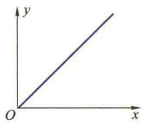
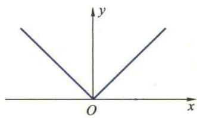
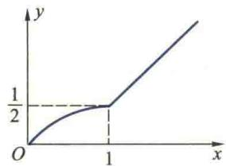
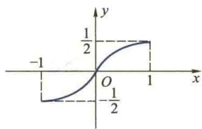

import Guide from '@/components/Guide.astro';
import Knowledge from '@/components/Knowledge.astro';
import Example from '@/components/Example.astro';
import Analysis from '@/components/Analysis.astro';
import Solution from '@/components/Solution.astro';
import Variant from '@/components/Variant.astro';
import Note from '@/components/Note.astro';
import Block from '@/components/Block.astro';
import Method from '@/components/Method.astro';

习题3.1

(A)

1. (1) $\frac{1}{2}$ ; (2) e-1. 2. $\frac{1}{2} ka^2$ . 3. $W = \int_{a}^{b} k \frac{Q \cdot q}{x^2} \mathrm{d}x$ .

4. (1) 0; (2) 1; (3) $\frac{1}{4}\pi a^2$ ; (4) $\frac{9}{4}$ .

8.（1）不可积，积分区间无限；(2）可积， $f(x)$ 只有一个第一类间断点；(3）不可积， $f(x)$ 无界；(4）不可积， $f(x)$ 无界；(5）可积， $f(x)$ 只有一个第一类间断点；(6）可积， $f(x)$ 在其定义域[0,1]上单调.

9.（1）不正确，反例： $\int_{-1}^{2}x\mathrm{d}x$ ；（2）不正确，反例：本节习题8(6)；（3）不正确，反例： $f(x) =$

1, 当 $x$ 为有理数，(4) 不正确，参考本题第(3)题举出反例；(5) 不正确，反例同本题第(3)题；-1, 当 $x$ 为无理数；

(6) 正确.

11. (1) $\int_{0}^{1}\mathrm{e}^{x}\mathrm{d}x > \int_{0}^{1}\mathrm{e}^{x^{2}}\mathrm{d}x;(2)\int_{1}^{2}2\sqrt{x}\mathrm{d}x > \int_{1}^{2}\left(3 - \frac{1}{x}\right)\mathrm{d}x;(3)\int_{0}^{1}\ln (1 + x)\mathrm{d}x > \int_{0}^{1}\frac{\arctan x}{1 + x}\mathrm{d}x.$

(B)

1. (1) 不一定; (2) 不一定; (3) 相等.

3. 提示：先利用积分中值定理证明 $\exists \eta \in \left(\frac{2a}{3}, a\right)$ 使 $f(\eta) = f(0)$ ，再利用 Rolle 中值定理.

4. 提示：因为 $\int_{a}^{b}[\lambda f(x) + g(x)]^{2}\mathrm{d}x\geqslant 0(\lambda \in \mathbf{R})$ ，并利用二次三项式判定

<Block title="习题3.2 答案">
(A)

3. (1) $\frac{4}{3}$ ; (2) 1; (3) 2; (4) 1; (5) $\frac{1}{2}$ ; (6) $-\frac{1}{6}$ ; (7) $6\frac{1}{3}$ ; (8) $1 - \frac{\pi}{4}$ .

4. (1) $\arctan x$ ; (2) $-\frac{1}{1 + x^4}$ ; (3) $\frac{1}{2\sqrt{x}}\mathrm{e}^x$ ; (4) $-\tan x$ ; (5) $\frac{1}{3\sqrt[3]{x^2}}\ln (1 + x^2) - \frac{1}{2\sqrt{x}}\ln (1 + x^3)$ ;

(6) $-\sin x\cos(\pi\cos^{2}x)-\cos x\cos(\pi\sin^{2}x)$ ; (7) $\int_{x^{2}}^{x^{3}}\varphi(t)\mathrm{d}t+3x^{3}(1+x^{2})\varphi(x^{3})-2x^{2}(1+x)\varphi(x^{2})$ .

6. $\frac{\mathrm{dy}}{\mathrm{dx}} = 2t\cot t\csc t.$ 7. $y' = -2x^3\mathrm{e}^{x^2 - y^2}$

8. (1)

(2)

(3)

(4)

9. (1) $\frac{1}{3}$ ; (2) $\frac{\pi^2}{4}$ .

10. 定义域 $[0, +\infty]$ ; 单调减区间 $(0, 1)$ , 单调增区间为 $(1, +\infty)$ ; 极小值点为 $x = 1$ .

11. (1) $F(x) = \begin{cases} \frac{x^3}{3}, & x \leqslant 0, \\ 1 - \cos x, & x > 0; \end{cases}$ (2) $F(x)$ 处处可导.

12.（1）正确；（2）不正确；（3）正确；（4）不正确；（5）不正确；（6）不正确.

13. (1) $2x^{\frac{3}{2}} + 10x^{\frac{1}{2}} + C$ ; (2) $\frac{x^2}{2} + x + C$ ; (3) $3(x - \arctan x) + C$ ; (4) $\frac{2^{x-1}e^x}{\ln(2e)} + C$ ; (5) $\tan x - x + C$ ;

(6) $-\cot t-\tan t+C.$

(B)

1. 提示：利用可积的必要条件与连续的定义. 2. a=4, b=1. 3. $\frac{1}{6}$ .

5. 提示：利用积分中值定理与 Rolle 中值定理.

6. 提示：考察 $F(x) = \int_{a}^{x} f(t) \, \mathrm{d}t \int_{x}^{b} g(t) \, \mathrm{d}t$ . 并利用 Rolle 定理.

## 习题3.3

(A)

1. (1) $-\frac{1}{\omega}\cos (\omega t + \varphi) + C;$ (2) $-3(3 - 5x)^{\frac{2}{3}} + C;$

(3) $\frac{1}{4}\arcsin 4x + C;$ (4) $\frac{1}{7} (3 + 2x^3)^{\frac{7}{6}} + C;$

(5) $\frac{3}{4} \ln (1 + x^4) + \frac{1}{2} \arctan x^2 + C$ ; (6) $\frac{4}{3} (1 + \sqrt{x})^{\frac{3}{2}} + C$ ;

(7) $\sin \ln |x| + C;$ (8) $\frac{1}{2} (\ln \ln x)^2 +C;$

(9) $-\frac{1}{\sin x} - \sin x + C;$ (10) $\frac{1}{32}(12x + 8\sin 2x + \sin 4x) + C;$

(11) $\frac{1}{32} (4x - \sin 4x) + C;$ (12) $\tan x + \frac{1}{3}\tan^3 x + C;$

(13) $-\frac{1}{3}\csc^3 x + C;$

(14) $-\ln (1 + \mathrm{e}^{-x}) + C;$

(15) $\frac{1}{\sqrt{2}}\arctan (\sqrt{2}\tan x) + C;$

(16) $-\mathrm{e}^{-\sqrt{1 + x^2}} + C;$

(17) $\frac{2}{3} (\arctan x)^{\frac{3}{2}} + C;$

(18) $-\ln \left|\arccos \frac{x}{2}\right| + C;$

(19) $\frac{1}{3}\sec^3 x - \sec x + C;$

(20) $\frac{1}{\sqrt{2}}\arctan \frac{x - 1}{\sqrt{2}} + C;$

(21) $\arcsin \frac{2x - 1}{\sqrt{5}} + C;$ (22) $\frac{1}{4}\ln \frac{1 + \sin^2x}{\cos^2x} +C;$

$$

\frac {5}{4} (\sin x - \cos x) ^ {\frac {4}{5}} + C;

$$

(24) $2\ln\frac{e^{\frac{x}{2}}+1}{e^{\frac{x}{2}}} - e^{-\frac{x}{2}} + C.$

3. (1) $-\frac{1}{5} (3 - 2x)^{\frac{3}{2}}(1 + x) + C;$

(2) $2\left[\sqrt{1+x}-\ln(1+\sqrt{1+x})\right]+C;$

(3) $\frac{x}{\sqrt{1-x^{2}}}+C;$

(4) $\frac{a^{2}}{2}\arcsin\frac{x}{a}-\frac{x}{2}\sqrt{a^{2}-x^{2}}+C;$

(5) $\frac{1}{9}\frac{\sqrt{x^{2}-9}}{x}+C;$

(6) $\sqrt{1 + x^2} + \frac{1}{\sqrt{1 + x^2}} + C;$

(7) $-2\sqrt{1 + \frac{2}{x}} + \ln \left|\frac{\sqrt{1 + \frac{2}{x}} + 1}{\sqrt{1 + \frac{2}{x}} - 1}\right| + C;$

(8) $-\frac{1}{\sqrt{2}}\ln\frac{\sqrt{2}+\sqrt{x^{2}+2x+3}}{|1+x|}+C;$

(9) $2\sqrt{1 + \ln x} +\ln \left|\frac{\sqrt{1 + \ln x} - 1}{\sqrt{1 + \ln x} + 1}\right| + C;$

(10) $\frac{2}{27}\sqrt{3\mathrm{e}^x - 2}(3\mathrm{e}^x +4) + C;$

(11) $\ln\left|1+\tan\frac{x}{2}\right|+C;$

(12) $-\sqrt{1-x^{2}}-\frac{1}{2}\arcsin x+\frac{1}{2}x\sqrt{1-x^{2}}+C;$

(13) $\sqrt{\mathrm{e}^{2x} + 5} - \frac{\sqrt{5}}{2}\ln \frac{\sqrt{\mathrm{e}^{2x} + 5} + \sqrt{5}}{\sqrt{\mathrm{e}^{2x} + 5} - \sqrt{5}} + C;$

(14) $\frac{1}{3} \frac{x - 1}{\sqrt{x^2 - 2x + 4}} + C.$

4. (1) $\frac{2}{3}$ ; (2) $\arctan e - \frac{\pi}{4}$ ; (3) $\frac{7}{2}$ ; (4) $\frac{4}{3}$ ; (5) $2(2 - \ln 3)$ ; (6) $1 - \frac{\pi}{4}$ ; (7) $\ln (2 + \sqrt{3}) - \frac{\sqrt{3}}{2}$ ;

(8) $2\sqrt{2}$ .

5. (3) $\frac{1}{2}$ .

7. (1) $\frac{1}{9} (\sin 3x - 3x\cos 3x) + C;$

(2) $(x^{3} + 6x)$ sh $x - (3x^{2} + 6)$ ch $x + C$ ;

(3) $\frac{1}{6} [2x^3\arctan x - x^2 + \ln (1 + x^2)] + C;$

(4) $\frac{1}{2} (1 + x^2)\ln (1 + x^2) - \frac{x^2}{2} +C;$

(5) $-\frac{x}{1 + \mathrm{e}^x} - \ln (\mathrm{e}^{-x} + 1) + C;$

(6) $4\sqrt{1+x}-2\sqrt{1-x}\arcsin x+C;$

(7) $x\tan x+\ln\left|\cos x\right|+C;$

(8) $(4-2x)\cos\sqrt{x}+4\sqrt{x}\sin\sqrt{x}+C;$

(9) 1;

(10) $-2\pi$ ;

(11) $\frac{1}{8} (\sin 2x - 2x\cos 2x) + C;$

(12) $\frac{x}{2} (\sin \ln x - \cos \ln x) + C;$

(13) $\mathrm{e}^x\ln x + C;$

(14) $x(\arccos x)^{2} - 2\sqrt{1 - x^{2}}\arccos x - 2x + C.$

9. (1) $-\frac{1}{3}\left(\frac{1}{x} + \frac{1}{\sqrt{3}} \arctan \frac{x}{\sqrt{3}}\right) + C;$

(2) $\frac{1}{16}\ln\frac{t^{2}+1}{t^{2}+9}+C;$

(3) $-\frac{1}{(x - 1)^{99}}\left[\frac{1}{97} (x - 1)^2 +\frac{1}{49} (x - 1) + \frac{1}{99}\right] + C;$

(4) $\ln |x| - \frac{2}{7}\ln |1 + x^7| + C;$ (5) $\frac{2}{\sqrt{5}}\arctan \left(\frac{1}{\sqrt{5}}\tan \frac{x}{2}\right) + C;$

(6) $\ln\left|\cos x+\sin x\right|+C;$ (7) $\frac{1}{6a}\ln\left|\frac{a+x^{3}}{a-x^{3}}\right|+C;$

(8) $\frac{1}{4} [x^4 - 2\ln (x^8 + 4x^4 + 5) + 3\arctan (x^4 + 2)] + C;$

(9) $\frac{1}{2} (\ln \tan x)^2 + C;$ (10) $\ln \left(1 + \frac{1}{2}\sin 2x\right) + C;$

(11) $x \tan \frac{x}{2} + C$ ; (12) $\frac{1}{\sqrt{2}} \arctan \frac{x^2 - 1}{\sqrt{2} x} + C$ ;

(13) $\frac{x\ln x}{\sqrt{1 + x^2}} -\ln (x + \sqrt{1 + x^2}) + C;$ (14) $\frac{x}{2} -\frac{1}{2}\ln |\sin x + \cos x| + C;$

(15) $-\frac{1}{x - 1} - \frac{1}{(x - 1)^2} - \frac{1}{(x - 1)^3} + C;$ (16) $-2\sqrt{\frac{1 + x}{x}} + \ln \left|\frac{1 + \sqrt{\frac{1 + x}{x}}}{1 - \sqrt{\frac{1 + x}{x}}}\right| + C.$

(B)

2. $2\sqrt{2} n.$ 3.0. 4. $n^2\pi .$ 5. $\frac{3}{2}\mathrm{e}^{\frac{5}{2}}.$ 6. $\frac{\mathrm{e}^x}{1 + x} +C.$

## 习题3.4

(A)

1. (1) $\frac{25}{3}$ ; (2) $\frac{1}{3}$ ; (3) $\frac{a^2}{6}$ ; (4) $\ln 2 - \frac{1}{2}$ ; (5) 8; (6) $\frac{4}{3}$ ; (7) 4; (8) $\frac{\pi}{3} + 2 - \sqrt{3}$ ;

(9) $3\pi a^{2}$ ; (10) $\frac{5}{8}\pi a^{2}$ .

2. (1) $\frac{4}{3}\pi ab^2, \frac{4}{3}\pi a^2b$ ; (2) $\frac{\pi^2}{2}, 2\pi^2, \pi \left(4 - \frac{\pi}{2}\right)$ ; (3) $2\pi^2a^2b$ ; (4) $160\pi$ ; (5) $6\pi^3a^3$ .

3. (1) 2; (2) $\frac{\sqrt{3}}{2}$ ; (3) $\frac{\pi}{4}$ .

4. $kMm\left(\frac{1}{a}-\frac{1}{a+l}\right)$ .

5. (1) $g\frac{h^2}{3}\sqrt{a^2 + b^2}$ ; (2) $g\frac{h^2}{6}\sqrt{a^2 + b^2}$ .

6. (1) $\frac{2}{3} gab^2$ ; (2) $\pi gab^2$ .

7. (1) $\frac{1}{2}\pi gR^2 H^2$ ; (2) $\frac{1}{4}\pi gR^2 H^2$ ; (3) $\frac{1}{12}\pi gH^2(R^2 + 2Rr + 3r^2)$ ; (4) $\frac{32}{3}\pi g$ .

8. (1) $\frac{1}{2}\pi gR^2 H^2$ ; (2) $\frac{1}{2}\pi gR^2 H^2(2\rho - 1)$ .

9. $\frac{2kq\delta}{R}$ . 10. $\frac{2\pi kq\delta R}{(a^2 + R^2)^{\frac{3}{2}}}$ .

11. (1) $V_{A} = \frac{\pi a^{2}}{2}, V_{B} = \pi \left(1 - \frac{4}{5} a\right)$ ; (2) $a = \frac{\sqrt{66} - 4}{5}$ ; (3) $a = \frac{4}{5}$ .

(B)

1. $V=2\pi\int_{a}^{b}xf(x)\mathrm{d}x.$ 2. $\frac{4}{5\pi}.$ 3. $4\pi\ln\frac{6}{5}\approx2.291$ （万人）.

4. $\left(\frac{\pi}{4}+\frac{1}{3}\right)\pi g.$

## 习题3.5

(A)

1. (1) $\frac{\pi}{2}$ ; (2) $\frac{1}{15} \ln 4$ ; (3) 2; (4) $\frac{\pi}{4} + \frac{1}{2} \ln 2$ ; (5) $\pi$ ; (6) 发散.

2. (1) 1; (2) 发散; (3) $\frac{8}{3}$ ; (4) 发散; (5) $\pi$ ; (6) -1; (7) $\frac{\pi}{2}$ ; (8) $\ln \pi + 1$ .

3. (1) $1 - \cos \frac{4}{\pi}$ ; (2) $\pi$ .

4. $k \leqslant 1$ 时发散, k > 1 时收敛.

5.（1）收敛；（2）收敛；（3）发散；（4）收敛.

6.（1）发散；（2）收敛；（3）收敛；（4）发散；（5）收敛.

7. 解法一错.

8. 解法二错.

(B)

1. 不能.

2. (1) $p < 1$ 且 $q < 1$ 时收敛, 其他情形发散; (2) $p > 1$ 且 $q < 1$ 时收敛, 其他情形发散; (3) $1 < \alpha < 2$ 时收敛; (4) 收敛.

3.（2）提示：利用分部积分法及等式 $x^{p} = x^{p - 1} - x^{p - 1}(1 - x)$

## 第3章习题

1. (1) (D); (2) (D); (3) (A); (4) (D).

2. 在点 $x = 0$ 不连续. 3. $f(x) = \sqrt{x} - 1$ .

4. (1) $\ln 2$ ; (2) $\frac{1}{\ln 2}$ ; (3) $\frac{1}{p+1}$ ; (4) 0.

5. (1) $\sqrt{1 + x^2}\ln (x + \sqrt{1 + x^2}) - x + C;$ (2) $-\mathrm{e}^{-x}\arctan \mathrm{e}^{x} + x - \frac{1}{2}\ln (1 + \mathrm{e}^{2x}) + C;$

(3) $\ln \frac{x}{\sqrt{1 + x^2}} - \frac{1}{x} \arctan x - \frac{1}{2} (\arctan x)^2 + C$ ; (4) $\frac{1}{2} x + \frac{\sqrt{x}}{2} \sin 2\sqrt{x} + \frac{1}{4} \cos 2\sqrt{x} + C$ ;

(5) $\frac{x}{2} (\cos \ln x + \sin \ln x) + C;$ (6) $\arcsin x - \sqrt{1 - x^2} +C;$

(7) $\frac{1}{\sqrt{1 + \cos x}} + \frac{1}{2\sqrt{2}} \ln \frac{\sqrt{2} - \sqrt{1 + \cos x}}{\sqrt{2} + \sqrt{1 + \cos x}} + C;$ (8) $4 - \sqrt{2} \ln \frac{\sqrt{2} + 1}{\sqrt{2} - 1};$

(9) 2; (10) $\frac{\pi}{4}$ ; (11) $\ln 2$ ; (12) $\frac{4}{3}$ ; (13) $1 + \ln \left(1 + \frac{1}{e}\right)$ ;

(14) $-2\arcsin e^{-\frac{x}{2}} + C;$ (15) $2\left(1 - \frac{1}{e}\right)$ ;

(16) 6-2e; (17) $2n\sqrt{2}\pi$ ; (18) $\frac{(n - 1)!(m - 1)!}{(m + n - 1)!}$ ;

(19) $-\frac{4}{3}\sqrt{1 + x\sqrt{x}} + C;$ (20) $\frac{x}{4} +\frac{x^3}{12} +\frac{1}{4} (1 + x^2)^2\mathrm{arccot}x + C;$

(21) $\frac{x}{4\cos^4 x} - \frac{1}{4}\left(\tan x + \frac{1}{3}\tan^3 x\right) + C;$ (22) $-\sqrt{x - x^2} + 3\arctan \sqrt{\frac{x}{1 - x}} + C.$

6. 提示: $a \cos x + b \sin x = \sqrt{a^{2} + b^{2}} \sin(x + \alpha)$ ，其中 $\sin \alpha = \frac{a}{\sqrt{a^{2} + b^{2}}}$ , $\cos \alpha = \frac{b}{\sqrt{a^{2} + b^{2}}}$ ，再用定积分换元法证明.

7. 提示: $f(n) + f(n - 2) = \int_{0}^{\frac{\pi}{4}} \tan^{n-2} x \sec^{2} x \, dx.$

8. 提示: 令 $x = \alpha t$ , 则 $\int_{0}^{\alpha} f(x) \, dx = \alpha \int_{0}^{1} f(\alpha t) \, dt$ , 再与不等式右边比较.

9. $\frac{1}{2}\ln^2 x$ ，提示：令 $\frac{1}{x} = t$ ，则 $f\left(\frac{1}{x}\right) = \int_{1}^{x} \frac{\ln t}{t(1 + t)} \mathrm{d}t$ ，再求 $f(x) + f\left(\frac{1}{x}\right)$

10. 3. 11. $2\mathrm{e}^{\gamma} - (\mathrm{e} + \mathrm{e}^{-1})y - \frac{2}{\mathrm{e}}$ 12. $\frac{5}{2}$ 13. $\frac{1}{2}\ln 2$ 14. $\frac{\pi}{5} (\mathrm{e}^{-2\pi} + 1)$ .

15. $P\left(\pm\frac{1}{\sqrt{3}},\frac{2}{3}\right)$ .

## 综合练习题

（1）利用微元法可得一个生产周期 $[0,T]$ 内的储存费为 $0.008T^{2},f(T) = 30\left(\frac{5}{T} +0.008T\right)$

(2) $T_{0}=25$ 天, $t_{0}=5$ 天.
</Block>
