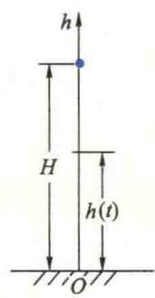
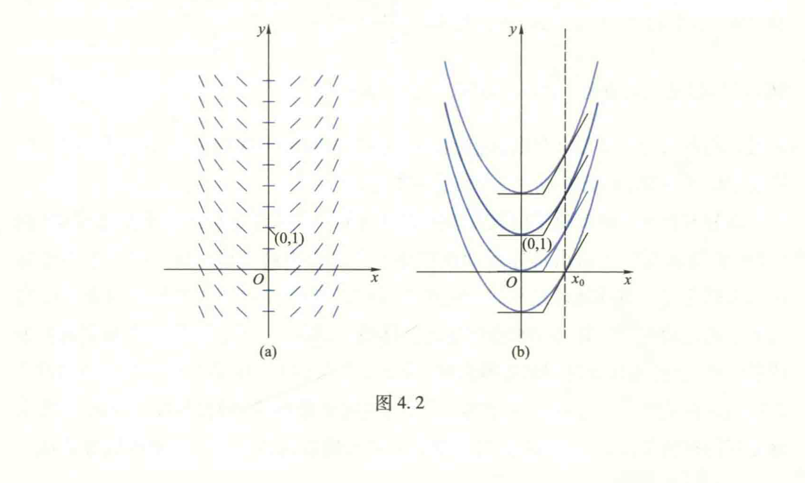
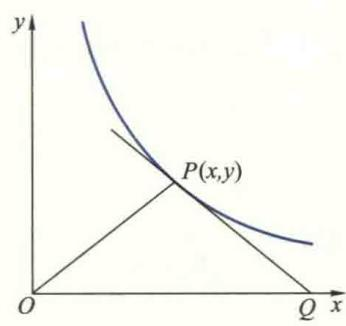

import ExerciseTrigger from '@/components/exercises/ExerciseTrigger.astro';
import QRCodeVideo from '@/components/QRCodeVideo.astro';

import Guide from '@/components/Guide.astro';
import Knowledge from '@/components/Knowledge.astro';
import Example from '@/components/Example.astro';
import Analysis from '@/components/Analysis.astro';
import Solution from '@/components/Solution.astro';
import Variant from '@/components/Variant.astro';
import Note from '@/components/Note.astro';
import SideNote from '@/components/SideNote.astro';
import Block from '@/components/Block.astro';
import Method from '@/components/Method.astro';
import Exercise from '@/components/Exercise.astro';

为了研究事物的运动变化规律，必须建立描述运动变化规律的函数关系。然而，在实际问题中，与问题有关的变量之间的函数关系往往很难直接建立，常常只能根据问题的具体含义和有关知识，得到未知函数及其导数（或微分）的关系式，然后设法由此关系式求出未知函数。这样的关系式就是微分方程，由此关系式求出未知函数就是解微分方程。前面讲过的已知导函数 $f(x)$ 求其原函数 $y=F(x)$（或不定积分 $\int f(x) \mathrm{d}x = F(x) + C$）的问题，实际上就是求解最简单的微分方程

$$

\frac{\mathrm{d}y}{\mathrm{d}x} = f(x)

$$

的问题。在实际问题中遇到的微分方程大都比较复杂，因此，研究微分方程理论及其求解方法就是我们面临的一个重要课题。本节主要讨论几类能直接利用积分方法求解的简单微分方程及其应用。

### 1.1 几个基本概念

首先，通过两个简单的例子来说明有关微分方程的几个基本概念。

<Example title="例 1.1 求曲线的方程">
设一平面曲线通过 $xOy$ 平面上的点 $(1,2)$，曲线上任一点 $(x,y)$ 处的切线斜率为 $2x$，求该曲线的方程。

<Solution title="解">
设所求曲线的方程为 $y=y(x)$，根据导数的几何意义，它应满足

$$

\frac{\mathrm{d}y}{\mathrm{d}x} = 2x \quad (\text{或 } \mathrm{d}y = 2x\mathrm{d}x)

$$

这是一个含未知函数 $y=y(x)$ 的导数（或微分）的关系式。两端对 $x$ 积分得

$$

y = \int 2x\mathrm{d}x = x^2 + C

$$

其中 $C$ 是任意常数。根据题目要求，它还应满足附加条件

$$

y|_{x=1} = 2

$$

将此条件代入上式即得 $C=1$，因此所求曲线的方程为

$$

y = x^2 + 1

$$

</Solution>
</Example>

<Example title="例 1.2 自由落体运动问题">
设质量为 $m$ 的质点从高度为 $H$ 的地方自由下落（图 4.1），其初速度为 $v_0$。不考虑空气的阻力，试求质点在下落过程中高度 $h$ 与时间 $t$ 的关系。

<figure class="vp-figure">
  
  <figcaption>图 4.1 自由落体运动模型</figcaption>
</figure>

<Solution title="解">
设质点开始下落的时刻为 $t=0$，在任意时刻 $t$，质点的高度为 $h=h(t)$，则由 Newton 第二定律，$h$ 应满足

$$

m \frac{\mathrm{d}^2h}{\mathrm{d}t^2} = -mg \quad \text{或} \quad \frac{\mathrm{d}^2h}{\mathrm{d}t^2} = -g

$$

对上式两次积分可得

$$

h(t) = -\frac{1}{2}gt^2 + C_1t + C_2

$$

其中 $C_1$ 与 $C_2$ 是两个任意常数。根据题意，还应满足两个附加条件

$$

h|_{t=0} = H, \quad v = \left. \frac{\mathrm{d}h}{\mathrm{d}t} \right|_{t=0} = v_0

$$

将它们代入上式可得 $C_1=v_0, C_2=H$，因此所求的 $h(t)$ 应为

$$

h(t) = H - \frac{1}{2}gt^2 + v_0t

$$

</Solution>
</Example>

$\frac{\mathrm{d}y}{\mathrm{d}x} = 2x$ 与 $\frac{\mathrm{d}^2h}{\mathrm{d}t^2} = -g$ 就是两个简单的微分方程。又如

$$

y\mathrm{d}x + x\mathrm{d}y = 0, \quad y'' + 2y' + 3y = e^x, \quad y'' + (y')^3 = x

$$

等都是微分方程。如果方程中的未知函数 $y$ 是自变量 $x$ 的一元函数，则称该方程为常微分方程。

微分方程中所含未知函数的最高阶导数（或微分）的阶数，称为该方程的阶。例如，$\frac{\mathrm{d}y}{\mathrm{d}x} = 2x, y\mathrm{d}x + x\mathrm{d}y = 0$ 都是一阶微分方程，而 $\frac{\mathrm{d}^2h}{\mathrm{d}t^2} = -g, y'' + 2y' + 3y = e^x$ 与 $y'' + (y')^3 = x$ 都是二阶微分方程。

<Knowledge title="微分方程的解">
满足微分方程的函数 $y=y(x)$ 称为该方程的解。换句话说，如果将函数 $y=y(x)$ 及其导数（或微分）代入微分方程，能使方程变为恒等式，那么，函数 $y=y(x)$ 称为该方程的解。

例如 $y=x^2+C$ 与 $y=x^2+1$ 都是方程 $\frac{\mathrm{d}y}{\mathrm{d}x} = 2x$ 的解；而 $h=H-\frac{1}{2}gt^2+v_0t$ 与 $h=-\frac{1}{2}gt^2+C_1t+C_2$ 都是方程 $\frac{\mathrm{d}^2h}{\mathrm{d}t^2} = -g$ 的解。
</Knowledge>

<Knowledge title="微分方程的通解">
<SideNote title="注">
并非任何微分方程都有通解。例如，方程 $y' + y^2 = 0$ 只有解 $y=0$，而 $(y')^2 + 1 = 0$ 没有实解。今后若无特别声明，本书仅讨论微分方程的实解。
</SideNote>

如果微分方程的解中含有任意常数，并且其中独立的任意常数的个数等于该方程的阶，则称这样的解为微分方程的通解。两个任意常数称为是独立的，是指它们不能通过运算合并成一个。例如，$y=x^2+C$ 与 $h=-\frac{1}{2}gt^2+C_1t+C_2$ 分别是方程 $\frac{\mathrm{d}y}{\mathrm{d}x} = 2x$ 与 $\frac{\mathrm{d}^2h}{\mathrm{d}t^2} = -g$ 的通解。

<SideNote title="注意">
微分方程的通解不一定能包含方程的所有解。例如，读者不难验证，$y = \sin(x+C)$ 是方程 $y' = \sqrt{1-y^2}$ 的通解，$y = \pm 1$ 也是该方程的解，但不包含在上述通解中。
</SideNote>

不难验证，$h = -\frac{1}{2}gt^2 + C_1t$ 与 $h = -\frac{1}{2}gt^2 + C_1 + 2C_2$ 虽然都是二阶方程 $\frac{\mathrm{d}^2h}{\mathrm{d}t^2} = -g$ 的解，但不是通解。这是因为前者只含一个任意常数，后者形式上虽然含有两个任意常数，但它们不独立，只要令 $C = C_1 + 2C_2$ 就合并成为一个任意常数了。
</Knowledge>

微分方程的通解反映了由该方程所描写的某一类运动过程的一般变化规律（例 1.2 中的通解反映了自由落体运动中物体下落过程中高度 $h$ 随时间 $t$ 的一般变化规律），要确定某一具体运动过程的特定规律（例 1.2 中质点自高为 $H$ 处以初速度 $v_0$ 自由下落的运动规律），还必须根据问题的具体情况，提出一些附加条件来确定通解中的任意常数，这种附加条件叫做定解条件。

<Knowledge title="初值条件">
例 1.2 与例 1.1 中的那种反映运动初始状态或曲线在某一点特定状态的定解条件，叫做初值条件或初始条件。一般地，$n$ 阶微分方程的初值条件有 $n$ 个，就是当自变量 $x$ 取某确定的值 $x_0$ 时，未知函数及其从 $x_0$ 开始的各阶导数在 $x_0$ 处的值。
</Knowledge>

阶直到 $n-1$ 阶导数的值，即

$$

y|_{x=x_0} = y_0, y'|_{x=x_0} = y_1, \dots, y^{(n-1)}|_{x=x_0} = y_{n-1}

$$

微分方程的不含任意常数的解，称为特解。一般地，它可利用定解条件（例如初值条件）由通解确定其中的任意常数后得到。例如，$y=x^2+1$ 是方程 $\frac{\mathrm{d}y}{\mathrm{d}x}=2x$ 满足初值条件 $y|_{x=1}=2$ 的特解，而 $h=H-\frac{1}{2}gt^2+v_0t$ 是方程 $\frac{\mathrm{d}^2h}{\mathrm{d}t^2}=-g$ 满足初值条件 $h|_{t=0}=H$ 与 $\frac{\mathrm{d}h}{\mathrm{d}t}|_{t=0}=v_0$ 的特解。

### 一阶微分方程及其解的几何意义

为了更直观地理解微分方程及其解的含义，下面以例 1.1 中的一阶微分方程为例，对微分方程及其解作简单的几何解释。

考察例 1.1 中的微分方程 $\frac{\mathrm{d}y}{\mathrm{d}x}=2x$。给定这样一个微分方程，就意味着在 $xOy$ 平面内的任一点 $P(x,y)$，确定了唯一的值 $\left. \frac{\mathrm{d}y}{\mathrm{d}x} \right|_{(x,y)} = 2x$。在几何上，就相当于在 $xOy$ 平面上任一点 $P$ 处确定了一条斜率为 $2x$ 的小线段，称为点 $P$ 处的线素，从而在 $xOy$ 平面上确定了一个线素场（图 4.2(a)）。该方程的通解，就是求无数条抛物线 $y=x^2+C$，使得它们在 $xOy$ 平面内的任一点 $P(x,y)$ 处的切线恰好与该点的线素重合（图 4.2(b)），称为微分方程所确定的积分曲线族。求该方程满足初值条件 $y|_{x=x_0}=y_0$ 的特解，就是从通解所表示的积分曲线族中找出一条通过点 $P_0(x_0,y_0)$ 的积分曲线。例如满足初值条件 $y|_{x=0}=1$ 的特解就是通过点 $(0,1)$ 的抛物线 $y=x^2+1$。

<figure class="vp-figure">
  
  <figcaption>图 4.2 (a) 线素场 (b) 积分曲线族</figcaption>
</figure>

### 1.2 可分离变量的一阶微分方程

形如

$$

\frac{\mathrm{d}y}{\mathrm{d}x} = f(x)g(y) \tag{1.1}

$$

的一阶微分方程称为可分离变量方程。对于这类方程，如果 $g(y) \neq 0$，那么它就可以写成

$$

\frac{\mathrm{d}y}{g(y)} = f(x)\mathrm{d}x \tag{1.2}

$$

此时，变量 $x$ 与 $y$ 已被分离在等号两边。下面讨论这类方程的解法。

设 $f$ 与 $g$ 都是连续函数，$y=y(x)$ 是原方程的任一解，将它代入 (1.2) 式，则有恒等式

$$

\frac{y'(x)\mathrm{d}x}{g[y(x)]} \equiv f(x)\mathrm{d}x

$$

两端对 $x$ 积分，得

<SideNote title="注意">
在解微分方程时，为了突出任意常数 $C$，常把 $\int f(x)\mathrm{d}x$ 中所含的任意常数 $C$ 明确写出来。
</SideNote>

$$

\int \frac{y'(x)}{g[y(x)]}\mathrm{d}x = \int f(x)\mathrm{d}x + C

$$

根据不定积分的换元积分法则 (I)，得

$$

\int \frac{\mathrm{d}y}{g(y)} = \int f(x)\mathrm{d}x + C \tag{1.3}

$$

不难说明，由此式所确定的隐函数 $y=y(x)$ 就是方程 (1.2) 的通解。事实上，将它两边对 $x$ 求微分即得 (1.2) 式，所以它是方程 (1.2) 的解，其中包含有一个任意常数 $C$，所以是方程 (1.2) 的通解。又因为，凡方程 (1.2) 的解都是方程 (1.1) 的解，所以 (1.3) 式就是原方程 (1.1) 的通解。今后，我们就用对 (1.2) 式两端积分得到 (1.3) 式来求解方程 (1.1) 的通解。这种通过分离变量来求解微分方程的方法叫做分离变量法。

如果存在常数 $y_0$，使 $g(y_0)=0$，那么 $y=y_0$ 显然满足方程 (1.1)，从而也是原方程 (1.1) 的解。如果 $y=y_0$ 包含在 (1.3) 式中（即它可以由 (1.3) 式中 $C$ 取特定常数得到），那么，我们也把包含 $y=y_0$ 的 (1.3) 式理解为方程 (1.1) 的通解；如果 $y=y_0$ 不包含在 (1.3) 式中，那么我们就把 (1.3) 式理解为原方程的通解。

<Example title="例 1.3 求微分方程 $\frac{\mathrm{d}y}{\mathrm{d}x} = 2xy$ 的通解">
<SideNote title="注意">
与解代数方程时出现丢根问题类似，在利用分离变量法求解微分方程时容易出现丢解问题。为避免这种情况，切记在将方程 (1.1) 分离变量为 (1.2) 式时分别讨论 $g(y) \neq 0$ 和存在 $y_0$ 使 $g(y_0)=0$ 两种情形。若只讨论前一种情形就可能丢解。例如 1.3 中，只能求得 $y = \pm e^{C_1} e^{x^2}$，它是通解，但 $\pm e^{C_1} \neq 0$，丢失了 $y=0$ 这个解。
</SideNote>
<Solution title="解">
该方程是变量可分离方程。设 $y \neq 0$，分离变量得

$$

\frac{\mathrm{d}y}{y} = 2x\mathrm{d}x

$$

两端积分，则

$$

\int \frac{\mathrm{d}y}{y} = \int 2x\mathrm{d}x + C_1

$$

从而得

$$

\ln|y| = x^2 + C_1

$$

故

$$

|y| = e^{x^2+C_1} = e^{C_1} e^{x^2} \quad \text{或} \quad y = Ce^{x^2}

$$

其中 $C = \pm e^{C_1}$ 是非零的任意常数。

由于 $y=0$ 显然也是原方程的解，只要允许 $C$ 可以取 $0$，那么它就可以包含在 $y=Ce^{x^2}$ 中。因此，所方程的通解可以写成 $y=Ce^{x^2}$，其中 $C$ 为任意常数。
</Solution>
</Example>

<Example title="例 1.4 求微分方程 $x\mathrm{d}x + (x^2+1)\mathrm{d}y = 0$ 满足初值条件 $y|_{x=0}=1$ 的特解">
<SideNote title="注">
由于本题仅满足初值条件 $y|_{x=0}=1$ 的特解，这里不必讨论 $y=0$ 的情形。否则，也应讨论 $y=0$ 的情形。
</SideNote>
<Solution title="解">
先求方程的通解. 分离变量得

$$

\frac{\mathrm{d}y}{y} = -\frac{x}{x^2+1}\mathrm{d}x

$$

两端积分得

$$

\ln|y| = -\frac{1}{2}\ln(x^2+1) + C_1

$$

所以

$$

y = \frac{C}{\sqrt{x^2+1}}

$$

（其中 $C = \pm e^{C_1}$）就是所求方程的通解. 将初值条件代入，得知 $C=1$，即为所求特解：

$$

y = \frac{1}{\sqrt{x^2+1}}

$$

</Solution>
</Example>

### 1.3 一阶线性微分方程

未知函数及其导数都是一次的一阶微分方程称为一阶线性微分方程，它的一般形式是

$$

y' + P(x)y = Q(x) \tag{1.4}

$$

若 $Q(x)=0$，上式变为

$$

y' + P(x)y = 0 \tag{1.5}

$$

称它为与方程 (1.4) 对应的齐次线性微分方程，而方程 (1.4) 称为非齐次线性微分方程，其中 $P(x)$ 与 $Q(x)$ 为连续函数。

齐次线性微分方程 (1.5) 是可分离变量方程。若 $y \neq 0$，分离变量后得

$$

\frac{\mathrm{d}y}{y} = -P(x)\mathrm{d}x \tag{}

$$

两端积分即得其通解为

$$

\ln |y| = -\int P(x)\mathrm{d}x + C_1 \tag{}

$$

或

$$

y = Ce^{-\int P(x)\mathrm{d}x} \tag{1.6}

$$

显然，$y=0$ 也是方程 (1.5) 的解，并且能包含在通解 (1.6) 中。今后在解题中不再——说明。

<SideNote title="注意">
不要混淆“阶”和“次”。微分方程的“阶”是指未知函数最高阶导数的阶数；“次”是指未知函数或其导数的最高幂次数。它们都与自变量无关。

例如：$y' + x^3y^2 + x^3 = 0$ 是一阶二次方程；$y'' + x^3y + \sin x = 0$ 是二阶线性方程。
</SideNote>

下面讨论如何求对应的非齐次线性微分方程的解。设方程 (1.4) 的解为 $y=y(x)$，则

$$

y(x) / e^{-\int P(x)\mathrm{d}x}

$$

必是 $x$ 的函数，记之为 $h(x)$。事实上，若 $h(x)$ 是一个常数 $C$，则由 (1.6) 式，$y(x) = Ce^{-\int P(x)\mathrm{d}x}$ 必是齐次线性方程 (1.5) 的解，而不可能是非齐次方程 (1.4) 的解。因此，非齐次线性微分方程 (1.4) 的解应如下形式：

$$

y = h(x)e^{-\int P(x)\mathrm{d}x} \tag{1.7}

$$

为了求方程 (1.4) 的解，只要将它代入 (1.4) 式确定 $h(x)$ 就行了。由于

$$

\begin{aligned}
y' &= h'(x)e^{-\int P(x)\mathrm{d}x} - h(x)P(x)e^{-\int P(x)\mathrm{d}x} \\
&= h'(x)e^{-\int P(x)\mathrm{d}x} - P(x)y
\end{aligned}

$$

代入 (1.4) 式，得

$$

h'(x)e^{-\int P(x)\mathrm{d}x} - P(x)y + P(x)y = Q(x) \tag{}

$$

从而有

$$

h'(x) = Q(x)e^{\int P(x)\mathrm{d}x} \tag{}

$$

所以

$$

h(x) = \int Q(x)e^{\int P(x)\mathrm{d}x}\mathrm{d}x + C \tag{}

$$

将它代入 (1.7) 式，便得到非齐次线性微分方程 (1.4) 的通解

$$

y = e^{-\int P(x)\mathrm{d}x} \left( \int Q(x)e^{\int P(x)\mathrm{d}x}\mathrm{d}x + C \right) \tag{1.8}

$$

上述通过将齐次线性微分方程通解中的任意常数 $C$ 换成待定函数 $h(x)$ 求对应非齐次线性微分方程通解的方法称为**常数变易法**。如果将通解公式 (1.8) 写成如下形式：

$$

y = Ce^{-\int P(x)\mathrm{d}x} + e^{-\int P(x)\mathrm{d}x} \int Q(x)e^{\int P(x)\mathrm{d}x}\mathrm{d}x \tag{}

$$

那么易见，右端第一项就是齐次线性微分方程 (1.5) 的通解，第二项是非齐次微分方程 (1.4) 的一个特解（因为它可由在 (1.8) 式中取 $C=0$ 得到）。从而得知，非齐次线性微分方程的通解等于它的一个特解与它所对应的齐次线性微分方程的通解之和。

在求解非齐次线性微分方程的时候，不必套用通解公式 (1.8)，最好直接使用常数变易法。

<SideNote title="注">
这段带波浪线的给出了非齐次线性微分方程的解的结构，称为非齐次线性微分方程解的结构定理。若能用某种特殊方法（包括观察验证）求得非齐次方程的一个特解，可直接用该定理求得非齐次方程的通解。
</SideNote>

<Example title="例 1.5 求微分方程 $\frac{\mathrm{d}x}{\mathrm{d}t} + x = t$ 的通解">
求微分方程 $\frac{\mathrm{d}x}{\mathrm{d}t} + x = t$ 的通解。
</Example>

<Solution title="解">
由分离变量法易得对应的齐次线性微分方程

$$

\frac{\mathrm{d}x}{\mathrm{d}t} + x = 0 \tag{}

$$

的通解为 $x = Ce^{-t}$。再用常数变易法求原方程的通解。设其通解为

$$

x = h(t)e^{-t} \tag{1.9}

$$

则

$$

\frac{\mathrm{d}x}{\mathrm{d}t} = h'(t)e^{-t} - h(t)e^{-t} \tag{}

$$

代入原方程并化简得

$$

h'(t) = te^t \tag{}

$$

从而有

$$

h(t) = \int te^t \mathrm{d}t = te^t - e^t + C \tag{}

$$

将它代入 (1.9) 式，得原方程的通解

$$

x = (te^t - e^t + C)e^{-t} = Ce^{-t} + t - 1 \tag{}

$$

</Solution>

<Example title="例 1.6 求微分方程 $\frac{\mathrm{d}y}{\mathrm{d}x} = \frac{y}{y^3+x}$ 的通解和满足初值条件 $y|_{x=0}=1$ 的特解">
求微分方程 $\frac{\mathrm{d}y}{\mathrm{d}x} = \frac{y}{y^3+x}$ 的通解和满足初值条件 $y|_{x=0}=1$ 的特解。
</Example>

<Solution title="解">
表面上看，此方程不是线性微分方程。但是，如果把 $y$ 看作是自变量，$x$ 看作是因变量，利用反函数求导法则，可把原方程改写成

$$

\frac{\mathrm{d}x}{\mathrm{d}y} = \frac{y^3+x}{y} = \frac{1}{y}x + y^2 \tag{1.10}

$$

那么，就得到一个关于未知函数 $x$ 的一阶非齐次线性微分方程了。

先求解对应的齐次线性微分方程

$$

\frac{\mathrm{d}x}{\mathrm{d}y} = \frac{1}{y}x

$$

分离变量后积分得

$$

\ln |x| = \ln |y| + \ln |C| \tag{1}

$$

<SideNote title="注">
此处把积分常数写成 $\ln |C|$ 是为了合并形式简洁。
</SideNote>

从而得到齐次线性微分方程的通解为 $x = Cy$。

下面用常数变易法求非齐次线性微分方程的通解。令 $x = h(y)y$，则

$$

\frac{\mathrm{d}x}{\mathrm{d}y} = h'(y)y + h(y)

$$

代入方程 (1.10) 并化简，得 $h'(y) = y$，从而

$$

h(y) = \frac{1}{2}y^2 + C

$$

于是原方程通解为

$$

x = \frac{1}{2}y^3 + Cy

$$

代入初值条件 $y|_{x=0}=1$ 得 $C = -\frac{1}{2}$。这样，所求特解为 $x = \frac{1}{2}y(y^2-1)$。
</Solution>

### 1.4 可用变量代换法求解的一阶微分方程

有些一阶微分方程不属于可分离变量的，也不是线性微分方程，不能直接用前面介绍的方法求解。但是，只要通过一个适当的变量代换，就能化为变量分离方程或线性微分方程。下面介绍几类常见的类型。

### 1. 齐次微分方程

<Knowledge title="齐次微分方程的定义">
形如

$$

\frac{\mathrm{d}y}{\mathrm{d}x} = f\left(\frac{y}{x}\right) \tag{1.11}

$$

的一阶微分方程称为**齐次微分方程**，其中 $f$ 是连续函数。

例如，方程 $\frac{\mathrm{d}y}{\mathrm{d}x} = 2\left(\frac{y}{x}\right)^2 + 1$，$ \frac{\mathrm{d}y}{\mathrm{d}x} = \sin\frac{y}{x}$ 都是齐次方程；方程 $\frac{\mathrm{d}y}{\mathrm{d}x} = \frac{2x+3y}{x-4y}$ 也是一个齐次方程，因为它能转化为 $\frac{\mathrm{d}y}{\mathrm{d}x} = \frac{2+3\frac{y}{x}}{1-4\frac{y}{x}}$。
</Knowledge>

<SideNote title="思路分析">
采用通过变量代换将待求解的微分方程化为求解方法已知的某些类型的方程，是数学中一种常用的方法。读者应分析和学习其中所采用的不同变量代换法的特点，尝试可否用其他的变量代换，培养自己的分析研究能力和创新精神！
</SideNote>

对于这类方程，通过一个变量代换就可以化为变量分离方程。事实上，令 $u = \frac{y}{x}$ 或 $y = ux$，则 $\frac{\mathrm{d}y}{\mathrm{d}x} = u + x\frac{\mathrm{d}u}{\mathrm{d}x}$，代入 (1.11) 式便得

$$

u + x\frac{\mathrm{d}u}{\mathrm{d}x} = f(u),

$$

或

$$

x\frac{\mathrm{d}u}{\mathrm{d}x} = f(u) - u,

$$

这就是一个变量分离方程。利用分离变量法求得通解后，再将 $u = \frac{y}{x}$ 代回便得齐次方程 (1.11) 的通解。

<Example title="例 1.7 求方程 $x\frac{\mathrm{d}y}{\mathrm{d}x} - y = 2\sqrt{xy}$ 的通解">
</Example>
<Solution title="解">
方程两端同除以 $x$，便得一齐次微分方程

$$

\frac{\mathrm{d}y}{\mathrm{d}x} - \frac{y}{x} = 2\sqrt{\frac{y}{x}}.

$$

令 $u = \frac{y}{x}$，则 $\frac{\mathrm{d}y}{\mathrm{d}x} = u + x\frac{\mathrm{d}u}{\mathrm{d}x}$。代入上式，方程变为

$$

x\frac{\mathrm{d}u}{\mathrm{d}x} = 2\sqrt{u}. \tag{1.12}

$$

分离变量（若 $u \neq 0$），

$$

\frac{\mathrm{d}u}{2\sqrt{u}} = \frac{\mathrm{d}x}{x},

$$

两端积分得

$$

\sqrt{u} = \ln|x| + C_1,

$$

或

$$

e^{\sqrt{u}} = Cx.

$$

将 $u = \frac{y}{x}$ 代入便得所求方程的通解为 $e^{\sqrt{\frac{y}{x}}} = Cx$。

<SideNote title="注意">
例 1.7 中又给出了说明微分方程通解不一定能包括它的所有解的例子。
</SideNote>

易见 $u=0$ 是方程 (1.12) 的一个解，因而 $y=0$ 也是原方程的一个解，但它不能包含在通解的表达式中。
</Solution>

### 2. Bernoulli 方程

<Knowledge title="Bernoulli 方程的定义">
形如

$$

\frac{\mathrm{d}y}{\mathrm{d}x} + P(x)y = Q(x)y^\alpha \quad (\alpha \neq 0, 1) \tag{1.13}

$$

的方程称为 **Bernoulli 方程**，其中 $P(x), Q(x)$ 为连续函数。
</Knowledge>

这类方程可以通过一类变量代换化为线性微分方程。事实上，用 $y^\alpha$ 同除方程 (1.13) 的两端，我们得

$$

y^{-\alpha}\frac{\mathrm{d}y}{\mathrm{d}x} + P(x)y^{1-\alpha} = Q(x).

$$

作变量代换 $u = y^{1-\alpha}$，则 $\frac{\mathrm{d}u}{\mathrm{d}x} = (1-\alpha)y^{-\alpha}\frac{\mathrm{d}y}{\mathrm{d}x}$，从而上式变为线性微分方程

$$

\frac{\mathrm{d}u}{\mathrm{d}x} + (1-\alpha)P(x)u = (1-\alpha)Q(x). \tag{1.14}

$$

只要求得方程 (1.14) 的通解，再将 $u = y^{1-\alpha}$ 代入便得到方程 (1.13) 的通解。

<Example title="例 1.8 求方程 $\frac{\mathrm{d}x}{\mathrm{d}t} - tx = t^3x^2$ 的通解">
</Example>
<Solution title="解">
这是一个 Bernoulli 方程。令 $u = x^{-1}$，则 $\frac{\mathrm{d}u}{\mathrm{d}t} = -x^{-2}\frac{\mathrm{d}x}{\mathrm{d}t}$，于是原方程变为非齐次线性方程

$$

\frac{\mathrm{d}u}{\mathrm{d}t} + tu = -t^3.

$$

不难求得它的通解为

$$

u = 2 - t^2 - Ce^{-\frac{1}{2}t^2},

$$

从而得到原方程的通解为

$$

x = \frac{1}{2 - t^2 - Ce^{-\frac{1}{2}t^2}}.

$$

<SideNote title="注意">
易见 $x=0$ 也是给定方程的解，但它不能包含在通解中。
</SideNote>
</Solution>

### 3. 其他可用变量代换求解的一阶微分方程举例

<Example title="例 1.9 求方程 $y' = \cos(x+y)$ 的通解">
</Example>
<Solution title="解">
令 $u = x+y$，则 $\frac{\mathrm{d}u}{\mathrm{d}x} = 1 + y'$。于是原方程变为

$$

\frac{\mathrm{d}u}{\mathrm{d}x} = \cos u + 1 = 2\cos^2\frac{u}{2}.

$$

当 $\cos\frac{u}{2} \neq 0$ 时，分离变量并积分得

$$

\int \frac{\mathrm{d}u}{2\cos^2\frac{u}{2}} = \int \mathrm{d}x,

$$

从而有

$$

\tan\frac{u}{2} = x + C,

$$

所以原方程的通解为

$$

\tan\frac{x+y}{2} = x + C.

$$

当 $\cos\frac{u}{2} = 0$ 时，$u = \pi + 2k\pi$ ($k=0, \pm 1, \pm 2, \dots$)，即 $y = -x + \pi + 2k\pi$ ($k=0, \pm 1, \pm 2, \dots$)，显然满足原方程，故也是解，但不含在通解中。
</Solution>

<Example title="例 1.10 求方程 $\frac{\mathrm{d}y}{\mathrm{d}x} = \frac{x}{\cos y} - \tan y$ 满足初值条件 $y|_{x=0} = \frac{\pi}{4}$ 的特解">
</Example>
<Solution title="解">
先将所给方程化为如下形式：

$$

\cos y \cdot \frac{\mathrm{d}y}{\mathrm{d}x} + \sin y = x.

$$

令 $u = \sin y$，则 $\frac{\mathrm{d}u}{\mathrm{d}x} = \cos y \cdot \frac{\mathrm{d}y}{\mathrm{d}x}$，从而该方程又变为一阶线性方程

$$

\frac{\mathrm{d}u}{\mathrm{d}x} + u = x.

$$

不难求得它的通解为

$$

u = Ce^{-x} + x - 1.

$$

从而得到所给方程的通解为

$$

\sin y = Ce^{-x} + x - 1 \quad \text{或} \quad y = \arcsin(Ce^{-x} + x - 1).

$$

代入初值条件 $y|_{x=0} = \frac{\pi}{4}$ 得 $C = \frac{\sqrt{2}}{2} + 1$，故所求特解为

$$

y = \arcsin \left[ \left( \frac{\sqrt{2}}{2} + 1 \right) e^{-x} + x - 1 \right].

$$

</Solution>

<SideNote title="一阶微分方程求解方法小结">
<QRCodeVideo id="4.1.1" title="一阶微分方程求解方法小结" url="#" />
</SideNote>

### 1.5 可降阶的高阶微分方程

一般来说，方程的阶数越高，求解也越复杂。下面仅以二阶微分方程为主，介绍可以用适当的变量代换降低方程的阶数（称为降阶法）求解的三类可降阶微分方程。

### 1. $y^{(n)} = f(x)$ 型方程

这类方程的特征是右端仅含自变量 $x$。因此，通过 $n$ 次积分就能得到它的通解。应当注意的是，每次积分都要出现一个任意常数，因而通解中含有 $n$ 个独立的任意常数。例 1.2 中的方程就属于这种类型，这里不再举例。

### 2. $y'' = f(x, y')$ 型方程

这类方程的特征是方程中不显含未知函数 $y$。因此，只要作变量代换 $y' = p$，则 $y'' = \frac{\mathrm{d}p}{\mathrm{d}x}$，原方程就化成以 $p$ 为未知函数的一阶微分方程：

$$

\frac{\mathrm{d}p}{\mathrm{d}x} = f(x, p).

$$

若能求出其通解 $p = F(x, C_1)$，代入 $\frac{\mathrm{d}y}{\mathrm{d}x} = p$ 便得

$$

\frac{\mathrm{d}y}{\mathrm{d}x} = F(x, C_1),

$$

再积分一次即得原方程的通解

$$

y = \int F(x, C_1) \mathrm{d}x + C_2.

$$

<Example title="例 1.11">
求微分方程 $(1+x^2)y'' = 2xy'$ 满足初值条件 $y|_{x=0} = 1, y'|_{x=0} = 3$ 的特解。
</Example>

<Solution title="解">
令 $y' = p$，则 $y'' = \frac{\mathrm{d}p}{\mathrm{d}x}$，代入方程得

$$

(1+x^2) \frac{\mathrm{d}p}{\mathrm{d}x} = 2xp.

$$

当 $p \neq 0$ 时，分离变量得

$$

\frac{\mathrm{d}p}{p} = \frac{2x}{1+x^2} \mathrm{d}x,

$$

两端积分，得

$$

\ln |p| = \ln(1+x^2) + \ln |C_1|,

$$

从而

$$

p = C_1(1+x^2),

$$

即

$$

\frac{\mathrm{d}y}{\mathrm{d}x} = C_1(1+x^2).

$$

两端再次积分，得

$$

y = C_1 \left( x + \frac{x^3}{3} \right) + C_2.

$$

代入初值条件，得 $C_1 = 3, C_2 = 1$，故所求特解为

$$

y = x^3 + 3x + 1.

$$

</Solution>

<SideNote title="注意">
$p=0$ 时，$y=C$ 也是方程的解。但它不能满足初值条件 $p|_{x=0} = y'|_{x=0} = 3$。
</SideNote>

### 3. $y'' = f(y, y')$ 型方程

这类方程的特征是方程中不显含自变量 $x$。作变换 $y' = p$，以 $p$ 为未知函数，$y$ 为自变量，则由复合函数求导法则，

$$

y'' = \frac{\mathrm{d}p}{\mathrm{d}x} = \frac{\mathrm{d}p}{\mathrm{d}y} \cdot \frac{\mathrm{d}y}{\mathrm{d}x} = p \frac{\mathrm{d}p}{\mathrm{d}y},

$$

于是原方程化为关于 $p$ 与 $y$ 的一阶微分方程

$$

p \frac{\mathrm{d}p}{\mathrm{d}y} = f(y, p).

$$

若能求出它的通解 $p = F(y, C_1)$，代入 $y' = p$，得

$$

\frac{\mathrm{d}y}{\mathrm{d}x} = F(y, C_1),

$$

解此方程就可以得到原方程的通解。

<Example title="例 1.12">
求微分方程 $yy'' - (y')^2 = 0$ 的通解。
</Example>

<Solution title="解">
令 $y' = p$，则 $y'' = p \frac{\mathrm{d}p}{\mathrm{d}y}$，代入方程得

$$

yp \frac{\mathrm{d}p}{\mathrm{d}y} - p^2 = 0,

$$

即

$$

p \left( y \frac{\mathrm{d}p}{\mathrm{d}y} - p \right) = 0.

$$

由 $p=0$ 解得 $y=C$；由方程 $y \frac{\mathrm{d}p}{\mathrm{d}y} = p$ 通过分离变量法解得 $p = C_1 y$。再次使用分离变量法可以求得

$$

y = C_2 e^{C_1 x},

$$

它就是原方程的通解 ($y=C$ 包含在该通解中)。
</Solution>

<Example title="例 1.13">
求微分方程 $y'y''' - 2(y'')^2 = 0$ 的通解。
</Example>

<Solution title="解">
此方程既不含未知函数 $y$，也不含自变量 $x$，因此可用第 2, 3 两类方程的两种不同方法求解。但在解题过程中应当根据具体情况，灵活运用。

先令 $y' = p$，按照第 2 类方程的解法，则有

$$

y'' = \frac{\mathrm{d}p}{\mathrm{d}x}, \quad y''' = \frac{\mathrm{d}^2 p}{\mathrm{d}x^2},

$$

代入方程得

$$

p \frac{\mathrm{d}^2 p}{\mathrm{d}x^2} - 2 \left( \frac{\mathrm{d}p}{\mathrm{d}x} \right)^2 = 0. \tag{1.15}

$$

易见它是不显含 $x$ 的第 3 类方程，因此令 $\frac{\mathrm{d}p}{\mathrm{d}x} = q$，则 $\frac{\mathrm{d}^2 p}{\mathrm{d}x^2} = q \frac{\mathrm{d}q}{\mathrm{d}p}$。代入 (1.15) 式，得

$$

pq \frac{\mathrm{d}q}{\mathrm{d}p} - 2q^2 = 0.

$$

当 $q = \frac{\mathrm{d}p}{\mathrm{d}x} = y'' \neq 0$ 且 $p \neq 0$ 时，有

$$

\frac{\mathrm{d}q}{q} = \frac{2\mathrm{d}p}{p},

$$

解之易得 $q(p) = \tilde{C}_1 p^2$。再由

$$

\frac{\mathrm{d}p}{\mathrm{d}x} = q(p) = \tilde{C}_1 p^2

$$

可以解得 $p = \frac{1}{C_1 x + C_2}$，其中 $C_1 = -\tilde{C}_1$。最后，由方程

$$

\frac{\mathrm{d}y}{\mathrm{d}x} = p = \frac{1}{C_1 x + C_2}

$$

就能求得原方程的通解

$$

y = \frac{1}{C_1} \ln |C_1 x + C_2| + C_3. \tag{1.16}

$$

</Solution>

当 $q = \frac{\mathrm{d}p}{\mathrm{d}x} = y'' = 0$ 时，则知

$$

y = A_1 x + A_2 \quad (\text{其中 } A_1, A_2 \text{ 为任意常数}) \tag{1.17}

$$

也是原方程的解，但不包含在通解 (1.16) 中。若 $p = y' = 0$，则 $y = A$（任意常数），它包含在解 (1.17) 中。

值得注意的是，如果要求例 1.13 中方程的特解，那么，当初值条件 $y'' \neq 0$ 时，应当将它代入 (1.16) 式来求；当 $y'' = 0$ 时，则应代入 (1.17) 式来求。

### 1.6 微分方程应用举例

用微分方程解决实际问题的一般步骤如下：

(1) 根据问题的实际背景，利用数学和有关学科的知识，建立微分方程与定解条件，也就是建立问题的数学模型；

(2) 根据方程的类型，用适当的方法求出方程的通解，并根据定解条件确定特解；

(3) 对所得结果进行具体分析，解释它的实际意义。如果它与实际相差甚远，那么就应修改模型，重新求解。

上述步骤中的关键和难点是第 (1) 步。通常有两种方法，一种是根据给定的几何条件或已知的物理等其他学科的定律；另一种是微小增量法或称微元法，但都需要根据实际问题作具体分析。所以读者应在不断的练习和实践中，逐步培养综合运用所学的知识分析和解决实际问题的能力。至于第 (3) 步，由于它与有关学科知识密切相关，这里不能多作讨论。下面举一些例子。

<Example title="例 1.14 几何轨迹问题">
设自坐标原点到一条曲线上任意一点的距离，等于曲线在该点的切线与 $x$ 轴的交点到该点的距离。若此曲线通过点 $(1, 2)$，试求它的方程。
</Example>

<Solution title="解">
(1) 建立微分方程与定解条件。设所求曲线的方程为 $y = y(x)$，$P(x, y)$ 为曲线上的任意一点，$PQ$ 为曲线在点 $P$ 处的切线。按题意，线段 $OP$ 与 $PQ$ 的长度相等（图 4.3），即

$$

|OP| = |PQ|.

$$

为求 $|PQ|$ 的长度，先写出切线的方程

$$

Y - y = y'(X - x).

$$

当 $Y = 0$ 时，得点 $Q$ 的横坐标为 $X = x - \frac{y}{y'}$。所以

$$

|PQ| = \sqrt{(x - X)^2 + y^2} = \sqrt{\left( \frac{y}{y'} \right)^2 + y^2}.

$$

由 $|OP| = |PQ|$ 得

$$

\sqrt{x^2 + y^2} = \sqrt{\left( \frac{y}{y'} \right)^2 + y^2},

$$

简化得微分方程

$$

x^2 = \left( \frac{y}{y'} \right)^2 \quad \text{或} \quad y' = \pm \frac{y}{x}.

$$

由已知，曲线通过点 $(1, 2)$，所以初值条件为 $y|_{x=1} = 2$。

(2) 解微分方程。用分离变量法容易解得方程的通解为 $y = C_1 x$ 或 $y = \frac{C_2}{x}$（$C_1$ 与 $C_2$ 为任意常数）。代入初值条件可所得求曲线的方程为

$$

y = 2x \quad \text{或} \quad y = \frac{2}{x}.

$$

容易验证，直线 $y = 2x$ 与双曲线 $y = \frac{2}{x}$ 都是所求的曲线。
</Solution>

<figure class="vp-figure">
  
  <figcaption>图 4.3 几何关系示意图</figcaption>
</figure>

<Example title="例 1.15 放射性同位素的衰变与考古问题">
根据原子物理学理论，放射性同位素碳-14（记作 $^{14}\text{C}$）在时刻 $t$ 的衰变速度与该时刻 $^{14}\text{C}$ 的含量成正比。生物体在未死亡时通过新陈代谢能不断摄取 $^{14}\text{C}$，使得生物体内的 $^{14}\text{C}$ 与空气中的 $^{14}\text{C}$ 百分含量相同。生物死亡后立即停止摄取 $^{14}\text{C}$，并且尸体中的 $^{14}\text{C}$ 开始衰变。假定生物死亡时刻（设为 $t=0$）体内 $^{14}\text{C}$ 的含量为 $x_0$，试求死亡生物体内 $^{14}\text{C}$ 含量随时间 $t$ 的变化规律。
</Example>

<Solution title="解">
(1) 建立微分方程与定解条件。设生物在死亡后的时刻 $t$ 体内 $^{14}\text{C}$ 的含量为 $x(t)$，则 $t$ 时刻 $^{14}\text{C}$ 的衰变速度为 $\frac{\mathrm{d}x}{\mathrm{d}t}$。根据假设

$$

\frac{\mathrm{d}x}{\mathrm{d}t} = -kx,

$$

其中 $k > 0$ 为比例常数，负号表示 $^{14}\text{C}$ 的含量是不断递减的。由已知初值条件为 $x|_{t=0} = x_0$。

(2) 解方程。分离变量得

$$

\frac{\mathrm{d}x}{x} = -k \mathrm{d}t,

$$

两边积分可得方程的通解为 $x = Ce^{-kt}$，代入初值条件便得所得特解为

$$

x = x_0 e^{-kt}.

$$

(3) 由所得结果可知，死亡生物体内 $^{14}\text{C}$ 的含量随时间 $t$ 按指数规律不断衰减。由此，人们可以由生物死亡的时间估算出某时刻尸体内 $^{14}\text{C}$ 的含量，也可以由死亡生物体内 $^{14}\text{C}$ 的现存量估算生物死亡的时间。下面讨论后面这个问题。

设 $^{14}\text{C}$ 的半衰期（由给定数量的 $^{14}\text{C}$ 衰减到一半所需的时间）为 $T$，即 $x(T) = \frac{x_0}{2}$。将其代入 $x(t) = x_0 e^{-kt}$ 中得 $k = \frac{\ln 2}{T}$，故

$$

x(t) = x_0 e^{-\frac{\ln 2}{T}t}.

$$

由此解得死亡生物体内 $^{14}\text{C}$ 的存量与死亡时间 $t$ 的关系为

$$

t = \frac{T}{\ln 2} \ln \frac{x_0}{x}. \tag{1.18}

$$

由于 $x_0$ 与 $x$ 不便于测量，而表示 $^{14}\text{C}$ 含量的变化率是容易测量的，因此，为求得死亡时间 $t$，我们可以将 (1.18) 式中的 $x$ 与 $x_0$ 通过导数表示。由 $x = x_0 e^{-kt}$ 可知，

$$

x'(t) = -kx_0 e^{-kt} = -kx(t), \quad x'(0) = -kx_0,

$$

所以

$$

\frac{x'(0)}{x'(t)} = \frac{x_0}{x},

$$

代入 $t$ 的表达式 (1.18)，得

$$

t = \frac{T}{\ln 2} \ln \frac{x'(0)}{x'(t)}.

$$

考古学家与地质学家就是利用上面的公式来估算文物或化石的年代的。例如，长沙马王堆一号墓于 1972 年 8 月出土时，测得出土木炭标本中 $^{14}\text{C}$ 平均原子衰变速度为 $29.78$ 次/min。人在刚刚死亡时体内含 $^{14}\text{C}$ 平均原子衰变速度与新砍伐木材烧成的木炭中 $^{14}\text{C}$ 的平均原子衰变速度相同，为 $38.37$ 次/min。已知 $^{14}\text{C}$ 的半衰期为 $5568$ 年，将它们代入上式，可以算出

$$

t = \frac{5568}{\ln 2} \ln \frac{38.37}{29.78} \approx 2036 \text{ 年},

$$

因此马王堆一号墓大约是 $2000$ 多年前的汉墓。
</Solution>

### 1.6.1 生物种群繁殖的数学模型

#### 1. Malthus 模型

1798 年，Malthus 对生物种群的繁殖规律提出一种看法，他认为，一种群中个体数量的增长率与此时刻种群的个体数量成正比。设 $x(t)$ 表示该种群在时刻 $t$ 个体的数量，则其增长率为

### 2. logistic 模型

1838 年 Verhulst 指出，导致上述不符合现实情况的主要原因在于 Malthus 模型未能考虑“密度制约”因素。事实上，种群生活在一定的环境中，在资源给定的情况下，个体数目越多，每一个个体所获得资源就越少，这将抑制其生育率，增加其死亡率。因此相对增长率 $\frac{1}{x} \cdot \frac{\mathrm{d}x}{\mathrm{d}t}$ 不应是一个常数 $r$，而应该是 $r$ 乘上一个“密度制约”因子。这个因子是一个随 $x$ 增大而单调减小的函数，设其为 $1 - \frac{x}{k}$，其中 $k$ 称为环境的容纳量，它反映资源的丰富程度。于是 Verhulst 提出如下的 logistic 模型：

$$

\frac{\mathrm{d}x}{\mathrm{d}t} = rx \left( 1 - \frac{x}{k} \right) \tag{1.21}

$$

<SideNote title="思路分析">
由 (1.21) 式可见，$x$ 小于 $k$ 而接近 $k$ 的 $\frac{\mathrm{d}x}{\mathrm{d}t}$ 逐渐减小，即种群数量 $x$ 增长变慢；$x=k$ 时，不再增长；$x>k$ 时，负增长。这说明此环境对此时种群个体的最大容纳量为 $k$。
</SideNote>

这是一个可分离变量的微分方程。分离变量后积分得

$$

\int r \mathrm{d}t = \int \frac{\mathrm{d}x}{x \left( 1 - \frac{x}{k} \right)} = \int \frac{1}{x} \mathrm{d}x + \frac{1}{k} \int \frac{1}{1 - \frac{x}{k}} \mathrm{d}x

$$

从而可求得方程 (1.21) 的通解为

$$

x = \frac{k}{1 + Ce^{-rt}}

$$

设初值条件为 $x(0) = x_0$，则相应的特解为

$$

x = \frac{kx_0}{(k - x_0)e^{-rt} + x_0} \tag{1.22}

$$

由 (1.22) 式可以算出不同时刻 $t$ 该环境内此种群个体的数量。并且可见，当 $t \to +\infty$ 时，$x(t) \to k$。这说明随着时间的增长，此种群个体数量将最终稳定为 $k$，它就是环境对该种群的容纳量。

<Example title="例 1.17 减肥问题">
减肥的问题实际上是减少体重的问题。假定某人每天的饮食可产生热量 $AJ$，用于基本新陈代谢每天所消耗的热量为 $BJ$，用于锻炼、学习、工作所消耗的热量为 $CJ/\mathrm{d} \cdot \mathrm{kg}$。为简单计算，假定增加（或减少）体重所需热量全由脂肪提供，脂肪的含热量为 $DJ/\mathrm{kg}$。求此人体重随时间的变化规律。
</Example>

<Solution title="解">
(1) 建立微分方程与定解条件。设 $t$ 时刻（单位：$\mathrm{d}$（天））的体重为 $w(t)$，根据热量平衡原理，在 $\Delta t$ 时间内，

人体热量的改变量 = 吸收的热量 $-$ 消耗的热量。

$\Delta t$ 时间内人体热量的改变量 $\Delta Q = D\Delta w$，吸收的热量为 $A\Delta t$，用于锻炼等所消耗的热量与体重有关，因此随时间而变。当 $|\Delta t|$ 很小时，将其看作不变，从而有

$$

D\Delta w \approx [A - B - Cw(t)] \Delta t

$$

或

$$

D \frac{\Delta w}{\Delta t} \approx A - B - Cw(t)

$$

令 $\Delta t \to 0$ 取极限得

$$

D \frac{\mathrm{d}w}{\mathrm{d}t} = A - B - Cw(t)

$$

设开始减肥时体重为 $w_0$，于是所建立的微分方程的初值问题为

$$

\begin{cases} 
\frac{\mathrm{d}w}{\mathrm{d}t} = a - bw(t), \\
w(0) = w_0,
\end{cases}
\quad \text{其中 } a = \frac{A - B}{D}, b = \frac{C}{D}

$$

(2) 求解微分方程。由分离变量法容易解得方程的通解为

$$

w(t) = e^{-bt} \left( c + \frac{a}{b} e^{bt} \right)

$$

代入初值条件可得特解为

$$

w(t) = \frac{a}{b} + \left( w_0 - \frac{a}{b} \right) e^{-bt}

$$

(3) 由上面的结果易如下结论：

1. 由于 $\lim_{t \to +\infty} w(t) = \frac{a}{b}$，因此，随着时间的增加体重将逐渐趋于常数 $\frac{a}{b}$。又 $\frac{a}{b} = \frac{A - B}{C}$，因此只要控制饮食，加强锻炼，调节新陈代谢，使体重达到你所希望的值是可能的。

2. 若 $a = 0$，即 $A = B$，则 $w = w_0 e^{-bt}$。这就是说，如果吃得太少，摄取的热量仅仅够维持新陈代谢的需要，那么 $\lim_{t \to +\infty} w(t) = 0$。因此，长期以往，就会有生命危险！

3. 若 $b = 0$，即 $C = 0$，则方程变为 $\frac{\mathrm{d}w}{\mathrm{d}t} = a$，解得 $w = at + w_0$。当 $t \to +\infty$ 时，$w \to +\infty$。这表明，如果只吃饭，不活动，不锻炼，身体就会越来越胖，也是非常危险的！

4. 可以进一步讨论限时减肥（例如举重运动员参赛前重要降到规定的数值）或限时增肥（例如养猪场要在一定时间内使猪的重量达到一定值）问题。为此，就要设计出 $a$ 与 $b$ 的最佳组合，使体重在限期 $t = T$ 时达到允许的体重 $\tilde{w}$，即

$$

\tilde{w} = \frac{a}{b} + \left( w_0 - \frac{a}{b} \right) e^{-bT}

$$

这个问题比较复杂，我们不再详细讨论。
</Solution>

<QRCodeVideo id="4.1.2" title="建立微分方程的微小增量法" url="#" />

<ExerciseTrigger chapter={4} section="4.1" title="4.1 几类简单的微分方程 课后真题与自测练习" />
