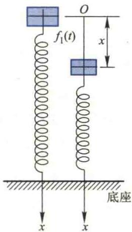
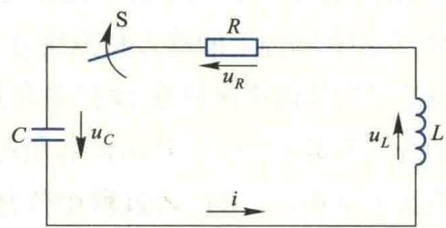

import ExerciseTrigger from '@/components/exercises/ExerciseTrigger.astro';
import QRCodeVideo from '@/components/QRCodeVideo.astro';

import Guide from '@/components/Guide.astro';
import Knowledge from '@/components/Knowledge.astro';
import Example from '@/components/Example.astro';
import Analysis from '@/components/Analysis.astro';
import Solution from '@/components/Solution.astro';
import Variant from '@/components/Variant.astro';
import Note from '@/components/Note.astro';
import Block from '@/components/Block.astro';
import Method from '@/components/Method.astro';
import Exercise from '@/components/Exercise.astro';

上一节讨论了几种一阶方程以及三种可降阶的高阶方程的求解问题.本节要讨论的是另一种在科学技术中经常遇到的高阶方程——高阶线性微分方程.主要内容有:高阶线性微分方程的有关概念以及解的性质和结构,常系数高阶线性微分方程的求解方法.

## 2.1 高阶线性微分方程举例

<Example title="例 2.1">
弹簧的机械振动 图 4.4 表示一个简单的减振装置. 质量为 m 的物体安置在弹簧上, 当物体稳定在位置 O 时, 作用在物体上的重力和弹性力大小相等、方向相反, 这个位置是物体的平衡位置. 设在垂直方向有一随时间周期变化的外界强迫力 $f_{1}(t) = H \sin pt$ 作用在物体上, 物体将受外力驱使而上下振动, 求振动过程中位移与时间所满足的关系方程.

<figure class="vp-figure">
  
  <figcaption>图4.4</figcaption>
</figure>

<Solution title="解">
取物体的平衡位置为坐标原点, x 轴的方向垂直向下. 设振动开始时刻 t=0, 时刻 t 物体离开平衡位置的位移为 $x(t)$ , 先来建立 $x(t)$ 所应满足的方程.

物体在运动过程中受到外界强迫力、弹性力和介质阻力三个力的作用.

由 Hooke 定律知弹性力

$$
f = - k x,
$$

其中 k 为弹簧的劲度系数. 设物体在振动过程中所受介质(如空气)的阻力 $f_{0}$ 与运动速度 v 成正比, 即

$$
f _ {0} = - \mu v = - \mu \frac {\mathrm{d} x}{\mathrm{d} t},
$$

其中 $\mu$ 为介质的阻尼系数, 负号表示阻力方向与速度方向相反. 于是根据 Newton 第二定律可得公式

$$
m a = - k x - \mu \frac {\mathrm{d} x}{\mathrm{d} t} + f _ {1} (t).
$$

由于加速度 $a=\frac{d^{2}x}{dt^{2}}$ ，故 $x(t)$ 应满足的微分方程为

$$
m \frac {\mathrm{d} ^ {2} x}{\mathrm{d} t ^ {2}} + \mu \frac {\mathrm{d} x}{\mathrm{d} t} + k x = H \sin p t,
$$

将微分方程改写为

$$
\frac {\mathrm{d} ^ {2} x}{\mathrm{d} t ^ {2}} + 2 \delta \frac {\mathrm{d} x}{\mathrm{d} t} + \omega^ {2} x = h \sin p t,\tag{2.1}
$$

其中 $\delta=\frac{\mu}{2m},\omega=\sqrt{\frac{k}{m}},h=\frac{H}{m}.$

由于已取物体由平衡位置开始运动的时刻为 t=0 且平衡位置为原点, 因此运动还应满足条件

$$
x \mid_ {t = 0} = 0, \quad v \mid_ {t = 0} = \frac {\mathrm{d} x}{\mathrm{d} t} \Bigg | _ {t = 0} = 0.\tag{2.2}
$$

于是,振动过程中位移随时间的变化规律应满足微分方程(2.1)与初值条件(2.2),方程(2.1)是一个二阶线性微分方程.
</Solution>
</Example>

<Example title="例 2.2">
RLC 电路中的电压变化规律

图 4.5 是 RLC 电路图, 其中 R 为电阻, L 为电感, C 为电容. 设电容器已经充电, 它的两极板间电压为 E. 当开关 S 闭合后, 电容器放电, 此时电路中将有电流 i 通过, 产生电磁振荡. 求电容器两极板间电压 $u_{C}$ 随时间变化规

<figure class="vp-figure">
  
  <figcaption>图4.5</figcaption>
</figure>

律所满足的方程.

<Solution title="解">
根据回路电压定律可知,电容、电感、电阻上的电压 $u_{C}, u_{L}, u_{R}$ 应有如下关系:

$$
u _ {L} + u _ {R} + u _ {C} = 0.\tag{2.3}
$$

由于 $i=C\frac{du_{c}}{dt}$ ，故

$$
u _ {R} = R i = R C \frac {\mathrm{d} u _ {C}}{\mathrm{d} t}, \quad u _ {L} = L \frac {\mathrm{d} i}{\mathrm{d} t} = L C \frac {\mathrm{d} ^ {2} u _ {C}}{\mathrm{d} t ^ {2}},
$$

代入(2.3)式,得

$$
L C \frac {\mathrm{d} ^ {2} u _ {c}}{\mathrm{d} t ^ {2}} + R C \frac {\mathrm{d} u _ {c}}{\mathrm{d} t} + u _ {c} = 0,
$$

或

$$
\frac {\mathrm{d} ^ {2} u _ {c}}{\mathrm{d} t ^ {2}} + \frac {R}{L} \frac {\mathrm{d} u _ {c}}{\mathrm{d} t} + \frac {1}{L C} u _ {c} = 0.\tag{2.4}
$$

这也是一个二阶线性微分方程. 设开关闭合时刻 t=0, 按所给条件 $u_{c}$ 尚应满足下列初值条件

$$
u _ {C} \mid_ {t = 0} = E, \quad \frac {\mathrm{d} u _ {C}}{\mathrm{d} t} \Bigg | _ {t = 0} = \frac {1}{C} i \Bigg | _ {t = 0} = 0.
$$

二阶线性微分方程的一般形式为

$$
\frac {\mathrm{d} ^ {2} x}{\mathrm{d} t ^ {2}} + P _ {1} (t) \frac {\mathrm{d} x}{\mathrm{d} t} + P _ {2} (t) x = F (t),\tag{2.5}
$$

其中未知函数 $x(t)$ 及其一阶、二阶导数均为一次的. 当 $F(t) \equiv 0$ 时, 方程(2.5)称为二阶线性齐次微分方程; 当 $F(t)$ 不恒为零时, 称为二阶线性非齐次微分方程. 例如, 方程(2.1)就是一个二阶线性非齐次微分方程, 而方程(2.4)是一个二阶线性齐次微分方程.

一般来说,一个 n 阶微分方程,如果其中的未知函数及其各阶导数都是一次的,则称其为 n 阶线性微分方程,简称为 n 阶线性方程.它的一般形式为

$$
p _ {0} (t) x ^ {(n)} (t) + p _ {1} (t) x ^ {(n - 1)} (t) + \dots + p _ {n - 1} (t) \dot {x} (t) + p _ {n} (t) x (t) = f (t).
$$

若 $p_0(t) \neq 0$ ，则上式可写成

$$
x ^ {(n)} + P _ {1} (t) x ^ {(n - 1)} + \dots + P _ {n - 1} (t) \dot {x} + P _ {n} (t) x = F (t),\tag{2.6}
$$

其中

$$
P _ {i} (t) = \frac {p _ {i} (t)}{p _ {0} (t)}, \quad i = 1, 2, \dots , n; \quad F (t) = \frac {f (t)}{p _ {0} (t)}.
$$

当 $F(t)$ 不恒为零时, 方程(2.6)称为 n 阶线性非齐次方程; 当 $F(t) \equiv 0$ 时, 方程(2.6)变为

$$
x ^ {(n)} + P _ {1} (t) x ^ {(n - 1)} + \dots + P _ {n - 1} (t) \dot {x} + P _ {n} (t) x = 0,\tag{2.7}
$$

称为与方程(2.6)对应的线性齐次方程.

在本章第一节中我们已经指出， $n$ 阶微分方程的初值条件由未知函数及其从一阶到 $n - 1$ 阶的导数在初始点的值所构成。对于方程(2.6)与(2.7)而言，其初值条件的一般形式可写成

$$
x (t _ {0}) = x _ {0}, \quad \dot {x} (t _ {0}) = \dot {x} _ {0}, \quad \dots , \quad x ^ {(n - 1)} (t _ {0}) = x _ {0} ^ {(n - 1)},\tag{2.8}
$$

其中 $t_{0}$ 为初始时刻, $x_{0}, \dot{x}_{0}, \cdots, x_{0}^{(n-1)}$ 为一组确定的常数.

可以证明(从略):若方程(2.6)中的系数 $P_{1}(t),P_{2}(t),\cdots,P_{n}(t)$ 以及 $F(t)$ 均在区间 $(a,b)$ 内连续,则方程(2.6)存在唯一的满足初值条件(2.8)的解 $x(t)$ , $t\in(a,b)$ ,其中 $t_{0}\in(a,b),(x_{0},\dot{x}_{0},\cdots,x_{0}^{(n-1)})\in\mathbf{R}^{n}$ .此结论称为n阶线性微分方程解的存在唯一性定理.
</Solution>
</Example>

## 2.2 线性微分方程解的结构

### 1. 线性齐次微分方程解的结构

为书写简便起见,我们引入记号

$$
L (x) = \frac {\mathrm{d} ^ {n} x}{\mathrm{d} t ^ {n}} + P _ {1} (t) \frac {\mathrm{d} ^ {n - 1} x}{\mathrm{d} t ^ {n - 1}} + \dots + P _ {n - 1} (t) \frac {\mathrm{d} x}{\mathrm{d} t} + P _ {n} (t) x,\tag{2.9}
$$

从而 n 阶线性齐次方程(2.7)可简洁地写为

$$
L (x) = 0,\tag{2.10}
$$

这里

$$
L (\quad) = \frac {\mathrm{d} ^ {n}}{\mathrm{d} t ^ {n}} + P _ {1} (t) \frac {\mathrm{d} ^ {n - 1}}{\mathrm{d} t ^ {n - 1}} + \dots + P _ {n - 1} (t) \frac {\mathrm{d}}{\mathrm{d} t} + P _ {n} (t)
$$

称为线性微分算子,它的含义是如果将它作用于某一函数 $x(t)$ , 就意味着对 $x(t)$ 求出直到 n 阶的各阶导数 $x^{(0)}, x^{(1)}, \cdots, x^{(n)}$ , 再分别乘 $P_{n}(t), P_{n-1}(t), \cdots, P_{1}(t)$ , 1 后相加, 即得 (2.9) 式 (这里零阶导数 $x^{(0)}$ 即为 x 自身).

容易看出,线性微分算子具有以下性质:

(1) $L(0)=0;$

$$
L \left(C _ {1} x _ {1} + C _ {2} x _ {2} + \dots + C _ {n} x _ {n}\right) = C _ {1} L \left(x _ {1}\right) + C _ {2} L \left(x _ {2}\right) + \dots + C _ {n} L \left(x _ {n}\right),
$$

其中 $C_{1}, C_{2}, \cdots, C_{n}$ 为任意常数.

<Knowledge title="定理 2.1 解的叠合性">
若 $x_{1}, x_{2}, \cdots, x_{n}$ 均是线性齐次方程(2.10)(或方程(2.7))的解，则

$$
x = C _ {1} x _ {1} + C _ {2} x _ {2} + \dots + C _ {n} x _ {n}\tag{2.11}
$$

也是方程(2.10)的解,其中 $C_{1}, C_{2}, \cdots, C_{n}$ 为任意常数(可以是复数).

<Solution title="证明">
将由(2.11)式所表示的函数 $x(t)$ 代入线性齐次方程(2.10)，得
</Solution>
</Knowledge>

由线性微分算子 $L()$ 的性质(1)可知, $x(t)\equiv0$ 必定是线性齐次微分方程的解,称为平凡解.线性齐次方程必有平凡解以及解的叠合性是此类方程解的两个重要特性.

$$
\begin{array}{r l} L (x) & = L \left(C _ {1} x _ {1} + C _ {2} x _ {2} + \dots + C _ {n} x _ {n}\right) \\ & = C _ {1} L \left(x _ {1}\right) + C _ {2} L \left(x _ {2}\right) + \dots + C _ {n} L \left(x _ {n}\right), \end{array}
$$

由于 $x_{i}$ （ $i=1,2,\cdots,n$ ）是方程（2.10）的解，故有 $L(x_{i})=0$ （ $i=1,2,\cdots,n$ ），从而 $L(x)=0$ ，即由（2.11）式所表示的函数 $x(t)$ 也是方程（2.10）的解。

对于 n 阶线性齐次方程(2.10)而言,既然解(2.11)中含有 n 个任意常数 $C_{1}$ , $C_{2}$ , $\cdots$ , $C_{n}$ , 是否它就是方程(2.10)的通解呢?一般说来,这是不一定的.例如,容易验证 $x_{1}=\sin t$ 与 $x_{2}=2\sin t$ 都是二阶线性齐次方程 $\ddot{x}+x=0$ 的解,由定理 2.1 知

$$
x = C _ {1} \sin t + C _ {2} 2 \sin t = (C _ {1} + 2 C _ {2}) \sin t\tag{2.12}
$$

也是其解. 表达式(2.12)表面上含有两个任意常数 $C_{1}, C_{2}$ ，但是它们可以合并成为一个任意常数 $C = C_{1} + 2C_{2}$ ，因而它并非 $\ddot{x} + x = 0$ 的通解. 那么具有 n 个任意常数的解在什么情况下才是通解呢？要回答这一问题，我们还得引入下列关于函数组线性无关的新概念.

<Knowledge title="定义 2.1 线性相关与线性无关">
设 $f_{i}(t)$ ( $i=1,2,\cdots,n$ ) 是定义在区间 I 上的 n 个函数，若存在 n 个不全为零的常数 $C_{i}$ ( $i=1,2,\cdots,n$ ) 使关系式

$$
C _ {1} f _ {1} (t) + C _ {2} f _ {2} (t) + \dots + C _ {n} f _ {n} (t) = 0\tag{2.13}
$$

对区间 I 上任何 t 值均成立，则称函数组 $f_{i}(t)$ (i=1,2, $\cdots$ ,n) 在区间 I 上线性相关；若(2.13)式仅当 $C_{i}$ ( $i=1,2,\cdots,n$ ) 全为零时成立，则称函数组 $f_{i}(t)$ ( $i=1,2,\cdots,n$ ) 在 I 上线性无关或线性独立.
</Knowledge>

当 $f_{i}$ 在I上线性相关时,由于(2.13)式中 $C_{i}$ 不全为零,不妨假设 $C_{n}\neq0$ ,从而(2.13)式可改写为

$$
f _ {n} (t) = - \frac {C _ {1}}{C _ {n}} f _ {1} (t) - \frac {C _ {2}}{C _ {n}} f _ {2} (t) - \dots - \frac {C _ {n - 1}}{C _ {n}} f _ {n - 1} (t),\tag{2.14}
$$

函数组线性相关(无关)的定义与线性代数中向量组线性相关(无关)的定义在形式上是一样的. 但是向量组 $\alpha_{i}, i=1,\cdots,n$ 线性相关是要求存在不全为零的 $C_{i}, i=1,2,\cdots,n$ , 使

也就是 $f_{i}(t)$ 中的某一个函数可由其他n-1个函数的线性组合来表示.反之若(2.14)成立,则(2.13)式成

$$
C _ {1} \alpha_ {1} + C _ {2} \alpha_ {2} + \dots + C _ {n} \alpha_ {n} = 0
$$

对向量的每一分量均成立；而函数组 $f_{i}(t), t \in I, i=1,\cdots,n$ 线性相关是要求(2.13)式在区间I上恒成立，线性无关也具有这样的差异.

立.因此, $n$ 个函数是否线性相关与是否能将其中一个函数表示为其他 $n - 1$ 个函数的线性组合是等价的.

<Example title="例 2.3">
证明函数组 $1, x, x^{2}, \cdots, x^{n-1}$ 在任何区间 I 上线性无关.

<Solution title="证明">
使用反证法,若它们线性相关,则必存在 n 个不全为零的常数 $C_{i}$ (i=0, 1, $\cdots$ ,n-1),使

$$
C _ {0} + C _ {1} x + C _ {2} x _ {2} + \dots + C _ {n - 1} x ^ {n - 1} = 0\tag{2.15}
$$

对区间 I 上的一切 x 值成立.但由于方程(2.15)是 x 的 n-1 次代数方程,由代数学基本定理可知,它至多只有 n-1 个实根,也就是说,至多只有 I 上的 n-1 个点使(2.15)式成立.这一矛盾说明,要使(2.15)式在区间 I 上成立,只能是所有 $C_{i}$ ( $i=0,1,\cdots,n-1$ ) 均为零.故所给函数组在任何区间 I 线性无关.

由(2.14)式可见,对于两个函数 $f_{1}(t)$ 与 $f_{2}(t), t \in I$ 而言,它们线性相关还是线性无关是很容易判别的.若它们线性相关,则其中至少有一个函数可由另一函数线性表示,比如 $f_{2}(t) = Cf_{1}(t)$ ,其中C为常数, $\forall t \in I$ ,即

$$
\frac {f _ {2} (t)}{f _ {1} (t)} = C, \quad \forall t \in I.\tag{2.16}
$$

因此,若两函数之比在某一区间 I 上为一常数,则此两函数在区间 I 上线性相关;若 $\frac{f_{2}}{f_{1}}$ 在 I 上不等于常数,则在区间 I 上线性无关.

例如,函数 $e^{2t}$ 与 $e^{3t}$ 在任何区间线性无关,因为

$$
\frac {\mathrm{e} ^ {2 t}}{\mathrm{e} ^ {3 t}} = \mathrm{e} ^ {- t} \neq C.
$$

当函数组 $f_{1}$ 与 $f_{2}$ 在I上线性相关时,由(2.16)式可见

$$
\begin{array}{r l} C _ {1} f _ {1} + C _ {2} f _ {2} & = C _ {1} f _ {1} + C _ {2} C f _ {1} = (C _ {1} + C _ {2} C) f _ {1}, \\ & \forall t \in I. \end{array}
$$

即表达式 $C_1f_1 + C_2f_2$ 中的两个任意常数 $C_1, C_2$ 可以合并成为一个. 若 $f_1$ 与 $f_2$ 在 $I$ 上线性无关, 则由于其中任何一个函数都不是另一个函数的倍数, 故表达式 $C_1f_1 + C_2f_2$ 中的两个任意常数不能合并, 或者说 $C_1$ 与 $C_2$ 是两个独立的任意常数. 因此, 对于二阶线性齐次方程
</Solution>
</Example>

由此可见,对于任一线性表达式 $C_{1}\varphi_{1}(t)+C_{2}\varphi_{2}(t)$ 来说,常数 $C_{1}$ 与 $C_{2}$ 能否合并成一个,即 $C_{1}\varphi_{1}(t)+C_{2}\varphi_{2}(t)\equiv\overline{C}\varphi_{1}(t)$ 并不决定于这两个常数本身,而取决于函数 $\varphi_{1}$ 与 $\varphi_{2}$ 线性相关与否,即 $C_{1}$ 与 $C_{2}$ 能合并为一个常数的充要条件是 $\varphi_{1}$ 与 $\varphi_{2}$ 线性相关,此结论可以推广到有限个常数.

$$
\ddot {x} + P _ {1} (t) \dot {x} + P _ {2} (t) x = 0,
$$

如果我们能求得它的任意两个线性无关的特解 $x_{1}(t), x_{2}(t)$ ，那么它的通解就可表示为

$$
x (t) = C _ {1} x _ {1} (t) + C _ {2} x _ {2} (t),
$$

其中 $C_{1}$ 与 $C_{2}$ 为任意常数. 所以求线性齐次方程通解的关键在于寻找它的线性无关的特解.

证明这一结论对于 n 阶线性齐次方程也是正确的. 易得

<Knowledge title="定理 2.2">
对于 n 阶线性齐次微分方程(2.7)，若求得它 n 个线性无关的特解 $x_{1}(t)$ , $x_{2}(t)$ , $\cdots$ , $x_{n}(t)$ ，则它的通解就是

$$
x (t) = C _ {1} x _ {1} (t) + C _ {2} x _ {2} (t) + \dots + C _ {n} x _ {n} (t),
$$

其中 $C_{1},\cdots,C_{n}$ 为任意常数.

<Solution title="证明">
由解的叠合性(定理2.1)知, $x(t)$ 也是方程(2.7)的解.要说明它是通解,只需证明常数 $C_{1},\cdots,C_{n}$ 中任意多个都不能合并.用反证法,不妨假设 $C_{k}\neq0$ 且 $C_{1}$ , $C_{2},\cdots,C_{k}$ (1&lt;k&lt;n)可以合并为 $\overline{C}_{k}$ (否则可调整解的顺序),这意味着

$$
C _ {1} x _ {1} (t) + C _ {2} x _ {2} (t) + \dots + C _ {k} x _ {k} (t) \equiv \overline {{{{C}}}} _ {k} x _ {k} (t).
$$

于是有

$$
\left(\overline {{C}} _ {k} - C _ {k}\right) x _ {k} (t) \equiv C _ {1} x _ {1} (t) + C _ {2} x _ {2} (t) + \dots + C _ {k - 1} x _ {k - 1} (t).
$$

若 $\overline{C}_{k}-C_{k}=0$ ，则 $x_{1}(t),\cdots,x_{k-1}(t)$ 线性相关，从而 $x_{1}(t),\cdots,x_{n}(t)$ 也必线性相关，矛盾。若 $\overline{C}_{k}-C_{k}\neq0$ ，则 $x_{k}(t)\equiv\frac{1}{\overline{C}_{k}-C_{k}}\left[C_{1}x_{1}(t)+\cdots+C_{k-1}x_{k-1}(t)\right]$ ，从而 $x_{1}(t),x_{2}(t),\cdots,x_{k}(t)$ 线性相关，同样矛盾。

然而对于线性齐次方程(2.7)，当我们求得它的 $n$ 个特解后，怎样来判别它们是否线性无关呢？下面的定理将给出一个简便的方法。
</Solution>
</Knowledge>

<Knowledge title="定理 2.3 解的线性无关判别法">
设 $x_{1}(t), \cdots, x_{n}(t)$ 是 n 阶线性齐次方程 (2.7) 的 n 个定义在区间 I 上的解，则它们在 I 上线性无关的充要条件是，在 I 上存在一点 $t_{0}$ ，使由这 n 个解及其各阶导数在 $t_{0}$ 处所构成的行列式

$$
w (t _ {0}) = \left| \begin{array}{c c c c} x _ {1} (t _ {0}) & x _ {2} (t _ {0}) & \dots & x _ {n} (t _ {0}) \\ \dot {x} _ {1} (t _ {0}) & \dot {x} _ {2} (t _ {0}) & \dots & \dot {x} _ {n} (t _ {0}) \\ \vdots & \vdots & & \vdots \\ x _ {1} ^ {(n - 1)} (t _ {0}) & x _ {2} ^ {(n - 1)} (t _ {0}) & \dots & x _ {n} ^ {(n - 1)} (t _ {0}) \end{array} \right| \neq 0 ^ {\textcircled {1}},
$$
</Knowledge>

$w(t_{0})$ 称为解组 $x_{1}(t),\cdots,x_{n}(t)$ 在 $t_{0}$ 处的 Wronski 行列式.

\* 证 充分性 设 $w(t_0) \neq 0$ , 欲证 $x_1(t), \cdots, x_n(t)$ 在 $I$ 上线性无关. 设有 $n$ 个常数 $C_i$ ( $i=1,2,\cdots,n$ ) 使

$$
C _ {1} x _ {1} (t) + C _ {2} x _ {2} (t) + \dots + C _ {n} x _ {n} (t) \equiv 0, \quad \forall t \in I.
$$

意到 $x_{i}(t)$ 为方程(2.7)的解，它们必 $n$ 阶可导，上式两端对 $t$ 逐次求导，得

$$
\begin{array}{l} C _ {1} \dot {x} _ {1} (t) + C _ {2} \dot {x} _ {2} (t) + \dots + C _ {n} \dot {x} _ {n} (t) \equiv 0, \quad \forall t \in I, \\ C _ {1} \ddot {x} _ {1} (t) + C _ {2} \ddot {x} _ {2} (t) + \dots + C _ {n} \ddot {x} _ {n} (t) \equiv 0, \quad \forall t \in I, \\ \dots \dots \\ C _ {1} x _ {1} ^ {(n - 1)} (t) + C _ {2} x _ {2} ^ {(n - 1)} (t) + \dots + C _ {n} x _ {n} ^ {(n - 1)} (t) \equiv 0, \forall t \in I. \end{array}
$$

特别地,对于 $t_{0}\in I$ 有

$$
\left\{ \begin{array}{l} C _ {1} x _ {1} (t _ {0}) + C _ {2} x _ {2} (t _ {0}) + \dots + C _ {n} x _ {n} (t _ {0}) = 0, \\ C _ {1} \dot {x} _ {1} (t _ {0}) + C _ {2} \dot {x} _ {2} (t _ {0}) + \dots + C _ {n} \dot {x} _ {n} (t _ {0}) = 0, \\ \dots \dots \\ C _ {1} x _ {1} ^ {(n - 1)} (t _ {0}) + C _ {2} x _ {2} ^ {(n - 1)} (t _ {0}) + \dots + C _ {n} x _ {n} ^ {(n - 1)} (t _ {0}) = 0. \end{array} \right.
$$

将这一方程组看作是以 $C_{1}, \cdots, C_{n}$ 为未知数的 n 元线性齐次代数方程组，由于其系数行列式为 $w(t_{0}) \neq 0$ ，由 Cramer 法则知仅有零解，即 $C_{1} = C_{2} = \cdots = C_{n} = 0$ ，所以 $x_{1}(t), \cdots, x_{n}(t)$ 在 I 线性无关.

必要性 只需证明若 $w(t) \equiv 0 (\forall t \in I)$ ，则 $x_{1}(t), \cdots, x_{n}(t)$ 必在 I 上线性相关即可。实际上，我们可以证明只要存在一点 $t_{0} \in I$ 使 $w(t_{0}) = 0$ ，则 $x_{1}(t), \cdots, x_{n}(t)$ 必在 I 上线性相关。考察以 $C_{1}, C_{2}, \cdots, C_{n}$ 为未知数的线性代数方程组

$$
\left\{ \begin{array}{l} C _ {1} x _ {1} (t _ {0}) + C _ {2} x _ {2} (t _ {0}) + \dots + C _ {n} x _ {n} (t _ {0}) = 0, \\ C _ {1} \dot {x} _ {1} (t _ {0}) + C _ {2} \dot {x} _ {2} (t _ {0}) + \dots + C _ {n} \dot {x} _ {n} (t _ {0}) = 0, \\ \dots \dots \\ C _ {1} x _ {1} ^ {(n - 1)} (t _ {0}) + C _ {2} x _ {2} ^ {(n - 1)} (t _ {0}) + \dots + C _ {n} x _ {n} ^ {(n - 1)} (t _ {0}) = 0. \end{array} \right.
$$

由于其系数行列式 $w(t_{0})=0$ ，故此方程组有非零解，设 $C_{1}^{0}, C_{2}^{0}, \cdots, C_{n}^{0}$ 为其一组非零解，其中 $C_{i}^{0}$ （ $i=1,2,\cdots,n$ ）不全为零.

(2.17)

构造解 $x_{1}(t)$ , $x_{2}(t)$ , $\cdots$ , $x_{n}(t)$ 的线性组合注意:定理2.3的充要条件,仅当 $x_{i}(t),i=1,\cdots,n$ 是n阶线性方程的解时才成立.对于一般的n-1阶可导函数组 $x_{i}(t),t\in I,i=1,\cdots,n.$ $\exists t_{0}\in I$ 有 $w(t_{0})\neq0$ 只是 $x_{i}(t)$ 线性无关的充分条件,而非必要条件.换句话说,即使 $w(t)\equiv0,t\in I$ ,函数组 $x_{i}(t)$ 也可能在I上线性无关.本章定理2.3之后给出了例子.其原因在于,若 $w(t_{0})=0$ 由(2.17)式求得的非零解 $C_{i}$ ( $i=1,\cdots,n$ )只说明 $x_{i}(t)$ 在 $t_{0}$ 处所构成的向量组 $x_{i}(t_{0}),i=1,\cdots,n$ 线性相关.尽管 $w(t)\equiv0,t\in I$ ,对 $\forall t_{0}\in I$ 均可求得不全为零的常数 $C_{i}$ ,但对不同的 $t_{0}$ ,所求得的 $C_{i}$ 可能不同,不能保证对同一组 $C_{i}$ ,使 $C_{1}x_{1}+\cdots+C_{n}x_{n}\equiv0$ 在I上成立.当 $x_{i}(t)$ 是方程的解时,上述结论是由解的唯一性所保证的.

$$
x (t) = C _ {1} ^ {0} x _ {1} (t) + C _ {2} ^ {0} x _ {2} (t) + \dots + C _ {n} ^ {0} x _ {n} (t), \quad t \in I,
$$

由定理 2.1 可知, 它是方程(2.7)的解, 而且由(2.17)知

$$
x \left(t _ {0}\right) = C _ {1} ^ {0} x _ {1} \left(t _ {0}\right) + C _ {2} ^ {0} x _ {2} \left(t _ {0}\right) + \dots + C _ {n} ^ {0} x _ {n} \left(t _ {0}\right) = 0,
$$

$$
x ^ {(k)} \left(t _ {0}\right) = C _ {1} ^ {0} x _ {1} ^ {(k)} \left(t _ {0}\right) + C _ {2} ^ {0} x _ {2} ^ {(k)} \left(t _ {0}\right) + \dots + C _ {n} ^ {0} x _ {n} ^ {(k)} \left(t _ {0}\right) = 0, k = 1, 2, \dots , n - 1.
$$

所以, 解 $x(t)$ 满足初值条件

$$
x \left(t _ {0}\right) = \dot {x} \left(t _ {0}\right) = \ddot {x} \left(t _ {0}\right) = \dots = x ^ {(n - 1)} \left(t _ {0}\right) = 0.\tag{2.18}
$$

但是,显然 $x \equiv 0$ 也是方程(2.7)的解,且满足初值条件(2.18).由解的唯一性可知

$$
x (t) = C _ {1} ^ {0} x _ {1} (t) + C _ {2} ^ {0} x _ {2} (t) + \dots + C _ {n} ^ {0} x _ {n} (t) \equiv 0, \forall t \in I,
$$

从而 $x_{1}(t),\cdots,x_{n}(t)$ 在 I 线性相关.

由此定理的证明可见，对于由方程(2.7)的 $n$ 个解 $x_{1}(t), x_{2}(t), \cdots, x_{n}(t)$ 所构成的Wronski行列式 $w(t)$ 只有两种可能，或者 $w(t) \neq 0, \forall t \in I$ ；或者 $w(t) \equiv 0, \forall t \in I$ . 换句话说，只要存在一点 $t_{0} \in I$ 使 $w(t_{0}) = 0$ ，则必有 $w(t) \equiv 0, \forall t \in I$ . 因为在必要性的证明中，我们实际上已证得：只要 $w(t_{0}) = 0$ ，则 $x_{1}(t), \cdots, x_{n}(t)$ 在 $I$ 上线性相关，若同时还存在 $t_{1} \in I$ 使 $w(t_{1}) \neq 0$ ，由充分性知 $x_{1}(t), \cdots, x_{n}(t)$ 在 $I$ 上线性无关，这将产生矛盾。但要特别指出，这一结论仅当 $x_{1}(t), \cdots, x_{n}(t)$ 为线性齐次方程的解时才正确。例如对于函数组

$$
x _ {1} = \left\{ \begin{array}{l l} t ^ {2}, & t \geqslant 0, \\ 0, & t <   0, \end{array} \right. \quad x _ {2} = \left\{ \begin{array}{l l} 0, & t \geqslant 0, \\ t ^ {2}, & t <   0, \end{array} \right.
$$

尽管

$$
w (t) = \left\{ \begin{array}{l l} \left| \begin{array}{c c} t ^ {2} & 0 \\ 2 t & 0 \end{array} \right| = 0, & t \geqslant 0, \\ \left| \begin{array}{c c} 0 & t ^ {2} \\ 0 & 2 t \end{array} \right| = 0, & t <   0, \end{array} \right.
$$

即 $w(t) \equiv 0, \forall t \in \mathbb{R}$ , 但不难证明 (留作练习) $x_{1}(t)$ 与 $x_{2}(t)$ 在 $(- \infty, +\infty)$ 却是线性无关的.

<Knowledge title="定理 2.4 线性齐次方程的通解结构">
若 $x_{1}, x_{2}, \cdots, x_{n}$ 是 n 阶线性齐次方程 (2.7) 的 n 个线性无关的特解，则它的任一解 x 均可表示为

$$
x = C _ {1} x _ {1} + C _ {2} x _ {2} + \dots + C _ {n} x _ {n},\tag{2.19}
$$

其中 $C_{1}, C_{2}, \cdots, C_{n}$ 为任意常数.

<Solution title="证明">
首先,由解的叠合性(定理2.1)知表示式(2.19)中的x为方程(2.7)的解.

其次,我们证明它包括了方程(2.7)的所有解.设方程(2.7)满足任一初值条件:

$$
x (t _ {0}) = x _ {0}, \quad \dot {x} (t _ {0}) = \dot {x} _ {0}, \dots , \quad x ^ {(n - 1)} (t _ {0}) = x _ {0} ^ {(n - 1)},\tag{2.20}
$$

(其中 $x_{0}, \dot{x}_{0}, \cdots, x_{0}^{(n-1)}$ 为任一组常数) 的解为 $x(t)$ . 我们要证, 可适当选取常数

$C_{1},\cdots,C_{n}$ 使此解 $x(t)$ 可表示为(2.19)的形式. 对解(2.19)求直至 n-1 阶导数, 并将初值条件代入得:

$$
\left\{ \begin{array}{l} x _ {0} = C _ {1} x _ {1} (t _ {0}) + C _ {2} x _ {2} (t _ {0}) + \dots + C _ {n} x _ {n} (t _ {0}), \\ \dot {x} _ {0} = C _ {1} \dot {x} _ {1} (t _ {0}) + C _ {2} \dot {x} _ {2} (t _ {0}) + \dots + C _ {n} \dot {x} _ {n} (t _ {0}), \\ \dots \dots \\ x _ {0} ^ {(n - 1)} = C _ {1} x _ {1} ^ {(n - 1)} (t _ {0}) + C _ {2} x _ {2} ^ {(n - 1)} (t _ {0}) + \dots + C _ {n} x _ {n} ^ {(n - 1)} (t _ {0}). \end{array} \right.\tag{2.21}
$$

这是一个以 $C_{1}, \cdots, C_{n}$ 为未知数的线性代数方程组，它的系数行列式为 Wronski 行列式 $w(t_{0})$ . 由于 $x_{1}, \cdots, x_{n}$ 是 (2.7) 的线性无关的解，由定理 2.3 及其注意:由定理的结论可见,形如(2.19)的解中包含了n个独立的任意常数,所以它就是方程(2.7)的通解.该定理还表明:线性齐次方程的通解包括了它的全部解.所以,我们也可用包括全部解的表达式去定义齐次线性方程的通解.不仅如此,后面我们即将看到,非齐次线性方程的通解也包括它的全部解.这是线性方程所特有的性质.

脚注知 $w(t_{0}) \neq 0$ ，从而由 Cramer 法则知，方程组(2.21)存在唯一一组解 $C_{1}^{0}, C_{2}^{0}, \cdots, C_{n}^{0}$ . 于是

$$
x = C _ {1} ^ {0} x _ {1} + C _ {2} ^ {0} x _ {2} + \dots + C _ {n} ^ {0} x _ {n}\tag{2.22}
$$

便是方程(2.7)满足初值条件(2.20)的解.
</Solution>
</Knowledge>

### 2. 线性非齐次微分方程解的结构

<Knowledge title="定理 2.5 线性非齐次方程解的结构">
设 $\bar{x}$ 是 n 阶线性非齐次方程(2.6)的任一特解， $X = C_{1}x_{1} + C_{2}x_{2} + \cdots + C_{n}x_{n}$ 是(2.6)所对应的齐次方程(2.7)的通解，则方程(2.6)的通解为

$$
x = X + \bar {x},\tag{2.23}
$$

而且通解(2.23)包括了此方程的全部解.

我们看到,与一阶线性非齐次方程解的结构相同,高阶线性非齐次方程的通解等于它的任一特解与其对应的齐次方程的通解之和.

<Solution title="证明">
首先,证明由(2.23)所表示的 x 是方程(2.6)的解.将表达式(2.23)代入方程(2.6),注意到 X 与 $\bar{x}$ 分别为方程(2.7)与(2.6)的解,得

$$
L (x) = L (X + \bar {x}) = L (X) + L (\bar {x}) = 0 + F (t) = F (t),
$$

故 x 为方程(2.6)的解.

由于表达式(2.23)中含有 n 个独立的任意常数,故它是方程(2.6)的通解.

其次,证明非齐次方程(2.6)包括了它的全部解.即方程(2.6)的任一解 $\tilde{x}$ 均可由(2.23)式表示.换句话说,要证明 $\tilde{x}$ 可从(2.23)式中适当选取X中的常数 $C_{1},\cdots,C_{n}$ 获得.由于 $\tilde{x}$ 与 $\bar{x}$ 均为非齐次方程(2.6)的解,故有

$$
L (\widetilde {x} - \bar {x}) = L (\widetilde {x}) - L (\bar {x}) = F - F \equiv 0,
$$

从而 $\widetilde{x}-\overline{x}$ 是齐次方程(2.7)的一个解.由定理2.4可知,它可以由其通解X中适当选取常数 $C_{1},\cdots,C_{n}$ 得到,即

$$
\widetilde {x} - \overline {{{{x}}}} = X, \quad \text {或} \quad \widetilde {x} = \overline {{{{x}}}} + X. \quad \text {I}
$$
</Solution>
</Knowledge>

<Knowledge title="定理 2.6">
若 $x_{1}$ 与 $x_{2}$ 分别为线性非齐次方程

$$
L (x) = F _ {1} \quad \text {与} \quad L (x) = F _ {2}
$$

的解,则 $x_{1}+x_{2}$ 必为方程

$$
L (x) = F _ {1} + F _ {2}\tag{2.24}
$$

的解.

<Solution title="证明">
将 $x_{1}+x_{2}$ 代入方程(2.24)，得

$$
L (x _ {1} + x _ {2}) = L (x _ {1}) + L (x _ {2}) = F _ {1} + F _ {2}.
$$

这就表示 $x_{1} + x_{2}$ 满足方程(2.24).
</Solution>
</Knowledge>

应当指出,对于线性微分方程,尽管解的结构已十分清楚,有关理论也颇为完整,但是要把解具体求出来,一般来说是很困难的,这是因为要求得 $n(n\geqslant2)$ 阶线性齐次方程的那些线性无关的特解是难以做到的.即使对于二阶线性齐次方程也只能对某些特殊情况,才能求出其通解.然而,可喜的是,对于自然科学和工程技术中经常碰到的常系数线性微分方程,我们找到了一种非常简便的方法,只需要通过代数运算就能求出它的通解.

<QRCodeVideo id="4.2.1" title="已知二阶齐次线性方程的一个特解求另一线性无关特解的 Liouville 公式." url="http://2d.hep.cn/1254051/56" />

## 2.3 高阶常系数线性齐次微分方程的解法

当方程(2.6)中的系数 $P_{1},\cdots,P_{n}$ 均为常数时,此方程称为常系数线性微分方程,简称为常系数线性方程,常记为

$$
x ^ {(n)} + a _ {1} x ^ {(n - 1)} + a _ {2} x ^ {(n - 2)} + \dots + a _ {n} x = f (t),
$$

其中 $a_{1}, a_{2}, \cdots, a_{n}$ 均为常数. 本段我们将根据 2.2 段中所述的线性方程的一般理论来讨论常系数线性齐次方程的求解法. 为简洁起见, 我们仅以二阶方程为例来进行讲解, 所述方法可类似地推广至 n 阶方程.

常系数二阶线性齐次方程的一般形式为

<QRCodeVideo id="4.2.2" url="http://2d.hep.cn/1254051/57" />
求高阶非齐次线性方程特解的常数变易法.

$$
\ddot {x} + a _ {1} \dot {x} + a _ {2} x = 0,
$$

(2.25)

其中 $a_{1}, a_{2}$ 为常数. 我们欲用待定系数法来求解, 即选用适当的函数 $x(t)$ 代入方程 (2.25), 确定该函数中的系数使其满足此方程.

由于指数函数求导后仍为指数函数,利用这一性质,可设方程(2.25)的解为 x=

$e^{\lambda t}$ ( $\lambda$ 为待定的实的或复的常数).于是 $\dot{x}=\lambda e^{\lambda t\textcircled{1}},\ddot{x}=\lambda^{2}e^{\lambda t}$ ，代入方程(2.25)得

$$
\mathrm{e} ^ {\lambda t} \left(\lambda^ {2} + a _ {1} \lambda + a _ {2}\right) = 0.
$$

由于 $\mathrm{e}^{\lambda t}\neq 0$ ，故有

$$
\lambda^ {2} + a _ {1} \lambda + a _ {2} = 0.\tag{2.26}
$$

显然,对于二次代数方程(2.26)的每一个根 $\lambda$ ,就有微分方程(2.25)的一个解 $e^{\lambda t}$ .代数方程(2.26)称为线性齐次微分方程(2.25)的特征方程.它的根称为特征根或特征值.下面根据(2.26)式根的不同情况分别讨论.

对比(2.26)与(2.25)两式可见,求方程(2.25)的特征方程只需将(2.25)中的x换成 $\lambda$ ,将x的 $i(i=1,2)$ 阶导数换成 $\lambda$ 的i次方即可.

（1）设特征方程(2.26)有两个不相等的实根 $\lambda_{1}$ 与 $\lambda_{2}$ . 这时, 所得到的微分方程 (2.25) 的两个特解为

$$
x _ {1} = \mathrm{e} ^ {\lambda_ {1} t}, \quad x _ {2} = \mathrm{e} ^ {\lambda_ {2} t}.
$$

由于它们之比

$$
\frac {\mathrm{e} ^ {\lambda_ {1} t}}{\mathrm{e} ^ {\lambda_ {2} t}} = \mathrm{e} ^ {(\lambda_ {1} - \lambda_ {2}) t} \neq C (\text {常数}),
$$

所以,这两个解线性无关.于是由定理2.4知,方程(2.25)的通解为

$$
x = C _ {1} \mathrm{e} ^ {\lambda_ {1} t} + C _ {2} \mathrm{e} ^ {\lambda_ {2} t},
$$

其中 $C_{1}, C_{2}$ 为任意常数.

（2）设特征方程(2.26)有重根.这时有 $\lambda_{1} = \lambda_{2} = -\frac{1}{2} a_{1}$ . 从而，只能得到微分方程(2.25)的一个特解 $x_{1} = \mathrm{e}^{\lambda_{1}t}$ . 我们用待定函数法来求与其线性无关的另一个特解 $x_{2}(t)$ . 由于 $x_{2}$ 与 $x_{1}$ 必须线性无关，故 $x_{2}$ 与 $x_{1}$ 之比不为常数，从而必为一个 $t$ 的函数，设其为 $h(t)$ . 于是

$$
\frac {x _ {2}}{x _ {1}} = h (t) \quad \text {或} \quad x _ {2} = h (t) x _ {1}.
$$

由于

$$
\dot {x} _ {2} = \dot {h} x _ {1} + h \dot {x} _ {1}, \quad \ddot {x} _ {2} = \ddot {h} x _ {1} + 2 \dot {h} \dot {x} _ {1} + h \ddot {x} _ {1},
$$

代入方程(2.25)，注意到 $L(x_{1})=\ddot{x}_{1}+a_{1}\dot{x}_{1}+a_{2}x_{1}=0$ ，可得

$$
\left(2 \dot {x} _ {1} + a _ {1} x _ {1}\right) \dot {h} + x _ {1} \ddot {h} = 0.
$$

将 $x_{1} = \mathrm{e}^{\lambda_{1}t}$ 代入上式并消去因式 $\mathrm{e}^{\lambda_1t}$ ，得

$$
\left(2 \lambda_ {1} + a _ {1}\right) \dot {h} + \ddot {h} = 0.
$$

由 $\lambda_{1}$ 是方程的重根可知 $2\lambda_{1}+a_{1}=0$ ，故有

$$
\ddot {h} = 0,
$$

从而

$$
h = C _ {1} t + C _ {2}.
$$

取 $C_{1}=1, C_{2}=0$ 便得到方程(2.25)的另一个与 $e^{\lambda_{1}t}$ 线性无关的特解

$$
x _ {2} = t \mathrm{e} ^ {\lambda_ {1} t}.
$$

在 $h = C_{1}t + C_{2}$ 中, 只要 $C_{1} \neq 0$ , 可以任选 $C_{1}$ 与 $C_{2}$ 的值均可得另一线性无关特解, 这里取 $C_{2} = 0, C_{1} = 1$ 可使特解最为简单.

因此,齐次方程(2.25)的通解为

$$
x = C _ {1} x _ {1} + C _ {2} x _ {2} = \left(C _ {1} + C _ {2} t\right) \mathrm{e} ^ {\lambda_ {1} t},
$$

其中 $C_{1}, C_{2}$ 为任意常数.

（3）设特征方程(2.26)有一对共轭复根 $\lambda_{1}=\alpha+i\beta,\lambda_{2}=\alpha-i\beta.$ 此时，齐次方程(2.25)有两个特解

$$
x _ {1} = \mathrm{e} ^ {(\alpha + \mathrm{i} \beta) t}, \quad x _ {2} = \mathrm{e} ^ {(\alpha - \mathrm{i} \beta) t}.
$$

它们显然线性无关.但是这种复数形式的解不便使用,为了得到便于使用的实数形式的解,我们利用 Euler 公式(参见附录 5),可知

$$
x _ {1} = \mathrm{e} ^ {\alpha t} (\cos \beta t + \mathrm{i} \sin \beta t), x _ {2} = \mathrm{e} ^ {\alpha t} (\cos \beta t - \mathrm{i} \sin \beta t).
$$

由解的叠合性可知

$$
\frac {1}{2} (x _ {1} + x _ {2}) = \mathrm{e} ^ {\alpha t} \cos \beta t, \quad \frac {1}{2 \mathrm{i}} (x _ {1} - x _ {2}) = \mathrm{e} ^ {\alpha t} \sin \beta t
$$

均仍为方程(2.25)的解.它们显然线性无关,故此时齐次方程(2.25)实值形式的通解为

$$
x = \mathrm{e} ^ {\alpha t} (C _ {1} \cos \beta t + C _ {2} \sin \beta t),
$$

其中 $C_{1}, C_{2}$ 为任意常数.

综上所述,求二阶常系数线性齐次方程

$$
\ddot {x} + a _ {1} \dot {x} + a _ {2} x = 0
$$

通解的步骤可归纳如下：

第一步,根据微分方程写出它的特征方程 $\lambda^{2}+a_{1}\lambda+a_{2}=0$ ;

第二步,求解特征方程得两个特征根 $\lambda_{1}$ 与 $\lambda_{2}$ ;

第三步,根据特征根的不同情况参照下表写出微分方程的通解:

<table><tr><td>特征根 $\lambda_1, \lambda_2$ </td><td>二阶常系数齐次方程的通解</td></tr><tr><td>两个不同实根 $\lambda_1, \lambda_2$ </td><td> $x = C_1 e^{\lambda_1 t} + C_2 e^{\lambda_2 t}$ </td></tr><tr><td>两个相等的实根 $\lambda_1 = \lambda_2$ </td><td> $x = e^{\lambda_1 t} (C_1 t + C_2)$ </td></tr><tr><td>一对共轭复根 $\lambda_{1,2} = \alpha \pm i\beta$ </td><td> $x = e^{\alpha t} (C_1 \cos \beta t + C_2 \sin \beta t)$ </td></tr></table>

<Example title="例 2.4">
求方程 $\ddot{x} + 7\dot{x} + 12x = 0$ 的通解.

<Solution title="解">
所给方程的特征方程为

$$
\lambda^ {2} + 7 \lambda + 1 2 = 0,
$$

其特征根为 $\lambda_1 = -3, \lambda_2 = -4$ . 于是原方程的通解为

$$
x = C _ {1} \mathrm{e} ^ {- 3 t} + C _ {2} \mathrm{e} ^ {- 4 t}. \quad \text {   I   }
$$
</Solution>
</Example>

<Example title="例 2.5">
求方程 $\ddot{x}-12\dot{x}+36x=0$ 的通解与满足初值条件 $x(0)=1,\dot{x}(0)=0$ 的特解.

<Solution title="解">
其特征方程为

$$
\lambda^ {2} - 1 2 \lambda + 3 6 = 0,
$$

解之得

$$
\lambda_ {1} = \lambda_ {2} = 6.
$$

所以,通解为

$$
x = \mathrm{e} ^ {6 t} (C _ {1} + C _ {2} t).
$$

将初值条件代入,得

$$
\left\{ \begin{array}{l} 1 = \mathrm{e} ^ {0} (C _ {1} + C _ {2} \cdot 0) = C _ {1}, \\ 0 = 6 \mathrm{e} ^ {0} (C _ {1} + C _ {2} \cdot 0) + C _ {2} \mathrm{e} ^ {0} = 6 C _ {1} + C _ {2}, \end{array} \right.
$$

解得 $C_{1}=1, C_{2}=-6$ . 从而所求特解为

$$
x = \mathrm{e} ^ {6 t} (1 - 6 t). \quad \text {   I   }
$$
</Solution>
</Example>

<Example title="例 2.6">
求方程 $\ddot{x} + 2\dot{x} + 5x = 0$ 的通解.

<Solution title="解">
其特征方程为

$$
\lambda^ {2} + 2 \lambda + 5 = 0,
$$

解之得, $\lambda_{1}=-1+2i,\lambda_{2}=-1-2i.$ 于是通解为

$$
x = \mathrm{e} ^ {- t} (C _ {1} \cos 2 t + C _ {2} \sin 2 t).
$$
</Solution>
</Example>

<Example title="例 2.7">
求方程 $x^{(4)}-2\ddot{x}-3\ddot{x}+8\dot{x}-4x=0$ 的通解.

<Solution title="解">
其特征方程为

$$
\lambda^ {4} - 2 \lambda^ {3} - 3 \lambda^ {2} + 8 \lambda - 4 = 0,
$$

解之可得特征根为

$$
\lambda_ {1} = 2, \quad \lambda_ {2} = - 2, \quad \lambda_ {3} = 1, \quad \lambda_ {4} = 1.
$$

对应于 $\lambda_{1}$ 与 $\lambda_{2}$ 可得原方程的两个特解为 $e^{2t}, e^{-2t}$ ; 对应于重根 $\lambda_{3} = \lambda_{4} = 1$ , 利用情形 (2) 中所用的待定函数法, 可得两个特解 $e^{t}, te^{t}$ . 解组 $\{e^{2t}, e^{-2t}, e^{t}, te^{t}\}$ 的 Wronski 行列式为

$$
w (t) = \left| \begin{array}{c c c c} \mathrm{e} ^ {2 t} & \mathrm{e} ^ {- 2 t} & \mathrm{e} ^ {t} & t \mathrm{e} ^ {t} \\ 2 \mathrm{e} ^ {2 t} & - 2 \mathrm{e} ^ {- 2 t} & \mathrm{e} ^ {t} & \mathrm{e} ^ {t} (1 + t) \\ 4 \mathrm{e} ^ {2 t} & 4 \mathrm{e} ^ {- 2 t} & \mathrm{e} ^ {t} & \mathrm{e} ^ {t} (2 + t) \\ 8 \mathrm{e} ^ {2 t} & - 8 \mathrm{e} ^ {- 2 t} & \mathrm{e} ^ {t} & \mathrm{e} ^ {t} (3 + t) \end{array} \right|,
$$

易见

$$
\begin{array}{r l} w (0) & = \left| \begin{array}{c c c c} 1 & 1 & 1 & 0 \\ 2 & - 2 & 1 & 1 \\ 4 & 4 & 1 & 2 \\ 8 & - 8 & 1 & 3 \end{array} \right| = \left| \begin{array}{c c c c} 1 & 0 & 0 & 0 \\ 2 & - 4 & - 1 & 1 \\ 4 & 0 & - 3 & 2 \\ 8 & - 1 6 & - 7 & 3 \end{array} \right| = \left| \begin{array}{c c c} - 4 & - 1 & 1 \\ 0 & - 3 & 2 \\ - 1 6 & - 7 & 3 \end{array} \right| \\ & = \left| \begin{array}{c c c} - 4 & - 1 & 1 \\ 0 & - 3 & 2 \\ 0 & - 3 & - 1 \end{array} \right| = - 4 \left| \begin{array}{c c} - 3 & 2 \\ - 3 & - 1 \end{array} \right| = - 3 6 \neq 0. \end{array}
$$

所以这四个解线性无关.从而原方程的通解为

$$
x = C _ {1} \mathrm{e} ^ {2 t} + C _ {2} \mathrm{e} ^ {- 2 t} + C _ {3} \mathrm{e} ^ {t} + C _ {4} t \mathrm{e} ^ {t}. \quad \text {   I   }
$$

一般来说,为求解 n 阶线性齐次方程

$$
x ^ {(n)} + a _ {1} x ^ {(n - 1)} + a _ {2} x ^ {(n - 2)} + \dots + a _ {n} x = 0,
$$

可先写出它的特征方程

$$
\lambda^ {n} + a _ {1} \lambda^ {n - 1} + a _ {2} \lambda^ {n - 2} + \dots + a _ {n} = 0,
$$

求出其特征根,然后求出与这些特征根相对应的线性无关的 n 个特解,将所有特征根对应的线性无关的特解与任意常数线性组合便得线性齐次方程的通解.

为方便于我们将各种类型特征根及其在通解中的对应项列表如下：

<table><tr><td>特征根</td><td>通解中的对应项</td></tr><tr><td>单实根 $\lambda$ </td><td> $Ce^{\lambda t}$ </td></tr><tr><td> $k$ 重实根 $\lambda$ </td><td> $e^{\lambda t}(C_1+C_2t+\cdots+C_kt^{k-1})$ </td></tr><tr><td>一对共轭单复根 $\lambda_{1,2}=\alpha\pm i\beta$ </td><td> $e^{\alpha t}(C_1\cos\beta t+C_2\sin\beta t)$ </td></tr><tr><td>一对 $k$ 重共轭复根 $\alpha\pm i\beta$ </td><td> $e^{\alpha t}\left[(C_{11}+C_{12}t+\cdots+C_{1k}t^{k-1})\cos\beta t+(C_{21}+C_{22}t+\cdots+C_{2k}t^{k-1})\sin\beta t\right]$ </td></tr></table>
</Solution>
</Example>

<Example title="例 2.8">
求方程 $y^{(4)}(x)-4y'''(x)+10y''(x)-12y'(x)+5y(x)=0$ 的通解.

<Solution title="解">
其特征方程为

$$
\lambda^ {4} - 4 \lambda^ {3} + 1 0 \lambda^ {2} - 1 2 \lambda + 5 = 0.
$$

全部特征根为 $1,1,1 \pm 2i$ . 于是所对应的线性无关的特解为

$$
\mathrm{e} ^ {x}, x \mathrm{e} ^ {x}, \mathrm{e} ^ {x} \cos 2 x, \mathrm{e} ^ {x} \sin 2 x,
$$

所以所求通解为

$$
\begin{array}{r l} y & = (C _ {1} + C _ {2} x) \mathrm{e} ^ {x} + \mathrm{e} ^ {x} (C _ {3} \cos 2 x + C _ {4} \sin 2 x) \\ & = \mathrm{e} ^ {x} (C _ {1} + C _ {2} x + C _ {3} \cos 2 x + C _ {4} \sin 2 x). \end{array}
$$
</Solution>
</Example>

## 2.4 高阶常系数线性非齐次微分方程的解法

我们由定理 2.5 已经知道, 线性非齐次方程的通解等于它的任一特解与对应齐次方程通解之和. 齐次方程通解的求法已由上段解决, 因此求线性非齐次方程通解的关键在于寻求它的一个特解. 对于常系数方程而言, 当非齐次项 $F(t)$ 是某些特殊类型的函数时, 其特解可用待定系数法获得. 为简洁起见, 我们仍以二阶方程为例来讲解.

二阶常系数线性非齐次方程的一般形式为

$$
\ddot {x} + a _ {1} \dot {x} + a _ {2} x = F (t),\tag{2.27}
$$

下面对 $F(t)$ 的几种常见的特殊形式分别进行讨论.

1. $F(t)=\varphi(t)e^{\mu t}$

其中 $\mu$ 为常数, $\varphi(t)$ 是一个 $m (m \geqslant 0)$ 次多项式, 即

$$
\varphi (t) = b _ {m} t ^ {m} + b _ {m - 1} t ^ {m - 1} + \dots + b _ {1} t + b _ {0}.
$$

要寻求方程(2.27)的一个特解,就是要找一个函数 $x^{*}(t)$ ,使它满足方程(2.27).由于方程(2.27)的右端是一多项式与 $e^{\mu t}$ 的乘积,所以 $x^{*}(t)$ 中应含有 $e^{\mu t}$ ;又由于多项式与指数函数乘积的导数仍是多项式与指数函数的乘积,因此,我们想到应令

$$
x ^ {*} (t) = Z (t) \mathrm{e} ^ {\mu t},\tag{2.28}
$$

其中 $Z(t)$ 是一个待定的多项式. 将 (2.28) 式求导后代入方程 (2.27) 消去 $e^{\mu t}$ 后可得

$$
\left(\mu^ {2} + a _ {1} \mu + a _ {2}\right) Z (t) + \left(2 \mu + a _ {1}\right) Z ^ {\prime} (t) + Z ^ {\prime \prime} (t) = \varphi (t).\tag{2.29}
$$

如果(2.28)式是方程(2.27)的解,那么(2.29)式应是一个恒等式.因此,应选取 $Z(t)$ 的次数,使(2.29)式左端多项式的次数与右端多项式的次数相等,然后比较两端t的同次幂的系数,从而确定待定多项式 $Z(t)$ .以下分三种情形讨论:

(1) $\mu$ 不是特征方程的根. 这时 $\mu^2 + a_1\mu + a_2 \neq 0$ , 于是可令 $Z(t)$ 是一个与 $\varphi(t)$ 同次数的多项式

$$
Z (t) = B _ {m} t ^ {m} + B _ {m - 1} t ^ {m - 1} + \dots + B _ {1} t + B _ {0}.\tag{2.30}
$$

把(2.30)式代入(2.29)式并比较(2.29)式两端t的同次幂系数,定出 $B_{i}$ (i=0,1,…,m)后代入(2.28)式,便得到常系数线性非齐次微分方程(2.27)的一个特解.

(2) $\mu$ 是特征方程的单根.这时有

$$
\mu^ {2} + a _ {1} \mu + a _ {2} = 0, \quad 2 \mu + a _ {1} \neq 0.
$$

要使(2.29)式两端多项式的次数相等, $Z(t)$ 应是一个 $m+1$ 次的多项式,因此可令

$$
Z (t) = t \left(B _ {m} t ^ {m} + B _ {m - 1} t ^ {m - 1} + \dots + B _ {1} t + B _ {0}\right).
$$

(3) $\mu$ 是特征方程的重根. 这时有

$$
\mu^ {2} + a _ {1} \mu + a _ {2} = 0, \quad 2 \mu + a _ {1} = 0,
$$

按照上面同样的想法,可令

$$
Z (t) = t ^ {2} \left(B _ {m} t ^ {m} + B _ {m - 1} t ^ {m - 1} + \dots + B _ {1} t + B _ {0}\right).
$$

综上所述,为求二阶常系数线性非齐次方程

$$
\ddot {x} + a _ {1} \dot {x} + a _ {2} x = \varphi (t) \mathrm{e} ^ {\mu t}
$$

的一个特解 $x^{*}(t)$ ，可令

$$
x ^ {*} (t) = t ^ {k} \mathrm{e} ^ {\mu t} \Phi (t),
$$

其中 $\Phi(t)=B_{m}t^{m}+B_{m-1}t^{m-1}+\cdots+B_{1}t+B_{0}$ 是与 $\varphi(t)$ 同次数的多项式. 当 $\mu$ 不是特征根时, 取 k=0; 当 $\mu$ 是单重特征根时, 取 k=1; 当 $\mu$ 是重特征根时, 取 k=2.

<Example title="例 2.9">
求微分方程 $\ddot{x}-5\dot{x}+6x=te^{2t}$ 的通解.

<Solution title="解">
对应于齐次线性方程的特征方程为

$$
\lambda^ {2} - 5 \lambda + 6 = 0,
$$

故特征根为 $\lambda_{1}=2,\lambda_{2}=3$ ，从而齐次方程的通解为

$$
x = C _ {1} \mathrm{e} ^ {2 t} + C _ {2} \mathrm{e} ^ {3 t}.
$$

现求非齐次线性方程的一个特解,由于 $\mu=2$ 是特征方程的单根,故应令

$$
x ^ {*} = t (B _ {0} + B _ {1} t) \mathrm{e} ^ {2 t},
$$

求导后代入原方程,化简得

$$
- 2 B _ {1} t + 2 B _ {1} - B _ {0} \equiv t,
$$

比较同次幂的系数,得

$$
- 2 B _ {1} = 1, \quad 2 B _ {1} - B _ {0} = 0,
$$

从而

$$
B _ {0} = - 1, \quad B _ {1} = - \frac {1}{2},
$$

于是,特解为

$$
x ^ {*} = - \left(t + \frac {1}{2} t ^ {2}\right) \mathrm{e} ^ {2 t}.
$$

所以,原方程的通解为

$$
x = C _ {1} \mathrm{e} ^ {2 t} + C _ {2} \mathrm{e} ^ {3 t} - \left(t + \frac {1}{2} t ^ {2}\right) \mathrm{e} ^ {2 t}. \quad i
$$

2. $F(t) = \mathrm{e}^{\mu t}\varphi (t)\cos \nu t$ 或 $F(t) = \mathrm{e}^{\mu t}\varphi (t)\sin \nu t$

读者容易证明,若函数 $x=x_{\mathrm{R}}(t)\pm\mathrm{i}x_{\mathrm{I}}(t)$ 是方程

$$
\ddot {x} + a _ {1} (t) \dot {x} + a _ {2} (t) x = f _ {1} (t) \pm \mathrm{i} f _ {2} (t)
$$

的解,其中 i 为虚数单位,则其实部 $x_{\mathrm{R}}(t)$ 与虚部 $x_{\mathrm{I}}(t)$ 分别是方程

$$
\ddot {x} + a _ {1} (t) \dot {x} + a _ {2} (t) x = f _ {1} (t) \quad \text {与} \quad \ddot {x} + a _ {1} (t) \dot {x} + a _ {2} (t) x = f _ {2} (t)
$$

的解.

因此,我们可以先求微分方程

$$
\ddot {x} + a _ {1} \dot {x} + a _ {2} x = \mathrm{e} ^ {\mu t} \varphi (t) \cos \nu t \pm \mathrm{ie} ^ {\mu t} \varphi (t) \sin \nu t = \mathrm{e} ^ {(\mu \pm \mathrm{i} \nu) t} \varphi (t)\tag{2.31}
$$

的特解,然后分出其实部、虚部便可得出所求微分方程的特解,这样,就把类型2化成了类型1.
</Solution>
</Example>

<Example title="例 2.10">
求方程 $\ddot{x} + x = t e^{t} \cos t$ 的通解.

<Solution title="解">
对应线性齐次方程的特征方程为

$$
\lambda^ {2} + 1 = 0,
$$

故特征根为

$$
\lambda = \pm \mathrm{i},
$$

从而线性齐次方程的通解为

$$
x = C _ {1} \cos t + C _ {2} \sin t.
$$

为求原方程的一个特解,先求微分方程

$$
\ddot {x} + x = t \mathrm{e} ^ {(1 + \mathrm{i}) t}\tag{2.32}
$$

的特解,由于 $1+i$ 不是特征根,故令

$$
x ^ {*} = \left(B _ {0} + B _ {1} t\right) \mathrm{e} ^ {(1 + \mathrm{i}) t}.
$$

求导后代入相应方程(2.32)并化简得

$$
B _ {1} (1 + 2 \mathrm{i}) t + [ 2 B _ {1} (1 + \mathrm{i}) + 2 B _ {0} \mathrm{i} + B _ {0} ] \equiv t.
$$

比较系数得

$$
B _ {1} = \frac {1}{1 + 2 \mathrm{i}} = \frac {1 - 2 \mathrm{i}}{5}, \quad B _ {0} = - \frac {2 (1 + \mathrm{i})}{1 + 2 \mathrm{i}} B _ {1} = \frac {- 2 + 1 4 \mathrm{i}}{2 5},
$$

从而

$$
x ^ {*} = \mathrm{e} ^ {t} \left(\frac {1 - 2 \mathrm{i}}{5} t + \frac {- 2 + 1 4 \mathrm{i}}{2 5}\right) (\cos t + \mathrm{i} \sin t).
$$

它的实部

$$
x _ {\mathrm{R}} ^ {*} = \mathrm{e} ^ {t} \left[ \left(\frac {1}{5} t - \frac {2}{2 5}\right) \cos t + \left(\frac {2}{5} t - \frac {1 4}{2 5}\right) \sin t \right] = \frac {\mathrm{e} ^ {t}}{2 5} [ (5 t - 2) \cos t + (1 0 t - 1 4) \sin t ]
$$

就是原方程的一个特解,于是原方程的通解为

$$
x (t) = C _ {1} \cos t + C _ {2} \sin t + \frac {\mathrm{e} ^ {t}}{2 5} [ (5 t - 2) \cos t + (1 0 t - 1 4) \sin t ].
$$

由此例可见,当非齐次项如类型2所示时,用上述方法求特解时要进行复数运算,颇不方便,下面我们由此导出另一种待定系数法,它可以仅在实数域内作运算.

实数域内的待定系数法.由例2.10我们看到为求方程(2.31)的特解,可令

$$
x ^ {*} = t ^ {k} Z (t) \mathrm{e} ^ {(\mu \pm \mathrm{i} \nu) t},
$$

其中当 $\mu\pm i\nu$ 不是特征根时, 取 k=0; 当 $\mu+i\nu$ 是特征根时, 取 k=1. 通过代入方程, 比较系数可定出与 $\varphi(t)$ 同次数的复值多项式

$$
Z (t) = R (t) \pm \mathrm{i} I (t).
$$

于是

$$
\begin{array}{r l} x ^ {*} & = t ^ {k} [ R (t) + \mathrm{i} I (t) ] \mathrm{e} ^ {\mu t} (\cos \nu t + \mathrm{i} \sin \nu t) \\ & = t ^ {k} \mathrm{e} ^ {\mu t} \left\{\left[ R (t) \cos \nu t - I (t) \sin \nu t \right] + \mathrm{i} [ I (t) \cos \nu t + R (t) \sin \nu t ] \right\}, \end{array}
$$

从而其实部与虚部分别为

$$
x _ {\mathrm{R}} ^ {*} = t ^ {k} \mathrm{e} ^ {\mu t} [ R (t) \cos \nu t - I (t) \sin \nu t ]\tag{2.33}
$$

与

$$
x _ {\mathrm{I}} ^ {*} = t ^ {k} \mathrm{e} ^ {\mu t} [ I (t) \cos \nu t + R (t) \sin \nu t ],\tag{2.34}
$$

它们分别是方程

$$
\ddot {x} + a _ {1} \dot {x} + a _ {2} x = \mathrm{e} ^ {\mu t} \varphi (t) \cos \nu t \quad \text {与} \quad \ddot {x} + a _ {1} \dot {x} + a _ {2} x = \mathrm{e} ^ {\mu t} \varphi (t) \sin \nu t\tag{2.35}
$$

的特解.

(2.33)与(2.34)右端方括号内的表达式都是 $\cos \nu t$ 和 $\sin \nu t$ 分别乘与 $\varphi(t)$ 同次数的实值多项式后的代数和.由此可见,对于形如(2.35)的线性非齐次微分方程,我们可以直接令其特解为

$$
x ^ {*} = t ^ {k} \mathrm{e} ^ {\mu t} \left[ Z _ {1} (t) \cos \nu t + Z _ {2} (t) \sin \nu t \right],
$$

其中 $Z_{1}(t)$ 与 $Z_{2}(t)$ 均为与 $\varphi(t)$ 同次数的实系数多项式. 当 $\mu\pm i\nu$ 不是特征根时, 取 k=0; 当 $\mu+i\nu$ 是特征根时, 取 k=1.
</Solution>
</Example>

<Example title="例 2.11">
求方程 $\ddot{x}-3\dot{x}+2x=t\cos t$ 满足初值条件 $x(0)=\frac{22}{25},\dot{x}(0)=\frac{19}{25}$ 的特解.

<Solution title="解">
容易求得对应线性齐次方程的通解为

$$
x (t) = C _ {1} \mathrm{e} ^ {t} + C _ {2} \mathrm{e} ^ {2 t}.
$$

由于 $\mu+i\nu=i$ 不是特征根, 故令原方程的一个特解为

$$
x ^ {*} = (A _ {0} + A _ {1} t) \cos t + (B _ {0} + B _ {1} t) \sin t.
$$

代入原方程后整理得

$$
\left(A _ {0} - 3 A _ {1} - 3 B _ {0} + 2 B _ {1}\right) \cos t + \left(3 A _ {0} + B _ {0} - 2 A _ {1} - 3 B _ {1}\right) \sin t +
$$

$$
\left(A _ {1} - 3 B _ {1}\right) t \cos t + \left(3 A _ {1} + B _ {1}\right) t \sin t \equiv t \cos t,
$$

比较两端同类项系数,得

$$
A _ {0} - 3 A _ {1} - 3 B _ {0} + 2 B _ {1} = 0, \quad 3 A _ {0} + B _ {0} - 2 A _ {1} - 3 B _ {1} = 0,
$$

$$
A _ {1} - 3 B _ {1} = 1, \quad 3 A _ {1} + B _ {1} = 0.
$$

从而解得

$$
A _ {1} = \frac {1}{1 0}, \quad B _ {1} = - \frac {3}{1 0}, \quad A _ {0} = - \frac {3}{2 5}, \quad B _ {0} = - \frac {1 7}{5 0},
$$

所以得

$$
x ^ {*} = \left(- \frac {3}{2 5} + \frac {1}{1 0} t\right) \cos t - \left(\frac {1 7}{5 0} + \frac {3}{1 0} t\right) \sin t,
$$

故原方程的通解为

$$
x = C _ {1} \mathrm{e} ^ {t} + C _ {2} \mathrm{e} ^ {2 t} + \left(- \frac {3}{2 5} + \frac {1}{1 0} t\right) \cos t - \left(\frac {1 7}{5 0} + \frac {3}{1 0} t\right) \sin t.
$$

为求适合初值条件的特解,先将上式求导,得

$$
\dot {x} = C _ {1} \mathrm{e} ^ {t} + 2 C _ {2} \mathrm{e} ^ {2 t} - \frac {1 2}{5 0} \cos t - \frac {9}{5 0} \sin t - \frac {3}{1 0} t \cos t - \frac {1}{1 0} t \sin t.
$$

将初值条件代入上面两式, 得

$$
\int C _ {1} + C _ {2} - \frac {3}{2 5} = x (0) = \frac {2 2}{2 5},
$$

$$
\left[ C _ {1} + 2 C _ {2} - \frac {6}{2 5} = \dot {x} (0) = \frac {1 9}{2 5}, \right.
$$

解得 $C_{1}=1, C_{2}=0.$

于是，所求特解为

$$
x = \mathrm{e} ^ {t} + \left(- \frac {3}{2 5} + \frac {1}{1 0} t\right) \cos t - \left(\frac {1 7}{5 0} + \frac {3}{1 0} t\right) \sin t.
$$
</Solution>
</Example>

<Example title="例 2.12">
求微分方程 $\ddot{x} + 3x = \sin 2t$ 的一个特解.

<Solution title="解">
我们可以利用例 2.11 的方法来求解, 然而, 这个方程不含 $\dot{x}$ 项, 由于正弦函数的二阶导数仍是正弦函数, 容易看出, 可令特解为

$$
x ^ {*} = A \sin 2 t.
$$

代入原方程,得

$$
(- 4 A + 3 A) \sin 2 t \equiv \sin 2 t,
$$

由此得

$$
A = - 1,
$$

从而原方程的一个特解为

$$
x ^ {*} = - \sin 2 t.
$$

上述求特解的待定系数法,可以推广到一般的 n 阶常系数线性微分方程

$$
x ^ {(n)} + a _ {1} x ^ {(n - 1)} + a _ {2} x ^ {(n - 2)} + \dots + a _ {n - 1} \dot {x} + a _ {n} x = F (t),
$$

其中 $F(t)$ 是类型 1(或类型 2) 中所示的函数. 若 $\mu(\text{或 } \mu + \mathrm{i}\nu)$ 是对应特征方程的 k 重根, $k = 0, 1, \cdots, n$ （或 $k = 0, 1, \cdots, \left[\frac{n}{2}\right]$ ），则可令特解为

$$
x ^ {*} = t ^ {k} Z (t) \mathrm{e} ^ {\mu t} (\text {或} x ^ {*} = t ^ {k} \mathrm{e} ^ {\mu t} [ Z _ {1} (t) \cos \nu t + Z _ {2} (t) \sin \nu t ]),
$$

其中 $Z(t)$ ( $Z_{1}(t)$ 与 $Z_{2}(t)$ ) 均是与 $\varphi(t)$ 同次数的待定多项式.

为方便读者使用,现就 $F(t)$ 的常见类型,针对不同情况将用待定系数法应设置的特解的形式列表如下(其中 $Z(t)$ , $Z_{1}(t)$ , $Z_{2}(t)$ 均为与 $\varphi$ 同次数的多项式):

<table><tr><td> $F(t)$ 的类型</td><td colspan="2">应设置特解 $x^{*}(t)$ 的形式</td></tr><tr><td rowspan="2"> $m$ 次多项式 $\varphi(t)$ </td><td>0不是特征值</td><td> $x^{*}=Z(t)$ </td></tr><tr><td>0是 $k$ 重特征值</td><td> $x^{*}=t^{k}Z(t)$ </td></tr><tr><td rowspan="2"> $\varphi(t)e^{\mu t}$ </td><td> $\mu$ 不是特征值</td><td> $x^{*}=Z(t)e^{\mu t}$ </td></tr><tr><td> $\mu$ 是 $k$ 重特征值</td><td> $x^{*}=t^{k}Z(t)e^{\mu t}$ </td></tr><tr><td rowspan="2"> $\varphi(t)e^{\mu t}\cos\nu t$ 或 $\varphi(t)e^{\mu t}\sin\nu t$ </td><td> $\mu+i\nu$ 不是特征值</td><td> $x^{*}=e^{\mu t}[Z_{1}(t)\cos\nu t+Z_{2}(t)\sin\nu t]$ </td></tr><tr><td> $\mu+i\nu$ 是 $k$ 重特征值 $\left(1\leqslant k\leqslant\left[\frac{n}{2}\right]\right)$ </td><td> $x^{*}=t^{k}e^{\mu t}[Z_{1}(t)\cos\nu t+Z_{2}(t)\sin\nu t]$ </td></tr></table>
</Solution>
</Example>

<Example title="例 2.13">
求微分方程 $y^{(6)} + y^{(5)} - 2y^{(4)} = x - 1$ 的通解.

<Solution title="解">
对应于线性齐次方程的特征方程为

$$
\lambda^ {6} + \lambda^ {5} - 2 \lambda^ {4} = \lambda^ {4} (\lambda - 1) (\lambda + 2) = 0,
$$

故特征根为 $\lambda_{1}=0$ （4 重根）， $\lambda_{2}=1$ （单根）， $\lambda_{3}=-2$ （单根）。于是齐次线性方程的通解为

$$
y = C _ {1} \mathrm{e} ^ {x} + C _ {2} \mathrm{e} ^ {- 2 x} + C _ {3} x ^ {3} + C _ {4} x ^ {2} + C _ {5} x + C _ {6}.
$$

由于 $\mu=0$ 是 4 重特征根, 故令线性非齐次方程的特解为

$$
y ^ {*} = x ^ {4} (A x + B),
$$

代入原方程,得

$$
1 2 0 A - 2 4 0 A x - 4 8 B \equiv x - 1.
$$

比较同次幂系数,得

$$
- 2 4 0 A = 1, \quad 1 2 0 A - 4 8 B = - 1,
$$

从而

$$
A = - \frac {1}{2 4 0}, \quad B = \frac {1}{9 6}.
$$

于是原方程的通解为

$$
y = C _ {1} \mathrm{e} ^ {x} + C _ {2} \mathrm{e} ^ {- 2 x} + C _ {3} x ^ {3} + C _ {4} x ^ {2} + C _ {5} x + C _ {6} + \frac {1}{9 6} x ^ {4} - \frac {1}{2 4 0} x ^ {5}. \quad I
$$
</Solution>
</Example>

<Example title="例 2.14">
求解在本章例 2.1 中所建立的关于弹簧机械振动的微分方程并加以讨论.

<Solution title="解">
在例2.1中我们所建立的微分方程为

$$
\ddot {x} + 2 \delta \dot {x} + \omega^ {2} x = h \sin p t,\tag{2.36}
$$

其中 $\delta=\frac{\mu}{2m},\omega=\sqrt{\frac{k}{m}},h=\frac{H}{m},\mu$ 为介质的阻尼系数，m 为物体的质量，k 为弹簧的劲度系数， $H\sin pt$ 为周期变化的外界强迫力。(2.36) 是一个二阶常系数线性非齐次微分方程，称为强迫振动的微分方程。它所对应的齐次方程是被称为自由振动的微分方程

$$
\frac {\mathrm{d} ^ {2} x}{\mathrm{d} t ^ {2}} + 2 \delta \frac {\mathrm{d} x}{\mathrm{d} t} + \omega^ {2} x = 0.\tag{2.37}
$$

首先,我们来求线性齐次方程(2.37)的通解,它的特征方程为

$$
\lambda^ {2} + 2 \delta \lambda + \omega^ {2} = 0,
$$

故特征根为

$$
\lambda_ {1} = - \delta + \sqrt {\delta^ {2} - \omega^ {2}}, \quad \lambda_ {2} = - \delta - \sqrt {\delta^ {2} - \omega^ {2}}.
$$

下面分三种情况讨论：

(1) $\delta^{2}-\omega^{2}>0.$ 这时, 线性齐次方程的通解为

$$
x = C _ {1} \mathrm{e} ^ {- (\delta - \sqrt {\delta^ {2} - \omega^ {2}}) t} + C _ {2} \mathrm{e} ^ {- (\delta + \sqrt {\delta^ {2} - \omega^ {2}}) t}.
$$
</Solution>
</Example>

由此可见，当 $t \to +\infty$ 时， $x(t) \to 0$ 。这说明当外力为零且阻尼 $\mu$ 很大时，有 $\delta > \omega$ ，物体运动按指数函数规律迅速衰减，不会产生振动，如图4.6所示。

(2) $\delta^{2}-\omega^{2}=0.$ 这时, 特征方程有重根 $\lambda_{1}=\lambda_{2}=-\delta.$ 于是线性齐次方程的通解为

$$
x = \left(C _ {1} + C _ {2} t\right) \mathrm{e} ^ {- \delta t},
$$

物体仍按指数规律衰减,图形与图 4.6 相似,这时

<figure class="vp-figure">
  
  <figcaption>图4.6</figcaption>
</figure>

的阻尼 $\mu$ 称为临界阻尼.

(3) $\delta^{2}-\omega^{2}<0.$ 这时, 特征根是共轭复根

$$
\lambda_ {1, 2} = - \delta \pm \mathrm{i} \sqrt {\omega^ {2} - \delta^ {2}},
$$

线性齐次方程的通解为

$$
x = \mathrm{e} ^ {- \delta t} \left(C _ {1} \cos \sqrt {\omega^ {2} - \delta^ {2}} t + C _ {2} \sin \sqrt {\omega^ {2} - \delta^ {2}} t\right) = A \mathrm{e} ^ {- \delta t} \sin \left(\sqrt {\omega^ {2} - \delta^ {2}} t + \varphi\right).
$$

其中 $A=\sqrt{C_{1}^{2}+C_{2}^{2}}$ 与 $\varphi=\arctan\frac{C_{1}}{C_{2}}$ 是两个任意常数.

由通解可见,一方面,运动的振幅 $Ae^{-\delta t}$ 随时间的增大而减少,所以运动是衰减的;另一方面,由于通解中含有正弦函数,所以运动又是振荡的.因此,当阻尼 $\mu$ 很小时, $\delta<\omega$ ,物体做衰减振荡运动,如图 4.7 所示.

为求解线性非齐次方程(2.36)，关键在于求它的任意一个特解.设阻尼 $\mu \neq 0$ ，从而ip不是特征根，于是令特解为

<figure class="vp-figure">
  
  <figcaption>图4.7</figcaption>
</figure>

$$
x ^ {*} = A _ {1} \cos p t + A _ {2} \sin p t,
$$

代入方程(2.36)，比较同类项系数，得

$$
\left\{ \begin{array}{l} (\omega^ {2} - p ^ {2}) A _ {1} + 2 \delta p A _ {2} = 0, \\ (\omega^ {2} - p ^ {2}) A _ {2} - 2 \delta p A _ {1} = h. \end{array} \right.
$$

解之得

$$
A _ {1} = - \frac {2 \delta p h}{\left(\omega^ {2} - p ^ {2}\right) ^ {2} + 4 \delta^ {2} p ^ {2}}, A _ {2} = \frac {h \left(\omega^ {2} - p ^ {2}\right)}{\left(\omega^ {2} - p ^ {2}\right) ^ {2} + 4 \delta^ {2} p ^ {2}}.
$$

于是

$$
\begin{array}{r l} x ^ {*} & = \frac {h (\omega^ {2} - p ^ {2})}{(\omega^ {2} - p ^ {2}) ^ {2} + 4 \delta^ {2} p ^ {2}} \sin p t - \frac {2 \delta p h}{(\omega^ {2} - p ^ {2}) ^ {2} + 4 \delta^ {2} p ^ {2}} \cos p t \\ & = B \sin (p t - \psi), \end{array}
$$

其中

$$
B = \frac {h}{\sqrt {\left(\omega^ {2} - p ^ {2}\right) ^ {2} + 4 \delta^ {2} p ^ {2}}}, \quad \psi = \arctan \left(\frac {2 p \delta}{\omega^ {2} - p ^ {2}}\right).
$$

所以强迫振动方程(2.36)的通解为

$$
x = A \mathrm{e} ^ {- \delta t} \sin (\sqrt {\omega^ {2} - \delta^ {2}} t + \varphi) + B \sin (p t - \psi), \quad \delta <   \omega .
$$

容易看出,随时间 t 增大,上式右端第一项很快地衰减为零,故称它为暂态项;第二项

不随时间衰减,故称它为稳态项.由此可见,弹簧的强迫振动规律,主要取决于特解,即

$$
x \approx x ^ {*} = B \sin \left(p t - \psi\right), \text {当} t \gg 1 \text {时}.
$$

换句话说,主要取决于外界强迫力的作用,其中 p 就是强迫力周期运动的频率.

当阻尼很小时,振动的振幅为

$$
B = \frac {h}{\sqrt {\left(\omega^ {2} - p ^ {2}\right) ^ {2} + 4 \delta^ {2} p ^ {2}}} \approx \frac {h}{\left| \omega^ {2} - p ^ {2} \right|}.
$$

由此可见，当外界强迫力的频率 $p$ 与弹簧的固有频率 $\omega = \sqrt{\frac{k}{m}}$ 相差不大时，振幅 $B$ 将会很大，这时就会产生所谓共振现象.

共振现象在很多问题中有很大的破坏作用,它可能引起机器损坏、桥梁折断、建筑物倒塌等严重事故.例如,1831年一队士兵以整齐的步伐通过英国Lanchester附近的布劳顿吊桥时,由于整齐的步伐产生了周期性的外力,而且这个力的频率非常接近于吊桥振动的固有频率,从而引起了共振,导致了吊桥倒塌.因此,在一些工程问题中,常需算出固有频率,调整有关参数和采取各种措施,以避免共振现象的发生.但是,事物都是一分为二的,有时人们却恰恰需要利用共振.例如,收音机、电视机必须要调节频率使之与所接收电台、电视台的发射频率相同,产生共振,才能收到需要的信息.

## 2.5 高阶变系数线性微分方程的求解问题

高于一阶的变系数线性微分方程,一般来说是难以用初等方法求解的.但是,对于某些特殊类型的微分方程,我们可以通过适当的变换把它化成常系数线性微分方程,从而使求解问题得到解决.下面将要介绍的后继课中颇有用处的 Euler 微分方程就是其中的一种.

Euler 微分方程 Euler 微分方程的一般形式是

$$
t ^ {n} \frac {\mathrm{d} ^ {n} x}{\mathrm{d} t ^ {n}} + a _ {1} t ^ {n - 1} \frac {\mathrm{d} ^ {n - 1} x}{\mathrm{d} t ^ {n - 1}} + \dots + a _ {n - 1} t \frac {\mathrm{d} x}{\mathrm{d} t} + a _ {n} x = f (t),
$$

其中 $a_{1}, a_{2}, \cdots, a_{n}$ 都是常数. 对于这类微分方程, 通过变换

$$
t = \mathrm{e} ^ {\tau \textcircled{1}} \quad \text {或} \quad \tau = \ln t \qquad (t > 0)
$$

就可化为常系数线性微分方程,下面通过例子来具体说明.

<Example title="例 2.15">
求微分方程 $t^{2}\ddot{x}-t\dot{x}+x=0$ 的通解.

<Solution title="解">
这是一个 Euler 微分方程, 令 $t=e^{\tau}$ , 即 $\tau=\ln t$ , 从而有

$$
\frac {\mathrm{d} x}{\mathrm{d} t} = \frac {\mathrm{d} x}{\mathrm{d} \tau} \cdot \frac {\mathrm{d} \tau}{\mathrm{d} t} = \frac {1}{t} \frac {\mathrm{d} x}{\mathrm{d} \tau}, \quad \frac {\mathrm{d} ^ {2} x}{\mathrm{d} t ^ {2}} = \frac {1}{t ^ {2}} \left(\frac {\mathrm{d} ^ {2} x}{\mathrm{d} \tau^ {2}} - \frac {\mathrm{d} x}{\mathrm{d} \tau}\right),
$$

代入原方程,化简得

$$
\frac {\mathrm{d} ^ {2} x}{\mathrm{d} \tau^ {2}} - 2 \frac {\mathrm{d} x}{\mathrm{d} \tau} + x = 0.
$$

这是一个二阶常系数线性齐次微分方程,容易求得它的通解为

$$
x = \left(C _ {1} \tau + C _ {2}\right) \mathrm{e} ^ {\tau},
$$

把 $\tau$ 代换成 $\ln t$ ，即得原方程的通解为

$$
x = \left(C _ {1} \ln t + C _ {2}\right) t.
$$
</Solution>
</Example>

<Example title="例 2.16">
求微分方程 $(x+2)^{2}\frac{\mathrm{d}^{3}y}{\mathrm{d}x^{3}}+(x+2)\frac{\mathrm{d}^{2}y}{\mathrm{d}x^{2}}+\frac{\mathrm{d}y}{\mathrm{d}x}=1$ 的通解.

<Solution title="解">
令 $x + 2 = t$ ，原方程变为

$$
t ^ {2} \frac {\mathrm{d} ^ {3} y}{\mathrm{d} t ^ {3}} + t \frac {\mathrm{d} ^ {2} y}{\mathrm{d} t ^ {2}} + \frac {\mathrm{d} y}{\mathrm{d} t} = 1,
$$

这不是 Euler 方程,但两端乘 t, 即得 Euler 微分方程

$$
t ^ {3} \frac {\mathrm{d} ^ {3} y}{\mathrm{d} t ^ {3}} + t ^ {2} \frac {\mathrm{d} ^ {2} y}{\mathrm{d} t ^ {2}} + t \frac {\mathrm{d} y}{\mathrm{d} t} = t.
$$

再令 $t=e^{\tau}$ ，上方程可化为

$$
\frac {\mathrm{d} ^ {3} y}{\mathrm{d} \tau^ {3}} - 2 \frac {\mathrm{d} ^ {2} y}{\mathrm{d} \tau^ {2}} + 2 \frac {\mathrm{d} y}{\mathrm{d} \tau} = \mathrm{e} ^ {\tau},
$$

容易求得它的通解为

$$
y = C _ {0} + \mathrm{e} ^ {\tau} (C _ {1} \cos \tau + C _ {2} \sin \tau) + \mathrm{e} ^ {\tau}.
$$

所以,原方程的通解为

$$
y = C _ {0} + (x + 2) \left[ C _ {1} \cos \ln (x + 2) + C _ {2} \sin \ln (x + 2) + 1 \right].
$$
</Solution>
</Example>

<Block title="习题4.2">
**（A）**

1. 证明: n 阶线性微分方程 $x^{(n)}(t)+p_{1}(t)x^{(n-1)}(t)+\cdots+p_{(n-1)}(t)\dot{x}(t)+p_{n}(t)x(t)=F(t)$ 在自变量的变换 $t=\varphi(\tau)$ 下, 仍为 n 阶线性微分方程, 并且线性齐次微分方程仍变为线性齐次微分方程, 其中 $t=\varphi(\tau)$ 具有 n 阶连续导数, 并且 $\varphi'(\tau)\neq0$ .

2. 验证 $x_{1}=t$ 与 $x_{2}=\sin t$ 是微分方程 $(\dot{x})^{2}-x\ddot{x}=1$ 的两个线性无关的解，问 $x=C_{1}t+C_{2}\sin t$ 是否为该方程的通解？

3. 设 $x_{1}$ 与 $x_{2}$ 线性无关，证明： $A_{1}x_{1} + A_{2}x_{2}$ 与 $B_{1}x_{1} + B_{2}x_{2}$ 当 $A_{1}B_{2} - A_{2}B_{2} \neq 0$ 时也线性无关.
4. 已知 $y_{1}=x, y_{2}=x+e^{x}, y_{3}=1+x+e^{x}$ 是微分方程

$$
y ^ {\prime \prime} + a _ {1} (x) y ^ {\prime} + a _ {2} (x) y = Q (x)
$$

的解,试求此方程的通解.

5. 求下列各微分方程的通解：
(1) $\ddot{x} + 8\dot{x} + 15x = 0;$ (2) $\ddot{x} - 6\dot{x} + 9x = 0;$ (3) $\ddot{x} + 9x = 0;$ (4) $\frac{d^{2}y}{dx^{2}} + y = 0;$ (5) $\frac{d^{2}y}{dx^{2}} - 5\frac{dy}{dx} + 6y = 0;$ (6) $y'' + 4y' + 5y = 0.$

6. 求下列微分方程满足所给初值条件的特解：

$$
\ddot {x} + 2 \dot {x} + 2 x = 0, x (0) = 1, \dot {x} (0) = - 1
$$

$$
4 \frac {\mathrm{d} ^ {2} y}{\mathrm{d} x ^ {2}} + 4 \frac {\mathrm{d} y}{\mathrm{d} x} + y = 0, y (0) = 2, y ^ {\prime} (0) = 0
$$

(3) $y'' + 4y' + 29y = 0, y(0) = 0, y'(0) = 15.$

7. 写出下列微分方程待定特解的形式：
(1) $\ddot{x}-5\dot{x}+4x=(t^{2}+1)e^{t};$ (2) $\ddot{x}-6\dot{x}+9x=(2t+1)e^{3t};$ (3) $y''-4y'+8y=3e^{x}\sin x;$ (4) $y''+a_{1}y'+a_{2}y=A$ ，其中 $a_{1}, a_{2}, A$ 均为常数.

8. 求下列微分方程的通解或满足给定初值条件的特解：
(1) $2\ddot{x} + \dot{x} - x = 2e^{t}$ ; (2) $\ddot{x} + a^{2}x = e^{t}$ ;
(3) $2\ddot{x} + 5\dot{x} = 5t^{2} - 2t - 1$ ; (4) $\ddot{x} + 3\dot{x} + 2x = 3te^{-t}$ ;
(5) $y''-2y'+5y=e^{x}\sin2x;$ (6) $y''+4y=x\cos x;$

(7) $y''-3y'+2y=5,y(0)=1,y'(0)=2$ ; (8) $\ddot{x}-10\dot{x}+9x=e^{2t},x(0)=\frac{6}{7},\dot{x}(0)=\frac{33}{7}.$

9. 设一物体以初速度 $v_{0}$ 沿斜面下滑. 设斜面的倾角为 $\theta$ , 且物体与斜面的摩擦系数为 $\mu$ , 证明: 物体下滑的距离随时间 t 的变化规律为

$$
\delta = \frac {1}{2} g (\sin \theta - \mu \cos \theta) t ^ {2} + v _ {0} t.
$$

10. 一质量为 m 的质点,由静止初始状态沉入液体.下沉时液体的阻力与下沉的速度成正比,求质点的运动规律.

11. 设 $f(x) = \sin x - \int_{0}^{x}(x - t)f(t)\mathrm{d}t$ ，其中 $f$ 为连续函数，求 $f(x)$ .

12. 设曲线 L 的极坐标方程为 $r=r(\theta)$ , $M(r,\theta)$ 为 L 上任一点, $M_{0}(2,0)$ 为 L 上一定点. 若极径 $OM_{0}$ 、OM 与曲线 L 所围成的曲边扇形面积值等于 L 上 $M_{0}$ 、M 两点间弧长值的一半, 求曲线 L 的方程.

13. 求下列微分方程的通解：

(1) $t^2\ddot{x} + 5t\dot{x} + 13x = 0;$ (2) $x^{3}y''' - x^{2}y'' + 2xy' - 2y = x^{3} + 3x;$

(3) $x^{3}y''' + xy' - y = 3x^{4}.$

**（B）**

1. 证明: 函数组

$$
\varphi_ {1} (x) = \left\{ \begin{array}{l l} x ^ {2}, & x \geqslant 0, \\ 0, & x <   0 \end{array} \right. \quad \text {与} \quad \varphi_ {2} = \left\{ \begin{array}{l l} 0, & x \geqslant 0, \\ x ^ {2}, & x <   0 \end{array} \right.
$$

在区间 $(-∞,+∞)$ 内线性无关,但它们的 Wronski 行列式却恒等于零,这与本节关于 Wronski 行列式的结论是否矛盾?为什么?

2. 使用在求解二阶常系数线性齐次方程时, 对特征根为重根时所用过的待定函数法, 证明: 若 $x_{1}(t)$ 为二阶线性齐次微分方程 $\ddot{x} + a_{1}(t) \dot{x} + a_{2}(t)x = 0$ 的一个非零解, 则其通解为

$$
x = x _ {1} (t) \left[ C _ {1} \int \frac {\mathrm{e} ^ {- \int a _ {1} (t) \mathrm{d} t}}{\left(x _ {1} (t)\right) ^ {2}} \mathrm{d} t + C _ {2} \right].
$$

3. 验证 $x = \frac{\sin t}{t}$ 是微分方程

$$
\ddot {x} + \frac {2}{t} \dot {x} + x = 0
$$

的解,并求此方程的通解.
</Block>

<ExerciseTrigger chapter={4} section="4.2" title="4.2 高阶线性微分方程 课后真题与自测练习" />
