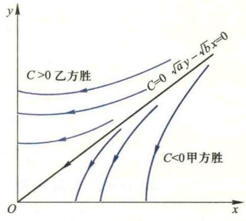

import ExerciseTrigger from '@/components/exercises/ExerciseTrigger.astro';
import QRCodeVideo from '@/components/QRCodeVideo.astro';

import Guide from '@/components/Guide.astro';
import Knowledge from '@/components/Knowledge.astro';
import Example from '@/components/Example.astro';
import Analysis from '@/components/Analysis.astro';
import Solution from '@/components/Solution.astro';
import Variant from '@/components/Variant.astro';
import Note from '@/components/Note.astro';
import SideNote from '@/components/SideNote.astro';
import Block from '@/components/Block.astro';
import Method from '@/components/Method.astro';
import Exercise from '@/components/Exercise.astro';

本节我们研究形式比较简单而且应用非常广泛的线性微分方程组。借助于线性代数的知识，我们将着重对线性微分方程组解的结构、常系数线性微分方程组的求解方法作比较系统的介绍。

### 3.1 线性微分方程组的基本概念

设 $a_{ij}(t)$ 与 $f_i(t)$ ($i=1,2,\cdots,n; j=1,2,\cdots,n$) 是区间 $(a,b)$ 内的连续函数，形式为

$$

\frac{\mathrm{d}x_i(t)}{\mathrm{d}t} = \sum_{j=1}^{n} a_{ij}(t)x_j(t) + f_i(t), \quad i=1,2,\cdots,n \tag{3.1}

$$

的常微分方程组称为关于未知函数组 $x_1(t), x_2(t), \cdots, x_n(t)$ 的 $n$ 阶线性常微分方程组，简称**线性微分方程组**。

为了将这个方程组写成更为简洁的向量形式，我们先引入矩阵函数导数与积分的概念及有关的基本运算法则。

<Knowledge title="定义 3.1 矩阵函数">
设有矩阵函数

$$

A(t) = (a_{ij}(t))_{n \times m}, \quad t \in I.

$$

(1) 若所有函数 $a_{ij}(t)$ ($i=1,2,\cdots,n; j=1,2,\cdots,m$) 均在区间 $I$ 上连续，则称矩阵函数 $A(t)$ 在 $I$ 上连续；

(2) 若所有函数 $a_{ij}(t)$ ($i=1,2,\cdots,n; j=1,2,\cdots,m$) 均在区间 $I$ 上可导（可积），则称矩阵函数 $A(t)$ 在 $I$ 上可导（可积），且定义

$$

\dot{A}(t) = \frac{\mathrm{d}}{\mathrm{d}t}A(t) = (\dot{a}_{ij}(t))_{n \times m}, \quad t \in I,

$$

$$
\int_{a}^{b} A(t) \mathrm{d}t = \left( \int_{a}^{b} a_{ij}(t) \mathrm{d}t \right)_{n \times m}.

$$

</Knowledge>

<Example title="矩阵函数导数与积分示例">
设

$$

A(t) = \begin{bmatrix} \sin t & t \\ 1 & \cos t \end{bmatrix}, \quad t \in [0, \pi],

$$

则

$$

\dot{A}(t) = \begin{bmatrix} \cos t & 1 \\ 0 & -\sin t \end{bmatrix} \quad (t \in [0, \pi]), \quad \int_{0}^{\pi} A(t) \mathrm{d}t = \begin{bmatrix} 2 & \frac{\pi^2}{2} \\ \pi & 0 \end{bmatrix}.

$$

</Example>

由定义 3.1 容易验证矩阵函数的导数满足以下运算法则：

(1) $\frac{\mathrm{d}}{\mathrm{d}t}(CA) = C \frac{\mathrm{d}A}{\mathrm{d}t}$，其中 $C$ 是一可与 $A$ 相乘的常数矩阵；

(2) 若 $A$ 与 $B$ 为同阶矩阵函数，则 $\frac{\mathrm{d}}{\mathrm{d}t}(A \pm B) = \frac{\mathrm{d}A}{\mathrm{d}t} \pm \frac{\mathrm{d}B}{\mathrm{d}t}$；

(3) 若矩阵函数 $A$ 与 $B$ 可以相乘，则 $\frac{\mathrm{d}}{\mathrm{d}t}(AB) = A \frac{\mathrm{d}B}{\mathrm{d}t} + \frac{\mathrm{d}A}{\mathrm{d}t} B$。

由于向量值函数 $\mathbf{x}(t) = (x_1(t), x_2(t), \cdots, x_n(t))^{\mathrm{T}}$ 可以看成一个列矩阵，是上述 $n \times m$ 矩阵 $A(t)$ 的一个特例，因此它的导数、积分的定义和运算法则都可以用上述方法进行，例如，

$$

\frac{\mathrm{d}\mathbf{x}(t)}{\mathrm{d}t} = (\dot{x}_1(t), \dot{x}_2(t), \cdots, \dot{x}_n(t))^{\mathrm{T}}

$$

等。

有了向量值函数与矩阵函数导数的概念，我们可以将线性微分方程组 (3.1) 式写成如下向量形式（也称矩阵形式）：

$$

\frac{\mathrm{d}\mathbf{x}(t)}{\mathrm{d}t} = A(t)\mathbf{x}(t) + \mathbf{f}(t) \tag{3.2}

$$

其中 $\mathbf{x}(t) = (x_1(t), x_2(t), \cdots, x_n(t))^{\mathrm{T}}$ 与 $\mathbf{f}(t) = (f_1(t), f_2(t), \cdots, f_n(t))^{\mathrm{T}}$ 为 $n$ 维向量值函数，$A(t) = (a_{ij}(t))_{n \times n}$ 为 $n$ 阶函数矩阵。

当 $\mathbf{f}(t) \equiv \mathbf{0}$ 时，(3.2) 式化为

$$

\frac{\mathrm{d}\mathbf{x}(t)}{\mathrm{d}t} = A(t)\mathbf{x}(t) \tag{3.3}

$$

称为**齐次线性微分方程组**。当 $\mathbf{f}(t) \neq \mathbf{0}$ 时，线性微分方程组 (3.2) 称为**非齐次线性微分方程组**，$f(t)$ 称为非齐次项或自由项。

显然，$n=1$ 时方程组 (3.2) 化为 $\frac{\mathrm{d}x}{\mathrm{d}t} = a(t)x + f(t)$，这就是我们已经研究过的一阶线性微分方程。关于它的解的概念、解的结构和求法，我们已作过比较详细的介绍和讨论，其中的一些概念、结构和方法可以推广到一般的 $n$ 阶线性方程组。

与一阶方程类似，若存在区间 $(\alpha, \beta) \subseteq (a, b)$ 内的连续可微向量值函数 $\mathbf{x} = \mathbf{x}(t)$，使方程组 (3.2) 在 $(\alpha, \beta)$ 上成为恒等式，则向量值函数 $\mathbf{x} = \mathbf{x}(t)$ 为方程组 (3.2) 在 $(\alpha, \beta)$ 上的**解**。

由于方程组 (3.2) 的左端由 $\mathbf{x}$ 的 $n$ 个分量的导数组成，故它的解中可以含有 $n$ 个独立的任意常数。含有 $n$ 个独立常数的解为方程组 (3.2) 的**通解**，不含任意常数的解为**特解**。要确定通解中的 $n$ 个任意常数，需要 $n$ 个独立的附加条件，这种条件称为**定解条件**。若定解条件是由函数 $\mathbf{x}(t)$ 在一点 $t=t_0$ 的值给出：$\mathbf{x}(t_0) = \mathbf{x}_0 = (x_{0,1}, \cdots, x_{0,n})^{\mathrm{T}}$，则此条件称为**初值条件**。在给定的初值条件下求解方程组 (3.2) 的问题，即求解

$$

\begin{cases}
\frac{\mathrm{d}\mathbf{x}(t)}{\mathrm{d}t} = A(t)\mathbf{x}(t) + \mathbf{f}(t), \\
\mathbf{x}(t_0) = \mathbf{x}_0
\end{cases} \tag{3.4}

$$

的问题，称为**初值问题**，或 **Cauchy 问题**。

可以证明（从略），对于方程组的初值问题 (3.4)，也有与方程式类似的解的存在唯一性定理，即当系数矩阵 $A(t)$ 与非齐次项 $\mathbf{f}(t)$ 在 $(a, b)$ 内连续时，初值问题的解在 $(a, b)$ 内是存在且唯一的，其中 $t_0 \in (a, b), \mathbf{x}_0 \in \mathbf{R}^n$，即一定存在唯一的一个定义在 $(a, b)$ 内的 $n$ 维向量值函数 $\mathbf{x} = \mathbf{x}(t)$，使当 $t \in (a, b)$ 时 (3.4) 恒成立。但是，一般情况下用初等积分的方法来求它的解是不太可能的。因此在讨论它的求解问题之前，我们先介绍解的一些性质和解的结构。

### 3.2 线性微分方程组解的结构

#### 1. 齐次线性微分方程组

对于齐次线性微分方程组 (3.3)，容易看出，它具有以下简单性质：

1. $\mathbf{x}(t) \equiv \mathbf{0}$ 是方程组 (3.3) 的解，称为**平凡解**或**零解**；

2. 若方程组 (3.3) 的解 $\mathbf{x}(t)$ 满足初值条件 $\mathbf{x}(t_0) = \mathbf{0}$，则由解的存在唯一性定理可知必有 $\mathbf{x}(t) \equiv \mathbf{0}$；

3. 若 $\mathbf{x}_i(t)$ ($i=1, \cdots, n, t \in (a, b)$) 均为方程组 (3.3) 的解，$C_1, \cdots, C_n$ 皆为常数，则其线性组合 $\sum_{i=1}^{n} C_i \mathbf{x}_i(t)$ ($t \in (a, b)$) 也是方程组 (3.3) 的解。

<SideNote title="思路分析">
线性代数知识告诉我们，$n$ 维常向量的全体构成一个 $n$ 维线性空间，它的基由任意 $n$ 个线性独立的常向量构成。这时，任意一个 $n$ 维常向量均可用该空间的基线性表示。从上述性质 $1^\circ$ 和 $3^\circ$ 我们想到：齐次线性微分方程组 (3.3) 的所有的解（向量值函数）是否也能构成一个 $n$ 维线性空间呢？它的基是否也可通过把常向量的线性无关概念推广后得到呢？若能做到这一点，则方程组 (3.3) 的任一解都可表示成基的线性组合。这样，我们就得到了方程组 (3.3) 通解的表达式。为研究这个问题，我们首先把第二节中函数线性相关与线性无关的概念推广到向量值函数组。
</SideNote>

### 向量值函数的线性相关与线性无关

<Knowledge title="定义 3.2 向量值函数的线性相关与线性无关">
设有 $m$ 个 $n$ 维向量值函数 $\mathbf{x}_1(t), \dots, \mathbf{x}_m(t)$ 均在区间 $(a, b)$ 内有定义。

如果存在不全为零的常数 $C_1, \dots, C_m$ 使在 $(a, b)$ 内成立恒等式

$$

\sum_{i=1}^{m} C_i \mathbf{x}_i(t) = C_1 \mathbf{x}_1(t) + \dots + C_m \mathbf{x}_m(t) \equiv \mathbf{0}, \tag{3.2}

$$

那么称 $\mathbf{x}_1(t), \dots, \mathbf{x}_m(t)$ 在区间 $(a, b)$ 内**线性相关**。如果 $\mathbf{x}_1(t), \dots, \mathbf{x}_m(t)$ 在 $(a, b)$ 内不线性相关，那么就称这 $m$ 个向量值函数在 $(a, b)$ 内**线性无关**或**线性独立**。
</Knowledge>

<SideNote title="注意">
由定义可见，向量值函数的线性相关与否是对区间内的所有点来说的。当任意给定一点时，它就是一常向量，因而自然产生与函数组线性相关同样的问题，即它们会不会对在某个点 $t_0 \in (a, b)$ 处所形成的常向量组 $\mathbf{x}_1(t_0), \dots, \mathbf{x}_m(t_0)$ 线性相关，而在另一地点 $t_2 \in (a, b)$ 处所形成的常向量组又线性无关呢？一般来说，这种情况是可能发生的。但是下列定理表明，正像函数组那样，若 $\mathbf{x}_i(t) \ (i=1, 2, \dots, m)$ 是齐次线性微分方程组 (3.3) 的解时，这种情况不会发生。
</SideNote>

<Knowledge title="定理 3.1 线性相关的判定">
设 $\mathbf{x}_i(t) \ (t \in (a, b), i=1, 2, \dots, m)$ 是方程组 (3.3) 的任意 $m$ 个解，则这 $m$ 个解在区间 $(a, b)$ 内线性相关的充要条件是：$\exists t_0 \in (a, b)$，使常向量组 $\mathbf{x}_i(t_0) \ (i=1, 2, \dots, m)$ 线性相关。
</Knowledge>

<Solution title="证明">
由定义 3.2，必要性是显然的。

现证充分性。存在 $t_0 \in (a, b)$ 使向量组 $\mathbf{x}_i(t_0) \ (i=1, 2, \dots, m)$ 线性相关，即存在不全为零的常数 $C_1, \dots, C_m$，使 $\sum_{i=1}^{m} C_i \mathbf{x}_i(t_0) = \mathbf{0}$。考虑向量值函数 $\mathbf{x}(t) = \sum_{i=1}^{m} C_i \mathbf{x}_i(t)$，$t \in (a, b)$，由性质 $3^\circ$ 可知，$\mathbf{x}(t)$ 也是方程组 (3.3) 的解。但由于 $\mathbf{x}(t_0) = \sum_{i=1}^{m} C_i \mathbf{x}_i(t_0) = \mathbf{0}$，由性质 $2^\circ$ 可知，必有 $\mathbf{x}(t) = \sum_{i=1}^{m} C_i \mathbf{x}_i(t) \equiv \mathbf{0}, t \in (a, b)$，即 $\mathbf{x}_i(t) \ (i=1, \dots, m)$ 在 $(a, b)$ 内线性相关。
</Solution>

从这个定理我们可以看出，对于方程组 (3.3) 在 $(a, b)$ 内存在的解 $\mathbf{x}_i(t) \ (i=1, \dots, n)$ 来说，如果在 $(a, b)$ 内一点 $t_0$ 处线性无关，则必在整个区间 $(a, b)$ 内线性无关。

<SideNote title="注">
由定理 3.2 可见，我们也可以将线性齐次微分方程组 (3.3) 的通解定义为它的全部解的表达式式。
</SideNote>

<Knowledge title="定理 3.2 方程组通解的存在性">
方程组 (3.3) 必存在 $n$ 个线性无关的解；此方程组的通解就是这 $n$ 个线性无关解的线性组合，即

$$

\mathbf{x}(t) = \sum_{i=1}^{n} C_i \mathbf{x}_i(t), \quad t \in (a, b) \tag{3.5}

$$

其中 $C_i \ (i=1, \dots, n)$ 是任意常数，而且此方程组的任一解均可表示为 (3.5) 形式。
</Knowledge>

<Solution title="证明">
在 $\mathbb{R}^n$ 中取一个基，例如取标准基 $\mathbf{e}_1, \mathbf{e}_2, \dots, \mathbf{e}_n$，分别以它们作为初值，即令

$$

\mathbf{x}_1(t_0) = \mathbf{e}_1 = \begin{bmatrix} 1 \\ 0 \\ \vdots \\ 0 \\ 0 \end{bmatrix}, \quad \mathbf{x}_2(t_0) = \mathbf{e}_2 = \begin{bmatrix} 0 \\ 1 \\ 0 \\ \vdots \\ 0 \end{bmatrix}, \dots, \mathbf{x}_n(t_0) = \mathbf{e}_n = \begin{bmatrix} 0 \\ 0 \\ \vdots \\ 0 \\ 1 \end{bmatrix}

$$

根据解的存在唯一性定理，方程组 (3.3) 适合上述初值的 $n$ 个解 $\mathbf{x}_i(t) \ (i=1, 2, \dots, n)$ 都必在 $(a, b)$ 内存在。由于初始向量组线性无关，由定理 3.1 知 $\mathbf{x}_1(t), \dots, \mathbf{x}_n(t)$ 在 $(a, b)$ 内也线性无关。于是类似于定理 2.2 与 2.4 可证表达式 (3.5) 为方程组 (3.3) 的通解，而且包含了它的所有解。
</Solution>

定理 3.2 也表明：齐次线性微分方程组 (3.3) 的全部解构成一个 $n$ 维线性空间，称为此方程组的解空间。同时，(3.5) 式也给出了齐次线性微分方程组通解的结构：齐次线性微分方程组的通解 $\mathbf{x}(t)$ 是它的任意 $n$ 个线性无关的特解 $\mathbf{x}_i(t) \ (i=1, \dots, n)$ 与 $n$ 个任意常数 $C_i$ 的线性组合，即 (3.5) 式。

### 基解矩阵及其判别法

<Knowledge title="定义 3.3 基解矩阵">
齐次线性微分方程组 (3.3) 的任意 $n$ 个线性无关的特解 $\mathbf{x}_1(t), \dots, \mathbf{x}_n(t)$ 称为方程组 (3.3) 的一个**基本解组**，它也就是由方程组 (3.3) 全部解所构成的解空间的一个基。以这些解的分量为列所形成的矩阵称为方程组 (3.3) 的**基解矩阵**，记为

$$

\mathbf{X}(t) = \begin{bmatrix} x_{11}(t) & x_{21}(t) & \dots & x_{n1}(t) \\ \vdots & \vdots & & \vdots \\ x_{1n}(t) & x_{2n}(t) & \dots & x_{nn}(t) \end{bmatrix} = (\mathbf{x}_1(t), \dots, \mathbf{x}_n(t)).

$$

</Knowledge>

<Knowledge title="定义 3.4 Wronski 行列式">
由 $n$ 个 $n$ 维向量值函数 $\mathbf{x}_i(t) \ (t \in I, i=1, 2, \dots, n)$ 的分量 $x_{ij} \ (i, j=1, 2, \dots, n)$ 依次为列所构成的行列式，称为这 $n$ 个向量值函数的 **Wronski 行列式**，记作 $W(t) = \det(x_{ij}(t)), t \in I$。
</Knowledge>

利用基解矩阵可将方程组 (3.3) 的通解表示为

$$

\mathbf{x}(t) = \mathbf{X}(t)\mathbf{C}, \quad t \in (a, b) \tag{3.6}

$$

其中，$\mathbf{C} = (C_1, \dots, C_n)^T$ 是一由任意常数 $C_1, \dots, C_n$ 所组成的列向量。

由此可见，求解齐次线性微分方程组 (3.3) 的关键在于求出它的基解矩阵，或者说求出它的任意 $n$ 个线性无关的特解。然而，当找到方程组 (3.3) 在 $(a, b)$ 内的 $n$ 个特解 $\mathbf{x}_1(t), \dots, \mathbf{x}_n(t)$ 后，怎样来判断它们在 $(a, b)$ 内是否线性无关呢？我们有如下简单的判别法。

<Knowledge title="定理 3.3 (Wronski 行列式判别法)">
设齐次线性微分方程组 (3.3) 的 $n$ 个解 $\mathbf{x}_i(t) \ (i=1, 2, \dots, n)$，在 $(a, b)$ 内线性无关的充要条件是存在一点 $t_0 \in (a, b)$，使得这 $n$ 个解的 Wronski 行列式在 $t_0$ 处的值 $W(t_0) \neq 0$。
</Knowledge>

<Solution title="证明">
由定理 3.1 可知，方程组 (3.3) 的 $n$ 个解 $\mathbf{x}_i(t) \ (i=1, 2, \dots, n)$ 在 $(a, b)$ 内线性无关的充要条件是：$\exists t_0 \in (a, b)$ 使 $\mathbf{x}_i(t_0) \ (i=1, 2, \dots, n)$ 线性无关；而由线性代数知识可知，$n$ 个 $n$ 维向量 $\mathbf{x}_i(t_0) \ (i=1, 2, \dots,n)$ 线性无关的充要条件是：由它们的分量所构成的行列式

$$

W(t_0) = \det(x_{ij}(t_0)) \neq 0.

$$

实际上，由方程组 (3.3) 的 $n$ 个解所构成的 Wronski 行列式在解的存在区间 $(a, b)$ 内或者恒为零，或者恒不为零。
</Solution>

<SideNote title="思路分析">
通过将基解矩阵 $X(t)$ 与常向量 $B$ 相乘，可以构造出方程组的一组特解。若 $B$ 是非奇异矩阵，则这些特解是线性无关的，从而构成通解。
</SideNote>

其中 $b_i$ 为非零向量，从而

$$

X(t) = (X^*(t)b_1, \dots, X^*(t)b_n) = X^*(t)(b_1, \dots, b_n) = X^*(t)B. \tag{3.1}

$$

其中，矩阵 $B = (b_1, \dots, b_n)$，且由

$$

\det X^*(t) \cdot \det B = \det X(t) \neq 0, \tag{3.2}

$$

可知 $\det B \neq 0$，即 $B$ 是非奇异矩阵。

<Example title="例 3.1 验证微分方程组">
验证微分方程组

$$

\frac{\mathrm{d}}{\mathrm{d}t} \begin{bmatrix} x_1 \\ x_2 \end{bmatrix} = \begin{bmatrix} \cos^2 t & \frac{1}{2}\sin 2t - 1 \\ \frac{1}{2}\sin 2t + 1 & \sin^2 t \end{bmatrix} \begin{bmatrix} x_1 \\ x_2 \end{bmatrix}

$$

的通解为

$$

x = C_1 \begin{bmatrix} e^{-t}\cos t \\ e^{-t}\sin t \end{bmatrix} + C_2 \begin{bmatrix} -\sin t \\ \cos t \end{bmatrix}, \quad t \in \mathbf{R}.

$$

</Example>

<Solution title="解">
代入微分方程组直接验证可知：当 $t \in \mathbf{R}$ 时，$\begin{bmatrix} e^{-t}\cos t \\ e^{-t}\sin t \end{bmatrix}$ 与 $\begin{bmatrix} -\sin t \\ \cos t \end{bmatrix}$ 是该方程组的两个特解。由于当 $t=0$ 时 Wronski 行列式

$$

W(t) = \begin{vmatrix} 1 & 0 \\ 0 & 1 \end{vmatrix} \neq 0, \tag{3.3}

$$

所以，此两特解在 $t \in \mathbf{R}$ 线性无关，于是其通解如题中所示。
</Solution>

### 2. 非齐次线性微分方程组

由本章第二节，我们知道，非齐次线性微分方程的通解是由它的任一特解与对应齐次线性微分方程的通解之和组成。完全类似的证明可知，非齐次线性微分方程组 (3.2) 的通解仍然具有同样的结构。

<Knowledge title="定理 3.4 (非齐次线性微分方程组解的结构)">
非齐次线性微分方程组 (3.2) 的任一解 $x(t)$ 可以表示成它的任一特解 $x^*(t)$ 与它所对应的齐次线性微分方程组 (3.3) 的通解 (3.6) 之和的形式，即

$$

x(t) = X(t)C + x^*(t), \quad t \in (a, b), \tag{3.7}

$$

其中 $X(t)$ 是齐次线性微分方程组 (3.3) 的一个基解矩阵，$C \in \mathbf{R}^n$ 为常向量。
</Knowledge>

<SideNote title="注意">
由于 (3.7) 式中的 $C \in \mathbf{R}^n$ 可以是任意常向量，因此，该式也是非齐次线性微分方程组 (3.2) 通解的表达式。由定理 3.4 可见，与齐次线性微分方程组一样，非齐次线性微分方程组的通解也包括了它的全部解。故也可用后一特征来定义非齐次线性微分方程组的通解。
</SideNote>

由定理 3.4 可知，在已知齐次线性微分方程组 (3.3) 的基解矩阵的情况下，要求非齐次线性微分方程组 (3.2) 的通解，关键在于找到它的任一特解，而定理给出了此特解的表达式，而且其证明给出了求此特解的一种方法。

<Knowledge title="定理 3.5">
设 $X(t) \ (t \in (a, b))$ 是齐次线性微分方程组 (3.3) 的一个基解矩阵，则

$$

x^*(t) = X(t) \int_{t_0}^t X^{-1}(\tau)f(\tau) \mathrm{d}\tau, \quad t \in (a, b) \tag{3.8}

$$

就是非齐次线性微分方程组 (3.2) 适合初值条件 $x^*(t_0) = 0$ 的特解。
</Knowledge>

<Solution title="证明">
我们采用在一阶线性微分方程中曾经用过的常数变易法来证明公式 (3.8)。假设方程组 (3.2) 有如下形式的特解

$$

x^*(t) = X(t)C(t), \tag{3.9}

$$

其中 $C(t)$ 为 $n$ 维向量值函数。我们期望把 (3.9) 代入非齐次方程组 (3.2) 后可将待定的向量值函数 $C(t)$ 确定出来。为此，把 (3.9) 代入方程组 (3.2)，把 $C(t)$ 看作是 $n$ 行一列矩阵函数，得

$$

\dot{X}(t)C(t) + X(t)\dot{C}(t) = A(t)X(t)C(t) + f(t). \tag{3.10}

$$

由于 $X(t)$ 为齐次方程组 (3.3) 的基解矩阵，由基解矩阵的性质可知，它应满足矩阵方程，即

$$

\dot{X}(t) = A(t)X(t), \tag{3.11}

$$

代入 (3.10) 式后化简得

$$

X(t)\dot{C}(t) = f(t). \tag{3.12}

$$

由于 $X(t)$ 是基解矩阵，故 Wronski 行列式

$$

W(t) = \det X(t) \neq 0, \quad t \in (a, b). \tag{3.13}

$$

从而矩阵 $X^{-1}(t) \ (t \in (a, b))$ 存在。用 $X^{-1}(t)$ 左乘 (3.12) 式两端得

$$

\dot{C}(t) = X^{-1}(t)f(t), \tag{3.14}

$$

积分得

$$

C(t) = \int X^{-1}(t)f(t) \mathrm{d}t = \int_{t_0}^t X^{-1}(\tau)f(\tau) \mathrm{d}\tau + C_1, \tag{3.15}

$$

其中 $C_1$ 为任意常向量，代入 (3.9) 式得

$$

x^*(t) = X(t) \left( \int_{t_0}^t X^{-1}(\tau)f(\tau) \mathrm{d}\tau + C_1 \right), \tag{3.16}

$$

由初值条件 $x^*(t_0) = 0$ 可得 $C_1 = 0$，于是定理得证。
</Solution>

<SideNote title="注意">
此处积分中的被积函数为向量值函数，因此，它们的积分应等于对每个分量积分所构成的向量值函数。
</SideNote>

综合定理 3.4 与 3.5 可得非齐次线性微分方程组 (3.2) 通解的表达式式

$$

x(t) = X(t)C + X(t) \int_{t_0}^t X^{-1}(\tau)f(\tau) \mathrm{d}\tau. \tag{3.17}

$$

若将初值条件 $x(t_0) = x_0$ 代入，可得

$$

C = X^{-1}(t_0)x_0, \tag{3.18}

$$

于是，方程满足初值条件 $x(t_0) = x_0$ 的特解为

$$

x(t) = X(t)X^{-1}(t_0)x_0 + X(t) \int_{t_0}^t X^{-1}(\tau)f(\tau) \mathrm{d}\tau. \tag{3.19}

$$

<Example title="例 3.2 求微分方程组">
求微分方程组

$$

\begin{cases}
\frac{\mathrm{d}x_1}{\mathrm{d}t} = x_1 \cos^2 t + x_2 \left( \frac{1}{2}\sin 2t - 1 \right) + \cos t, \\
\frac{\mathrm{d}x_2}{\mathrm{d}t} = x_1 \left( \frac{1}{2}\sin 2t + 1 \right) + x_2 \sin^2 t + \sin t
\end{cases}

$$

的通解与适合初值条件 $x_1(0) = 0, x_2(0) = 1$ 的特解。
</Example>

<Solution title="解">
由例 3.1 可知，对应的齐次线性微分方程组的基解矩阵为

$$

X(t) = \begin{bmatrix} e^{-t}\cos t & -\sin t \\ e^{-t}\sin t & \cos t \end{bmatrix},

$$

于是对应齐次方程组的通解为

$$

X(t) = \begin{bmatrix} e^{-t}\cos t & -\sin t \\ e^{-t}\sin t & \cos t \end{bmatrix} \begin{bmatrix} C_1 \\ C_2 \end{bmatrix}.

$$

为了求出非齐次方程组的一个特解，先求

$$

X^{-1}(t) = \begin{bmatrix} e^{-t}\cos t & e^{-t}\sin t \\ -\sin t & \cos t \end{bmatrix},

$$

从而

$$

\int_{0}^t X^{-1}(\tau)f(\tau) \mathrm{d}\tau = \int_{0}^t \begin{bmatrix} e^{-\tau}\cos \tau & e^{-\tau}\sin \tau \\ -\sin \tau & \cos \tau \end{bmatrix} \begin{bmatrix} \cos \tau \\ \sin \tau \end{bmatrix} \mathrm{d}\tau

$$

$$
= \int_{0}^t \begin{bmatrix} e^{-\tau} \\ 0 \end{bmatrix} \mathrm{d}\tau = \begin{bmatrix} 1 - e^{-t} \\ 0 \end{bmatrix},

$$

于是，$\begin{bmatrix} e^{-t}\cos t & -\sin t \\ e^{-t}\sin t & \cos t \end{bmatrix} \begin{bmatrix} 1 - e^{-t} \\ 0 \end{bmatrix}$ 便是非齐次方程组的一个特解。从而由通解的结构可知非齐次方程组的通解为

$$

x(t) = X(t)C + \begin{bmatrix} e^{-t}\cos t(1 - e^{-t}) \\ e^{-t}\sin t(1 - e^{-t}) \end{bmatrix}.

$$

<SideNote title="注意">
我们当然也可以求出 $X^{-1}(t)$ 后直接代入非齐次方程组的特解公式 (3.19) 来求出特解。
</SideNote>
</Solution>

$$

x(t) = \begin{bmatrix} e^t \cos t & -\sin t \\ e^t \sin t & \cos t \end{bmatrix} \left( \begin{bmatrix} C_1 \\ C_2 \end{bmatrix} + \begin{bmatrix} 1-e^{-t} \\ 0 \end{bmatrix} \right)

$$

$$
= \begin{bmatrix} C_1 e^t \cos t - C_2 \sin t + (e^t - 1) \cos t \\ C_1 e^t \sin t + C_2 \cos t + (e^t - 1) \sin t \end{bmatrix} \tag{3.14}

$$

<SideNote title="注意">
对于线性微分方程组来说，如果知道了对应齐次线性微分方程组的基解矩阵，那么非齐次线性微分方程组的通解一定可以求出，但这并不意味着线性微分方程组的解一定可用初等积分法得到。因为齐次线性微分方程组的解，一般来说是很难求得的。即使对于仅由两个方程构成的齐次线性微分方程组，它的解一般也是无法通过初等积分法获得的。
</SideNote>

注意到

$$

X^{-1}(0) = \begin{bmatrix} 1 & 0 \\ 0 & 1 \end{bmatrix}

$$

把初值条件代入所求得的通解 (3.14) 中，确定出 $C_1=0, C_2=1$，从而得出特解为

$$

X(t) = \begin{bmatrix} e^t \cos t & -\sin t \\ e^t \sin t & \cos t \end{bmatrix} \left( \begin{bmatrix} 1 \\ 0 \end{bmatrix} \begin{bmatrix} 0 \\ 1 \end{bmatrix} + \begin{bmatrix} 1-e^{-t} \\ 0 \end{bmatrix} \right)

$$

$$
= \begin{bmatrix} (e^t - 1) \cos t - \sin t \\ (e^t - 1) \sin t + \cos t \end{bmatrix}

$$

### 3.3 常系数线性齐次微分方程组的求解方法

在 3.2 段中，我们已经对微分方程组的解的结构，建立了一套比较完整的理论。然而，上面我们已经指出，正像线性微分方程那样，线性微分方程组的解，一般说来也是难以求得的。但是，也正如线性微分方程那样，当线性微分方程组 (3.2) 中的系数 $a_{ij}(t) (i=1,2,\dots,n; j=1,2,\dots,n)$ 全为常数，即 $a_{ij}(t) \equiv a_{ij}$（常数）时，它的解却可以利用线性代数的方法求出。这种系数全为常数的线性微分方程组称为常系数线性微分方程组。相应的非齐次和齐次线性微分方程组，分别称为常系数非齐次线性微分方程组和常系数齐次线性微分方程组，简称为常系数非齐次方程组和常系数齐次方程组。

下面，我们就来讨论这类应用中最常见的常系数线性微分方程组的求解问题，着重介绍方法。本段对齐次方程组的情形进行讨论。

对于一阶常系数齐次线性微分方程：

$$

\frac{\mathrm{d}x}{\mathrm{d}t} = ax

$$

利用分离变量法，我们立即可得到它的通解

$$

x = Ce^{at}

$$

现在，考察常系数齐次线性微分方程组

$$

\frac{\mathrm{d}x_i}{\mathrm{d}t} = \sum_{j=1}^n a_{ij}x_j, \quad i=1,2,\dots,n

$$

或其向量形式

$$

\frac{\mathrm{d}x}{\mathrm{d}t} = Ax \tag{3.15}

$$

其中 $A = (a_{ij})_{n \times n}$ 为一常数矩阵。由解的存在唯一性定理可知，方程组 (3.15) 的任一解的存在区间均为 $(-\infty, +\infty)$。注意到一阶常系数齐次线性方程的解为指数函数以及指数函数的导数仍为指数函数，为求解方程组 (3.15)，我们可以设方程组 (3.15) 有如下形式的特解

$$

x = re^{\lambda t} \tag{3.16}

$$

其中 $\lambda$ 为待定常数，$r$ 为待定常向量。然后把 (3.16) 式代入方程组 (3.15) 去确定 $\lambda$ 与 $r$。这种方法称为待定系数法。将 (3.16) 式代入方程组 (3.15) 得

$$

r\lambda e^{\lambda t} = Are^{\lambda t}

$$

从而

$$

r\lambda = Ar \quad \text{或} \quad (A - \lambda E)r = 0

$$

其中 $E$ 为 $n$ 阶单位矩阵。可见，当且仅当 $\lambda$ 为系数矩阵 $A$ 的特征值时，方程组 (3.15) 有形式如 (3.16) 的解。此时，非零向量 $r$ 就是 $A$ 的特征值 $\lambda$ 所对应的特征向量。这样，对于一种简单情形，即 $n$ 阶矩阵 $A$ 有 $n$ 个线性无关的特征向量时，方程组 (3.15) 的基解矩阵是较容易求得的。对于其他情形怎么去求解该方程组呢？下面分别来讨论这些问题。

#### (1) $A$ 有 $n$ 个线性无关的特征向量的情形

此时，我们只需要求出 $A$ 的 $n$ 个线性无关的特征向量以及对应的特征值，就可写出方程组 (3.15) 的 $n$ 个形如 (3.16) 式且线性无关的特解及基解矩阵。

<Knowledge title="定理 3.6">
设 $n$ 阶矩阵 $A$ 有 $n$ 个线性无关的特征向量 $r_1, r_2, \dots, r_n$，它们对应的特征值分别为 $\lambda_1, \lambda_2, \dots, \lambda_n$（未必互不相同），则矩阵

$$

X(t) = (r_1 e^{\lambda_1 t}, r_2 e^{\lambda_2 t}, \dots, r_n e^{\lambda_n t}) \tag{3.17}

$$

就是常系数齐次线性微分方程组 (3.15) 的一个基解矩阵。从而 (3.15) 的通解为

$$

x(t) = X(t)C = (r_1 e^{\lambda_1 t}, \dots, r_n e^{\lambda_n t}) \begin{pmatrix} C_1 \\ \vdots \\ C_n \end{pmatrix}

$$

其中 $\begin{pmatrix} C_1 \\ \vdots \\ C_n \end{pmatrix}$ 为任意常向量。
</Knowledge>

<SideNote title="注意">
定理 3.6 包括两种情形：
(1) 矩阵 $A$ 的 $n$ 个特征值互不相同，即都是单重根；
(2) 有重特征值，但此重特征值所对应的线性无关的特征向量的个数正好等于该特征值的重数。
</SideNote>

<Solution title="证明">
如上所述，每一个向量值函数 $r_i e^{\lambda_i t} (i=1, 2, \dots, n)$ 都是方程组 (3.15) 的解，而且由于 $r_1, r_2, \dots, r_n$ 线性无关，从而

$$

\det X(0) = \det(r_1, r_2, \dots, r_n) \neq 0

$$

所以向量值函数 $r_i e^{\lambda_i t} (i=1, 2, \dots, n)$ 线性无关，故矩阵 (3.17) 是方程组 (3.15) 的一个基解矩阵。于是由定理 3.2 可得齐次方程组 (3.15) 的通解形式。
</Solution>

<Example title="例 3.3 求齐次线性微分方程组的通解">
求齐次线性微分方程组

$$

\frac{\mathrm{d}x}{\mathrm{d}t} = \begin{bmatrix} 5 & -28 & -18 \\ -1 & 5 & 3 \\ 3 & -16 & -10 \end{bmatrix} x

$$

的通解。
</Example>

<Solution title="解">
其系数矩阵 $A$ 的特征方程为

$$

\det(A - \lambda E) = \begin{vmatrix} 5-\lambda & -28 & -18 \\ -1 & 5-\lambda & 3 \\ 3 & -16 & -10-\lambda \end{vmatrix} = \lambda(1-\lambda^2) = 0

$$

从而特征值为

$$

\lambda = 0, 1, -1

$$

由于 $A$ 的 3 个特征值都是单重的，它们所对应的特征向量当然线性无关。通过计算可得与它们对应的特征向量可以分别取为

$$

r_1 = \begin{bmatrix} -2 \\ -1 \\ 1 \end{bmatrix}, \quad r_2 = \begin{bmatrix} 2 \\ -1 \\ 2 \end{bmatrix}, \quad r_3 = \begin{bmatrix} 3 \\ 0 \\ 1 \end{bmatrix}

$$

于是，所给微分方程组的一个基解矩阵为

$$

X(t) = (r_1 e^{0t}, r_2 e^{1t}, r_3 e^{-1t}) = \begin{bmatrix} -2 & 2e^t & 3e^{-t} \\ -1 & -e^t & 0 \\ 1 & 2e^t & e^{-t} \end{bmatrix}

$$

故所给微分方程组的通解为

$$

x(t) = \begin{bmatrix} -2 & 2e^t & 3e^{-t} \\ -1 & -e^t & 0 \\ 1 & 2e^t & e^{-t} \end{bmatrix} \begin{bmatrix} C_1 \\ C_2 \\ C_3 \end{bmatrix}

$$

</Solution>

<Example title="例 3.4 求齐次线性微分方程组的通解">
求齐次线性微分方程组

$$

\frac{\mathrm{d}\boldsymbol{x}}{\mathrm{d}t} = \begin{bmatrix} 1 & -3 & 3 \\ 3 & -5 & 3 \\ 6 & -6 & 4 \end{bmatrix}\boldsymbol{x}

$$

的通解。
</Example>

<SideNote title="注意">
这里出现二重特征值 $\lambda = -2$，于是必须检验它能否对应两个线性无关的特征向量。
</SideNote>

<Solution title="解">
微分方程组的系数矩阵 $\boldsymbol{A}$ 的特征方程为

$$

\det(\boldsymbol{A} - \lambda\boldsymbol{E}) = (\lambda + 2)^2 (4 - \lambda) = 0,

$$

从而求得 $\boldsymbol{A}$ 有二重特征值 $\lambda_1 = \lambda_2 = -2$，及单重特征值 $\lambda_3 = 4$。要求对应于特征值 $\lambda_1 = -2$ 的线性无关的特征向量，也就是要求齐次线性方程组 $(\boldsymbol{A} + 2\boldsymbol{E})\boldsymbol{r} = \mathbf{0}$ 的一个基础解系。为此，对其系数矩阵 $\boldsymbol{A} + 2\boldsymbol{E}$ 作初等行变换

$$

\boldsymbol{A} + 2\boldsymbol{E} = \begin{bmatrix} 3 & -3 & 3 \\ 3 & -3 & 3 \\ 6 & -6 & 6 \end{bmatrix} \to \begin{bmatrix} 1 & -1 & 1 \\ 0 & 0 & 0 \\ 0 & 0 & 0 \end{bmatrix}.

$$

可见 $\boldsymbol{A} + 2\boldsymbol{E}$ 的秩为 1，故方程组 $(\boldsymbol{A} + 2\boldsymbol{E})\boldsymbol{r} = \mathbf{0}$ 的基础解系含 2 个向量，即矩阵 $\boldsymbol{A}$ 对应于二重特征值 $-2$ 的线性无关的特征向量有 2 个，它们可取为

$$

\boldsymbol{r}_1 = \begin{bmatrix} 1 \\ 1 \\ 0 \end{bmatrix}, \quad \boldsymbol{r}_2 = \begin{bmatrix} -1 \\ 0 \\ 1 \end{bmatrix}.

$$

计算可得对应于特征值 $\lambda_3 = 4$ 的特征向量可取为

$$

\boldsymbol{r}_3 = \begin{bmatrix} 1 \\ 1 \\ 2 \end{bmatrix}.

$$

由于 $\lambda_1 \neq \lambda_3$，所以 $\boldsymbol{r}_1, \boldsymbol{r}_2, \boldsymbol{r}_3$ 线性无关。这样，对于 3 阶方阵 $\boldsymbol{A}$，求得了 $\boldsymbol{A}$ 的 3 个线性无关的特征向量。根据定理 3.6，所给微分方程组的基解矩阵为

$$

\boldsymbol{X}(t) = (\boldsymbol{r}_1 e^{-2t}, \boldsymbol{r}_2 e^{-2t}, \boldsymbol{r}_3 e^{4t}) = \begin{bmatrix} e^{-2t} & -e^{-2t} & e^{4t} \\ e^{-2t} & 0 & e^{4t} \\ 0 & e^{-2t} & 2e^{4t} \end{bmatrix}.

$$

从而得到微分方程组的通解为

$$

\boldsymbol{x}(t) = \boldsymbol{X}(t)\boldsymbol{C} = C_1 e^{-2t}\begin{bmatrix} 1 \\ 1 \\ 0 \end{bmatrix} + C_2 e^{-2t}\begin{bmatrix} -1 \\ 0 \\ 1 \end{bmatrix} + C_3 e^{4t}\begin{bmatrix} 1 \\ 1 \\ 2 \end{bmatrix}.

$$

其中 $\boldsymbol{C} = (C_1, C_2, C_3)^T$ 为任意常向量。
</Solution>

<SideNote title="思路分析">
在求解线性微分方程组时，若系数矩阵 $A$ 存在重特征值，首先需检查其对应的线性无关特征向量的个数是否等于该特征值的重数。若个数不足，则需利用定理 3.7 构造包含 $t$ 的项的特解。
</SideNote>

### (2) $A$ 没有 $n$ 个线性无关的特征向量的情形

这是一种比较困难的情形，即存在 $A$ 的 $n_i$ 重特征值 $\lambda_i$，它所对应的线性无关的特征向量的个数小于该特征值的重数 $n_i$。从而 $A$ 的线性无关的特征向量的个数小于 $n$。这时，若仍像定理 3.6 那样，仅利用 $A$ 的特征向量，方程组 (3.15) 的基解矩阵将不能得到。对于这样的特征值 $\lambda_i$，能否找到方程组 (3.15) 的 $n_i$ 个其他形式的线性无关的特解？下面的定理回答了这一问题。

<Knowledge title="定理 3.7">
设 $\lambda_i$ 是矩阵 $A$ 的 $n_i$ 重特征值，则方程组 (3.15) 必存在 $n_i$ 个形如

$$

x(t) = e^{\lambda_i t} \left( r_0 + \frac{t}{1!}r_1 + \frac{t^2}{2!}r_2 + \cdots + \frac{t^{n_i-1}}{(n_i-1)!}r_{n_i-1} \right) \tag{3.18}

$$

的线性无关的特解，其中 $r_0$ 是齐次线性方程组

$$

(A - \lambda_i E)^{n_i} r = 0 \tag{3.19}

$$

的非零解，而方程组 (3.19) 必有 $n_i$ 个线性无关的解。对于每一个解 $r_0$，相应的 $r_1, \cdots, r_{n_{i-1}}$ 可由下列关系式逐次确定：

$$

\begin{aligned}
r_1 &= (A - \lambda_i E)r_0, \\
r_2 &= (A - \lambda_i E)r_1, \\
&\cdots \\
r_{n_i-1} &= (A - \lambda_i E)r_{n_i-2}.
\end{aligned} \tag{3.20}

$$

</Knowledge>

对于 $A$ 的每个多重特征值，利用定理 3.6 或 3.7，可以求得方程组 (3.15) 与每个多重特征值所对应的线性无关的特解，而且与每个特征值所对应的线性无关的特解数目恰好等于此特征值的重数。这样一来，我们就可以得到方程组 (3.15) 的 $n$ 个特解。现在的问题是这 $n$ 个特解是否彼此线性无关呢？把问题提得再明确一些就是：把对应于每个特征值的那些线性无关的特解合起来是否仍然线性无关？下面的定理回答了这个问题。

<Knowledge title="定理 3.8">
设 $n$ 阶矩阵 $A$ 的互不相同的特征值为 $\lambda_1, \lambda_2, \cdots, \lambda_s$，其相应的重数分别为 $n_1, n_2, \cdots, n_s$ ($n_1 + n_2 + \cdots + n_s = n$)。则由定理 3.6（包括多重特征值所对应的线性无关特征向量的个数等于该特征值的重数情形）与定理 3.7 所求出的方程组 (3.15) 的诸线性无关特解的全体，必构成方程组 (3.15) 的 $n$ 个线性无关的特解，从而构成了方程组 (3.15) 的一个基本解组。
</Knowledge>

<Example title="例 3.5 求微分方程组的通解">
求微分方程组

$$

\frac{\mathrm{d}x}{\mathrm{d}t} = \begin{bmatrix} 1 & 1 & 1 \\ 2 & 1 & -1 \\ 0 & -1 & 1 \end{bmatrix} x

$$

的通解。
</Example>

<Solution title="解">
微分方程组的系数矩阵 $A$ 的特征方程为

$$

\det(A - \lambda E) = \begin{vmatrix} 1-\lambda & 1 & 1 \\ 2 & 1-\lambda & -1 \\ 0 & -1 & 1-\lambda \end{vmatrix} = -(\lambda - 2)^2(\lambda + 1) = 0.

$$

因此，$A$ 的特征值为

$$

\lambda_1 = \lambda_2 = 2, \quad \lambda_3 = -1.

$$

对于二重特征值 $\lambda_1 = \lambda_2 = 2$，由于 $A - 2E$ 的秩为 2，故矩阵 $A$ 对应于 $\lambda_1 = \lambda_2 = 2$ 的线性无关的特征向量只能有一个，从而我们不能用例 3.3 与例 3.4 的方法求解。根据定理 3.7，我们需要先求解齐次线性方程组 $(A - 2E)^2 r = 0$ 的基础解系，为此，对矩阵 $(A - 2E)^2$ 作初等行变换：

$$

(A - 2E)^2 = \begin{bmatrix} 3 & -3 & -3 \\ -4 & 4 & 4 \\ -2 & 2 & 2 \end{bmatrix} \to \begin{bmatrix} 1 & -1 & -1 \\ 0 & 0 & 0 \\ 0 & 0 & 0 \end{bmatrix},

$$

因此，方程组 $(A - 2E)^2 r = 0$ 的两个线性无关的解可取为

$$

r_0^{(1)} = \begin{bmatrix} 1 \\ 1 \\ 0 \end{bmatrix}, \quad r_0^{(2)} = \begin{bmatrix} 1 \\ 0 \\ 1 \end{bmatrix}.

$$

把 $r_0^{(1)}$ 和 $r_0^{(2)}$ 分别代入 (3.20)（注意 $m=2$），可得到

$$

r_1^{(1)} = (A - 2E)r_0^{(1)} = \begin{bmatrix} -1 & 1 & 1 \\ 2 & -1 & -1 \\ 0 & -1 & -1 \end{bmatrix} \begin{bmatrix} 1 \\ 1 \\ 0 \end{bmatrix} = \begin{bmatrix} 0 \\ 1 \\ -1 \end{bmatrix}

$$

和

$$

r_1^{(2)} = (A - 2E)r_0^{(2)} = \begin{bmatrix} -1 & 1 & 1 \\ 2 & -1 & -1 \\ 0 & -1 & -1 \end{bmatrix} \begin{bmatrix} 1 \\ 0 \\ 1 \end{bmatrix} = \begin{bmatrix} 0 \\ 1 \\ -1 \end{bmatrix}.

$$

*(注：此处根据原书逻辑，后续应继续计算并组合成通解)*
</Solution>

<SideNote title="注：求解常系数齐次线性微分方程组 $\frac{\mathrm{d}x}{\mathrm{d}t} = Ax, A = (a_{ij})_{n \times n}$ 的步骤：">
1. 求系数矩阵 $A$ 的特征值，即求解特征方程 $\det(A - \lambda E) = 0$ 的根；
2. 求基解矩阵 $X$：
   (1) 若 $n$ 个特征值都是特征方程的单根，则可直接写出基解矩阵如 (3.17)；
   (2) 若其中有重根：
       1) 若线性无关特征向量的个数正好等于其重数，则基解矩阵仍如 (3.17) 所示；
       2) 若上述个数小于重数，则需用定理 3.7 中的方法，求出该重特征值所对应的线性无关的特解后，构成基解矩阵。
3. 写出通解 $x = XC$。
</SideNote>

<SideNote title="思路分析">
在处理具有重特征值 $\lambda$ 的线性微分方程组时，若特征向量不足，需构造广义特征向量序列 $r_0, r_1, \dots, r_{m-1}$，使得 $(A-\lambda E)r_k = r_{k-1}$。
</SideNote>

$$

r_1^{(2)} = (A - 2E)r_0^{(2)} = \begin{bmatrix} -1 & 1 & 1 \\ 2 & -1 & -1 \\ 0 & -1 & -1 \end{bmatrix} \begin{bmatrix} 1 \\ 0 \\ 1 \end{bmatrix} = \begin{bmatrix} 0 \\ 1 \\ -1 \end{bmatrix}.

$$

把 $r_0^{(1)}, r_1^{(1)}$ 和 $r_0^{(2)}, r_1^{(2)}$ 分别代入 (3.18) 式，就得到了所给微分方程组的对应于二重特征值 $\lambda_1=2$ 的两个线性无关的特解

$$

x_1(t) = e^{2t}(r_0^{(1)} + t r_1^{(1)}) = e^{2t} \left( \begin{bmatrix} 1 \\ 1 \\ 0 \end{bmatrix} + t \begin{bmatrix} 0 \\ 1 \\ -1 \end{bmatrix} \right) = e^{2t} \begin{bmatrix} 1 \\ 1+t \\ -t \end{bmatrix},

$$

$$
x_2(t) = e^{2t}(r_0^{(2)} + t r_1^{(2)}) = e^{2t} \left( \begin{bmatrix} 1 \\ 0 \\ 1 \end{bmatrix} + t \begin{bmatrix} 0 \\ 1 \\ -1 \end{bmatrix} \right) = e^{2t} \begin{bmatrix} 1 \\ t \\ 1-t \end{bmatrix}.

$$

对于单重特征值 $\lambda_3=-1$，对应的特征向量可通过计算取为

$$

r = \begin{bmatrix} -3 \\ 4 \\ 2 \end{bmatrix}.

$$

因此，所给微分方程组与特征值 $\lambda_3=-1$ 所对应的非零特解为

$$

x_3(t) = e^{-t}r = e^{-t} \begin{bmatrix} -3 \\ 4 \\ 2 \end{bmatrix}.

$$

由定理 3.8 可知，$x_1(t), x_2(t), x_3(t)$ 就是所给微分方程组的一个基本解组。因此，微分方程组的通解为

$$

x(t) = C_1 x_1(t) + C_2 x_2(t) + C_3 x_3(t)

$$

$$
= C_1 e^{2t} \begin{bmatrix} 1 \\ 1+t \\ -t \end{bmatrix} + C_2 e^{2t} \begin{bmatrix} 1 \\ t \\ 1-t \end{bmatrix} + C_3 e^{-t} \begin{bmatrix} -3 \\ 4 \\ 2 \end{bmatrix},

$$

其中 $C_1, C_2, C_3$ 是任意常数。

<Example title="例 3.6 求微分方程组的一个基本解组">

求微分方程组

$$

\frac{\mathrm{d}x}{\mathrm{d}t} = \begin{bmatrix} 5 & -3 & -2 \\ 8 & -5 & -4 \\ -4 & 3 & 3 \end{bmatrix} x

$$

的一个基本解组。

</Example>

<Solution title="解">

微分方程组的系数矩阵 $A$ 的特征方程为

$$

\det(A - \lambda E) = \begin{vmatrix} 5-\lambda & -3 & -2 \\ 8 & -5-\lambda & -4 \\ -4 & 3 & 3-\lambda \end{vmatrix} = (1-\lambda)^3 = 0,

$$

因此，矩阵 $A$ 只有 1 个三重特征值 $\lambda=1$，通过计算得知 $(A-E)^2 = 0$，因此 $(A-E)^3 = 0$。

所以齐次线性方程组 $(A-E)^3 r = 0$ 的基础解系可取为

$$

r_0^{(1)} = \begin{bmatrix} 1 \\ 0 \\ 0 \end{bmatrix}, \quad r_0^{(2)} = \begin{bmatrix} 0 \\ 1 \\ 0 \end{bmatrix}, \quad r_0^{(3)} = \begin{bmatrix} 0 \\ 0 \\ 1 \end{bmatrix}.

$$

把 $r_0^{(1)}, r_0^{(2)}, r_0^{(3)}$ 分别代入 (3.20) 式，并注意 $m=3$，可得到

$$

r_1^{(1)} = (A-E)r_0^{(1)} = \begin{bmatrix} 4 \\ 8 \\ -4 \end{bmatrix}, \quad r_2^{(1)} = (A-E)r_1^{(1)} = (A-E)^2 r_0^{(1)} = 0,

$$

$$
r_1^{(2)} = (A-E)r_0^{(2)} = \begin{bmatrix} -3 \\ -6 \\ 3 \end{bmatrix}, \quad r_2^{(2)} = (A-E)r_1^{(2)} = (A-E)^2 r_0^{(2)} = 0,

$$

$$
r_1^{(3)} = (A-E)r_0^{(3)} = \begin{bmatrix} -2 \\ -4 \\ 2 \end{bmatrix}, \quad r_2^{(3)} = (A-E)r_1^{(3)} = (A-E)^2 r_0^{(3)} = 0.

$$

再把 $r_0^{(i)}, r_1^{(i)}, r_2^{(i)} \ (i=1,2,3)$ 分别代入 (3.18) 式，可得

$$

x_1(t) = e^t(r_0^{(1)} + t r_1^{(1)}) = e^t \begin{bmatrix} 1+4t \\ 8t \\ -4t \end{bmatrix},

$$

$$
x_2(t) = e^t(r_0^{(2)} + t r_1^{(2)}) = e^t \begin{bmatrix} -3t \\ 1-6t \\ 3t \end{bmatrix},

$$

$$
x_3(t) = e^t(r_0^{(3)} + t r_1^{(3)}) = e^t \begin{bmatrix} -2t \\ -4t \\ 1+2t \end{bmatrix},

$$

于是 $x_1(t), x_2(t), x_3(t)$ 就是所给微分方程组的一个基本解组。

</Solution>

### (3) $A$ 有复特征值的情形

我们知道，当 $A$ 为实矩阵时，它的特征值中有可能出现共轭复数，从而相对对应的特征向量可能为复向量。这时，由定理 3.6 与 3.7 所求得的方程组 (3.15) 的特解也可能是复向量值函数，使用起来不方便。下面介绍一种利用线性无关的复向量值函数解来构造相应的线性无关的实向量值函数解的方法。

设方程组 (3.15) 有一个复解

$$

x_1(t) = u(t) + i v(t),

$$

其中 $u(t)$ 与 $v(t)$ 都是实向量值函数。代入 (3.15)，得

$$

\dot{u}(t) + i \dot{v}(t) \equiv A(u(t) + i v(t)).

$$

将上式两端取共轭，注意到 $A$ 为实矩阵，得

$$

\dot{u}(t) - i \dot{v}(t) \equiv A(u(t) - i v(t)),

$$

因此，$x_1(t)$ 的共轭向量

$$

x_2(t) = u(t) - i v(t)

$$

也是方程组 (3.15) 的一个解。利用齐次线性微分方程组解的性质，可知这两个复解的实部

$$

u(t) = \frac{1}{2}(x_1(t) + x_2(t))

$$

和虚部

$$

v(t) = \frac{1}{2i}(x_1(t) - x_2(t))

$$

也都是方程组 (3.15) 的解。由本章习题 4.3(A) 第 8 题可知，用 $u(t)$ 与 $v(t)$ 取代 (3.15) 的基解矩阵中的向量 $x_1(t)$ 与 $x_2(t)$ 后，所得的矩阵仍是 (3.15) 的基解矩阵。使用这种方法，我们就可把方程组 (3.15) 的复值基解矩阵用实值基解矩阵来代替。

<Example title="例 3.7 求初值问题">

求初值问题

$$

\frac{\mathrm{d}x}{\mathrm{d}t} = \begin{bmatrix} 1 & 0 & 0 \\ 0 & 1 & -1 \\ 0 & 1 & 1 \end{bmatrix} x, \quad x(0) = \begin{bmatrix} 1 \\ 1 \\ 1 \end{bmatrix}.

$$

</Example>

<Solution title="解">

微分方程系数矩阵 $A$ 的特征方程为

$$

\det(A - \lambda E) = \begin{vmatrix} 1-\lambda & 0 & 0 \\ 0 & 1-\lambda & -1 \\ 0 & 1 & 1-\lambda \end{vmatrix} = (1-\lambda)(\lambda^2 - 2\lambda + 2) = 0.

$$

解之，得特征值

$$

\lambda = 1, \quad 1 \pm i.

$$

对于 $\lambda=1$，容易求得它对应的一个特征向量 $\begin{bmatrix} 1 \\ 0 \\ 0 \end{bmatrix}$，故所对应的解为

</Solution>

对于 $\lambda=1+\mathrm{i}$, 它对应的特征向量 $\mathbf{r}=(r_1, r_2, r_3)^{\mathrm{T}}$ 满足方程组 $[\mathbf{A}-(1+\mathrm{i})\mathbf{E}]\mathbf{r}=\mathbf{0}$, 即

$$

\begin{bmatrix}
-\mathrm{i} & 0 & 0 \\
0 & -\mathrm{i} & -1 \\
0 & 1 & -\mathrm{i}
\end{bmatrix}
\begin{bmatrix}
r_1 \\
r_2 \\
r_3
\end{bmatrix}
= \mathbf{0}.

$$

容易求得一个解为

$$

\mathbf{r} = \begin{bmatrix} 0 \\ \mathrm{i} \\ 1 \end{bmatrix},

$$

从而可得 $\lambda=1+\mathrm{i}$ 所对应的复值解为

$$

\begin{aligned}
\mathbf{x}_2(t) &= e^{(1+\mathrm{i})t} \begin{bmatrix} 0 \\ \mathrm{i} \\ 1 \end{bmatrix} = e^{\mathrm{t}}(\cos t + \mathrm{i} \sin t) \left( \begin{bmatrix} 0 \\ 0 \\ 1 \end{bmatrix} + \mathrm{i} \begin{bmatrix} 0 \\ 1 \\ 0 \end{bmatrix} \right) \\
&= e^{\mathrm{t}} \left\{ \cos t \begin{bmatrix} 0 \\ -\sin t \\ \cos t \end{bmatrix} + \mathrm{i} \left( \cos t \begin{bmatrix} 0 \\ 1 \\ 0 \end{bmatrix} + \sin t \begin{bmatrix} 0 \\ 0 \\ 1 \end{bmatrix} \right) \right\} \\
&= e^{\mathrm{t}} \begin{bmatrix} 0 \\ -\sin t \\ \cos t \end{bmatrix} + \mathrm{i} e^{\mathrm{t}} \begin{bmatrix} 0 \\ \cos t \\ \sin t \end{bmatrix},
\end{aligned}

$$

故 $\lambda=1\pm\mathrm{i}$ 所对应的两个线性独立的实值解为

$$

\mathbf{u}(t) = e^{\mathrm{t}} \begin{bmatrix} 0 \\ -\sin t \\ \cos t \end{bmatrix}, \quad \mathbf{v}(t) = e^{\mathrm{t}} \begin{bmatrix} 0 \\ \cos t \\ \sin t \end{bmatrix}.

$$

所以, 原方程的通解可由 $\mathbf{x}_1(t), \mathbf{u}(t)$ 与 $\mathbf{v}(t)$ 表示为

$$

\mathbf{x}(t) = e^{\mathrm{t}} \left( C_1 \begin{bmatrix} 1 \\ 0 \\ 0 \end{bmatrix} + C_2 \begin{bmatrix} 0 \\ -\sin t \\ \cos t \end{bmatrix} + C_3 \begin{bmatrix} 0 \\ \cos t \\ \sin t \end{bmatrix} \right) = e^{\mathrm{t}} \begin{bmatrix} C_1 \\ -C_2 \sin t + C_3 \cos t \\ C_2 \cos t + C_3 \sin t \end{bmatrix}.

$$

代入初值条件 $\mathbf{x}(0)=(1, 1, 1)^{\mathrm{T}}$, 解得

$$

C_1 = 1, \quad C_2 = 1, \quad C_3 = 1,

$$

于是, 所求初值问题的解为

$$

\mathbf{x}(t) = e^{\mathrm{t}} \begin{bmatrix} 1 \\ \cos t - \sin t \\ \cos t + \sin t \end{bmatrix}.

$$

### 3.4 常系数线性非齐次微分方程组的求解

在 3.2 节中我们已经讨论过一般线性非齐次微分方程组的求解问题, 得到其通解的表达式 (3.12) 和满足初值条件 $\mathbf{x}(t_0)=\mathbf{x}_0$ 的特解公式 (3.13)。

对于常系数线性非齐次微分方程组

$$

\frac{\mathrm{d}\mathbf{x}}{\mathrm{d}t} = \mathbf{A}\mathbf{x} + \mathbf{f}(t), \quad \mathbf{f} \in C(a, b), \tag{3.21}

$$

我们当然可以先求出其对应的常系数线性齐次微分方程组的基解矩阵 $\mathbf{X}(t)$, 然后代入公式 (3.12) 或 (3.13), 从而得到方程组 (3.21) 的通解和相应特解。虽然它们在 $(a, b)$ 内存在, 但是代入公式, 需要求 $\mathbf{X}(t)$ 的逆矩阵 $\mathbf{X}^{-1}(t)$, 比较麻烦。其实, 对常系数线性非齐次微分方程组 (3.21) 来说, 公式 (3.12) 与 (3.13) 可以化成更便于计算的如下形式。

<Knowledge title="定理 3.9">
设 $\mathbf{X}(t)$ 是常系数线性齐次微分方程组 (3.15) 满足 $\mathbf{X}(0)=\mathbf{E}$ 的基解矩阵, 则常系数线性非齐次微分方程组 (3.21) 的通解可表示为

$$

\mathbf{x}(t) = \mathbf{X}(t)\mathbf{C} + \int_{t_0}^{t} \mathbf{X}(t-\tau)\mathbf{f}(\tau)\mathrm{d}\tau, \tag{3.22}

$$

而方程组 (3.21) 满足初值条件 $\mathbf{x}(t_0)=\mathbf{x}_0$ 的特解可表示为

$$

\mathbf{x}(t) = \mathbf{X}(t-t_0)\mathbf{x}_0 + \int_{t_0}^{t} \mathbf{X}(t-\tau)\mathbf{f}(\tau)\mathrm{d}\tau. \tag{3.23}

$$

</Knowledge>

证明从略。

<Example title="例 3.8 求微分方程组的通解">
求微分方程组

$$

\frac{\mathrm{d}\mathbf{x}}{\mathrm{d}t} = \begin{bmatrix} 1 & 0 & 0 \\ 0 & 1 & -1 \\ 0 & 1 & 1 \end{bmatrix} \mathbf{x} + \begin{bmatrix} 0 \\ 0 \\ e^{\mathrm{t}} \end{bmatrix}

$$

的通解。
</Example>

<Solution title="解">
此微分方程组对应的齐次微分方程组的一个基解矩阵可由例 3.7 得出, 其为

$$

\mathbf{X}_1(t) = \begin{bmatrix} e^{\mathrm{t}} & 0 & 0 \\ 0 & -e^{\mathrm{t}}\sin t & e^{\mathrm{t}}\cos t \\ 0 & e^{\mathrm{t}}\cos t & e^{\mathrm{t}}\sin t \end{bmatrix}.

$$

但是, 由于 $\mathbf{X}_1(0) \neq \mathbf{E}$, 所以 $\mathbf{X}_1(t)$ 不能用于公式 (3.22), 为得到所需的基解矩阵, 利用基解矩阵的性质 $2^\circ$, 我们可以选取基解矩阵为

$$

\mathbf{X}(t) = \mathbf{X}_1(t)\mathbf{X}_1^{-1}(0),

$$

显然, $\mathbf{X}(0)=\mathbf{E}$, 且容易算出

$$

\mathbf{X}_1^{-1}(0) = \begin{bmatrix} 1 & 0 & 0 \\ 0 & 0 & 1 \\ 0 & 1 & 0 \end{bmatrix}^{-1} = \begin{bmatrix} 1 & 0 & 0 \\ 0 & 0 & 1 \\ 0 & 1 & 0 \end{bmatrix}.

$$

代入通解公式 (3.22) 得

$$

\mathbf{x}(t) = \mathbf{X}_1(t)\mathbf{X}_1^{-1}(0)\mathbf{C} + \int_{0}^{t} \mathbf{X}_1(t-\tau)\mathbf{X}_1^{-1}(0)\mathbf{f}(\tau)\mathrm{d}\tau,

$$

而

$$

\mathbf{X}_1(t)\mathbf{X}_1^{-1}(0) = e^{\mathrm{t}} \begin{bmatrix} 1 & 0 & 0 \\ 0 & -\sin t & \cos t \\ 0 & \cos t & \sin t \end{bmatrix} \begin{bmatrix} 1 & 0 & 0 \\ 0 & 0 & 1 \\ 0 & 1 & 0 \end{bmatrix} = e^{\mathrm{t}} \begin{bmatrix} 1 & 0 & 0 \\ 0 & \cos t & -\sin t \\ 0 & \sin t & \cos t \end{bmatrix},

$$

$$
\mathbf{X}_1(t-\tau)\mathbf{X}_1^{-1}(0)\mathbf{f}(\tau) = \begin{bmatrix} e^{t-\tau} & 0 & 0 \\ 0 & e^{t-\tau}\cos(t-\tau) & -e^{t-\tau}\sin(t-\tau) \\ 0 & e^{t-\tau}\sin(t-\tau) & e^{t-\tau}\cos(t-\tau) \end{bmatrix} \begin{bmatrix} 0 \\ 0 \\ e^{\tau} \end{bmatrix} = e^{\mathrm{t}} \begin{bmatrix} 0 \\ -\sin(t-\tau) \\ \cos(t-\tau) \end{bmatrix},

$$

于是是

$$

\mathbf{x}(t) = e^{\mathrm{t}} \begin{bmatrix} 1 & 0 & 0 \\ 0 & \cos t & -\sin t \\ 0 & \sin t & \cos t \end{bmatrix} \begin{bmatrix} C_1 \\ C_2 \\ C_3 \end{bmatrix} + e^{\mathrm{t}} \int_{0}^{t} \begin{bmatrix} 0 \\ -\sin(t-\tau) \\ \cos(t-\tau) \end{bmatrix} \mathrm{d}\tau

$$

$$
= \begin{bmatrix} C_1 e^{\mathrm{t}} \\ (C_2 \cos t - C_3 \sin t)e^{\mathrm{t}} - e^{\mathrm{t}}(1-\cos t) \\ (C_2 \sin t + C_3 \cos t)e^{\mathrm{t}} + e^{\mathrm{t}}\sin t \end{bmatrix}.

$$

</Solution>

### 3.5 微分方程组应用举例

线性微分方程组有着广泛的实际应用, 现举两例说明。

<Example title="例 3.9 Lanchester 作战模型">
第一次世界大战期间, F. W. Lanchester 通过研究他自己所建立的数学模型, 得出了所谓“Lanchester 平方定律”, 说明军队的集中在战争中的重要性。下面就让我们来介绍他的模型。
</Example>

在甲乙双方的战役中，双方开始时投入的士兵数量分别为 $x_0$ 与 $y_0$，时刻 $t$ 时双方的士兵数量分别为 $x(t)$ 与 $y(t)$。甲乙双方战斗的有效系数（包括士气、武器装备、指挥艺术等）分别为 $b$ 与 $a$，即甲方平均一个士兵使乙方士兵在单位时间内的减员数为 $b$，乙方平均一个士兵使甲方士兵在单位时间内的减员数为 $a$。在时刻 $t$ 甲乙双方士兵的增援率分别设为 $f(t)$ 与 $g(t)$。如果把士兵病故、逃亡等因素忽略不计，那么这两支正规部队作战的数学模型为

$$

\begin{cases}
\dfrac{\mathrm{d}x}{\mathrm{d}t} = -ay + f(t), \\
\dfrac{\mathrm{d}y}{\mathrm{d}t} = -bx + g(t),
\end{cases}
\quad
\begin{cases}
x(0) = x_0, \\
y(0) = y_0.
\end{cases}

$$

这是一个常系数线性非齐次微分方程组的 Cauchy 问题。

这里我们仅讨论双方均无增援的情形。这时模型变为常系数线性齐次微分方程组的 Cauchy 问题

$$

\begin{cases}
\dfrac{\mathrm{d}x}{\mathrm{d}t} = -ay, \\
\dfrac{\mathrm{d}y}{\mathrm{d}t} = -bx,
\end{cases}
\quad
\begin{cases}
x(0) = x_0, \\
y(0) = y_0.
\end{cases} \tag{3.24}

$$

如果我们只关心 $x$ 与 $y$ 之间的依赖关系和变化趋势，则不必求出其解 $x(t), y(t)$ 而直接在 $xOy$ 平面上研究解曲线，即把 $t$ 看作参数，在 $xOy$ 平面（称为相平面）上研究曲线运动轨迹，称为此方程 (3.24) 的轨迹线。显然此轨迹线应满足方程

$$

\dfrac{\mathrm{d}y}{\mathrm{d}x} = \frac{b}{a} \dfrac{x}{y},

$$

这是一个可分离变量的一阶微分方程，它的解

$$

ay^2 - bx^2 = C \tag{3.25}

$$

是一族双曲线，在第一象限部分的图像如图 4.8 所示。

<figure class="vp-figure">
  
  <figcaption>图 4.8 轨迹线分布图</figcaption>
</figure>

用初值条件确定出常数 $C$ 后得轨迹方程为

$$

ay^2 - bx^2 = ay_0^2 - bx_0^2.

$$

由方程组 (3.24) 可见，由于 $\dot{x} < 0, \dot{y} < 0$，故当 $t$ 增大时动点 $(x, y)$ 将沿轨迹线朝使 $x, y$ 减少的方向运动。于是，当 $\sqrt{a}y_0 = \sqrt{b}x_0$ 时，动点将沿轨迹线 $\sqrt{a}y - \sqrt{b}x = 0$ 趋于原点 $O$。当点 $(x_0, y_0)$ 位于直线 $\sqrt{a}y - \sqrt{b}x = 0$ 的上方时，由于解的唯一性，过 $(x_0, y_0)$ 的轨迹线不可能穿过轨迹线 $\sqrt{a}y - \sqrt{b}x = 0$ 而跑到此直线的下方，故只能如图 4.8 所示方式减少到 $y$ 轴，从而乙方将获胜；当点 $(x_0, y_0)$ 位于直线下方时，甲方将获胜。

因此，如果乙方想获胜，就必须增加其士兵的初始数量 $y_0$ 或提高其战斗有效系数 $a$，使 $ay_0^2 - bx_0^2 > 0$，从而让动点位于直线 $\sqrt{a}y - \sqrt{b}x = 0$ 的上方。而且我们还看到，增加士兵数量十分重要，因为它是以平方出现的，这就是著名的 Lanchester 平方定律。

<Knowledge title="Lanchester 平方定律">
在军事建模中，战斗的胜负不仅取决于士兵的数量，还取决于战斗效率的平方。增加初始兵力对战局的影响呈平方级增长。
</Knowledge>

<Example title="战斗模型应用">
假设甲乙双方战斗有效系数相同，即 $b = a$，甲乙双方开始投入士兵数目分别为 $x_0 = 100$ 人与 $y_0 = 50$ 人。在这种情况下，解 (3.25) 为

$$

y^2 - x^2 = \frac{C}{a},

$$

将初值代入，得

$$

\frac{C}{a} = 50^2 - 100^2 = -7500.

$$

从而有

$$

x^2 - y^2 = 7500.

$$

战斗结束时意味着乙方 50 人全部损失（伤亡或被俘），即 $y = 0$。这时可算得

$$

x = \sqrt{7500} \approx 87 \text{ 人},

$$

故在战斗中，甲方仅损失 13 人。
</Example>

如果我们不仅要研究 $x$ 与 $y$ 的变化趋势，还想知道在每一时刻 $t$，双方剩余士兵的具体数量 $x(t)$ 和 $y(t)$，那就必须由方程组 (3.24) 中求出 $x(t), y(t)$ 的表达式。方程组 (3.24) 的系数矩阵的特征方程为

$$

\begin{vmatrix}
\lambda & a \\
b & \lambda
\end{vmatrix} = \lambda^2 - ab = 0,

$$

从而特征值为 $\lambda = \pm \sqrt{ab}$。容易求得它们所对应的特征向量分别为

$$

\begin{bmatrix}
a \\
-\sqrt{ab}
\end{bmatrix}, \quad
\begin{bmatrix}
a \\
\sqrt{ab}
\end{bmatrix},

$$

于是，方程 (3.24) 的通解为

$$

\begin{bmatrix}
x \\
y
\end{bmatrix} = C_1 e^{\sqrt{ab}t} \begin{bmatrix}
a \\
-\sqrt{ab}
\end{bmatrix} + C_2 e^{-\sqrt{ab}t} \begin{bmatrix}
a \\
\sqrt{ab}
\end{bmatrix}.

$$

代入初值条件 $x(0) = x_0, y(0) = y_0$，不难求得 Cauchy 问题 (3.24) 的解为

$$

\begin{cases}
x = \dfrac{\sqrt{ab}x_0 - ay_0}{2\sqrt{ab}} e^{\sqrt{ab}t} + \dfrac{ay_0 + \sqrt{ab}x_0}{2\sqrt{ab}} e^{-\sqrt{ab}t}, \\
y = -\dfrac{\sqrt{ab}x_0 - ay_0}{2a} e^{\sqrt{ab}t} + \dfrac{ay_0 + \sqrt{ab}x_0}{2a} e^{-\sqrt{ab}t}.
\end{cases} \tag{3.26}

$$

由此解得表达式 (3.26)，便可计算出各时刻 $t$ 甲乙双方剩余的士兵数量 $x(t)$ 与 $y(t)$。

<Example title="战斗模型时间计算">
<Solution title="解">
当 $b = a, x_0 = 100, y_0 = 50$ 时，由 (3.26) 式可算得

$$

\begin{cases}
x(t) = 25e^{at} + 75e^{-at}, \\
y(t) = -25e^{at} + 75e^{-at}.
\end{cases}

$$

若认为当乙方士兵数量 $y(t) = 0$ 时战斗结束，则由

$$

-25e^{at} + 75e^{-at} = 0

$$

可求得战斗结束时间为

$$

t = \dfrac{\ln 3}{2a}.

$$

</Solution>
</Example>

### 例 3.10 两自由度的振动问题

为了消除不需要的振动，常在振动系统中设置减振器。图 4.9 就是一个典型的设有减振器的系统。其中 $m_1$ 是原机械部件的质量；$m_2$ 是减振器的质量；$k_1$ 和 $k_2$ 是两个弹簧，它们的劲度系数（或称为刚度）也分别用 $k_1$ 和 $k_2$ 表示；$c$ 是减速器（假定阻力与速度成正比）的阻尼系数；$F$ 是强迫力；$x_1$ 和 $x_2$ 分别表示 $m_1$ 和 $m_2$ 距离它们的平衡位置的位移，求物体 $m_1$ 运动的方程。

<figure class="vp-figure">
  
  <figcaption>图 4.9 两自由度振动系统示意图</figcaption>
</figure>

<Example title="例 3.10 两自由度的振动问题">
<Solution title="解">
为建立这个系统的运动方程，先分别考虑物体 $m_1$ 和 $m_2$ 的受力情况。

**(1) 物体 $m_2$ 的受力情况**

假定弹簧 $k_1$ 和 $k_2$ 都满足 Hooke 定律。当物体 $m_1$ 有位移 $x_1$ 时，物体 $m_2$ 同时有位移 $x_2$。这时，弹簧 $k_2$ 变形（拉长或压缩）的长度为 $x_2 - x_1$。因此，这时弹簧 $k_2$ 的弹性力是 $-k_2(x_2 - x_1)$（力的方向与位移方向相反）。

**(2) 物体 $m_1$ 的受力情况**

1. 沿位移方向的外力：$F = F_0 \sin \omega t$;
2. 阻尼力：$-c \dfrac{\mathrm{d}x_1}{\mathrm{d}t}$（方向与速度方向相反）；
3. 这时 $m_1$ 受到两个弹簧的作用：弹簧 $k_1$ 的弹性力为 $-k_1x_1$，弹簧 $k_2$ 的弹性力为 $k_2(x_2 - x_1)$。

由 Newton 第二定律，建立如下运动方程：

$$

m_2 \dfrac{\mathrm{d}^2x_2}{\mathrm{d}t^2} = -k_2(x_2 - x_1),

$$

</Solution>
</Example>

<SideNote title="思路分析">
通过引入辅助变量 $\displaystyle y_1 = \frac{\mathrm{d}x_1}{\mathrm{d}t}$ 和 $\displaystyle y_2 = \frac{\mathrm{d}x_2}{\mathrm{d}t}$，可以将二阶微分方程组降阶为一阶常系数线性非齐次方程组，从而利用线性代数的方法进行求解。
</SideNote>

即上述运动系统满足微分方程组

$$

\begin{cases}
m_1 \dfrac{\mathrm{d}^2x_1}{\mathrm{d}t^2} + c \dfrac{\mathrm{d}x_1}{\mathrm{d}t} + (k_1 + k_2)x_1 - k_2x_2 = F_0 \sin \omega t, \\
m_2 \dfrac{\mathrm{d}^2x_2}{\mathrm{d}t^2} + k_2(x_2 - x_1) = 0.
\end{cases}

$$

令 $\displaystyle \frac{\mathrm{d}x_1}{\mathrm{d}t} = y_1$ 及 $\displaystyle \frac{\mathrm{d}x_2}{\mathrm{d}t} = y_2$，则其化为一个常系数线性非齐次方程组

$$

\begin{cases}
\dfrac{\mathrm{d}x_1}{\mathrm{d}t} = y_1, \\
\dfrac{\mathrm{d}y_1}{\mathrm{d}t} = -\dfrac{k_1 + k_2}{m_1}x_1 + \dfrac{k_2}{m_1}x_2 - \dfrac{c}{m_1}y_1 + \dfrac{1}{m_1}F_0 \sin \omega t, \\
\dfrac{\mathrm{d}x_2}{\mathrm{d}t} = y_2, \\
\dfrac{\mathrm{d}y_2}{\mathrm{d}t} = -\dfrac{k_2}{m_2}(x_2 - x_1).
\end{cases} \tag{3.27}

$$

为了简单，只考虑无阻尼自由振动的情形，即 $c=0, F_0 \equiv 0$。于是，方程组 (3.27) 变成

$$

\begin{cases}
\dfrac{\mathrm{d}x_1}{\mathrm{d}t} = y_1, \\
\dfrac{\mathrm{d}y_1}{\mathrm{d}t} = -\dfrac{k_1 + k_2}{m_1}x_1 + \dfrac{k_2}{m_1}x_2, \\
\dfrac{\mathrm{d}x_2}{\mathrm{d}t} = y_2, \\
\dfrac{\mathrm{d}y_2}{\mathrm{d}t} = -\dfrac{k_2}{m_2}(x_2 - x_1).
\end{cases} \tag{3.28}

$$

容易求得它的特征方程为

$$

\lambda^4 + \left( \dfrac{k_1 + k_2}{m_1} + \dfrac{k_2}{m_2} \right) \lambda^2 + \dfrac{k_1k_2}{m_1m_2} = 0. \tag{3.29}

$$

设 $z = \lambda^2$，则 (3.29) 式可写成

$$

z^2 + \left( \dfrac{k_1 + k_2}{m_1} + \dfrac{k_2}{m_2} \right) z + \dfrac{k_1k_2}{m_1m_2} = 0,

$$

解之，得

$$

z_{1,2} = \frac{1}{2} \left[ -\left( \dfrac{k_1 + k_2}{m_1} + \dfrac{k_2}{m_2} \right) \pm \sqrt{\left( \dfrac{k_1 + k_2}{m_1} + \dfrac{k_2}{m_2} \right)^2 - 4\dfrac{k_1k_2}{m_1m_2}} \right].

$$

容易看出，$z_1 < 0, z_2 < 0$，因此，可令 $z_1 = -\alpha^2, z_2 = -\beta^2$，此时

$$

\alpha^2, \beta^2 = \frac{1}{2} \left[ \left( \dfrac{k_1 + k_2}{m_1} + \dfrac{k_2}{m_2} \right) \mp \sqrt{\left( \dfrac{k_1 + k_2}{m_1} + \dfrac{k_2}{m_2} \right)^2 - 4\dfrac{k_1k_2}{m_1m_2}} \right],

$$

因此，方程 (3.29) 最后可写成

$$

(\lambda^2 + \alpha^2)(\lambda^2 + \beta^2) = 0.

$$

故方程 (3.29) 的特征根全是纯虚根。方程组 (3.28) 解的第一个函数可写成形如

$$

x_1 = C_1 \sin \alpha t + C_2 \cos \alpha t + C_3 \sin \beta t + C_4 \cos \beta t

$$

或

$$

x_1 = A_1 \sin(\alpha t + \varphi_1) + A_2 \sin(\beta t + \varphi_2).

$$

这就是物体 $m_1$ 运动的方程。它是两个简谐运动的叠加。每一个简谐运动的角频率（即 $\alpha$ 与 $\beta$）均与减振器的参数 $m_2$ 与 $k_2$ 有关。因此，调整 $m_2$ 与 $k_2$ 可以改变原部件的运动频率。这个事实可以用来防止机器设备与外力发生共振现象，以及减小外力的干扰等。

<ExerciseTrigger chapter={4} section="4.3" title="4.3 线性微分方程组 课后真题与自测练习" />
