import Guide from '@/components/Guide.astro';
import Knowledge from '@/components/Knowledge.astro';
import Example from '@/components/Example.astro';
import Analysis from '@/components/Analysis.astro';
import Solution from '@/components/Solution.astro';
import Variant from '@/components/Variant.astro';
import Note from '@/components/Note.astro';
import Block from '@/components/Block.astro';
import Method from '@/components/Method.astro';

<Block title="第4章习题">
1. 选择题(在每小题给出的四个选项中只有一个是正确的,试选择正确的选项并说明理由.)

(1) 设函数 $y_{1}(x)$ , $y_{2}(x)$ 是微分方程 $y' + p(x)y = 0$ 的两个不同特解，则该方程的通解为 ( ).  

(A) $y = C_{1}y_{1} + C_{2}y_{2}$ (B) $y = y_{1} + Cy_{2}$ (C) $y = y_{1} + C(y_{1} + y_{2})$ (D) $y = C(y_{2} - y_{1})$

(2) 设 $y_{1}, y_{2}$ 是二阶常系数线性齐次方程 $y'' + py' + qy = 0$ 的两个特解， $C_{1}, C_{2}$ 是两个任意常数，则下列命题中正确的是（）.

(A) $C_{1}y_{1}+C_{2}y_{2}$ 一定是微分方程的通解 (B) $C_{1}y_{1}+C_{2}y_{2}$ 不可能是微分方程的通解

(C) $C_{1}y_{1}+C_{2}y_{2}$ 是微分方程的解 (D) $C_{1}y_{1}+C_{2}y_{2}$ 不是微分方程的解

（3）设函数 $y=f(x)$ 是微分方程 $y''-2y'+4y=0$ 的一个解. 若 $f(x_{0})>0, f'(x_{0})=0$ ，则函数 $f(x)$ 在点 $x_{0}()$ .

(A) 取到极大值 (B) 取到极小值

(C) 某个邻域内单调增加 (D) 某个邻域内单调减少

（4）设二阶线性常系数齐次微分方程 $y'' + by' + y = 0$ 的每一个解 $y(x)$ 都在区间 $(0, +\infty)$ 上有界，则实数 $b$ 的取值范围是（ ）.

(A) $b \geqslant 0$ (B) $b \leqslant 0$ (C) $b \leqslant 4$ (D) $b \geqslant 4$

（5）设 $y_{1}=e^{x}, y_{2}=x$ 是三阶常系数线性齐次微分方程 $y'''+ay''+by'+cy=0$ 的两个特解，则 a, b, c 的值为（）.

(A) a=1, b=-1, c=0

(B) a=1, b=1, c=0

(C) a=-1, b=0, c=0

(D) a=1, b=0, c=0

2. 求解下列微分方程：

(1) $\left\{\begin{aligned}y''+2x(y')^{2}&=0,\\ y(0)&=1,y'(0)=0;\end{aligned}\right.$ (2) $y'''+3y''+3y'+y=e^{-x}(x-5)$ ;

(3) $y''+y=x+\cos x;$ (4) $y''+\mu y=0(\mu$ 为常数).

3. 求以 $y_{1}=e^{-x}, y_{2}=2xe^{-x}, y_{3}=3e^{x}$ 为特解的三阶常系数线性齐次微分方程.

4. 已知函数 $f(x)$ 在 $[0, +\infty)$ 上可导， $f(0) = 1$ ，且满足等式

$$

f ^ {\prime} (x) + f (x) - \frac {1}{x + 1} \int_ {0} ^ {x} f (t) \mathrm{d} t = 0,

$$

求 $f'(x)$ ，并证明 $e^{-x} \leqslant f(x) \leqslant 1 \quad (x \geqslant 0)$ .

5. 设 $a > 0$ ，函数 $f(x)$ 在 $[0, +\infty)$ 上连续有界，证明微分方程 $y' + ay = f(x)$ 的解在 $[0, +\infty)$ 上有界.

6. 液体从容器底部小孔流出的速度为 $c \sqrt{2gh}$ ，其中 c 为常数，g 是重力加速度，h 是小孔到液面的距离.

（1）若容器为铅直放置的圆柱形桶，底面直径为 $1 \, m$ ，高为 $2 \, m$ ，其底部有一直径为 $1 \, cm$ 的圆孔，圆桶内盛满液体，求液体流尽所需要的时间；

(2) 若容器为一旋转面, 为使液面下降是匀速的, 该容器应具有什么形状?

7. 在 $xOy$ 平面第一象限的一条曲线, 经过 $A(0,1), B(1,0)$ 两点. 对曲线上任一点 $P(x,y)$ , 弦 $\overline{AP}$ 总位于弧 $\widehat{AP}$ 下方, 且弦 $\overline{AP}$ 与弧 $\widehat{AP}$ 围成图形的面积为 $x^3$ , 求该曲线的方程.

8. 设函数 $y(x)$ ( $x \geqslant 0$ ) 二阶可导，且 $y'(x) > 0, y(0) = 1$ . 过曲线 $y = y(x)$ 上任一点 $P(x, y)$ 作该曲线的切线及 x 轴的垂线. 上述两直线与 x 轴所围成的三角形的面积记为 $S_{1}$ ，区间 $[0, x]$ 上以 $y = y(x)$ 为曲边的曲边梯形面积记为 $S_{2}$ ，并设 $2S_{1} - S_{2}$ 恒为 1，求此曲线的方程.

## 综合练习题

1. 为了控制人口的增长,需要由当前的人口统计数预测若干年后的人口数.假设某城市在时刻 t 净增人口(指出生人口)以每年 $r(t)=5\times10^{4}+10^{5}t$ 的速率增长.考虑到人口的死亡和迁移,在时刻 $t_{1}$ 的人口数 $N(t_{1})$ 只有一部分在 $t_{2}(t_{2}>t_{1})$ 时刻存在,设为 $h(t_{2}-t_{1})N(t_{1})$ ,其中 $h(t)=\mathrm{e}^{-\frac{t}{40}}$ .如果已知 1990 年该市人口数为 $10^{7}$ ,试求 2000 年该市的人口数.

2. 将放射性核废料装在密封的圆桶内并沉入水深约 91 m 的海底是美国原子能委员会设计的处理核废料的一种方法。试验证明，当圆桶到达海底时的速度超过 12.2 m/s 时，圆桶会因碰撞破裂而造成核泄漏。设圆桶的体积为 0.208 m³，质量为 239.456 kg，海水的浮力为 10054.2 N/m³。圆桶下沉时的阻力与下沉的速度成正比，比例系数 k=1.176。又圆桶下沉的初速度为 0，试求圆桶下沉的速度与下沉的深度之间的关系。又圆桶到达海底时会因碰撞而破裂吗？（取重力加速度 $g=9.8\ m/s^{2}$ ）

3. 猪的最佳出售时间问题.养猪场出售生猪有一个最佳出售时间.因为将生猪在体重过小的时候出售,显然利润不佳;而猪养得愈大,单位时间饲养费用就愈大,到一定的时候体重的增加速度却会下降,且单位体重的销售价格却不会随体重增加而增加.因此,饲养时间过短或过长,都是不合算的,只有选取一个最佳的出售时间,才能获得最大的利润,试建立这一问题的数学模型,并对最佳出售时间作出理论探讨(提示:可假定生猪体重 $w(t)$ 符合 logistic 模型 $\frac{dw}{dt} = \alpha(1 - aw)$ ,饲养费用 $y(t)$ 满足方程 $\frac{dy}{dt} = b + ew$ .

## 附录

## 附录1 函数的参数表示与极坐标表示

一般情况下,我们建立的函数都是在平面直角坐标系下,将因变量 y 直接表示为自变量 x 的函数 $y=f(x)$ 或利用二元方程 $F(x,y)=0$ 来建立(隐函数). 然而在许多实际问题的研究中,有时直接建立 x 与 y 的关系比较困难,而需通过另一变量(称为参变量)来建立变量 x 与 y 间的关系,或者在所谓极坐标系下来建立函数关系更为方便.

## 一、函数的参数表示

设质点在平面上做某种运动,根据运动规律,我们可以引入另一变量t,分别建立x与t以及y与t的函数关系 $x=x(t)$ , $y=y(t)$ ,而把y与x间的函数关系通过变量t间接地表示为

$$

\left\{ \begin{array}{l l} x = x (t), \\ y = y (t), \end{array} \right. t \in D.

$$

称此式为 y 与 x 函数关系的参数表示式, 它也是这个函数所表示曲线的方程, 称为此曲线的参数方程. t 称为参变量, 也称为参数, t 的取值范围 D 称为参数区间.

例 1.1 旋轮线(摆线)方程 一火车在直线轨道上行驶, 若车轮在直线轨道上无滑动地滚动, 则称车轮边缘上任一确定点 P 的运动轨迹为旋轮线或摆线. 试建立它的方程.

解 选取平面直角坐标系使直线轨道为 $x$ 轴, 调整车轮的位置, 使运动开始时点 $P$ 正好是车轮与轨道的切点, 并取此切点为坐标原点 $O$ (图1.1). 此时, 点 $P$ 与点 $O$ 重合, 轮心 $C$ 与切点 $P$ 的连线 $\overline{CP}$ 与轨道垂直. 车轮滚动时, 点 $P$ 在摆线上运动. 当车轮转动了圆心角 $t$ , 即 $\overline{CP}$ 与 $\overline{CN}$ 的夹角为 $t$ 时, 点 $P$ 的坐标设为 $(x, y)$ . 要求摆线的方程, 就是要求点 $P$ 的坐标 $x$ 与 $y$ 所满足的关系式. 这里要把 $x$ 与 $y$ 直接建立联系是比较困难的, 我们把它们通过转角 $t$ 来间接建立联系. 设车轮半径为 $a$ , 在图1.1中注意到车轮滚动中,ON 的长度等于弧长 $\widehat{NP}$ ,易见

$$

\begin{array}{r l} & x = O M = O N - M N = \widehat {P N} - P Q = a t - a \sin t, \\ & y = M P = N C - Q C = a - a \cos t. \end{array}

$$

  

图1.1

这样一来,我们通过变量 t 把 x 与 y 联系了起来. 从而知方程

$$

\left\{ \begin{array}{l} x = a (t - \sin t), \\ y = a (1 - \cos t), \end{array} \quad t \in (- \infty , + \infty) \right.

$$

就是摆线的参数方程,也就是 y 与 x 函数关系的参数表达式. $t \in [0, 2\pi]$ 对应于摆线的一拱.

例 1.2 椭圆的参数方程 设椭圆的两半轴长分别为 a 与 b, 求它的参数方程.

解 在平面解析几何中,我们知道,两半轴长分别为 a 与 b 的椭圆标准方程为

$$

\frac {x ^ {2}}{a ^ {2}} + \frac {y ^ {2}}{b ^ {2}} = 1.

$$

令

$$

\frac {x ^ {2}}{a ^ {2}} = \cos^ {2} t,

$$

从而

$$

\frac {y ^ {2}}{b ^ {2}} = 1 - \cos^ {2} t = \sin^ {2} t.

$$

于是可得此椭圆的参数方程为

$$

\left\{ \begin{array}{l l} x = a \cos t, \\ y = b \sin t, \end{array} \right. 0 \leqslant t \leqslant 2 \pi .

$$

它也就是椭圆上动点坐标 y 与 x 函数关系的参数表示式.

应当指出,同一条曲线,由于参数选取的不同,可以有不同的参数方程.例如,对于圆周 $x^{2}+y^{2}=a^{2}$ ,若取参数t为圆心角,则它的参数方程为

$$

\left\{ \begin{array}{l l} x = a \cos t, \\ y = a \sin t, \end{array} \right. 0 \leqslant t \leqslant 2 \pi .

$$

若取 t=x，则上半圆周与下半圆周的参数方程分别为

$$

\left\{ \begin{array}{l l} x = t, \\ y = \sqrt {a ^ {2} - t ^ {2}} \end{array} \right. (- a \leqslant t \leqslant a), \quad \left\{ \begin{array}{l l} x = t, \\ y = - \sqrt {a ^ {2} - t ^ {2}} \end{array} \right. (- a <   t <   a).

$$

## 二、函数的极坐标表示

在平面直角坐标系中,我们建立了平面上的点 P 与二元有序数组 $(x,y)$ 之间的一一对应关系. 建立这种对应关系的坐标系除了 Descartes 直角坐标系外,还有其他的坐标系,其中常见的是下面讲到的极坐标系.

在平面上取一个定点 O，称为极点，从该点引一条具有长度单位的半直线 Ox，称为极轴，通常极轴水平向右，与平面直角坐标系中的 x 轴一致，这样就在此平面上建立了极坐标系.

对平面上任意一点 $P$ ，将线段 $OP$ 的长度记为 $\rho$ ，称为极径，从极轴 $Ox$ 开始按逆时针方向旋转到射线 $OP$ 的转角记作 $\varphi$ ，称为极角。如果点 $P$ 就是极点 $O$ ，则其极径 $\rho = 0$ ，极角 $\varphi$ 可以取任意值。如果限制 $\varphi \in [0,2\pi)$ ， $\rho \geqslant 0$ ，那么除极点外，平面上任一点 $P$ 便有唯一的有序数组 $(\rho, \varphi)$ 与之对应；反之，任给一数组 $(\rho, \varphi)$ ，以 $\varphi$ 为极角， $\rho$ 为极径，必有唯一的点与之对应。因此，我们把 $(\rho, \varphi)$ 称为点 $P$ 的极坐标。规定从极轴 $Ox$ 出发按逆时针方向旋转到射线 $OP$ 的角 $\varphi$ 取正值，而按顺时针旋转时 $\varphi$ 取负值。有时为了方便，也可将 $\varphi$ 限制在 $[- \pi, \pi)$ 。例如，点 $P\left(1, \frac{5}{4}\pi\right)$ 有时也可表示为 $\left(1, -\frac{3}{4}\pi\right)$ （如图1.2）。

在极坐标系中, $\rho=a$ （常数）是一个方程,满足该方程的所有点到极点O的距离都等于常数a,而极角 $\varphi$ 可以取 $[0,2\pi)$ 上的任一值,因此 $\rho=a$ 表示圆心在极点O,半径为a的圆周;类似分析, $\varphi=b$ 表示从极点出发、转角为b的射线(如图1.3).

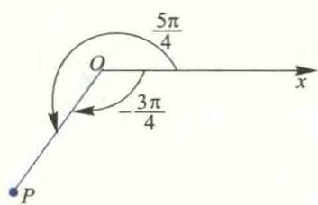  

图1.2

  

图1.3

以极点 O 为原点, 极轴 Ox 为 x 轴正向, 建立平面直角坐标系 xOy, 则平面上的点 P 同时具有直角坐标 $(x, y)$ 和极坐标 $(\rho, \varphi)$ , 且它们具有如下关系(图 1.4):

$$

\left\{ \begin{array}{l l} {x = \rho \cos   \varphi  ,} \\ {y = \rho \sin   \varphi  ,} \end{array} \right. \quad \text {或} \quad \left\{ \begin{array}{l l} {\rho = \sqrt {x ^ {2} + y ^ {2}}  ,} \\ {\tan   \varphi = \frac {y}{x}.} \end{array} \right.

$$

  

图1.4  

该式称为直角坐标与极坐标的转换公式. 在以后应用中, 我们可以根据需要, 把在直角坐标系下给出的函数关系或方程转换为极坐标形式, 也可把极坐标系下给出的函数关系或方程转化为直角坐标形式.  

例 1.3 将方程 $(x^{2}+y^{2})^{2}=2a^{2}(x^{2}-y^{2})$ 转换为极坐标方程,并作出它的草图.  

解 将直角坐标与极坐标的转换公式代入方程, 得

$$

\rho^ {4} = 2 a ^ {2} \rho^ {2} (\cos^ {2} \varphi - \sin^ {2} \varphi),

$$

即

$$

\rho^ {2} = 2 a ^ {2} \cos 2 \varphi .

$$

在上面的方程中,由于 $\cos 2\varphi$ 关于 $\varphi$ 是偶函数,故此方程的图像关于极轴对称;又由于将 $\varphi$ 换成 $\varphi + \pi$ 后方程不改变,所以图像也关于极点对称.因此,我们只需要使用类似于直角坐标系中的描点法画出该方程在 xOy 平面第一象限 $\left\{(\rho, \varphi) \mid \rho \geqslant 0, 0 \leqslant \varphi \leqslant \frac{\pi}{2}\right\}$ 中的图像,由对称性便可得到整个图像.由该方程容易算得下列数据:

&lt;table>&lt;tr>&lt;td>φ&lt;/td>&lt;td>0&lt;/td>&lt;td> $\frac{\pi}{6}$ &lt;/td>&lt;td> $\frac{\pi}{4}$ &lt;/td>&lt;td> $\left( {\frac{\pi}{4},\frac{\pi}{2}}\right)$ &lt;/td>&lt;/tr>&lt;tr>&lt;td>ρ&lt;/td>&lt;td> $\sqrt{2}a$ &lt;/td>&lt;td>a&lt;/td>&lt;td>0&lt;/td>&lt;td>无实根&lt;/td>&lt;/tr>&lt;/table>

对于表中 $(\rho,\varphi)$ 的每组数据,在平面上确定对应的点,用曲线连接,不难画出第一象限中的图像,再由对称性便得到方程的图像如图1.5所示.此曲线称为双纽线.

例1.4 将由极坐标给出的函数关系

$$

\rho = 2 a \cos \varphi , - \frac {\pi}{2} \leqslant \varphi \leqslant \frac {\pi}{2}

$$

  

图1.5

转换成直角坐标,并作图.

解 由转换公式可见

$$

\rho = \sqrt {x ^ {2} + y ^ {2}}, \quad \cos \varphi = \frac {x}{\rho} = \frac {x}{\sqrt {x ^ {2} + y ^ {2}}},

$$

代入所给的函数,得

$$

\sqrt {x ^ {2} + y ^ {2}} = 2 a \frac {x}{\sqrt {x ^ {2} + y ^ {2}}},

$$

即

$$

x ^ {2} + y ^ {2} - 2 a x = 0.

$$

或

$$

(x - a) ^ {2} + y ^ {2} = a ^ {2}.

$$

这是以 $(a,0)$ 为圆心，半径为a的圆周(图1.6).此图像也可直接从它的极坐标方程用描点法直接画出.读者不妨一试.

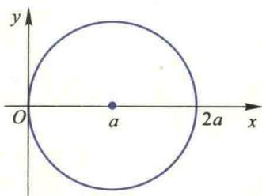  

图1.6

## 附录 2 常见曲线及其方程

(1) 幂函数 $y=x^{\alpha}$ ( $\alpha$ 是常数, $\alpha\geqslant0,-\infty<x<+\infty$ ; $\alpha<0,-\infty<x<+\infty$ 且 $x\neq0$ )

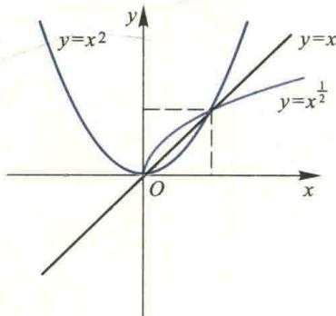

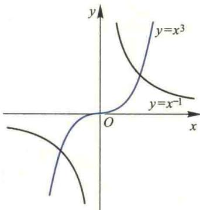

(2) 指数函数 $y=a^{x}$ ( $a>0, a\neq1$ ) ( $-\infty<x<+\infty$ )

(3) 对数函数 $y=\log_{a}x\quad(a>0,a\neq1)(x>0)$

(4) 正弦函数 $y=\sin x$ ( $-\infty<x<+\infty$ )

(5) 余弦函数 $y=\cos x$ ( $-\infty<x<+\infty$ )

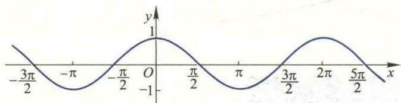

(6) 正切函数 $y=\tan x\left(x\neq k\pi+\frac{\pi}{2},k\in\mathbf{Z}\right)$

(7) 余切函数 $y=\cot x$ ( $x\neq k\pi, k\in Z$ )

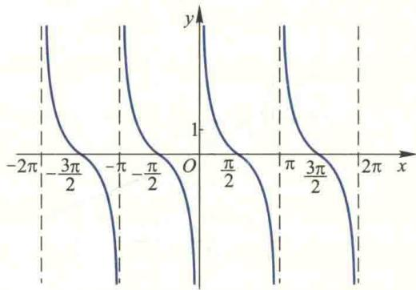

(8) 正割函数 $y=\sec x=\frac{1}{\cos x}\quad\left(x\neq k\pi+\frac{\pi}{2},k\in\mathbf{Z}\right)$

(9) 余割函数 $y = \csc x = \frac{1}{\sin x} (x \neq k\pi, k \in \mathbf{Z})$

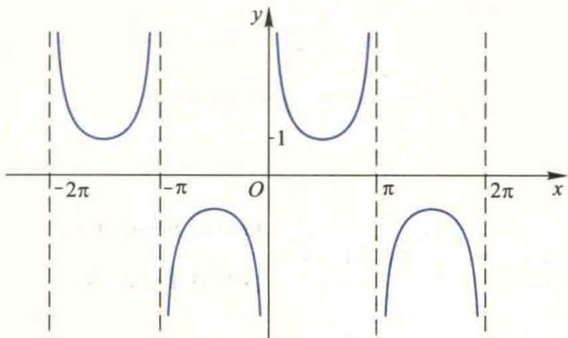

(10) 半立方抛物线 $y^{2}=ax^{3}$

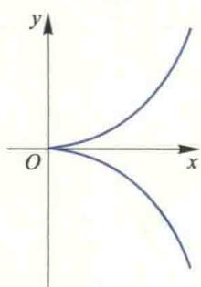

(11) 箕舌线 $y=\frac{8a^{3}}{x^{2}+4a^{2}}$

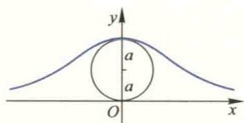

(12) 概率曲线 $y=e^{-x^{2}}$

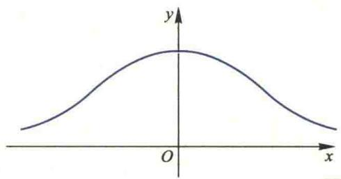

(13) 悬链线 $y=\frac{a}{2}\left(\mathrm{e}^{\frac{x}{a}}+\mathrm{e}^{-\frac{x}{a}}\right)=a\mathrm{ch}\frac{x}{a}$

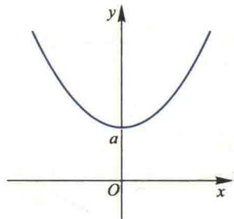

(14) 摆线 $x=a\arccos\frac{a-y}{a}\pm\sqrt{2ay-y^{2}}$ , $\left\{\begin{aligned}x &= a(\theta - \sin\theta), \\ y &= a(1 - \cos\theta)\end{aligned}\right.$

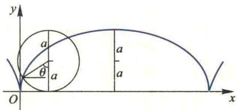

(15) 蔓叶线 $y^{2}(2a-x)=x^{3}$

(16) 星形线 $x^{\frac{2}{3}} + y^{\frac{2}{3}} = a^{\frac{2}{3}}, \left\{\begin{aligned} x &= a \cos^{3} \theta, \\ y &= a \sin^{3} \theta \end{aligned}\right.$

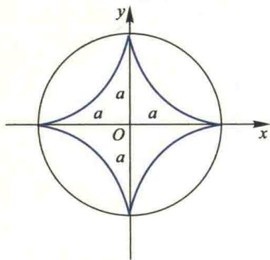

(17) 心形线 $x^{2}+y^{2}+ax=a\sqrt{x^{2}+y^{2}},\rho=a(1-\cos\theta)$

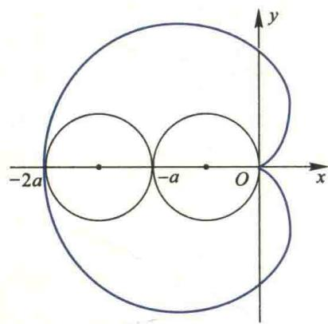

(18) 笛卡儿叶形线 $x^{3}+y^{3}-3axy=0$

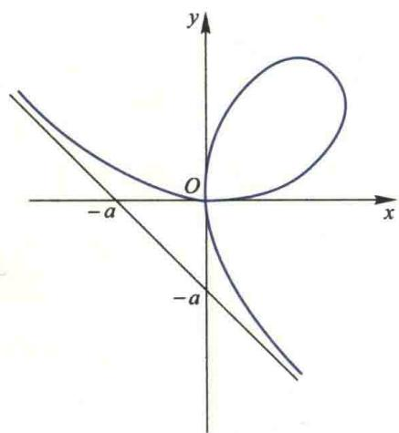

(19) 抛物线 $x^{\frac{1}{2}} + y^{\frac{1}{2}} = a^{\frac{1}{2}}$

(20) 阿基米德螺线 $\rho=a\theta$

(21) 对数螺线 $\rho=e^{a\theta}$

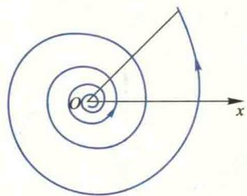

(22) 双曲螺线 $\rho\theta=a$

(23) 双纽线 $(x^{2}+y^{2})^{2}=a^{2}(x^{2}-y^{2}),\rho^{2}=a^{2}\cos2\theta$

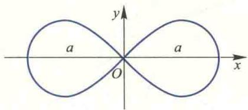

(24) 双纽线 $(x^{2}+y^{2})^{2}=2a^{2}xy,\rho^{2}=a^{2}\sin2\theta$

(25) 三叶玫瑰线 $\rho = a \cos 3\theta$

(26) 三叶玫瑰线 $\rho=a\sin3\theta$

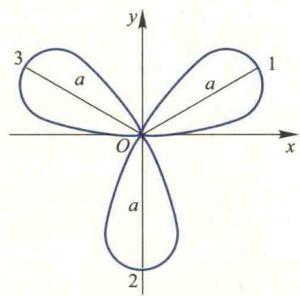

(27) 四叶玫瑰线 $\rho = a \cos 2\theta$

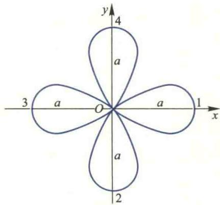

(28) 四叶玫瑰线 $\rho=a\sin2\theta$

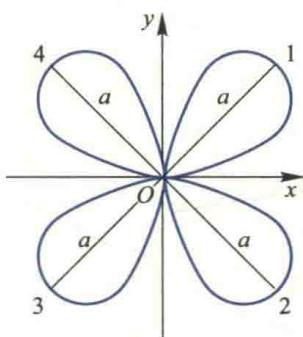

## 附录 3 常用的三角函数公式

## 一、三角函数的和差与积的关系式

1. $2\sin \alpha\cos \beta=\sin (\alpha+\beta)+\sin (\alpha-\beta)$ .

2. $2\cos\alpha\sin\beta=\sin(\alpha+\beta)-\sin(\alpha-\beta)$ .

3. $2\cos\alpha\cos\beta=\cos(\alpha+\beta)+\cos(\alpha-\beta)$ .

4. $-2\sin\alpha\sin\beta=\cos(\alpha+\beta)-\cos(\alpha-\beta)$ .

5. $\sin\alpha+\sin\beta=2\sin\frac{\alpha+\beta}{2}\cos\frac{\alpha-\beta}{2}.$

6. $\sin\alpha-\sin\beta=2\cos\frac{\alpha+\beta}{2}\sin\frac{\alpha-\beta}{2}.$

7. $\cos\alpha+\cos\beta=2\cos\frac{\alpha+\beta}{2}\cos\frac{\alpha-\beta}{2}.$

8. $\cos\alpha-\cos\beta=-2\sin\frac{\alpha+\beta}{2}\sin\frac{\alpha-\beta}{2}.$

## 二、倍角公式与半角公式

1. $\sin^{2}\alpha=\frac{1}{2}(1-\cos2\alpha)$ .

2. $\cos^{2}\alpha=\frac{1}{2}(1+\cos2\alpha)$ .

3. $\sin\alpha=\frac{2\tan\frac{\alpha}{2}}{1+\tan^{2}\frac{\alpha}{2}}.$

4. $\cos\alpha=\frac{1-\tan^{2}\frac{\alpha}{2}}{1+\tan^{2}\frac{\alpha}{2}}.$

## 附录 4 反三角函数定义及其图形

反三角函数是一类基本初等函数,是三角函数中的反正弦函数、反余弦函数、反正切函数、反余切函数、反正割函数、反余割函数的统称.

## 一、反三角函数的概念

## 1. 反正弦函数

正弦函数 $y = \sin x$ 在整个定义域区间 $(- \infty, + \infty)$ 上不是单调函数，但是在 $\left[-\frac{\pi}{2}, \frac{\pi}{2}\right]$ 上是严格单调增函数，因此它在此区间上存在反函数，它的反函数称为反正弦函数，记作 $x = \arcsin y$ . 习惯上，用 $x$ 表示自变量， $y$ 表示因变量，所以反正弦函数写为 $y = \arcsin x$ ，其定义域为 $x \in [-1, 1]$ ，值域为 $y \in \left[-\frac{\pi}{2}, \frac{\pi}{2}\right]$ . 反正弦函数的图像和正弦函数在 $\left[-\frac{\pi}{2}, \frac{\pi}{2}\right]$ 上的图像关于直线 $y = x$ 对称，如图4.1.

注意: 反正弦函数只对正弦函数 $y = \sin x$ 的 $x \in \left[-\frac{\pi}{2}, \frac{\pi}{2}\right]$ 区间成立, 这里截取的是正弦函数靠近原点的一个单调区间, 称该区间为正弦函数的主值区间.

## 2. 反余弦函数

余弦函数 $y=\cos x$ 限制在 $x\in[0,\pi]$ 上是严格单调减函数, 因此在此区间上存在反函数,称为反余弦函数,记为 $y=\arccos x$ , 其中定义域为 $x\in[-1,1]$ , 值域为 $y\in[0,\pi]$ .

反余弦函数及余弦函数的图像如图4.2.

  

图4.1

  

图4.2

## 3. 反正切函数

正切函数 $y=\tan x$ 限制在 $x\in\left(-\frac{\pi}{2},\frac{\pi}{2}\right)$ 上是严格单调增函数, 因此在此区间上存在反函数, 称为反正切函数, 记为 $y=\arctan x$ , 其中定义域为 $x\in(-\infty,+\infty)$ , 值域为 $y\in\left(-\frac{\pi}{2},\frac{\pi}{2}\right)$ . 反正切函数的图像如图4.3. 显然, 反正切函数有两条渐近线 $y=-\frac{\pi}{2}$ 和 $y=\frac{\pi}{2}$ .

## 4. 反余切函数

余切函数 $y=\cot x$ 限制在 $x\in(0,\pi)$ 上是严格单调减函数，因此在此区间上存在反函数，称为反余切函数，记为 $y=\operatorname{arccot}x$ ，其定义域为 $x\in(-\infty,+\infty)$ ，值域为 $y\in(0,\pi)$ 。反余切函数的图像如图4.4。反余切函数有两条渐近线 y=0 和 $y=\pi$ 。

  

图 4.3

  

图4.4

## 5. 反正割函数

正割函数 $y = \sec x$ 限制在 $x\in \left[0,\frac{\pi}{2}\right)\cup \left(\frac{\pi}{2},\pi \right]$ 上的反函数称为反正割函数，记为 $y = \operatorname{arcsec} x$ ，其定义域为 $x \in (-\infty, -1] \cup [1, +\infty)$ ，值域为 $y \in \left[0, \frac{\pi}{2}\right) \cup \left(\frac{\pi}{2}, \pi\right]$ . 反正割函数的图像如图4.5中的黑色曲线.

## 6. 反余割函数

余割函数 $y = \csc x$ 限制在 $x \in \left[-\frac{\pi}{2}, 0\right) \cup \left(0, \frac{\pi}{2}\right]$ 上的反函数称为反余割函数，记为 $y = \operatorname{arccsc} x$ ，其定义域为 $x \in (-\infty, -1] \cup [1, +\infty)$ ，值域为 $y \in \left[-\frac{\pi}{2}, 0\right) \cup \left(0, \frac{\pi}{2}\right]$ . 反余割函数的图像如图4.5中的蓝色曲线.

  

图4.5

## 二、反三角函数间的运算关系

## 1. 余角关系

(1) $\arccos x = \frac{\pi}{2} - \arcsin x$ ;

(2) $\operatorname{arccot} x = \frac{\pi}{2} - \arctan x$ ;

(3) $\operatorname{arccsc} x = \frac{\pi}{2} - \operatorname{arcsec} x$ .

## 2. 负数关系

(1) $\arcsin(-x)=-\arcsin x;$

(2) $\arccos (-x) = \pi -\arccos x;$

(3) $\arctan(-x)=-\arctan x;$

(4) $\operatorname{arccot}(-x)=\pi-\operatorname{arccot}x;$

(5) $\operatorname{arcsec}(-x) = \pi - \operatorname{arcsec} x$ ;

(6) $\operatorname{arccsc}(-x) = -\operatorname{arccsc} x$ .

## 3. 倒数关系

(1) $\arccos \frac{1}{x} = \operatorname{arcsec} x$ ;

(2) $\arcsin \frac{1}{x} = \operatorname{arccsc} x$ ;

(3) $\arctan\frac{1}{x}=\frac{\pi}{2}-\arctan x=\operatorname{arccot}x,\quad x>0;$

(4) $\arctan\frac{1}{x}=-\frac{\pi}{2}-\arctan x=-\pi+\operatorname{arccot}x,\quad x<0;$

(5) $\operatorname{arccot} \frac{1}{x} = \frac{\pi}{2} - \operatorname{arccot} x = \arctan x, \quad x > 0$ ;

(6) $\operatorname{arccot} \frac{1}{x} = \frac{3\pi}{2} - \operatorname{arccot} x = \pi + \arctan x, \quad x < 0;$

(7) arcsec $\frac{1}{x}$ =arccos x;

(8) $\operatorname{arccsc} \frac{1}{x} = \arcsin x$ .

## 4. 转化关系

(1) $\arccos x = \arcsin \sqrt{1 - x^2}, 0 \leqslant x \leqslant 1$ ;

(2) $\arctan x = \arcsin \frac{x}{\sqrt{1 + x^2}};$

(3) $\arcsin x = 2\arctan \frac{x}{1 + \sqrt{1 - x^2}};$

(4) $\arccos x = 2\arctan \frac{\sqrt{1 - x^2}}{1 + x}, -1 < x \leqslant 1;$

(5) $\arctan x = 2\arctan \frac{x}{1 + \sqrt{1 + x^2}}.$

## 附录5 复数及其运算

## 一、复数的概念

我们知道在实数范围内,方程

$$

x ^ {2} = - 1

$$

是无解的,因为没有一个实数的平方等于-1. 由于解方程的需要,人们引进一个新数i,称为虚数单位,并规定

$$

\mathrm{i} ^ {2} = - 1,

$$

从而 i 是方程 $x^{2}=-1$ 的一个根.

对于任意两个实数 $x, y$ ，我们称 $z = x + yi$ 为复数，其中 $x, y$ 分别称为 $z$ 的实部和虚部，记作

$$

x = \operatorname{Re} (z), \quad y = \operatorname{Im} (z).

$$

当 $x = 0, y \neq 0$ 时， $z = \mathrm{i}y$ 称为纯虚数；当 $y = 0$ 时， $z = x + 0\mathrm{i}$ ，我们把它看作是实数 $x$ .

两个复数相等,必须且只需它们的实部和虚部分别相等.一个复数z等于0,必须且只需它的实部和虚部同时等于0.

## 二、复数的代数运算

两个复数 $z_{1} = x_{1} + \mathrm{i}y_{1}, z_{2} = x_{2} + \mathrm{i}y_{2}$ 的加法、减法及乘法定义如下：

$$

\left(x _ {1} + \mathrm{i} y _ {1}\right) \pm \left(x _ {2} + \mathrm{i} y _ {2}\right) = \left(x _ {1} \pm x _ {2}\right) + \mathrm{i} \left(y _ {1} \pm y _ {2}\right),

$$

$$

\left(x _ {1} + \mathrm{i} y _ {1}\right) \left(x _ {2} + \mathrm{i} y _ {2}\right) = \left(x _ {1} x _ {2} - y _ {1} y _ {2}\right) + \mathrm{i} \left(x _ {2} y _ {1} + x _ {1} y _ {2}\right),

$$

并分别称以上两式右端的复数为 $z_{1}$ 与 $z_{2}$ 的和、差与积.

我们又称满足

$$

z _ {2} z = z _ {1} \quad (z _ {2} \neq 0)

$$

的复数 $z = x + \mathrm{i}y$ 为 $z_{1}$ 除以 $z_{2}$ 的商，记作 $z = \frac{z_1}{z_2}$ ，从这个定义立即可推得

$$

z = \frac {z _ {1}}{z _ {2}} = \frac {x _ {1} x _ {2} + y _ {1} y _ {2}}{x _ {2} ^ {2} + y _ {2} ^ {2}} + \mathrm{i} \frac {x _ {2} y _ {1} - x _ {1} y _ {2}}{x _ {2} ^ {2} + y _ {2} ^ {2}}.

$$

不难证明,与实数的情形一样,复数的运算也满足交换律、结合律和分配律

$$

z _ {1} + z _ {2} = z _ {2} + z _ {1}, \quad z _ {1} z _ {2} = z _ {2} z _ {1},

$$

$$

\begin{array}{r l} z _ {1} + (z _ {2} + z _ {3}) & = (z _ {1} + z _ {2}) + z _ {3}, \quad z _ {1} (z _ {2} z _ {3}) = (z _ {1} z _ {2}) z _ {3}, \\ & \quad - z _ {1} (z _ {2} + z _ {3}) = z _ {1} z _ {2} + z _ {1} z _ {3}. \end{array}

$$

我们把实部相同而虚部绝对值相等符号相反的两个复数称为共轭复数，与 $z$ 共轭的复数记为 $\bar{z}$ 。如果 $z = x + \mathrm{i}y$ ，那么 $\bar{z} = x - \mathrm{i}y$ 。共轭复数有如下性质：

1. $\overline{z_1 \pm z_2} = \overline{z_1} \pm \overline{z_2}$ , $\overline{z_1 z_2} = \overline{z_1} \overline{z_2}$ , $\left(\frac{z_1}{z_2}\right) = \frac{\overline{z_1}}{\overline{z_2}}$ .

2. $z \bar{z} = [\operatorname{Re}(z)]^{2} + [\operatorname{Im}(z)]^{2}$ .

3. $z+\bar{z}=2\mathrm{Re}(z)$ , $z-\bar{z}=2\mathrm{i}\mathrm{Im}(z)$ .

## 三、复数的三种表示式及 Euler 公式

1. 代数表示式

$$

z = x + \mathrm{i} y.

$$

2. 三角表示式

$$

z = r (\cos \theta + \mathrm{i} \sin \theta).

$$

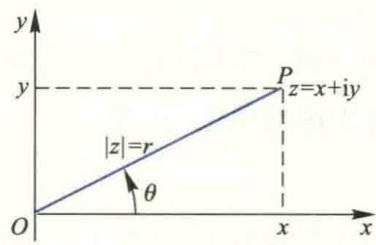  

图5.1

3. 指数表示式

$$

z = r \mathrm{e} ^ {\mathrm{i} \theta}.

$$

4. Euler 公式

$$

\mathrm{e} ^ {\mathrm{i} \theta} = \cos \theta + \mathrm{i} \sin \theta ,

$$

由此可得

$$

\cos \theta = \frac {1}{2} (\mathrm{e} ^ {\mathrm{i} \theta} + \mathrm{e} ^ {- \mathrm{i} \theta}), \quad \sin \theta = \frac {1}{2 \mathrm{i}} (\mathrm{e} ^ {\mathrm{i} \theta} - \mathrm{e} ^ {- \mathrm{i} \theta}).

$$

## 附录6 简明积分表

## 一、含有 $a + bx$ 的积分

$$

1. \int (a + b x) ^ {n} \mathrm{d} x = \left\{ \begin{array}{l l} \frac {(a + b x) ^ {n + 1}}{b (n + 1)} + C, & \text {当} n \neq - 1, \\ \frac {1}{b} \ln | a + b x | + C, & \text {当} n = - 1. \end{array} \right.

$$

2. $\int \frac{x\mathrm{d}x}{a + bx} = \frac{x}{b} -\frac{a}{b^2}\ln |a + bx| + C.$

3. $\int \frac{x^2\mathrm{d}x}{a + bx} = \frac{1}{b^3}\left[\frac{1}{2} (a + bx)^2 - 2a(a + bx) + a^2\ln |a + bx|\right] + C.$

$$

\int \frac {x \mathrm{d} x}{(a + b x) ^ {2}} = \frac {1}{b ^ {2}} \left(\frac {a}{a + b x} + \ln | a + b x |\right) + C.

$$

$$

\int \frac {x ^ {2} \mathrm{d} x}{(a + b x) ^ {2}} = \frac {x}{b ^ {2}} - \frac {a ^ {2}}{b ^ {3} (a + b x)} - \frac {2 a}{b ^ {3}} \ln | a + b x | + C.

$$

6. $\int \frac{\mathrm{d}x}{x(a + bx)} = \frac{1}{a}\ln \left|\frac{x}{a + bx}\right| + C.$

7. $\int \frac{\mathrm{d}x}{x^2(a + bx)} = -\frac{1}{ax} +\frac{b}{a^2}\ln \left|\frac{a + bx}{x}\right| + C.$

$$

\int \frac {\mathrm{d} x}{x (a + b x) ^ {2}} = \frac {1}{a (a + b x)} - \frac {1}{a ^ {2}} \ln \left| \frac {a + b x}{x} \right| + C.

$$

## 二、含有 $\sqrt{a + bx}$ 的积分

9. $\int x\sqrt{a + bx}\mathrm{d}x = \frac{2(3bx - 2a)(a + bx)^{3 / 2}}{15b^2} +C.$

10. $\int x^{2}\sqrt{a + bx}\mathrm{d}x = \frac{2(15b^{2}x^{2} - 12abx + 8a^{2})(a + bx)^{3 / 2}}{105b^{3}} +C.$

11. $\int \frac{x\mathrm{d}x}{\sqrt{a + bx}} = \frac{2(bx - 2a)\sqrt{a + bx}}{3b^2} + C.$

12. $\int \frac{x^2\mathrm{d}x}{\sqrt{a + bx}} = \frac{2(3b^2x^2 - 4abx + 8a^2)\sqrt{a + bx}}{15b^3} + C.$

13. $\int \frac{\mathrm{d}x}{x\sqrt{a + bx}} = \left\{ \begin{array}{ll} \frac{1}{\sqrt{a}}\ln \frac{|\sqrt{a + bx} - \sqrt{a}|}{\sqrt{a + bx} + \sqrt{a}} + C, & \text{当} a > 0,\\  \frac{2}{\sqrt{-a}}\arctan \sqrt{\frac{a + bx}{-a}} +C, & \text{当} a <   0. \end{array} \right.$

$$

\int \frac {\mathrm{d} x}{x ^ {2} \sqrt {a + b x}} = - \frac {\sqrt {a + b x}}{a x} - \frac {b}{2 a} \int \frac {\mathrm{d} x}{x \sqrt {a + b x}}.

$$

$$

\int \frac {\sqrt {a + b x}}{x} \mathrm{d} x = 2 \sqrt {a + b x} + a \int \frac {\mathrm{d} x}{x \sqrt {a + b x}}.

$$

16. $\int \frac{\sqrt{a + bx}}{x^2}\mathrm{d}x = -\frac{\sqrt{a + bx}}{x} +\frac{b}{2}\int \frac{\mathrm{d}x}{x\sqrt{a + bx}}.$

## 三、含有 $a^2 \pm x^2$ 的积分

17. $\int \frac{\mathrm{d}x}{(a^2 + x^2)^n} = \begin{cases} \frac{1}{a}\arctan \frac{x}{a} + C, & \text{当 } n = 1, \\ \frac{x}{2(n - 1)a^2(a^2 + x^2)^{n - 1}} + \frac{2n - 3}{2(n - 1)a^2}\int \frac{\mathrm{d}x}{(a^2 + x^2)^{n - 1}}, & \text{当 } n > 1. \end{cases}$

18. $\int \frac{x\mathrm{d}x}{(a^2 + x^2)^n} = \begin{cases} \frac{1}{2}\ln (a^2 + x^2) + C, & \text{当 } n = 1, \\ -\frac{1}{2(n - 1)(a^2 + x^2)^{n - 1}} + C, & \text{当 } n > 1. \end{cases}$

19. $\int \frac{\mathrm{d}x}{a^2 - x^2} = \frac{1}{2a}\ln \left|\frac{a + x}{a - x}\right| + C.$

## 四、含有 $\sqrt{a^2 - x^2}$ 的积分

20. $\int \sqrt{a^2 - x^2} \, \mathrm{d}x = \frac{x}{2}\sqrt{a^2 - x^2} + \frac{a^2}{2}\arcsin \frac{x}{a} + C.$

21. $\int x\sqrt{a^2 - x^2}\mathrm{d}x = -\frac{1}{3} (a^2 -x^2)^{3 / 2} + C.$

22. $\int x^{2}\sqrt{a^{2} - x^{2}}\mathrm{d}x = \frac{x}{8} (2x^{2} - a^{2})\sqrt{a^{2} - x^{2}} +\frac{a^{4}}{8}\arcsin \frac{x}{a} +C.$

23. $\int \frac{\mathrm{d}x}{\sqrt{a^2 - x^2}} = \arcsin \frac{x}{a} + C.$

24. $\int \frac{x\mathrm{d}x}{\sqrt{a^2 - x^2}} = -\sqrt{a^2 - x^2} + C.$

25. $\int \frac{x^2\mathrm{d}x}{\sqrt{a^2 - x^2}} = -\frac{x}{2}\sqrt{a^2 - x^2} +\frac{a^2}{2}\arcsin \frac{x}{a} +C.$

$$

\int \left(a ^ {2} - x ^ {2}\right) ^ {3 / 2} \mathrm{d} x = \frac {x}{8} \left(5 a ^ {2} - 2 x ^ {2}\right) \sqrt {a ^ {2} - x ^ {2}} + \frac {3 a ^ {4}}{8} \arcsin \frac {x}{a} + C.

$$

27. $\int \frac{\mathrm{d}x}{(a^2 - x^2)^{3 / 2}} = \frac{x}{a^2\sqrt{a^2 - x^2}} + C.$

28. $\int \frac{x\mathrm{d}x}{(a^2 - x^2)^{3 / 2}} = \frac{1}{\sqrt{a^2 - x^2}} + C.$

29. $\int \frac{x^2\mathrm{d}x}{(a^2 - x^2)^{3 / 2}} = \frac{x}{\sqrt{a^2 - x^2}} -\arcsin \frac{x}{a} +C.$

$$

\int \frac {\mathrm{d} x}{x \sqrt {a ^ {2} - x ^ {2}}} = \frac {1}{a} \ln \left| \frac {a - \sqrt {a ^ {2} - x ^ {2}}}{x} \right| + C.

$$

31. $\int \frac{\mathrm{d}x}{x^2\sqrt{a^2 - x^2}} = -\frac{\sqrt{a^2 - x^2}}{a^2x} + C.$

$$

\int \frac {\mathrm{d} x}{x ^ {3} \sqrt {a ^ {2} - x ^ {2}}} = - \frac {\sqrt {a ^ {2} - x ^ {2}}}{2 a ^ {2} x ^ {2}} - \frac {1}{2 a ^ {3}} \ln \left| \frac {a + \sqrt {a ^ {2} - x ^ {2}}}{x} \right| + C.

$$

33. $\int \frac{\sqrt{a^2 - x^2}}{x} \mathrm{d}x = \sqrt{a^2 - x^2} - a\ln \left|\frac{a + \sqrt{a^2 - x^2}}{x}\right| + C.$

34. $\int \frac{\sqrt{a^2 - x^2}}{x^2}\mathrm{d}x = -\frac{\sqrt{a^2 - x^2}}{x} -\arcsin \frac{x}{a} +C.$

## 五、含有 $\sqrt{x^2\pm a^2}$ 的积分

35. $\int \sqrt{x^2\pm a^2}\mathrm{d}x = \frac{x}{2}\sqrt{x^2\pm a^2}\pm \frac{a^2}{2}\ln |x + \sqrt{x^2\pm a^2}| + C.$

36. $\int x\sqrt{x^2\pm a^2}\mathrm{d}x = \frac{1}{3} (x^2\pm a^2)^{3 / 2} + C.$

37. $\int x^{2}\sqrt{x^{2} \pm a^{2}}\mathrm{d}x = \frac{x}{8}(2x^{2} \pm a^{2})\sqrt{x^{2} \pm a^{2}} - \frac{a^{4}}{8}\ln |x + \sqrt{x^{2} \pm a^{2}}| + C.$

38. $\int \frac{\mathrm{d}x}{\sqrt{x^2\pm a^2}} = \ln |x + \sqrt{x^2\pm a^2}| + C.$

39. $\int \frac{x\mathrm{d}x}{\sqrt{x^2\pm a^2}} = \sqrt{x^2\pm a^2} +C.$

40. $\int \frac{x^2\mathrm{d}x}{\sqrt{x^2\pm a^2}} = \frac{x}{2}\sqrt{x^2\pm a^2}\mp \frac{a^2}{2}\ln |x + \sqrt{x^2\pm a^2}| + C.$

41. $\int (x^{2} \pm a^{2})^{3/2} \mathrm{d}x = \frac{x}{8}(2x^{2} \pm 5a^{2})\sqrt{x^{2} \pm a^{2}} + \frac{3a^{4}}{8}\ln |x + \sqrt{x^{2} \pm a^{2}}| + C.$

42. $\int \frac{\mathrm{d}x}{(x^2\pm a^2)^{3 / 2}} = \pm \frac{x}{a^2\sqrt{x^2\pm a^2}} +C.$

43. $\int \frac{x\mathrm{d}x}{(x^2\pm a^2)^{3 / 2}} = -\frac{1}{\sqrt{x^2\pm a^2}} +C.$

44. $\int \frac{x^2\mathrm{d}x}{(x^2\pm a^2)^{3 / 2}} = -\frac{x}{\sqrt{x^2\pm a^2}} +\ln |x + \sqrt{x^2\pm a^2}| + C.$

45. $\int \frac{\mathrm{d}x}{x^2\sqrt{x^2\pm a^2}} = \mp \frac{\sqrt{x^2\pm a^2}}{a^2x} +C.$

46. $\int \frac{\mathrm{d}x}{x^3\sqrt{x^2 + a^2}} = -\frac{\sqrt{x^2 + a^2}}{2a^2x^2} +\frac{1}{2a^3}\ln \frac{a + \sqrt{x^2 + a^2}}{|x|} +C.$

47. $\int \frac{\mathrm{d}x}{x^3\sqrt{x^2 - a^2}} = \frac{\sqrt{x^2 - a^2}}{2a^2x^2} +\frac{1}{2a^3}\arccos \frac{a}{x} +C.$

48. $\int \frac{\sqrt{x^2 + a^2}}{x}\mathrm{d}x = \sqrt{x^2 + a^2} -a\ln \frac{a + \sqrt{x^2 + a^2}}{|x|} +C.$

49. $\int \frac{\sqrt{x^2 - a^2}}{x} \, \mathrm{d}x = \sqrt{x^2 - a^2} - a\arccos \frac{a}{|x|} + C.$

50. $\int \frac{\sqrt{x^2\pm a^2}}{x^2}\mathrm{d}x = -\frac{\sqrt{x^2\pm a^2}}{x} +\ln |x + \sqrt{x^2\pm a^2}| + C.$

$$

\int \frac {\mathrm{d} x}{x \sqrt {x ^ {2} + a ^ {2}}} = \frac {1}{a} \ln \frac {| x |}{a + \sqrt {x ^ {2} + a ^ {2}}} + C.

$$

$$

\int \frac {\mathrm{d} x}{x \sqrt {x ^ {2} - a ^ {2}}} = \frac {1}{a} \arccos \frac {a}{| x |} + C.

$$

## 六、含有 $a + bx + cx^2$ 的积分

$$

5 3. \int \frac {\mathrm{d} x}{a + b x + c x ^ {2}} = \left\{ \begin{array}{l l} \frac {2}{\sqrt {4 a c - b ^ {2}}} \arctan \frac {2 c x + b}{\sqrt {4 a c - b ^ {2}}} + C, & \text {当} b ^ {2} <   4 a c, \\ \frac {1}{\sqrt {b ^ {2} - 4 a c}} \ln \left| \frac {\sqrt {b ^ {2} - 4 a c} - b - 2 c x}{\sqrt {b ^ {2} - 4 a c} + b + 2 c x} \right| + C, & \text {当} b ^ {2} > 4 a c. \end{array} \right.

$$

## 七、含有 $\sqrt{a + bx + cx^2}$ 的积分

$$

5 4. \int \frac {\mathrm{d} x}{\sqrt {a + b x + c x ^ {2}}} = \left\{ \begin{array}{l l} \frac {1}{\sqrt {c}} \ln | 2 c x + b + 2 \sqrt {c (a + b x + c x ^ {2})} | + C, & \text {当} c > 0, \\ - \frac {1}{\sqrt {- c}} \arcsin \frac {2 c x + b}{\sqrt {b ^ {2} - 4 a c}} + C, & \text {当} c <   0, b ^ {2} > 4 a c. \end{array} \right.

$$

$$

\int \sqrt {a + b x + c x ^ {2}} \mathrm{d} x = \frac {2 c x + b}{4 c} \sqrt {a + b x + c x ^ {2}} + \frac {4 a c - b ^ {2}}{8 a} \int \frac {\mathrm{d} x}{\sqrt {a + b x + c x ^ {2}}}.

$$

$$

\int \frac {x \mathrm{d} x}{\sqrt {a + b x + c x ^ {2}}} = \frac {1}{c} \sqrt {a + b x + c x ^ {2}} - \frac {b}{2 c} \int \frac {\mathrm{d} x}{\sqrt {a + b x + c x ^ {2}}}.

$$

## 八、含有三角函数的积分

$$

\int \sin^ {2} a x \mathrm{d} x = \frac {1}{2 a} (a x - \sin a x \cos a x) + C.

$$

$$

\int \cos^ {2} a x \mathrm{d} x = \frac {1}{2 a} (a x + \sin a x \cos a x) + C.

$$

$$

\int \sin^ {n} x \mathrm{d} x = - \frac {1}{n} \sin^ {n - 1} x \cos x + \frac {n - 1}{n} \int \sin^ {n - 2} x \mathrm{d} x.

$$

$$

\int \cos^ {n} x \mathrm{d} x = \frac {1}{n} \cos^ {n - 1} x \sin x + \frac {n - 1}{n} \int \cos^ {n - 2} x \mathrm{d} x.

$$

61. $\int \tan x\mathrm{d}x = -\ln |\cos x| + C.$

62. $\int \cot x\mathrm{d}x = \ln |\sin x| + C.$

63. $\int \tan^n x\mathrm{d}x = \frac{\tan^{n - 1}x}{n - 1} -\int \tan^{n - 2}x\mathrm{d}x.$

64. $\int \cot^n x\mathrm{d}x = -\frac{\cot^{n - 1}x}{n - 1} -\int \cot^{n - 2}x\mathrm{d}x.$

65. $\int \sec x\mathrm{d}x = \ln |\sec x + \tan x| + C.$

66. $\int \csc x\mathrm{d}x = -\ln |\csc x + \cot x| + C.$

67. $\int \sec^n x\mathrm{d}x = \frac{\tan x\sec^{n - 2}x}{n - 1} +\frac{n - 2}{n - 1}\int \sec^{n - 2}x\mathrm{d}x.$

68. $\int \csc^n x\mathrm{d}x = -\frac{\cot x\csc^{n - 2}x}{n - 1} +\frac{n - 2}{n - 1}\int \csc^{n - 2}x\mathrm{d}x.$

69. $\int \sec x\tan x\mathrm{d}x = \sec x + C.$

70. $\int \csc x\cot x\mathrm{d}x = -\csc x + C.$

71. $\int \sin ax\sin bx\mathrm{d}x = -\frac{\sin(a + b)x}{2(a + b)} +\frac{\sin(a - b)x}{2(a - b)} +C.$

72. $\int \sin ax\cos bx\mathrm{d}x = -\frac{\cos(a + b)x}{2(a + b)} -\frac{\cos(a - b)x}{2(a - b)} +C.$

73. $\int \cos ax\cos bx\mathrm{d}x = \frac{\sin(a + b)x}{2(a + b)} +\frac{\sin(a - b)x}{2(a - b)} +C.$

$$

\begin{array}{r l} \int \sin^ {m} x \cos^ {n} x \mathrm{d} x & = \frac {\sin^ {m + 1} x \cos^ {n - 1} x}{m + n} + \frac {n - 1}{m + n} \int \sin^ {m} x \cos^ {n - 2} x \mathrm{d} x \\ & = - \frac {\sin^ {m - 1} x \cos^ {n + 1} x}{m + n} + \frac {m - 1}{m + n} \int \sin^ {m - 2} x \cos^ {n} x \mathrm{d} x. \end{array}

$$

75. $\int \frac{\mathrm{d}x}{a + b\cos x} = \left\{ \begin{array}{ll}\frac{2}{\sqrt{a^2 - b^2}}\arctan \left(\sqrt{\frac{a - b}{a + b}}\tan \frac{x}{2}\right) + C, & \text{当} a^2 >b^2,\\ \frac{1}{\sqrt{b^2 - a^2}}\ln \left|\frac{b + a\cos x + \sqrt{b^2 - a^2}\sin x}{a + b\cos x}\right| + C, & \text{当} a^2 < b^2. \end{array} \right.$

76. $\int x\mathrm{e}^{x}\mathrm{d}x = \mathrm{e}^{x}(x - 1) + C.$

77. $\int x^{n}\mathrm{e}^{x}\mathrm{d}x = x^{n}\mathrm{e}^{x} - n\int x^{n - 1}\mathrm{e}^{x}\mathrm{d}x.$

78. $\int \ln x\mathrm{d}x = x(\ln x - 1) + C.$

79. $\int x^{n}\ln x\mathrm{d}x = \frac{x^{n + 1}}{(n + 1)^{2}} [(n + 1)\ln x - 1] + C.$

$$

\int x \sin x \mathrm{d} x = \sin x - x \cos x + C.

$$

$$

\int x \cos x \mathrm{d} x = \cos x + x \sin x + C.

$$

$$

\int x ^ {n} \sin x \mathrm{d} x = - x ^ {n} \cos x + n \int x ^ {n - 1} \cos x \mathrm{d} x.

$$

$$

\int x ^ {n} \cos x \mathrm{d} x = x ^ {n} \sin x - n \int x ^ {n - 1} \sin x \mathrm{d} x.

$$

$$

8 4. \int \mathrm{e} ^ {a x} \sin b x \mathrm{d} x = \frac {\mathrm{e} ^ {a x} (a \sin b x - b \cos b x)}{a ^ {2} + b ^ {2}} + C.

$$

$$

8 5. \int \mathrm{e} ^ {a x} \cos b x \mathrm{d} x = \frac {\mathrm{e} ^ {a x} (a \cos b x + b \sin b x)}{a ^ {2} + b ^ {2}} + C.

$$

$$

\int \arcsin x \mathrm{d} x = x \arcsin x + \sqrt {1 - x ^ {2}} + C.

$$

$$

\int \arctan x \mathrm{d} x = x \arctan x - \frac {1}{2} \ln (1 + x ^ {2}) + C.

$$

$$

\int x ^ {n} \arcsin x \mathrm{d} x = \frac {1}{n + 1} \left(x ^ {n + 1} \arcsin x - \int \frac {x ^ {n + 1}}{\sqrt {1 - x ^ {2}}} \mathrm{d} x\right).

$$

89. $\int x^{n}\arctan x\mathrm{d}x = \frac{1}{n + 1}\left(x^{n + 1}\arctan x - \int \frac{x^{n + 1}}{1 + x^{2}}\mathrm{d}x\right).$
</Block>
