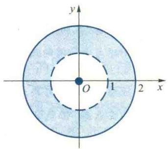
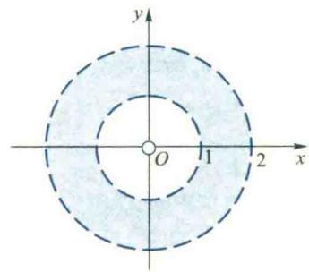
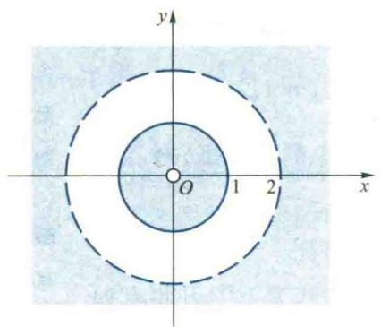
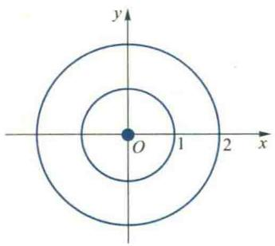
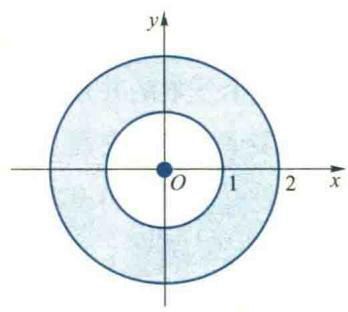
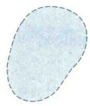

import ExerciseTrigger from '@/components/exercises/ExerciseTrigger.astro';

import Guide from '@/components/Guide.astro';
import Knowledge from '@/components/Knowledge.astro';
import Example from '@/components/Example.astro';
import Analysis from '@/components/Analysis.astro';
import Solution from '@/components/Solution.astro';
import Variant from '@/components/Variant.astro';
import Note from '@/components/Note.astro';
import Block from '@/components/Block.astro';
import Method from '@/components/Method.astro';
import Exercise from '@/components/Exercise.astro';

由于多元函数的定义域是 $n$ 维Euclid空间 $\mathbf{R}^n$ 中的子集，因此，本节先介绍 $\mathbf{R}^n$ 中点集的初步知识.

## 1.1 $n$ 维Euclid空间 $\mathbf{R}^n$

大家知道,若在平面上建立平面直角坐标系 xOy,则平面上的任给一点 P（或实向量）必唯一地确定了一个二元有序实数组；反之,对于给定的二元有序实数组,也唯一地确定一个平面点(或实向量),从而平面上的所有点(或实向量)与所有二元有序实数组建立了一一对应关系,并且两个实向量 $\boldsymbol{x}=(x_{1},x_{2})$ 与 $\boldsymbol{y}=(y_{1},y_{2})$ 的加法可表示为

$$
\boldsymbol {x} + \boldsymbol {y} = \left(x _ {1} + y _ {1}, x _ {2} + y _ {2}\right),
$$

实向量 x 与实数 $\alpha \in R$ 的乘法可表示为

$$
\alpha \boldsymbol {x} = (\alpha x _ {1}, \alpha x _ {2}),
$$

这种实向量也称为平面(或二维)向量. 二维实向量的全体构成的集合记作 $\mathbf{R}^2$ , 按照向量的加法和数乘构成一个二维实向量空间(或二维实线性空间).

类比于二维实向量,我们称一个 n (n>2) 元有序实数组

$$
\boldsymbol {x} = \left(x _ {1}, x _ {2}, \dots , x _ {n}\right) \quad \left(x _ {i} \in \mathbf {R}, i = 1, 2, \dots , n\right)
$$

为一个 n 维实向量, 记 n 维实向量全体所构成的集合为

$$
\mathbf {R} ^ {n} = \left\{\boldsymbol {x} = \left(x _ {1}, x _ {2}, \dots , x _ {n}\right) \mid x _ {i} \in \mathbf {R}, i = 1, 2, \dots , n \right\}.
$$

设有向量 $\boldsymbol{x}=(x_{1},x_{2},\cdots,x_{n})\in\mathbf{R}^{n},\boldsymbol{y}=(y_{1},y_{2},\cdots,y_{n})\in\mathbf{R}^{n}$ ，定义两个向量的加法为

$$
\boldsymbol {x} + \boldsymbol {y} = \left(x _ {1} + y _ {1}, x _ {2} + y _ {2}, \dots , x _ {n} + y _ {n}\right),\tag{1.1}
$$

向量 x 与数 $\alpha \in R$ 的乘法为

$$
\alpha x = \left(\alpha x _ {1}, \alpha x _ {2}, \dots , \alpha x _ {n}\right),\tag{1.2}
$$

并称 $R^{n}$ 按照上述向量加法及数与向量的乘法构成一个 n 维实向量空间（或 n 维实线性空间）.

在 n 维实向量空间 $R^{n}$ 中也可以像二维实向量空间那样, 定义两个向量 x 与 y 的内积为

$$
\langle \boldsymbol {x}, \boldsymbol {y} \rangle = \sum_ {i = 1} ^ {n} x _ {i} y _ {i},\tag{1.3}
$$

则 $R^{n}$ 按照内积(1.3)构成一个 n 维 Euclid 空间.

n 维 Euclid 空间 $R^{n}$ 中的向量也称为点, 向量 x 的第 i 个分量 $x_{i}$ 也称为点 x 的第 i 个坐标. $R^{n}$ 中的点 (向量) 常用小写黑体英文字母 x, y, a, b 等表示, 有时也用大写英文字母 P, Q 等来表示 $R^{n}$ 中的点.

$R^{n}$ 中向量 x 的长度(或范数)定义为

$$
\| \boldsymbol {x} \| = \sqrt {\langle \boldsymbol {x} , \boldsymbol {x} \rangle} = \sqrt {x _ {1} ^ {2} + x _ {2} ^ {2} + \cdots + x _ {n} ^ {2}},\tag{1.4}
$$

两点 $x$ 与 $y$ 之间的距离定义为注:本段利用联想类比的思想方法在高维空间 $R^{n}(n>2)$ 中引入线性运算和距离的概念,从而为研究 $R^{n}$ 中点列的极限和多元函数的极限与连续性奠定基础.类比法是科学技术中的一种创新思维方法,在多元函数微积分的研究中有广泛的应用.

$$
\rho (\boldsymbol {x}, \boldsymbol {y}) = \| \boldsymbol {x} - \boldsymbol {y} \| = \sqrt {\left(x _ {1} - y _ {1}\right) ^ {2} + \left(x _ {2} - y _ {2}\right) ^ {2} + \cdots + \left(x _ {n} - y _ {n}\right) ^ {2}}.\tag{1.5}
$$

## 1.2 $\mathbf{R}^{\prime \prime}$ 中点列的极限

有了 $R^{n}$ 空间中距离的概念, 我们就能仿照数列(即 R 中的点列) 极限的概念和有关性质来讨论 $R^{n}$ 中的点列极限的概念和相应的性质.

<Knowledge title="定义 1.1 点列的极限">
设 $\{x_{k}\}$ 是 $R^{n}$ 中的一个点列, 其中 $x_{k}=(x_{k,1},x_{k,2},\cdots,x_{k,n})$ , 又设 $a=(a_{1},a_{2},\cdots,a_{n})$ 是 $R^{n}$ 中的一固定点, 若当 $k\to\infty$ 时, $\rho(x_{k},a)\to0$ , 即

$$
\forall   \varepsilon > 0, \exists   N \in \mathbf {N} _ {+}, \text {使得}   \forall   k > N, \text {恒有}   \|   \boldsymbol {x} _ {k} - \boldsymbol {a}   \| <   \varepsilon ,\tag{1.6}
$$

则称点列 $\{\pmb{x}_k\}$ 的极限存在，且称 $\pmb{a}$ 为它的极限，记作

$$
\lim _ {k \to \infty} x _ {k} = a \quad {\text {或}} \quad x _ {k} \to a \quad (k \to \infty)  .
$$

这时也称点列 $\{x_{k}\}$ 收敛于a.
</Knowledge>

<Knowledge title="定理 1.1">
设点列 $\{x_{k}\} \subseteq R^{n}$ ，点 $a \in R^{n}$ ，则 $\lim_{k \to \infty} x_{k} = a$ 的充要条件是 $\forall i = 1, 2, \cdots, n$ ，都有 $\lim_{k \to \infty} x_{k,i} = a_{i}$ .

<Solution title="证明">
由于 $\forall i=1,2,\cdots,n$ ，恒有

$$
\mid x _ {k, i} - a _ {i} \mid \leqslant \parallel \boldsymbol {x} _ {k} - \boldsymbol {a} \parallel .
$$
</Solution>
</Knowledge>

根据定义1.1立即可证明必要性.下面证明充分性.
设 $\forall i=1,2,\cdots,n$ ，都有 $\lim_{k\to\infty}x_{k,i}=a_i$ ，则 $\forall\varepsilon>0,\exists N_{i}\in N_{+}$ ，使得 $\forall k>N_{i}$ ，恒有 $\left|x_{k,i}-a_{i}\right|<\frac{\varepsilon}{\sqrt{n}}$ .
令 $N=\max\left\{N_{1},N_{2},\cdots,N_{n}\right\}$ ，则 $\forall k>N$ ，必有

定理1.1表明, $R^{n}$ 中点列 $\left|x_{k}\right|$ 收敛于a等价于该点列的各个坐标(或分量)所构成的数列 $\left|x_{k,i}\right|$ 分别收敛于点a的相应坐标(或分量) $a_{i}$ .从而,它把研究 $R^{n}$ 中点列的收敛问题转化为实数列(即一维空间R中的点列)的收敛问题.这种“化多为一”的思想方法是一种将“未知”化为“已知”的方法,在多元函数微积分中经常使用.读者应认真学习,并用这种方法证明定理1.2中的(3).

$$
\left| x _ {k, i} - a _ {i} \right| <   \frac {\varepsilon}{\sqrt {n}} (i = 1, 2, \dots , n).
$$

从而 $\forall k > N$ ，有

$$
\| \boldsymbol {x} _ {k} - \boldsymbol {a} \| = \sqrt {\sum_ {i = 1} ^ {n} \left(x _ {k , i} - a _ {i}\right) ^ {2}} <   \varepsilon ,
$$

故 $\lim_{k\to\infty}x_{k}=a.$

<Knowledge title="定理 1.2">
设 $\{\pmb{x}_k\}$ 是 $\mathbf{R}^n$ 中的收敛点列，则

(1) $\{x_{k}\}$ 的极限是唯一的；

(2) $\{x_{k}\}$ 是有界点列, 即 $\exists M (\in \mathbf{R}) > 0$ , 使得 $\forall k \in N_{+}$ , 恒有 $\| x_{k} \| \leqslant M$ ;

(3) 若 $x_{k} \rightarrow a, y_{k} \rightarrow b$ ，则 $x_{k} \pm y_{k} \rightarrow a \pm b, \alpha x_{k} \rightarrow \alpha a, \langle x_{k}, y_{k} \rangle \rightarrow \langle a, b \rangle$ ，其中 $\alpha \in R;$

(4) 若 $\{x_{k}\}$ 收敛于 a，则它的任一子（点）列也收敛于 a.
</Knowledge>

由于 $R^{n}$ 中的向量不能比较大小,也不能相除,因此,数列极限中与单调性、保序性、确界以及商有关的概念与命题不能直接地推广到 $R^{n}$ 中的点列. 但是, Bolzano-Weierstrass 定理与 Cauchy 收敛原理在 $R^{n}$ 中仍然成立.

利用第一章定理 2.9 不难证明下面的定理.

写出几个在数列极限中成立但对 $R^{n}$ 中点列不成立的命题.

<Knowledge title="定理 1.3 Bolzano-Weierstrass 定理">
$R^{n}$ 中的有界点列必有收敛子列. ( $R^{n}$ 中点列 $\{x_{k}\}$ 的收敛子列的极限也称为 $\{x_{k}\}$ 的极限点.)
</Knowledge>

设 $\{\pmb{x}_k\}$ 是 $\mathbf{R}^n$ 中的点列，若

$\forall \varepsilon > 0, \exists N \in \mathbf{N}_{+}$ , 使得 $\forall k > N$ 及 $p \in \mathbf{N}_{+}$ , 恒有 $\| x_{k+p} - x_k \| < \varepsilon$ ,

则称 $\{x_{k}\}$ 是 $R^{n}$ 中的基本点列或 Cauchy 点列. 类似于定理 1.1 不难证明: $\{x_{k}\}$ 是 Cauchy 点列的充要条件是 $\forall i=1,2,\cdots,n,\{x_{k,i}\}$ 都是 Cauchy 数列. 根据第一章中所介绍的数列的 Cauchy 收敛原理, 立即可以得到 $R^{n}$ 中点列的 Cauchy 收敛原理如下.

<Knowledge title="定理 1.4 Cauchy 收敛原理">
$R^{n}$ 中点列 $\{x_{k}\}$ 收敛于 $R^{n}$ 中的点的充要条件为 $\{x_{k}\}$ 是 $R^{n}$ 中的 Cauchy 点列.

这个定理刻画了空间 $\mathbf{R}^n$ 的完备性, 就是说, $\mathbf{R}^n$ 中的 Cauchy 点列必收敛于 $\mathbf{R}^n$ 中的点. 现代数学中就是以此作为抽象空间完备性定义的.
</Knowledge>

## 1.3 $\mathbf{R}^n$ 中的开集与闭集

为了讨论多元函数的极限与连续性,本段简要地介绍 $R^{n}$ 中点集的基本知识,包括开集、闭集与区域等.虽然这些概念都是在空间 $R^{n}$ 中定义的,但读者可以在平面 $R^{2}$ 中去理解它们.

<Knowledge title="定义 1.2">
设 A 是 $R^{n}$ 中的一个点集, $a \in R^{n}$ . 若存在 A 中的点列 $\{x_{k}\}, x_{k} \neq a (k = 1, 2, \cdots)$ , 使得 $x_{k} \to a (k \to \infty)$ , 则称 a 是 A 的一个聚点. A 的所有聚点构成的集合称为 A 的导集, 记作 $A'$ . 集合 $\overline{A} = A \cup A'$ 称为 A 的闭包. 若 $a \in A$ , 但 $a \in A'$ , 则称 a 为 A 的孤立点. 若 $A' \subseteq A$ , 则称 A 为闭集.

由定义易见,集 A 的聚点不一定属于 A. 若 A 的所有聚点都属于 A, 则 A 是闭集. 因此, 若 A 是闭集, $\{x_{k}\}$ 是 A 中的任一点列, 且 $x_{k} \rightarrow a (k \rightarrow \infty)$ , 则 $a \in A$ . 反之亦真. 这说明闭集对于极限运算是封闭的.

例如，设 $A = \left\{\left(\frac{1}{k},\frac{1}{k}\right)\mid k\in \mathbf{N}_+\right\}$ 是一平面点集，则点(0,0)是 $A$ 的唯一聚点，它不属于 $A$ ，并且 $A^{\prime} = \{(0,0)\} ,\overline{A} = A\cup \{(0,0)\} ,A$ 中的所有点都是它的孤立点. $A$ 不是闭集，但 $\overline{A} = A\cup \{(0,0)\}$ 是闭集.

由定义 1.2 易知, 若 $A' = \varnothing$ , 则 A 必为闭集. 从而知单点集和有限点集都是闭集.
</Knowledge>

<Knowledge title="定义 1.3">
设 $a \in R^{n}, \delta > 0$ ，称点集
</Knowledge>

$$
U (\boldsymbol {a}, \delta) = \{\boldsymbol {x} \in \mathbf {R} ^ {n} | \| \boldsymbol {x} - \boldsymbol {a} \| <   \delta \}
$$

在平面 $R^{2}$ 上, 画出点 $a \in R^{2}$ 的 $\delta$ 邻域和去心 $\delta$ 邻域.

为以 a 为中心、 $\delta$ 为半径的开球或点 a 的 $\delta$ 邻域，称

$$
\stackrel {\circ} {U} (\boldsymbol {a}, \delta) = U (\boldsymbol {a}, \delta) \setminus \{\boldsymbol {a} \}
$$

为点 a 的去心 $\delta$ 邻域. 它们可分别简记为 $U(a)$ 与 $\mathring{U}(a)$ .

在直线 $\mathbf{R}$ 上，开球 $U(a, \delta)$ 就是开区间 $(a - \delta, a + \delta)$ ；在平面 $\mathbf{R}^2$ 上，开球 $U(a, \delta)$ 就是以 $a = (a_1, a_2)$ 为中心， $\delta$ 为半径的圆周 $(x_1 - a_1)^2 + (x_2 - a_2)^2 = \delta^2$ 内的所有点构成的集合（称为开圆盘）；在空间 $\mathbf{R}^3$ 中， $U(a, \delta)$ 就是以 $a = (a_1, a_2, a_3)$ 为中心， $\delta$ 为半径的球面 $(x_1 - a_1)^2 + (x_2 - a_2)^2 + (x_3 - a_3)^2 = \delta^2$ 内的所有点构成的集合，也就是通常所说的开球。

有了邻域的概念, $R^{n}$ 中点列极限的概念也可以像数列极限那样,用邻域来刻画.设 $\{x_{k}\}$ 是 $R^{n}$ 中的一个点列,若

$$
\forall   \varepsilon > 0,   \exists   N \in \mathbf {N} _ {+},   \text {使得}   \forall   k > N,   \text {恒有}   x _ {k} \in U (a, \varepsilon)  ,
$$

则称点列 $\{x_{k}\}$ 收敛于 a, a 是 $\{x_{k}\}$ 的极限. 从而, 得到下列用邻域来刻画集 A 聚点的定理:

<Knowledge title="定理 1.5">
设 A 是 $R^{n}$ 中的一个点集, $a \in R^{n}$ , 则 $a \in A'$ 的充要条件为 $\forall \varepsilon > 0, \mathring{U}(a, \varepsilon) \cap A \neq \varnothing$ . 也就是说, a 为 A 的聚点当且仅当 a 的任何去心 $\varepsilon$ 邻域中都含有 A 中的点.

<Solution title="证明">
必要性 设 $a \in A'$ ，根据定义 1.2，存在 A 中的点列 $\{x_{k}\}, x_{k} \neq a (k = 1, 2, \cdots)$ ，使得 $\lim_{k \to \infty} x_{k} = a$ 。用邻域来表示，即 $\forall \varepsilon > 0, \exists N \in N_{+}$ ，使得 $\forall k > N$ ，恒有 $x_{k} \in \mathring{U}(a, \varepsilon)$ 。由于 $\{x_{k}\} \subseteq A$ ，从而得知， $\forall \varepsilon > 0, \mathring{U}(a, \varepsilon) \cap A \neq \varnothing$ ，即 a 的任何去心 $\varepsilon$ 邻域中都有 A 中的点。

充分性 若 $\forall\varepsilon>0,\mathring{U}(\boldsymbol{a},\varepsilon)\cap A\neq\varnothing$ ，则 $\forall k\in N_{+}$ ，取 $\varepsilon_{k}=\frac{1}{k}$ ，必存在点 $\boldsymbol{x}_{k}\in\mathring{U}(\boldsymbol{a},\varepsilon_{k})\cap A.$ 这就是说，存在 A 中的点列 $\{\boldsymbol{x}_{k}\},\boldsymbol{x}_{k}\neq\boldsymbol{a}(k=1,2,\cdots)$ ，并且 $\|x_{k}-a\|<\varepsilon_{k}=\frac{1}{k}$ ，从而 $\lim_{k\to\infty}x_{k}=a$ ，故 $a\in A'$ .
</Solution>
</Knowledge>

<Knowledge title="定义 1.4">
设 $A \subseteq R^{n}, a \in R^{n}$ .

（1）若存在 $\delta>0$ ，使 $U(a,\delta)\subseteq A$ ，则称 a 是集 A 的内点，由 A 的所有内点构成的集称为 A 的内部，记作 $A^{\circ}$ 或 int A；

(2) 若存在 $\delta > 0$ ，使 $U(\boldsymbol{a}, \delta) \cap A = \varnothing$ ，则称 a 是集 A 的外点，A 的所有外点构成的集称为 A 的外部，记作 ext A；想一想：
一个集合 A 的边界点与聚点有什么不同？

（3）若对任何 $\delta>0, U(a,\delta)$ 中既含有 A 中的点，也含有 A 的余集 $A^{c}$ 中的点，则称 a 为集 A 的边界点，A 的所有边界点构成的集称为 A 的边界，记作 $\partial A$ .
</Knowledge>

由定义 1.4 易见, $R^{n}$ 中的任一点是且仅是 A 的内点、外点与边界点中的一种, 即

$$
\mathbf {R} ^ {n} = A ^ {\circ} \cup \partial A \cup \operatorname{ext} A,
$$

且右端三个点集互不相交(图 5.1).

<Example title="例 1.1">
设 $A = \{(x, y) \in \mathbf{R}^2 \mid (x - x_0)^2 + (y - y_0)^2 < \delta^2\}$ ，证明：

$$
A ^ {\circ} = A, \partial A = \{(x, y) \in \mathbf {R} ^ {2} | (x - x _ {0}) ^ {2} + (y - y _ {0}) ^ {2} = \delta^ {2} \},
$$

$$
\overline {{{A}}} = A \cup \partial A = \{(x, y) \in \mathbf {R} ^ {2} | (x - x _ {0}) ^ {2} + (y - y _ {0}) ^ {2} \leqslant \delta^ {2} \}.
$$

<Solution title="证明">
题中关于边界 $\partial A$ 和闭包的结论是显然的, 下面证明 $A^{\circ} = A$ . 由定义知 $A^{\circ} \subseteq A$ , 因此只要证明 $A \subseteq A^{\circ}$ . 设 $(\widetilde{x}, \widetilde{y}) \in A$ , 取 $\varepsilon < \delta - \sqrt{(\widetilde{x} - x_0)^2 + (\widetilde{y} - y_0)^2}$ , 则点 $(\widetilde{x}, \widetilde{y})$ 的 $\varepsilon$ 邻域 $U((\widetilde{x}, \widetilde{y}), \varepsilon) \subseteq A$ , 因而 $(\widetilde{x}, \widetilde{y})$ 是 $A$ 的内点 (图5.2), 故 $A \subseteq A^{\circ}$ .

<figure class="vp-figure">
  
  <figcaption>图5.1</figcaption>
</figure>

<figure class="vp-figure">
  
  <figcaption>图5.2</figcaption>
</figure>

由定义易见,对于 $R^{n}$ 中的任一点集 A, 必有

$$
\bar {A} = A \cup \partial A.
$$

特别地,称开球与它的边界之并为闭球,记作

$$
\overline {{{U}}} (\boldsymbol {a}, \delta) = \{\boldsymbol {x} \in \mathbf {R} ^ {n} | \| \boldsymbol {x} - \boldsymbol {a} \| \leqslant \delta \}.
$$
</Solution>
</Example>

<Example title="例 1.2">
设 $A=\{(x,y)\in\mathbf{R}^{2}\mid x^{2}+y^{2}=0,1<x^{2}+y^{2}\leqslant4\}$ （如图 5.3(a) 所示）。由定义 1.4 易知， $A^{\circ}=\{(x,y)\in\mathbf{R}^{2}\mid1<x^{2}+y^{2}<4\}$ ， $\operatorname{ext}A=\{(x,y)\in\mathbf{R}^{2}\mid0<x^{2}+y^{2}<1,x^{2}+y^{2}>4\}$ ， $\partial A=\{(x,y)\in\mathbf{R}^{2}\mid x^{2}+y^{2}=1,x^{2}+y^{2}=4\}\cup\{(0,0)\}$ ，原点 $(0,0)$ 是 A 的孤立点， $\overline{A}=A\cup\partial A=\{(x,y)\in\mathbf{R}^{2}\mid x^{2}+y^{2}=0,1\leqslant x^{2}+y^{2}\leqslant4\}$ （ $A^{\circ}$ 、 $\operatorname{ext}A$ 、 $\partial A$ 及 $\overline{A}$ 分别如图 5.3(b)、
(c)、(d)及(e)所示)。

<figure class="vp-figure">
  

    

      
      (a) A
    

    

      
      (b) $A^{\circ}$
    

    

      
      (c) ext A
    

    

      
      (d) $\partial A$
    

    

      
      (e) $\overline{A}$
    

  

  <figcaption>图 5.3</figcaption>
</figure>
</Example>

<Knowledge title="定义 1.5">
设 $A \subseteq R^{n}$ ，若 $A \subseteq A^{\circ}$ ，即 A 中的点全是 A 的内点，则称 A 为开集。下面的定理刻画了开集与闭集的关系。
</Knowledge>

<Knowledge title="定理 1.6">
$A \subseteq R^{n}$ 是开集的充要条件为 $A^{c}$ 是闭集.

<Solution title="证明">
必要性 设 $A$ 是开集, 故 $A^{\circ} = A$ . 为了证明 $A^{c}$ 是闭集, 只要证明 $(A^{c})' \subseteq A^{c}$ . 若 $(A^{c})' = \emptyset$ , 则显然有 $(A^{c})' \subseteq A^{c}$ . 若 $(A^{c})' \neq \emptyset$ , 设 $x \in (A^{c})'$ , 则 $\forall \varepsilon > 0$ ,

$$
\stackrel {\circ} {U} (x, \varepsilon) \cap A ^ {c} \neq \varnothing .
$$

由内点的定义知 $x \in A^{\circ} = A$ ，即 $x \in A^{c}$ ，故 $(A^{c})' \subseteq A^{c}$ .

充分性 设 $A^c$ 是闭集, 即 $(A^c)' \subseteq A^c$ . 为了证明 $A$ 是开集, 由于 $A^\circ \subseteq A$ , 所以只要证明 $A \subseteq A^{\circ}$ . 设 $x \in A$ , 则 $x \in A^{c}$ . 又因 $A^{c}$ 为闭集, 故有 $(A^{c})' \subseteq A^{c}$ , 所以有 $x \in (A^{c})'$ . 根据定理 1.5, 必 $\exists \delta_{0} > 0$ , 使 $\mathring{U}(x, \delta_{0}) \cap A^{c} = \emptyset$ , 故 $\mathring{U}(x, \delta_{0}) \subseteq A$ , 又由 $x \in A$ , 知 $x \in A^{\circ}$ , 所以 $A \subseteq A^{\circ}$ . 画出 $\mathbf{R}^{3}$ 空间中的开球与开区间、

画出 $R^{3}$ 空间中的开球与开区间、闭球与闭区间的几何图形.
</Solution>
</Knowledge>

<Example title="例 1.3">
$R^{n}$ 中的开球 $U(a,\delta)$ 与开区间

$$
(a, b) = \{x = (x _ {1}, x _ {2}, \dots , x _ {n}) \in
$$

$$
\mathbf {R} ^ {n} \mid a _ {i} <   x _ {i} <   b _ {i}, i = 1, 2, \dots , n \}
$$

都是开集. 闭球 $\overline{U} (a,\delta)$ 与闭区间

$$
[ a, b ] = \{x \in (x _ {1}, x _ {2}, \dots , x _ {n}) \in
$$

$$
\mathbf {R} ^ {n} \mid a _ {i} \leqslant x _ {i} \leqslant b _ {i}, i = 1, 2, \dots , n \}
$$

都是闭集.例1.2中的 $A^{\circ}$ 与 $\operatorname{ext} A$ 都是开集， $\partial A$ 与 $\overline{A}$ 都是闭集.
</Example>

下面的定理刻画了开集的特征.

<Knowledge title="定理 1.7">
在 n 维 Euclid 空间 $R^{n}$ 中, 开集有如下性质:

(1) 空集 $\varnothing$ 与全空间 $R^{n}$ 是开集；

试举出无穷多个开集的交不是开集的例子.
</Knowledge>

开集与闭集是常常碰到的两类点集, 但是还存在着很多其他类型的点集. 例如, 直线 R 上的有理点集与无理点集既不是开集, 又不是闭集, 因为它们都没有内点, 而且任一实数都是它们的聚点. 因此, 不能说一个点集“非开即闭”.

(2) 任意多个开集的并是开集；

(3) 有限多个开集的交是开集.

<Solution title="证明">
根据定义,性质(1)显然成立.

(2) 设 $A_{\alpha} \subseteq \mathbf{R}^{n}$ ( $\alpha \in \Lambda, \Lambda$ 称为指标集) 是一族开集. 任取 $x \in \bigcup_{\alpha \in \Lambda} A_{\alpha}$ , 则必 $\exists \alpha_{0} \in \Lambda$ 使 $x \in A_{\alpha_{0}}$ . 由于 $A_{\alpha_{0}}$ 是开集, 所以 $\exists \delta > 0$ , 使 $U(x, \delta) \subseteq A_{\alpha_{0}} \subseteq \bigcup_{\alpha \in \Lambda} A_{\alpha}$ , 即 $x$ 是 $\bigcup_{\alpha \in \Lambda} A_{\alpha}$ 的内点, 故 $\bigcup_{\alpha \in \Lambda} A_{\alpha}$ 是开集.

(3) 设 $A_{k} \subseteq R^{n}$ ( $k = 1, 2, \cdots, m$ ) 是开集，任取 $x \in \bigcap_{k=1}^{m} A_{k}$ ，则 $x \in A_{k}$ ( $k = 1, 2, \cdots, m$ ). 由于 $A_{k}$ 是开集，所以 $\forall k = 1, 2, \cdots, m, \exists \delta_{k} > 0$ ，使 $U(x, \delta_{k}) \subseteq A_{k}$ . 取 $\delta = \min\{\delta_{1}, \delta_{2}, \cdots, \delta_{m}\}$ ，则

$$
U (\boldsymbol {x}, \delta) \subseteq U (\boldsymbol {x}, \delta_ {k}) \subseteq A _ {k} \quad (k = 1, 2, \dots , m).
$$

因此， $U(x,\delta)\subseteq \bigcap_{k = 1}^{m}A_{k}$ ，即 $\pmb{x}$ 是 $\bigcap_{k = 1}^{m}A_{k}$ 的内点，故 $\bigcap_{k = 1}^{m}A_{k}$ 是开集.

由此定理,读者不难利用对偶原理(第一章第一节法则2)证明 $R^{n}$ 中闭集的三个对应的基本性质:

(1) 空集 $\varnothing$ 和全空间 $R^{n}$ 是闭集；

(2) 任意多个闭集的交是闭集；

(3) 有限多个闭集的并是闭集.
</Solution>

## 1.4 $\mathbf{R}^n$ 中的紧集与区域

设 $A$ 是 $\mathbf{R}^n$ 中的一个点集, 如果存在一个常数 $M > 0$ , 使得 $\forall x \in A$ , 都有 $\| x \| \leqslant M$ , 则称 $A$ 是有界集, 否则称为无界集. 显然, 有界集的几何含义是它能包含在 $\mathbf{R}^n$ 中一个以原点 $\mathbf{0}$ 为中心、 $M$ 为半径的闭球 $\overline{U}(\mathbf{0}, M)$ 中.

<Knowledge title="定义 1.6">
设 A 是 $R^{n}$ 中的一个点集, 若 A 是有界闭集, 则称 A 为紧集.

根据 Bolzano-Weierstrass 定理, 若 A 是 $R^{n}$ 中的紧集, 则 A 中任何点列都有收敛于 A 中点的子列.
</Knowledge>

<Knowledge title="定义 1.7">
设 $A \subseteq R^{n}$ 是一个点集, 如果 A 中的任意两点 x 与 y 都能用完全属于 A 的有限个线段 ① 联结起来, 则称 A 是连通集. 连通的开集称为区域. 区域与它的边界之并称为闭区域 ② .
</Knowledge>
显然, $R^{2}$ 中的开圆盘是区域,闭圆盘是闭区域,图5.4(a)所示的 $R^{2}$ 的点集是区域,图5.4(b)所示点集不是区域,在开圆盘中去掉任意一条直径后所得到的集合也不是区域,因为它们都破坏了集合的连通性。

<figure class="vp-figure">
  

    

      
      (a)
    

    

      
      
      (b)
    

  

  <figcaption>图 5.4</figcaption>
</figure>

设 $A \subseteq \mathbf{R}^n$ ，若联结 $A$ 中任意两点的线段都属于 $A$ ，即若 $\pmb{x}_1, \pmb{x}_2 \in A$ ，则 $\forall t \in [0,1]$ ， $t\pmb{x}_1 + (1 - t)\pmb{x}_2 \in A$ ，则称 $A$ 是 $\mathbf{R}^n$ 中的凸集。由定义 1.7 得知，任何凸集都是连通的，因而任何凸开集都是区域。

$$
\left\{t \boldsymbol {a} + (1 - t) \boldsymbol {b} \mid t \in \mathbf {R}, 0 \leqslant t \leqslant 1 \right\}
$$

<ExerciseTrigger chapter={5} section="5.1" title="5.1 n 维Euclid空间 \mathbf{R}^n 中点集的初步知识 课后真题与自测练习" />
