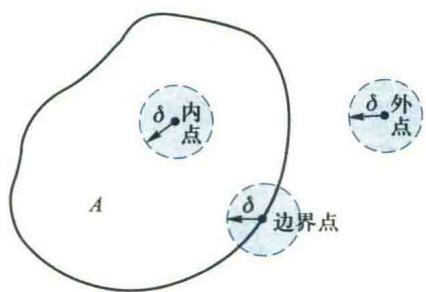
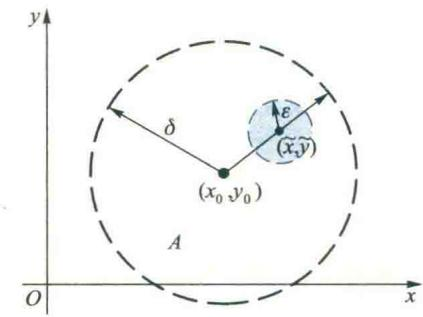
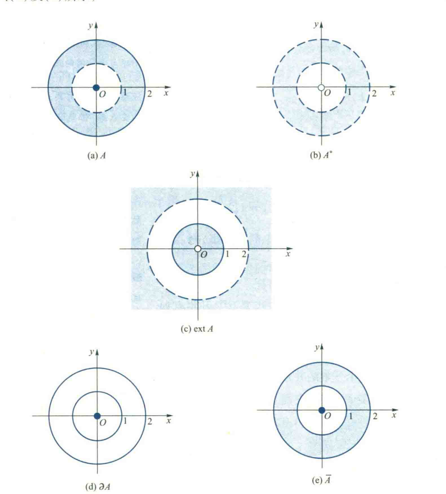
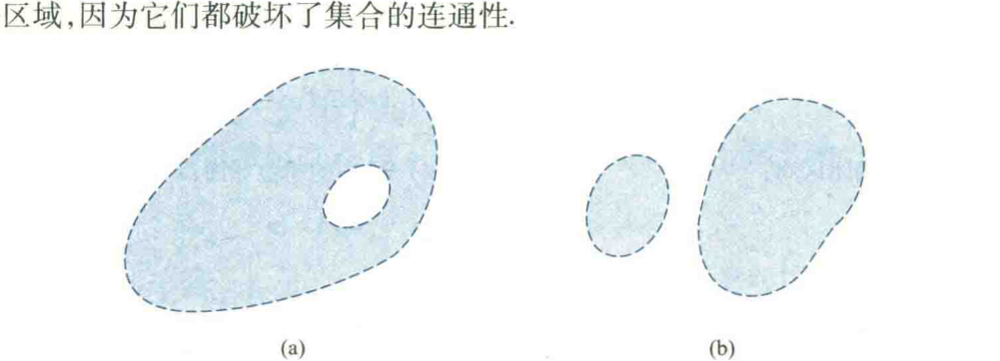

import ExerciseTrigger from '@/components/exercises/ExerciseTrigger.astro';
import QRCodeVideo from '@/components/QRCodeVideo.astro';

import Guide from '@/components/Guide.astro';
import Knowledge from '@/components/Knowledge.astro';
import Example from '@/components/Example.astro';
import Analysis from '@/components/Analysis.astro';
import Solution from '@/components/Solution.astro';
import Variant from '@/components/Variant.astro';
import Note from '@/components/Note.astro';
import SideNote from '@/components/SideNote.astro';
import Block from '@/components/Block.astro';
import Method from '@/components/Method.astro';
import Exercise from '@/components/Exercise.astro';

由于多元函数的定义域是 $n$ 维Euclid空间 $\mathbf{R}^n$ 中的子集，因此，本节先介绍 $\mathbf{R}^n$ 中点集的初步知识。

在上手册中，我们讨论了一元函数微积分，研究的对象是仅依赖于一个自变量的一元函数。然而，在实际问题中常会遇到依赖于两个或两个以上自变量的所谓多元函数，因此，还需要讨论多元函数的微积分。多元函数微积分的基本概念、理论和方法是一元函数微积分中相应概念、理论和方法的推广与发展，它们既有很多相似之处，又有很多本质上的不同。读者在学习多元函数微积分的时候，要善于将它与一元函数微积分进行比较，既要注意它们的共同点和相互联系，更要注意它们之间的区别，研究多元函数所出现的新情况和新问题。这样，才能深刻理解，融会贯通。

本章讨论多元函数微积分。首先简介介绍 $n$ 维 Euclid 空间 $\mathbf{R}^n$ 中点集的初步知识，在此基础上将极限、连续的概念推广到多元函数。然后重点讲解多元函数（包括多元数量值函数与多元向量值函数）的导数、微分与微分法以及它们的应用，包括利用多元函数微分讨论曲线和曲面的一些基本性质。

## 1.1 $n$ 维 Euclid 空间 $\mathbf{R}^n$

大家知道，若在平面上建立平面直角坐标系 $xOy$，则平面上的任给一点 $P$（或实向量）必唯一地确定了一个二元有序实数组；反之，对于给定的二元有序实数组，也唯一地确定一个平面点（或实向量），从而平面上的所有点（或实向量）与所有二元有序实数组建立了——对应关系，并且两个向量 $\boldsymbol{x} = (x_1, x_2)$ 与 $\boldsymbol{y} = (y_1, y_2)$ 的加法可表示为

$$

\boldsymbol{x} + \boldsymbol{y} = (x_1 + y_1, x_2 + y_2),

$$

实向量 $\boldsymbol{x}$ 与实数 $\alpha \in \mathbf{R}$ 的乘法可表示为

$$

\alpha \boldsymbol{x} = (\alpha x_1, \alpha x_2),

$$

这种实向量也称为平面（或二维）的向量。二维实向量的全体构成的集合记作 $\mathbf{R}^2$，按照向量的加法和数乘构成一个二维实向量空间（或二维实线性空间）。

类比于二维向量，我们称一个 $n (n > 2)$ 元有序实数组

$$

\boldsymbol{x} = (x_1, x_2, \dots, x_n) \quad (x_i \in \mathbf{R}, i = 1, 2, \dots, n)

$$

为一个 $n$ 维实向量，记 $n$ 维向量全体所构成的集合为

$$

\mathbf{R}^n = \{ \boldsymbol{x} = (x_1, x_2, \dots, x_n) \mid x_i \in \mathbf{R}, i = 1, 2, \dots, n \}.

$$

<SideNote title="思路分析">

本段利用联想类比的思想方法在高维空间 $\mathbf{R}^n (n>2)$ 中引入线性运算和距离的概念，从而为研究 $\mathbf{R}^n$ 中点列的极限和多元函数极限与连续性奠定基础。类比是科学技术中的一种创新思维方法，在多元函数微积分的研究中有广泛的应用。

</SideNote>

设有向量 $\boldsymbol{x} = (x_1, x_2, \dots, x_n) \in \mathbf{R}^n, \boldsymbol{y} = (y_1, y_2, \dots, y_n) \in \mathbf{R}^n$，定义两个向量的加法为

$$

\boldsymbol{x} + \boldsymbol{y} = (x_1 + y_1, x_2 + y_2, \dots, x_n + y_n), \tag{1.1}

$$

向量 $\boldsymbol{x}$ 与数 $\alpha \in \mathbf{R}$ 的乘法为

$$

\alpha \boldsymbol{x} = (\alpha x_1, \alpha x_2, \dots, \alpha x_n), \tag{1.2}

$$

并称 $\mathbf{R}^n$ 按照上述向量加法及数与向量的乘法构成一个 $n$ 维实向量空间（或 $n$ 维实线性空间）。

在 $n$ 维实向量空间 $\mathbf{R}^n$ 中也可以像二维向量空间那样，定义两个向量 $\boldsymbol{x}$ 与 $\boldsymbol{y}$ 的内积为

$$

\langle \boldsymbol{x}, \boldsymbol{y} \rangle = \sum_{i=1}^n x_i y_i, \tag{1.3}

$$

则 $\mathbf{R}^n$ 按照内积 (1.3) 构成一个 $n$ 维 Euclid 空间。

$n$ 维 Euclid 空间 $\mathbf{R}^n$ 中的向量称为点，向量 $\boldsymbol{x}$ 的第 $i$ 个分量 $x_i$ 也称为点 $\boldsymbol{x}$ 的第 $i$ 个坐标。$\mathbf{R}^n$ 中的点（向量）常用小写黑体英文字母 $\boldsymbol{x}, \boldsymbol{y}, \boldsymbol{a}, \boldsymbol{b}$ 等表示，有时也用大写英文字母 $P, Q$ 等来表示 $\mathbf{R}^n$ 中的点。

$\mathbf{R}^n$ 中向量 $\boldsymbol{x}$ 的长度（或范数）定义为

$$

\|\boldsymbol{x}\| = \sqrt{\langle \boldsymbol{x}, \boldsymbol{x} \rangle} = \sqrt{x_1^2 + x_2^2 + \dots + x_n^2}, \tag{1.4}

$$

两点 $\boldsymbol{x}$ 与 $\boldsymbol{y}$ 之间的距离定义为

$$

\rho(\boldsymbol{x}, \boldsymbol{y}) = \|\boldsymbol{x} - \boldsymbol{y}\| = \sqrt{(x_1 - y_1)^2 + (x_2 - y_2)^2 + \dots + (x_n - y_n)^2}. \tag{1.5}

$$

## 1.2 $\mathbf{R}^n$ 中点列的极限

有了 $\mathbf{R}^n$ 空间中距离的概念，我们就能仿照数列（即 $\mathbf{R}$ 中的点列）极限的概念和有关性质来讨论 $\mathbf{R}^n$ 中的点列极限的概念和相应的性质。

<Knowledge title="定义 1.1 (点列的极限)">
设 $\{\boldsymbol{x}_k\}$ 是 $\mathbf{R}^n$ 中的一个点列，其中 $\boldsymbol{x}_k = (x_{k,1}, x_{k,2}, \dots, x_{k,n})$，又设 $\boldsymbol{a} = (a_1, a_2, \dots, a_n)$ 是 $\mathbf{R}^n$ 中的一固定点，若当 $k \to \infty$ 时，$\rho(\boldsymbol{x}_k, \boldsymbol{a}) \to 0$，即

$$

\forall \varepsilon > 0, \exists N \in \mathbf{N}_+, \text{使得 } \forall k > N, \text{恒有 } \|\boldsymbol{x}_k - \boldsymbol{a}\| < \varepsilon, \tag{1.6}

$$

则称点列 $\{\boldsymbol{x}_k\}$ 的极限存在，且称 $\boldsymbol{a}$ 为它的极限，记作

$$

\lim_{k \to \infty} \boldsymbol{x}_k = \boldsymbol{a} \quad \text{或} \quad \boldsymbol{x}_k \to \boldsymbol{a} \quad (k \to \infty).

$$

这时也称点列 $\{\boldsymbol{x}_k\}$ 收敛于 $\boldsymbol{a}$。
</Knowledge>

<SideNote title="几何解释">

定理 1.1 表明，$\mathbf{R}^n$ 中点列 $\{\boldsymbol{x}_k\}$ 收敛于 $\boldsymbol{a}$ 等价于该点列的各个坐标（或分量）所构成的数列 $\{x_{k,i}\}$ 分别收敛于点 $\boldsymbol{a}$ 的相应坐标（或分量）$a_i$。从而，它把研究 $\mathbf{R}^n$ 中点列的收敛问题转化为实数列（即一维空间 $\mathbf{R}$ 中的点列）的收敛问题。这种“化多为一”的思想方法是将“未知”化为“已知”的方法，在多元函数微积分中经常使用。读者应认真学习，并用这种方法证明定理 1.2 中的 (3)。

</SideNote>

<Knowledge title="定理 1.1">
设点列 $\{\boldsymbol{x}_k\} \subseteq \mathbf{R}^n, \boldsymbol{a} \in \mathbf{R}^n$，则 $\lim_{k \to \infty} \boldsymbol{x}_k = \boldsymbol{a}$ 的充要条件是 $\forall i = 1, 2, \dots, n$，都有 $\lim_{k \to \infty} x_{k,i} = a_i$。

<Solution title="证明">
由于 $\forall i = 1, 2, \dots, n$，恒有

$$

|x_{k,i} - a_i| \le \|\boldsymbol{x}_k - \boldsymbol{a}\|.

$$

根据定义 1.1 立即可证明必要性。下面证明充分性。
设 $\forall i = 1, 2, \dots, n$，都有 $\lim_{k \to \infty} x_{k,i} = a_i$，则

$$

\forall \varepsilon > 0, \exists N_i \in \mathbf{N}_+, \text{使得 } \forall k > N_i, \text{恒有 } |x_{k,i} - a_i| < \frac{\varepsilon}{\sqrt{n}}.

$$

令 $N = \max\{N_1, N_2, \dots, N_n\}$，则 $\forall k > N$，必有

$$

|x_{k,i} - a_i| < \frac{\varepsilon}{\sqrt{n}} \quad (i = 1, 2, \dots, n).

$$

从而 $\forall k > N$，有

$$

\|\boldsymbol{x}_k - \boldsymbol{a}\| = \sqrt{\sum_{i=1}^n (x_{k,i} - a_i)^2} < \varepsilon,

$$

故 $\lim_{k \to \infty} \boldsymbol{x}_k = \boldsymbol{a}$。
</Solution>
</Knowledge>

<Knowledge title="定理 1.2">
设 $\{\boldsymbol{x}_k\}$ 是 $\mathbf{R}^n$ 中的收敛点列，则
(1) $\{\boldsymbol{x}_k\}$ 的极限是唯一的；
(2) $\{\boldsymbol{x}_k\}$ 是有界点列，即 $\exists M (\in \mathbf{R}) > 0$，使得 $\forall k \in \mathbf{N}_+$, 恒有 $\|\boldsymbol{x}_k\| \le M$;
(3) 若 $\boldsymbol{x}_k \to \boldsymbol{a}, \boldsymbol{y}_k \to \boldsymbol{b}$，则 $\boldsymbol{x}_k \pm \boldsymbol{y}_k \to \boldsymbol{a} \pm \boldsymbol{b}, \alpha \boldsymbol{x}_k \to \alpha \boldsymbol{a}, \langle \boldsymbol{x}_k, \boldsymbol{y}_k \rangle \to \langle \boldsymbol{a}, \boldsymbol{b} \rangle$，其中 $\alpha \in \mathbf{R}$;
(4) 若 $\{\boldsymbol{x}_k\}$ 收敛于 $\boldsymbol{a}$，则它的任一子（点）列也收敛于 $\boldsymbol{a}$。
</Knowledge>

由于 $\mathbf{R}^n$ 中的向量不能比较大小，也不能相除，因此，数列极限中单调性、保序性、确界以及商有关的概念与命题不能直接地推广到 $\mathbf{R}^n$ 中的点列。但是，Bolzano-Weierstrass 定理与 Cauchy 收敛原理在 $\mathbf{R}^n$ 中仍然成立。

利用第一章定理 2.9 不难证明下面的定理。

<Knowledge title="定理 1.3 (Bolzano-Weierstrass 定理)">
$\mathbf{R}^n$ 中的有界点列必有收敛子列。（$\mathbf{R}^n$ 中点列 $\{\boldsymbol{x}_k\}$ 的收敛子列的极限也称为 $\{\boldsymbol{x}_k\}$ 的极限点。）
</Knowledge>

<SideNote title="想一想">

写出几个在数列极限中成立但在 $\mathbf{R}^n$ 中点列不成立的命题。

</SideNote>

设 $\{\boldsymbol{x}_k\}$ 是 $\mathbf{R}^n$ 中的点列，若

$$

\forall \varepsilon > 0, \exists N \in \mathbf{N}_+, \text{使得 } \forall k > N \text{ 及 } p \in \mathbf{N}_+, \text{恒有 } \|\boldsymbol{x}_{k+p} - \boldsymbol{x}_k\| < \varepsilon,

$$

则称 $\{\boldsymbol{x}_k\}$ 是 $\mathbf{R}^n$ 中的基本点列或 Cauchy 点列。类似于定理 1.1 不难证明：$\{\boldsymbol{x}_k\}$ 是 Cauchy 点列的充要条件是 $\forall i = 1, 2, \dots, n, \{x_{k,i}\}$ 都是 Cauchy 数列。根据第一章中所介绍的数列的 Cauchy 收敛原理，立即可以得到 $\mathbf{R}^n$ 中点列的 Cauchy 收敛原理如下：

<Knowledge title="定理 1.4 (Cauchy 收敛原理)">
$\mathbf{R}^n$ 中点列 $\{\boldsymbol{x}_k\}$ 收敛于 $\mathbf{R}^n$ 中的点的充要条件为 $\{\boldsymbol{x}_k\}$ 是 $\mathbf{R}^n$ 中的 Cauchy 点列。
</Knowledge>

这个定理刻画了空间 $\mathbf{R}^n$ 的完备性，就是说，$\mathbf{R}^n$ 中的 Cauchy 点列必收敛于 $\mathbf{R}^n$ 中的点。现代数学中就是以此作为抽象空间完备性定义的。

## 1.3 $\mathbf{R}^n$ 中的开集与闭集

为了讨论多元函数的极限与连续，本段简要地介绍 $\mathbf{R}^n$ 中点集的基本知识，包括开集、闭集与区域等。虽然这些概念都是在空间 $\mathbf{R}^n$ 中定义的，但读者可以在平面 $\mathbf{R}^2$ 中去理解它们。

<Knowledge title="定义 1.2">
设 $A$ 是 $\mathbf{R}^n$ 中的一个点集, $\boldsymbol{a} \in \mathbf{R}^n$。若存在 $A$ 中的点列 $\{\boldsymbol{x}_k\}, \boldsymbol{x}_k \neq \boldsymbol{a} (k = 1, 2, \dots)$，使得 $\boldsymbol{x}_k \to \boldsymbol{a} (k \to \infty)$，则称 $\boldsymbol{a}$ 是 $A$ 的一个聚点。$A$ 的所有聚点构成的集合称为 $A$ 的导集，记作 $A'$。集合 $\overline{A} = A \cup A'$ 称为 $A$ 的闭包。若 $\boldsymbol{a} \in A$, 但 $\boldsymbol{a} \notin A'$，则称 $\boldsymbol{a}$ 为 $A$ 的孤立点。若 $A' \subseteq A$，则称 $A$ 为闭集。
</Knowledge>

由定义易见，集 $A$ 的聚点不一定属于 $A$。若 $A$ 的所有聚点都属于 $A$，则 $A$ 是闭集。因此，若 $A$ 是闭集，$\{\boldsymbol{x}_k\}$ 是 $A$ 中的任一点列，且 $\boldsymbol{x}_k \to \boldsymbol{a} (k \to \infty)$，则 $\boldsymbol{a} \in A$。反之亦真。这说明闭集对于极限运算是封闭的。

例如，设 $A = \{ (x, y) \in \mathbf{R}^2 \mid x^2 + y^2 > 2 \}$ 是一个平面点集，则点 $(0, 0)$ 是 $A$ 的唯一聚点，它不属于 $A$，并且 $A' = \{ (0, 0) \}, \overline{A} = A \cup \{ (0, 0) \}, A$ 中的所有点都是它的孤立点。$A$ 不是闭集，但 $\overline{A} = A \cup \{ (0, 0) \}$ 是闭集。

<Knowledge title="定义 1.3">
设 $\boldsymbol{a} \in \mathbf{R}^n, \delta > 0$，称点集

$$

U(\boldsymbol{a}, \delta) = \{ \boldsymbol{x} \in \mathbf{R}^n \mid \|\boldsymbol{x} - \boldsymbol{a}\| < \delta \}

$$

为以 $\boldsymbol{a}$ 为中心，$\delta$ 为半径的开球或点 $\boldsymbol{a}$ 的 $\delta$ 邻域，称

$$

\mathring{U}(\boldsymbol{a}, \delta) = U(\boldsymbol{a}, \delta) \setminus \{ \boldsymbol{a} \}

$$

为点 $\boldsymbol{a}$ 的去心 $\delta$ 邻域。它们可分别简记为 $U(\boldsymbol{a})$ 与 $\mathring{U}(\boldsymbol{a})$。
</Knowledge>

<SideNote title="想一想">

在平面 $\mathbf{R}^2$ 上，画出点 $\boldsymbol{a} \in \mathbf{R}^2$ 的 $\delta$ 邻域和去心 $\delta$ 邻域。

</SideNote>

在直线 $\mathbf{R}$ 上，开球 $U(a, \delta)$ 就是开区间 $(a-\delta, a+\delta)$；在平面 $\mathbf{R}^2$ 上，开球 $U(\boldsymbol{a}, \delta)$ 就是以 $\boldsymbol{a} = (a_1, a_2)$ 为中心，$\delta$ 为半径的圆盘 $(x_1 - a_1)^2 + (x_2 - a_2)^2 < \delta^2$ 内的所有点构成的集合（称为开圆盘）；在空间 $\mathbf{R}^3$ 中，$U(\boldsymbol{a}, \delta)$ 就是以 $\boldsymbol{a} = (a_1, a_2, a_3)$ 为中心，$\delta$ 为半径的球面 $(x_1 - a_1)^2 + (x_2 - a_2)^2 + (x_3 - a_3)^2 < \delta^2$ 内的所有点构成的集合，也就是通常所说的开球。

有了邻域的概念，$\mathbf{R}^n$ 中点列极限的概念也可以像数列极限那样，用邻域来刻画。设 $\{\boldsymbol{x}_k\}$ 是 $\mathbf{R}^n$ 中的一个点列，若

$$

\forall \varepsilon > 0, \exists N \in \mathbf{N}_+, \text{使得 } \forall k > N, \text{恒有 } \boldsymbol{x}_k \in U(\boldsymbol{a}, \varepsilon),

$$

则称点列 $\{\boldsymbol{x}_k\}$ 收敛于 $\boldsymbol{a}, \boldsymbol{a}$ 是 $\{\boldsymbol{x}_k\}$ 的极限。从而，得到下列用邻域来刻画集 $A$ 聚点的定理：

<Knowledge title="定理 1.5">
设 $A$ 是 $\mathbf{R}^n$ 中的一个点集, $\boldsymbol{a} \in \mathbf{R}^n$，则 $\boldsymbol{a} \in A'$ 的充要条件为 $\forall \varepsilon > 0, \mathring{U}(\boldsymbol{a}, \varepsilon) \cap A \neq \emptyset$。也就是说，$\boldsymbol{a}$ 为 $A$ 的聚点当且仅当 $\boldsymbol{a}$ 的任何去心 $\varepsilon$ 邻域中都含有 $A$ 中的点。

<Solution title="证明">
必要性：设 $\boldsymbol{a} \in A'$，根据定义 1.2，存在 $A$ 中的点列 $\{\boldsymbol{x}_k\}, \boldsymbol{x}_k \neq \boldsymbol{a} (k = 1, 2, \dots)$，使得 $\lim_{k \to \infty} \boldsymbol{x}_k = \boldsymbol{a}$。用邻域来表示，即 $\forall \varepsilon > 0, \exists N \in \mathbf{N}_+$, 使得 $\forall k > N$, 恒有 $\boldsymbol{x}_k \in \mathring{U}(\boldsymbol{a}, \varepsilon)$。由于 $\{\boldsymbol{x}_k\} \subseteq A$, 从而得知, $\forall \varepsilon > 0, \mathring{U}(\boldsymbol{a}, \varepsilon) \cap A \neq \emptyset$, 即 $\boldsymbol{a}$ 的任何去心 $\varepsilon$ 邻域中都有 $A$ 中的点。

充分性：若 $\forall \varepsilon > 0, \mathring{U}(\boldsymbol{a}, \varepsilon) \cap A \neq \emptyset$，则 $\forall k \in \mathbf{N}_+$, 取 $\varepsilon_k = \frac{1}{k}$，必存在点 $\boldsymbol{x}_k \in \mathring{U}(\boldsymbol{a}, \varepsilon_k) \cap A$。这就是说，存在 $A$ 中的点列 $\{\boldsymbol{x}_k\}, \boldsymbol{x}_k \neq \boldsymbol{a} (k = 1, 2, \dots)$，并且 $\|\boldsymbol{x}_k - \boldsymbol{a}\| < \varepsilon_k = \frac{1}{k}$, 从而 $\lim_{k \to \infty} \boldsymbol{x}_k = \boldsymbol{a}$, 故 $\boldsymbol{a} \in A'$。
</Solution>
</Knowledge>

<Knowledge title="定义 1.4">
设 $A \subseteq \mathbf{R}^n, \boldsymbol{a} \in \mathbf{R}^n$。
(1) 若存在 $\delta > 0$, 使 $U(\boldsymbol{a}, \delta) \subseteq A$, 则称 $\boldsymbol{a}$ 是集 $A$ 的内点, 由 $A$ 的所有内点构成的集合称为 $A$ 的内部, 记作 $A^\circ$ 或 $\text{int } A$;
(2) 若存在 $\delta > 0$, 使 $U(\boldsymbol{a}, \delta) \cap A = \emptyset$, 则称 $\boldsymbol{a}$ 是集 $A$ 的外点, $A$ 的所有外点构成的集合称为 $A$ 的外部, 记作 $\text{ext } A$;
(3) 若对任何 $\delta > 0, U(\boldsymbol{a}, \delta)$ 中既含有 $A$ 中的点, 也含有 $A$ 的余集 $A^c$ 中的点, 则称 $\boldsymbol{a}$ 为集 $A$ 的边界点, $A$ 的所有边界点构成的集合称为 $A$ 的边界, 记作 $\partial A$。
</Knowledge>

<SideNote title="想一想">

一个集合 $A$ 的边界点与聚点有什么不同?

</SideNote>

由定义 1.4 易见，$\mathbf{R}^n$ 中的任一点是且仅是 $A$ 的内点、外点与边界点中的一种，即

$$

\mathbf{R}^n = A^\circ \cup \partial A \cup \text{ext } A,

$$

且右端三个点集互不相交（图 5.1）。

<figure class="vp-figure">
  
  <figcaption>图 5.1</figcaption>
</figure>

<Example title="例 1.1">
设 $A = \{ (x, y) \in \mathbf{R}^2 \mid (x - x_0)^2 + (y - y_0)^2 < \delta^2 \}$, 证明：
$A^\circ = A, \partial A = \{ (x, y) \in \mathbf{R}^2 \mid (x - x_0)^2 + (y - y_0)^2 = \delta^2 \}$,
$\overline{A} = A \cup \partial A = \{ (x, y) \in \mathbf{R}^2 \mid (x - x_0)^2 + (y - y_0)^2 \le \delta^2 \}$.

<Solution title="解">
题中关于边界 $\partial A$ 和闭包的结论是显然的, 下面证明 $A^\circ = A$。由定义知 $A^\circ \subseteq A$, 因此只要证明 $A \subseteq A^\circ$。设 $(\tilde{x}, \tilde{y}) \in A$, 取 $\varepsilon < \delta - \sqrt{(\tilde{x} - x_0)^2 + (\tilde{y} - y_0)^2}$, 则点 $(\tilde{x}, \tilde{y})$ 的 $\varepsilon$ 邻域 $U((\tilde{x}, \tilde{y}), \varepsilon) \subseteq A$, 因而 $(\tilde{x}, \tilde{y})$ 是 $A$ 的内点（图 5.2）, 故 $A \subseteq A^\circ$。
</Solution>
</Example>

<figure class="vp-figure">
  
  <figcaption>图 5.2</figcaption>
</figure>

由定义易见，对于 $\mathbf{R}^n$ 中的任一点集 $A$, 必有

$$

\overline{A} = A \cup \partial A.

$$

特别地，称开球与其它的边界之并为闭球，记作

$$

\overline{U}(\boldsymbol{a}, \delta) = \{ \boldsymbol{x} \in \mathbf{R}^n \mid \|\boldsymbol{x} - \boldsymbol{a}\| \le \delta \}.

$$

<Example title="例 1.2">
设 $A = \{ (x, y) \in \mathbf{R}^2 \mid x^2 + y^2 = 0, 1 < x^2 + y^2 \le 4 \}$（如图 5.3(a) 所示）。由定义 1.4 易知, $A^\circ = \{ (x, y) \in \mathbf{R}^2 \mid 1 < x^2 + y^2 < 4 \}, \text{ext } A = \{ (x, y) \in \mathbf{R}^2 \mid 0 < x^2 + y^2 < 1, x^2 + y^2 > 4 \}$, $\partial A = \{ (x, y) \in \mathbf{R}^2 \mid x^2 + y^2 = 1, x^2 + y^2 = 4 \} \cup \{ (0, 0) \}$, 原点 $(0, 0)$ 是 $A$ 的孤立点, $\overline{A} = A \cup \partial A = \{ (x, y) \in \mathbf{R}^2 \mid 0, 1 \le x^2 + y^2 \le 4 \}$ ($A^\circ, \text{ext } A, \partial A$ 及 $\overline{A}$ 分别如图 5.3(b), (c), (d) 及 (e) 所示)。
</Example>

<figure class="vp-figure">
  
  <figcaption>图 5.3</figcaption>
</figure>

<Knowledge title="定义 1.5">
设 $A \subseteq \mathbf{R}^n$, 若 $A \subseteq A^\circ$, 即 $A$ 中的点全是 $A$ 的内点, 则称 $A$ 为开集。
</Knowledge>

<Knowledge title="定理 1.6">
$A \subseteq \mathbf{R}^n$ 是开集的充要条件为 $A^c$ 是闭集。

<Solution title="证明">
必要性：设 $A$ 是开集, 故 $A^\circ = A$。为了证明 $A^c$ 是闭集, 只要证明 $(A^c)' \subseteq A^c$。若 $(A^c)' = \emptyset$, 则显然有 $(A^c)' \subseteq A^c$。若 $(A^c)' \neq \emptyset$, 设 $\boldsymbol{x} \in (A^c)'$, 则 $\forall \varepsilon > 0, \mathring{U}(\boldsymbol{x}, \varepsilon) \cap A^c \neq \emptyset$。由内点的定义知 $\boldsymbol{x} \in A^\circ = A$, 即 $\boldsymbol{x} \in A^c$, 故 $(A^c)' \subseteq A^c$。

充分性：设 $A^c$ 是闭集, 即 $(A^c)' \subseteq A^c$。为了证明 $A$ 是开集, 由于 $A^\circ \subseteq A$, 所以只要证明 $A \subseteq A^\circ$。设 $\boldsymbol{x} \in A$, 则 $\boldsymbol{x} \in A^c$。因 $A^c$ 为闭集, 故有 $(\boldsymbol{x} \in (A^c)' \implies \text{矛盾})$。由内点的定义知 $\boldsymbol{x} \in A^\circ$, 即 $A \subseteq A^\circ$。
</Solution>
</Knowledge>

<SideNote title="想一想">

画出 $\mathbf{R}^n$ 空间中的开球与开区间、闭球与闭区间 的几何图形。

</SideNote>

<Example title="例 1.3">
$\mathbf{R}^n$ 中的开球 $U(\boldsymbol{a}, \delta)$ 与开区间

$$

(a, b) = \{ \boldsymbol{x} = (x_1, x_2, \dots, x_n) \in \mathbf{R}^n \mid a_i < x_i < b_i, i = 1, 2, \dots, n \}

$$

都是开集。闭球 $\overline{U}(\boldsymbol{a}, \delta)$ 与闭区间

$$

[a, b] = \{ \boldsymbol{x} \in (x_1, x_2, \dots, x_n) \in \mathbf{R}^n \mid a_i \le x_i \le b_i, i = 1, 2, \dots, n \}

$$

都是闭集。例 1.2 中的 $A^\circ$ 与 $\text{ext } A$ 都是开集, $\partial A$ 与 $\overline{A}$ 都是闭集。
</Example>

<SideNote title="注意">

开集与闭集是常常碰到的两类点集，但是还存在着很多其他类型的点集。例如，直线 $\mathbf{R}$ 上的有理点集与无理点集既不是开集，又不是闭集，因为它们都没有内点，而且任何实数都是它们的聚点，因此，不能说一个点集“非开即闭”。

</SideNote>

<SideNote title="想一想">

试举出无穷多个开集的交不是开集的例子。

</SideNote>

<Knowledge title="定理 1.7">
在 $n$ 维 Euclid 空间 $\mathbf{R}^n$ 中, 开集有如下性质：
(1) 空集 $\emptyset$ 与全空间 $\mathbf{R}^n$ 是开集;
(2) 任意多个开集的并是开集;
(3) 有限多个开集的交是开集。

<Solution title="证明">
根据定义, 性质 (1) 显然成立。

(2) 设 $A_\alpha \subseteq \mathbf{R}^n$ ($\alpha \in \Lambda$, $\Lambda$ 为指标集) 是一族开集。任取 $\boldsymbol{x} \in \bigcup_{\alpha \in \Lambda} A_\alpha$, 则必 $\exists \alpha_0 \in \Lambda$ 使 $\boldsymbol{x} \in A_{\alpha_0}$。由于 $A_{\alpha_0}$ 是开集, 所以 $\exists \delta > 0$, 使 $U(\boldsymbol{x}, \delta) \subseteq A_{\alpha_0} \subseteq \bigcup_{\alpha \in \Lambda} A_\alpha$, 即 $\boldsymbol{x}$ 是 $\bigcup_{\alpha \in \Lambda} A_\alpha$ 的内点, 故 $\bigcup_{\alpha \in \Lambda} A_\alpha$ 是开集。

(3) 设 $A_k \subseteq \mathbf{R}^n$ ($k = 1, 2, \dots, m$) 是开集, 任取 $\boldsymbol{x} \in \bigcap_{k=1}^m A_k$, 则 $\boldsymbol{x} \in A_k$ ($k = 1, 2, \dots, m$)。由于 $A_k$ 是开集, 所以 $\forall k = 1, 2, \dots, m, \exists \delta_k > 0$, 使 $U(\boldsymbol{x}, \delta_k) \subseteq A_k$。取 $\delta = \min \{ \delta_1, \delta_2, \dots, \delta_m \}$, 则

$$

U(\boldsymbol{x}, \delta) \subseteq U(\boldsymbol{x}, \delta_k) \subseteq A_k \quad (k = 1, 2, \dots, m).

$$

因此 $U(\boldsymbol{x}, \delta) \subseteq \bigcap_{k=1}^m A_k$, 即 $\boldsymbol{x}$ 是 $\bigcap_{k=1}^m A_k$ 的内点, 故 $\bigcap_{k=1}^m A_k$ 是开集。
</Solution>
</Knowledge>

## 1.4 $\mathbf{R}^n$ 中的紧集与区域

设 $A$ 是 $\mathbf{R}^n$ 中的一个点集, 如果存在一个常数 $M > 0$, 使得 $\forall \boldsymbol{x} \in A$, 都有 $\|\boldsymbol{x}\| \le M$, 则称 $A$ 是有界集, 否则称为无界集。显然, 有界集的几何含义是它能包含在 $\mathbf{R}^n$ 中一个以原点 $\boldsymbol{0}$ 为中心, $M$ 为半径的闭球 $\overline{U}(\boldsymbol{0}, M)$ 中。

<Knowledge title="定义 1.6">
设 $A$ 是 $\mathbf{R}^n$ 中的一个点集, 若 $A$ 是有界闭集, 则称 $A$ 为紧集。
</Knowledge>

根据 Bolzano-Weierstrass 定理, 若 $A$ 是 $\mathbf{R}^n$ 中的紧集, 则 $A$ 中任何点列都有收敛于 $A$ 中点的子列。

<Knowledge title="定义 1.7">
设 $A \subseteq \mathbf{R}^n$ 是一个点集, 如果 $A$ 中的任意两点 $\boldsymbol{x}$ 与 $\boldsymbol{y}$ 都能用完全属于 $A$ 的有限个线段联结起来, 则称 $A$ 是连通集。连通的开集称为区域。区域与其边界之并称为闭区域。
</Knowledge>

显然, $\mathbf{R}^2$ 中的开圆盘是区域, 闭圆盘是闭区域, 图 5.4(a) 所示的 $\mathbf{R}^2$ 的点集是区域, 图 5.4(b) 所示点集不是区域, 在开圆盘中去掉任意一条直径后所得到的集合也不是区域, 因为它们都破坏了集合的连通性。

<figure class="vp-figure">
  
  <figcaption>图 5.4</figcaption>
</figure>

设 $A \subseteq \mathbf{R}^n$, 若联结 $A$ 中任意两点的线段都属于 $A$, 即若 $\boldsymbol{x}_1, \boldsymbol{x}_2 \in A$, 则 $\forall t \in [0, 1]$, $t\boldsymbol{x}_1 + (1-t)\boldsymbol{x}_2 \in A$, 则称 $A$ 是 $\mathbf{R}^n$ 中的凸集。由定义 1.7 得知, 任何凸集都是连通的, 因而不任何凸开集都是区域。

<ExerciseTrigger chapter={5} section="5.1" title="5.1 n维Euclid空间Rn中点集的初步知识 课后真题与自测练习" />
