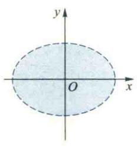
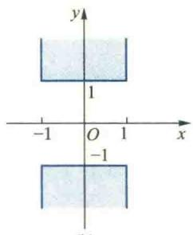
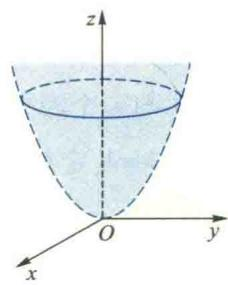
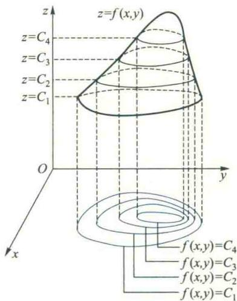
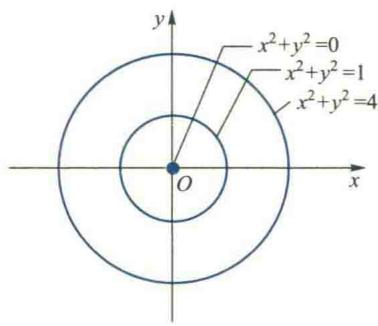
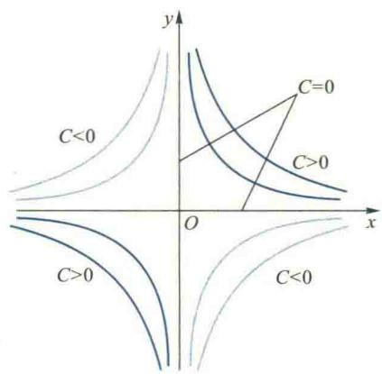
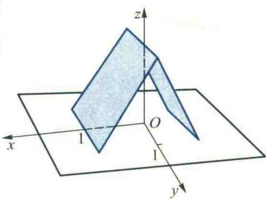

import ExerciseTrigger from '@/components/exercises/ExerciseTrigger.astro';
import QRCodeVideo from '@/components/QRCodeVideo.astro';

import Guide from '@/components/Guide.astro';
import Knowledge from '@/components/Knowledge.astro';
import Example from '@/components/Example.astro';
import Analysis from '@/components/Analysis.astro';
import Solution from '@/components/Solution.astro';
import Variant from '@/components/Variant.astro';
import Note from '@/components/Note.astro';
import Block from '@/components/Block.astro';
import Method from '@/components/Method.astro';
import Exercise from '@/components/Exercise.astro';

本节首先介绍多元数量值函数与多元向量值函数的概念,然后将一元函数的极限和连续性概念推广到多元函数,并讨论多元连续函数的性质.

## 2.1 多元函数的概念

在科学技术问题中常常要研究多个变量之间的关系.例如,理想气体状态方程式$p=R\frac{T}{V}$ (R 为常数) 表示气体的压强 p 对体积 V 与绝对温度 T 的依赖关系, 可以看成两个自变量 V 和 T 与一个因变量 p 之间的关系. 又如, 将点电荷 q 置于空间 $R^{3}$ 的坐标原点处, 根据 Coulomb 定律, 它在空间 $R^{3}$ 中任一点 $r=(x,y,z)$ 处产生的电场强度为

$$
\boldsymbol {E} = k q \frac {\boldsymbol {r}}{\| \boldsymbol {r} \| ^ {3}} = k q \frac {x \boldsymbol {i} + y \boldsymbol {j} + z \boldsymbol {k}}{\left(x ^ {2} + y ^ {2} + z ^ {2}\right) ^ {3 / 2}} = E _ {x} \boldsymbol {i} + E _ {y} \boldsymbol {j} + E _ {z} \boldsymbol {k}.
$$

它表示电场强度向量 $E = (E_x,E_y,E_z)$ 对空间点的坐标 $x,y,z$ 的依赖关系，可以看作是三个自变量 $x,y,z$ 与三个因变量 $E_{x},E_{y},E_{z}$ 之间的关系，也可看成是三个变量 $x,y,z$ 与一个向量 $\pmb{E}$ 之间的关系.理想气体状态方程式中压强 $p$ 就是 $V,T$ 的一个数量值函数，而电场强度向量 $\pmb{E}$ 就是 $x,y,z$ 的一个向量值函数.因此，我们既要讨论多元数量值函数，还要讨论多元向量值函数

<Knowledge title="定义 2.1">
设 $A \subseteq \mathbf{R}^n$ 是一个点集, 称映射 $f: A \to \mathbf{R}$ 是定义在 $A$ 上的一个 $n$ 元数量值函数, 简称为 $n$ 元函数, 也可记作

$$
w = f (\boldsymbol {x}) = f \left(x _ {1}, x _ {2}, \dots , x _ {n}\right),
$$

其中 $\boldsymbol{x}=(x_{1},x_{2},\cdots,x_{n})\in A$ 称为自变量， $D(f)=A$ 称为 f 的定义域，w 称为因变量，与给定的 $x\in D(f)$ 所对应的 w 称为函数 f 在点 x 处的值， $R(f)=\{w\mid w=f(x),x\in D(f)\}$ 称为 f 的值域.

习惯上，二元函数常记成 $z = f(x,y),(x,y)\in A\subseteq \mathbf{R}^2$ .三元函数常记成

$$
u = f (x, y, z), (x, y, z) \in A \subseteq \mathbf {R} ^ {3}.
$$
</Knowledge>

<Example title="例 2.1">
求下列函数的定义域 D:

(1) $z = \ln (1 - x^2 - 2y^2)$ ; (2) $z = \sqrt{1 - x^2} + \sqrt{y^2 - 1}$ ;

(3) $w = \frac{1}{\sqrt{z - x^2 - y^2}}.$

<Solution title="解">
（1） $D = \{(x,y)\in \mathbf{R}^2\mid x^2 +2y^2 < 1\}$ ，它是 $xOy$ 平面上以椭圆 $x^{2} + 2y^{2} = 1$ 为边界的有界区域(图5.5(a)中阴影部分).

(2) $D = \{(x, y) \in \mathbf{R}^2 \mid |x| \leqslant 1, |y| \geqslant 1\}$ , 它表示 $xOy$ 平面上的两个无界闭区域（图5.5(b)中阴影部分）.

(3) $D = \{(x, y, z) \in \mathbf{R}^3 \mid z > x^2 + y^2\}$ , 它表示三维空间 $\mathbf{R}^3$ 中抛物面 $z = x^2 + y^2$ 上方的无界区域 (图5.5(c)中阴影部分).

多元数量值函数的两种几何表示法 类似于一元函数,多元数量值函数也可以

<figure class="vp-figure">
  

    

      
      (a)
    

    

      
      (b)
    

  

  <figcaption>图5.5</figcaption>
</figure>

  
(c)

用它们的图像来表示.

二元函数 $z = f(x,y)((x,y)\in A\subseteq \mathbf{R}^2)$ 的图像

$$
\operatorname{Gr} f = \{(x, y, z) | (x, y) \in A, z = f (x, y) \}
$$

是 $R^{3}$ 中的点集,通常是 $R^{3}$ 中的一张曲面,而这个曲面在 xOy 坐标面的投影区域就是函数 f 的定义域 A.一般地,n 元函数 $w=f(x_{1},x_{2},\cdots,x_{n})((x_{1},x_{2},\cdots,x_{n})\in A\subseteq\mathbf{R}^{n})$ 的图像

$$
\operatorname{Gr} f = \left\{\left(x _ {1}, x _ {2}, \dots , x _ {n}, w\right) \mid \left(x _ {1}, x _ {2}, \dots , x _ {n}\right) \in A, w = f \left(x _ {1}, x _ {2}, \dots , x _ {n}\right) \right\}
$$

是 $R^{n+1}$ 中的点集.例如,二元函数 $z=\sqrt{x^{2}+y^{2}}\left((x,y)\in\mathbf{R}^{2}\right)$ 的图像是 $R^{3}$ 中以原点为顶点的 xOy 平面上方的圆锥面.n 元线性函数

$$
w = a _ {1} x _ {1} + a _ {2} x _ {2} + \dots + a _ {n} x _ {n} = \langle \boldsymbol {a}, \boldsymbol {x} \rangle \quad (\boldsymbol {x} = (x _ {1}, x _ {2}, \dots , x _ {n}) \in \mathbf {R} ^ {n})
$$

的图像常称为 $R^{n+1}$ 中的超平面, 其中 $\boldsymbol{a}=(a_{1},a_{2},\cdots,a_{n})\in\mathbf{R}^{n}$ 是常向量, 但当 n>2 时, 它的图形无法显示出来.

等值线 另一种图示函数 $z=f(x,y)$ 的方法是利用它的所谓等值线 $f(x,y)=C$ （其中 C 为常数），它表示 xOy 平面上使函数 $z=f(x,y)$ 取相同函数值 C 的点 $(x,y)$ 构成的集合.

容易看出,等值线 $f(x,y)=C$ 实际上就是曲面 $z=f(x,y)$ 与平面z=C的交线在xOy坐标平面上的投影(图5.6).因此,对于不同的C,就得到不同的等值线,一个函数的所有等值线构成xOy平面上的一个曲线族.将等值线族 $f(x,y)=C$ 中

<figure class="vp-figure">
  
  <figcaption>图5.6</figcaption>
</figure>

各曲线铅直提升(或下降)到相应的高度 z=C 处,就不难想象出曲面 $z=f(x,y)$ 的图像.例如地图中的等高线就是等值线的一种例子.用水平平面 z=C 截小山表面,其截线在 $xOy$ 平面上的投影就是表示这个小山表面形状的函数 $z = f(x,y)$ 的等高线 $f(x, y) = C$ . 这一系列 (C 取不同值) 等高线就形成了此山体的地形图 (鸟瞰图). 例如, 若图 5.6 中的曲面 $z = f(x,y)$ 表示一小山的表面形状, 由其等高线 $f(x,y) = C$ 便可看出, 山体朝向 $y$ 轴正向的一侧等高线分布较密, 山体较为陡峭, 而相反的一侧等高线分布较稀疏, 山体较为平缓.
</Solution>
</Example>

<Example title="例 2.2">
画出函数 $z = x^{2} + y^{2}$ 的等值线, 并由此等值线讨论此曲面的形状.

<Solution title="解">
显然,此等值线为

$$
x ^ {2} + y ^ {2} = C.
$$

容易看出, 当 C>0 时, 等值线是以原点为中心的同心圆族(图 5.7), C 越小圆半径越小; C=0 时为原点 $O(0,0)$ ; C&lt;0 时无图形. 由此可知, 此曲面仅位于 xOy 平面的上方, 与 xOy 平面相切于原点, 在 xOy 平面上方与水平平面 z=C 的截面都是圆, 且越往上开口半径越大.
</Solution>
</Example>

试根据例 2.2 与例 2.3 中所画出的两个函数等值线分布和变化的状况描绘出它们所表示的曲面的图形.

<Example title="例 2.3">
画出函数 z=xy 的等值线, 并对函数图像加以讨论.

<Solution title="解">
等值线为

$$
x y = C,
$$

它是 xOy 平面上的等轴双曲线族(图 5.8).

<figure class="vp-figure">
  
  <figcaption>图5.7</figcaption>
</figure>

<figure class="vp-figure">
  
  <figcaption>图5.8</figcaption>
</figure>

当 C>0 时, 等值线是位于第一与第三象限的双曲线族; 当 C&lt;0 时, 等值线是位于第二与第四象限的双曲线族; 当 C=0 时, 等值线是直线 x=0 与 y=0. 因此, 此等值线所表示的曲面 z=xy 从两坐标轴在第一与第三象限逐渐向上升起并逐渐向外扩大; 同时由两坐标轴在第二和第四象限逐渐向下向外延伸. 原点 O(0,0) 称为此曲面的
</Solution>
</Example>

## 鞍点.

对于三元函数 $u = f(x,y,z)$ ，它的图像不可能在四维空间中呈现，但我们却可以在三维空间Oxyz中用曲面 $f(x,y,z) = C$ 来显示此三元函数的某些特征. $f(x,y,z) = C$ 称为函数 $u = f(x,y,z)$ 的等值面，其中 $C$ 为常数

例如，在置于原点 O 处的点电荷 q 所形成的电场中，电位函数为 $u=f(x,y,z)=\frac{q}{4\pi\varepsilon r}$ ，其中 $r=\sqrt{x^{2}+y^{2}+z^{2}}$ ，则电位 u 的等值面方程为

$$
\frac {q}{4 \pi \varepsilon r} = C \quad \text {或} \quad x ^ {2} + y ^ {2} + z ^ {2} = \left(\frac {q}{4 \pi \varepsilon C}\right) ^ {2}.
$$

它显然是以原点 O 为中心的同心球面. 它表明, 在由此点电荷 q 形成的电场中, 在以此点为中心的任一球面上各点的电位相同, 且 C 越小, 球面的半径越大, 其上各点的电位越低. 在无限远离点电荷 q 的地方, 电位将趋于零.

<Knowledge title="定义 2.2">
设 $A \subseteq R^{n}$ 是一个点集, 称映射 $f: A \to R^{m} \quad (m \geqslant 2)$ 为定义在 A 上的一个 n 元向量值函数, 也可记作 $y = f(x), x \in A$ , 其中 $x = (x_{1}, x_{2}, \cdots, x_{n}) \in A$ 是自变量, $y = (y_{1}, y_{2}, \cdots, y_{m}) \in \mathbb{R}^{m}$ 是因变量, $f = (f_{1}, f_{2}, \cdots, f_{m})$ .

显然,一个 n 元向量值函数 $y=f(x)$ 对应于 m 个 n 元数量值函数:

$$
\left\{ \begin{array}{l} y _ {1} = f _ {1} (x _ {1}, x _ {2}, \dots , x _ {n}), \\ y _ {2} = f _ {2} (x _ {1}, x _ {2}, \dots , x _ {n}), \\ \dots \dots \\ y _ {m} = f _ {m} (x _ {1}, x _ {2}, \dots , x _ {n}). \end{array} \right.
$$

为了运算方便起见,有时把 $R^{n}$ 与 $R^{m}$ 中的向量写成列向量.在这种情况下,可把 n 元向量值函数写成如下形式:

$$
\mathbf {y} = \left( \begin{array}{c} y _ {1} \\ y _ {2} \\ \vdots \\ y _ {m} \end{array} \right) = \left( \begin{array}{c} f _ {1} (\mathbf {x}) \\ f _ {2} (\mathbf {x}) \\ \vdots \\ f _ {m} (\mathbf {x}) \end{array} \right) = \left( \begin{array}{c} f _ {1} (x _ {1}, x _ {2}, \dots , x _ {n}) \\ f _ {2} (x _ {1}, x _ {2}, \dots , x _ {n}) \\ \vdots \\ f _ {m} (x _ {1}, x _ {2}, \dots , x _ {n}) \end{array} \right),
$$

其中 $\boldsymbol{x}=(x_{1},x_{2},\cdots,x_{n})^{\mathrm{T}},\boldsymbol{y}=(y_{1},y_{2},\cdots,y_{m})^{\mathrm{T}},\boldsymbol{f}=(f_{1},f_{2},\cdots,f_{m})^{\mathrm{T}}.$
</Knowledge>

<Example title="例 2.4">
我们知道,空间 $R^{3}$ 中曲线的参数方程为

$$
x = x (t), y = y (t), z = z (t), \quad t \in [ \alpha , \beta ] \subset \mathbf {R},
$$

它可以看成是从 $[\alpha, \beta]$ 到 $\mathbf{R}^3$ 的一个映射，即一元向量值函数

$$
\boldsymbol {r} = \boldsymbol {r} (t), \quad t \in [ \alpha , \beta ],
$$

其中 $\boldsymbol{r}(t)=(x(t),y(t),z(t))\in\mathbf{R}^{3}$ . 本段开始提到的电场强度向量 $\boldsymbol{E}(\boldsymbol{r})=\boldsymbol{E}(x,y,z)$ 可以看成是从 $R^{3}$ 到 $R^{3}$ 的三元向量值函数.
</Example>

## 2.2 多元函数的极限与连续性

与一元函数一样,为了建立多元函数微积分的理论,必须将一元函数的极限与连续性概念推广到多元函数.这两个概念从一元推广到二元会有本质上的变化,而从二元推广到 $n(n>2)$ 元没有任何实质性的困难,因此,下面主要讨论二元函数.

设 $A$ 是平面 $\mathbf{R}^2$ 上的一个点集， $(x_0, y_0)$ 是 $\mathbf{R}^2$ 中的一点。我们仿照一元函数极限的定义来定义二元数量值函数 $f: A \to \mathbf{R}$ 当 $(x, y) \to (x_0, y_0)$ 的极限。在讨论一元函数 $f$ 当 $x \to x_0$ 时的极限定义时，要求函数 $f$ 定义在 $x_0$ 的某去心邻域上。这是由于：一方面极限是用来研究当 $x \to x_0$ 时 $f(x)$ 的变化趋势的，它与 $f$ 在 $x_0$ 处是否有定义，以及 $f$ 在 $x_0$ 处的函数值 $f(x_0)$ 的大小无关，也就是说，与 $x_0$ 是否在 $f$ 的定义域中无关；另一方面，为了反映 $f(x)$ 变化的趋势，还应要求在 $x_0$ 的任何去心邻域中都含有 $f$ 的定义域中的点 $x$ 。从这一要求来看， $f$ 在 $x_0$ 的某去心邻域中的每一点有定义的要求显得过高，实际上只需要求在 $x_0$ 的任何去心邻域中均含有使 $f$ 有定义的点即可，即要求 $x_0$ 是 $f$ 的定义域的聚点。下面，我们在这一放宽要求的前提下来定义二元函数的极限。

<Knowledge title="定义 2.3 二重极限">
设有点集 $A \subseteq R^{2}, f: A \to R$ 是一个二元数量值函数, $(x_{0}, y_{0})$ 是 A 的一个聚点. 若存在常数 $a \in R$ , 使得

$$
\begin{array}{r l} & {\forall   \varepsilon > 0, \exists   \delta > 0, \text {当} (x, y)   \in   \mathring {U} ((x _ {0}, y _ {0}), \delta)   \cap   A   \text {时}, \text {恒有}} \\ & {\qquad \qquad \qquad | f (x, y) - a | <   \varepsilon ,} \end{array}\tag{2.1}
$$

则称当 $(x,y)\rightarrow (x_0,y_0)$ 时 $f(x,y)$ 有极限，且称 $a$ 为当 $(x,y)\rightarrow (x_0,y_0)$ 时 $f(x,y)$ 的极限，记作

$$
\lim _ {(x, y) \to (x _ {0}, y _ {0})} f (x, y) = a \quad \text {或} \quad \lim _ { \begin{array}{c} {{x \to x _ {0}}} \\ {{y \to y _ {0}}} \end{array} } f (x, y) = a  ,
$$

这个极限也称为二重极限. 否则, 称当 $(x, y) \rightarrow (x_{0}, y_{0})$ 时 $f(x, y)$ 没有极限.
</Knowledge>

二重极限定义中,“当 $(x,y)\in\mathring{U}((x_{0},y_{0}),\delta)\cap A$ 时”表示 $(x,y)$ 满足不等式 $0<\sqrt{(x-x_{0})^{2}+(y-y_{0})^{2}}<\delta$ 且 $(x,y)$ 是A中的点.实际上,上面的不等式也可用

在上面的定义中,由于f的定义域是一个集合A,
因此,在(2.1)式中要求 $(x,y)\in\mathring{U}((x_{0},y_{0}),\delta)\cap A.$

$$
0 <   | x - x _ {0} | <   \delta_ {1}, \quad 0 <   | y - y _ {0} | <   \delta_ {2}
$$

二重极限的定义在形式上与一元函数极限定义来代替(其中 $\delta_{1}, \delta_{2}$ 为两个正常数).
你能给出证明吗?

并无多大差异,因此,一元函数极限的有关性质(如唯一性、局部有界性、局部保号性、夹逼准则以及 Heine 定理等)和运算法则都可以推广到二重极限中来,这里不再一一重述.

<QRCodeVideo id="5.2.1" title="二重极限与一元函数极限的比较." url="HTTP://2D.HEP.CN/1254052/1" />

但是，在二重极限中，由于自变量的增多，产生了一些与一元函数极限的本质差异。在一元函数极限中，点 $x$ 只能在数轴上从 $x_0$ 左右趋于 $x_0$ ；在二重极限中，点 $(x, y)$ 在平面集合 $A$ 中趋于 $(x_0, y_0)$ 的方式可能是多种多样的，方向可以任意多，路径也可以是千姿百态的。所谓 $\lim_{(x, y) \to (x_0, y_0)} f(x, y) = a$ 是指当点 $(x, y)$ 在集合 $A$ 中从 $(x_0, y_0)$ 的四面八方

以可能有的任何方式和任何路径趋于 $(x_0, y_0)$ 时， $f(x, y)$ 都趋于同一个常数 $a$ 。因此，如果当 $(x, y)$ 以两种不同的方式或路径趋于 $(x_0, y_0)$ 时 $f(x, y)$ 趋于不同的数，或者 $(x, y)$ 按某一方式或路径趋于 $(x_0, y_0)$ 时 $f(x, y)$ 不趋于一个确定的数，那么就可以断定当 $(x, y)$ 趋于 $(x_0, y_0)$ 时 $f(x, y)$ 的极限不存在。

<Example title="例 2.5">
用定义证明 $\lim_{(x,y)\to(0,0)}\frac{x^{2}y}{x^{2}+y^{2}}=0.$

<Solution title="证明">
因为函数 $f(x,y) = \frac{x^2y}{x^2 + y^2}$ 的定义域 $A = \mathbf{R}^2 \setminus \{(0,0)\}$ ，并且

<QRCodeVideo id="5.2.2" url="HTTP://2D.HEP.CN/1254052/2" />
判定二重极限
不存在有哪些
常用方法.

$$
\left| f (x, y) - 0 \right| = \left| \frac {x ^ {2} y}{x ^ {2} + y ^ {2}} \right| \leqslant | y | \leqslant \sqrt {x ^ {2} + y ^ {2}}.
$$

所以，对任给的 $\varepsilon > 0$ ，只要取 $\delta = \varepsilon$ ，则当 $0 < \| (x, y) - (0, 0) \| = \sqrt{x^2 + y^2} < \delta$ 时（即 $\forall (x, y) \in \mathring{U}((0, 0), \delta) \cap A$ ），就有

$$
\left| f (x, y) - 0 \right| <   \varepsilon ,
$$
</Solution>
</Example>

根据定义 2.3 知 $\lim_{(x,y)\to(0,0)}\frac{x^{2}y}{x^{2}+y^{2}}=0.$

<Example title="例 2.6">
设 $f(x,y)=\frac{xy}{x^{2}+y^{2}}$ ，讨论二重极限 $\lim_{(x,y)\to(0,0)}f(x,y)$ 是否存在.

<Solution title="解">
当点 $(x,y)$ 沿着直线y=kx趋于 $(0,0)$ 时,有

$$
\lim_{\substack{(x,y)\to (0,0)\\ y = kx}}f(x,y) = \lim_{x\to 0}\frac{kx^{2}}{(1 + k^{2})x^{2}} = \frac{k}{1 + k^{2}}.
$$

上式说明, 若 k 取不同值, 即当 $(x, y)$ 沿着不同的直线 y = kx 趋于 $(0, 0)$ 时, $f(x, y)$ 趋于不同的常数, 因此 $\lim_{(x, y) \to (0, 0)} f(x, y)$ 不存在.

明白了二元函数极限的概念,就不难讨论二元函数的连续性问题.与一元函数的连续性类似,可以定义二元函数连续性如下:
</Solution>
</Example>

<Knowledge title="定义 2.4 二元连续函数">
设二元数量值函数 $f(x,y)$ 定义在点 $(x_{0},y_{0})$ 的某一邻域 $U(x_{0},y_{0})$ 内, 若

$$
\lim _ {(x, y) \rightarrow (x _ {0}, y _ {0})} f (x, y) = f (x _ {0}, y _ {0}),\tag{2.2}
$$

则称函数 $f$ 在点 $(x_0, y_0)$ 处连续，否则，称 $f$ 在点 $(x_0, y_0)$ 处间断。若 $f$ 在区域 $D$ 中的每一点处连续，则称 $f$ 在区域 $D$ 内连续。此时，我们说 $f$ 是 $D$ 内的连续函数。

函数的连续性也可用 $\varepsilon -\delta$ 语言来描述.即若 $\forall \varepsilon >0,\exists \delta >0$ ，使得 $\forall (x,y)\in U((x_0,y_0),\delta)$ 恒有

$$
\left| f (x, y) - f \left(x _ {0}, y _ {0}\right) \right| <   \varepsilon ,\tag{2.3}
$$

则称f在点 $(x_{0},y_{0})$ 处连续.
</Knowledge>

像一元函数一样,二元连续函数的和、差、积、商(除去分母为零的点)与复合函数仍为二元连续函数.

例如，函数 $z = \sin \frac{1}{x^2 + y^2 - 1}$ 可看成是由 $z = \sin u$ 与 $u = \frac{1}{x^2 + y^2 - 1}$ 复合而成的，而 $z = \sin u$ 是连续函数， $u =$ $\frac{1}{x^2 + y^2 - 1}$ 除圆周 $x^{2} + y^{2} = 1$ 上的点之外在平面 $\mathbf{R}^2$ 上处注意:设二元函数 $f(x,y)$ 定义在闭区域 D 上,为了使定义 2.4 能用于讨论该函数在 D 的边界 $\partial D$ 上的连续性,现对定义 2.4 作如下扩充:设点 $(x_{0},y_{0})\in\partial D$ . 若 $\forall\varepsilon>0,\exists\delta>0$ ,使得当 $(x,y)\in U((x_{0},y_{0}),\delta)\cap D$ 时,恒有

$$
\left| f (x, y) - f \left(x _ {0}, y _ {0}\right) \right| <   \varepsilon ,
$$

则称 $f(x,y)$ 在点 $(x_{0},y_{0})$ 连续.

二元函数 $z=f(x,y)$ 在 $R^{2}$ 上关于 x 和 y 分别连续，能否断定它在 $R^{2}$ 上关于 $(x,y)$ 连续？为什么？

处连续,因而复合函数 $z=\sin\frac{1}{x^{2}+y^{2}-1}$ 在它的定义域 $A=\{(x,y)\mid(x,y)\in\mathbf{R}^{2}\text{且}x^{2}+y^{2}\neq1\}$ 上是连续的,圆周 $x^{2}+y^{2}=1$ 上的点都是间断点,称该圆周是函数的间断线.

又如,函数

$$
f (x, y) = \left\{ \begin{array}{c c} \frac {x y}{x ^ {2} + y ^ {2}}, & x ^ {2} + y ^ {2} \neq 0, \\ 0, & x ^ {2} + y ^ {2} = 0. \end{array} \right.
$$

由于 $\lim_{(x,y)\to (0,0)}\frac{xy}{x^2 + y^2}$ 不存在（例2.6），因此，点(0,0)是 $f$ 的间断点.除此之外，它在平面 $\mathbf{R}^2$ 上处处连续.

再来考察函数

$$
f (x, y) = \left\{ \begin{array}{l l} 1 - x, & 0 \leqslant x <   1, - 1 <   y <   1, \\ 1 + x, & - 1 <   x <   0, - 1 <   y <   1, \\ 0, & \text {其他} \end{array} \right.
$$

的连续性.由于该函数的图像酷似一顶帐篷,所以常称为帐篷函数(图5.9).易见,在xOy平面上除去两条直线段y=1(-1&lt;x&lt;1)和y=-1(-1&lt;x&lt;1)外该函数处处连续.由于点 $x\in[0,1)$ 时, $f(x,y)=1-x$ ,

$$
\lim _ {y \rightarrow 1} f (x, y) = \lim _ {y \rightarrow 1} (1 - x) = 1 - x \neq 0 = f (x, 1),
$$

而当 $x \in (-1,0)$ 时， $f(x,y) = 1 + x$

图5.9

$$
\lim _ {y \rightarrow 1} f (x, y) = \lim _ {y \rightarrow 1} (1 + x) = 1 + x \neq 0 = f (x, 1),
$$

所以极限值均不等于该函数在 y=1 上的值, 故直线段 $y=1(-1<x<1)$ 上的点都是函数的间断点. 同理, 直线段 $y=-1(-1<x<1)$ 上的点也是函数的间断点. 这两条直线段是该函数的间断线.

二元函数的极限和连续性概念可以很容易地推广到 n (n>2) 元数量值函数与向量值函数, 简要叙述如下.

设 $A \subseteq R^{n}$ 是一点集, $f: A \to R$ 是一个 n 元数量值函数, $\boldsymbol{x}_{0} = (x_{0,1}, x_{0,2}, \cdots, x_{0,n})$ 是 A 的聚点, 若存在常数 $a \in R$ , 使得

$$
\begin{array}{r l} & {\forall   \varepsilon > 0,   \exists   \delta > 0, \text {当}   x = (x _ {1}, x _ {2}, \dots , x _ {n})   \in   \mathring {U} (x _ {0}, \delta)   \cap   A   \text {时}, \text {恒有}} \\ & {\qquad | f (x) - a | <   \varepsilon ,} \end{array}\tag{2.4}
$$

则称 a 为当 $x \rightarrow x_{0}$ 时 $f(x)$ 的极限, 记作

$$
\lim _ {x \to x _ {0}} f (x) = a \text {或} f (x) \to a (x \to x _ {0}),
$$

也可记成

$$
\lim _ {(x _ {1}, \dots , x _ {n}) \rightarrow (x _ {0, 1}, \dots , x _ {0, n})} f (x _ {1}, \dots , x _ {n}) = \lim _ {\substack {x _ {1} \rightarrow x _ {0, 1}\\\vdots\\x _ {n} \rightarrow x _ {0, n}}} f (x _ {1}, \dots , x _ {n}) = a.
$$

这个极限也称为 n 重极限.

关于 n 元向量值函数的极限也可类似定义.

设 $A \subseteq R^{n}$ 为一点集， $f = (f_{1}, \cdots, f_{m})^{\mathrm{T}}: A \to \mathbf{R}^{m}$ 是一个 n 元向量值函数， $x_{0} = (x_{0,1}, \cdots, x_{0,n})$ 是 A 的一个聚点， $a = (a_{1}, \cdots, a_{m}) \in \mathbf{R}^{m}$ 是一个常向量。若

$\forall \varepsilon > 0, \exists \delta > 0,$ 使得当 $x = (x_{1}, \cdots, x_{n}) \in \mathring{U}(x_{0}, \delta) \cap A$ 时，恒有

$$
\| f (x) - a \| <   \varepsilon ,\tag{2.5}
$$

其中

$$
\| f (\boldsymbol {x}) - \boldsymbol {a} \| = \left[ \left(f _ {1} (\boldsymbol {x}) - a _ {1}\right) ^ {2} + \dots + \left(f _ {m} (\boldsymbol {x}) - a _ {m}\right) ^ {2} \right] ^ {\frac {1}{2}},
$$

则称 a 为当 $x \rightarrow x_{0}$ 时 $f(x)$ 的极限, 记作

$$
\lim _ {x \to x _ {0}} f (x) = a \text {或} f (x) \to a (x \to x _ {0}).
$$

不难证明

证明(2.6)式.

$$
\lim _ {x \rightarrow x _ {0}} f (\boldsymbol {x}) = \boldsymbol {a} \Leftrightarrow \lim _ {x \rightarrow x _ {0}} f _ {k} (\boldsymbol {x}) = a _ {k} \quad (k = 1, 2, \dots , m).\tag{2.6}
$$

这就是说, 当 $x \to x_{0}$ 时, $f(x)$ 的极限等于 a 的充要条件是: 当 $x \to x_{0}$ 时, f 的每个分量 $f_{k}(x)$ 的极限等于向量 a 的对应分量 $a_{k} (k = 1, 2, \cdots, m)$ . 因此, 研究向量值函数的极限可以转化为研究它的各个分量(数量值函数)的极限.

关于 n 元数量值函数和向量值函数连续性的定义可参照定义 2.4 及其扩充（见边框中的注意）由读者自己写出来，并且可以证明：定义在区域 D 上的 n 元向量值函数 f 在点 $x_{0}$ 处连续 $\Leftrightarrow f$ 的每个分量 $f_{k}$ 在点 $x_{0}$ 处连续 $(k=1,2,\cdots,m)$ . 因此，研究向量值函数的连续性也可转化为研究它的各个分量（数量值函数）的连续性.

## 2.3 有界闭区域上多元连续函数的性质

在第一章中已经指出,在闭区间上的一元连续函数有许多很好的性质,它们在理论上和应用中都有重要的价值.由于闭区间实际上就是直线(一维空间)中的有界闭区域,因此,本段我们将这些性质推广到 $R^{n}$ 空间有界闭区域上的多元连续函数中,它们的证明方法也与一元函数类似.

<Knowledge title="定理 2.1">
设 $A \subseteq R^{n}$ 是有界闭区域, $f: A \to R$ 是 A 上的连续函数, 则

(1) (有界性) f 在 A 上有界;

(2) (最大最小值定理) $f$ 在 $A$ 上能取得它的最大值与最小值.

<Solution title="证明">
（1）用反证法. 假定 f 在 A 上无界, 那么

$$
\forall k \in \mathbf {N} _ {+}, \exists x _ {k} \in A, \text {使得} | f (x _ {k}) | > k,
$$

从而得到 $A$ 中的点列 $\{\pmb{x}_k\}$ . 由已知 $A$ 是有界闭区域, 故存在 $\{\pmb{x}_k\}$ 的子列 $\{\pmb{x}_{k_i}\}$ , 使 $\pmb{x}_{k_i} \to \pmb{x}_0 (i \to \infty)$ , 且 $\pmb{x}_0 \in A$ . 由于 $f$ 是 $A$ 上的连续函数, 故 $\lim_{i \to \infty} f(\pmb{x}_{k_i}) = f(\pmb{x}_0)$ , 因而数列 $\{f(\pmb{x}_{k_i})\}$ 有界, 这与 $|f(\pmb{x}_{k_i})| > k_i$ 的假定相矛盾, 所以 $f$ 在 $A$ 上有界.

(2) 由(1)知 $f(A)$ 是 $\mathbf{R}$ 中的有界集, 因此, $f(A)$ 必有上(下)确界, 设 $\alpha = \sup f(A)$ , 故 $\forall x \in A$ , 有 $f(x) \leqslant \alpha$ . 下面证明 $f$ 在 $A$ 上能取到 $\alpha$ , 即 $\alpha$ 为 $f$ 在 $A$ 上的最大值.

事实上,根据上确界的定义,

$$
\forall k \in \mathbf {N} _ {+}, \exists x _ {k} \in A, \text {使得} \alpha - \frac {1}{k} <   f (x _ {k}) \leqslant \alpha ,
$$

从而有 $\lim_{k\to\infty}f(x_k)=\alpha.$ 因为A为有界闭域，所以存在 $\{x_k\}$ 的子列 $\{x_{k_i}\},x_{k_i}\rightarrow x_0(i\rightarrow\infty)$ ，且 $x_0\in A.$ 再利用f的连续性，即得到 $f(x_0)=\lim_{i\to\infty}f(x_{k_i})=\alpha.$ 这就证明了f在 $x_0$ 处取得最大值 $\alpha$ （此时上确界 $\alpha$ 就是f在A上的最大值).类似可以证明f在A上也能取得最小值.
</Solution>
</Knowledge>

<Knowledge title="定理 2.2 介值定理">
设 $A \subseteq R^{n}$ 是一有界闭域, $f: A \to R$ 在 A 上连续, m 与 M 分别是 f 在 A 上的最小值与最大值. 如果常数 $\mu$ 是 m 与 M 之间的任一数: $m \leqslant \mu \leqslant M$ , 则必 $\exists x_{0} \in A$ , 使 $f(x_{0}) = \mu$ .

(证明从略.)
</Knowledge>

<Knowledge title="定理 2.3 一致连续性">
设 $A \subseteq R^{n}$ 是一个有界闭域, $f: A \to R$ 是连续函数, 则 f 在 A 上一致连续, 即

$\forall \varepsilon > 0, \exists \delta = \delta (\varepsilon) > 0$ ，使得 $\forall x_1, x_2 \in A$ ，当 $\|x_1 - x_2 \| < \delta$ 时，恒有

$$
\left| f \left(\boldsymbol {x} _ {1}\right) - f \left(\boldsymbol {x} _ {2}\right) \right| <   \varepsilon .\tag{2.7}
$$

(证明从略.)
</Knowledge>

<Block title="习题5.2">
**（A）**

1. 确定并画出下列函数的定义域：

(1) $z=x+\sqrt{y}$ ;

(2) $z = \arccos \frac{y}{x}$ ;

(3) $z = \sqrt{\frac{2x - x^2 - y^2}{x^2 + y^2 - x}};$

(4) $z = \arcsin \frac{x}{y^2} +\arcsin (1 - y)$

(5) $u = \mathrm{e}^{z} + \ln (x^{2} + y^{2} - 1)$ ;

(6) $u = \arccos \frac{z}{\sqrt{x^2 + y^2}}.$

2. 指出下列函数图像的名称：

(1) $z = x + 2y - 1$

(2) $z = \sqrt{x^2 + 2y^2}$ ;

(3) z = xy;

(4) $z = \mathrm{e}^{-(x^2 + y^2)}$ ;

(5) $z = 3 - 2x^{2} - y^{2}$ ;

(6) $z = \sqrt{1 - x^2 - 2y^2}$ .

3. 用定义证明下列二重极限：

(1) $\lim_{(x,y)\to (0,0)}xy\sin \frac{x}{x^2 + y^2} = 0;$

(2) $\lim_{(x,y)\to (1,1)}(x^2 +y^2) = 2;$

(3) $\lim_{(x,y)\to (3,2)}(3x - 4y) = 1;$

(4) $\lim_{(x,y)\to (0,0)}\frac{\sqrt{xy + 1} - 1}{xy} = \frac{1}{2}.$

4. 证明：

(1) $\lim_{(x,y)\to (0,0)}\frac{x + y}{x - y}$ 不存在；

(2) $\lim_{(x,y)\to (0,0)}\frac{xy}{x + y}$ 不存在.

5. 求下列二重极限：

(1) $\lim_{(x,y)\to (0,0)}\frac{\mathrm{e}^x + \mathrm{e}^y}{\cos x - \sin y};$

(2) $\lim_{(x,y)\to(0,0)}\frac{x^{2}y^{3/2}}{x^{4}+y^{2}};$

(3) $\lim_{(x,y)\to (0,2)}\frac{\sin(xy)}{x};$

(4) $\lim_{(x,y)\to(0,0)}x^{2}y^{2}\ln(x^{2}+y^{2})$ .

6. 讨论下列函数的连续性：

(1) $f(x,y)=\frac{x^{2}-y^{2}}{x^{2}+y^{2}};$

(2) $f(x,y)=\frac{x-y}{x+y};$

(3) $f(x,y) = \left\{ \begin{array}{l} \frac{xy}{\sqrt{x^2 + y^2}}, x^2 + y^2 \neq 0, \\ 0, x^2 + y^2 = 0; \end{array} \right.$

(4) $f(x,y) = \left\{ \begin{array}{l} \frac{\sin(xy)}{x^2 + y^2}, x^2 + y^2 \neq 0, \\ 0, x^2 + y^2 = 0. \end{array} \right.$

7. 设 $f(x, y) = \frac{1}{xy}, r = \sqrt{x^2 + y^2}, D_1 = \{(x, y) | (x, y) \in \mathbb{R}^2, \frac{1}{k} x \leqslant y \leqslant kx, k > 1 \text{为常数}\}, D_2 = \{(x, y) | (x, y) \in \mathbb{R}^2, x > 0, y > 0\}$ .

(1) $\lim_{r\to+\infty}f(x,y)$ 是否存在？为什么？
(2) $\lim_{r\to+\infty}f(x,y)$ 是否存在？为什么？

8. 设函数 $f(x, y) = \begin{cases} \frac{x^2y}{x^4 + y^2}, & x^2 + y^2 \neq 0, \\ 0, & x^2 + y^2 = 0. \end{cases}$

证明：当 $(x,y)$ 沿过点 $(0,0)$ 的每一条射线 $x = t\cos \alpha ,y = t\sin \alpha (0 < t < + \infty)$ 趋于点 $(0,0)$ 时， $f(x,y)$ 的极限等于 $f(0,0)$ ，即 $\lim_{t\to 0}\frac{f(t\cos\alpha,t\sin\alpha)}{t}(f(0,0))$ ，但 $f(x,y)$ 在点 $(0,0)$ 不连续.

9. 设 $f: D \subseteq \mathbf{R}^2 \to \mathbf{R}$ , 若 $f(x, y)$ 在区域 $D$ 内对变量 $x$ 连续, 对变量 $y$ 满足 Lipschitz 条件, 即对 $D$ 内任意两点 $(x, y')$ , $(x, y'')$ , 有

$$
\left| f (x, y ^ {\prime}) - f (x, y ^ {\prime \prime}) \right| \leqslant L \left| y ^ {\prime} - y ^ {\prime \prime} \right|,
$$

其中 L 为常数, 证明: $f(x,y)$ 在 D 内连续.

10. 设 $D \subseteq \mathbb{R}^n$ 为一区域, $f: D \to \mathbb{R}^m$ 为 $n$ 元向量值函数. 证明: $f$ 在 $D$ 上连续等价于它的每个分量在 $D$ 上连续.

11. 设 f 是区域 $D \subseteq R^{n}$ 上的 n 元向量值函数，证明：f 在 $x_{0} \in D$ 连续 $\Leftrightarrow$ 对于 D 中任何收敛于 $x_{0}$ 的点列 $\{x_{k}\}$ ，都有 $\lim_{k \to \infty} f(x_{k}) = f(x_{0})$ .

12. 设 $f$ 为区域 $D \subseteq \mathbb{R}^n$ 上的 $n$ 元数量值函数. 证明: 若 $f$ 在 $\pmb{x}_0 \in D$ 连续, 且 $f(\pmb{x}_0) > 0$ , 则存在正

常数 $q$ ，使得

$$
\exists \delta > 0,   \forall   x \in U (x _ {0}, \delta)   \cap D, \text { 都有 } f (x) \geqslant q > 0.
$$

**（B）**

1. 设 $f: R^{n} \rightarrow R^{m}$ 是 n 元向量值函数. 试用邻域的语言表述 f 在点 $x_{0} \in R^{n}$ 处连续的定义, 并证明下列命题是等价的:

(1) f 在 $R^{n}$ 上连续；

(2) 若 $W \subseteq R^{m}$ 是开集, 则 W 关于 f 的原像 $f^{-1}(W) = \{x \mid x \in \mathbb{R}^{n}, f(x) \in W\}$ 是 $R^{n}$ 中的开集;

(3) 若 $W \subseteq R^{m}$ 是闭集, 则 W 关于 f 的原像 $f^{-1}(W)$ 是 $R^{n}$ 中的闭集.

2. 设有二元函数

$$
f (x, y) = \left\{ \begin{array}{l l} \frac {x ^ {2} y ^ {2}}{x ^ {2} + y ^ {2}}, & x ^ {2} + y ^ {2} \neq 0, \\ 0, & x ^ {2} + y ^ {2} = 0, \end{array} \right.
$$

证明： $f(x,y)$ 在 $\mathbf{R}^2$ 上不一致连续

3. 设 f 是定义在区域 $D \subseteq R^{n}$ 上的 n 元向量值函数，并且满足 Lipschitz 条件，即存在常数 $L \geqslant 0$ ，使对所有 $x, y \in D$ ，均有 $\|f(x) - f(y)\| \leqslant L \|x - y\|$ ，证明：f 在 A 上一致连续.

4. 设 $f: R^{n} \rightarrow R$ 是 n 元数量值连续函数, $c \in R$ 是一个常数. 证明:

(1) $\{x\in R^{n}\mid f(x)>c\}$ 与 $\{x\in R^{n}\mid f(x)<c\}$ 均为开集；

(2) $\{\pmb{x} \in \mathbf{R}^n | f(\pmb{x}) \geqslant c\}$ 与 $\{\pmb{x} \in \mathbf{R}^n | f(\pmb{x}) \leqslant c\}$ 均为闭集；

(3) $\{x \in R^{n} \mid f(x) = c\}$ 是闭集.
</Block>

<ExerciseTrigger chapter={5} section="5.2" title="5.2 多元函数的极限与连续性 课后真题与自测练习" />
