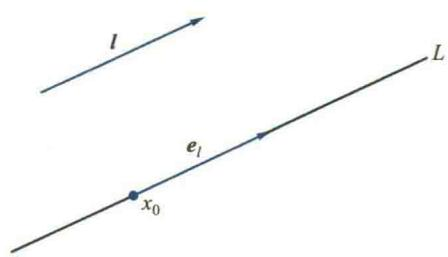
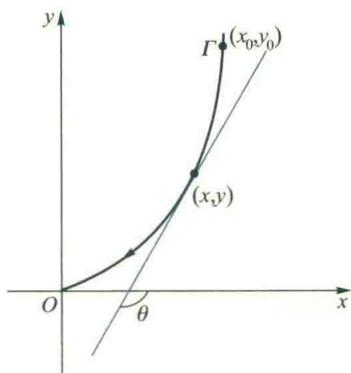
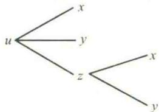

import Guide from '@/components/Guide.astro';
import Knowledge from '@/components/Knowledge.astro';
import Example from '@/components/Example.astro';
import Analysis from '@/components/Analysis.astro';
import Solution from '@/components/Solution.astro';
import Variant from '@/components/Variant.astro';
import Note from '@/components/Note.astro';
import Block from '@/components/Block.astro';
import Method from '@/components/Method.astro';

本节将把一元函数的导数与微分概念推广到多元数量值函数.我们以二元函数为主进行讲解,然后推广到n元函数.先介绍多元数量值函数的偏导数与全微分以及方向导数与梯度,再介绍高阶偏导数与高阶全微分以及复合函数的链式法则,最后介绍隐函数及其微分法.

## 3.1 偏导数

我们知道,一元函数在一点的导数表示函数在该点的变化率,它反映了在该点处函数值随自变量变化的快慢程度.对于二元函数 $z=f(x,y)$ 来说,当然也需要研究它的变化率问题.但是由于自变量多了一个,点 $(x,y)$ 在 xOy 平面上变化,情况要复杂得多,因而因变量随自变量变化的情况也要比一元函数复杂得多.我们首先来研究二元函数关于它的一个自变量的变化率.例如,对于二元函数 $z=f(x,y)$ ,在点 $(x_{0},y_{0})$ 处,把 y 固定在 $y=y_{0}$ ,令 x 变化,这时它就是 x 的一元函数,该函数在 $x_{0}$ 处的导数,就称为函数 $f(x,y)$ 在点 $(x_{0},y_{0})$ 处对x的偏导数.

<Knowledge title="定义 3.1">
（偏导数）设函数 $z = f(x,y)$ 在点 $(x_0,y_0)$ 的某一邻域 $U(x_0,y_0)$ 内有定义，当自变量 $y$ 固定在 $y = y_0$ ，而 $x$ 在 $x_0$ 处有改变量 $\Delta x,(x_0 + \Delta x,y_0)\in U(x_0,y_0)$ 时，相应地，函数 $f$ 有改变量

$$

f (x _ {0} + \Delta x, y _ {0}) - f (x _ {0}, y _ {0}).

$$

如果极限

$$

\lim _ {\Delta x \rightarrow 0} \frac {f (x _ {0} + \Delta x , y _ {0}) - f (x _ {0} , y _ {0})}{\Delta x}

$$

存在,则称此极限值为函数 $z=f(x,y)$ 在点 $(x_{0},y_{0})$ 处对 x 的偏导数,记作

$$

f _ {x} (x _ {0}, y _ {0}), \frac {\partial f (x _ {0} , y _ {0})}{\partial x}, z _ {x} (x _ {0}, y _ {0}) \text {或} \frac {\partial z}{\partial x} \Big | _ {(x _ {0}, y _ {0})},

$$

即

$$

f _ {x} (x _ {0}, y _ {0}) = \frac {\partial f (x _ {0} , y _ {0})}{\partial x} = \lim _ {\Delta x \rightarrow 0} \frac {f (x _ {0} + \Delta x , y _ {0}) - f (x _ {0} , y _ {0})}{\Delta x}.\tag{3.1}

$$

类似地, 可定义函数 $z=f(x,y)$ 在 $(x_{0},y_{0})$ 处对 y 的偏导数, 记作

$$

f _ {y} (x _ {0}, y _ {0}), \frac {\partial f (x _ {0} , y _ {0})}{\partial y}, z _ {y} (x _ {0}, y _ {0}) \text {或} \frac {\partial z}{\partial y} \Big | _ {(x _ {0}, y _ {0})},

$$

即

$$

f _ {y} (x _ {0}, y _ {0}) = \frac {\partial f (x _ {0} , y _ {0})}{\partial y} = \lim _ {\Delta y \rightarrow 0} \frac {f (x _ {0} , y _ {0} + \Delta y) - f (x _ {0} , y _ {0})}{\Delta y}.\tag{3.2}

$$

如果二元函数 $z = f(x,y)$ 在点 $(x_0,y_0)$ 处对 $x$ 与对 $y$ 的偏导数均存在，那么称 $f(x,$ $y)$ 在 $(x_0,y_0)$ 处可偏导.
</Knowledge>

<Note>
由(3.1)式可见, $f(x,y)$ 在 $(x_{0},y_{0})$ 处对x的偏导数,实际上就是把y固定在 $y_{0}$ 时,关于x的一元函数 $f(x,y_{0})$ 在 $x_{0}$ 处的导数;同理,由(3.2)式可见,偏导数 $\frac{\partial f(x_{0},y_{0})}{\partial y}$ 就是把x固定在 $x_{0}$ 时,关于y的一元函数 $f(x_{0},y)$ 在 $y_{0}$ 处的导数.

试说明左边这段话的正确性. 提示: 设 $z=f(x,y)$ 在 $(x_{0},y_{0})$ 处可偏导, 令 $\varphi(x)=f(x,y_{0})$ (或 $\psi(y)=f(x_{0},y)$ ), 证明 $\varphi'(x_{0})=f_{x}(x_{0},y_{0})$ (或 $\psi'(y_{0})=f_{y}(x_{0},y_{0})$ ).

与一元函数类似, 若 f 在区域 $D \subseteq R^{2}$ 内有定义, 我们可以定义 f 在区域 D 内对 x 及对 y 的偏导函数分别为

$$

\frac {\partial f (x , y)}{\partial x} = \lim _ {\Delta x \rightarrow 0} \frac {f (x + \Delta x , y) - f (x , y)}{\Delta x},

$$

$$

\frac {\partial f (x , y)}{\partial y} = \lim _ {\Delta y \rightarrow 0} \frac {f (x , y + \Delta y) - f (x , y)}{\Delta y},

$$

其中 $(x,y)\in D,(x + \Delta x,y)\in D,(x,y + \Delta y)\in D.$ 函数 $z = f(x,y)$ 对 $x$ 的偏导函数可简记为

$$

f _ {x}, \frac {\partial f}{\partial x}, z _ {x}, \text {或} \frac {\partial z}{\partial x},

$$

$f$ 对 $y$ 的偏导函数可简记为

$$

f _ {y}, \frac {\partial f}{\partial y}, z _ {y}, \text {或} \frac {\partial z}{\partial y}.

$$

在不致混淆时,偏导函数也简称为偏导数.由偏导函数的定义易知, $f(x,y)$ 在 $(x_{0},y_{0})$ 处对x的偏导数 $f_{x}(x_{0},y_{0})$ 就是偏导函数 $f_{x}(x,y)$ 在 $(x_{0},y_{0})$ 处的函数值,而 $f_{y}(x_{0},y_{0})$ 就是偏导函数 $f_{y}(x,y)$ 在 $(x_{0},y_{0})$ 处的函数值.
</Note>

<Note>
由偏导数的定义可见,求函数 $z=f(x,y)$ 的偏导数,并不需要新的方法.因为求 $\frac{\partial z}{\partial x}$ 时,是把 y 暂时看作常量而对 x 求导数;求 $\frac{\partial z}{\partial y}$ 时,是把 x 暂时看作常量而对 y 求导数.所以,求偏导数的方法实际上仍旧是一元函数的求导方法.
</Note>

<Example title="例 3.1">
设二元函数 $z = \arctan \frac{y}{x}$ ，求 $\frac{\partial z}{\partial x}, \frac{\partial z}{\partial y}$ 及 $\frac{\partial z}{\partial x}\bigg|_{(1,1)}$

<Solution title="解">
把 $y$ 看作常数, 对 $x$ 求导得

$$

\frac {\partial z}{\partial x} = \frac {1}{1 + \left(\frac {y}{x}\right) ^ {2}} \cdot \frac {- y}{x ^ {2}} = - \frac {y}{x ^ {2} + y ^ {2}}.

$$

把 x 看作常数, 对 y 求导得

$$

\frac {\partial z}{\partial y} = \frac {1}{1 + \left(\frac {y}{x}\right) ^ {2}} \cdot \frac {1}{x} = \frac {x}{x ^ {2} + y ^ {2}}.

$$

由 $\frac{\partial z}{\partial x}$ 的上述表达式得

$$

\left. \frac {\partial z}{\partial x} \right| _ {(1, 1)} = - \left. \frac {y}{x ^ {2} + y ^ {2}} \right| _ {\substack {x = 1 \\ y = 1}} = - \frac {1}{2}.

$$

或

$$

\left. \frac {\partial z}{\partial x} \right| _ {(1, 1)} = \frac {\mathrm{d}}{\mathrm{d} x} \left(\arctan \frac {1}{x}\right) \Bigg | _ {x = 1} = \frac {1}{1 + \frac {1}{x ^ {2}}} \left(- \frac {1}{x ^ {2}}\right) \Bigg | _ {x = 1} = - \frac {1}{2}. \quad \text {   I   }

$$
</Solution>
</Example>

<Example title="例 3.2">
试由理想气体的状态方程

$$

p = R \frac {T}{V} (R \text {为常数})\tag{3.3}

$$

求 $\frac{\partial p}{\partial T}\frac{\partial T}{\partial V}\frac{\partial V}{\partial p}.$

<Solution title="解">
将 V 看作常量(即等容变化过程), 对 T 求导得 $\frac{\partial p}{\partial T} = \frac{R}{V}$ ; 由(3.3)式解得 $T = \frac{1}{R} p V$ , 将 p 看作常量 (即等压变化过程), 对 V 求导得 $\frac{\partial T}{\partial V} = \frac{p}{R}$ ; 类似可求得 $\frac{\partial V}{\partial p} = -\frac{RT}{p^{2}}$ . 所以
</Solution>
</Example>

<Note>
从例 3.2 的结果可以看出,

偏导数记号 $\frac{\partial z}{\partial x}$ 是一个整体记号,

不能将它拆开,像一元函数那样将导数 $\frac{dy}{dx}$ 看作是微商(微分之商).

$$

\frac {\partial p}{\partial T} \frac {\partial T}{\partial V} \frac {\partial V}{\partial p} = \frac {R}{V} \cdot \frac {p}{R} \cdot \left(- \frac {R T}{p ^ {2}}\right) = - \frac {R T}{V p} = - 1. \quad \text {   I   }

$$
</Note>

<Example title="例 3.3">
研究二元函数

$$

f (x, y) = \left\{ \begin{array}{c c} \frac {x y}{x ^ {2} + y ^ {2}}, & x ^ {2} + y ^ {2} \neq 0, \\ 0, & x ^ {2} + y ^ {2} = 0 \end{array} \right.

$$

在点 $(0,0)$ 处是否可偏导.

<Solution title="解">
由于

$$

\frac {f (0 + \Delta x , 0) - f (0 , 0)}{\Delta x} = 0, \quad \frac {f (0 , 0 + \Delta y) - f (0 , 0)}{\Delta y} = 0,

$$

故由偏导数的定义可得 $f(x,y)$ 在 $(0,0)$ 处可偏导（两个偏导数均存在），且

$$

f _ {x} (0, 0) = 0, \quad f _ {y} (0, 0) = 0.

$$

二元函数偏导数的几何意义 根据定义3.1，二元函数 $z = f(x,y)$ 在点 $(x_0,y_0)$ 处对 $x$ 的偏导数 $f_{x}(x_{0},y_{0})$ 就是一元函数 $z = f(x,y_0)$ 在 $x_0$ 处的导数，而二元函数 $z = f(x,$ $y)$ 在几何上表示空间的一个曲面，函数 $z = f(x,y_0)$ 在几何上就表示曲面 $z = f(x,y)$ 与平面 $y = y_0$ 的交线

$$

C _ {x}: \left\{ \begin{array}{l} z = f (x, y), \\ y = y _ {0}. \end{array} \right.

$$

于是由一元函数导数的几何意义立即可知 $f_{x}(x_{0},y_{0})$ 就是曲线 $C_x$ 在点 $M(x_0,y_0,f(x_0,y_0))$ 处切线 $T_{x}$ 的斜率（图5.10），即

$$

f _ {x} (x _ {0}, y _ {0}) = \tan \alpha ,

$$

同理知 $f_{y}(x_{0},y_{0})$ 就是曲线 $C_y:\left\{ \begin{array}{ll}z = f(x,y),\\ x = x_0 \end{array} \right.$ 在点 $M$ 处切线 $T_{y}$ 的斜率，即

$$

f _ {y} (x _ {0}, y _ {0}) = \tan \beta .

$$

应当指出,与一元函数不同,对二元函数f来说,它在一点处可偏导,并不能保证f在此点连续.例如,例3.3中的函数f在点(0,0)处可偏导,但在第二节中我们已经看到该函数在点(0,0)却不连续.因此,一元函数在其可导点处一定连续的结论不能

  

图5.10

推广到二元函数.实际上,当函数 $f(x,y)$ 在 $(x_{0},y_{0})$ 处的两个偏导数均存在时,根据一元函数可导必连续的结论,仅能保证当点 $(x,y)$ 分别沿平行于x轴和y轴两个特殊路径趋于点 $(x_{0},y_{0})$ 时, $f(x,y)\rightarrow f(x_{0},y_{0})$ ,这当然不能保证当点 $(x,y)$ 以任意路径和方式趋于点 $(x_{0},y_{0})$ 时都有 $f(x,y)\rightarrow f(x_{0},y_{0})$ ,这就是不能保证 $f(x,y)$ 在点 $(x_{0},y_{0})$ 连续的原因.

仿照定义3.1, 可给出 $n$ 元函数的偏导数的定义. 例如, 设三元函数 $u = f(x, y, z)$ 定义在 $(x_0, y_0, z_0)$ 的某一邻域 $U(x_0, y_0, z_0)$ 内, $u$ 在 $(x_0, y_0, z_0)$ 处对 $x$ 的偏导数的定义为

$$

\left. \frac {\partial u}{\partial x} \right| _ {(x _ {0}, y _ {0}, z _ {0})} = \frac {\partial f (x _ {0} , y _ {0} , z _ {0})}{\partial x} = \lim _ {\Delta x \rightarrow 0} \frac {f (x _ {0} + \Delta x , y _ {0} , z _ {0}) - f (x _ {0} , y _ {0} , z _ {0})}{\Delta x}.

$$

可以看出，与二元函数类似，它实际上是将 $y$ 固定在 $y_0$ 、将 $z$ 固定在 $z_0$ 时，一元函数 $f(x,y_0,z_0)$ 在 $x_0$ 处的导数，即

$$

\left. \frac {\partial u}{\partial x} \right| _ {(x _ {0}, y _ {0}, z _ {0})} = \frac {\mathrm{d}}{\mathrm{d} x} f (x, y _ {0}, z _ {0}) \Bigg | _ {x = x _ {0}}.

$$

一般地， $n$ 元函数

$$

u = f \left(x _ {1}, x _ {2}, \dots , x _ {n}\right)

$$

在 $\boldsymbol{x}_{0}(x_{0,1},x_{0,2},\cdots,x_{0,n})$ 处对变量 $x_{i}\quad(i=1,2,\cdots,n)$ 的偏导数也定义为将其余变量 $x_{j}(j=1,\cdots,i-1,i+1,\cdots,n)$ 固定时，关于 $x_{i}$ 的一元函数 $f(x_{0,1},\cdots,x_{0,i-1},x_{i},x_{0,i+1},\cdots,x_{0,n})$ 在 $x_{0,i}$ 处的导数，即

$$

\frac {\partial f \left(\boldsymbol {x} _ {0}\right)}{\partial x _ {i}} = \frac {\mathrm{d}}{\mathrm{d} x _ {i}} f \left(x _ {0, 1}, \dots , x _ {0, i - 1}, x _ {i}, x _ {0, i + 1}, \dots , x _ {0, n}\right) | _ {x _ {i} = x _ {0, i}}.\tag{3.4}

$$

因此，同二元函数一样，我们在求 n 元函数 $f(x_{1}, x_{2}, \cdots, x_{n})$ 对某一自变量 $x_{i}$ 的偏导函数时, 只要将 f 看作是 $x_{i}$ 的一元函数(将其他自变量都暂时看作常量), 利用一元函数的求导法则, 便可求得所要求的偏导数 $\frac{\partial f}{\partial x_{i}}$ .
</Solution>
</Example>

<Example title="例 3.4">
设三元函数 $u(x,y,z) = \sqrt[2]{\frac{y}{x}}$ ，求 $u$ 对各个自变量的偏导数及 $\left.\frac{\partial u}{\partial x}\right|_{(1,2,1)}$ 。

$$

\frac {\partial u}{\partial x} = \frac {1}{z} \left(\frac {y}{x}\right) ^ {\frac {1}{z} - 1} \left(- \frac {y}{x ^ {2}}\right), \quad \frac {\partial u}{\partial y} = \frac {1}{z} \left(\frac {y}{x}\right) ^ {\frac {1}{z} - 1} \frac {1}{x}, \quad \frac {\partial u}{\partial z} = \left(\frac {y}{x}\right) ^ {\frac {1}{z}} \ln \left(\frac {y}{x}\right) \left(- \frac {1}{z ^ {2}}\right),

$$

$$

\left. \frac {\partial u}{\partial x} \right| _ {(1, 2, 1)} = \frac {1}{z} \left(\frac {y}{x}\right) ^ {\frac {1}{z} - 1} \left(- \frac {y}{x ^ {2}}\right) \Bigg | _ {(1, 2, 1)} = - 2.

$$

或

$$

\left. \frac {\partial u}{\partial x} \right| _ {(1, 2, 1)} = \frac {\mathrm{d}}{\mathrm{d} x} u (x, 2, 1) \Bigg | _ {x = 1} = \frac {\mathrm{d}}{\mathrm{d} x} \left(\frac {2}{x}\right) \Bigg | _ {x = 1} = - \frac {2}{x ^ {2}} \Bigg | _ {x = 1} = - 2.

$$
</Example>

## 3.2 全微分

对于一元函数 $f: U(x_0) \subseteq \mathbf{R} \to \mathbf{R}$ , 若存在一个关于 $\Delta x$ 的线性函数 $L(\Delta x) = \alpha \Delta x$ , 使函数 $f$ 的改变量可表示为

$$

f \left(x _ {0} + \Delta x\right) - f \left(x _ {0}\right) = \alpha \Delta x + o (\Delta x),

$$

其中常数 $\alpha$ 与 $\Delta x$ 无关, $o(\Delta x)$ 是当 $\Delta x \to 0$ 时关于 $\Delta x$ 的高阶无穷小, 则称 f 在点 $x_{0}$ 处可微, 且称函数改变量的线性主部 $\alpha \Delta x$ 为 f 在 $x_{0}$ 处的微分.

## 1. 二元函数的全微分

在实际应用中,对于多元函数,也需要讨论函数改变量的线性主部问题.例如,一个底面半径为 r 高为 h 的圆柱体受热(冷)后膨胀(收缩),底半径 r 与高 h 各自产生改变量 $\Delta r$ 与 $\Delta h$ ,需要求体积 V 的改变量 $\Delta V$ .由于

$$

\begin{array}{r l} \Delta V & = \pi (r + \Delta r) ^ {2} (h + \Delta h) - \pi r ^ {2} h \\ & = 2 \pi r h \Delta r + \pi r ^ {2} \Delta h + 2 \pi r \Delta r \Delta h + \pi h (\Delta r) ^ {2} + \pi (\Delta r) ^ {2} \Delta h, \end{array}

$$

所以当 $(\Delta r, \Delta h) \to (0, 0)$ 时，易见上式右端的后三项之和是 $\rho = \sqrt{(\Delta r)^2 + (\Delta h)^2}$ 的高阶无穷小，因而此时 $\Delta V$ 的值可用其余部分（即关于 $\Delta r$ 与 $\Delta h$ 的线性部分） $2\pi rh\Delta r + \pi r^2\Delta h$ 近似代替，这个近似值就是体积 $V$ 的改变量 $\Delta V$ 的线性主部.

由此,类似于一元函数微分定义,可以给出二元函数全微分的定义如下.

<Knowledge title="定义 3.2">
(全微分) 设二元函数 $z=f(x,y)$ 在点 $(x_{0},y_{0})$ 的某邻域 $U(x_{0},y_{0})$ 内有定义. 如果对于 $(x_{0}+\Delta x,y_{0}+\Delta y)\in U(x_{0},y_{0})$ ，函数 f 在 $(x_{0},y_{0})$ 处的改变量

$$

\Delta z = f \left(x _ {0} + \Delta x, y _ {0} + \Delta y\right) - f \left(x _ {0}, y _ {0}\right)\tag{3.5}

$$

可以表示为

$$

\Delta z = a _ {1} \Delta x + a _ {2} \Delta y + o (\rho),\tag{3.6}

$$

其中， $a_1, a_2$ 是与 $\Delta x, \Delta y$ 无关的两个常数（但一般与点 $(x_0, y_0)$ 有关）， $\rho = \sqrt{(\Delta x)^2 + (\Delta y)^2}, o(\rho)$ 是当 $\rho \to 0$ （即 $\Delta x \to 0, \Delta y \to 0$ ）时关于 $\rho$ 的高阶无穷小，则称函数 $f$ 在点 $(x_0, y_0)$ 处可微，并称 $a_1 \Delta x + a_2 \Delta y$ 为函数 $f$ 在点 $(x_0, y_0)$ 处的全微分，记作 $\mathrm{d}z|_{(x_0, y_0)}$ ，或 $\mathrm{d}f(x_0, y_0)$ ，即

$$

\mathrm{d} z \mid_ {(x _ {0}, y _ {0})} = a _ {1} \Delta x + a _ {2} \Delta y.\tag{3.7}

$$

习惯上,将自变量的改变量 $\Delta x$ 与 $\Delta y$ 分别写成 dx 与 dy,并分别称为自变量 x 与 y 的微分,所以函数 f 的全微分也常写成

$$

\mathrm{d} z \mid_ {(x _ {0}, y _ {0})} = a _ {1} \mathrm{d} x + a _ {2} \mathrm{d} y.\tag{3.8}

$$

由上述定义可见, 当 $\rho$ 充分小且 $a_{1}$ 与 $a_{2}$ 不全为零时, 全微分 $\mathrm{d}z|_{(x_{0},y_{0})}$ 就是函数 f 在 $(x_{0},y_{0})$ 处改变量的线性主部.

上面我们给出了可微与全微分的定义,但f究竟在什么条件下才可微呢?又当f可微时,定义中的 $a_{1},a_{2}$ 究竟等于什么,即如何计算全微分?函数的可微性与连续性及可偏导之间又有什么关系?对于这些涉及全微分的基本问题,自然是我们应当关心的,下面就来讨论它们.
</Knowledge>

<Knowledge title="定理 3.1">
(可微的必要条件) 设函数 $z=f(x,y)$ 在点 $(x_{0},y_{0})$ 处可微，则

(1) f 在 $(x_{0}, y_{0})$ 处连续；

(2) f 在 $(x_{0}, y_{0})$ 处的两个偏导数均存在，且有 $a_{1} = f_{x}(x_{0}, y_{0}), a_{2} = f_{y}(x_{0}, y_{0})$ ，即

$$

\mathrm{d} f (x _ {0}, y _ {0}) = f _ {x} (x _ {0}, y _ {0}) \mathrm{d} x + f _ {y} (x _ {0}, y _ {0}) \mathrm{d} y.\tag{3.9}

$$

<Solution title="证明">
（1）当 $f$ 在 $(x_0, y_0)$ 处可微时，(3.6)式成立，在(3.6)式中令 $\rho \to 0$ （即 $\Delta x \to 0, \Delta y \to 0$ ），得

$$

\lim _ {\rho \rightarrow 0} \Delta z = 0,

$$

或

$$

\lim_{\substack{\Delta x\to 0\\ \Delta y\to 0}}f\left(x_{0} + \Delta x,y_{0} + \Delta y\right) = f\left(x_{0},y_{0}\right),

$$

所以， $f$ 在 $(x_0, y_0)$ 处连续.

(2) 由可微的定义, 函数 f 在 $(x_{0}, y_{0})$ 处的改变量可表示为

$$

f \left(x _ {0} + \Delta x, y _ {0} + \Delta y\right) - f \left(x _ {0}, y _ {0}\right) = a _ {1} \Delta x + a _ {2} \Delta y + o (\rho),

$$

取 $\Delta y = 0$ ，则有 $\rho = |\Delta x|$ ，上式变为

$$

f (x _ {0} + \Delta x, y _ {0}) - f (x _ {0}, y _ {0}) = a _ {1} \Delta x + o (\mid \Delta x \mid).

$$

所以

$$

\lim _ {\Delta x \rightarrow 0} \frac {f (x _ {0} + \Delta x , y _ {0}) - f (x _ {0} , y _ {0})}{\Delta x} = \lim _ {\Delta x \rightarrow 0} \left[ a _ {1} + \frac {o (\mid \Delta x \mid)}{\Delta x} \right] = a _ {1},

$$

即在点 $(x_{0},y_{0})$ 处 $f(x,y)$ 对x的偏导数存在且 $f_{x}(x_{0},y_{0})=a_{1}$ .

同理, 当取 $\Delta x = 0$ 时, 可证在该点 $f(x, y)$ 对 y 的偏导数也存在且 $f_{y}(x_{0}, y_{0}) = a_{2}$ .

综上可得

$$

\mathrm{d} f (x _ {0}, y _ {0}) = a _ {1} \mathrm{d} x + a _ {2} \mathrm{d} y = f _ {x} (x _ {0}, y _ {0}) \mathrm{d} x + f _ {y} (x _ {0}, y _ {0}) \mathrm{d} y.

$$

由定理3.1可知，当 $z = f(x,y)$ 在 $\pmb{x_0} = (x_0,y_0)$ 处可微时， $f$ 在 $\pmb{x}_0$ 处的改变量必可表示为

$$

\Delta z = f _ {x} \left(\boldsymbol {x} _ {0}\right) \Delta x + f _ {y} \left(\boldsymbol {x} _ {0}\right) \Delta y + o (\rho),\tag{3.10}

$$

其中 $o(\rho)$ 是当 $\rho \to 0$ 时关于 $\rho$ 的高阶无穷小；反之，若 $\Delta z$ 可表示为(3.10)式，则由全微分的定义可知 $f$ 在 $x_0$ 处可微.

(3.9)式给出了全微分的计算公式,由此可见,与一元函数的微分类似,二元函数 $f(x,y)$ 在点 $(x_{0},y_{0})$ 处的全微分不仅与f在点 $(x_{0},y_{0})$ 处的各个偏导数有关,还与 $\Delta x,\Delta y$ 有关.如果 $z=f(x,y)$ 在区域 $\Omega\subseteq R^{2}$ 的每一点处都可微,则称f是 $\Omega$ 内的可微函数,此时,点 $(x,y)$ 处的全微分可简记成df或dz,且有

$$

\mathrm{d} z = f _ {x} \mathrm{d} x + f _ {y} \mathrm{d} y.

$$

在一元函数中,我们知道函数在一点处可导与可微是等价的.对于二元函数,函数在一点处的所有偏导数均存在能否保证函数在此点处可微呢?例3.3已经给出了否定的答案.在例3.3中,函数f在点 $O(0,0)$ 处的两个偏导数均存在,但f在该点处却不连续,而由定理3.1知函数在一点处连续是在该点可微的必要条件,所以,f在点O处不可微.这表明,对于多元函数在一点处的所有偏导数都存在,并不能保证函数在该点处可微.下面的例子显示:即使函数在一点处连续而且所有的偏导数均存在也不足以保证其在该点可微.
</Solution>
</Knowledge>

<Example title="例 3.5">
讨论函数 $f(x, y) = \begin{cases} \frac{xy}{\sqrt{x^2 + y^2}}, & x^2 + y^2 \neq 0, \\ 0, & x^2 + y^2 = 0 \end{cases}$

在点 $O(0,0)$ 处的连续性与可微性.

<Solution title="证明">
由

$$

\left| \frac {x y}{\sqrt {x ^ {2} + y ^ {2}}} - 0 \right| \leqslant | y | \leqslant \sqrt {x ^ {2} + y ^ {2}},

$$

易见f在点 $(0,0)$ 处连续.再由偏导数的定义,可得

$$

f _ {x} (0, 0) = \lim _ {\Delta x \to 0} \frac {f (0 + \Delta x , 0) - f (0 , 0)}{\Delta x} = 0,

$$

同理可得 $f_{y}(0,0)=0$ ，故f在点 $(0,0)$ 处的两个偏导数均存在.

下面利用反证法证明 f 在点 $(0,0)$ 处不可微. 假定 $f(x,y)$ 在点 $(0,0)$ 处可微, 则由可微的定义及定理 3.1 可知

$$

\Delta f = \mathrm{d} f (0, 0) + o (\rho) = f _ {x} (0, 0) \Delta x + f _ {y} (0, 0) \Delta y + o (\rho) = o (\rho),

$$

其中 $o(\rho)$ 是当 $\rho \to 0$ 时关于 $\rho$ 的高阶无穷小.因此，极限 $\lim_{\rho \to 0}\frac{\Delta f}{\rho}$ 存在且为0.但

$$

\Delta f = f (0 + \Delta x, 0 + \Delta y) - f (0, 0) = \frac {\Delta x \Delta y}{\sqrt {\Delta x ^ {2} + \Delta y ^ {2}}},

$$

而由第二节例 2.6 可知, 极限

$$

\lim _ {\rho \rightarrow 0} \frac {\Delta f}{\rho} = \lim _ {\rho \rightarrow 0} \frac {\Delta x \Delta y}{\Delta x ^ {2} + \Delta y ^ {2}}

$$

不存在,这就证明了f在点(0,0)处不可微.

既然偏导数存在时未必可微,那么怎样加强条件才能保证函数可微呢?下面的定理给出了可微的一个充分条件.
</Solution>
</Example>

<Knowledge title="定理 3.2">
(可微的充分条件) 设函数 $z=f(x,y)$ 在点 $(x_{0},y_{0})$ 的某邻域内有定义, 若 $f(x,y)$ 的两个偏导数均在点 $(x_{0},y_{0})$ 处连续, 则该函数在点 $(x_{0},y_{0})$ 处可微.

<Solution title="证明">
为了证明 $f(x, y)$ 在点 $(x_0, y_0)$ 处可微，只要证明(3.10)式成立。首先通过插项的方法把二元函数的改变量化为一元函数的改变量，
</Solution>
</Knowledge>

<Note>
多元微积分中的许多重要概念和定理都是通过联想类比,从一元微积分中推广而来的,而其中不少定理的证明都是设法化“多”为“一”用“已知”解决“未知”的思想来完成的.定理3.2的证明中就是通过“插项”将二元函数的改变量转化为一元函数的改变量,再利用一元函数的微分中值定理和两个偏导函数的连续性建立改变量 $\Delta z$ 与偏导数 $f_{x}(x_{0},y_{0})$ 与 $f_{y}(x_{0},y_{0})$ 之间的联系(3.14)式,最后得到 $f(x,y)$ 在 $(x_{0},y_{0})$ 可微的结论.

$$

\begin{array}{r l} \Delta z & = f (x _ {0} + \Delta x, y _ {0} + \Delta y) - f (x _ {0}, y _ {0}) \\ & = [ f (x _ {0} + \Delta x, y _ {0} + \Delta y) - f (x _ {0}, y _ {0} + \Delta y) ] + [ f (x _ {0}, y _ {0} + \Delta y) - f (x _ {0}, y _ {0}) ], \end{array}

$$

上式右端中每一方括号内都是一元函数的改变量，由Lagrange微分中值公式，存在 $\theta_{i}$ $(0 < \theta_{i} < 1, i = 1,2)$ ，使得上式化为

$$

\Delta z = f _ {x} (x _ {0} + \theta_ {1} \Delta x, y _ {0} + \Delta y) \Delta x + f _ {y} (x _ {0}, y _ {0} + \theta_ {2} \Delta y) \Delta y.\tag{3.11}

$$

由于 $f_{x}(x,y)$ 在 $(x_0,y_0)$ 处连续，有

$$

\lim _ {\rho \rightarrow 0 ^ {+}} f _ {x} (x _ {0} + \theta_ {1} \Delta x, y _ {0} + \Delta y) = f _ {x} (x _ {0}, y _ {0}),

$$

其中 $\rho=\sqrt{\Delta x^{2}+\Delta y^{2}}$ ，因此有

$$

f _ {x} (x _ {0} + \theta_ {1} \Delta x, y _ {0} + \Delta y) = f _ {x} (x _ {0}, y _ {0}) + \alpha_ {1} (\rho),\tag{3.12}

$$

其中 $\alpha_{1}(\rho)$ 是当 $\rho\to0$ 时的无穷小. 同理可得

$$

f _ {y} (x _ {0}, y _ {0} + \theta_ {2} \Delta y) = f _ {y} (x _ {0}, y _ {0}) + \alpha_ {2} (\rho),\tag{3.13}

$$

其中 $\alpha_{2}(\rho)$ 是当 $\rho\to0$ 时的无穷小. 将 (3.12) 及 (3.13) 式代入 (3.11) 式, 即得

$$

\Delta z = f _ {x} \left(x _ {0}, y _ {0}\right) \Delta x + f _ {y} \left(x _ {0}, y _ {0}\right) \Delta y + \alpha_ {1} (\rho) \Delta x + \alpha_ {2} (\rho) \Delta y,\tag{3.14}

$$

由

$$

\left| \frac {\alpha_ {1} (\rho) \Delta x + \alpha_ {2} (\rho) \Delta y}{\rho} \right| \leqslant | \alpha_ {1} (\rho) | + | \alpha_ {2} (\rho) |,

$$

易知

$$

\lim _ {\rho \to 0} \frac {\alpha_ {1} (\rho) \Delta x + \alpha_ {2} (\rho) \Delta y}{\rho} = 0,

$$

二维码5.3.1二元函数连续、可偏导及可微的关系.

所以

$$

\alpha_ {1} (\rho) \Delta x + \alpha_ {2} (\rho) \Delta y = o (\rho),

$$

于是，(3.14)式就成为(3.10)式，所以f在 $(x_{0},y_{0})$ 处可微.
</Note>

<Example title="例 3.6">
求二元函数 $z = e^{xy}$ 在点 $(0,1)$ 处当 $\Delta x = 0.1, \Delta y = 0.2$ 时的改变量 $\Delta z$ 及全微分 dz.

<Solution title="解">
记 $z = f(x,y) = \mathrm{e}^{xy}$ , 则

$$

\Delta z = f (0 + 0. 1, 1 + 0. 2) - f (0, 1) = \mathrm{e} ^ {0. 1 2} - 1.

$$

由于 $z=e^{xy}$ 的偏导数连续，由定理 3.2 知全微分 $dz|_{(0,1)}$ 存在，再由 (3.9) 式得

$$

\mathrm{d} z \mid_ {(0, 1)} = f _ {x} (0, 1) \mathrm{d} x + f _ {y} (0, 1) \mathrm{d} y = 1 \times 0. 1 + 0 \times 0. 2 = 0. 1.

$$

应当指出,定理3.2的条件只是函数在一点处可微的一个充分条件而非必要条件,即f的所有偏导数均在点 $(x_{0},y_{0})$ 处连续时,f必在点 $(x_{0},y_{0})$ 处可微,但可微函数的偏导数未必连续.
</Solution>
</Example>

<Example title="例 3.7">
证明: 函数

$$

f (x, y) = \left\{ \begin{array}{c c} (x ^ {2} + y ^ {2}) \sin \frac {1}{x ^ {2} + y ^ {2}}, & x ^ {2} + y ^ {2} \neq 0, \\ 0, & x ^ {2} + y ^ {2} = 0 \end{array} \right.

$$

在点 $(0,0)$ 处可微，但 $f_{x}(x,y)$ 及 $f_{y}(x,y)$ 在点 $(0,0)$ 处间断.

<Solution title="证明">
由偏导数的定义易求得 $f_{x}(0,0)=f_{y}(0,0)=0$ . 因此有

$$

\begin{array}{r l} & {\Delta f - [ f _ {x} (0, 0) \Delta x + f _ {y} (0, 0) \Delta y ]} \\ & {= f (\Delta x, \Delta y) - f (0, 0) = (\Delta x ^ {2} + \Delta y ^ {2}) \sin \frac {1}{\Delta x ^ {2} + \Delta y ^ {2}} = \rho^ {2} \sin \frac {1}{\rho^ {2}} = o (\rho),} \end{array}

$$

故再由(3.10)式知f在点(0,0)处可微.下面证明它在点(0,0)处的偏导数不连续,事实上,当 $x^{2}+y^{2}\neq0$ 时,有

$$

f _ {x} (x, y) = 2 x \sin \frac {1}{x ^ {2} + y ^ {2}} - \frac {2 x}{x ^ {2} + y ^ {2}} \cos \frac {1}{x ^ {2} + y ^ {2}}.

$$

由于 $\lim_{\substack{x\to0\\ y\to0}}2x\sin\frac{1}{x^{2}+y^{2}}=0$ ，而

$$

\lim _ {y = x \atop x \to 0} \frac {2 x}{x ^ {2} + y ^ {2}} \cos \frac {1}{x ^ {2} + y ^ {2}} = \lim _ {x \to 0} \frac {1}{x} \cos \frac {1}{2 x ^ {2}}

$$

不存在,所以 $f_{x}(x,y)$ 在点(0,0)处间断.同法可证 $f_{y}(x,y)$ 在点(0,0)处也间断.
</Solution>
</Example>

## 2. $n$ 元函数的全微分

二元函数全微分的概念可直接推广到 n 元函数. 设 n 元函数 $u = f(x) = f(x_{1}, \cdots, x_{n})$ 在点 $\boldsymbol{x}_{0} = (x_{0,1}, \cdots, x_{0,n}) \in \mathbb{R}^{n}$ 的邻域 $U(\boldsymbol{x}_{0}) \subseteq \mathbb{R}^{n}$ 内有定义, 如果 $\forall x = x_{0} + \Delta x \in U(\boldsymbol{x}_{0})$ , 存在一组与 $\Delta x = (\Delta x_{1}, \cdots, \Delta x_{n})$ 无关的常数 $a_{1}, \cdots, a_{n}$ , 使得函数 f 在 $x_{0}$ 处的改变量

$$

\Delta u = f \left(\boldsymbol {x} _ {0} + \Delta \boldsymbol {x}\right) - f \left(\boldsymbol {x} _ {0}\right)

$$

可表示为

$$

\Delta u = a _ {1} \Delta x _ {1} + \dots + a _ {n} \Delta x _ {n} + o (\rho),

$$

其中 $o(\rho)$ 是当 $\rho = \|\Delta x\| \to 0$ 时关于 $\rho$ 的高阶无穷小，则称 f 在点 $x_{0}$ 处可微，且称关于 $\Delta x_{1}, \cdots, \Delta x_{n}$ 的线性函数

$$

a _ {1} \Delta x _ {1} + \dots + a _ {n} \Delta x _ {n}

$$

为f在 $x_{0}$ 处的全微分，记为 $\mathrm{d}f(x_{0})$ ，或 $\mathrm{d}u|_{x=x_{0}}$ ，即

$$

\mathrm{d} f \left(\boldsymbol {x} _ {0}\right) = a _ {1} \Delta x _ {1} + \dots + a _ {n} \Delta x _ {n}.

$$

同二元函数一样, 常记 $\Delta x_{i} = dx_{i}$ , 于是 f 的全微分也常写成

$$

\mathrm{d} f \left(\boldsymbol {x} _ {0}\right) = \sum_ {i = 1} ^ {n} a _ {i} \mathrm{d} x _ {i}.

$$

<Knowledge title="定理 3.1">
及定理 3.2 的结论也可直接推广到 n 元函数. 例如, 当 n 元函数 f 在点 $x_{0}$ 处可微时, 则 f 在点 $x_{0}$ 处连续且它的所有偏导数均存在, 而且可微定义中的 $a_{i}=$

$\frac{\partial f(x_{0})}{\partial x_{i}}(i=1,\cdots,n)$ ，从而有

$$

\mathrm{d} f \left(\boldsymbol {x} _ {0}\right) = \sum_ {i = 1} ^ {n} \frac {\partial f \left(\boldsymbol {x} _ {0}\right)}{\partial x _ {i}} \mathrm{d} x _ {i}.\tag{3.15}

$$

此外，若 $f$ 在点 $\pmb{x}_0$ 处的所有偏导数均连续，则 $f$ 在点 $\pmb{x}_0$ 处一定可微.
</Knowledge>

<Example title="例 3.8">
求 $f(x,y,z) = \frac{1}{\sqrt{x^2 + y^2 + z^2}}$ 的全微分.

<Solution title="解">
显然, 在任意 $(x, y, z) \neq (0, 0, 0)$ 处, $f$ 的所有偏导数均存在且连续, 因此由定理3.2知 $f$ 可微, 再由(3.15)式得

$$

\mathrm{d} f = f _ {x} \mathrm{d} x + f _ {y} \mathrm{d} y + f _ {z} \mathrm{d} z = - \frac {x \mathrm{d} x + y \mathrm{d} y + z \mathrm{d} z}{\left(x ^ {2} + y ^ {2} + z ^ {2}\right) ^ {3 / 2}} (x ^ {2} + y ^ {2} + z ^ {2} \neq 0).

$$
</Solution>
</Example>

## 3. 全微分在近似计算和误差估计中的应用

我们知道, 当 n 元函数 f 在点 $x_{0}$ 处可微时, 有

$$

\Delta f = f \left(\boldsymbol {x} _ {0} + \Delta \boldsymbol {x}\right) - f \left(\boldsymbol {x} _ {0}\right) = \mathrm{d} f \left(\boldsymbol {x} _ {0}\right) + o (\rho),

$$

从而当 $\rho = \| \Delta x\| \ll 1$ 时，有

$$

f \left(\boldsymbol {x} _ {0} + \Delta \boldsymbol {x}\right) - f \left(\boldsymbol {x} _ {0}\right) \approx \mathrm{d} f \left(\boldsymbol {x} _ {0}\right) = \sum_ {i = 1} ^ {n} f _ {x _ {i}} \left(\boldsymbol {x} _ {0}\right) \Delta x _ {i},

$$

或

$$

f (\boldsymbol {x}) \approx f (\boldsymbol {x} _ {0}) + \sum_ {i = 1} ^ {n} f _ {x _ {i}} (\boldsymbol {x} _ {0}) (x _ {i} - x _ {0, i}).\tag{3.16}

$$

可见与一元函数情况类似, 当 $\rho \ll 1$ 时, 用函数的全微分近似表示函数的改变量, 就是在点 $x_{0}$ 的邻域内把一个非线性函数 $f(x)$ 线性化. (3.16) 式右端称为 $f(x)$ 的局部线性化或局部线性逼近. 这种局部线性逼近的思想可以用来解决以下两类问题:

(1) 函数值的近似计算

<Example title="例 3.9">
求 $\sqrt{1.97^{3}+1.01^{3}}$ 的近似值.

<Solution title="解">
令 $f(x, y) = \sqrt{x^3 + y^3}, (x_0, y_0) = (2, 1), \Delta x = -0.03, \Delta y = 0.01$ ，则

$$

f _ {x} (2, 1) = \frac {3 x ^ {2}}{2 \sqrt {x ^ {3} + y ^ {3}}} \Bigg | _ {(2, 1)} = 2, f _ {y} (2, 1) = \frac {3 y ^ {2}}{2 \sqrt {x ^ {3} + y ^ {3}}} \Bigg | _ {(2, 1)} = \frac {1}{2},

$$

$$

\begin{array}{r l} \sqrt {1 . 9 7 ^ {3} + 1 . 0 1 ^ {3}} & = f (x _ {0} + \Delta x, y _ {0} + \Delta y) \approx f (x _ {0}, y _ {0}) + \mathrm{d} f (x _ {0}, y _ {0}) \\ & = f (2, 1) + f _ {x} (2, 1) \Delta x + f _ {y} (2, 1) \Delta y = 2. 9 4 5. \end{array}

$$
</Solution>
</Example>

## (2) 误差估计

设量 z 由公式 $z=f(x,y)$ 确定，如果 x 和 y 的近似值 $x_{0}$ 和 $y_{0}$ 分别有绝对误差 $\delta_{x}$ 和 $\delta_{y}$ ，即 $\left|\Delta x\right|<\delta_{x},\left|\Delta y\right|<\delta_{y}$ ，那么用近似值 $x_{0}$ 和 $y_{0}$ 代入公式 $z=f(x,y)$ 所得的值 $z_{0}=f(x_{0},y_{0})$ 也是 z 的近似值。由于 $\left|\Delta x\right|$ 和 $\left|\Delta y\right|$ 都很小，所以可用公式 $\Delta z\approx dz$ 估计 $z_{0}$ 的绝对误差

$$

\begin{array}{r l} \mid \Delta z \mid & \approx \mid \mathrm{d} z \cdot \mid = \mid f _ {x} (x _ {0}, y _ {0})   \Delta x + f _ {y} (x _ {0}, y _ {0})   \Delta y \mid \\ & \leqslant \mid f _ {x} (x _ {0}, y _ {0}) \mid \mid \Delta x \mid + \mid f _ {y} (x _ {0}, y _ {0}) \mid \mid \Delta y \mid \\ & <   \mid f _ {x} (x _ {0}, y _ {0}) \mid \delta_ {x} + \mid f _ {y} (x _ {0}, y _ {0}) \mid \delta_ {y}, \end{array}

$$

从而可取 $z$ 。的绝对误差为

$$

\delta_ {z} = \left| f _ {x} (x _ {0}, y _ {0}) \right| \delta_ {x} + \left| f _ {y} (x _ {0}, y _ {0}) \right| \delta_ {y},\tag{3.17}

$$

由此得 $z_0$ 的相对误差为

$$

\frac {\delta_ {z}}{| z _ {0} |} = \left| \frac {f _ {x} (x _ {0} , y _ {0})}{f (x _ {0} , y _ {0})} \right| \delta_ {x} + \left| \frac {f _ {y} (x _ {0} , y _ {0})}{f (x _ {0} , y _ {0})} \right| \delta_ {y}.\tag{3.18}

$$

<Example title="例 3.10">
设 z=xy，求由测量值 $x_{0}, y_{0}$ 计算 z 所产生的绝对误差与相对误差.

<Solution title="解">
将 $z_{x} = y, z_{y} = x$ 代入公式(3.17)与(3.18)，得

$$

\mathrm{绝对误差} \qquad \delta_ {z} = | y _ {0} | \delta_ {x} + | x _ {0} | \delta_ {y},

$$

相对误差

$$

\frac {\delta_ {z}}{| z _ {0} |} = \frac {\delta_ {x}}{| x _ {0} |} + \frac {\delta_ {y}}{| y _ {0} |}.

$$

由此可见,乘积的相对误差等于各个因子的相对误差之和.

同理可证,商的相对误差等于分子与分母的相对误差之和.
</Solution>
</Example>

<Example title="例 3.11">
肾的一个重要功能是清除血液中的尿素.临床上用公式 $C=\frac{\sqrt{V}}{P}u$ 来计算尿素标准清除率,其中 u 表示尿中的尿素浓度(单位:mg/L), V 表示每分钟排出的尿量(单位:mL/min), P 表示血液中的尿素浓度(单位:mg/L).某患者的实际测量值 u=5000, V=1.44, P=200, 从而算得 C=30 (正常人的 C 值约为 54).如果该测量值 u, V, P 的绝对误差分别为 50, 0.0144, 2, 试估算由测量值的误差对 C 值所带来的绝对误差和相对误差.

<Solution title="解">
因 $\frac{\partial C}{\partial u} = \frac{\sqrt{V}}{P}, \frac{\partial C}{\partial V} = \frac{u}{2P\sqrt{V}}, \frac{\partial C}{\partial P} = -\frac{u\sqrt{V}}{P^2}$ , 当 $u = 5000, V = 1.44, P = 200$ 时，

$$

\frac {\partial C}{\partial u} = 0. 0 0 6, \quad \frac {\partial C}{\partial V} = \frac {1 2 5}{1 2}, \quad \frac {\partial C}{\partial P} = - 0. 1 5,

$$

故 $C$ 值的绝对误差为

$$

\begin{array}{r l} \delta_ {C} & = \left| \frac {\partial C}{\partial u} \right| \delta_ {u} + \left| \frac {\partial C}{\partial V} \right| \delta_ {V} + \left| \frac {\partial C}{\partial P} \right| \delta_ {P} \\ & = 0. 0 0 6 \times 5 0 + \frac {1 2 5}{1 2} \times 0. 0 1 4 4 + 0. 1 5 \times 2 = 0. 7 5, \end{array}

$$

$C$ 的相对误差为

$$

\frac {\delta_ {C}}{| C |} = \frac {0.75}{30} = 2.5 \%.

$$
</Solution>
</Example>

## 3.3 方向导数与梯度

## 1. 方向导数

我们知道二元函数 $f(x,y)$ 在点 $(x_0,y_0)$ 处的两个偏导数,实际上是刻画函数f在点 $(x_0,y_0)$ 处沿与x轴和y轴平行的方向的变化率.然而,在许多实际问题中,仅仅研究函数沿这两个特殊方向的变化率还远远不够,还需要研究函数在点 $(x_0,y_0)$ 处沿各个不同方向的变化率.例如,在大气气象学中,为了确定某地的风速和风向,就要研究该地气压沿不同方向变化的快慢;在热传导问题中,需要研究某点温度沿不同方向变

化的快慢等. 这些研究函数在某点处沿不同方向变化率的问题就是方向导数问题.

设点 $x_0 \in \mathbf{R}^2, l$ 是平面上某一向量，其单位向量记为 $e_l, f: U(x_0) \subseteq \mathbf{R}^2 \to \mathbf{R}$ 是一个二元函数。我们来讨论 $f$ 在点 $x_0$ 处沿 $l$ 方向的变化率 $\left(\text{记作} \frac{\partial f}{\partial l} \Big|_{x_0}\right)$ 。过点 $x_0$ 作与 $l$ 平行的直线 $L$

  

图5.11

(图 5.11), 它的方程为

$$

\boldsymbol {x} = \boldsymbol {x} _ {0} + t \boldsymbol {e} _ {l}, \quad t \in \mathbf {R}.\tag{3.19}

$$

$f(\pmb {x})$ 在点 $\pmb{x_0}$ 处沿 $l$ 方向的变化率，就是当点 $\pmb{x}$ 在直线 $L$ 上变动时 $f(\pmb {x})$ 在点 $\pmb{x_0}$ 处的变化率.在点 $\pmb{x_0}$ 与 $\pmb{e}_l$ 固定的情况下，当点 $\pmb{x}$ 在 $L$ 上变动时，函数

$$

f (\boldsymbol {x}) = f \left(\boldsymbol {x} _ {0} + t \boldsymbol {e} _ {l}\right)

$$

实际上是自变量 t 的一元函数, 记作

$$

F (t) = f \left(\boldsymbol {x} _ {0} + t \boldsymbol {e} _ {l}\right).

$$

因此, $f(x)$ 在点 $x_{0}$ 沿l方向的变化率,也就是一元函数 $F(t)$ 在t=0处的导数,即

$$

\left. \frac {\partial f}{\partial l} \right| _ {x _ {0}} = \frac {\mathrm{d} F (t)}{\mathrm{d} t} \Bigg | _ {t = 0} = \lim _ {t \rightarrow 0} \frac {F (t) - F (0)}{t} = \lim _ {t \rightarrow 0} \frac {f (\boldsymbol {x} _ {0} + t \boldsymbol {e} _ {l}) - f (\boldsymbol {x} _ {0})}{t}.

$$

由此,我们给出以下定义.

<Knowledge title="定义 3.3">
（方向导数）设点 $x_{0} \in R^{2}, l$ 是平面上一向量，与 l 同向的单位向量为 $e_{l}$ ，二元函数 f 定义在 $x_{0}$ 的邻域 $U(x_{0}) \subseteq \mathbf{R}^{2}$ 内，在 $U(x_{0})$ 内让自变量 x 由 $x_{0}$ 沿与 $e_{l}$ 平行的直线变到 $x_{0} + t e_{l}$ ，从而函数值有对应的改变量 $f(x_{0} + t e_{l}) - f(x_{0})$ 。若
</Knowledge>

<Note>
多元函数 $f(x)$ 在点 $x_{0}$ 处沿 l 方向的方向导数是通过引入参数 t 将该函数转化为一元函数

$$

\lim _ {t \rightarrow 0} \frac {f (\boldsymbol {x} _ {0} + t \boldsymbol {e} _ {l}) - f (\boldsymbol {x} _ {0})}{t}

$$

$$

F (t) = f (\boldsymbol {x}) = f \left(\boldsymbol {x} _ {0} + t \boldsymbol {e} _ {l}\right),

$$

用 $F(t)$ 在 t=0 处的导数来定义的，体现了“化多为一”用“已知”（一元函数导数定义）研究“未知”（多元函数的方向导数）的思想方法.

存在,则称此极限值为f在点 $x_{0}$ 处沿l方向的方向导数,记作 $\left.\frac{\partial f}{\partial l}\right|_{x_{0}}$ ,或 $\frac{\partial f(x_{0})}{\partial l}$ ,即

$$

\left. \frac {\partial f}{\partial l} \right| _ {x _ {0}} = \lim _ {t \rightarrow 0} \frac {f (x _ {0} + t e _ {l}) - f (x _ {0})}{t}.\tag{3.20}

$$

我们对方向导数的定义再作如下说明：

（1）定义中的 t 的绝对值就是两点 $x_{0}$ 与 $x=x_{0}+te_{l}$ 之间的距离 d. 事实上，注意到 $e_{l}$ 为单位向量，于是有

$$

d = \left\| \left(\boldsymbol {x} _ {0} + t \boldsymbol {e} _ {l}\right) - \boldsymbol {x} _ {0} \right\| = \left\| t \boldsymbol {e} _ {l} \right\| = | t | \| \boldsymbol {e} _ {l} \| = | t |.

$$

（2）方向导数实际上是函数 $f$ 在 $\pmb{x}_0$ 处沿 $l$ 方向关于距离的变化率，它表示当 $\pmb{x}$ 在 $\pmb{x}_0$ 邻近沿 $l$ 方向变化（无论 $t > 0$ 还是 $t < 0$ 时，函数 $f(x)$ 变化的快慢程度.事实上，当 $t > 0$ 时，由点 $\pmb{x}_0$ 到点 $\pmb{x}_0 + t\pmb{e}_l$ 的向量 $t\pmb{e}_l$ 与 $l$ 同向，所以，此时 $f(x_0 + t\pmb{e}_l) - f(x_0)$ 就是 $f$ 在点 $\pmb{x}_0$ 处沿 $l$ 方向变到点 $\pmb{x}_0 + t\pmb{e}_l$ 的改变量，又因 $t = d$ ，故

$$

\frac {f \left(\boldsymbol {x} _ {0} + t \boldsymbol {e} _ {l}\right) - f \left(\boldsymbol {x} _ {0}\right)}{t} = \frac {f \left(\boldsymbol {x} _ {0} + t \boldsymbol {e} _ {l}\right) - f \left(\boldsymbol {x} _ {0}\right)}{d}

$$

表示当动点由 $x_0$ 沿 $\pmb{l}$ 方向变到 $x_0 + te_l$ 时，函数 $f$ 关于距离的平均变化率，所以，方向导数 $\frac{\partial f}{\partial l}\Bigg|_{x_0}$ 表示函数 $f$ 在点 $x_0$ 处关于距离的变化率.而当 $t < 0$ 时，由点 $x_0 + te_l$ 到点 $x_0$ 的向量- $te_{l}$ 与 $\pmb{l}$ 同向，又因 $d = -t$ ，于是由

$$

\frac {f \left(\boldsymbol {x} _ {0} + t \boldsymbol {e} _ {l}\right) - f \left(\boldsymbol {x} _ {0}\right)}{t} = \frac {f \left(\boldsymbol {x} _ {0}\right) - f \left(\boldsymbol {x} _ {0} + t \boldsymbol {e} _ {l}\right)}{- t} = \frac {f \left(\boldsymbol {x} _ {0}\right) - f \left(\boldsymbol {x} _ {0} + t \boldsymbol {e} _ {l}\right)}{d}

$$

知此时方向导数(3.20)仍然是f在 $x_{0}$ 处沿l方向关于距离的变化率.

(3) 由(2)可知, 若方向导数 $\left.\frac{\partial f}{\partial l}\right|_{x_{0}}>0(<0)$ ，则 f 在 $x_{0}$ 处沿 l 方向增加(减少). 而且, 方向导数的绝对值愈大, 则表明 f 在 $x_{0}$ 处沿 l 方向增加(减少)得愈快.
</Note>

## 2. 方向导数的几何意义

过直线 $L: x = x_0 + te_l$ 作平行于 $z$ 轴的平面 $\pi$ （图5.12），它与曲面 $z = f(x, y)$ 所交的曲线记作 $C$ . 在平面 $\pi$ 上考察曲线 $C$ . 容易看出，当 $t > 0$ 时， $\overrightarrow{P_0P}$ 的方向与 $l$ 的方向相对应， $\frac{f(x_0 + te_l) - f(x_0)}{t}$ 表示曲线 $C$ 的割线向量 $\overrightarrow{P_0P}$ 与向量 $l$ 交角的正切值，即 $\overrightarrow{P_0P}$ （关于 $l$ 方向）的斜率；当 $t < 0$ 时， $P$ 在曲线 $C$ 上位于 $P_0$ 的另一侧， $\frac{f(x_0 + te_l) - f(x_0)}{t} = \frac{f(x_0) - f(x_0 + te_l)}{-t}$ 表示割线向量 $\overrightarrow{PP_0}$ 的斜率。当 $t \to 0$ 时， $x \to x_0$ ，割线转化为切线。

(3.20)式中极限的存在,意味着当点x沿向量l从 $x_{0}$ 的两侧分别趋于点 $x_{0}$ 时,极限存在且相等,即曲线C在点 $P_{0}$ 仅有唯一的切线T,它关于l方向的斜率就是方向导数 $\frac{\partial f}{\partial l}\bigg|_{x_{0}}$ .

相应于一元函数的左(右)导数,对于方向导数,也可以按 $t \rightarrow 0^{+}$ 与 $t \rightarrow 0^{-}$ 讨论单侧方向导数.

图5.12

<Example title="例 3.12">
设二元函数

$$

f (x, y) = \left\{ \begin{array}{c c} \frac {x y ^ {2}}{x ^ {2} + y ^ {4}}, & x ^ {2} + y ^ {2} \neq 0, \\ 0, & x ^ {2} + y ^ {2} = 0, \end{array} \right.

$$

求f在点(0,0)沿方向 $e_{l}=(\cos\theta,\sin\theta)$ 的方向导数.

<Solution title="解">
当 $\cos\theta\neq0$ 时,有

$$

\frac {\partial f (0 , 0)}{\partial l} = \lim _ {t \rightarrow 0} \frac {f (t \cos \theta , t \sin \theta) - f (0 , 0)}{t} = \lim _ {t \rightarrow 0} \frac {\cos \theta \cdot \sin^ {2} \theta}{\cos^ {2} \theta + t ^ {2} \sin^ {4} \theta} = \frac {\sin^ {2} \theta}{\cos \theta};

$$

当 $\cos \theta = 0$ 时，由于 $f(t\cos \theta ,t\sin \theta) - f(0,0) = 0$ ，从而 $\frac{\partial f(0,0)}{\partial l} = 0.$

由例 3.12 可知, 当 $\theta = \frac{\pi}{4}$ 时, $\frac{\partial f(0,0)}{\partial l} = \frac{\sqrt{2}}{2}$ ; 当 $\theta = \frac{\pi}{4} + \pi$ 时, $\frac{\partial f(0,0)}{\partial l} = -\frac{\sqrt{2}}{2}$ . 可见, f 在点 $(0,0)$ 处沿方向 $\theta = \frac{\pi}{4}$ 的方向导数与沿 $\theta = \frac{\pi}{4} + \pi$ 的方向导数的绝对值相等但符号相反.一般地,由方向导数的定义容易看出,

$$

\left. \frac {\partial f}{\partial (- l)} \right| _ {x _ {0}} = - \left. \frac {\partial f}{\partial l} \right| _ {x _ {0}}.

$$

即 $f$ 在 $\pmb{x}_0$ 处沿 $l$ 方向的方向导数与沿- $l$ 方向的方向导数只差一个符号.因此，若 $f$ 在 $\pmb{x}_0$ 处沿 $l$ 方向是增加（减少）的，则沿- $l$ 方向就是减少(增加)的.

用定义去判定一个函数的方向导数是否存在或计算方向导数的值,通常都是不方便的.下面定理给出方向导数存在的一个充分条件,以及方向导数的计算公式.

二维码5.3.2方向导数与偏导数的关系.
</Solution>
</Example>

<Knowledge title="定理 3.3">
若 $f(x,y)$ 在点 $(x_{0},y_{0})$ 可微，则函数 f 在点 $(x_{0},y_{0})$ 沿任意 l 方向的方向导数均存在，且

$$

\left. \frac {\partial f}{\partial l} \right| _ {(x _ {0}, y _ {0})} = f _ {x} (x _ {0}, y _ {0}) \cos \alpha + f _ {y} (x _ {0}, y _ {0}) \cos \beta ,\tag{3.21}

$$

其中 l 方向上的单位向量是 $e_{l}=(\cos\alpha,\cos\beta)$ .

<Solution title="证明">
由定理3.1, 当 $f(x,y)$ 在 $(x_{0},y_{0})$ 处可微时函数 $f(x,y)$ 在 $(x_{0},y_{0})$ 处的改变量可表示为

$$

f \left(x _ {0} + \Delta x, y _ {0} + \Delta y\right) - f \left(x _ {0}, y _ {0}\right) = a _ {1} \Delta x + a _ {2} \Delta y + o (\rho),

$$

其中 $a_1 = f_x(x_0, y_0), a_2 = f_y(x_0, y_0)$ . 取 $\Delta x = t\cos \alpha, \Delta y = t\cos \beta, x_0 = (x_0, y_0)$ , 则有 $\rho = \sqrt{\Delta x^2 + \Delta y^2} = |t|$ , 且

$$

\begin{array}{r l} & f (x _ {0} + t \cos \alpha , y _ {0} + t \cos \beta) - f (x _ {0}, y _ {0}) \\ & = f (\pmb {x} _ {0} + t \pmb {e} _ {l}) - f (\pmb {x} _ {0}) = a _ {1} t \cos \alpha + a _ {2} t \cos \beta + o (\rho), \end{array}

$$

于是由方向导数的定义式(3.20)，有

$$

\begin{array}{r l}\frac {\partial f}{\partial l} \Bigg | _ {x _ {0}}&= \lim _ {t \rightarrow 0} \frac {f (x _ {0} + t e _ {l}) - f (x _ {0})}{t}\\&= \lim _ {t \rightarrow 0} \left(a _ {1} \cos \alpha + a _ {2} \cos \beta + \frac {o (\rho)}{t}\right) = a _ {1} \cos \alpha + a _ {2} \cos \beta + \lim _ {t \rightarrow 0} \frac {o (| t |)}{t}\\&= a _ {1} \cos \alpha + a _ {2} \cos \beta .\end{array}\tag {3}\tag{3.22}

$$

这就证明了当f在点 $x_{0}$ 处可微时,f在 $x_{0}$ 处沿任意l方向的方向导数均存在.

将 $a_1 = f_x(x_0, y_0), a_2 = f_y(x_0, y_0)$ 代入(3.22)式得知(3.21)式成立.

与方向导数有着密切关系的另一个重要概念就是下面要介绍的梯度.
</Solution>
</Knowledge>

## 3. 梯度

函数 $z=f(x,y)$ 在点 $(x_{0},y_{0})$ 处沿某方向的方向导数刻画了 $f(x,y)$ 在点 $(x_{0},y_{0})$ 处沿该方向的变化率. 一般来说, 在给定点沿不同方向的变化率(方向导数)是不相同的, 而且在给定点可能存在无穷多个不同的方向. 那么沿无穷多个方向的方向导数中, 沿哪个方向的方向导数最大, 怎样求这个最大的方向导数的值(如果存在的话), 在科学技术中是一个非常重要的问题. 例如, 当热由热源向周围扩散时, 常常需要知道温度变化最快的方向以及沿此方向温度的变化率. 为研究此类问题, 就需要引入梯度的概念.

<Knowledge title="定义 3.4">
(梯度) 设二元函数 $z=f(x,y)$ 定义在点 $(x_{0},y_{0})$ 的邻域中, 如果存在一个向量, 其方向为该函数在此点取得方向导数最大值的方向, 其模等于该函数在此点的方向导数的最大值, 则称该向量为函数 $f(x,y)$ 在点 $(x_{0},y_{0})$ 处的梯度, 记作 $\text{grad } f(x_{0},y_{0})$ , 其中 grad 是英文 gradient 的简写.

利用方向导数的计算公式(3.21)和梯度的定义,容易得到梯度存在的一个充分条件和梯度的计算公式.
</Knowledge>

<Knowledge title="定理 3.4">
设二元函数 $f(x, y)$ 在点 $(x_0, y_0)$ 处可微，则 $f$ 在该点的梯度一定存在，并且

$$

\text { grad } f (x _ {0}, y _ {0}) = f _ {x} (x _ {0}, y _ {0}) \mathbf {i} + f _ {y} (x _ {0}, y _ {0}) \mathbf {j}.\tag{3.23}

$$

<Solution title="证明">
设 l 为任一向量,由于函数 $f(x,y)$ 在点 $(x_{0},y_{0})$ 处可微,根据定理 3.3,f 在点 $(x_{0},y_{0})$ 处沿 $\boldsymbol{e}_{l}=(\cos\alpha,\cos\beta)$ 的方向导数必定存在,并且

$$

\left. \frac {\partial f}{\partial l} \right| _ {(x _ {0}, y _ {0})} = f _ {x} (x _ {0}, y _ {0}) \cos \alpha + f _ {y} (x _ {0}, y _ {0}) \cos \beta .

$$

作向量 $\boldsymbol{g}=(f_{x}(x_{0},y_{0}),f_{y}(x_{0},y_{0}))$ ，下面证明 g 就是 f 在点 $(x_{0},y_{0})$ 处的梯度。事实上，由于

$$

\left. \frac {\partial f}{\partial l} \right| _ {(x _ {0}, y _ {0})} = \langle \boldsymbol {g}, \boldsymbol {e} _ {l} \rangle = \| \boldsymbol {g} \| \cos (\boldsymbol {g}, \boldsymbol {e} _ {l}) \leqslant \| \boldsymbol {g} \|,

$$

所以，当 $\cos (\pmb {g},\pmb{e}_l) = 1$ 时，即 $\pmb{e}_l$ 与 $\pmb{g}$ 同向时， $\left.\frac{\partial f}{\partial l}\right|_{(x_0,y_0)} =$ 注意：上式左端表示 $f$ 在点 $(x_0,$ $y_0)$ 处沿 $l$ 方向的方向导数等于向量 $\pmb{g}$ 在 $l$ 方向的投影，即方向导数 $\frac{\partial f}{\partial l}\Big|_{(x_a,y_a)}$ 等于梯度在 $l$ 方向的投影. $\| \pmb {g}\|$ .也就是说，向量 $\pmb{g}$ 的方向是函数 $f$ 在点 $(x_0,$ $y_0)$ 处取得方向导数最大值的方向， $\pmb{g}$ 的模 $\| \pmb {g}\|$ 就是 $f$ 在此点方向导数的最大值.因此，

$$

\boldsymbol {g} = f _ {x} \left(x _ {0}, y _ {0}\right) \boldsymbol {i} + f _ {y} \left(x _ {0}, y _ {0}\right) \boldsymbol {j} = \operatorname{grad} f \left(x _ {0}, y _ {0}\right).

$$

函数 $f$ 在 $(x_0, y_0)$ 处的梯度也可以用 nabla 算符 $\nabla$ （也称向量微分算子）来表示，记作 $\nabla f(x_{0},y_{0})$ ，其中符号 $\nabla=\left(\frac{\partial}{\partial x},\frac{\partial}{\partial y}\right)$ ，它本身并无意义，仅当将 $\nabla$ 作用于函数 f 后表示如下向量

$$

\nabla f (x _ {0}, y _ {0}) = \left(\frac {\partial f (x _ {0} , y _ {0})}{\partial x}, \frac {\partial f (x _ {0} , y _ {0})}{\partial y}\right).

$$
</Solution>
</Knowledge>

<Example title="例 3.13">
求二元函数 $u = x^{2} - xy + y^{2}$ 在点 $P(-1,1)$ 处沿方向 $e_{l} = \frac{1}{\sqrt{5}}(2,1)$ 的方向导数. 并指出 u 在该点沿哪个方向的方向导数最大？这个最大的方向导数值是多少？u 沿哪个方向减小得最快？沿哪个方向 u 的值不变？

<Solution title="解">
解此题的关键是求函数 u 在 $(-1,1)$ 点处的梯度. 由于

$$

\nabla u \Big | _ {(- 1, 1)} = \left(\frac {\partial u}{\partial x}, \frac {\partial u}{\partial y}\right) \Big | _ {(- 1, 1)} = (2 x - y, 2 y - x) \Big | _ {(- 1, 1)} = (- 3, 3),

$$

所以

$$

\frac {\partial u (- 1 , 1)}{\partial l} = \langle \nabla u | _ {(- 1, 1)}, e _ {l} \rangle = \frac {1}{\sqrt {5}} (- 6 + 3) = \frac {- 3}{\sqrt {5}}.

$$

方向导数取得最大值的方向即梯度方向,其单位向量为 $\frac{1}{\sqrt{2}}(-1,1)$ ,方向导数的最大值即 $\|\nabla u\|_{(-1,1)}\|=3\sqrt{2}.u$ 沿梯度的负向,即 $\frac{1}{\sqrt{2}}(1,-1)$ 的方向减小得最快.为求使u的值不变的方向,就是求使u的变化率为零的方向,令 $e_{l}=(\cos\theta,\sin\theta)$ ,则

  

二维码 5.3.3

方向导数与梯度的区别与联系.

$$

\left. \frac {\partial u}{\partial l} \right| _ {(- 1, 1)} = \langle \nabla u | _ {(- 1, 1)}, e _ {l} \rangle = - 3 \cos \theta + 3 \sin \theta = 3 \sqrt {2} \sin \left(\theta - \frac {\pi}{4}\right).

$$

令 $\frac{\partial u}{\partial l} = 0$ ，得 $\theta = \frac{\pi}{4}$ 或 $\pi +\frac{\pi}{4}$ 故在点（-1，1）处沿 $\theta = \frac{\pi}{4}$ 和 $\pi +\frac{\pi}{4}$ 的方向，

函数 u 的值不变.

从图 5.13 所示的函数 u 的等值线来看, 例 3.13 的结论是显而易见的. 事实上, 函数 $u = x^{2} - xy + y^{2}$ 的等值线 $x^{2} - xy + y^{2} = C$ 是如图 5.13 所示的一族椭圆. u 在点 $P(-1, 1)$ 处的梯度方向为 $\overrightarrow{PP_{1}}$ , 它垂直于等值线在点 P 的切线, 函数 u 在点 P 沿此方向的变化率显然最大, 沿与 $\overrightarrow{PP_{1}}$ 相反的方向的变化率最小, 而在点 P 使函数 u 的变化率为零的方向当然应是等值线在点 P 的切线方向.

  

图5.13
</Solution>
</Example>

## 4. $n$ 元函数的方向导数与梯度

方向导数与梯度的概念均可直接推广到 $n$ 元函数. 设 $\pmb{x}_0$ 是 $\mathbf{R}^n$ 中一个点, $f$ 为定义在 $\pmb{x}_0$ 的邻域 $U(\pmb{x}_0)$ 内一个 $n$ 元函数, $\pmb{e}_l$ 为 $\mathbf{R}^n$ 中一个单位向量, 则 $n$ 元函数 $f(\pmb{x})$ 在点 $\pmb{x}_0$ 沿 $\pmb{e}_l$ 方向的方向导数定义与二元函数完全类似, 即

$$

\left. \frac {\partial f}{\partial l} \right| _ {x _ {0}} = \lim _ {t \rightarrow 0} \frac {f (x _ {0} + t e _ {l}) - f (x _ {0})}{t}.

$$

当f在点 $x_{0}$ 可微时，f在点 $x_{0}$ 沿任意l方向的方向导数都存在，并且有如下的计算公式：

$$

\left. \frac {\partial f}{\partial l} \right| _ {x _ {0}} = \sum_ {k = 1} ^ {n} \frac {\partial f (x _ {0})}{\partial x _ {k}} \cos \alpha_ {k},

$$

其中 $\cos\alpha_{1},\cos\alpha_{2},\cdots,\cos\alpha_{n}$ 为向量 l 的方向余弦.

当f在点 $x_{0}$ 处可微时,f在 $x_{0}$ 处的梯度也存在,计算公式为

$$

\operatorname{grad} f \left(\boldsymbol {x} _ {0}\right) = \nabla f \left(\boldsymbol {x} _ {0}\right) = \left(\frac {\partial f}{\partial x _ {1}}, \frac {\partial f}{\partial x _ {2}}, \dots , \frac {\partial f}{\partial x _ {n}}\right) _ {\boldsymbol {x} _ {0}}.

$$

## 5. 梯度的运算法则

根据梯度的计算公式(3.23)可见,求函数 $u=f(x)$ 的梯度实际上就是求偏导数.故由已知的求导法则,可以得知梯度具有类似于求导法则的一些简单运算法则(其中的 $C_{1}, C_{2}$ 为任意常数,函数 u, v 及 f 均可微):

(1) $\mathbf{grad}(C_{1}u+C_{2}v)=C_{1}\mathbf{grad}u+C_{2}\mathbf{grad}v$ ，或

$$

\nabla (C _ {1} u + C _ {2} v) = C _ {1} \nabla u + C _ {2} \nabla v;

$$

(2) $\text{grad}(uv)=u\text{grad}v+v\text{grad}u$ ，或 $\nabla(uv)=u\nabla v+v\nabla u;$

(3) $\mathbf{grad}\left(\frac{u}{v}\right)=\frac{1}{v^{2}}\left[v\mathbf{grad}u-u\mathbf{grad}v\right]$ ，或 $\nabla\left(\frac{u}{v}\right)=\frac{1}{v^{2}}\left[v\nabla u-u\nabla v\right](v\neq0)$ ;

(4) $\mathbf{grad} f(u)=f'(u)\mathbf{grad} u$ ，或 $\nabla f(u)=f'(u)\nabla u.$

仅证(4)，其余法则的证明留给读者.设 $u=u(x)=u(x_{1},\cdots,x_{n})$ ，由一元函数的链式法则，我们有

$$

\begin{array}{r l} \nabla f (u) & = \left(\frac {\partial f (u)}{\partial x _ {1}}, \dots , \frac {\partial f (u)}{\partial x _ {n}}\right) = \left(f ^ {\prime} (u) \frac {\partial u}{\partial x _ {1}}, \dots , f ^ {\prime} (u) \frac {\partial u}{\partial x _ {n}}\right) \\ & = f ^ {\prime} (u) \left(\frac {\partial u}{\partial x _ {1}}, \dots , \frac {\partial u}{\partial x _ {n}}\right) = f ^ {\prime} (u) \nabla u. \end{array}

$$

<Example title="例 3.14">
设点电荷 q 放在坐标原点 $O(0,0,0)$ 处，则在其周围将产生电场，且任一点 $M(x,y,z)$ 的电位与电场强度分别为

$$

u = \frac {q}{4 \pi \varepsilon r}, \quad E = \frac {q}{4 \pi \varepsilon r ^ {3}} r (r \neq 0),

$$

其中 $\varepsilon$ 为介电系数, r 为点 M 的向径, $r = \|r\|$ , 求电位函数 u 的梯度.

<Solution title="解">
$$

\nabla u = \nabla \left(\frac {q}{4 \pi \varepsilon r}\right) = \frac {q}{4 \pi \varepsilon} \nabla \left(\frac {1}{r}\right) = \frac {q}{4 \pi \varepsilon} \left(\frac {1}{r}\right) ^ {\prime} \nabla r = - \frac {q}{4 \pi \varepsilon r ^ {2}} \nabla r,

$$

而 $\nabla r=\left(\frac{\partial r}{\partial x},\frac{\partial r}{\partial y},\frac{\partial r}{\partial z}\right)=\left(\frac{x}{r},\frac{y}{r},\frac{z}{r}\right)=\frac{r}{r}$ ，故

$$

\nabla u = - \frac {q}{4 \pi \varepsilon r ^ {3}} \boldsymbol {r} = - \boldsymbol {E}.

$$

因此,电位梯度的方向与电场强度 E 的方向相反,即沿向径的负方向电位 u 增长最快.
</Solution>
</Example>

<Example title="例 3.15">
一条鲨鱼在发现血腥味时,总是沿血腥味最浓的方向追寻.在海面上进行试验表明,如果把坐标原点取在血源处,在海平面上建立直角坐标系,那么点 $(x,y)$ 处血液的浓度 C（每百万份水中所含血的份数）的近似值为 $C=\mathrm{e}^{-(x^{2}+2y^{2})/10^{4}}$ .求鲨鱼从点 $(x_{0},y_{0})$ 出发向血源前进的路线.

<Solution title="解">
设鲨鱼前进的路线为曲线 $\Gamma: y = f(x)$ ，我们首先来建立 $f(x)$ 应满足的方程。鲨鱼追踪最强的血腥味，所以每一瞬时它都将按血液浓度变化最快，即 C 的梯度方向前进，由梯度的计算公式得

$$

\nabla C = \left(\frac {\partial C}{\partial x}, \frac {\partial C}{\partial y}\right) = 1 0 ^ {- 4} \mathrm{e} ^ {- (x ^ {2} + 2 y ^ {2}) / 1 0 ^ {4}} (- 2 x, - 4 y).

$$

取鲨鱼前进的方向为曲线 $\Gamma$ 的正向, 相应方向的切线为正切线, 正切线与 x 轴正向的交角为 $\theta$ (图 5.14), 则在 $\Gamma$ 上点 $(x, y)$ 处 $\Gamma$ 的正切线上的方向向量 $\tau$ 可表示为 $(\cos \theta, \sin \theta)$ , 或

$$

(1, \tan \theta) = \left(1, \frac {\mathrm{d} y}{\mathrm{d} x}\right),

$$

从而也可表示为 $\tau=(\mathrm{d}x,\mathrm{d}y)$ .

显然, $\tau$ 必与 $\nabla C$ 平行同向,从而有

$$

\frac {\mathrm{d} x}{- 2 x} = \frac {\mathrm{d} y}{- 4 y},

$$

图5.14

于是可得 $y=f(x)$ 应满足微分方程

$$

\frac {\mathrm{d} y}{\mathrm{d} x} = 2 \frac {y}{x}.\tag{3.24}

$$

由于鲨鱼的初始位置为 $(x_{0},y_{0})$ ，即初值条件为 $y\mid_{x=x_{0}}=y_{0}$ .

方程(3.24)是一个一阶可分离变量的微分方程,容易求得其通解为

$$

y = A x ^ {2},

$$

其中 $A$ 为任意常数.代入初值条件 $y\mid_{x = x_0} = y_0$ ，得 $A = \frac{y_0}{x_0^2}$ .于是鲨鱼从 $(x_0,y_0)$ 出发进攻的路线是

$$

y = \frac {y _ {0}}{x _ {0} ^ {2}} x ^ {2}. \quad \text {I}

$$
</Solution>
</Example>

## 3.4 高阶偏导数和高阶全微分

以二元函数为例,我们先来介绍高阶偏导数的概念. 若 $z=f(x,y)$ 在区域 D 内的两个偏导函数

$$

z _ {x} = \frac {\partial z}{\partial x} = f _ {x} (x, y), \quad z _ {y} = \frac {\partial z}{\partial y} = f _ {y} (x, y)

$$

在 $D$ 内某点 $x$ 处的偏导数仍存在, 则这两个函数 $f_{x}(x,y)$ 与 $f_{y}(x,y)$ 的偏导数称为函数 $f(x,y)$ 的二阶偏导数. 按照求导次序的不同, 二元函数 $z$ 有以下四种不同的二阶偏导数, 并分别记作

$$

\frac {\partial}{\partial x} \left(\frac {\partial z}{\partial x}\right) = \frac {\partial^ {2} z}{\partial x ^ {2}} = z _ {x x} = f _ {x x} (x, y), \quad \frac {\partial}{\partial y} \left(\frac {\partial z}{\partial x}\right) = \frac {\partial^ {2} z}{\partial x \partial y} = z _ {x y} = f _ {x y} (x, y),

$$

$$

\frac {\partial}{\partial x} \left(\frac {\partial z}{\partial y}\right) = \frac {\partial^ {2} z}{\partial y \partial x} = z _ {y x} = f _ {y x} (x, y), \quad \frac {\partial}{\partial y} \left(\frac {\partial z}{\partial y}\right) = \frac {\partial^ {2} z}{\partial y ^ {2}} = z _ {y y} = f _ {y y} (x, y).

$$

并称 $f_{xy}$ 和 $f_{yx}$ 为二阶混合偏导数.

类似地, 可定义 $n (n \geqslant 3)$ 阶偏导数. 二阶及二阶以上的偏导数统称为高阶偏导数.

<Example title="例 3.16">
求二元函数 $z = x^{y} (x > 0)$ 的所有二阶偏导数.

<Solution title="解">
由 $\frac{\partial z}{\partial x} = yx^{y - 1}$ 及 $\frac{\partial z}{\partial y} = x^y\ln x$ ，再分别关于变量 $x,y$ 求偏导数，得

$$

\frac {\partial^ {2} z}{\partial x ^ {2}} = \frac {\partial}{\partial x} \left(\frac {\partial z}{\partial x}\right) = y (y - 1) x ^ {y - 2},

$$

$$

\frac {\partial^ {2} z}{\partial x \partial y} = \frac {\partial}{\partial y} \left(\frac {\partial z}{\partial x}\right) = x ^ {y - 1} + y x ^ {y - 1} \ln x,

$$

$$

\frac {\partial^ {2} z}{\partial y \partial x} = \frac {\partial}{\partial x} \left(\frac {\partial z}{\partial y}\right) = y x ^ {y - 1} \ln x + x ^ {y - 1},

$$

$$

\frac {\partial^ {2} z}{\partial y ^ {2}} = \frac {\partial}{\partial y} \left(\frac {\partial z}{\partial y}\right) = x ^ {y} (\ln x) ^ {2}. \quad \text {I}

$$

上例中混合偏导数 $z_{xy} = z_{yx}$ ，即在此例中，混合偏导数与求导的先后次序是无关的，但并非总是如此.
</Solution>
</Example>

<Example title="例 3.17">
设二元函数

$$

f (x, y) = \left\{ \begin{array}{c c} x y \frac {x ^ {2} - y ^ {2}}{x ^ {2} + y ^ {2}}, & x ^ {2} + y ^ {2} \neq 0, \\ 0, & x ^ {2} + y ^ {2} = 0, \end{array} \right.

$$

<Solution title="证明">
$f_{xy}(0,0)\neq f_{yx}(0,0).$

当 $x^{2} + y^{2}\neq 0$ 时利用求导法则，当 $x^{2} + y^{2} = 0$ 时根据偏导数定义，可以求得

$$

f _ {x} (x, y) = \left\{ \begin{array}{c c} y \left[ \frac {x ^ {2} - y ^ {2}}{x ^ {2} + y ^ {2}} + \frac {4 x ^ {2} y ^ {2}}{\left(x ^ {2} + y ^ {2}\right) ^ {2}} \right], & x ^ {2} + y ^ {2} \neq 0, \\ 0, & x ^ {2} + y ^ {2} = 0, \end{array} \right.

$$

$$

f _ {y} (x, y) = \left\{ \begin{array}{l l} x \left[ \frac {x ^ {2} - y ^ {2}}{x ^ {2} + y ^ {2}} - \frac {4 x ^ {2} y ^ {2}}{(x ^ {2} + y ^ {2}) ^ {2}} \right], & x ^ {2} + y ^ {2} \neq 0, \\ 0, & x ^ {2} + y ^ {2} = 0. \end{array} \right.

$$

因此有, $f_{x}(0,y)=-y,f_{y}(x,0)=x$ .再由偏导数定义可得

$$

f _ {x y} (0, 0) = \lim _ {\Delta y \to 0} \frac {f _ {x} (0 , \Delta y) - f _ {x} (0 , 0)}{\Delta y} = \lim _ {\Delta y \to 0} \frac {- \Delta y}{\Delta y} = - 1,

$$

$$

f _ {y x} (0, 0) = \lim _ {\Delta x \rightarrow 0} \frac {f _ {y} (\Delta x , 0) - f _ {y} (0 , 0)}{\Delta x} = \lim _ {\Delta x \rightarrow 0} \frac {\Delta x}{\Delta x} = 1.

$$

所以 $f_{xy}(0,0)\neq f_{yx}(0,0)$ .

我们看到,此例中的两个二阶混合偏导数并不相等.一般来说, $f_{xy}$ 与 $f_{yx}$ 是有区别的,前者是先对x求导然后对y求导,后者是先对y求导再对x求导,求导的次序是不同的.但是可以证明(证明略去):当 $f_{xy}$ 和 $f_{yx}$ 都在点P处连续时,则在点P处有 $f_{xy}=f_{yx}$ ,即二阶混合偏导数与求导次序无关.

对于 n 元函数的高阶偏导数,一般地可以证明:如果所有的 m 阶偏导数在点 P 处连续,则在点 P 处的 m 阶偏导数与求导次序无关.例如,如果三元函数 $u=f(x,y,z)$ 在点 P 处的所有三阶偏导数连续,则在点 P 处有

$$

f _ {x x y} = f _ {x y x} = f _ {y x x}.

$$

高阶全微分 我们知道, 当二元函数 $u=f(x,y)$ 在区域 $\Omega\subseteq R^{2}$ 内每一点均可微时, 则在 $\Omega$ 内 u 的全微分为

$$

\mathrm{d} u = \langle \nabla f, \Delta x \rangle = \frac {\partial f}{\partial x} \mathrm{d} x + \frac {\partial f}{\partial y} \mathrm{d} y.

$$

如果把 $\mathrm{dx},\mathrm{dy}$ 看作固定不变，那么 $\mathrm{du}$ 就是 $(x,y)$ 的函数.如果函数 $\mathrm{du}$ 仍在 $\Omega$ 内可微，那么把这个函数 $\mathrm{du}$ 再求全微分，其结果就称为 $u$ 的二阶全微分，记作 $\mathrm{d}^2 u = \mathrm{d}(\mathrm{du})$

设 $f$ 的各阶偏导数都存在且连续，对 $\mathrm{du} = f_{x}\mathrm{dx} + f_{y}\mathrm{dy}$ 再求全微分可得

$$

\begin{array}{r l} \mathrm{d} ^ {2} u & = \mathrm{d} (\mathrm{d} u) = \frac {\partial}{\partial x} (f _ {x} \mathrm{d} x + f _ {y} \mathrm{d} y) \mathrm{d} x + \frac {\partial}{\partial y} (f _ {x} \mathrm{d} x + f _ {y} \mathrm{d} y) \mathrm{d} y \\ & = f _ {x x} \mathrm{d} x ^ {2} + 2 f _ {x y} \mathrm{d} x \mathrm{d} y + f _ {y y} \mathrm{d} y ^ {2}. \end{array}

$$

引进算符运算记号

$$

\frac {\partial^ {2}}{\partial x ^ {2}} \mathrm{d} x ^ {2} + 2 \frac {\partial^ {2}}{\partial x \partial y} \mathrm{d} x \mathrm{d} y + \frac {\partial^ {2}}{\partial y ^ {2}} \mathrm{d} y ^ {2} = \left(\frac {\partial}{\partial x} \mathrm{d} x + \frac {\partial}{\partial y} \mathrm{d} y\right) ^ {2},

$$

上式左端相当于将右端按二项式公式形式展开,则二阶全微分也可简洁地写成

$$

\mathrm{d} ^ {2} u = \left(\frac {\partial}{\partial x} \mathrm{d} x + \frac {\partial}{\partial y} \mathrm{d} y\right) ^ {2} f.

$$

类似地可以定义

$$

\mathrm{d} ^ {3} u = \mathrm{d} (\mathrm{d} ^ {2} u), \quad \mathrm{d} ^ {n} u = \mathrm{d} (\mathrm{d} ^ {n - 1} u).

$$

而且可以验证

$$

\mathrm{d} ^ {n} u = \left(\frac {\partial}{\partial x} \mathrm{d} x + \frac {\partial}{\partial y} \mathrm{d} y\right) \left(\frac {\partial}{\partial x} \mathrm{d} x + \frac {\partial}{\partial y} \mathrm{d} y\right) ^ {n - 1} f = \left(\frac {\partial}{\partial x} \mathrm{d} x + \frac {\partial}{\partial y} \mathrm{d} y\right) ^ {n} f,

$$

其中 $\left(\frac{\partial}{\partial x}\mathrm{d}x + \frac{\partial}{\partial y}\mathrm{d}y\right)^n f$ 表示将算符 $\left(\frac{\partial}{\partial x}\mathrm{d}x + \frac{\partial}{\partial y}\mathrm{d}y\right)$ 自乘 $n$ 次后再作用到 $f$ 上.
</Solution>
</Example>

## 3.5 多元复合函数的偏导数和全微分

在一元函数的求导法中,复合函数的链式法则发挥了非常重要的作用.本段将把链式法则推广到多元函数.为了论述简洁,我们以由两个中间变量和两个自变量构成的复合函数 $z=f[u(x,y),v(x,y)]$ 为例来论述链式法则.

<Knowledge title="定理 3.5">
若 $u=u(x,y)$ 和 $v=v(x,y)$ 均在点 $(x,y)$ 处可微，且函数 $z=f(u,v)$ 在对应的点 $(u,v)$ 处可微，则复合函数 $z=f[u(x,y),v(x,y)]$ 在点 $(x,y)$ 处也必可微，且其全微分为

$$

\mathrm{d} z = \left(\frac {\partial z}{\partial u} \frac {\partial u}{\partial x} + \frac {\partial z}{\partial v} \frac {\partial v}{\partial x}\right) \mathrm{d} x + \left(\frac {\partial z}{\partial u} \frac {\partial u}{\partial y} + \frac {\partial z}{\partial v} \frac {\partial v}{\partial y}\right) \mathrm{d} y.\tag{3.25}

$$

<Solution title="证明">
令自变量 $x, y$ 分别有改变量 $\Delta x, \Delta y$ , 相应地, 函数 $u, v$ 分别有改变量 $\Delta u, \Delta v$ , 从而函数 $f$ 有改变量 $\Delta z$ . 由于 $u, v$ 均在点 $(x, y)$ 处可微, 故有

$$

\Delta u = \frac {\partial u}{\partial x} \Delta x + \frac {\partial u}{\partial y} \Delta y + o _ {1} (\rho),

$$
</Solution>
</Knowledge>

<Note>
在一元函数中, 若函数 $u = \varphi(x)$ 在 $x_{0}$ 处可导, 而函数 $y = f(u)$ 在与 $x_{0}$ 相对应的 $u_{0}$ 处可导, 则复合函数 $y = f[\varphi(x)]$ 在 $x_{0}$ 处必可导, 且其导数为 $\frac{\mathrm{d}y}{\mathrm{d}x}\bigg|_{x_{0}} = f'(u_{0})\varphi'(x_{0})$ .

由于一元函数中可导与可微是等价的,所以定理3.5可看作是一元复合函数求导法则在多元复合函数中的直接推广.

(3.26)

$$

\Delta v = \frac {\partial v}{\partial x} \Delta x + \frac {\partial v}{\partial y} \Delta y + o _ {2} (\rho),\tag{3.27}

$$

其中 $\rho = \sqrt{\Delta x^2 + \Delta y^2}, o_i(\rho) (i = 1,2)$ 是当 $\rho \to 0$ 时关于 $\rho$ 的高阶无穷小. 又由于函数 $f$ 在 $(x,y)$ 所对应的 $(u,v)$ 处可微，故有

$$

\Delta z = \frac {\partial z}{\partial u} \Delta u + \frac {\partial z}{\partial v} \Delta v + o (\sqrt {\Delta u ^ {2} + \Delta v ^ {2}}).\tag{3.28}

$$

将(3.26)、(3.27)式代入(3.28)式并加以整理,则得复合函数 $z=f[u(x,y),v(x,y)]$ 的改变量为

$$

\Delta z = \left(\frac {\partial z}{\partial u} \frac {\partial u}{\partial x} + \frac {\partial z}{\partial v} \frac {\partial v}{\partial x}\right) \Delta x + \left(\frac {\partial z}{\partial u} \frac {\partial u}{\partial y} + \frac {\partial z}{\partial v} \frac {\partial v}{\partial y}\right) \Delta y + \alpha ,\tag{3.29}

$$

其中

$$

\alpha = \frac {\partial z}{\partial u} o _ {1} (\rho) + \frac {\partial z}{\partial v} o _ {2} (\rho) + o (\sqrt {\Delta u ^ {2} + \Delta v ^ {2}}).

$$

要证明(3.25)式,只需证明(3.29)式中的 $\alpha$ 为 $\rho$ 的高阶无穷小,即

$$

\lim _ {\rho \rightarrow 0} \frac {\alpha}{\rho} = \lim _ {\rho \rightarrow 0} \left[ \frac {\partial z}{\partial u} \frac {o _ {1} (\rho)}{\rho} + \frac {\partial z}{\partial v} \frac {o _ {2} (\rho)}{\rho} + \frac {o (\sqrt {\Delta u ^ {2} + \Delta v ^ {2}})}{\rho} \right] = 0.

$$

事实上，注意到 $\frac{\partial z}{\partial u}, \frac{\partial z}{\partial v}$ 均与 $\rho$ 无关，以及 $\lim_{\rho \to 0} \frac{o_i(\rho)}{\rho} = 0 (i = 1,2)$ ，从而有

$$

\lim _ {\rho \rightarrow 0} \frac {1}{\rho} \left[ \frac {\partial z}{\partial u} o _ {1} (\rho) + \frac {\partial z}{\partial v} o _ {2} (\rho) \right] = 0,

$$

因此，以下只需证明

$$

\lim _ {\rho \rightarrow 0} \frac {o (\sqrt {\Delta u ^ {2} + \Delta v ^ {2}})}{\rho} = 0.

$$

由于

$$

\frac {o (\sqrt {\Delta u ^ {2} + \Delta v ^ {2}})}{\rho} = \frac {o (\sqrt {\Delta u ^ {2} + \Delta v ^ {2}})}{\sqrt {\Delta u ^ {2} + \Delta v ^ {2}}} \cdot \frac {\sqrt {\Delta u ^ {2} + \Delta v ^ {2}}}{\rho},\tag{3.30}

$$

而当 $\rho$ 充分小时，由(3.26)式可见

$$

\frac {| \Delta u |}{\rho} \leqslant \left| \frac {\partial u}{\partial x} \right| \frac {| \Delta x |}{\rho} + \left| \frac {\partial u}{\partial y} \right| \frac {| \Delta y |}{\rho} + \frac {| o _ {1} (\rho) |}{\rho} <   \left| \frac {\partial u}{\partial x} \right| + \left| \frac {\partial u}{\partial y} \right| + 1,

$$

故 $\frac{\Delta u}{\rho}$ 有界，同理知 $\frac{\Delta v}{\rho}$ 也有界，于是知

$$

\frac {\sqrt {\Delta u ^ {2} + \Delta v ^ {2}}}{\rho}

$$

有界.再由 u,v 的可微性知 u,v 在 $(x,y)$ 处连续, 即当 $\rho\to0$ 时有 $\Delta u\to0$ 及 $\Delta v\to0$ , 所以有

$$

\lim _ {\rho \rightarrow 0} \frac {o (\sqrt {\Delta u ^ {2} + \Delta v ^ {2}})}{\sqrt {\Delta u ^ {2} + \Delta v ^ {2}}} = 0,

$$

于是由(3.30)式知

$$

\lim _ {\rho \rightarrow 0} \frac {o (\sqrt {\Delta u ^ {2} + \Delta v ^ {2}})}{\rho} = 0.

$$

当 $u=u(x,y)$ , $v=v(x,y)$ 与 $z=f(u,v)$ 均可微时，由(3.25)式可见，对复合函数 $z=f[u(x,y),v(x,y)]$ 有下列链式法则：注意：公式(3.31)式的结构有如

$$

\begin{array}{l} \frac {\partial z}{\partial x} = \frac {\partial z}{\partial u} \frac {\partial u}{\partial x} + \frac {\partial z}{\partial v} \frac {\partial v}{\partial x}, \\ \frac {\partial z}{\partial y} = \frac {\partial z}{\partial u} \frac {\partial u}{\partial y} + \frac {\partial z}{\partial v} \frac {\partial v}{\partial y}. \end{array}\tag{3.31}

$$

按照公式(3.31)，我们可将多元复合函数的求导法则推广到由 m 个中间变量、n 个自变量构成的一般复合函数中去。设函数
</Note>

<Note>
公式(3.31)式的结构有如下特征: 复合函数 f 含有自变量 x (或 y) 的中间变量有几个, 则 f 对自变量 x (或 y) 的偏导数公式中就有几项之和, 而且每一项的构成与一元函数的链式法则类似, 即为“函数对中间变量的导数再乘中间变量对自变量的导数”.

$$

y = f \left(u _ {1}, u _ {2}, \dots , u _ {m}\right) \text {及} u _ {i} = u _ {i} (x _ {1}, x _ {2}, \dots , x _ {n}), \quad i = 1, 2, \dots , m

$$

都可微，则复合函数 $y=f(u_{1}(\boldsymbol{x}),u_{2}(\boldsymbol{x}),\cdots,u_{m}(\boldsymbol{x}))$ 也可微，其中 $\boldsymbol{x}=(x_{1},x_{2},\cdots,x_{n})$ ，且有

$$

\mathrm{d} y = \frac {\partial y}{\partial x _ {1}} \mathrm{d} x _ {1} + \frac {\partial y}{\partial x _ {2}} \mathrm{d} x _ {2} + \dots + \frac {\partial y}{\partial x _ {n}} \mathrm{d} x _ {n},\tag{3.32}

$$

其中

$$

\boxed {\frac {\partial y}{\partial x _ {j}} = \frac {\partial y}{\partial u _ {1}} \frac {\partial u _ {1}}{\partial x _ {j}} + \frac {\partial y}{\partial u _ {2}} \frac {\partial u _ {2}}{\partial x _ {j}} + \dots + \frac {\partial y}{\partial u _ {m}} \frac {\partial u _ {m}}{\partial x _ {j}}, j = 1, 2, \dots , n.}\tag{3.33}

$$

多元函数的复合可以有多种不同情况,读者应善于分析函数间的复合关系,弄清哪些是中间变量,哪些是自变量,把链式法则灵活地应用到各种场合.例如:

（1）设 $z=f(u,v)$ , $u=\varphi(x)$ , $v=\psi(x)$ 均可微，则复合函数 $z=f[\varphi(x),\psi(x)]$ 是 x 的一元函数，应用公式(3.32)，得

$$

\frac {\mathrm{d} z}{\mathrm{d} x} = \frac {\partial z}{\partial u} \frac {\mathrm{d} u}{\mathrm{d} x} + \frac {\partial z}{\partial v} \frac {\mathrm{d} v}{\mathrm{d} x}.

$$
</Note>

<Note>
复合函数 $z = f[u(x,y),v(x,y)]$ 的链式法则(3.31)式（及其推广(3.33)式）是在里层函数 $u(x,y),v(x,y)$ 与外层函数 $z = f(u,v)$ 都可微的条件下得到的.其实，当里层函数可偏导，外层函数的偏导数连续时，法则仍然成立.虽然此时外层函数的条件加强了，但里层函数的条件却减弱了，而且这些条件在运算中比可微更容易验证，因此在应用中更为方便！

它称为复合函数 z 对 x 的全导数.

（2）设 $w = f(u), u = \varphi(x, y, z)$ 均可微，则复合函数 $w = f[u(x, y, z)]$ 可微，它有一个中间变量，有三个自变量，应用公式(3.33)，得

$$

\frac {\partial w}{\partial x} = \frac {\mathrm{d} w}{\mathrm{d} u} \frac {\partial u}{\partial x}, \quad \frac {\partial w}{\partial y} = \frac {\mathrm{d} w}{\mathrm{d} u} \frac {\partial u}{\partial y}, \quad \frac {\partial w}{\partial z} = \frac {\mathrm{d} w}{\mathrm{d} u} \frac {\partial u}{\partial z}.

$$

（3）设 $u=f(x,y,z)$ , $z=\varphi(x,y)$ 均可微，则复合函数 $u=f[x,y,z(x,y)]$ 可微，它有三个中间变量，有两个自变量，应用公式 (3.33)，得

$$

\frac {\partial u}{\partial x} = \frac {\partial f}{\partial x} + \frac {\partial f}{\partial z} \frac {\partial z}{\partial x}, \quad \frac {\partial u}{\partial y} = \frac {\partial f}{\partial y} + \frac {\partial f}{\partial z} \frac {\partial z}{\partial y}.

$$
</Note>

<Example title="例 3.18">
设 $z=f(x,xy)$ ，其中 $z=f(u,v)$ 可微，求 $\frac{\partial z}{\partial x}, \frac{\partial z}{\partial y}$ .

<Solution title="解">
由于 u=x 及 v=xy 显然可微, 故复合函数可微, 应用公式(3.31)得
</Solution>
</Example>

<Note>
情况(3)中的复合关系是:一方面u直接依赖于x和y,另一方面又通过中间变量z间接依赖于x和y,如图5.15所示,称它为表示复合关系的树形图.

  

图 5.15

在求导公式中，左端的 $\frac{\partial u}{\partial x}$ 表示复合后的二元函数 $u$ 对 $x$ 的偏导数；而右端的 $\frac{\partial f}{\partial x}$ 表示复合前的三元函数 $u$ 对其第一个变量 $x$ 的偏导数，记号 $\frac{\partial u}{\partial x}$ 与 $\frac{\partial f}{\partial x}$ 的含义不同，不可混为一谈！类似， $\frac{\partial u}{\partial y}$ 与 $\frac{\partial f}{\partial y}$ 含义也不同。

$$

\frac {\partial z}{\partial x} = \frac {\partial f}{\partial x} + \frac {\partial f}{\partial v} \frac {\partial v}{\partial x} = \frac {\partial f}{\partial x} + y \frac {\partial f}{\partial v},

$$
</Note>

<Note>
$$

\frac {\partial z}{\partial y} = \frac {\partial f}{\partial v} \frac {\partial v}{\partial y} = x \frac {\partial f}{\partial v}. \quad \text {Ⅰ}

$$
</Note>

<Example title="例 3.18">
的解中, 左端的 $\frac{\partial z}{\partial x}$ 与右端的 $\frac{\partial f}{\partial x}$ 有什么不同?

把 $f(x,xy)$ 中的x看作是第一个变量,xy看作是第二个变量,有时采用下面的记号来表示 $\frac{\partial z}{\partial x}$ 更为方便清晰:

$$

\frac {\partial z}{\partial x} = f _ {1} + y f _ {2}.

$$

其中 $f_{1}$ 表示f对第一个变量的偏导数, $f_{2}$ 表示f对第二个变量的偏导数.
</Example>

<Example title="例 3.19">
设 $u=\varphi(x^{2}+y^{2})$ ，其中 $\varphi$ 可导，求证： $x\frac{\partial u}{\partial y}-y\frac{\partial u}{\partial x}=0$ .

<Solution title="证明">
把 $u = \varphi (x^2 +y^2)$ 看作是由函数 $u = \varphi (z)$ 及 $z = x^{2} + y^{2}$ 复合而成，分别对 $x$ 与 $y$ 求导得

$$

\frac {\partial u}{\partial x} = \varphi^ {\prime} (z) \cdot 2 x, \quad \frac {\partial u}{\partial y} = \varphi^ {\prime} (z) \cdot 2 y,

$$

从而

$$

x \frac {\partial u}{\partial y} - y \frac {\partial u}{\partial x} = 2 x y \varphi^ {\prime} (z) - 2 x y \varphi^ {\prime} (z) = 0.

$$
</Solution>
</Example>

<Example title="例 3.20">
设 $z=f(u,x,y)$ ，其中 f 具有对各变量的连续二阶偏导数，且 $u=xe^{y}$ ，求 $\frac{\partial^{2}z}{\partial x\partial y}$ .

<Solution title="解">
根据函数的复合结构(图 5.16)及复合函数的链式法则, 得

图5.16

$$

\frac {\partial z}{\partial x} = \frac {\partial f}{\partial u} \frac {\partial u}{\partial x} + \frac {\partial f}{\partial x} = f _ {1} \mathrm{e} ^ {y} + f _ {2}.

$$
</Solution>
</Example>

<Note>
到 $f_{1}$ 和 $f_{2}$ 都是u,x,y的三元函数,再由复合函数的链式法则得

$$

\begin{array}{r l} \frac {\partial^ {2} z}{\partial x \partial y} & = \frac {\partial}{\partial y} \left(\frac {\partial z}{\partial x}\right) = \frac {\partial f _ {1}}{\partial y} \mathrm{e} ^ {y} + f _ {1} \mathrm{e} ^ {y} + \frac {\partial f _ {2}}{\partial y} \\ & = (f _ {1 1} x \mathrm{e} ^ {y} + f _ {1 3}) \mathrm{e} ^ {y} + f _ {1} \mathrm{e} ^ {y} + f _ {2 1} x \mathrm{e} ^ {y} + f _ {2 3}, \end{array}

$$

其中 $f_{ij}$ 表示f先对其第i个变量求导、再对其第j个变量求导的二阶偏导数.

在解决物理、力学等问题时,常常需要通过坐标变换把在一种坐标系下的偏导数

关系式,通过复合函数的链式法则,变成另一种坐标系下的表达式,下面举例说明.
</Note>

<Example title="例 3.21">
求 $\left(\frac{\partial u}{\partial x}\right)^{2}+\left(\frac{\partial u}{\partial y}\right)^{2}$ 与 $\frac{\partial^{2}u}{\partial x^{2}}+\frac{\partial^{2}u}{\partial y^{2}}$ 在极坐标系中的表达式, 其中 $u=F(x,y)$ 具有连续的二阶偏导数.

<Solution title="解">
令 $x = \rho \cos \theta, y = \rho \sin \theta$ ，从而

二维码5.3.4

$$

\rho = \sqrt {x ^ {2} + y ^ {2}}, \quad \theta = \arctan \frac {y}{x} ①,\tag{3.34}

$$

怎样求多元复合函数的二阶偏导数.

$$

\begin{array}{r l} u & = F (x, y) = F (\rho \cos \theta , \rho \sin \theta) \stackrel {\text {def}} {=} \overline {{F}} (\rho , \theta) \\ & = \overline {{F}} \left(\sqrt {x ^ {2} + y ^ {2}}, \arctan \frac {y}{x}\right). \end{array}

$$

这样一来, 就可以把 $u = F(x, y)$ 看作是由 $u = \overline{F}(\rho, \theta)$ 与 $\rho = \sqrt{x^{2} + y^{2}}$ , $\theta = \arctan \frac{y}{x}$ 复合而成. 显然, $\overline{F}(\rho, \theta)$ 同样具有连续的二阶偏导数. 应用链式法则得

$$

\frac {\partial u}{\partial x} = \frac {\partial u}{\partial \rho} \frac {\partial \rho}{\partial x} + \frac {\partial u}{\partial \theta} \frac {\partial \theta}{\partial x}, \quad \frac {\partial u}{\partial y} = \frac {\partial u}{\partial \rho} \frac {\partial \rho}{\partial y} + \frac {\partial u}{\partial \theta} \frac {\partial \theta}{\partial y}.\tag{3.35}

$$

由(3.34)式有

$$

\frac {\partial \rho}{\partial x} = \frac {x}{\sqrt {x ^ {2} + y ^ {2}}} = \frac {x}{\rho} = \cos \theta , \quad \frac {\partial \rho}{\partial y} = \frac {y}{\sqrt {x ^ {2} + y ^ {2}}} = \frac {y}{\rho} = \sin \theta ,

$$

$$

\frac {\partial \theta}{\partial x} = - \frac {y}{x ^ {2} + y ^ {2}} = - \frac {\sin \theta}{\rho}, \quad \frac {\partial \theta}{\partial y} = \frac {x}{x ^ {2} + y ^ {2}} = \frac {\cos \theta}{\rho}.\tag{3.36}

$$

把它们代入(3.35)式得

$$

\frac {\partial u}{\partial x} = \frac {\partial u}{\partial \rho} \cos \theta - \frac {\partial u}{\partial \theta} \frac {\sin \theta}{\rho},\tag{3.37}

$$

$$

\frac {\partial u}{\partial y} = \frac {\partial u}{\partial \rho} \sin \theta + \frac {\partial u}{\partial \theta} \frac {\cos \theta}{\rho}.\tag{3.38}

$$

两式平方后相加得

$$

\left(\frac {\partial u}{\partial x}\right) ^ {2} + \left(\frac {\partial u}{\partial y}\right) ^ {2} = \left(\frac {\partial u}{\partial \rho}\right) ^ {2} + \frac {1}{\rho^ {2}} \left(\frac {\partial u}{\partial \theta}\right) ^ {2}.

$$

将(3.37)式两端再对 x 求偏导数,应用链式法则,得

$$

\frac {\partial^ {2} u}{\partial x ^ {2}} = \frac {\partial}{\partial \rho} \left(\frac {\partial u}{\partial \rho} \cos \theta - \frac {\partial u}{\partial \theta} \frac {\sin \theta}{\rho}\right) \frac {\partial \rho}{\partial x} + \frac {\partial}{\partial \theta} \left(\frac {\partial u}{\partial \rho} \cos \theta - \frac {\partial u}{\partial \theta} \frac {\sin \theta}{\rho}\right) \frac {\partial \theta}{\partial x}.

$$

把(3.36)式中有关表达式代入并化简后得

$$

\frac {\partial^ {2} u}{\partial x ^ {2}} = \frac {\partial^ {2} u}{\partial \rho^ {2}} \cos^ {2} \theta - 2 \frac {1}{\rho} \frac {\partial^ {2} u}{\partial \rho \partial \theta} \sin \theta \cos \theta + 2 \frac {\partial u}{\partial \theta} \frac {\sin \theta \cos \theta}{\rho^ {2}} + \frac {\partial^ {2} u}{\partial \theta^ {2}} \frac {\sin^ {2} \theta}{\rho^ {2}} + \frac {\partial u}{\partial \rho} \frac {\sin^ {2} \theta}{\rho}.

$$

类似地, 将(3.38)式两端再对 y 求偏导并化简后可得

$$

\frac {\partial^ {2} u}{\partial y ^ {2}} = \frac {\partial^ {2} u}{\partial \rho^ {2}} \sin^ {2} \theta + 2 \frac {1}{\rho} \frac {\partial^ {2} u}{\partial \rho \partial \theta} \sin \theta \cos \theta - 2 \frac {\partial u}{\partial \theta} \frac {\sin \theta \cos \theta}{\rho^ {2}} + \frac {\partial^ {2} u}{\partial \theta^ {2}} \frac {\cos^ {2} \theta}{\rho^ {2}} + \frac {\partial u}{\partial \rho} \frac {\cos^ {2} \theta}{\rho},

$$

于是

$$

\frac {\partial^ {2} u}{\partial x ^ {2}} + \frac {\partial^ {2} u}{\partial y ^ {2}} = \frac {\partial^ {2} u}{\partial \rho^ {2}} + \frac {1}{\rho^ {2}} \frac {\partial^ {2} u}{\partial \theta^ {2}} + \frac {1}{\rho} \frac {\partial u}{\partial \rho}.

$$

一阶全微分形式的不变性 在一元函数中,一阶微分具有形式不变性.下面以二元函数为例来证明多元函数的一阶全微分也具有形式不变性.

设有函数 $z = f(u,v)$ 与 $u = \varphi (x,y),v = \psi (x,y)$ 复合.若 $\varphi ,\psi$ 在 $(x,y)$ 处可微，且 $f$ 在与 $(x,y)$ 相应的 $(u,v)$ 处可微，则复合函数的全微分为

$$

\mathrm{d} z = \frac {\partial z}{\partial x} \mathrm{d} x + \frac {\partial z}{\partial y} \mathrm{d} y.

$$

由复合函数求导法则，

$$

\frac {\partial z}{\partial x} = \frac {\partial z}{\partial u} \frac {\partial u}{\partial x} + \frac {\partial z}{\partial v} \frac {\partial v}{\partial x}, \quad \frac {\partial z}{\partial y} = \frac {\partial z}{\partial u} \frac {\partial u}{\partial y} + \frac {\partial z}{\partial v} \frac {\partial v}{\partial y}.

$$

代入上式并整理得

$$

\begin{array}{r l} \mathrm{d} z & = \left(\frac {\partial z}{\partial u} \frac {\partial u}{\partial x} + \frac {\partial z}{\partial v} \frac {\partial v}{\partial x}\right) \mathrm{d} x + \left(\frac {\partial z}{\partial u} \frac {\partial u}{\partial y} + \frac {\partial z}{\partial v} \frac {\partial v}{\partial y}\right) \mathrm{d} y \\ & = \frac {\partial z}{\partial u} \left(\frac {\partial u}{\partial x} \mathrm{d} x + \frac {\partial u}{\partial y} \mathrm{d} y\right) + \frac {\partial z}{\partial v} \left(\frac {\partial v}{\partial x} \mathrm{d} x + \frac {\partial v}{\partial y} \mathrm{d} y\right). \end{array}

$$

而 $\frac{\partial u}{\partial x}dx+\frac{\partial u}{\partial y}dy=du,\frac{\partial v}{\partial x}dx+\frac{\partial v}{\partial y}dy=dv$ ，所以有

$$

\mathrm{d} z = \frac {\partial z}{\partial u} \mathrm{d} u + \frac {\partial z}{\partial v} \mathrm{d} v.\tag{3.39}

$$

上面的全微分形式与把函数 $z=f(u,v)$ 中的中间变量 u, v 看作是自变量时的全微分形式是完全一样的, 我们把这一性质称为一阶全微分形式不变性. 换句话说, 对于二元函数 $z=f(u,v)$ 来说, 无论 u, v 是自变量还是中间变量, 它的一阶全微分 (若存在的话) 均可写成 (3.39) 式形式.

由一阶全微分形式不变性,容易得到
</Solution>
</Example>

<Note>

</Note>

## 全微分的有理运算法则

(1) $\mathrm{d}(u\pm v)=\mathrm{d}u\pm\mathrm{d}v;$

试由一阶全微分形式不变性证明

全微分的运算法则

(2) $\mathrm{d}(uv)=v\mathrm{d}u+u\mathrm{d}v;$

$$

\mathrm{d} (u \pm v) = \mathrm{d} u \pm \mathrm{d} v.

$$

(3) $\mathrm{d}\left(\frac{u}{v}\right)=\frac{1}{v^{2}}(v\mathrm{d}u-u\mathrm{d}v), v \neq 0.$

<Example title="例 3.22">
设 $f(u,v)$ 可微, 求 $z=f\left(\frac{x}{y},\frac{y}{x}\right)$ 的偏导数.

<Solution title="解">
利用一阶全微分形式不变性得

$$

\begin{array}{r l} \mathrm{d} z & = f _ {1} \mathrm{d} \left(\frac {x}{y}\right) + f _ {2} \mathrm{d} \left(\frac {y}{x}\right) = f _ {1} \frac {y \mathrm{d} x - x \mathrm{d} y}{y ^ {2}} + f _ {2} \frac {x \mathrm{d} y - y \mathrm{d} x}{x ^ {2}} \\ & = \left(\frac {1}{y} f _ {1} - \frac {y}{x ^ {2}} f _ {2}\right) \mathrm{d} x + \left(- \frac {x}{y ^ {2}} f _ {1} + \frac {1}{x} f _ {2}\right) \mathrm{d} y, \end{array}

$$

从而

$$

\frac {\partial z}{\partial x} = \frac {1}{y} f _ {1} - \frac {y}{x ^ {2}} f _ {2}, \quad \frac {\partial z}{\partial y} = - \frac {x}{y ^ {2}} f _ {1} + \frac {1}{x} f _ {2}. \tag {Ⅰ}

$$

应当指出,高阶全微分不具有微分形式不变性(见本节习题(B)的第6题).
</Solution>
</Example>

## 3.6 由一个方程确定的隐函数的微分法

我们常常会碰到一些函数,其因变量与自变量的关系是以方程形式联系起来的.例如在球面方程

$$

x ^ {2} + y ^ {2} + z ^ {2} = 1

$$

中,如果把 x 和 y 看作是自变量,那么此球面方程在平面闭区域 $D=\left\{(x,y)\mid x^{2}+y^{2}\leqslant1\right\}$ 上确定了两个连续的二元函数

$$

z = \pm \sqrt {1 - \left(x ^ {2} + y ^ {2}\right)}.

$$

一般地,设有方程

$$

F (x _ {1}, \dots , x _ {n}, y) = 0,\tag{3.40}

$$

如果存在一个 n 元函数 $y=\varphi(x)$ , $x=(x_{1},\cdots,x_{n})\in\Omega\subseteq\mathbf{R}^{n}$ ( $\Omega$ 为一区域) 使得将 $y=\varphi(x)$ 代入(3.40)后成为恒等式

$$

F (x _ {1}, \dots , x _ {n}, \varphi (x _ {1}, \dots , x _ {n})) \equiv 0,

$$

则称 $y=\varphi(x)$ 是由方程(3.40)所确定的隐函数.

我们在上册中已讲过如何不经过显化而直接由方程 $F(x, y) = 0$ 求出由它所确定的隐函数的导数的方法. 现在利用偏导数给出一个隐函数存在的充分条件和隐函数的导数公式.

<Knowledge title="定理 3.6">
(隐函数存在定理) 如果二元函数 $F(x,y)$ 满足:

(1) $F(x_{0},y_{0})=0;$

(2) 在点 $(x_{0},y_{0})$ 的某邻域中有连续的偏导数；

(3) $F_{y}(x_{0},y_{0})\neq0,$

则方程 $F(x, y) = 0$ 在点 $(x_0, y_0)$ 的某一邻域中唯一确定了一个具有连续导数的函数 $y = f(x)$ ，它满足 $y_0 = f(x_0)$ 及 $F(x, f(x)) \equiv 0$ ，并且

$$

\frac {\mathrm{d} y}{\mathrm{d} x} = - \frac {F _ {x}}{F _ {y}}.\tag{3.41}

$$

这个定理的证明从略,下面仅在由方程 $F(x,y)=0$ 已经确定了具有连续导数的函数 $y=f(x)$ 的假定下,来推出公式(3.41).将 $y=f(x)$ 代入 $F(x,y)=0$ 得

$$

F (x, f (x)) \equiv 0,

$$

由链式法则,上式两端对 x 求导得

$$

F _ {x} + F _ {y} \cdot \frac {\mathrm{d} y}{\mathrm{d} x} = 0.

$$

由于 $F_{y}$ 连续且 $F_{y}(x_{0},y_{0})\neq 0$ ，所以存在点 $(x_0,y_0)$ 的一个邻域，在这个邻域中 $F_{y}\neq 0$ ，于是
</Knowledge>

<Note>
$$

\frac {\mathrm{d} y}{\mathrm{d} x} = - \frac {F _ {x}}{F _ {y}}.

$$

怎样由 $F_{y}$ 连续且 $F_{y}(x_{0}, y_{0}) \neq 0$ 推出存在 $(x_{0}, y_{0})$ 的一个邻域，在此邻域中 $F_{y} \neq 0$ ?

如果 $F(x,y)$ 的二阶偏导数连续, 则由链式法则, 对(3.41)的两端关于 x 再求导, 就得到了二阶导数 $\frac{d^{2}y}{dx^{2}}$ .

隐函数的求导方法可以推广到多元函数.例如,若一个三元方程

$$

F (x, y, z) = 0\tag{3.42}

$$

确定了一个二元函数 $z = f(x,y)$ ，则将 $z = f(x,y)$ 代入（3.42），得

$$

F (x, y, f (x, y)) \equiv 0,

$$

应用链式法则,将上式两端分别对 x 和 y 求导,得

$$

F _ {x} + F _ {z} \frac {\partial z}{\partial x} = 0, \quad F _ {y} + F _ {z} \frac {\partial z}{\partial y} = 0,

$$

从而在 $F_{z} \neq 0$ 处有

$$

\frac {\partial z}{\partial x} = - \frac {F _ {x}}{F _ {z}}, \quad \frac {\partial z}{\partial y} = - \frac {F _ {y}}{F _ {z}}.\tag{3.43}

$$
</Note>

<Example title="例 3.23">
设 $\varphi(u,v)$ 具有连续的一阶偏导数, 方程 $\varphi(cx-az,cy-bz)=0$ 确定了函数 $z=z(x,y)$ , 求 $az_{x}+bz_{y}$ , 其中 a,b,c 均为常数.

<Solution title="解">
法一 令 $F(x,y,z) = \varphi (cx - az, cy - bz)$ ，显然复合函数 $F(x,y,z)$ 有对 $x,y,z$ 的连续一阶偏导数。由隐函数求导公式(3.43)得

$$

z _ {x} = - \frac {F _ {x}}{F _ {z}} = - \frac {c \varphi_ {1}}{- a \varphi_ {1} - b \varphi_ {2}} = \frac {c \varphi_ {1}}{a \varphi_ {1} + b \varphi_ {2}},

$$

$$

z _ {y} = - \frac {F _ {y}}{F _ {z}} = - \frac {c \varphi_ {2}}{- a \varphi_ {1} - b \varphi_ {2}} = \frac {c \varphi_ {2}}{a \varphi_ {1} + b \varphi_ {2}},

$$

故

$$

a z _ {x} + b z _ {y} = c.

$$

法二 利用一阶全微分形式不变性. 由给定方程两端求全微分得

$$

\varphi_ {1} (c \mathrm{d} x - a \mathrm{d} z) + \varphi_ {2} (c \mathrm{d} y - b \mathrm{d} z) = 0,

$$

由此解得

$$

\mathrm{d} z = \frac {c \varphi_ {1} \mathrm{d} x + c \varphi_ {2} \mathrm{d} y}{a \varphi_ {1} + b \varphi_ {2}},

$$

所以

$$

z _ {x} = \frac {c \varphi_ {1}}{a \varphi_ {1} + b \varphi_ {2}}, \quad z _ {y} = \frac {c \varphi_ {2}}{a \varphi_ {1} + b \varphi_ {2}},

$$

从而得

$$

a z _ {x} + b z _ {y} = c. \quad \text {   Ⅱ   }

$$
</Solution>
</Example>

<Example title="例 3.24">
设方程 $xyz + \sqrt{x^{2} + y^{2} + z^{2}} = \sqrt{2}$ 确定了函数 $z = z(x, y)$ ，求点 $(1, 0, -1)$ 处的全微分 dz.

<Solution title="解">
法一 利用一阶全微分形式不变性. 由给定方程两端求全微分得

$$

y z \mathrm{d} x + x z \mathrm{d} y + x y \mathrm{d} z + \frac {x \mathrm{d} x + y \mathrm{d} y + z \mathrm{d} z}{\sqrt {x ^ {2} + y ^ {2} + z ^ {2}}} = 0.

$$

将 $x = 1, y = 0, z = -1$ 代入上式得

$$

- \mathrm{d} y + \frac {1}{\sqrt {2}} (\mathrm{d} x - \mathrm{d} z) = 0.

$$

从而

$$

\mathrm{d} z \mid_ {(1, 0, - 1)} = \mathrm{d} x - \sqrt {2} \mathrm{d} y.

$$

法二 利用求导公式(3.43)得

$$

z _ {x} = - \left(y z + \frac {x}{\sqrt {x ^ {2} + y ^ {2} + z ^ {2}}}\right) / \left(x y + \frac {z}{\sqrt {x ^ {2} + y ^ {2} + z ^ {2}}}\right),

$$

$$

z _ {y} = - \left(x z + \frac {y}{\sqrt {x ^ {2} + y ^ {2} + z ^ {2}}}\right) / \left(x y + \frac {z}{\sqrt {x ^ {2} + y ^ {2} + z ^ {2}}}\right).

$$

在点 $(1,0,-1)$ 处， $z_{x}=1,z_{y}=-\sqrt{2}$ ，从而 $dz=dx-\sqrt{2}dy.$

从以上几例可以看出,利用一阶全微分形式不变性求隐函数的全微分或偏导数有其显著的优点,它比利用求导公式要方便.特别是在变量间的关系较复杂时,用此方法无须去弄清各变量间的关系,只是将各变量一律视作自变量去求全微分,这样既简化了问题,也不易出错.
</Solution>
</Example>

<Example title="例 3.25">
求 $e^{z} + xyz = e$ 所确定函数 $z = z(x, y)$ 的一阶与二阶偏导数 $\frac{\partial z}{\partial x}, \frac{\partial z}{\partial y}, \frac{\partial^{2}z}{\partial x \partial y}$ .

<Solution title="解">
令 $F(x,y,z) = \mathrm{e}^{z} + xyz - \mathrm{e}$ ，则由公式(3.43)得

$$

\frac {\partial z}{\partial x} = - \frac {F _ {x}}{F _ {z}} = - \frac {y z}{\mathrm{e} ^ {z} + x y}, \quad \frac {\partial z}{\partial y} = - \frac {F _ {y}}{F _ {z}} = - \frac {x z}{\mathrm{e} ^ {z} + x y},

$$

从而有

$$

\frac {\partial^ {2} z}{\partial x \partial y} = \frac {\partial}{\partial y} \left(- \frac {y z}{\mathrm{e} ^ {z} + x y}\right) = - \frac {\left(z + y \frac {\partial z}{\partial y}\right) (\mathrm{e} ^ {z} + x y) - y z \left(\mathrm{e} ^ {z} \frac {\partial z}{\partial y} + x\right)}{(\mathrm{e} ^ {z} + x y) ^ {2}}.

$$

二维码5.3.5怎样求隐函数的二阶导数.

将前面已经求得的 $\frac{\partial z}{\partial y}$ 代入上式得

$$

\frac {\partial^ {2} z}{\partial x \partial y} = - \frac {\left(z - \frac {x y z}{\mathrm{e} ^ {z} + x y}\right) (\mathrm{e} ^ {z} + x y) - y z \left(- \frac {x z \mathrm{e} ^ {z}}{\mathrm{e} ^ {z} + x y} + x\right)}{(\mathrm{e} ^ {z} + x y) ^ {2}} = - \frac {z \mathrm{e} ^ {2 z} + x y z ^ {2} \mathrm{e} ^ {z} - x ^ {2} y ^ {2} z}{(\mathrm{e} ^ {z} + x y) ^ {3}}.

$$
</Solution>
</Example>

<Block title="习题5.3">
(A)

1. 求下列函数的偏导数：

(1) $z = xy + \frac{x}{y}$ ; (2) $z = \arcsin \frac{x}{\sqrt{x^2 + y^2}}$ ;

(3) $z = \arctan (x - y^2)$ ; (4) $z = (1 + xy)^x$ ;

(5) $z = x^{y}y^{x}$ ; (6) $u = \left(\frac{x}{y}\right)^{z}$ ;

(7) $u = x^{y / z}$ ; (8) $u = \ln \sqrt{x^2 + y^2 + z^2}$ ;

(9) $u = xze^{\sin (yz)}$ ； (10) $u = \frac{y}{x} +\frac{z}{y} -\frac{x}{z}$

2.（1）设 $f(x,y) = x + (y - 1)\arcsin \sqrt{\frac{x}{y}}$ ，求 $f_{x}(x,1)$

(2) 设 $f(x,y)=\frac{\cos(x-2y)}{\cos(x+y)}$ ，求 $f_{y}\left(\pi,\frac{\pi}{4}\right)$ .

3. 求曲线 $\left\{\begin{aligned} z &= \frac{1}{4}(x^{2} + y^{2}) \\ y &= 4 \end{aligned}\right.$ ，在点 $(2,4,5)$ 处的切线与 x 轴正向所成的倾角.

4.（1）研究 $f(x,y) = \left\{ \begin{array}{ll}x\sin \frac{1}{x^2 + y^2}, & x^2 +y^2\neq 0,\\ 0, & x^2 +y^2 = 0 \end{array} \right.$ 在点 $(0,0)$ 是否存在偏导数 $f_{x}(0,0)$ 及 $f_{y}(0,0)$

（2）设函数 $f(x,y)=\left|x-y\right|g(x,y)$ ，其中函数 $g(x,y)$ 在点(0,0)的某邻域内连续，试问 $g(0,0)$ 为何值时，f在点(0,0)的两个偏导数均存在？ $g(0,0)$ 为何值时，f在点(0,0)处可微？

5. 证明: $z = \sqrt{x^2 + y^2}$ 在点 $(0,0)$ 连续但偏导数不存在.

6. 设 $f(x, y) = (xy)^{1/3}$ . 证明：

(1) $f(x,y)$ 在点 $(0,0)$ 只有沿两个坐标轴的正、负方向上存在方向导数；

(2) $f(x,y)$ 在点 $(0,0)$ 连续.

7. 求函数 $z=\ln\left(1+x^{2}+y^{2}\right)$ 在点 $(1,2)$ 的全微分.

8. 求函数 $z = \frac{y}{x}$ 在点(2,1)当 $(\Delta x, \Delta y) = (0.1, -0.2)$ 时的改变量与全微分.

9. 设 $du=2xdx-3ydy$ ，求函数 $u(x,y)$ .

10. 试说明二元函数 $z = f(x, y)$ 在 $P_0(x_0, y_0)$ 连续、偏导数存在、沿任一方向 $l$ 的方向导数存在、可微及一阶偏导数连续几个概念之间的关系.

11. 设 $f(x, y)$ 在区域 $D$ 内具有一阶连续偏导数且恒有 $f_x = 0$ 及 $f_y = 0$ ，证明： $f$ 在 $D$ 内为一常量函数.

12. 设 $x, y$ 的绝对值都很小，利用全微分概念推出下列各式的近似计算公式：

(1) $(1 + x)^m (1 + y)^n;$ (2) $\arctan{\frac{x + y}{1 + xy}}$

13. 近似计算下列数值：

(1) $\sin 29^{\circ} \cdot \tan 46^{\circ}$ ; (2) $0.97^{1.05}$ .

14. 有一圆柱体, 受压后发生变形, 它的半径由 20 cm 增大到 20.05 cm, 高度由 100 cm 减少到 99 cm, 求其体积改变量的近似值.

15. 单摆的周期 T 由公式 $T=2\pi\sqrt{\frac{l}{g}}$ 确定, 其中 l 是摆长, g 是重力加速度. 证明: T 的相对误差约等于 l 与 g 的相对误差的算术平均值.

16. 有一物体, 测得它的质量为 $(0.100 \pm 0.0005)$ kg, 将它置于水中, 受到水对它的浮力为 $(0.12 \pm 0.008)$ N. 试求该物体密度的近似值, 并估计近似值的绝对误差与相对误差 (取重力加速度 $g = 10 \, m/s^{2}$ ).

17. 证明梯度的下列运算法则(其中 u, v 为可微函数, $C_{1}$ , $C_{2}$ 为任意常数):

(1) $\nabla (C_1u + C_2v) = C_1\nabla u + C_2\nabla v;$ (2) $\nabla (uv) = u\nabla v + v\nabla u;$

(3) $\nabla\left(\frac{u}{v}\right)=\frac{1}{v^{2}}(v\nabla u-u\nabla v)(v\neq0).$

18. 求 $u=\ln\left(x+\sqrt{y^{2}+z^{2}}\right)$ 在点 A(1,0,1) 处沿点 A 指向点 B(3,-2,2) 的方向导数.

19. 求 $u = xy^2 + z^3 - xyz$ 在点 $(1, 1, 2)$ 处沿方向 $\pmb{e}_l = \left(\cos \frac{\pi}{3}, \cos \frac{\pi}{4}, \cos \frac{\pi}{3}\right)$ 的方向导数.

20. 设 $u = \ln \left(\frac{1}{r}\right)$ , 其中 $r = \sqrt{(x - a)^2 - (y - b)^2 + (z - c)^2}$ , 求 $\nabla u$ , 并指出在空间哪些点处成立 $\| \nabla u \| = 1$ .

21. 设 $u = \frac{z^2}{c^2} - \frac{x^2}{a^2} - \frac{y^2}{b^2}$ ，问 $u$ 在点 $(a, b, c)$ 处沿哪个方向增大最快？沿哪个方向减小最快？沿哪个方向变化率为零？

22. 设 $r = \sqrt{x^2 + y^2 + z^2}$ , 求 $\nabla r$ 及 $\nabla \frac{1}{r} (r \neq 0)$ .

23. 求下列函数的所有一阶偏导数(假定函数f可微):

(1) $z=f(x,2x+y,x^{2}-3y)$ ; (2) $z=f(x^{2}-2y^{2})$ .

24. 验证下列给定函数满足指定的方程：

(1) $z=\frac{xy}{x+y}$ 满足 $x\frac{\partial z}{\partial x}+y\frac{\partial z}{\partial y}=z;$ (2) $z=\frac{y}{x}\arcsin\frac{x}{y}$ 满足 $x\frac{\partial z}{\partial x}+y\frac{\partial z}{\partial y}=0;$

(3) $u = \frac{1}{\sqrt{(x - a)^2 + (y - b)^2 + (z - c)^2}}$ 满足 $u_{xx} + u_{yy} + u_{zz} = 0;$

(4) $T=\frac{1}{2a\sqrt{\pi t}}e^{-\frac{(x-a)^{2}}{4a^{2}t}}$ 满足 $\frac{\partial T}{\partial t}=a^{2}\frac{\partial^{2}T}{\partial x^{2}}.$

25. 证明: 如果函数 $u=f(x,y)$ 满足方程

$$

A \frac {\partial^ {2} u}{\partial x ^ {2}} + 2 B \frac {\partial^ {2} u}{\partial x \partial y} + C \frac {\partial^ {2} u}{\partial y ^ {2}} = 0,

$$

式中 A, B, C 都是常数，且 $f(x, y)$ 具有连续的三阶偏导数，那么函数 $\frac{\partial u}{\partial x}$ 和 $\frac{\partial u}{\partial y}$ 也满足这个方程.

26. 求下列函数的高阶偏导数(假定函数 f 具有二阶连续偏导数或二阶连续导数, 函数 g 具有二阶连续导数):

(1) $z=e^{x}(\cos y+x\sin y)$ ，所有二阶偏导数；(2) $z=x\ln(xy),\frac{\partial^{3}z}{\partial y\partial x^{2}},\frac{\partial^{3}z}{\partial y^{2}\partial x};$

(3) $z = f(xy^2, x^2y)$ , 所有二阶偏导数; (4) $u = f(x^2 + y^2 + z^2)$ , 所有二阶偏导数; (5) $z = f(xy, \frac{x}{y}) + g\left(\frac{y}{x}\right), \frac{\partial^2z}{\partial x\partial y}$ ; (6) $z = yf\left(\frac{x}{y}\right) + xg\left(\frac{y}{x}\right), \frac{\partial^2z}{\partial x^2}, \frac{\partial^2z}{\partial x\partial y}$ ;

$$

z = f \left(x ^ {2} - y ^ {2}, x y\right), \frac {\partial^ {2} z}{\partial x \partial y}.

$$

27. 设 $f(x, y)$ 具有一阶连续偏导数，且 $f(1, 1) = 1, f_1(1, 1) = a, f_2(1, 1) = b$ ，又函数 $F(x) = f[x, f(x, f(x, x))]$ ，求 $F(1), F'(1)$ .

28. 设函数 $u=u(x,y)$ 具有二阶连续偏导数. 试求常数 a 和 b, 使得在变换

$$

\xi = x + a y, \quad \eta = x + b y

$$

之下，可将方程 $\frac{\partial^2u}{\partial x^2} +4\frac{\partial^2u}{\partial x\partial y} +3\frac{\partial^2u}{\partial y^2} = 0$ 化为 $\frac{\partial^2u}{\partial\xi\partial\eta} = 0.$

29. 已知方程 $\frac{\partial^2 u}{\partial x^2} + \frac{\partial^2 u}{\partial y^2} = 0$ 有形如 $u = \varphi\left(\frac{y}{x}\right)$ 的解，试求出这个解来.

30. 利用一阶全微分形式不变性和微分运算法则, 求下列函数的全微分和偏导数(设 $\varphi$ 与 f 均可微):

(1) $z=\varphi(xy)+\varphi\left(\frac{x}{y}\right)$ ; (2) $z=e^{xy}\sin(x+y)$ ;

(3) $u=\ln\sqrt{x^{2}+y^{2}+z^{2}}$ ; (4) $u=f(x^{2}-y^{2},e^{xy},z)$ .

31. 求下列方程所确定的隐函数 $y$ 的一阶与二阶导函数：(1) $\ln \sqrt{x^2 + y^2} = \arctan \frac{y}{x}$ ; (2) $y = 2x\arctan \frac{y}{x}$ .

32. 求下列方程所确定的隐函数 z 的一阶与二阶偏导数：

(1) $\frac{x}{z}=\ln\frac{z}{y};$ (2) $x^{2}-2y^{2}+z^{2}-4x+2z-5=0.$

33. 证明：由方程 $F\left(x + \frac{z}{y}, y + \frac{z}{x}\right) = 0$ 所确定的隐函数 $z = z(x, y)$ 满足方程 $x \frac{\partial z}{\partial x} + y \frac{\partial z}{\partial y} = z - xy$ ，其中函数 $F$ 具有一阶连续的偏导数.

34. 已知方程 $F(x + y, y + z) = 1$ 确定了隐函数 $z = z(x, y)$ ，其中函数 $F$ 具有二阶连续的偏导数，求 $\frac{\partial^2z}{\partial y\partial x}$ .

35. 设 $f(x, y, z) = xy^2 z^3$ ，又 $x, y, z$ 满足方程：

$$

x ^ {2} + y ^ {2} + z ^ {2} - 3 x y z = 0.\tag{*}

$$

(1) 当 $z=z(x,y)$ 是由方程 (\*) 所确定的隐函数时, 求 $f_{x}(1,1,1)$ ;

(2) 当 $y=y(x,z)$ 是由方程 (\*) 所确定的隐函数时, 求 $f_{x}(1,1,1)$ .

36. 求由下列方程确定的隐函数 z 的全微分, 其中 F 具有一阶连续偏导数, f 连续可导:

(1) $F(x - az, y - bz) = 0$ ; (2) $x^{2} + y^{2} + z^{2} = yf\left(\frac{z}{y}\right)$ .

37. 设 $y = f(x, t)$ ，而 $t$ 是由方程 $F(x, y, t) = 0$ 所确定的 $x, y$ 的函数，其中 $f, F$ 都具有一阶连续偏导数，证明：

$$

\frac {\mathrm{d} y}{\mathrm{d} x} = \frac {\frac {\partial f}{\partial x} \frac {\partial F}{\partial t} - \frac {\partial f}{\partial t} \frac {\partial F}{\partial x}}{\frac {\partial f}{\partial t} \frac {\partial F}{\partial y} + \frac {\partial F}{\partial t}}.

$$

(B)

1. 设 $f(x, y)$ 在点 $P_0$ 可微， $l_1 = \left(\frac{1}{\sqrt{2}}, \frac{1}{\sqrt{2}}\right), l_2 = \left(-\frac{1}{\sqrt{2}}, \frac{1}{\sqrt{2}}\right), \frac{\partial f(P_0)}{\partial l_1} = 1, \frac{\partial f(P_0)}{\partial l_2} = 0$ ，确定 $l$ 使 $\frac{\partial f(P_0)}{\partial l} = \frac{7}{5\sqrt{2}}$ .

2. 设 $f(x, y)$ 在 $P_0(2, 0)$ 处沿 $l_1 = (2, -2)$ 的方向导数是 1，沿 $l_2 = (-2, 0)$ 的方向导数是 -3。求 $f$ 在 $P_0$ 处沿 $l = (3, 2)$ 的方向导数。

3. 设二元函数 f 在点 $P_{0}$ 的某邻域 $U(P_{0})$ 内的偏导数 $f_{x}$ 与 $f_{y}$ 都有界. 证明: f 在 $U(P_{0})$ 内连续.

4. 设 $n$ 元函数 $f$ 在点 $\pmb{x}_0$ 连续， $n$ 元函数 $g$ 在点 $\pmb{x}_0$ 可微且 $g(\pmb{x}_0) = 0$ ，证明： $f(\pmb{x})g(\pmb{x})$ 在点 $\pmb{x}_0$ 可微，且有

$$

\mathrm{d} (f (\boldsymbol {x}) g (\boldsymbol {x})) \mid_ {\boldsymbol {x} = \boldsymbol {x} _ {0}} = f (\boldsymbol {x} _ {0}) \mathrm{d} g (\boldsymbol {x} _ {0}).

$$

5. 设 $f_{x}(x,y)$ 在点 $(x_{0},y_{0})$ 的某邻域内存在且在点 $(x_{0},y_{0})$ 处连续，又 $f_{y}(x_{0},y_{0})$ 存在，证明： $f(x,y)$ 在点 $(x_{0},y_{0})$ 处可微.

6. 设 $u = x \sin y$ .

(1) 当 x, y 为自变量时, 求二阶全微分 $d^{2}u$ ;

(2) 当 $x=\varphi(s,t)$ , $y=\psi(s,t)$ 时, 求二阶全微分 $d^{2}u$ ;

(3) 当 $\varphi \neq a_{1}s + b_{1}t + c_{1}, \psi \neq a_{2}s + b_{2}t + c_{2}$ 时，说明(2)中的 $d^{2}u$ 与(1)中的 $d^{2}u$ 不相同.

7. 设 $u=u(\sqrt{x^{2}+y^{2}})$ 具有连续二阶偏导数，且满足

$$

\frac {\partial^ {2} u}{\partial x ^ {2}} + \frac {\partial^ {2} u}{\partial y ^ {2}} - \frac {1}{x} - \frac {\partial u}{\partial x} + u = x ^ {2} + y ^ {2},

$$

试求函数 u 的表达式.
</Block>
