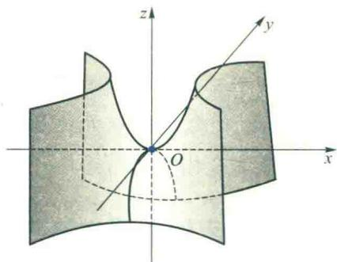
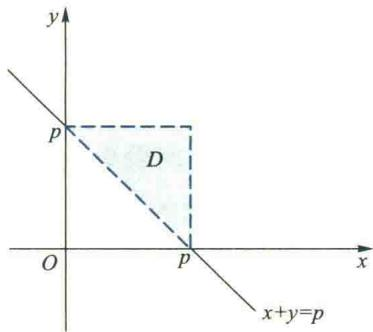
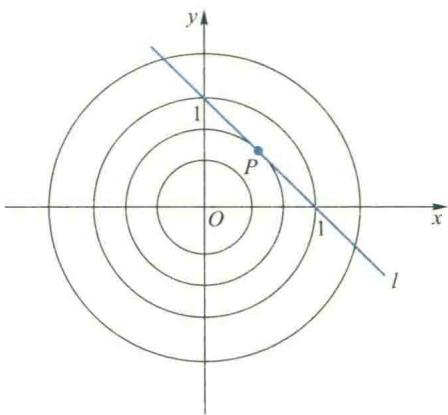

import ExerciseTrigger from '@/components/exercises/ExerciseTrigger.astro';
import QRCodeVideo from '@/components/QRCodeVideo.astro';

import Guide from '@/components/Guide.astro';
import Knowledge from '@/components/Knowledge.astro';
import Example from '@/components/Example.astro';
import Analysis from '@/components/Analysis.astro';
import Solution from '@/components/Solution.astro';
import Variant from '@/components/Variant.astro';
import Note from '@/components/Note.astro';
import SideNote from '@/components/SideNote.astro';
import Block from '@/components/Block.astro';
import Method from '@/components/Method.astro';
import Exercise from '@/components/Exercise.astro';

本节中，首先把一元函数的 Taylor 公式推广到多元函数，然后讨论多元函数的极值与最大值、最小值问题。

本节中，我们首先把一元函数的 Taylor 公式推广到多元函数，然后讨论多元函数的极值问题和最大、最小值问题。本节与第五节中的向量均写成列向量。

## 4.1 多元函数的 Taylor 公式

回顾一元函数的 Taylor 公式，它是用 $x-x_0$ 的 $n$ 次多项式去逼近函数 $f(x)$，即

$$

f(x) = \sum_{k=0}^{n} \frac{f^{(k)}(x_0)}{k!}(x-x_0)^k + R_n, \tag{4.0}

$$

根据 $f(x)$ 满足的不同条件，余项 $R_n$ 可以写成 Lagrange 型余项或 Peano 型余项两种不同形式。

特别当 $n=1$ 时，具有 Lagrange 余项的一阶 Taylor 公式为

$$

f(x) = f(x_0) + f'(x_0)(x-x_0) + R_1,

$$

或

$$

f(x_0 + \Delta x) = f(x_0) + f'(x_0)\Delta x + R_1.

$$

其中 $R_1 = \frac{1}{2!}f''(x_0 + \theta\Delta x)\Delta x^2 \quad (0 < \theta < 1)$。

对于二元函数 $f(x, y)$，我们也可以用由 $x-x_0, y-y_0$ 构成的多项式去逼近它，也就是建立二元函数的 Taylor 公式。下面仅给出二元函数带 Lagrange 余项的 Taylor 公式的一阶形式。

<Knowledge title="定理 4.1">
设二元函数 $z=f(x, y)$ 在点 $(x_0, y_0)$ 的某邻域 $U(x_0, y_0)$ 内有连续的二阶偏导数。$(x_0+\Delta x, y_0+\Delta y) \in U(x_0, y_0)$，则存在 $\theta \in (0, 1)$ 使得

$$

f(x_0 + \Delta x, y_0 + \Delta y) = f(x_0, y_0) + f_x(x_0, y_0)\Delta x + f_y(x_0, y_0)\Delta y + R_1, \tag{4.1}

$$

其中

$$

R_1 = \frac{1}{2!}(f_{xx}\Delta x^2 + 2f_{xy}\Delta x\Delta y + f_{yy}\Delta y^2) \big|_{(x_0+\theta\Delta x, y_0+\theta\Delta y)}. \tag{4.2}

$$

</Knowledge>

<Solution title="证明">
设 $\varphi(t) = f(x_0 + t\Delta x, y_0 + t\Delta y)$，则 $\varphi(0) = f(x_0, y_0)$，$\varphi(1) = f(x_0 + \Delta x, y_0 + \Delta y)$。
由于 $f(x, y)$ 在 $U(x_0, y_0)$ 内有二阶连续偏导数，从而复合函数 $\varphi(t) = f(x_0 + t\Delta x, y_0 + t\Delta y)$ 在 $t=0$ 的某领域内有连续的二阶导数。于是由下列一元函数的带 Lagrange 余项的一阶 Taylor 公式得

$$

\varphi(t) = \varphi(0) + \varphi'(0)t + \frac{1}{2!}\varphi''(\theta t)t^2, \quad 0 < \theta < 1. \tag{4.3}

$$

由于

$$

\varphi'(t) = f_x(x_0 + t\Delta x, y_0 + t\Delta y)\Delta x + f_y(x_0 + t\Delta x, y_0 + t\Delta y)\Delta y,

$$

$$
\varphi''(t) = f_{xx}(x_0 + t\Delta x, y_0 + t\Delta y)\Delta x^2 + 2f_{xy}(x_0 + t\Delta x, y_0 + t\Delta y)\Delta x\Delta y + f_{yy}(x_0 + t\Delta x, y_0 + t\Delta y)\Delta y^2,

$$

所以

$$

\varphi'(0) = f_x(x_0, y_0)\Delta x + f_y(x_0, y_0)\Delta y,

$$

$$
\varphi''(\theta t) = f_{xx}(x_0 + \theta t\Delta x, y_0 + \theta t\Delta y)\Delta x^2 + 2f_{xy}(x_0 + \theta t\Delta x, y_0 + \theta t\Delta y)\Delta x\Delta y + f_{yy}(x_0 + \theta t\Delta x, y_0 + \theta t\Delta y)\Delta y^2.

$$

将 $\varphi(0), \varphi'(0), \varphi''(\theta t)$ 代入 (4.3) 式，再令 $t=1$，便得二元函数的 Taylor 公式 (4.1)。
</Solution>

<SideNote title="思路分析">
二元函数 Taylor 公式证明的基本思路也是引入参数 $t$，将二元函数化为 $t$ 的一元函数 $\varphi(t) = f(x_0 + t\Delta x, y_0 + t\Delta y)$，使要证明的公式 (4.1) 中的各项 ($f(x_0, y_0), f_x(x_0, y_0), f_y(x_0, y_0)$ 及二阶偏导数等) 可利用一元函数 $\varphi(t)$ 的对应项来表示，并利用一元函数 $\varphi(t)$ 的 Taylor 公式来证明。后面关于 $n$ 元函数 Taylor 公式的证明思路类似，只是表达形式复杂些。
</SideNote>

为了将二元函数的 Taylor 公式进一步推广到 $n$ 元函数，我们将 (4.1)、(4.2) 式写成矩阵形式。

令 $\boldsymbol{x}_0 = (x_0, y_0)^{\text{T}}, \Delta \boldsymbol{x} = (x_0 + \Delta x, y_0 + \Delta y)^{\text{T}}$，则 (4.1) 式中一阶导数部分可写成二元函数 $f$ 的梯度向量 $\nabla f(x_0, y_0) = (f_x(x_0, y_0), f_y(x_0, y_0))^{\text{T}}$ 与向量 $\Delta \boldsymbol{x} = (\Delta x, \Delta y)^{\text{T}}$ 的内积形式，即

$$

(f_x\Delta x + f_y\Delta y) \big|_{(x_0, y_0)} = \langle \nabla f(x_0, y_0), \Delta \boldsymbol{x} \rangle.

$$

而 (4.2) 式是关于 $\Delta x, \Delta y$ 的一个二次型，其系数矩阵为

$$

\boldsymbol{H}_f(x_0 + \theta\Delta \boldsymbol{x}) = \begin{bmatrix} f_{xx} & f_{xy} \\ f_{xy} & f_{yy} \end{bmatrix} \bigg|_{(x_0 + \theta\Delta \boldsymbol{x})},

$$

称为函数 $f$ 在 $x_0 + \theta\Delta \boldsymbol{x}$ 处的 Hesse 矩阵，故二次型的矩阵形式为

$$

R_1 = \frac{1}{2!}(\Delta \boldsymbol{x})^{\text{T}} \boldsymbol{H}_f(x_0 + \theta\Delta \boldsymbol{x}) \Delta \boldsymbol{x}.

$$

这样，我们就可把 Taylor 公式 (4.1)、(4.2) 写成如下的矩阵形式

$$

f(x_0 + \Delta \boldsymbol{x}) = f(x_0) + \langle \nabla f(x_0), \Delta \boldsymbol{x} \rangle + \frac{1}{2!}(\Delta \boldsymbol{x})^{\text{T}} \boldsymbol{H}_f(x_0 + \theta\Delta \boldsymbol{x}) \Delta \boldsymbol{x}. \tag{4.4}

$$

由于 $\boldsymbol{H}_f$ 的元素由 $f$ 的二阶偏导数构成，而 $f$ 的所有二阶偏导数均连续，可以证明（从略），

$$

(\Delta \boldsymbol{x})^{\text{T}} \boldsymbol{H}_f(x_0 + \theta\Delta \boldsymbol{x}) \Delta \boldsymbol{x} = (\Delta \boldsymbol{x})^{\text{T}} \boldsymbol{H}_f(x_0) \Delta \boldsymbol{x} + o(\|\Delta \boldsymbol{x}\|^2).

$$

由此得到 $f(\boldsymbol{x})$ 在 $\boldsymbol{x}_0$ 处带有 Peano 余项的二阶 Taylor 公式

$$

f(x_0 + \Delta \boldsymbol{x}) = f(x_0) + \langle \nabla f(x_0), \Delta \boldsymbol{x} \rangle + \frac{1}{2!}(\Delta \boldsymbol{x})^{\text{T}} \boldsymbol{H}_f(x_0) \Delta \boldsymbol{x} + o(\|\Delta \boldsymbol{x}\|^2). \tag{4.5}

$$

<Example title="例 4.1 求函数 $z=z(x,y)$ 的二阶 Taylor 公式">
设函数 $z=z(x,y)$ 是由方程 $z^3 - 2xz + y = 0$ 所确定的隐函数，且 $z(1,1)=1$。求 $z(x,y)$ 在点 $(1,1)$ 处带有 Peano 余项的二阶 Taylor 公式。
</Example>

<Solution title="解">
为求得 $z(x,y)$ 的二阶 Taylor 公式，必须先求得该函数的一、二阶偏导数。对方程 $z^3 - 2xz + y = 0$ 两端求一阶全微分，得

$$

3z^2 \mathrm{d}z - 2(z \mathrm{d}x + x \mathrm{d}z) + \mathrm{d}y = 0,

$$

故

$$

\mathrm{d}z = \frac{2z}{3z^2 - 2x}\mathrm{d}x - \frac{1}{3z^2 - 2x}\mathrm{d}y,

$$

从而

$$

z_x = \frac{2z}{3z^2 - 2x}, \quad z_y = \frac{-1}{3z^2 - 2x}. \tag{4.6}

$$

注意到 $z(1,1)=1$，于是

$$

z_x \big|_{(1,1,1)} = 2, \quad z_y \big|_{(1,1,1)} = -1. \tag{4.7}

$$

对 (4.6) 式再求一阶偏导数可得

$$

z_{xx} = \frac{-2(3z^2 + 2x)z_x + 4z}{(3z^2 - 2x)^2}, \quad z_{xy} = \frac{-2(3z^2 + 2x)z_y}{(3z^2 - 2x)^2}, \quad z_{yy} = \frac{6zz_y}{(3z^2 - 2x)^2},

$$

注意到 (4.7) 式，可得

$$

z_{xx} \big|_{(1,1,1)} = -16, \quad z_{xy} \big|_{(1,1,1)} = z_{yx} \big|_{(1,1,1)} = 10, \quad z_{yy} \big|_{(1,1,1)} = -6. \tag{4.8}

$$

把 (4.8) 式代入公式 (4.5)，便得函数 $z(x,y)$ 在点 $(1,1)$ 处带有 Peano 余项的二阶 Taylor 公式为

$$

z(x,y) = 1 + 2(x-1) - (y-1) + \frac{1}{2!} \left[ -16(x-1)^2 + 20(x-1)(y-1) - 6(y-1)^2 \right] + o(\rho^2),

$$

其中 $\rho^2 = (x-1)^2 + (y-1)^2$.
</Solution>

在将 Taylor 公式推广到 $n (n \ge 3)$ 元函数之前，先介绍 $C^{(m)}$ 类函数的概念。

<Knowledge title="定义 4.1">
设 $f(\boldsymbol{x})$ 是定义在区域 $\Omega \subseteq \mathbf{R}^n$ 内的 $n$ 元函数，若 $f$ 在 $\Omega$ 内连续，则称 $f$ 为 $\Omega$ 上的 $C^{(0)}$ 类函数，记为 $f \in C^{(0)}(\Omega)$，或 $C(\Omega)$；若 $f$ 在 $\Omega$ 内具有连续的 $m (m \ge 1)$ 为正整数阶偏导数，则称 $f$ 为 $\Omega$ 上的 $C^{(m)}$ 类函数，记作 $f \in C^{(m)}(\Omega)$。
</Knowledge>

<Knowledge title="定理 4.2">
设 $n$ 元函数 $f \in C^{(2)}(U(\boldsymbol{x}_0)), \boldsymbol{x}_0 + \Delta \boldsymbol{x} \in U(\boldsymbol{x}_0)$, 其中 $\boldsymbol{x}_0 = (x_{0,1}, x_{0,2}, \dots, x_{0,n})^{\text{T}} \in \mathbf{R}^n, \Delta \boldsymbol{x} = (\Delta x_1, \Delta x_2, \dots, \Delta x_n)^{\text{T}}$。则存在 $\theta \in (0, 1)$，使得

$$

f(\boldsymbol{x}_0 + \Delta \boldsymbol{x}) = f(\boldsymbol{x}_0) + \sum_{i=1}^{n} \frac{\partial f(\boldsymbol{x}_0)}{\partial x_i} \Delta x_i + R_1, \tag{4.9}

$$

其中

$$

R_1 = \frac{1}{2!} \sum_{i=1}^{n} \sum_{j=1}^{n} \frac{\partial^2 f(\boldsymbol{x}_0 + \theta\Delta \boldsymbol{x})}{\partial x_i \partial x_j} \Delta x_i \Delta x_j,

$$

称为 Lagrange 余项的一阶形式。

公式 (4.9) 也可写成如下的矩阵形式：

$$

f(\boldsymbol{x}_0 + \Delta \boldsymbol{x}) = f(\boldsymbol{x}_0) + \langle \nabla f(\boldsymbol{x}_0), \Delta \boldsymbol{x} \rangle + \frac{1}{2!}(\Delta \boldsymbol{x})^{\text{T}} \boldsymbol{H}_f(\boldsymbol{x}_0 + \theta\Delta \boldsymbol{x}) \Delta \boldsymbol{x},

$$

其中实对称矩阵

$$

\boldsymbol{H}_f(\boldsymbol{x}_0 + \theta\Delta \boldsymbol{x}) = \begin{bmatrix} f_{x_1,x_1}(\boldsymbol{x}) & f_{x_1,x_2}(\boldsymbol{x}) & \cdots & f_{x_1,x_n}(\boldsymbol{x}) \\ f_{x_2,x_1}(\boldsymbol{x}) & f_{x_2,x_2}(\boldsymbol{x}) & \cdots & f_{x_2,x_n}(\boldsymbol{x}) \\ \vdots & \vdots & \ddots & \vdots \\ f_{x_n,x_1}(\boldsymbol{x}) & f_{x_n,x_2}(\boldsymbol{x}) & \cdots & f_{x_n,x_n}(\boldsymbol{x}) \end{bmatrix} \bigg|_{\boldsymbol{x}_0 + \theta\Delta \boldsymbol{x}}

$$

是函数 $f$ 在点 $\boldsymbol{x}_0 + \theta\Delta \boldsymbol{x}$ 的 Hesse 矩阵。

由此，类似可得 $n$ 元函数 $f$ 在 $\boldsymbol{x}_0$ 处带有 Peano 余项的 Taylor 公式，其形式与 (4.5) 式完全相同。
</Knowledge>

## 4.2 无约束极值、最大值与最小值

### 1. 无约束极值

在生产实践中，我们总是希望用料最省、时间最短、效益最大、质量最好，等等，这类问题的数学模型往往可归结为多元函数的极值问题。为了讨论这类问题，我们首先把一元函数极值的概念推广到多元函数中来，并建立函数取得极值的条件。

<Knowledge title="定义 4.2">
设 $f: U(\boldsymbol{x}_0) \subseteq \mathbf{R}^n \to \mathbf{R}$，若 $\forall \boldsymbol{x} \in U(\boldsymbol{x}_0)$，恒成立不等式

$$

f(\boldsymbol{x}) \le f(\boldsymbol{x}_0) \quad (f(\boldsymbol{x}) \ge f(\boldsymbol{x}_0)),

$$

则称 $f$ 在点 $\boldsymbol{x}_0$ 取得无约束极大值（无约束极小值）$f(\boldsymbol{x}_0)$，简称极大值（极小值）$f(\boldsymbol{x}_0)$，点 $\boldsymbol{x}_0$ 称为 $f$ 的极大值点（极小值点），极大值与极小值统称为极值，极大值点与极小值点统称为极值点。
</Knowledge>

例如，二元函数 $z=x^2+y^2$ 在点 $(0,0)$ 取得极小值 $0$，而 $z=\sqrt{1-x^2-y^2}$ 在点 $(0,0)$ 取得极大值 $1$，它们所对应的曲面在相应点分别呈现为“谷”和“峰”（图 5.17）。

<figure class="vp-figure">
  
  <figcaption>图 5.17 极值点的几何解释</figcaption>
</figure>

如果二元函数 $z=f(x, y)$ 在点 $(x_0, y_0)$ 的偏导数存在，且 $(x_0, y_0)$ 为 $f$ 的极值点，则一元函数 $f(x, y_0)$ 在 $x=x_0$ 必取得极值。由一元函数极值的必要条件，必有 $f_x(x_0, y_0) = 0$，同理有 $f_y(x_0, y_0) = 0$。因此，若 $f$ 在 $(x_0, y_0)$ 处可微，由梯度计算公式，可得 $f$ 在点 $(x_0, y_0)$ 取得极值的必要条件是

$$

\nabla f(x_0, y_0) = (f_x, f_y)^{\text{T}} \big|_{(x_0, y_0)} = \boldsymbol{0}.

$$

<SideNote title="注意">
定理 4.3 指出 $f$ 的极值点必是 $f$ 的驻点的大前提是 $f$ 在点 $\boldsymbol{x}_0$ 可微。如果 $f$ 在点 $\boldsymbol{x}_0$ 不可微，或偏导数不存在，那么 $\boldsymbol{x}_0$ 必定不是 $f$ 的驻点，但仍有可能是 $f$ 的极值点。例如点 $(0,0)$ 显然是函数 $z = \sqrt{x^2+y^2}$ 的极小值点，但 $(0,0)$ 不是它的驻点。
</SideNote>

<Knowledge title="定理 4.3 (极值的必要条件)">
设 $n$ 元函数 $f$ 在点 $\boldsymbol{x}_0$ 可微，且 $\boldsymbol{x}_0$ 为 $f$ 的极值点，则必有 $\nabla f(\boldsymbol{x}_0) = \boldsymbol{0}$。
</Knowledge>

我们称满足 $\nabla f(\boldsymbol{x}_0) = \boldsymbol{0}$ 的点 $\boldsymbol{x}_0$ 为 $f$ 的驻点。

因此，定理 4.3 可以说成：可微函数 $f$ 的极值点必是 $f$ 的驻点，但是，同一元函数一样，驻点未必都是极值点。例如，二元函数 $f(x, y) = x^2 - y^2$，显然点 $(0,0)$ 是它的驻点，但却不是它的极值点，因为在点 $(0,0)$ 的任何去心邻域内，总有点 $(x, 0)$ 使 $f(x, 0) = x^2 > 0 = f(0,0)$，也总有点 $(0, y)$ 使 $f(0, y) = -y^2 < 0 = f(0,0)$。从 $f$ 的图像（图 5.18）来看，双曲抛物面 $z = x^2 - y^2$ 在原点附近呈现“马鞍形”，既有向上延伸的部分，也有向下延伸的部分，因而函数 $f$ 在该点不能取得极值。

<figure class="vp-figure">
  
  <figcaption>图 5.18 双曲抛物面 $z=x^2-y^2$ 的形状</figcaption>
</figure>

现在，我们利用 Taylor 公式来证明多元函数的极值充分条件。

<Knowledge title="定理 4.4 (极值的充分条件)">
设 $n$ 元函数 $f \in C^{(2)}(U(\boldsymbol{x}_0)), \nabla f(\boldsymbol{x}_0) = \boldsymbol{0}, \boldsymbol{H}_f(\boldsymbol{x}_0)$ 为 $f$ 在 $\boldsymbol{x}_0$ 的 Hesse 矩阵。若 $\boldsymbol{H}_f(\boldsymbol{x}_0)$ 正定（负定），则 $f(\boldsymbol{x}_0)$ 为 $f$ 的极小值（极大值）。
</Knowledge>

<Solution title="证明">
因为 $\nabla f(\boldsymbol{x}_0) = \boldsymbol{0}$，由 Taylor 公式 (4.5) 有

$$

f(\boldsymbol{x}_0 + \Delta \boldsymbol{x}) - f(\boldsymbol{x}_0) = \frac{1}{2!}(\Delta \boldsymbol{x})^{\text{T}} \boldsymbol{H}_f(\boldsymbol{x}_0) \Delta \boldsymbol{x} + o(\|\Delta \boldsymbol{x}\|^2).

$$

当 $\boldsymbol{H}_f(\boldsymbol{x}_0)$ 正定时，由线性代数的知识，知 $\boldsymbol{H}_f(\boldsymbol{x}_0)$ 的最小特征值 $\lambda_1 > 0$，而且，$\forall \Delta \boldsymbol{x} \neq \boldsymbol{0}$，恒有

$$

(\Delta \boldsymbol{x})^{\text{T}} \boldsymbol{H}_f(\boldsymbol{x}_0) \Delta \boldsymbol{x} \ge \lambda_1 \|\Delta \boldsymbol{x}\|^2 > 0.

$$

于是有

$$

f(\boldsymbol{x}_0 + \Delta \boldsymbol{x}) - f(\boldsymbol{x}_0) \ge \frac{1}{2}\lambda_1 \|\Delta \boldsymbol{x}\|^2 + o(\|\Delta \boldsymbol{x}\|^2) = \left[ \frac{1}{2}\lambda_1 + o(1) \right] \|\Delta \boldsymbol{x}\|^2,

$$

其中 $o(1)$ 是当 $\Delta \boldsymbol{x} \to \boldsymbol{0}$ 时的无穷小量。由上式即知，当 $\Delta \boldsymbol{x} \neq \boldsymbol{0}$ 且 $\|\Delta \boldsymbol{x}\|$ 充分小时，就有

$$

f(\boldsymbol{x}_0 + \Delta \boldsymbol{x}) - f(\boldsymbol{x}_0) > 0, \quad \text{或} \quad f(\boldsymbol{x}_0 + \Delta \boldsymbol{x}) > f(\boldsymbol{x}_0),

$$

这就是说，当 $\boldsymbol{H}_f(\boldsymbol{x}_0)$ 正定时，$f(\boldsymbol{x}_0)$ 为 $f$ 的极小值。同理可证，当 $\boldsymbol{H}_f(\boldsymbol{x}_0)$ 负定时，$f(\boldsymbol{x}_0)$ 为 $f$ 的极大值。
</Solution>

根据上述结论，可以得出 $C^{(2)}$ 类函数 $f$ 的极值的步骤：首先求出 $f$ 的所有驻点，然后求出 $f$ 在各个驻点处的 Hesse 矩阵，最后判定 Hesse 矩阵的类型，确定出 $f$ 的极值点。设 $\boldsymbol{x}_0$ 是 $f$ 的驻点，则当 $\boldsymbol{H}_f(\boldsymbol{x}_0)$ 正定时，$f(\boldsymbol{x}_0)$ 是 $f$ 的极小值；当 $\boldsymbol{H}_f(\boldsymbol{x}_0)$ 负定时，$f(\boldsymbol{x}_0)$ 是 $f$ 的极大值；当 $\boldsymbol{H}_f(\boldsymbol{x}_0)$ 不定时，因为二次型 $(\boldsymbol{x}-\boldsymbol{x}_0)^{\text{T}} \boldsymbol{H}_f(\boldsymbol{x}_0) (\boldsymbol{x}-\boldsymbol{x}_0)$ 不定，从而在 $\boldsymbol{x}_0$ 的邻域内 $[f(\boldsymbol{x}) - f(\boldsymbol{x}_0)]$ 不定号，所以 $f(\boldsymbol{x}_0)$ 不是极值。

特别地，对于二元函数 $z=f(x, y)$，若点 $P_0(x_0, y_0)$ 为 $f$ 的驻点，记

$$

f_{xx}(P_0) = A, \quad f_{xy}(P_0) = B, \quad f_{yy}(P_0) = C,

$$

则 $f$ 在点 $P_0$ 的 Hesse 矩阵为

$$

\boldsymbol{H}_f(P_0) = \begin{bmatrix} A & B \\ B & C \end{bmatrix},

$$

于是根据矩阵正定、负定和不定的判定方法，有

1. 若 $A > 0, AC - B^2 > 0$，则 $\boldsymbol{H}_f(P_0)$ 正定，故 $f(P_0)$ 为极小值；
2. 若 $A < 0, AC - B^2 > 0$，则 $\boldsymbol{H}_f(P_0)$ 负定，故 $f(P_0)$ 为极大值；
3. 若 $AC - B^2 < 0$，则 $\boldsymbol{H}_f(P_0)$ 不定，故 $f(P_0)$ 不是极值。

当 $AC - B^2 = 0$，称为临界情况。这时，只根据二阶 Taylor 公式，还不足以确定点 $P_0$ 是不是 $f$ 的极值点。

<Example title="例 4.2 求二元函数 $f(x,y)=x^3+y^3+3xy$ 的极值">
求二元函数 $f(x,y)=x^3+y^3+3xy$ 的极值。
</Example>

<Solution title="解">
首先由

$$

\begin{cases} f_x = 3x^2 + 3y = 0, \\ f_y = 3y^2 + 3x = 0, \end{cases}

$$

容易求出 $f$ 的驻点有两个：$M_1(0,0), M_2(-1,-1)$。其次再求二阶偏导数，得

$$

f_{xx} = 6x, \quad f_{xy} = 3, \quad f_{yy} = 6y,

$$

从而有

$$

\boldsymbol{H}_f(M_1) = \begin{bmatrix} 0 & 3 \\ 3 & 0 \end{bmatrix}, \quad \boldsymbol{H}_f(M_2) = \begin{bmatrix} -6 & 3 \\ 3 & -6 \end{bmatrix}.

$$

显然 $\boldsymbol{H}_f(M_1)$ 不定，$\boldsymbol{H}_f(M_2)$ 负定，故 $M_1$ 不是 $f$ 的极值点，$f(M_2) = 1$ 是 $f$ 的极大值。
</Solution>

<Example title="例 4.3 求函数 $f(x,y)=2x^2-3xy^2+y^4$ 的极值点">
求函数 $f(x,y)=2x^2-3xy^2+y^4$ 的极值点。
</Example>

<Solution title="解">
由

$$

\begin{cases} f_x = 4x - 3y^2 = 0, \\ f_y = 2y(2y^2 - 3x) = 0, \end{cases}

$$

可求出 $f$ 唯一的驻点 $(0,0)$。由于

$$

f_{xx}(0,0) = 4, \quad f_{xy}(0,0) = 0, \quad f_{yy}(0,0) = 0,

$$

所以 $AC - B^2 = 0$，属于临界状态，所以以点 $(0,0)$ 到底是不是极值点需要进一步用极值的定义来讨论。事实上，当 $(x,y) \neq (0,0)$ 时，从

$$

f(x,y) - f(0,0) = 2x^2 - 3xy^2 + y^4 = (2x - y^2)(x - y^2)

$$

可以看出，当 $x < 0$ 时，$f(x,y) > f(0,0)$；当 $\frac{1}{2}y^2 < x < y^2$ 时，$f(x,y) < f(0,0)$，因此 $(0,0)$ 不是 $f$ 的极值点，从而可知 $f$ 没有极值点。
</Solution>

<QRCodeVideo id="5.4.1" title="用定义判定极值问题举例" url="#" />

### 2. 最大值与最小值

设 $f(\boldsymbol{x})$ 在有界闭区域 $\Omega$ 上连续，则 $f$ 在 $\Omega$ 上必能取得最大值与最小值。如果最大值（最小值）在 $\Omega$ 的内部取得，那么这个最大值（最小值）就是 $f$ 的极值，当 $f$ 的偏导数均存在时，它必在 $\Omega$ 内的某个驻点处取得。因此，同一元函数一样，为求连续函数 $f$ 在有界闭区域 $\Omega$ 上的最大值（最小值），可以先求出 $f$ 在 $\Omega$ 内部的一切驻点的值、偏导数不存在处的函数值及 $f$ 在 $\Omega$ 的边界上的最大值（最小值）。这些数中最大（最小）的一个便是所求的最大（最小）值。

<Example title="例 4.4 求函数 $f(x,y)=x^2+2x^2y+y^2$ 在圆域 $D=\{(x,y) \mid x^2+y^2 \le 1\}$ 上的最大值与最小值">
求函数 $f(x,y)=x^2+2x^2y+y^2$ 在圆域 $D=\{(x,y) \mid x^2+y^2 \le 1\}$ 上的最大值与最小值。
</Example>

<Solution title="解">
由

$$
\begin{cases} f_x = 2x(1 + 2y) = 0, \\ f_y = 2(x^2 + y) = 0, \end{cases}
$$

可求出函数 $f$ 在 $D$ 内有三个驻点：$M_1(0,0), M_2\left(\frac{1}{\sqrt{2}}, -\frac{1}{2}\right), M_3\left(-\frac{1}{\sqrt{2}}, -\frac{1}{2}\right)$，且有 $f(M_1) = 0, f(M_2) = f(M_3) = \frac{1}{4}$。

在 $D$ 的边界 $x^2 + y^2 = 1$ 上，函数 $f$ 成为变量 $y$ 的一元函数：

$$
\bar{f} = 1 + 2(1 - y^2)y = 1 + 2y - 2y^3, \quad -1 \le y \le 1.
$$

由 $\frac{\mathrm{d}\bar{f}}{\mathrm{d}y} = 2 - 6y^2 = 0$ 得 $y = \pm\frac{1}{\sqrt{3}}$，比较 $\bar{f}(-1) = \bar{f}(1) = 1$ 与 $\bar{f}\left(\frac{1}{\sqrt{3}}\right) = 1 + \frac{4\sqrt{3}}{9}$、$\bar{f}\left(-\frac{1}{\sqrt{3}}\right) = 1 - \frac{4\sqrt{3}}{9}$ 可知，$f$ 在 $D$ 的边界上的最小值是 $1 - \frac{4\sqrt{3}}{9}$，最大值是 $1 + \frac{4\sqrt{3}}{9}$。

把 $f$ 在 $D$ 内驻点处函数值与它在 $D$ 的边界上的最大值、最小值进行比较，即得

$$
\min_{(x, y) \in D} f(x, y) = 0, \quad \max_{(x, y) \in D} f(x, y) = 1 + \frac{4\sqrt{3}}{9}.
$$
</Solution>

<Example title="例 4.5 在周长为 $2p$ 的所有三角形中，以等边三角形的面积最大">
证明：在周长为 $2p$ 的所有三角形中，以等边三角形的面积最大。
</Example>

<Solution title="证明">
设三角形三边长分别为 $x, y, z$，则由 Heron 面积公式可得目标函数为

$$
S^2 = p(p - x)(p - y)(p - z). \tag{4.10}
$$

由题设条件可知 $x + y + z = 2p$，即 $z = 2p - x - y$，代入 (4.10) 式可将目标函数化为

$$
S^2 = f(x, y) = p(p - x)(p - y)(x + y - p).
$$

于是问题就成为求上列目标函数 $f$ 在区域

$$
D = \{(x, y) \mid 0 < x < p, \quad p - x < y < p \}
$$

上的最大值。

<figure class="vp-figure">
  
  <figcaption>图 5.19 区域 D 示意图</figcaption>
</figure>

由方程组

$$
\begin{cases} f_x = p(p - y)(2p - 2x - y) = 0, \\ f_y = p(p - x)(2p - x - 2y) = 0, \end{cases}
$$

可求出 $f$ 在 $D$ 内有唯一驻点 $M\left(\frac{2p}{3}, \frac{2p}{3}\right)$。因为 $f$ 在有界闭区域 $\overline{D}$ 上连续，故 $f$ 在 $\overline{D}$ 上有最大值。显然 $f$ 在 $\overline{D}$ 的边界上的值恒为 0，而 $f$ 在 $D$ 内部的值大于零，故 $f$ 在 $\overline{D}$ 的最大值必在 $D$ 的内部取到。

由于在 $D$ 内 $f$ 的偏导数存在，且驻点唯一，因而最大值必在驻点 $M$ 处取到。$f(M)$ 为 $f$ 在 $\overline{D}$ 上的最大值，当然也是 $f$ 在 $D$ 内的最大值，即有

$$
\max_{(x, y) \in D} f(x, y) = f\left(\frac{2p}{3}, \frac{2p}{3}\right) = \frac{p^4}{27},
$$

这时 $x = y = z = \frac{2p}{3}$，即面积最大的三角形为等边三角形。
</Solution>

### 3. 最小二乘法

最小二乘法是测量工作和科学实验中常用的一种数据处理方法。例如，根据观测或实验得到自变量 $x$ 和因变量 $y$ 之间的一组数据 $(x_1, y_1), (x_2, y_2), \dots, (x_n, y_n)$，要求寻找一个适当类型的函数 $y = f(x)$，使得该函数在各点处的值与观测值的偏差

$$
r_i = f(x_i) - y_i \quad (i = 1, \dots, n)
$$

的平方和 $\sum_{i=1}^{n} r_i^2$ 达到最小。这种根据偏差平方和为最小的条件来确定参数的方法就叫做最小二乘法。

<Example title="例 4.6 人口增长函数的最佳拟合曲线">
根据 1971 年到 1982 年我国内地总人口数的统计数据，利用最小二乘法建立我国人口增长的最佳拟合曲线，并预测 1990 年时我国总人口数。
</Example>

<Solution title="解">
采用指数函数 $N = \mathrm{e}^{a + bt}$ 对数据进行拟合。两边取对数得 $\ln N = a + bt$，按照最小二乘法，问题归结为选择参数 $a$ 和 $b$，使得偏差平方和

$$
Q(a, b) \stackrel{\mathrm{def}}{=} \sum_{i=1}^{12} (a + bt_i - \ln N_i)^2 \tag{4.11}
$$

为最小。利用极值的必要条件 $\frac{\partial Q}{\partial a} = 0, \frac{\partial Q}{\partial b} = 0$，整理得

$$
\begin{cases} 12 a + \left(\sum_{i=1}^{12} t_i\right) b = \sum_{i=1}^{12} \ln N_i, \\ \left(\sum_{i=1}^{12} t_i\right) a + \left(\sum_{i=1}^{12} t_i^2\right) b = \sum_{i=1}^{12} (\ln N_i) t_i. \end{cases}
$$

解此方程组可得函数 $Q(a, b)$ 的唯一驻点：

$$
\bar{a} = -28.01872, \quad \bar{b} = 0.01531.
$$

因此，所求人口增长问题的最佳拟合曲线是

$$
N(t) = \mathrm{e}^{-28.01872 + 0.01531 t}. \tag{4.12}
$$

由此函数预测 1990 年时我国内地总人口数为 $N(1990) = 11.53993\text{ 亿}$。

<figure class="vp-figure">
  
  <figcaption>图 5.20 人口增长的最佳拟合曲线图</figcaption>
</figure>
</Solution>

### 4. 最优化的产出水平

设某工厂生产两种产品，总成本为 $C = C(q_1, q_2)$，总收益为 $R = R(q_1, q_2)$。利润函数为 $L = R(q_1, q_2) - C(q_1, q_2)$。求最大利润的必要条件为边际收益与边际成本相等：

$$
\frac{\partial R}{\partial q_1} = \frac{\partial C}{\partial q_1}, \quad \frac{\partial R}{\partial q_2} = \frac{\partial C}{\partial q_2}. \tag{4.14}
$$

<Example title="例 4.7 两种产品的利润最大化产量决策">
某工厂生产两种产品，总成本函数为 $C = q_1^2 + 2q_1q_2 + q_2^2 + 5$，需求函数分别为 $q_1 = 2600 - p_1, q_2 = 1000 - \frac{1}{4}p_2$。为使工厂获得最大利润，试确定两种产品的产量。
</Example>

<Solution title="解">
由需求函数得反需求函数 $p_1 = 2600 - q_1, p_2 = 4000 - 4q_2$，总收益函数为

$$
R = p_1 q_1 + p_2 q_2 = 2600 q_1 + 4000 q_2 - q_1^2 - 4 q_2^2.
$$

根据边际收益等于边际成本条件，整理得方程组

$$
\begin{cases} 2q_1 + q_2 = 1300, \\ q_1 + 5q_2 = 2000. \end{cases}
$$

解之得 $q_1 = 500, q_2 = 300$。此时最大利润为 $L = 1\,249\,995\text{ 元}$。
</Solution>

## 4.3 有约束极值与 Lagrange 乘数法

无约束极值问题中，目标函数各个自变量是独立变化的。但大量实际极值问题的自变量常附带有限制条件，这类附有约束条件的极值问题，称为**有约束极值（或条件极值）**问题。

例如，求函数 $z = x^2 + y^2$ 在约束条件 $x + y - 1 = 0$ 下的有约束极小值。容易算出该极小值等于 $\frac{1}{2}$，且在点 $\left(\frac{1}{2}, \frac{1}{2}\right)$ 处取得。

<figure class="vp-figure">
  
  <figcaption>图 5.21 曲面与平面交线上的极小值</figcaption>
</figure>

<figure class="vp-figure">
  
  <figcaption>图 5.22 等值线与约束直线的切点</figcaption>
</figure>

有约束极值的一般形式是在条件组 $\varphi_k(x_1, \dots, x_n) = 0$ ($k = 1, \dots, m, m < n$) 的限制下，求目标函数 $u = f(x_1, \dots, x_n)$ 的极值。

<SideNote title="思路分析">
Lagrange 乘数法通过构造辅助函数，将带约束的极值问题转化为无约束的极值问题。
</SideNote>

Lagrange 乘数法就是一种不直接依赖消元而求解有约束极值的有效方法。我们从一种简单情形来说明这种方法。

Lagrange 乘数法 设目标函数

$$
z = f(x, y) \tag{4.17}
$$

在约束条件

$$
\varphi(x, y) = 0 \tag{4.18}
$$

下取得极值，且 $(x_0, y_0)$ 为其极值点；并设 $f, \varphi \in C^{(1)}(U(x_0, y_0))$，且 $\varphi_y(x_0, y_0) \neq 0$，于是有

$$
\varphi(x_0, y_0) = 0, \tag{4.19}
$$

且由隐函数存在定理（定理 3.6）可知，方程 (4.18) 确定了一可导函数 $y = y(x)$，它满足 $\varphi[x, y(x)] \equiv 0$ 且 $y_0 = y(x_0)$，把它代入目标函数 (4.17) 得

$$
z = f[x, y(x)]. \tag{4.20}
$$

这样一来，我们把 (4.17) 在条件 (4.18) 下的有约束极值问题化成了一元函数 (4.20) 的无约束极值问题，而且 $x = x_0$ 就是函数 (4.20) 的极值点。由一元可导函数取得极值的必要条件可知

$$
\left. \frac{\mathrm{d}z}{\mathrm{d}x} \right|_{x=x_0} = f_x(x_0, y_0) + f_y(x_0, y_0) \left. \frac{\mathrm{d}y}{\mathrm{d}x} \right|_{x=x_0} = 0. \tag{4.21}
$$

对约束条件 (4.18) 应用函数求导法则，得

$$
\left. \frac{\mathrm{d}y}{\mathrm{d}x} \right|_{x=x_0} = -\frac{\varphi_x(x_0, y_0)}{\varphi_y(x_0, y_0)},
$$

代入 (4.21) 式得

$$
f_x(x_0, y_0) - f_y(x_0, y_0) \frac{\varphi_x(x_0, y_0)}{\varphi_y(x_0, y_0)} = 0. \tag{4.22}
$$

于是，(4.19) 与 (4.22) 两式就是所求有约束极值的必要条件。从此两式中解出的 $(x_0, y_0)$ 就可能是所求的有约束极值的极值点（有约束极值点也称为条件极值点）。

为了使 (4.22) 式的形式更为对称，我们利用行列式把它写成

$$
\begin{vmatrix}
f_x(x_0, y_0) & f_y(x_0, y_0) \\
\varphi_x(x_0, y_0) & \varphi_y(x_0, y_0)
\end{vmatrix} = 0.
$$

由行列式的性质，其两行的对应元素成比例，令此比例系数为 $-\lambda_0$，于是上述有约束极值的必要条件可写成

$$
\begin{cases}
f_x(x_0, y_0) + \lambda_0 \varphi_x(x_0, y_0) = 0, \\
f_y(x_0, y_0) + \lambda_0 \varphi_y(x_0, y_0) = 0, \\
\varphi(x_0, y_0) = 0.
\end{cases} \tag{4.23}
$$

容易看出，(4.23) 式就是三元函数

$$
L(x, y, \lambda) = f(x, y) + \lambda \varphi(x, y) \tag{4.24}
$$

在 $(x_0, y_0, \lambda_0)$ 取得无约束极值的必要条件。所以要求目标函数 (4.17) 在约束条件 (4.18) 下的有约束极值点 $(x_0, y_0)$，可以先构成函数 (4.24)，然后令它的三个偏导数为零得

$$
\begin{cases}
L_x(x, y, \lambda) = f_x(x, y) + \lambda \varphi_x(x, y) = 0, \\
L_y(x, y, \lambda) = f_y(x, y) + \lambda \varphi_y(x, y) = 0, \\
L_\lambda(x, y, \lambda) = \varphi(x, y) = 0.
\end{cases} \tag{4.25}
$$

再从这三个方程中解出 $x_0, y_0, \lambda_0$，则其中的点 $(x_0, y_0)$ 就可能是所求的有约束极值点。函数 (4.24) 称为 **Lagrange 函数**，数 $\lambda$ 称为 **Lagrange 乘数**，这种求有约束极值点的必要条件的方法称为 **Lagrange 乘数法**，$(x_0, y_0, \lambda_0)$ 就是 Lagrange 函数 $L$ 的驻点。

<QRCodeVideo id="5.4.2" title="二元函数与一元函数极值问题的差异" url="#" />

方程组 (4.25) 也可写成向量形式

$$
\begin{cases}
\nabla f(P) = -\lambda \nabla \varphi(P), \\
\varphi(P) = 0,
\end{cases} \tag{4.26}
$$

其中 $\nabla f = (f_x, f_y)$ 是函数 $f$ 的梯度，$\nabla \varphi$ 是 $\varphi$ 的梯度。

我们可以利用等值线由 (4.26) 给出 Lagrange 乘法的几何解释。设函数 $f(x, y)$ 的等值线 $f(x, y) = C$，如图 5.23 所示，其中 $C_1 > C_2 > C_3 > \cdots$，并设约束条件 $\varphi(x, y) = 0$ 为曲线 $\Gamma$。求此约束条件下函数 $f$ 的极大值点，在几何上就是在 $\Gamma$ 上寻找使 $f$ 达到极大值的点，它显然应是曲线 $\Gamma$ 与某等值线相切的点 $P_0(x_0, y_0)$，不可能是它们的交点（如图 5.23 所示）。否则，$\Gamma$ 必从该等值线穿出，说明 $f$ 在交点处的值不是在此点邻域内的极大值，$\Gamma$ 上还存在着使 $f$ 取更大量的值的点。（同理，在约束 $\varphi(x, y) = 0$ 下 $f$ 的极小值点应是与另一等值线 $f = C$ 的切点 $P_1$。）由于等值线 $f = C$ 与约束曲线 $\varphi(x, y) = 0$ 在点 $P_0$ 相切，它们在点 $P_0$ 应有相同的法向量。注意到 $f$ 在点 $P_0$ 的梯度 $\nabla f(P_0)$ 就是等值线 $f(x, y) = C$ 在点 $P_0$ 的一个法向量；而 $\nabla \varphi(P_0)$ 是曲线 $\varphi(x, y) = 0$ 在点 $P_0$ 的一个法向量，所以应有

$$
\nabla f(P_0) \parallel \nabla \varphi(P_0),
$$

因此必存在常数 $-\lambda$ 使

$$
\nabla f(P_0) = -\lambda \nabla \varphi(P_0),
$$

其中 $P_0$ 满足方程 $\varphi(P_0) = 0$。

<figure class="vp-figure">
  
  <figcaption>图 5.23 Lagrange 乘数法的几何解释</figcaption>
</figure>

<SideNote title="注意">
由于方程 $f(x, y) = C$ 所确定的等值线在点 $P_0$ 的切线方程为
$$
y - y_0 = \left. \frac{\mathrm{d}y}{\mathrm{d}x} \right|_{x_0} (x - x_0),
$$
根据隐函数求导法，$\left. \frac{\mathrm{d}y}{\mathrm{d}x} \right|_{x_0} = -\frac{f_x(P_0)}{f_y(P_0)}$，故等值线 $f(x, y) = C$ 在点 $P_0$ 的切线方程为 $f_x(P_0)(x - x_0) + f_y(P_0)(y - y_0) = 0$。
</SideNote>

Lagrange 函数 $L$ 的驻点 $(x_0, y_0, \lambda_0)$ 中的 $(x_0, y_0)$ 是否真是有约束极值点？是极大值点还是极小值点？严格来说，需要另行判定。但是对于具体的实际问题来说，在求得 $(x_0, y_0)$ 后，可以由问题的实际意义来直接判断，而且由必要条件所求得的 $(x_0, y_0)$ 往往就是所求的条件极值点。

<Example title="例 4.8 欲生产容积为常数 $V$ 的无盖长方体盒子，如何设计可使盒子的表面积最小？">
解 设盒子的长、宽、高分别为 $x, y, z$，则问题就是求目标函数（无盖长方体盒子表面积）
$$
f(x, y, z) = 2xz + 2yz + xy
$$
在约束条件
$$
xyz - V = 0
$$
下的最小值。应用 Lagrange 乘数法，令
$$
L(x, y, z, \lambda) = 2xz + 2yz + xy + \lambda(xyz - V),
$$
求 $L$ 对各个变量的偏导数，并令它们都等于 0，得
$$
\begin{cases}
L_x = 2z + y + \lambda yz = 0, & (1) \\
L_y = 2z + x + \lambda xz = 0, & (2) \\
L_z = 2x + 2y + \lambda xy = 0, & (3) \\
L_\lambda = xyz - V = 0, & (4)
\end{cases}
$$
(1)－(2)得
$$
(y - x)(1 + \lambda z) = 0, \tag{4.27}
$$
$2 \times$ (2)－(3)得
$$
(2z - y)(2 + \lambda x) = 0, \tag{4.28}
$$
由 (4.27) 及 (4.28) 得
$$
x = y = 2z, \tag{4.29}
$$
把 (4.29) 代入 (4) 得唯一解
$$
z = \frac{1}{2} \sqrt[3]{2V}, \quad x = y = \sqrt[3]{2V}, \quad \lambda = -2 \frac{1}{\sqrt[3]{2V}}.
$$
于是 Lagrange 函数 $L$ 有唯一驻点，因此 $\left( \sqrt[3]{2V}, \sqrt[3]{2V}, \frac{1}{2} \sqrt[3]{2V} \right)$ 是函数 $f$ 可能取得条件极值的唯一一组解。由于体积 $V$ 是常数，当盒子的一条边，例如 $z$ 很小时，盒子很薄其表面积很大；随着 $z$ 的增大，表面积将逐渐变小，当 $z$ 变得很大时，盒子又变得很薄，从而其表面积又变得很大。由此容易看出盒子的最小表面积是存在的，故当 $x = y = \sqrt[3]{2V}, z = \frac{1}{2} \sqrt[3]{2V}$ 时，即盒子的底面为正方形、而高等于底边长的一半时，盒子的表面积最小。
</Example>

<SideNote title="注">
用 Lagrange 乘数法求二元函数 $z = f(x, y)$ 在约束条件 $\varphi(x, y) = 0$ 下的极值点，在几何上就是求该函数的等值线与约束曲线 $\Gamma: \varphi(x, y) = 0$ 的公共切点。对三元函数也可得到类似的结论。用这个结论在求解某些约束极值问题时可能较为简便。
</SideNote>

对于 Lagrange 乘数法，以上讲了约束条件只有一个的情形。实际上，这种方法也适用于约束条件有多个的情形。我们不加推导地指出，对于一般的有约束极值问题 (4.15)、(4.16)，运用这种方法时，需要构造的 Lagrange 函数是

$$
L(x_1, \cdots, x_n, \lambda_1, \cdots, \lambda_m) = f(x_1, \cdots, x_n) + \sum_{k=1}^{m} \lambda_k \varphi_k(x_1, \cdots, x_n),
$$

而要求该有约束极值问题的极值点，也是在上述 Lagrange 函数的驻点中去寻求。

***

<ExerciseTrigger chapter={5} section="5.4" title="5.4 多元函数的Taylor公式与极值问题 课后真题与自测练习" />
