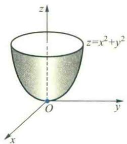
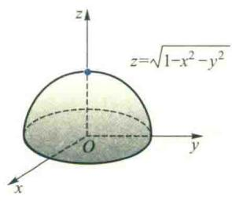
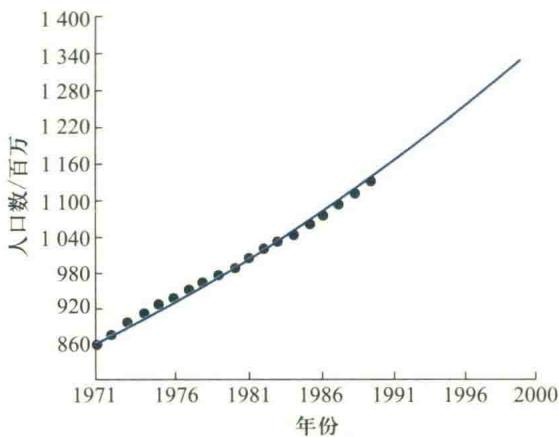
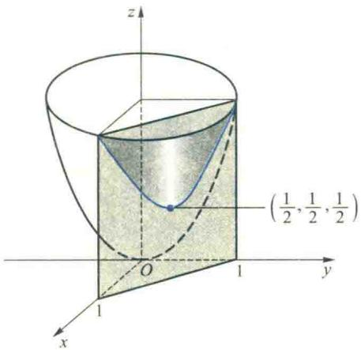
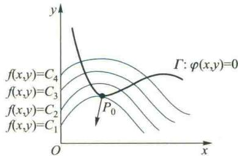
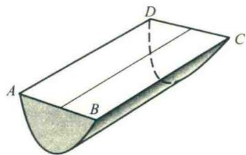

import ExerciseTrigger from '@/components/exercises/ExerciseTrigger.astro';
import QRCodeVideo from '@/components/QRCodeVideo.astro';

import Guide from '@/components/Guide.astro';
import Knowledge from '@/components/Knowledge.astro';
import Example from '@/components/Example.astro';
import Analysis from '@/components/Analysis.astro';
import Solution from '@/components/Solution.astro';
import Variant from '@/components/Variant.astro';
import Note from '@/components/Note.astro';
import Block from '@/components/Block.astro';
import Method from '@/components/Method.astro';
import Exercise from '@/components/Exercise.astro';

本节中,我们首先把一元函数的 Taylor 公式推广到多元函数,然后讨论多元函数的极值问题和最大、最小值问题.本节与第五节中的向量均写成列向量.

## 4.1 多元函数的 Taylor 公式

回顾一元函数的 Taylor 公式, 它是用 $x - x_{0}$ 的 n 次多项式去逼近函数 $f(x)$ , 即

$$
f (x) = \sum_ {k = 0} ^ {n} \frac {f ^ {(k)} (x _ {0})}{k !} (x - x _ {0}) ^ {k} + R _ {n},
$$

根据 $f(x)$ 满足的不同条件,余项 $R_{n}$ 可以写成Lagrange型余项或Peano型余项两种不同形式.

特别当 n=1 时, 具有 Lagrange 余项的一阶 Taylor 公式为

$$
f (x) = f \left(x _ {0}\right) + f ^ {\prime} \left(x _ {0}\right) \left(x - x _ {0}\right) + R _ {1},
$$

或

$$
f (x _ {0} + \Delta x) = f (x _ {0}) + f ^ {\prime} (x _ {0}) \Delta x + R _ {1}.
$$

其中 $R_{1}=\frac{1}{2!}f''(x_{0}+\theta\Delta x)\Delta x^{2}(0<\theta<1)$ .

对于二元函数 $f(x, y)$ ，我们也可以用由 $x - x_0, y - y_0$ 构成的多项式去逼近它，也就是建立二元函数的 Taylor 公式。下面仅给出二元函数带 Lagrange 余项的 Taylor 公式的一阶形式。

<Knowledge title="定理 4.1">
设二元函数 $z=f(x,y)$ 在点 $(x_{0},y_{0})$ 的某邻域 $U(x_{0},y_{0})$ 内有连续的二阶偏导数. $(x_{0}+\Delta x,y_{0}+\Delta y)\in U(x_{0},y_{0})$ ，则存在 $\theta\in(0,1)$ 使得

$$
f (x _ {0} + \Delta x, y _ {0} + \Delta y) = f (x _ {0}, y _ {0}) + f _ {x} (x _ {0}, y _ {0}) \Delta x + f _ {y} (x _ {0}, y _ {0}) \Delta y + R _ {1},\tag{4.1}
$$

其中

$$
R _ {1} = \frac {1}{2 !} (f _ {x x} \Delta x ^ {2} + 2 f _ {x y} \Delta x \Delta y + f _ {y y} \Delta y ^ {2}) | _ {(x _ {0} + \theta \Delta x, y _ {0} + \theta \Delta y)}.\tag{4.2}
$$

<Solution title="证明">
设 $\varphi(t) = f(x_0 + t\Delta x, y_0 + t\Delta y)$ ，则 $\varphi(0) = f(x_0, y_0), \varphi(1) = f(x_0 + \Delta x, y_0 + \Delta y)$ . 由于 $f(x, y)$ 在 $U(x_0, y_0)$ 内有二阶连续偏导数，从而复合函数 $\varphi(t) = f(x_0 + t\Delta x, y_0 + t\Delta y)$ 在 $t = 0$ 的某邻域内有连续的二阶导数. 于是由上列一元函数的带Lagrange余项的一阶Taylor公式得

$$
\varphi (t) = \varphi (0) + \varphi^ {\prime} (0) t + \frac {1}{2 !} \varphi^ {\prime \prime} (\theta t) t ^ {2}, 0 <   \theta <   1.\tag{4.3}
$$

由于

$$
\varphi^ {\prime} (t) = f _ {x} \left(x _ {0} + t \Delta x, y _ {0} + t \Delta y\right) \Delta x + f _ {y} \left(x _ {0} + t \Delta x, y _ {0} + t \Delta y\right) \Delta y,
$$

$$
\varphi^ {\prime \prime} (t) = f _ {x x} \left(x _ {0} + t \Delta x, y _ {0} + t \Delta y\right) \Delta x ^ {2} + 2 f _ {x y} \left(x _ {0} + t \Delta x, y _ {0} + t \Delta y\right) \Delta x \Delta y +
$$

$$
f _ {y y} (x _ {0} + t \Delta x, y _ {0} + t \Delta y) \Delta y ^ {2},
$$

所以

$$
\begin{array}{r l} \varphi^ {\prime} (0) & = f _ {x} (x _ {0}, y _ {0}) \Delta x + f _ {y} (x _ {0}, y _ {0}) \Delta y, \\ \varphi^ {\prime \prime} (\theta t) & = f _ {x x} (x _ {0} + \theta t \Delta x, y _ {0} + \theta t \Delta y) \Delta x ^ {2} + \\ & 2 f _ {x y} (x _ {0} + \theta t \Delta x, y _ {0} + \theta t \Delta y) \Delta x \Delta y + \\ & f _ {y y} (x _ {0} + \theta t \Delta x, y _ {0} + \theta t \Delta y) \Delta y ^ {2}. \end{array}
$$

将 $\varphi(0)$ , $\varphi'(0)$ , $\varphi''(\theta t)$ 代入 (4.3) 式, 再令 t=1, 便得二元函数的 Taylor 公式 (4.1).

为了将二元函数的 Taylor 公式进一步推广到 n 元函数, 我们将(4.1)、(4.2)式写成矩阵形式.
</Solution>
</Knowledge>

二元函数Taylor公式证明的基本思路也是引入参数 $t$ ，将二元函数化为 $t$ 的一元函数 $\varphi (t) = f(x_0 + t\Delta x,y_0 + t\Delta y)$ ，使要证明的公式(4.1)中的各项 $(f(x_0,y_0),f_x(x_0,y_0),f_y(x_0,y_0)$ 及二阶偏导数等）可利用一元函数 $\varphi (t)$ 的对应项来表示，并利用一元函数 $\varphi (t)$ 的Taylor公式来证明.后面关于 $n$ 元函数Taylor公式的证明思路类似，只是表达形式更复杂些

令 $x_0 = (x_0, y_0)^{\mathrm{T}}, x_0 + \Delta x = (x_0 + \Delta x, y_0 + \Delta y)^{\mathrm{T}}$ ，则

(4.1)式中一阶导数部分可写成二元函数 $f$ 的梯度向量 $\nabla f(x_0, y_0) = (f_x(x_0, y_0), f_y(x_0, y_0))$ 与向量 $\Delta x = (\Delta x, \Delta y)^{\mathrm{T}}$ 的内积形式，即

$$
\left(f _ {x} \Delta x + f _ {y} \Delta y\right) \mid_ {(x _ {0}, y _ {0})} = \langle \nabla f (x _ {0}, y _ {0}), \Delta x \rangle .
$$

而(4.2)式是关于 $\Delta x, \Delta y$ 的一个二次型, 其系数矩阵为

$$
\boldsymbol {H} _ {f} \left(\boldsymbol {x} _ {0} + \theta \Delta \boldsymbol {x}\right) = \left[ \begin{array}{l l} f _ {x x} & f _ {x y} \\ f _ {x y} & f _ {y y} \end{array} \right] \Bigg | _ {\left(\boldsymbol {x} _ {0} + \theta \Delta \boldsymbol {x}\right)},
$$

称为函数 f 在 $x_{0} + \theta \Delta x$ 处的 Hesse 矩阵, 故二次型的矩阵形式为

$$
R _ {1} = \frac {1}{2 !} (\Delta x) ^ {\mathrm{T}} H _ {f} (x _ {0} + \theta \Delta x) \Delta x.
$$

这样,我们就可把 Taylor 公式(4.1)、(4.2)写成如下的矩阵形式

$$
f (\boldsymbol {x} _ {0} + \Delta \boldsymbol {x}) = f (\boldsymbol {x} _ {0}) + \langle \nabla f (\boldsymbol {x} _ {0}), \Delta \boldsymbol {x} \rangle + \frac {1}{2 !} (\Delta \boldsymbol {x}) ^ {\mathrm{T}} \boldsymbol {H} _ {f} (\boldsymbol {x} _ {0} + \theta \Delta \boldsymbol {x}) \Delta \boldsymbol {x}.\tag{4.4}
$$

由于 $H_{f}$ 的元素由 f 的二阶偏导数构成, 而 f 的所有二阶偏导数均连续, 可以证明 (从略),

$$
(\Delta \boldsymbol {x}) ^ {\mathrm{T}} \boldsymbol {H} _ {f} (\boldsymbol {x} _ {0} + \theta \Delta \boldsymbol {x}) \Delta \boldsymbol {x} = (\Delta \boldsymbol {x}) ^ {\mathrm{T}} \boldsymbol {H} _ {f} (\boldsymbol {x} _ {0}) \Delta \boldsymbol {x} + o (\| \Delta \boldsymbol {x} \| ^ {2}).
$$

由此得到 $f(\pmb{x})$ 在 $\pmb{x}_0$ 处带有Peano余项的二阶Taylor公式

$$
f \left(\boldsymbol {x} _ {0} + \Delta \boldsymbol {x}\right) = f \left(\boldsymbol {x} _ {0}\right) + \langle \nabla f \left(\boldsymbol {x} _ {0}\right), \Delta \boldsymbol {x} \rangle + \frac {1}{2 !} (\Delta x) ^ {\mathrm{T}} \boldsymbol {H} _ {f} \left(\boldsymbol {x} _ {0}\right) \Delta \boldsymbol {x} + o (\| \Delta \boldsymbol {x} \| ^ {2}).\tag{4.5}
$$

<Example title="例 4.1">
设函数 $z=z(x,y)$ 是由方程 $z^{3}-2xz+y=0$ 所确定的隐函数，且 $z(1,1)=1$ . 求 $z(x,y)$ 在点 $(1,1)$ 处带有 Peano 余项的二阶 Taylor 公式.

<Solution title="解">
为求得 $z(x,y)$ 的二阶Taylor公式，必须先求得该函数的一、二阶偏导数.对方程 $z^3 -2xz + y = 0$ 两端求一阶全微分，得

$$
3 z ^ {2} \mathrm{d} z - 2 (z \mathrm{d} x + x \mathrm{d} z) + \mathrm{d} y = 0,
$$

故

$$
\mathrm{d} z = \frac {2 z}{3 z ^ {2} - 2 x} \mathrm{d} x - \frac {1}{3 z ^ {2} - 2 x} \mathrm{d} y,
$$

从而

$$
z _ {x} = \frac {2 z}{3 z ^ {2} - 2 x}, \quad z _ {y} = \frac {- 1}{3 z ^ {2} - 2 x}.\tag{4.6}
$$
</Solution>
</Example>

意到 $z(1,1) = 1$ ，于是

$$
z _ {x} \mid_ {(1, 1, 1)} = 2, \quad z _ {y} \mid_ {(1, 1, 1)} = - 1.\tag{4.7}
$$

对(4.6)式再求一阶偏导数可得

$$
z _ {x x} = \frac {- 2 (3 z ^ {2} + 2 x) z _ {x} + 4 z}{(3 z ^ {2} - 2 x) ^ {2}}, \quad z _ {x y} = \frac {- 2 (3 z ^ {2} + 2 x) z _ {y}}{(3 z ^ {2} - 2 x) ^ {2}}, \quad z _ {y y} = \frac {6 z z _ {y}}{(3 z ^ {2} - 2 x) ^ {2}}.
$$

意到(4.7)式,可得

$$
z _ {x x} \mid_ {(1, 1, 1)} = - 1 6, \quad z _ {x y} \mid_ {(1, 1, 1)} = z _ {y x} \mid_ {(1, 1, 1)} = 1 0, \quad z _ {y y} \mid_ {(1, 1, 1)} = - 6.\tag{4.8}
$$

把(4.8)式代入公式(4.5)，便得函数 $z(x,y)$ 在点 $(1,1)$ 处带有Peano余项的二阶Taylor公式为

$$
\begin{array}{r l} z (x, y) & = 1 + 2 (x - 1) - (y - 1) + \\ & \frac {1}{2 !} [ - 1 6 (x - 1) ^ {2} + 2 0 (x - 1) (y - 1) - 6 (y - 1) ^ {2} ] + o (\rho^ {2}), \end{array}
$$

其中 $\rho^{2}=(x-1)^{2}+(y-1)^{2}$ .

在将 Taylor 公式推广到 $n (n \geqslant 3)$ 元函数之前, 先介绍 $C^{(m)}$ 类函数的概念.

<Knowledge title="定义 4.1">
设 $f(x)$ 是定义在区域 $\Omega \subseteq R^{n}$ 内的 n 元函数, 若 f 在 $\Omega$ 内连续, 则称 f 是 $\Omega$ 上的 $C^{(0)}$ 类函数, 记为 $f \in C^{(0)}(\Omega)$ , 或 $C(\Omega)$ ; 若 f 在 $\Omega$ 内具有连续的 m ( $m \geqslant 1$ , 为正整数) 阶偏导数, 则称 f 是 $\Omega$ 上的 $C^{(m)}$ 类函数, 记作 $f \in C^{(m)}(\Omega)$ .

用与证明定理 4.1 类似的思想方法不难证明下列定理.
</Knowledge>

<Knowledge title="定理 4.2">
设 n 元函数 $f \in C^{(2)}(U(x_0))$ , $x_0 + \Delta x \in U(x_0)$ ，其中 $x_0 = (x_{0,1}, x_{0,2}, \cdots, x_{0,n})^{\mathrm{T}} \in \mathbf{R}^n$ , $\Delta x = (\Delta x_1, \Delta x_2, \cdots, \Delta x_n)^{\mathrm{T}}$ . 则存在 $\theta \in (0, 1)$ ，使得

$$
f (\boldsymbol {x} _ {0} + \Delta \boldsymbol {x}) = f (\boldsymbol {x} _ {0}) + \sum_ {i = 1} ^ {n} \frac {\partial f (\boldsymbol {x} _ {0})}{\partial x _ {i}} \Delta x _ {i} + R _ {1},\tag{4.9}
$$

其中

$$
R _ {1} = \frac {1}{2 !} \sum_ {i = 1} ^ {n} \sum_ {j = 1} ^ {n} \frac {\partial^ {2} f (\boldsymbol {x} _ {0} + \theta \Delta \boldsymbol {x})}{\partial x _ {i} \partial x _ {j}} \Delta x _ {i} \Delta x _ {j},
$$

称为 Lagrange 余项的一阶形式.
</Knowledge>

公式(4.9)也可写成如下的矩阵形式：

$$
f \left(\boldsymbol {x} _ {0} + \Delta \boldsymbol {x}\right) = f \left(\boldsymbol {x} _ {0}\right) + \left\langle \nabla f \left(\boldsymbol {x} _ {0}\right), \Delta \boldsymbol {x} \right\rangle + \frac {1}{2 !} (\Delta \boldsymbol {x}) ^ {\mathrm{T}} \boldsymbol {H} _ {f} \left(\boldsymbol {x} _ {0} + \theta \Delta \boldsymbol {x}\right) \Delta \boldsymbol {x},
$$

其中实对称矩阵

$$
\boldsymbol {H} _ {f} \left(\boldsymbol {x} _ {0} + \theta \Delta \boldsymbol {x}\right) = \left[ \begin{array}{c c c c} f _ {x _ {1} x _ {1}} (\boldsymbol {x}) & f _ {x _ {1} x _ {2}} (\boldsymbol {x}) & \dots & f _ {x _ {1} x _ {n}} (\boldsymbol {x}) \\ f _ {x _ {2} x _ {1}} (\boldsymbol {x}) & f _ {x _ {2} x _ {2}} (\boldsymbol {x}) & \dots & f _ {x _ {2} x _ {n}} (\boldsymbol {x}) \\ \vdots & \vdots & & \vdots \\ f _ {x _ {n} x _ {1}} (\boldsymbol {x}) & f _ {x _ {n} x _ {2}} (\boldsymbol {x}) & \dots & f _ {x _ {n} x _ {n}} (\boldsymbol {x}) \end{array} \right] _ {\boldsymbol {x} _ {0} + \theta \Delta \boldsymbol {x}}
$$

是函数f在点 $x_{0}+\theta\Delta x$ 的Hesse矩阵.

由此,类似可得 n 元函数 f 在 $x_{0}$ 处带有 Peano 余项的 Taylor 公式,其形式与 (4.5) 式完全相同.

## 4.2 无约束极值、最大值与最小值

### 1. 无约束极值

在生产实践中,我们总是希望用料最省、时间最短、效益最大、质量最好,等等,这类问题的数学模型往往就可归结为多元函数的极值问题.为了讨论这类问题,我们首先把一元函数极值的概念推广到多元函数中来,并建立函数取得极值的条件.

<Knowledge title="定义 4.2">
设 $f: U(x_{0}) \subseteq \mathbf{R}^{n} \rightarrow \mathbf{R}$ ，若 $\forall x \in U(x_{0})$ ，恒成立不等式

$$
f (\boldsymbol {x}) \leqslant f (\boldsymbol {x} _ {0}) \quad (f (\boldsymbol {x}) \geqslant f (\boldsymbol {x} _ {0})),
$$

则称 f 在点 $x_{0}$ 取得无约束极大值（无约束极小值） $f(x_{0})$ ，简称为极大值（极小值） $f(x_{0})$ ，点 $x_{0}$ 称为 f 的极大值点（极小值点），极大值与极小值统称为极值，极大值点与极小值点统称为极值点.
</Knowledge>

例如,二元函数 $z=x^{2}+y^{2}$ 在点 $(0,0)$ 取得极小值 0, 而 $z=\sqrt{1-x^{2}-y^{2}}$ 在点 $(0,0)$ 取得极大值 1, 它们所对应的曲面在相应点分别呈现为“谷”和“峰”(图 5.17).

如果二元函数 $z = f(x,y)$ 在点 $(x_0,y_0)$ 的偏导数存在，且 $(x_0,y_0)$ 为 $f$ 的极值点，则一元函数 $f(x,y_0)$ 在 $x = x_0$ 必取得极值.由一元函数极值的必要条件，必有 $f_{x}(x_{0},y_{0}) =$

(b)  
  
(a)

<figure class="vp-figure">
  
  <figcaption>图5.17</figcaption>
</figure>

0, 同理有 $f_y(x_0, y_0) = 0$ . 因此, 若 $f$ 在 $(x_0, y_0)$ 处可微, 则由梯度的计算公式, 可得 $f$ 在点 $(x_0, y_0)$ 取得极值的必要条件是

$$
\nabla f \left(x _ {0}, y _ {0}\right) = \left(f _ {x}, f _ {y}\right) ^ {\mathrm{T}} | _ {\left(x _ {0}, y _ {0}\right)} = 0.
$$

一般地，有

<Knowledge title="定理 4.3 极值的必要条件">
设 n 元函数 f 在点 $x_{0}$ 可微，且 $x_{0}$ 为 f 的极值点，则必有 $\nabla f(x_{0}) = 0$ .
</Knowledge>

我们称满足 $\nabla f(x_0) = 0$ 的点 $x_0$ 为 $f$ 的驻点.因此，定理4.3也可以说成：可微函数 $f$ 的极值点必是 $f$ 的驻点.但是，同一元函数一样，驻点未必都是极值点.例如，二元函数 $f(x,y) = x^{2} - y^{2}$ ，显然点(0,0)是它的驻点，但却不是它的极值点，因为在点(0,0)的任何去心邻域内，总有点 $(x,0)$ 使 $f(x,0) = x^2 >0 = f(0,0)$ ，也总有点 $(0,y)$ 使 $f(0,y) = -y^{2} <   0 = f(0,0)$ .从 $f$ 的图像（图5.18）来看，双曲抛物面 $z = x^{2} - y^{2}$ 在原点附近呈现“马鞍形”，既有向上延伸的部分，也有向下延伸的部分，因而函数 $f$ 在该点不能取到极值

图5.18

现在,我们利用 Taylor 公式来证明多元函数极值的充分条件.

定理4.3指出 $f$ 的极值点必是 $f$ 的驻点的大前提是 $f$ 在点 $\pmb{x}_0$ 可微.如果 $f$ 在点 $\pmb{x}_0$ 不可微，或偏导数不存在，那么点 $\pmb{x}_0$ 必定不是 $f$ 的驻点，但仍有可能是 $f$ 的极值点.例如点(0,0)显然是函数 $z = \sqrt{x^2 + y^2}$ 的极小值点.但点(0,0)不是它的驻点.

<Knowledge title="定理 4.4 极值的充分条件">
设 n 元函数 $f \in C^{(2)}(U(x_0))$ , $\nabla f(x_0) = 0$ , $H_f(x_0)$ 为 f 在点 $x_0$ 的 Hesse 矩阵. 若 $H_f(x_0)$ 正定 (负定), 则 $f(x_0)$ 为 f 的极小值 (极大值). 证 因为 $\nabla f(x_0) = 0$ , 由 Taylor 公式 (4.5), 有

$$
f \left(\boldsymbol {x} _ {0} + \Delta \boldsymbol {x}\right) - f \left(\boldsymbol {x} _ {0}\right) = \frac {1}{2 !} \left(\Delta \boldsymbol {x}\right) ^ {\mathrm{T}} \boldsymbol {H} _ {f} \left(\boldsymbol {x} _ {0}\right) \Delta \boldsymbol {x} + o \left(\| \Delta \boldsymbol {x} \| ^ {2}\right),
$$

当 $H_{f}(x_{0})$ 正定时，由线性代数①的知识，知 $H_{f}(x_{0})$ 的最小特征值 $\lambda_1 > 0$ ，而且， $\forall \Delta x \neq 0$ ，恒有

$$
\left(\Delta x\right) ^ {\mathrm{T}} H _ {f} \left(x _ {0}\right) \Delta x \geqslant \lambda_ {1} \| \Delta x \| ^ {2} > 0,
$$

于是有

$$
f \left(\boldsymbol {x} _ {0} + \Delta \boldsymbol {x}\right) - f \left(\boldsymbol {x} _ {0}\right) \geqslant \frac {1}{2} \lambda_ {1} \| \Delta \boldsymbol {x} \| ^ {2} + o (\| \Delta \boldsymbol {x} \| ^ {2}) = \left[ \frac {1}{2} \lambda_ {1} + o (1) \right] \| \Delta \boldsymbol {x} \| ^ {2},
$$

其中 $o(1)$ 是当 $\Delta x \to 0$ 时的无穷小量. 由上式即知, 当 $\Delta x \neq 0$ 且 $\| \Delta x \|$ 充分小时, 就有

$$
f (x _ {0} + \Delta x) - f (x _ {0}) > 0, \text {或} f (x _ {0} + \Delta x) > f (x _ {0}),
$$

这就是说, 当 $H_{f}(x_{0})$ 正定时, $f(x_{0})$ 为 f 的极小值. 同理可证, 当 $H_{f}(x_{0})$ 负定时, $f(x_{0})$ 为 f 的极大值.
</Knowledge>

根据以上结论,我们可以得出求 $C^{(2)}$ 类函数 f 的极值的步骤:首先求出 f 的所有驻点,然后求出 f 在各个驻点处的 Hesse 矩阵,最后判定 Hesse 矩阵的类型,确定出 f 的极值点.设 $x_{0}$ 是 f 的驻点,则当 $H_{f}(x_{0})$ 正定时, $f(x_{0})$ 是 f 的极小值;当 $H_{f}(x_{0})$ 负定时, $f(x_{0})$ 是 f 的极大值;当 $H_{f}(x_{0})$ 不定时,因为二次型 $(x-x_{0})^{\mathrm{T}}H_{f}(x_{0})(x-x_{0})$ 不定,从而在 $x_{0}$ 的邻域内 $[f(x)-f(x_{0})]$ 不定号,所以 $f(x_{0})$ 不是极值.

特别地，对于二元函数 $z = f(x,y)$ ，若点 $P_0(x_0,y_0)$ 为 $f$ 的驻点，记

$$
f _ {x x} (P _ {0}) = A, f _ {x y} (P _ {0}) = B, f _ {y y} (P _ {0}) = C,
$$

则 $f$ 在点 $P_0$ 的Hesse矩阵为

$$
\pmb {H} _ {f} \left(P _ {0}\right) = \left[ \begin{array}{l l} A & B \\ B & C \end{array} \right],
$$

于是根据矩阵正定、负定和不定的判定方法，有

(1) 若 A>0, $AC-B^{2}>0$ , 则 $H_{f}(P_{0})$ 正定, 故 $f(P_{0})$ 为极小值;

(2) 若 A&lt;0, $AC-B^{2}>0$ , 则 $H_{f}(P_{0})$ 负定, 故 $f(P_{0})$ 为极大值;

(3) 若 $AC-B^{2}<0$ ，则 $H_{f}(P_{0})$ 不定，故 $f(P_{0})$ 不是极值.

当 $AC-B^{2}=0$ 时, 称为临界情况. 这时, 只根据二阶 Taylor 公式, 还不足以确定点 $P_{0}$ 是不是 f 的极值点.

<Example title="例 4.2">
求二元函数 $f(x,y)=x^{3}+y^{3}+3xy$ 的极值.

<Solution title="解">
首先由

$$
\left\{ \begin{array}{l} f _ {x} = 3 x ^ {2} + 3 y = 0, \\ f _ {y} = 3 y ^ {2} + 3 x = 0, \end{array} \right.
$$

容易求出f的驻点有两个： $M_{1}(0,0)$ ， $M_{2}(-1,-1)$ .其次再求二阶偏导数，得

$$
f _ {x x} = 6 x, \quad f _ {x y} = 3, \quad f _ {y y} = 6 y,
$$

从而有

$$
\boldsymbol {H} _ {f} \left(M _ {1}\right) = \left[ \begin{array}{l l} 0 & 3 \\ 3 & 0 \end{array} \right], \quad \boldsymbol {H} _ {f} \left(M _ {2}\right) = \left[ \begin{array}{c c} - 6 & 3 \\ 3 & - 6 \end{array} \right].
$$

显然 $H_{f}(M_{1})$ 不定, $H_{f}(M_{2})$ 负定, 故 $M_{1}$ 不是 f 的极值点, $f(M_{2}) = 1$ 是 f 的极大值.
</Solution>
</Example>

<Example title="例 4.3">
求函数 $f(x,y)=2x^{2}-3xy^{2}+y^{4}$ 的极值点.

<Solution title="解">
由

$$
\left\{ \begin{array}{l} f _ {x} = 4 x - 3 y ^ {2} = 0, \\ f _ {y} = 2 y (2 y ^ {2} - 3 x) = 0, \end{array} \right.
$$

可求出f有唯一的驻点 $(0,0)$ .由于

$$
f _ {x x} (0, 0) = 4, \quad f _ {x y} (0, 0) = 0, \quad f _ {y y} (0, 0) = 0,
$$

所以 $AC-B^{2}=0$ ，属于临界状态，所以点 $(0,0)$ 到底是不是极值点需要进一步用极值的定义来讨论。事实上，当 $(x,y)\neq(0,0)$ 时，从

$$
f (x, y) - f (0, 0) = 2 x ^ {2} - 3 x y ^ {2} + y ^ {4} = (2 x - y ^ {2}) (x - y ^ {2})
$$

<QRCodeVideo id="5.4.1" title="用定义判定极值问题举例." url="HTTP://2D.HEP.CN/1254052/8" />

可以看出, 当 x&lt;0 时, $f(x,y)>f(0,0)$ ; 当 $\frac{1}{2}y^{2}<x<y^{2}$ 时, $f(x,y)<f(0,0)$ , 因此 $(0,0)$ 不是 f 的极值点, 从而知 f 没有极值点.
</Solution>
</Example>

### 2. 最大值与最小值

设 $f(x)$ 在有界闭区域 $\Omega$ 上连续，则f在 $\Omega$ 上必能取到最大值与最小值。如果最大值（最小值）在 $\Omega$ 的内部取到，那么这个最大值（最小值）就是f的极值，当f的偏导数均存在时，它必在 $\Omega$ 内的某个驻点处取到。因此，同一元函数一样，为求连续函数f在有界闭区域 $\Omega$ 上的最大值（最小值），可以先求出f在 $\Omega$ 内部的一切驻点处的函数值、偏导数不存在点处的函数值及f在 $\Omega$ 的边界上的最大值（最小值），这些数中最大（最小）的一个便是所求的最大（最小）值。

<Example title="例 4.4">
求 $f(x,y)=x^{2}+2x^{2}y+y^{2}$ 在圆域 $D=\{(x,y)\mid x^{2}+y^{2}\leqslant1\}$ 上的最大值与最小值.

<Solution title="解">
由

$$
\left\{ \begin{array}{l} f _ {x} = 2 x (1 + 2 y) = 0, \\ f _ {y} = 2 (x ^ {2} + y) = 0, \end{array} \right.
$$

可求出函数 $f$ 在 $D$ 内有三个驻点： $M_{1}(0,0), M_{2}\left(\frac{1}{\sqrt{2}}, -\frac{1}{2}\right), M_{3}\left(-\frac{1}{\sqrt{2}}, -\frac{1}{2}\right)$ ，且有 $f(M_{1}) = 0, f(M_{2}) = f(M_{3}) = \frac{1}{4}$ .

在 D 的边界 $x^{2}+y^{2}=1$ 上，函数 f 成为变量 y 的一元函数：

$$
\overline {{{f}}} = 1 + 2 (1 - y ^ {2}) y = 1 + 2 y - 2 y ^ {3}, \quad - 1 \leqslant y \leqslant 1.
$$

由 $\frac{d\bar{f}}{dy}=2-6y^{2}=0$ 得 $y=\pm\frac{1}{\sqrt{3}}$ ，比较 $\bar{f}(-1)=\bar{f}(1)=1,\bar{f}\left(\frac{1}{\sqrt{3}}\right)=1+\frac{4\sqrt{3}}{9},\bar{f}\left(-\frac{1}{\sqrt{3}}\right)=1-\frac{4\sqrt{3}}{9}$ 可知，f在D的边界上的最小值是 $1-\frac{4\sqrt{3}}{9}$ ，最大值是 $1+\frac{4\sqrt{3}}{9}$ .

把 $f$ 在 $D$ 内驻点处函数值与它在 $D$ 的边界上的最大值、最小值进行比较，即得

$$
\min _ {(x, y) \in D} f (x, y) = 0, \quad \max _ {(x, y) \in D} f (x, y) = 1 + \frac {4 \sqrt {3}}{9}.
$$
</Solution>
</Example>

<Example title="例 4.5">
证明: 在周长为 2p 的所有三角形中, 以等边三角形的面积最大.

<Solution title="证明">
设三角形三边长分别为 x, y, z，则由面积公式可得目标函数为

$$
S ^ {2} = p (p - x) (p - y) (p - z).\tag{4.10}
$$

由所给条件可知

$$
x + y + z = 2 p,
$$

即 z=2p-x-y，代入(4.10)式可将目标函数化为

$$
S ^ {2} = f (x, y) = p (p - x) (p - y) (x + y - p).
$$

于是问题就成为求上列目标函数 $f$ 在区域（图5.19）

$$
D = \{(x, y) | 0 <   x <   p, \quad p - x <   y <   p \}
$$

上的最大值.由方程组

$$
\left\{ \begin{array}{l} f _ {x} = p (p - y) (2 p - 2 x - y) = 0, \\ f _ {y} = p (p - x) (2 p - x - 2 y) = 0, \end{array} \right.
$$

<figure class="vp-figure">
  
  <figcaption>图5.19</figcaption>
</figure>

可求出 $f$ 在 $D$ 内有唯一驻点 $M\left(\frac{2p}{3}, \frac{2p}{3}\right)$ . 因为 $f$ 在有界闭区域 $\overline{D}$ 上连续, 故 $f$ 在 $\overline{D}$ 上有最大值. 显然 $f$ 在 $\overline{D}$ 的边界上的值恒为 0 , 而 $f$ 在 $D$ 内部的值大于零, 故 $f$ 在 $\overline{D}$ 的最大值必在 $D$ 的内部取到. 由于在 $D$ 内 $f$ 的偏导数存在, 且驻点唯一, 因而最大值必在驻点 $M$ 处取到. $f(M)$ 为 $f$ 在 $\overline{D}$ 上的最大值, 当然也是 $f$ 在 $D$ 内的最大值, 即有

$$
\max _ {(x, y) \in D} f (x, y) = f \left(\frac {2 p}{3}, \frac {2 p}{3}\right) = \frac {p ^ {4}}{2 7},
$$

这时 $x = y = z = \frac{2p}{3}$ 即面积最大的三角形为等边三角形.

最值问题的应用是十分广泛的.下面,我们再介绍一些在实际应用中颇为重要的方法和例子.
</Solution>
</Example>

### 3. 最小二乘法

最小二乘法是测量工作和科学实验中常用的一种数据处理方法.例如,根据观测或实验得到自变量x和因变量y之间的一组数据 $(x_{1},y_{1}),(x_{2},y_{2}),\cdots,(x_{n},y_{n})$ ，要求寻找一个适当类型的函数 $y=f(x)$ （如线性函数 $y=ax+b$ ，或二次函数 $y=ax^{2}+bx+c$ 等），使它在观测点 $x_{1},x_{2},\cdots,x_{n}$ 处所取的值 $f(x_{1}),f(x_{2}),\cdots,f(x_{n})$ 与观测值 $y_{1},y_{2},\cdots,y_{n}$ 在某种尺度下最接近，从而可用 $y=f(x)$ 作为变量x与y之间函数关系的近似表达式.常用的一种尺度和处理方法是：确定函数 $f(x)$ 中的待定参数（如前述例子中的参数a和b或a,b和c），使得该函数在各点处的值与观测值的偏差

$$
r _ {i} = f \left(x _ {i}\right) - y _ {i} \quad (i = 1, \dots , n)
$$

的平方和 $\sum_{i=1}^{n} r_i^2$ 达到最小. 这种根据偏差平方和为最小的条件来确定参数的方法就叫做最小二乘法. 因此, 这是一个 (关于待定参数的) 多元函数的最小值问题. 工程技术和科学实验中有许多利用最小二乘法建立的经验公式.

从几何意义上讲,上述问题等价于确定一平面曲线(类型先给定),使它和实验数据点“最接近”(并不要求曲线严格通过已知点),故又称为曲线拟合问题.

现在,我们利用最小二乘法来建立人口增长函数的经验公式.

例 4.6 下面的表中“统计数字”一栏是 1971 年到 1990 年各年我国内地总人口数的统计数据。试根据其中 1971 年到 1982 年的统计数据，利用最小二乘法建立我国人口增长的最佳拟合曲线，并预测 1990 年时我国总人口数。

我国总人口统计数字与预测数字对照表  
单位:亿

<table><tr><td>年份</td><td>统计数字</td><td>计算数字</td></tr><tr><td>1971</td><td>8.522 9</td><td>8.627 42</td></tr><tr><td>1972</td><td>8.717 7</td><td>8.760 51</td></tr><tr><td>1973</td><td>8.921 1</td><td>8.895 66</td></tr><tr><td>1974</td><td>9.085 9</td><td>9.032 89</td></tr><tr><td>1975</td><td>9.242 0</td><td>9.172 23</td></tr><tr><td>1976</td><td>9.371 7</td><td>9.313 73</td></tr><tr><td>1977</td><td>9.497 4</td><td>9.457 41</td></tr><tr><td>1978</td><td>9.625 9</td><td>9.603 30</td></tr><tr><td>1979</td><td>9.754 2</td><td>9.751 45</td></tr><tr><td>1980</td><td>9.870 5</td><td>9.901 88</td></tr><tr><td>1981</td><td>10.007 2</td><td>10.054 63</td></tr><tr><td>1982</td><td>10.165 4</td><td>10.209 74</td></tr><tr><td>1983</td><td>10.300 8</td><td>10.367 24</td></tr><tr><td>1984</td><td>10.435 7</td><td>10.527 17</td></tr><tr><td>1985</td><td>10.585 1</td><td>10.689 57</td></tr><tr><td>1986</td><td>10.750 7</td><td>10.854 48</td></tr><tr><td>1987</td><td>10.930 0</td><td>11.021 92</td></tr><tr><td>1988</td><td>11.102 6</td><td>11.191 95</td></tr><tr><td>1989</td><td>11.270 4</td><td>11.364 61</td></tr><tr><td>1990</td><td>11.433 3</td><td>11.539 93</td></tr></table>

<Solution title="解">
根据所给数据,建立人口数 N 与时间 t 之间函数关系的一个经验公式 $N = N(t)$ , 并使得曲线 $N = N(t)$ 和给定的 12 组数据(即 1971 年到 1982 年的人口统计数字)在最小二乘意义下尽可能好地拟合, 这时曲线 $N = N(t)$ 就叫做最佳拟合曲线. 首先确定用什么类型的函数对数据进行拟合. 从人口增长的统计资料可知, 在不太长的时期内, 人口增长接近于指数函数(参见第四章关于生物种群繁殖的数学模型). 因此, 可采用指数函数 $N = e^{a + bt}$ 对数据进行拟合. 要确定函数 $N = e^{a + bt}$ , 也就是要确定其中的参数 a 和 b. 为便于计算, 取对数得 $\ln N = a + bt$ , 按照最小二乘法, 问题就归结为选择参数 a 和 b, 使得偏差平方和

$$
Q (a, b) \stackrel {\mathrm{def}} {=} \sum_ {i = 1} ^ {1 2} (a + b t _ {i} - \ln N _ {i}) ^ {2}\tag{4.11}
$$

为最小,其中 $t_{i}(i=1,\cdots,12)$ 依次为 $1971,\cdots,1982,N_{i}$ 为 $t_{i}$ 年我国内地总人口的统

计数字.因此,本问题的数学模型就是求二元函数 $Q(a,b)$ 的最小值.

利用极值的必要条件得

$$
\left\{ \begin{array}{l} \frac {\partial Q}{\partial a} = 2 \sum_ {i = 1} ^ {1 2} (a + b t _ {i} - \ln N _ {i}) = 0, \\ \frac {\partial Q}{\partial b} = 2 \sum_ {i = 1} ^ {1 2} (a + b t _ {i} - \ln N _ {i}) t _ {i} = 0, \end{array} \right.
$$

整理得到

$$
\left\{ \begin{array}{l} 1 2 a + \left(\sum_ {i = 1} ^ {1 2} t _ {i}\right) b = \sum_ {i = 1} ^ {1 2} \ln N _ {i}, \\ \left(\sum_ {i = 1} ^ {1 2} t _ {i}\right) a + \left(\sum_ {i = 1} ^ {1 2} t _ {i} ^ {2}\right) b = \sum_ {i = 1} ^ {1 2} (\ln N _ {i}) t _ {i}. \end{array} \right.
$$

解此方程组可得函数 $Q(a,b)$ 有唯一驻点

$$
\bar {a} = - 2 8. 0 1 8 7 2, \quad \bar {b} = 0. 0 1 5 3 1,
$$

可以证明 $(\bar{a},\bar{b})$ 是 $Q(a,b)$ 的最小值点 ① .因此,所求人口增长问题的最佳拟合曲线是

$$
N (t) = \mathrm{e} ^ {- 2 8. 0 1 8 7 2 + 0. 0 1 5 3 1 t}.\tag{4.12}
$$

依此函数,1990年时我国内地总人口数预测为

$$
N (1 9 9 0) = 1 1. 5 3 9   9 3 \text {   亿   }.
$$

上表是我国内地总人口的统计数据与按公式(4.12)计算所得数据的对照表,从表中1971年到1982年的数据对照可以看出,我们所建立的指数增长模型(4.12)与实际数据吻合得较好.因此对1990年人口的预测是比较可信的,实际上这个预测数据的相对误差不足1%.图5.20是人口增长的最佳拟合曲线图,图中的曲线为曲线(4.12),图中的点为人口的统计数据点.

因为指数增长模型假设人口的增长率为正常数,当时间较长时是与实际情况不符合的,所以不能用指数增长模型作人口的长期预报.关于如何改进人口增长的数学模型,可参考第四章的 logistic 模型.

<figure class="vp-figure">
  
  <figcaption>图 5.20</figcaption>
</figure>
</Solution>

### 4. 最优化的产出水平

某工厂生产两种产品,它们的产量分别为 $q_{1}$ 与 $q_{2}$ ,两者是不相关的,但其成本与生产技术又是相关的.假设两种产品的总成本 C 与其产量的函数关系为 $C=C(q_{1},q_{2})$ ,总收益 $R=R(q_{1},q_{2})$ .问如何确定每种产品的产量以使厂商获得最大的利润?

厂商的利润函数显然为

$$
L = R (q _ {1}, q _ {2}) - C (q _ {1}, q _ {2}).
$$

因此,问题归结为求利润函数 L 的最大值.由极值的必要条件可得

$$
\left\{ \begin{array}{l} \frac {\partial L}{\partial q _ {1}} = \frac {\partial R}{\partial q _ {1}} - \frac {\partial C}{\partial q _ {1}} = 0, \\ \frac {\partial L}{\partial q _ {2}} = \frac {\partial R}{\partial q _ {2}} - \frac {\partial C}{\partial q _ {2}} = 0. \end{array} \right.\tag{4.13}
$$

在经济学中把总成本对产量的偏导数 $\frac{\partial C}{\partial q_{1}},\frac{\partial C}{\partial q_{2}}$ 称为边际成本,把总收益对产量的偏导数 $\frac{\partial R}{\partial q_{1}},\frac{\partial R}{\partial q_{2}}$ 称为边际收益.它们分别反映了各种产品的产量变化时所引起总成本与总收益变化的快慢程度.(4.13)式表明,厂商为了获取最大利润,应该使每种产品达到这样的产出水平:使其边际收益与边际成本相等,即

$$
\frac {\partial R}{\partial q _ {1}} = \frac {\partial C}{\partial q _ {1}}, \quad \frac {\partial R}{\partial q _ {2}} = \frac {\partial C}{\partial q _ {2}}.\tag{4.14}
$$

<Example title="例 4.7">
某工厂生产两种产品, 其产量分别为 $q_{1}$ 件和 $q_{2}$ 件, 总成本函数 C (单位: 元) 是

$$
C = q _ {1} ^ {2} + 2 q _ {1} q _ {2} + q _ {2} ^ {2} + 5,
$$

两种产品的需求函数分别是

$$
q _ {1} = 2 6 0 0 - p _ {1}, \quad q _ {2} = 1 0 0 0 - \frac {1}{4} p _ {2},
$$

其中 $p_{1}$ 和 $p_{2}$ 分别是两种产品的单价(单位:元/件).为使工厂获得最大利润,试确定两种产品的产量.

<Solution title="解">
由于 $q_{1} = 2600 - p_{1}, q_{2} = 1000 - \frac{1}{4} p_{2}$ ，从而两种产品的单价分别为

$$
p _ {1} = 2 6 0 0 - q _ {1}, \quad p _ {2} = 4 0 0 0 - 4 q _ {2},
$$

于是总收益函数为

$$
\begin{array}{r l} R & = p _ {1} q _ {1} + p _ {2} q _ {2} = (2 6 0 0 - q _ {1}) q _ {1} + (4 0 0 0 - 4 q _ {2}) q _ {2} \\ & = 2 6 0 0 q _ {1} + 4 0 0 0 q _ {2} - q _ {1} ^ {2} - 4 q _ {2} ^ {2}. \end{array}
$$

根据(4.14)式,有

$$
\left\{ \begin{array}{l} 2 6 0 0 - 2 q _ {1} = 2 q _ {1} + 2 q _ {2}, \\ 4 0 0 0 - 8 q _ {2} = 2 q _ {1} + 2 q _ {2}, \end{array} \right.
$$

即 $\left\{\begin{aligned}2q_{1}+q_{2}&=1300,\\ q_{1}+5q_{2}&=2000.\end{aligned}\right.$ 解之，得

$$
q _ {1} = 5 0 0, \quad q _ {2} = 3 0 0.
$$

可以验证此组解满足极值存在的充分条件.因此,当两种产品的产量分别为500件与300件时,工厂获利最大.此时最大利润为

$$
L = R - C = (2 6 0 0 q _ {1} + 4 0 0 0 q _ {2} - q _ {1} ^ {2} - 4 q _ {2} ^ {2}) - (q _ {1} + q _ {2}) ^ {2} - 5,
$$

将 $q_{1}$ 与 $q_{2}$ 的值代入计算后得

$$
L = 1   2 4 9   9 9 5 \text {   元.   }
$$
</Solution>
</Example>

## 4.3 有约束极值, Lagrange 乘数法

无约束极值问题中,目标函数中各个自变量是独立变化的,没有附加什么约束条件,寻求函数极值点的范围是目标函数的定义域.

但是,大量的极值问题对目标函数的自变量往往还附加有某些限制条件.例如,在例4.5中,目标函数 $S^{2}=p(p-x)(p-y)(p-z)$ 的自变量不仅要符合定义域 $\{(x,y,z)\mid x>0,y>0,z>0\}$ 的要求,还须满足条件 $x+y+z=2p$ .这类附有约束条件的极值问题,称为有约束极值(或条件极值)问题.

为了说明有约束极值与无约束极值的区别,让我们再看一个具体的例子.函数

$z=x^{2}+y^{2}$ 的无约束极小值显然在点 $(0,0)$ 取得，且其值为零。如果加上约束条件

$$
x + y - 1 = 0,
$$

那么有约束极小值就不可能在点(0,0)取得,因为这一点的坐标不满足约束条件.容易算出,所求的有约束极小值等于 $\frac{1}{2}$ ,且在点 $\left(\frac{1}{2},\frac{1}{2}\right)$ 处取得(图5.21).在几何上,前一种情形所求的是曲面 $z=x^{2}+y^{2}$ 上各点的z坐标中的极小值,后一种情形所求的是曲面与平面 $x+y-1=0$ 的交线上各点的z坐标中的极小值.

我们也可以从等值线来解释有约束极值的几何意义. 对于上述例子, 函数 $z = x^{2} + y^{2}$ 的等值线是一族同心圆 $x^{2} + y^{2} = C^{2}$ , 约束条件 $x + y - 1 = 0$ 的图像是直线 $l$ (图5.22), 求函数 $z$ 在此约束下的极小值点就是在直线 $l$ 上寻找这样的点 $P$ , 使在点 $P$ 函数 $z = x^{2} + y^{2}$ 的值达到极小, 显然点 $P$ 应该是直线 $l$ 与圆 $x^{2} + y^{2} = \frac{1}{2}$ 的切点 $\left(\frac{1}{2}, \frac{1}{2}\right)$ .

<figure class="vp-figure">
  
  <figcaption>图5.21</figcaption>
</figure>

<figure class="vp-figure">
  
  <figcaption>图5.22</figcaption>
</figure>

有约束极值的一种常见形式是在条件组

$$
\varphi_ {k} \left(x _ {1}, x _ {2}, \dots , x _ {n}\right) = 0 \quad (k = 1, \dots , m, m <   n)\tag{4.15}
$$

的限制下,求目标函数

$$
u = f \left(x _ {1}, x _ {2}, \dots , x _ {n}\right)\tag{4.16}
$$

的极值.

在某些情形下,这种有约束极值问题可以化成无约束极值来求解.例如在例4.5中,我们从约束条件中解出z=2p-x-y,代入目标函数后,问题便化成求 $f(x,y)=p(p-x)(p-y)(x+y-p)$ 的无约束极值.

然而,对于一般的有约束极值问题(4.15)、(4.16),要从隐函数方程组(4.15)中解出m个变量往往比较麻烦,甚至解不出来,因此需要寻求其他处理方法.下面介绍的 Lagrange 乘数法就是一种不直接依赖消元而求解有约束极值的有效方法. 我们从一种简单情形来说明这种方法.

Lagrange 乘数法 设目标函数

$$
z = f (x, y)\tag{4.17}
$$

在约束条件

$$
\varphi (x, y) = 0\tag{4.18}
$$

下取得极值，且 $(x_0,y_0)$ 为其极值点；并设 $f,\varphi \in C^{(1)}(U(x_0,y_0))$ ，且 $\varphi_y(x_0,y_0)\neq 0$ ，于是有

$$
\varphi (x _ {0}, y _ {0}) = 0,\tag{4.19}
$$

且由隐函数存在定理(定理3.6)可知,方程(4.18)确定了一可导函数 $y=y(x)$ ，它满足 $\varphi[x,y(x)]\equiv0$ 且 $y_{0}=y(x_{0})$ ，把它代入目标函数(4.17)得

$$
z = f [ x, y (x) ].\tag{4.20}
$$

这样一来,我们便把(4.17)在条件(4.18)下的有约束极值问题化成了一元函数(4.20)的无约束极值问题,而且 $x=x_{0}$ 就是函数(4.20)的极值点.由一元可导函数取得极值的必要条件可知

$$
\left. \frac {\mathrm{d} z}{\mathrm{d} x} \right| _ {x = x _ {0}} = f _ {x} (x _ {0}, y _ {0}) + f _ {y} (x _ {0}, y _ {0}) \frac {\mathrm{d} y}{\mathrm{d} x} \Bigg | _ {x = x _ {0}} = 0.\tag{4.21}
$$

对约束条件(4.18)运用隐函数求导法则,得

$$
\left. \frac {\mathrm{d} y}{\mathrm{d} x} \right| _ {x = x _ {0}} = - \frac {\varphi_ {x} (x _ {0} , y _ {0})}{\varphi_ {y} (x _ {0} , y _ {0})},
$$

代入(4.21)式得

$$
f _ {x} (x _ {0}, y _ {0}) - f _ {y} (x _ {0}, y _ {0}) \frac {\varphi_ {x} (x _ {0} , y _ {0})}{\varphi_ {y} (x _ {0} , y _ {0})} = 0.\tag{4.22}
$$

于是，(4.19)与(4.22)两式就是所求有约束极值的必要条件.从此两式中解出的 $(x_{0},y_{0})$ 就可能是所求有约束极值的极值点(有约束极值点也称为条件极值点).

为了使(4.22)式的形式更为对称,我们利用行列式把它写成

$$
\left| \begin{array}{l l} f _ {x} (x _ {0}, y _ {0}) & f _ {y} (x _ {0}, y _ {0}) \\ \varphi_ {x} (x _ {0}, y _ {0}) & \varphi_ {y} (x _ {0}, y _ {0}) \end{array} \right| = 0.
$$

由行列式的性质知,其两行的对应元素成比例,令此比例系数为 $-\lambda_{0}$ ,于是上述有约束极值的必要条件可写成

$$
\left\{ \begin{array}{l} f _ {x} (x _ {0}, y _ {0}) + \lambda_ {0} \varphi_ {x} (x _ {0}, y _ {0}) = 0, \\ f _ {y} (x _ {0}, y _ {0}) + \lambda_ {0} \varphi_ {y} (x _ {0}, y _ {0}) = 0, \\ \varphi (x _ {0}, y _ {0}) = 0. \end{array} \right.\tag{4.23}
$$

容易看出，(4.23)式就是三元函数

$$
L (x, y, \lambda) = f (x, y) + \lambda \varphi (x, y)\tag{4.24}
$$

在 $(x_0, y_0, \lambda_0)$ 取得无约束极值的必要条件. 所以要求目标函数 (4.17) 在约束条件 (4.18) 下的有约束极值点 $(x_0, y_0)$ , 可以先构成函数 (4.24), 然后令它的三个偏导数为零得

$$
\left\{ \begin{array}{l} L _ {x} (x, y, \lambda) = f _ {x} (x, y) + \lambda \varphi_ {x} (x, y) = 0, \\ L _ {y} (x, y, \lambda) = f _ {y} (x, y) + \lambda \varphi_ {y} (x, y) = 0, \\ L _ {\lambda} (x, y, \lambda) = \varphi (x, y) = 0. \end{array} \right.\tag{4.25}
$$

再从这三个方程中解出 $x_0, y_0, \lambda_0$ ，则其中的点 $(x_0, y_0)$ 就可能是所求的有约束极值点。函数（4.24）称为Lagrange函数，数 $\lambda$ 称为Lagrange乘数，这种求有约束极值点的必要条件的方法称为Lagrange乘数法， $(x_0, y_0, \lambda_0)$ 就是Lagrange函数 $L$ 的驻点。

<QRCodeVideo id="5.4.2" title="多元函数与一元函数极值问题的差异." url="HTTP://2D.HEP.CN/1254052/9" />

方程组(4.25)也可写成向量形式

$$
\left\{ \begin{array}{l} \nabla f (P) = - \lambda \nabla \varphi (P), \\ \varphi (P) = 0, \end{array} \right.\tag{4.26}
$$

其中 $\nabla f=(f_{x},f_{y})$ 是函数f的梯度, $\nabla\varphi$ 是 $\varphi$ 的梯度.

我们可以利用等值线由(4.26)给出Lagrange乘数法的几何解释.设函数 $f(x,y)$ 的等值线 $f(x,y)=C$ ，如图5.23所示，其中 $C_{1}>C_{2}>C_{3}>\cdots$ ，并设约束条件 $\varphi(x,y)=0$ 为曲线 $\Gamma$ .求此约束条件下函数f的极大值点，在几何上就是在 $\Gamma$ 上寻找使f达到极大值的点，它显然应是曲线 $\Gamma$ 与某等值线相切的点 $P_{0}(x_{0},y_{0})$ ，不可能是它们的交点（如图5.23所示）.否则， $\Gamma$ 必从该等值线穿出，说明f在交点处的值不是在此点邻域内f的极大值， $\Gamma$ 上还存在着使f取更大值的点.(同理，在约束 $\varphi(x,y)=0$ 下f的极小值点应是 $\Gamma$ 与另一等值线f=C的切点 $P_{1}$ .)由于等值线f=C与约束曲线 $\varphi(x,y)=0$ 在点 $P_{0}$ 相切，它们在点 $P_{0}$ 应有相同的法线.注意到f在点 $P_{0}$ 的梯度 $\nabla f(P_{0})$ 就是等值线 $f(x,y)=C$ 在点 $P_{0}$ 的一个法向量；而 $\nabla\varphi(P_{0})$ 是曲线 $\varphi(x,y)=0$ 在点 $P_{0}$ 的一个法向量，注意:由于方程 $f(x,y)=C$ 所确定的等值线在点 $P_{0}$ 的切线方程为

<figure class="vp-figure">
  
  <figcaption>图5.23</figcaption>
</figure>

$$
y - y _ {0} = \frac {\mathrm{d} y}{\mathrm{d} x} \Bigg | _ {x _ {0}} (x - x _ {0}),
$$

根据隐函数求导法， $\frac{dy}{dx}\bigg|_{x_{0}}=$ $-\frac{f_{x}(P_{0})}{f_{y}(P_{0})}$ ，故等值线 $f(x,y)=C$ 在
点 $P_{0}$ 的切线方程为

$$
f _ {x} (P _ {0}) (x - x _ {0}) + f _ {y} (P _ {0}) (y - y _ {0}) = 0.
$$

所以应有

$$
\nabla f (P _ {0}) / / \nabla \varphi (P _ {0}),
$$

因此必存在常数- $\lambda$ 使

$$
\nabla f (P _ {0}) = - \lambda \nabla \varphi (P _ {0}),
$$

其中 $P_{0}$ 满足方程 $\varphi(P_{0})=0$ .

Lagrange 函数 L 的驻点 $(x_{0}, y_{0}, \lambda_{0})$ 中的 $(x_{0}, y_{0})$ 是否真是有约束极值点？是极大值点还是极小值点？严格说来，需要另行判定。但是对于具体的实际问题来说，在求得 $(x_{0}, y_{0})$ 后，一般可以由问题的实际意义来直接判断，而且由必要条件所求得的 $(x_{0}, y_{0})$ 往往就是所求的条件极值点。

从而知梯度 $\nabla f(P_0)$ 就是该等值线在点 $P_0$ 处的一个法向量. 类似可证 $\nabla \varphi(P_0)$ 是约束曲线 $\varphi(x, y) = 0$ 在点 $P_0$ 的一个法向量.

<Example title="例 4.8">
欲生产容积为常数 V 的无盖长方体盒子, 问如何设计可使盒子的表面积最小?
</Example>

用Lagrange乘数法求二元函数 $z = f(x,y)$ 在约束条件 $\varphi (x,y) = 0$ 下的极值点，在几何上就是求该函数的等值线与约束曲线 $\Gamma$ ： $\varphi (x,y) = 0$ 的公共切点.对三元函数也可得到类似的结论.用这个结论在求解某些约束极值问题时可能较为简便.

<Solution title="解">
设盒子的长、宽、高分别为 x, y, z，则问题就是求目标函数（无盖长方体盒子表面积）

$$
f (x, y, z) = 2 x z + 2 y z + x y
$$

在约束条件

$$
x y z - V = 0
$$

下的最小值.应用Lagrange乘数法,令

$$
L (x, y, z, \lambda) = 2 x z + 2 y z + x y + \lambda (x y z - V),
$$

求 L 对各个变量的偏导数, 并令它们都等于 0, 得

$$
L _ {x} = 2 z + y + \lambda y z = 0,\tag{\textcircled{1}}
$$

$$
L _ {y} = 2 z + x + \lambda x z = 0,\tag{\textcircled{2}}
$$

$$
L _ {z} = 2 x + 2 y + \lambda x y = 0,\tag{\textcircled{3}}
$$

$$
L _ {\lambda} = x y z - V = 0,\tag{\textcircled{4}}
$$

①-②得

$$
(y - x) (1 + \lambda z) = 0,\tag{\textcircled{5}}
$$

$2 \times \textcircled{2} -$③ 得

$$
(2 z - y) (2 + \lambda x) = 0,\tag{\textcircled{6}}
$$

由⑤及⑥得

$$
x = y = 2 z,\tag{\textcircled{7}}
$$

把⑦代入④得唯一解

$$
z = \frac {1}{2} \sqrt [ 3 ]{2 V}, \quad x = y = \sqrt [ 3 ]{2 V}, \quad \lambda = - 2 \frac {1}{\sqrt [ 3 ]{2 V}}.
$$

于是 Lagrange 函数 L 有唯一驻点, 因此 $\left(\sqrt[3]{2V}, \sqrt[3]{2V}, \frac{1}{2}\sqrt[3]{2V}\right)$ 是使函数 f 可能取得条件极值的唯一一组解. 由于体积 V 是常数, 当盒子的一条边, 例如 z 很小时, 盒子很薄其表面积很大; 随着 z 的增大, 表面积将逐渐变小, 当 z 变得很大时, 盒子又变得很薄, 从而其表面积又变得很大. 由此容易看出盒子的最小表面积是存在的, 故当 $x = y = \sqrt[3]{2V}$ , $z = \frac{1}{2}\sqrt[3]{2V}$ 时, 也即盒子的底面为正方形、而高等于底边长的一半时, 盒子的表面积最小.

对于 Lagrange 乘数法,以上讲了约束条件只有一个的情形.实际上,这种方法也适用于约束条件有多个的情形.我们不加推导地指出,对于一般的有约束极值问题(4.15)、(4.16),运用这种方法时,需要构造的 Lagrange 函数是

$$
L (x _ {1}, \dots , x _ {n}, \lambda_ {1}, \dots , \lambda_ {m}) = f (x _ {1}, \dots , x _ {n}) + \sum_ {k = 1} ^ {m} \lambda_ {k} \varphi_ {k} (x _ {1}, \dots , x _ {n}),
$$

而要求该有约束极值问题的极值点,也是在上述 Lagrange 函数的驻点中去寻求.
</Solution>

<Block title="习题5.4">
**（A）**

1. 写出 $f(x,y)=2x^{2}-xy-y^{2}-6x-3y+5$ 在点 $(1,-2)$ 的 Taylor 公式.

2. 求 $f(x, y) = \sin x \sin y$ 在点 $\left(\frac{\pi}{4}, \frac{\pi}{4}\right)$ 的二阶 Taylor 公式.

3. 求 $f(x,y)=x^{y}$ 在点(1,4)的二阶 Taylor 公式，并用它计算 $1.08^{3.96}$ 的近似值.

4. 求下列函数的极值：
(1) $z=x^{2}(y-1)^{2}$ ; (2) $z=(x^{2}+y^{2}-1)^{2}$ ;
(3) $z=xy(a-x-y)$ ; (4) $z=e^{2x}(x+2y+y^{2})$ ;
(5) $z=x^{2}+xy+y^{2}-3ax-3by.$

5. 求下列函数在指定区域 D 上的最大值与最小值:

(1) $z = x^{2}y(4 - x - y), D = \{(x, y) | x \geqslant 0, y \geqslant 0, x + y \leqslant 4\}$ ;

(2) $z = x^{3} + y^{3} - 3xy, D = \{(x, y) | |x| \leqslant 2, |y| \leqslant 2\}$ ;

(3) $z = x^{2} + y^{2} - 12x + 16y, D = \{(x, y) | x^{2} + y^{2} \leqslant 25\}$ .

6. 分解已知正数 a 为三个正的因子, 使它们的倒数之和为最小.

7. 横放着的半圆柱形无盖容器(其轴截面 ABCD 为水平面), 其表面积等于 S, 当其尺寸如何时, 此容器有最大的容积?

8. 在 $xOy$ 平面上求一点, 使它到三直线 $x = 0, y = 0$ 及 $x + 2y - 16 = 0$ 的距离的平方和为最小.

9. 在 $xOy$ 平面上求一点, 使它到平面上 $n$ 个已知点

  
(第7题图)

$$
\left(x _ {1}, y _ {1}\right), \left(x _ {2}, y _ {2}\right), \dots , \left(x _ {n}, y _ {n}\right)
$$

的距离的平方和为最小.

10. 求原点到曲线 $\left\{\begin{aligned} x^{2} + y^{2} &= z, \\ x + y + z &= 1 \end{aligned}\right.$ 的最长和最短距离.

11. 有一下部为圆柱体、上部为圆锥的帐篷，它的容积为常数 K。今要使所用的布最少，试证帐篷尺寸间应有关系式为 $R=\sqrt{5}H, h=2H$ （其中 R, H 分别为圆柱体的底半径及高，h 为圆锥的高）。

12. 修建一个容积为常量 V 的长方体地下仓库, 已知仓顶和墙壁每单位面积造价分别是地面每单位面积造价的 3 倍和 2 倍. 问如何设计仓库的长、宽和高, 可使它的造价最小.

13. 求椭圆 $x^{2}+3y^{2}=12$ 的内接等腰三角形, 使其底边平行于椭圆的长轴, 而且面积最大.

**（B）**

1. 证明: 对任意正数 a, b, c 有 $abc^{3} \leqslant 27\left(\frac{a + b + c}{5}\right)^{5}$ .

2. 求 $f(x_{1},\cdots,x_{n})=x_{1}x_{2}\cdots x_{n}$ 在条件 $\frac{1}{x_{1}}+\frac{1}{x_{2}}+\cdots+\frac{1}{x_{n}}=\frac{1}{a}(x_{i}>0,i=1,\cdots,n,a>0)$ 之下的极值.
并证明：当 $a_{i}>0 (i=1,\cdots,n)$ 时，成立

$$
n \left(\frac {1}{a _ {1}} + \dots + \frac {1}{a _ {n}}\right) ^ {- 1} \leqslant \left(a _ {1} a _ {2} \dots a _ {n}\right) ^ {\frac {1}{n}}.
$$

3. 设 D 是 $R^{2}$ 的有界闭区域, 函数 $u(x,y)$ 在 D 有定义, 在 D 的内部成立 $u_{xx} + u_{yy} + cu = 0$ , 其中 c &lt; 0 为常数. 证明:

(1) u 在 D 上的正最大值(负最小值)不能在 D 的内部取得;

(2) 若 u 在 D 上连续, 且在 D 的边界上 u=0, 则在 D 上 $u \equiv 0$ .

4. 设有一小山，取它的底面所在的平面为 $xOy$ 坐标面，其底部所占的区域为 $D = \{(x, y) | x^2 + y^2 - xy \leqslant 75\}$ ，小山的高度函数为 $h(x, y) = 75 - x^2 - y^2 + xy$ .

（1）设 $M(x_{0},y_{0})$ 为区域 D 上的一个点，问 $h(x,y)$ 在该点沿平面上什么方向的方向导数最大？若记此方向导数的最大值为 $g(x_{0},y_{0})$ ，试写出 $g(x_{0},y_{0})$ 的表达式；

（2）现欲利用此小山开展攀岩活动，为此需要在山脚寻找一上山坡度最大的点作为攀登的起点.也就是说，要在 $D$ 的边界曲线 $x^{2} + y^{2} - xy = 75$ 上找出使(1)中的 $g(x,y)$ 达到最大值的点.试确定攀登起点的位置.
</Block>

<ExerciseTrigger chapter={5} section="5.4" title="5.4 多元函数的 Taylor 公式与极值问题 课后真题与自测练习" />
