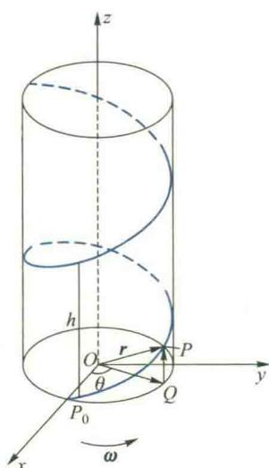
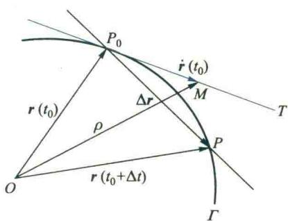
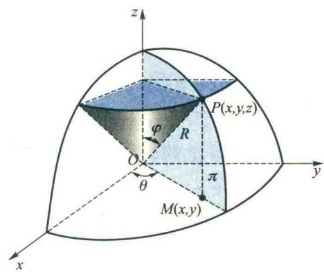
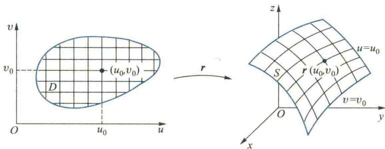
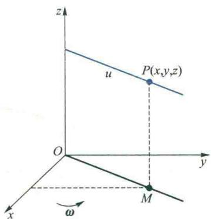
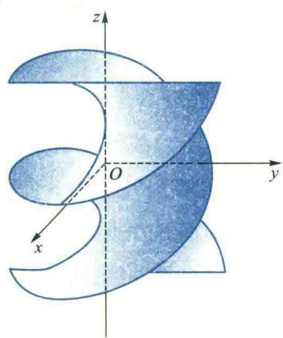
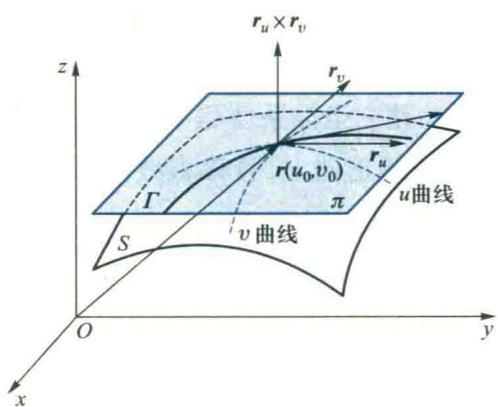
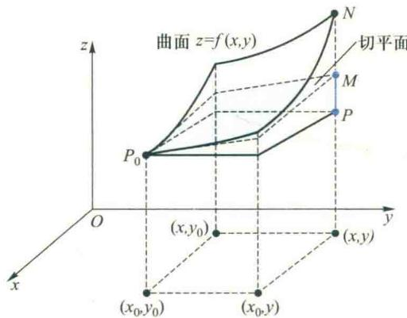

import Guide from '@/components/Guide.astro';
import Knowledge from '@/components/Knowledge.astro';
import Example from '@/components/Example.astro';
import Analysis from '@/components/Analysis.astro';
import Solution from '@/components/Solution.astro';
import Variant from '@/components/Variant.astro';
import Note from '@/components/Note.astro';
import Block from '@/components/Block.astro';
import Method from '@/components/Method.astro';

本节从空间曲线和曲面的参数方程出发,利用多元函数微分学的知识,以向量为工具,来研究曲线的切线与法平面、弧长以及曲面的切平面与法线.

## 6.1 空间曲线的切线与法平面

## 1. 曲线的参数方程

我们知道,平面曲线可以用参数方程 $x=x(t)$ , $y=y(t)$ ( $\alpha\leqslant t\leqslant\beta$ ) 来表示.例如,椭圆 $\frac{x^{2}}{a^{2}}+\frac{y^{2}}{b^{2}}=1$ 的参数方程是 $x=a\cos t$ , $y=b\sin t$ ( $0\leqslant t\leqslant2\pi$ ); 空间直线 L 的参数方程是

$$

\boldsymbol {r} = \boldsymbol {r} _ {0} + t \boldsymbol {a} \quad (- \infty <   t <   + \infty),

$$

或

$$

\left\{ \begin{array}{l} x = x _ {0} + l t, \\ y = y _ {0} + m t, \quad (- \infty <   t <   + \infty), \\ z = z _ {0} + n t \end{array} \right.

$$

其中 $\boldsymbol{r}=(x,y,z)^{\textcircled{①}}$ 为直线 L 上动点 $P(x,y,z)$ 的向径 $\overrightarrow{OP},\boldsymbol{r}_{0}=(x_{0},y_{0},z_{0})$ 为直线 L 上的已知定点 $(x_{0},y_{0},z_{0})$ 的向径， $\boldsymbol{a}=(l,m,n)$ 为直线 L 的方向向量.

由直线 L 的参数方程可见, 对于任一实数 t, 按所给法则, 在空间确定了唯一的点 $(x, y, z)$ . 因此, 直线 L 可以看作是从区间 $(-∞, +∞)$ 到 $R^{3}$ 的映射 $r(t) = r_{0} + ta$ 的像.

对于一般的空间曲线 $\Gamma$ ，也可看作是从区间 $[\alpha ,\beta ]$ 到 $\mathbf{R}^3$ 的一个连续映射 $\pmb{r}$ 的像 $\{\pmb {r}(t)\mid \alpha \leqslant$ $t\leqslant \beta \}$ ， $\pmb {r}(t)$ 就是向径 $\overrightarrow{OP}$ （图5.24).当 $t$ 在区间 $[\alpha ,\beta ]$ 上变化时，向径 $\overrightarrow{OP}$ 端点 $P$ 的轨迹就是曲线 $\Gamma$ ，它的方程可表示为

图5.24

$$

\boldsymbol {r} = \boldsymbol {r} (t) = (x (t), y (t), z (t)) (\alpha \leqslant t \leqslant \beta),\tag{6.1}

$$

或

$$

x = x (t), \quad y = y (t), \quad z = z (t) \quad (\alpha \leqslant t \leqslant \beta),\tag{6.2}

$$

称(6.1)或(6.2)式为空间曲线 $\Gamma$ 的参数方程.

<Example title="例 6.1">
在机械工程中常常遇到一种空间曲线, 称为螺旋线, 其形成规律是: 动点 P 沿半径为 a 的圆周做匀速转动, 而这圆周所在的平面又在空间做等速平移, 移动的方向与圆周所在平面垂直. 试推导此动点轨迹的方程.

<Solution title="解">
取运动开始时(设 t=0) 圆周的中心为坐标原点 O, 圆周所在的平面为 xOy 坐标面, $\overrightarrow{OP_{0}}$ 的方向为 x 轴的正向, 其中 $P_{0}$ 为运动开始时动点的位置. 圆周所在平面移动的方向为 z 轴的正向(图 5.25).

设点 P 转动的角速度为 $\omega$ ，圆周沿 z 轴方向移动的速度为 v，点 $P_{0}$ 的坐标为 $(a,0,0)$ ，于是经过时间 t 后，动点沿圆周转动了一个角度 $\omega t$ ，并在 z 轴方向上上升了一段距离 $\overline{QP}=vt$ 。所以在时刻 t，动点的坐标是

$$

x = a \cos \omega t, \quad y = a \sin \omega t, \quad z = v t, \quad t \in [ 0, + \infty).

$$

这就是螺旋线的参数方程,写成向量形式就是

$$

\boldsymbol {r} = (a \cos \omega t, a \sin \omega t, v t), \quad t \in [ 0, + \infty).

$$

图5.25

如果取 $\theta=\omega t$ 作参变量,便有

$$

x = a \cos \theta , \quad y = a \sin \theta , \quad z = k \theta , \quad \theta \in [ 0, + \infty),

$$

其中 $k=\frac{v}{\omega}$ . 可见因参变量的不同选择, 曲线可以有不同的参数方程.

显然,上述螺旋线上的动点 P 始终在圆柱面 $x^{2}+y^{2}=a^{2}$ 上.如果让 $\theta$ 取负值,那么动点就沿着圆柱面转到 xOy 平面的下方去了.

因为当 $\theta$ 角转过 $2\pi$ 后，动点 P 恰巧在圆柱面上由原来的位置升高了一段距离 $h = z(\theta + 2\pi) - z(\theta) = k(\theta + 2\pi) - k\theta = 2\pi k$ （称常数 $2\pi k$ 为螺距），所以曲线在圆柱面上始终以同样的间距上升（或下降），这就是螺丝钉上螺纹的曲线，因而称为螺旋线.
</Solution>
</Example>

## 2. 简单曲线与有向曲线

设空间曲线 $\Gamma$ 的方程为 $r = r(t) (\alpha \leqslant t \leqslant \beta)$ . 如果向量值函数 $r(t)$ 在 $[\alpha, \beta]$ 上连续，则称 $\Gamma$ 为连续曲线；如果 $\Gamma$ 为连续曲线，且 $\forall t_1, t_2 \in (\alpha, \beta), t_1 \neq t_2$ ，均有 $r(t_1) \neq r(t_2)$ ，即在 $(\alpha, \beta)$ 上 $r$ 为单射，则称 $\Gamma$ 为简单曲线. 容易看出，简单曲线就是自身不相交的连续曲线. 如果 $\Gamma$ 为简单曲线，且 $r(\alpha) = r(\beta)$ ，则称 $\Gamma$ 为简单闭曲线. 对于选定了参数 $t$ 的曲线 $\Gamma$ ，我们规定 $t$ 增大的方向为 $\Gamma$ 的正向（自然地， $t$ 减小的方向，称为 $\Gamma$ 的负向).例如,螺旋线 $r=(a\cos\theta,a\sin\theta,k\theta)$ (k>0)的正向为上升的方向.对于规定了正向的曲线,称其为有向曲线.以下讨论的曲线均指有向曲线.

## 3. 空间曲线的切线与法平面

设空间简单曲线 $\Gamma$ 的方程为

$$

\boldsymbol {r} = \boldsymbol {r} (t) = (x (t), y (t), z (t)) \quad (\alpha \leqslant t \leqslant \beta),

$$

其中向量值函数 $\boldsymbol{r}(t)$ 在 $[\alpha,\beta]$ 上可导，其导数记作 $\dot{\boldsymbol{r}}(t)$ ，且有

$$

\dot {\boldsymbol {r}} (t) = (\dot {x} (t), \dot {y} (t), \dot {z} (t)) \neq \mathbf {0} (\alpha \leqslant t \leqslant \beta).

$$

我们来讨论 $\Gamma$ 在点 $P_{0}(x(t_{0}), y(t_{0}), z(t_{0}))$ 处的切线方程.

与平面曲线的切线一样,空间曲线上点 $P_{0}$ 处的切线也定义为曲线上过点 $P_{0}$ 的割线 $P_{0}P$ 当点 P 沿曲线趋于点 $P_{0}$ 时的极限位置 $P_{0}T$ (图 5.26).要求此切线的方程,关键在于求出它的一个方向向量.为此,在 $\Gamma$ 上点 $P_{0}$ 的邻近取点 $P(x(t_{0}+\Delta t), y(t_{0}+\Delta t), z(t_{0}+\Delta t))$ ,点 $P_{0}$ 与 P 所对应的向径分别为 $r(t_{0})$ 与 $r(t_{0}+\Delta t)$ .从而向量

  

图5.26

$$

\overrightarrow {P _ {0} P} = \boldsymbol {r} (t _ {0} + \Delta t) - \boldsymbol {r} (t _ {0}) = \Delta \boldsymbol {r}

$$

为割线 $P_{0}P$ 的一个方向向量. 容易看出, 向量

$$

\frac {\overrightarrow {P _ {0} P}}{\Delta t} = \frac {\Delta r}{\Delta t}\tag{6.3}

$$

也是割线 $P_0P$ 的一个方向向量，而且不论 $\Delta t$ 是正的还是负的， $\frac{\Delta r}{\Delta t}$ 的方向始终与曲线 $\Gamma$ 的参数 $t$ 增大的方向（即 $\Gamma$ 的正向）相一致. 令 $\Delta t \to 0$ ，对(6.3)式两端取极限得

$$

\lim _ {\Delta t \to 0} \frac {\overrightarrow {P _ {0} P}}{\Delta t} = \lim _ {\Delta t \to 0} \frac {\Delta r}{\Delta t} = \dot {r} (t _ {0}).

$$

由于 $r(t)$ 的连续性, 当 $\Delta t \to 0$ 时, $\overrightarrow{P_0P} = \Delta r \to 0$ , 点 P 沿曲线 $\Gamma$ 趋于点 $P_0$ , 从而割线 $P_0P$ 变成了切线 $P_0T$ , 而割线的方向向量变成了相应切线的方向向量 $\dot{r}(t_0)$ . 由此可见: 向径 $r(t)$ 的导数 $\dot{r}(t_0)$ 在几何上就注意:曲线的正向总规定为对应于t增大的方向.因此,当 $\Delta t>0$ 时, $\Delta r=r(t_{0}+\Delta t)-r(t_{0})$ 与曲线正向一致,从而 $\frac{\Delta r}{\Delta t}$ 与曲线正向也一致.所以切向量 $\dot{r}(t_{0})=\lim_{\Delta t\to0}\frac{\Delta r}{\Delta t}$ 的方向与曲线正向一致;当 $\Delta t<0$ 时, $\Delta r$ 的方向与曲线正向相反,但由于 $\Delta t<0$ ,故 $\frac{\Delta r}{\Delta t}$ 的方向仍与曲线正向一致,从而切向量 $\dot{r}(t_{0})$ 的方向始终指向曲线的正向.它的模为

$$

\begin{array}{r l} & {\| \dot {\pmb {r}} (t _ {0}) \|} \\ & {= \sqrt {\dot {x} ^ {2} (t _ {0}) + \dot {y} ^ {2} (t _ {0}) + \dot {z} ^ {2} (t _ {0})}.} \end{array}

$$

表示曲线 $\Gamma$ 在相应点 $P_{0}$ 处的切线 $P_{0}T$ 的一个方向向量, 而且它的方向与 $\Gamma$ 的正向相一致, 称它为 $\Gamma$ 在点 $P_{0}$ 处的切向量.

我们已知 $\boldsymbol{r}(t_{0})$ 是曲线 $\Gamma$ 上点 $P_{0}$ 的向径，而 $\dot{\boldsymbol{r}}(t_{0})$ 是 $\Gamma$ 在点 $P_{0}$ 的切向量，利用直线方程的向量形式，可将曲线 $\Gamma$ 在 $P_{0}(\boldsymbol{r}(t_{0}))$ 处切线的向量方程写为

$$

\boldsymbol {\rho} = \boldsymbol {r} (t _ {0}) + t \dot {\boldsymbol {r}} (t _ {0}),\tag{6.4}

$$

其中 $\boldsymbol{\rho}=(x,y,z)$ 为切线上动点 $P(x,y,z)$ 的向径, $t\in R$ 为参数. 消去参数 t, 即得该切线的对称式方程

$$

\frac {x - x \left(t _ {0}\right)}{\dot {x} \left(t _ {0}\right)} = \frac {y - y \left(t _ {0}\right)}{\dot {y} \left(t _ {0}\right)} = \frac {z - z \left(t _ {0}\right)}{\dot {z} \left(t _ {0}\right)}.\tag{6.5}

$$

由以上可知, 当 $\boldsymbol{r}=\boldsymbol{r}(t)$ 可导, 且 $\dot{\boldsymbol{r}}(t)\neq\boldsymbol{0}\quad(\alpha\leqslant t\leqslant\beta)$ 时, 曲线 $\Gamma$ 上各点处都存在切线. 进一步, 如果 $\dot{\boldsymbol{r}}(t)$ 在 $[\alpha,\beta]$ 上连续, 则切线方向连续变化. 一般地, 称切线方向连续变化的曲线为光滑曲线. 因此, 当函数 $\boldsymbol{r}(t)$ 在 $[\alpha,\beta]$ 上有连续的导数且 $\dot{\boldsymbol{r}}(t)\neq\boldsymbol{0}\quad(\alpha\leqslant t\leqslant\beta)$ 时, 曲线 $\boldsymbol{r}=\boldsymbol{r}(t)\quad(\alpha\leqslant t\leqslant\beta)$ 为光滑曲线. 如果曲线 $\Gamma$ 不是光滑曲线, 但将 $\Gamma$ 分成若干段后, 每段都是光滑曲线, 则称 $\Gamma$ 为分段光滑曲线.

过曲线 $\Gamma$ 上点 $P_0$ 且与点 $P_0$ 处的切线垂直的任一直线称为此曲线 $\Gamma$ 在 $P_0$ 处的法线，这些法线显然位于同一平面内，此平面称为 $\Gamma$ 在点 $P_0$ 的法平面. 显然 $\dot{\pmb{r}}(t_0)$ 是法平面的一个法线向量，于是法平面的方程是

$$

\dot {\boldsymbol {r}} \left(t _ {0}\right) \cdot \left[ \boldsymbol {\rho} - \boldsymbol {r} \left(t _ {0}\right) \right] = 0,

$$

或

$$

\dot {x} \left(t _ {0}\right) \left[ x - x \left(t _ {0}\right) \right] + \dot {y} \left(t _ {0}\right) \left[ y - y \left(t _ {0}\right) \right] + \dot {z} \left(t _ {0}\right) \left[ z - z \left(t _ {0}\right) \right] = 0,\tag{6.6}

$$

其中 $\boldsymbol{\rho}=(x,y,z)$ 是法平面上点 $(x,y,z)$ 的向径.

如果曲线 $\Gamma$ 是由两柱面的交线给出, 设它的方程为

$$

y = y (x), \quad z = z (x) \quad (a \leqslant x \leqslant b),

$$

把 x 看作是参数, 上式也可写成参数方程形式

$$

x = x, \quad y = y (x), \quad z = z (x) \quad (a \leqslant x \leqslant b),

$$

那么 $\Gamma$ 上与参数 $x=x_{0}$ 相对应的点处的切线方程是

$$

\frac {x - x _ {0}}{1} = \frac {y - y (x _ {0})}{\dot {y} (x _ {0})} = \frac {z - z (x _ {0})}{\dot {z} (x _ {0})},\tag{6.7}

$$

法平面方程是

$$

x - x _ {0} + \dot {y} (x _ {0}) [ y - y (x _ {0}) ] + \dot {z} (x _ {0}) [ z - z (x _ {0}) ] = 0.\tag{6.8}

$$

如果曲线 $\Gamma$ 的方程由一般式方程

$$

\left\{ \begin{array}{l} F (x, y, z) = 0, \\ G (x, y, z) = 0 \end{array} \right.\tag{6.9}

$$

给出，且在点 $P_0(x_0,y_0,z_0)$ 的某邻域内方程组(6.9)满足隐函数存在定理的条件，不妨设

$$

\left. \frac {\partial (F , G)}{\partial (y , z)} \right| _ {P _ {0}} \neq 0,

$$

那么在点 $P_0$ 的某邻域内由(6.9)式确定了两个具有连续导数的一元隐函数 $y = y(x)$ 和 $z = z(x)$ . 由隐函数求导法求出 $\dot{y}(x_0)$ 和 $\dot{z}(x_0)$ 之后, 代入(6.7)和(6.8)式, 即得曲线 $\Gamma$ 在点 $P_0$ 处的切线方程和法平面方程.

<Note>
,在曲线 $\boldsymbol{r}=\boldsymbol{r}(t)$ 上, $\mathrm{d}\boldsymbol{r}=(\mathrm{d}x,\mathrm{d}y,\mathrm{d}z)=(\dot{x},\dot{y},\dot{z})\mathrm{d}t$ 与 $(\dot{x},\dot{y},\dot{z})$ 共线, 因而向量 $(\mathrm{d}x,\mathrm{d}y,\mathrm{d}z)$ 也是曲线 $\boldsymbol{r}=\boldsymbol{r}(t)$ 的一个切向量. 因此, 求曲线 (6.9) 在点 $P_{0}$ 处的切向量也可以用下面的方法: 由 (6.9) 式两端求全微分, 并将点 $P_{0}$ 代入, 得

$$

\left\{ \begin{array}{l} F _ {x} (P _ {0}) \mathrm{d} x + F _ {y} (P _ {0}) \mathrm{d} y + F _ {z} (P _ {0}) \mathrm{d} z = 0, \\ G _ {x} (P _ {0}) \mathrm{d} x + G _ {y} (P _ {0}) \mathrm{d} y + G _ {z} (P _ {0}) \mathrm{d} z = 0, \end{array} \right.

$$

将上式看作是以 dx, dy, dz 为未知量的齐次线性代数方程组, 由于其所含方程个数 (2) 小于未知量个数 (3), 由线性代数的知识知它必有非零解, 求出它的任意一个非零解 $(\mathrm{d}x, \mathrm{d}y, \mathrm{d}z) \mid_{P_{0}}$ , 便是曲线 (6.9) 在点 $P_{0}$ 处的一个切向量.
</Note>

<Example title="例 6.2">
求曲线 $\left\{\begin{aligned}&2x^{2}+y^{2}+z^{2}=45,\\ &x^{2}+2y^{2}=z\end{aligned}\right.$ 在点 $P_{0}(-2,1,6)$ 处的切线与法平面方程.
</Example>

<Note>
虽然导数 $\dot{\boldsymbol{r}}(t_{0})$ 与微分 $\mathrm{d}\boldsymbol{r}(t_{0})$ 都表示曲线 $\boldsymbol{r}=\boldsymbol{r}(t)$ 上与 $t_{0}$ 所对应的点 $P_{0}$ 处的切向量, 但它们方向却不一定相同, $\dot{\boldsymbol{r}}(t_{0})$ 与曲线的正向 (即 t 增大方向) 一致; 而 $\mathrm{d}\boldsymbol{r}(t_{0})=\dot{\boldsymbol{r}}(t_{0})\Delta t$ 的方向, 取决于 $\Delta t$ 的正负. 当 $\Delta t<0$ 时它与曲线正向相反, 它的模
</Note>

<Solution title="解">
由曲线方程两端求全微分,利用一阶全微分形式不变性,得

$$

\begin{array}{r l} \left\| \mathrm{d} \boldsymbol {r} \right\| & = \sqrt {\left(\mathrm{d} x\right) ^ {2} + \left(\mathrm{d} y\right) ^ {2} + \left(\mathrm{d} z\right) ^ {2}} \\ & = \sqrt {\dot {x} ^ {2} + \dot {y} ^ {2} + \dot {z} ^ {2}} | \Delta t | \end{array}

$$

$$

\left\{ \begin{array}{l} 4 x \mathrm{d} x + 2 y \mathrm{d} y + 2 z \mathrm{d} z = 0, \\ 2 x \mathrm{d} x + 4 y \mathrm{d} y - \mathrm{d} z = 0, \end{array} \right.

$$

$$

\| \dot {\boldsymbol {r}} \| = \sqrt {\dot {x} ^ {2} + \dot {y} ^ {2} + \dot {z} ^ {2}}

$$

相比，伸缩了 $|\Delta t|$ 倍.

将点 $P_{0}$ 的坐标代入,得
</Solution>

<Note>
$$

\left\{ \begin{array}{l} 4 \mathrm{d} x - \mathrm{d} y - 6 \mathrm{d} z = 0, \\ 4 \mathrm{d} x - 4 \mathrm{d} y + \mathrm{d} z = 0, \end{array} \right.

$$

微分

$$

\begin{array}{r l} \mathrm{d} r & = (\mathrm{d} x, \mathrm{d} y, \mathrm{d} z) \\ & = (\dot {x} (t), \dot {y} (t), \dot {z} (t)) \mathrm{d} t. \end{array}

$$

容易求出这个齐次线性代数方程组的一个非零解是

这里为什么没有“dt”？

$$

(\mathrm{d} x, \mathrm{d} y, \mathrm{d} z) \mid_ {P _ {\mathrm{n}}} = (2 5, 2 8, 1 2),

$$

它就是曲线在点 $P_{0}$ 处的一个切向量. 从而得曲线在点 $P_{0}$ 处的切线方程是

$$

\frac {x + 2}{2 5} = \frac {y - 1}{2 8} = \frac {z - 6}{1 2},

$$

法平面方程是

$$

2 5 (x + 2) + 2 8 (y - 1) + 1 2 (z - 6) = 0,

$$

或

$$

2 5 x + 2 8 y + 1 2 z - 5 0 = 0.

$$
</Note>

## 6.2 弧长

## 1. 弧长的定义与计算

弧长是指一般曲线的长度,这在直观上是容易理解的.但直至目前,我们并未严格地定义它,更不知如何计算它.我们知道,对于联结两点 $P_{1}(x_{1},y_{1},z_{1})$ 与 $P_{2}(x_{2},y_{2},z_{2})$ 的直线段,其长度为

$$

\left\| \overrightarrow {P _ {1} P _ {2}} \right\| = \sqrt {\left(x _ {1} - x _ {2}\right) ^ {2} + \left(y _ {1} - y _ {2}\right) ^ {2} + \left(z _ {1} - z _ {2}\right) ^ {2}}.\tag{6.10}

$$

对于曲线段,当弧段很短时可以近似地看成是直线段,从而可以利用公式(6.10)来近似计算它的长度.因此,我们可以利用定积分的思想来定义和计算曲线的弧长.

<Knowledge title="定义 6.1">
(弧长) 设简单曲线 $\Gamma$ 的方程是

$$

\boldsymbol {r} = \boldsymbol {r} (t) = (x (t), y (t), z (t)) \quad (\alpha \leqslant t \leqslant \beta).

$$

$\Gamma$ 的两个端点 A, B 分别对应于向径 $\boldsymbol{r}(\alpha), \boldsymbol{r}(\beta)$ ，在 $\Gamma$ 上介于 A 和 B 之间沿着参数 t 增大的方向依次取 n-1 个分点 $P_{1}, P_{2}, \cdots, P_{n-1}$ （图 5.27），它们把 $\Gamma$ 分成了 n 段。用直线段把相邻分点联结起来，即得一折线，它的长度是

  

图5.27

$$

s _ {n} = \sum_ {i = 1} ^ {n} \left\| \overrightarrow {P _ {i - 1} P _ {i}} \right\|,

$$

其中记 $A = P_{0}, B = P_{n}$ . 如果不论分点如何选取, 当 $d = \max_{1 \leqslant i \leqslant n} \| \overrightarrow{P_{i-1}P_i} \| \to 0$ 时, 折线的长度 $s_{n}$ 有确定的极限 $s$ , 则称 $\Gamma$ 为可求长的曲线, 且称这个极限值 $s$ 为 $\Gamma$ 的长度, 或 $\Gamma$ 的弧长, 即

$$

s = \lim _ {d \rightarrow 0} \sum_ {i = 1} ^ {n} \| \overrightarrow {P _ {i - 1} P _ {i}} \|.

$$
</Knowledge>

<Knowledge title="定理 6.1">
（弧长的计算公式）设在 $[\alpha, \beta]$ 上 $\dot{r}(t)$ 连续且 $\dot{r}(t) \neq 0$ ，则曲线 $r = r(t) (\alpha \leqslant t \leqslant \beta)$ 是可求长的曲线，且 $\Gamma$ 的长度为

$$

s = \int_ {\alpha} ^ {\beta} \| \dot {\boldsymbol {r}} (t) \| \mathrm{d} t = \int_ {\alpha} ^ {\beta} \sqrt {[ \dot {x} (t) ] ^ {2} + [ \dot {y} (t) ] ^ {2} + [ \dot {z} (t) ] ^ {2}} \mathrm{d} t.\tag{6.11}

$$

<Solution title="证明">
设分点 $P_{i}$ 对应于参数 $t_{i} (i=0,1,\cdots,n)$ ，其中 $t_{0}=\alpha, t_{n}=\beta$ 。这样便有

$$

\alpha = t _ {0} <   t _ {1} <   \dots <   t _ {n - 1} <   t _ {n} = \beta .

$$

首先来求 $\| \overrightarrow{P_{i - 1}P_i}\|$ 的表达式.由于

$$

\left\| \overrightarrow {P _ {i - 1} P _ {i}} \right\| = \left\| \boldsymbol {r} (t _ {i}) - \boldsymbol {r} (t _ {i - 1}) \right\| = \sqrt {\left(\Delta x _ {i}\right) ^ {2} + \left(\Delta y _ {i}\right) ^ {2} + \left(\Delta z _ {i}\right) ^ {2}},

$$

利用 Lagrange 微分中值公式得

$$

\left\| \overrightarrow {P _ {i - 1} P _ {i}} \right\| = \sqrt {\left[ \dot {x} (\xi_ {i}) \right] ^ {2} + \left[ \dot {y} (\eta_ {i}) \right] ^ {2} + \left[ \dot {z} (\zeta_ {i}) \right] ^ {2}} \Delta t _ {i},

$$

其中

$$

\Delta t _ {i} = t _ {i} - t _ {i - 1}, \quad \xi_ {i}, \eta_ {i}, \zeta_ {i} \in (t _ {i - 1}, t _ {i}), \quad i = 1, 2, \dots , n.

$$

为了使上式右端根式中的函数在同一点处取值,将其变形得到

$$

\left\| \overrightarrow {P _ {i - 1} P _ {i}} \right\| = \sqrt {\left[ \dot {x} (\xi_ {i}) \right] ^ {2} + \left[ \dot {y} (\xi_ {i}) \right] ^ {2} + \left[ \dot {z} (\xi_ {i}) \right] ^ {2}} \Delta t _ {i} + R _ {i} \Delta t _ {i} = \left\| \dot {\boldsymbol {r}} (\xi_ {i}) \right\| \Delta t _ {i} + R _ {i} \Delta t _ {i},

$$

其中

$$

R _ {i} = \sqrt {\left[ \dot {x} (\xi_ {i}) \right] ^ {2} + \left[ \dot {y} (\eta_ {i}) \right] ^ {2} + \left[ \dot {z} (\zeta_ {i}) \right] ^ {2}} - \sqrt {\left[ \dot {x} (\xi_ {i}) \right] ^ {2} + \left[ \dot {y} (\xi_ {i}) \right] ^ {2} + \left[ \dot {z} (\xi_ {i}) \right] ^ {2}}.\tag{6.12}

$$

于是

$$

s _ {n} = \sum_ {i = 1} ^ {n} \| \overrightarrow {P _ {i - 1} P _ {i}} \| = \sum_ {i = 1} ^ {n} \| \dot {\boldsymbol {r}} (\xi_ {i}) \| \Delta t _ {i} + \sum_ {i = 1} ^ {n} R _ {i} \Delta t _ {i}.\tag{6.13}

$$

令 $\lambda=\max_{1\leqslant i\leqslant n}\Delta t_{i}$ ，由定积分的定义和存在定理，易知

$$

\lim _ {\lambda \rightarrow 0} \sum_ {i = 1} ^ {n} \| \dot {\boldsymbol {r}} (\xi_ {i}) \| \Delta t _ {i} = \int_ {\alpha} ^ {\beta} \| \dot {\boldsymbol {r}} (t) \| \mathrm{d} t.\tag{6.14}

$$

这样,由(6.13)式及(6.14)式便知,要证明(6.11)式成立,只要证明

$$

\lim _ {\lambda \rightarrow 0} \sum_ {i = 1} ^ {n} R _ {i} \Delta t _ {i} = 0.\tag{6.15}

$$

为此,我们来估计 $R_{i}$ . 利用不等式 $^{①}$

$$

\left| \sqrt {a _ {1} ^ {2} + a _ {2} ^ {2} + a _ {3} ^ {2}} - \sqrt {b _ {1} ^ {2} + b _ {2} ^ {2} + b _ {3} ^ {2}} \right| \leqslant \left| a _ {1} - b _ {1} \right| + \left| a _ {2} - b _ {2} \right| + \left| a _ {3} - b _ {3} \right|,

$$

由(6.12)式便得

$$

\left| R _ {i} \right| \leqslant \left| \dot {y} \left(\eta_ {i}\right) - \dot {y} \left(\xi_ {i}\right) \right| + \left| \dot {z} \left(\zeta_ {i}\right) - \dot {z} \left(\xi_ {i}\right) \right|.

$$

因为 $\dot{y}(t), \dot{z}(t)$ 在 $[\alpha, \beta]$ 上连续，从而在 $[\alpha, \beta]$ 上一致连续，所以 $\forall \varepsilon > 0, \exists \delta = \delta(\varepsilon) > 0$ ，只要 $t', t'' \in [\alpha, \beta], |t' - t''| < \delta$ ，就有

$$

\left| \dot {y} (t ^ {\prime}) - \dot {y} (t ^ {\prime \prime}) \right| <   \varepsilon , \quad \left| \dot {z} (t ^ {\prime}) - \dot {z} (t ^ {\prime \prime}) \right| <   \varepsilon .

$$

特别地，当 $\lambda = \max_{1\leqslant i\leqslant n}\Delta t_i <   \delta$ 时，有

$$

\mid R _ {i} \mid <   2 \varepsilon , \quad \left| \sum_ {i = 1} ^ {n} R _ {i} \Delta t _ {i} \right| <   2 \varepsilon (\beta - \alpha),

$$

从而(6.15)式成立.

平面曲线是空间曲线的特例 $(z=0)$ ，因此，对于平面曲线 $\Gamma:x=x(t),y=y(t)$ $(\alpha\leqslant t\leqslant\beta)$ ，其弧长为

$$

s = \int_ {\alpha} ^ {\beta} \sqrt {[ \dot {x} (t) ] ^ {2} + [ \dot {y} (t) ] ^ {2}} \mathrm{d} t.

$$

从而有

(1) 若平面曲线 $\Gamma$ 在直角坐标系下的方程是

$$

y = y (x) \quad (a \leqslant x \leqslant b),

$$

则 $\Gamma$ 有参数方程 $x = x, y = y(x) (a \leqslant x \leqslant b)$ ，因而 $\Gamma$ 的弧长为

$$

s = \int_ {a} ^ {b} \sqrt {1 + [ y ^ {\prime} (x) ] ^ {2}} \mathrm{d} x.

$$

(2) 若平面曲线 $\Gamma$ 在极坐标下的方程是

$$

\rho = \rho (\theta) \quad (\alpha \leqslant \theta \leqslant \beta),

$$

则 $\Gamma$ 有参数方程 $x = \rho (\theta)\cos \theta ,y = \rho (\theta)\sin \theta (\alpha \leqslant \theta \leqslant \beta)$ ，于是 $\Gamma$ 的弧长为

$$

s = \int_ {\alpha} ^ {\beta} \sqrt {[ x ^ {\prime} (\theta) ] ^ {2} + [ y ^ {\prime} (\theta) ] ^ {2}} \mathrm{d} \theta = \int_ {\alpha} ^ {\beta} \sqrt {[ \rho (\theta) ] ^ {2} + [ \rho^ {\prime} (\theta) ] ^ {2}} \mathrm{d} \theta .

$$
</Solution>
</Knowledge>

<Example title="例 6.3">
计算(平面曲线)摆线(也称旋轮线)一拱

$$

x = a (t - \sin t), \quad y = a (1 - \cos t) \quad (0 \leqslant t \leqslant 2 \pi)

$$

的弧长.

<Solution title="解">
因为

$$

\sqrt {\dot {x} ^ {2} (t) + \dot {y} ^ {2} (t)} = \sqrt {a ^ {2} (1 - \cos t) ^ {2} + a ^ {2} \sin^ {2} t} = a \sqrt {2 (1 - \cos t)} = 2 a \left| \sin \frac {t}{2} \right|,

$$

所以

$$

s = 2 a \int_ {0} ^ {2 \pi} \left| \sin \frac {t}{2} \right| \mathrm{d} t = 2 a \int_ {0} ^ {2 \pi} \sin \frac {t}{2} \mathrm{d} t = 8 a.

$$
</Solution>
</Example>

<Example title="例 6.4">
求平面曲线 $x = \frac{1}{4} y^2 - \frac{1}{2} \ln y (1 \leqslant y \leqslant e)$ 的弧长.

<Solution title="解">
当 $1 \leqslant y \leqslant e$ 时, 此曲线的参数方程可视为 $x = \frac{1}{4} y^2 - \frac{1}{2} \ln y, y = y$ , 由于

$$

\sqrt {1 + \left(\frac {\mathrm{d} x}{\mathrm{d} y}\right) ^ {2}} = \sqrt {1 + \frac {1}{4} \left(y - \frac {1}{y}\right) ^ {2}} = \frac {1}{2} \left(y + \frac {1}{y}\right),

$$

故

$$

s = \frac {1}{2} \int_ {1} ^ {\mathrm{e}} \left(y + \frac {1}{y}\right) \mathrm{d} y = \frac {1}{4} (\mathrm{e} ^ {2} + 1).

$$
</Solution>
</Example>

<Example title="例 6.5">
求螺旋线 $x = a \cos \theta, y = a \sin \theta, z = k \theta$ 一个螺距之间的长度.

<Solution title="解">
由于

$$

\sqrt {\dot {x} ^ {2} (\theta) + \dot {y} ^ {2} (\theta) + \dot {z} ^ {2} (\theta)} = \sqrt {a ^ {2} + k ^ {2}},

$$

所以所求弧长为

$$

s = \int_ {\theta_ {0}} ^ {\theta_ {0} + 2 \pi} \sqrt {a ^ {2} + k ^ {2}} \mathrm{d} \theta = 2 \pi \sqrt {a ^ {2} + k ^ {2}} (\theta_ {0} \in \mathbf {R}).

$$
</Solution>
</Example>

## 2. 弧微分与自然参数

<Note>
注意到

设曲线 $\Gamma$ 的参数方程为 $\boldsymbol{r}=\boldsymbol{r}(t)\quad(\alpha\leqslant t\leqslant\beta)$ ， $\dot{\boldsymbol{r}}(t)$ 连续且 $\dot{\boldsymbol{r}}(t)\neq\mathbf{0},t_{0}$ 为 $[\alpha,\beta]$ 上的固定参数值， $s(t)$ 为从 $\boldsymbol{r}(t_{0})$ 到 $\boldsymbol{r}(t)$ 的弧长函数，而且规定：当 $t>t_{0}$ 时， $s(t)>0$ ；当 $t<t_{0}$ 时， $s(t)<0$ ，则由（6.11）式有

$$

s (t) = \int_ {t _ {0}} ^ {t} \| \dot {\pmb {r}} (\tau) \| \mathrm{d} \tau \quad (\alpha \leqslant t \leqslant \beta).\tag{6.16}

$$

$\| \dot{r}(t) \| = \sqrt{x^2(t) + y^2(t) + z^2(t)}$ (6-16)式的右端就是一个变上限的定积分. 由于被积函数 $\| \dot{r}(t) \|$ 连续, 故由微积分第一基本定理可知

显然,由(6.16)式定义的函数 $s(t)$ 是 $[\alpha,\beta]$ 上连续可导且单调增的函数,t 增加的方向也是 $s(t)$ 增大的方向,且有

$$

\frac {\mathrm{d} s}{\mathrm{d} t} = \left\| \dot {\boldsymbol {r}} (t) \right\|,

$$

于是弧段的长度

$$

\frac {\mathrm{d} s}{\mathrm{d} t} = \left\| \dot {\boldsymbol {r}} (t) \right\| = \sqrt {\left[ \dot {x} (t) \right] ^ {2} + \left[ \dot {y} (t) \right] ^ {2} + \left[ \dot {z} (t) \right] ^ {2}},

$$

我们称

$$

\Delta s = \left\| \dot {r} (t) \right\| \Delta t + o (\Delta t).\tag{6.17}

$$

$$

\mathrm{d} s = \left\| \dot {\boldsymbol {r}} (t) \right\| \mathrm{d} t = \sqrt {\left[ \dot {x} (t) \right] ^ {2} + \left[ \dot {y} (t) \right] ^ {2} + \left[ \dot {z} (t) \right] ^ {2}} \mathrm{d} t

$$

可见 $ds = \|\dot{r}(t)\| \Delta t$ 就是 $\Delta s$ 的线性主部. 因此, 求弧长 s, 只需求出各小弧段 $\Delta s$ 的线性主部后将其无限累加(积分)即可.

为弧长 $s(t)$ 的微分, 简称为弧微分.

由于 $\frac{\mathrm{d}s}{\mathrm{d}t} = \| \dot{\pmb{r}}(t) \| > 0$ ，故 $s = s(t)$ 存在反函数 $t = t(s)$ ，将它代入 $\Gamma$ 的参数方程 $\pmb{r} = \pmb{r}(t)$ ，便得到 $\Gamma$ 的以弧长 $s$ 为参数的方程

$$

\boldsymbol {r} = \boldsymbol {r} (t (s)) \quad (a \leqslant s \leqslant b),

$$

从几何上看,由于 $\dot{r}(t)$ 是曲线 $r=r(t)$ 上 t 所对应的点 P 处曲线正方向的一个切向量,从而 $\|\dot{r}(t)\|\Delta t(\Delta t>0)$ 就是与 $\Delta t$ 所对应的上述切向量的模.所以,弧长也就是将上述这些切向量的模无限累加所得.

称 s 为曲线 $\Gamma$ 的自然参数, 其中 $[a, b]$ 为函数 $s = s(t) (\alpha \leqslant t \leqslant \beta)$ 的值域. 这样, 通过上式, 就建立了区间 $[a, b]$ 上 s 值与曲线 $\Gamma$ 上点之间的一一对应关系. 采用自然参数, 对讨论曲线的许多问题会带来方便. 例如, 切线向量 $\frac{dr}{ds}$ 是单位向量. 事实上, 由 (6.17) 式有

$$

(\mathrm{d} s) ^ {2} = (\mathrm{d} x) ^ {2} + (\mathrm{d} y) ^ {2} + (\mathrm{d} z) ^ {2},

$$

故

$$

\left(\frac {\mathrm{d} x}{\mathrm{d} s}\right) ^ {2} + \left(\frac {\mathrm{d} y}{\mathrm{d} s}\right) ^ {2} + \left(\frac {\mathrm{d} z}{\mathrm{d} s}\right) ^ {2} = 1.

$$

这就说明

$$

\frac {\mathrm{d} \boldsymbol {r}}{\mathrm{d} s} = \left(\frac {\mathrm{d} x}{\mathrm{d} s}, \frac {\mathrm{d} y}{\mathrm{d} s}, \frac {\mathrm{d} z}{\mathrm{d} s}\right)

$$

是一个单位切向量.于是,设切向量与x轴、y轴、z轴正向的夹角分别为 $\alpha,\beta,\gamma$ ,则有

$$

\frac {\mathrm{d} x}{\mathrm{d} s} = \cos \alpha , \quad \frac {\mathrm{d} y}{\mathrm{d} s} = \cos \beta , \quad \frac {\mathrm{d} z}{\mathrm{d} s} = \cos \gamma .\tag{6.18}

$$
</Note>

## 6.3 曲面的切平面与法线

## 1. 曲面的参数方程

正像曲线可用参数方程来表示一样,曲面的方程也可以表示成参数形式,并且曲面的参数方程为研究曲面问题带来许多方便.

我们知道,方程

$$

x ^ {2} + y ^ {2} = R ^ {2}\tag{6.19}

$$

在 $xOy$ 平面上表示中心在原点、半径为 $R$ 的圆.若令

$$

x = R \cos \theta ,

$$

则可将它表示成参数方程

$$

x = R \cos \theta , \quad y = R \sin \theta \quad (0 \leqslant \theta \leqslant 2 \pi).

$$

方程(6.19)在 Oxyz 空间表示半径为 R、中心轴为 z 轴的圆柱面，其中 $z \in (-\infty, +\infty)$ ，因此圆柱面的方程可以通过参数 $\theta$ 与 z 写成

$$

x = R \cos \theta , \quad y = R \sin \theta , \quad z = z \left((\theta , z) \in D = [ 0, 2 \pi ] \times (- \infty , + \infty)\right),\tag{6.20}

$$

或向量形式

$$

\boldsymbol {r} = \boldsymbol {r} (\theta , z) = (R \cos \theta , R \sin \theta , z) \quad ((\theta , z) \in D).\tag{6.21}

$$

由方程(6.20)或(6.21)可见,此圆柱面也可以看作是平面区域 $^{①}$ D到 $R^{3}$ 的连续映射下的像.

为了说明曲面的方程可以用含有两个参数的参数方程来表示,我们再来看一个例子.

<Example title="例 6.6">
建立半径为 R 的球面的参数方程.

<Solution title="解">
设球心在坐标原点 $O, P(x, y, z)$ 为此球面上任一点，从 $z$ 轴正向到向径 $\overrightarrow{OP}$ 的转角为 $\varphi$ ，从坐标平面 $xOz$ 到由 $z$ 轴和 $\overrightarrow{OP}$ 所确定的平面 $\pi$ 的转角（从 $z$ 轴正向看去，其旋转方向为逆时针方向）为 $\theta$ 。取 $\varphi$ 与 $\theta$ 为参数，显然有

$$

\begin{array}{r l} {(\varphi , \theta)   \in   D = \{(  \varphi , \theta)   |   0 \leqslant \varphi \leqslant \pi ,} \\ & {\quad 0 \leqslant \theta \leqslant 2 \pi \}   \subseteq   \mathbf {R} ^ {2}.} \end{array}

$$

图5.28

由图 5.28 易见，

$$

x = \left\| \overrightarrow {O M} \right\| \cos \theta , \quad y = \left\| \overrightarrow {O M} \right\| \sin \theta ,

$$

而

$$

\| \overrightarrow {O M} \| = R \sin \varphi ,

$$

从而知此球面的参数方程为

$$

x = R \sin \varphi \cos \theta , \quad y = R \sin \varphi \sin \theta , \quad z = R \cos \varphi \quad (0 \leqslant \varphi \leqslant \pi , 0 \leqslant \theta \leqslant 2 \pi).

$$

或

$$

\boldsymbol {r} = \boldsymbol {r} (\varphi , \theta) = (R \sin \varphi \cos \theta , R \sin \varphi \sin \theta , R \cos \varphi) (0 \leqslant \varphi \leqslant \pi , 0 \leqslant \theta \leqslant 2 \pi).\tag{6.22}

$$

因此,此球面可看成平面区域

$$

D = \{(\varphi , \theta) | 0 \leqslant \varphi \leqslant \pi , 0 \leqslant \theta \leqslant 2 \pi \}

$$

到 $R^{3}$ 的连续映射(6.22)的像.

一般地,曲面 S 可以看作是由平面上某一区域 D 到空间 Oxyz 的某一连续映射的像,从而 S 的方程可用此映射表示为

$$

x = x (u, v), \quad y = y (u, v), \quad z = z (u, v) \quad ((u, v) \in D),\tag{6.23}

$$

或写成向量形式为

$$

\boldsymbol {r} = \boldsymbol {r} (u, v) = (x (u, v), y (u, v), z (u, v)) \quad ((u, v) \in D),

$$

(6.24)

称(6.23)或(6.24)式为曲面的参数方程,其中函数x,y,z均在D中连续.
</Solution>
</Example>

## 2. 曲面上曲线的表示

对于曲面的参数方程(6.23)或(6.24)，若在D中固定 $v=v_{0}$ ，让u变化，则此时在映射r下像点的集合应是曲面S上的一条曲线，称为曲面S上的u曲线。它的方程应为

<Note>
与曲线不同,曲面的参数方程是由两个独立参数构成的.例如,方程(6.20)或(6.21)就是以 $\theta,z$ 为参数的上述圆柱面的参数方程,(6.22)是以 $\theta,\varphi$ 为参数的球面方程.

$$

\boldsymbol {r} = \boldsymbol {r} (u, v _ {0}) = (x (u, v _ {0}), y (u, v _ {0}), z (u, v _ {0})) \quad (u \in I _ {1}),

$$

同理可得曲面 $S$ 上的 $\pmb{v}$ 曲线的方程为

$$

\boldsymbol {r} = \boldsymbol {r} (u _ {0}, v) = (x (u _ {0}, v), y (u _ {0}, v), z (u _ {0}, v)) \quad (v \in I _ {2}),

$$

其中 $I_{1}$ 与 $I_{2}$ 分别为 u 与 v 所允许的变化区间.

这样, 过曲面 S 上的每一点 P 就有一条 u 曲线和一条 v 曲线, 它们的交点就是 P. u 曲线族和 v 曲线族构成曲面 S 上的参数曲线网, 而曲面 S 可以看成是由它的 u 曲线族和 v 曲线族织成的. 从直观上来看, 曲面 S 可以看成是映射 r 将平面 uOv 上的区域 D
</Note>

<Note>
比较一下空间曲面与空间曲线，

(1) 它们的参数方程有何不同？

(2) 它们的一般式方程有何不同?

在 $R^{3}$ 中变形后得到的(图 5.29)，而 D 内的坐标网相应地变成了曲面 S 的参数曲线网.

  

图5.29

例如,在球面的方程(6.22)中令 $\theta=\theta_{0}$ 便得到此球面的 $\varphi$ 曲线,其方程为

$$

\boldsymbol {r} = \boldsymbol {r} (\varphi , \theta_ {0}) = (R \sin \varphi \cos \theta_ {0}, R \sin \varphi \sin \theta_ {0}, R \cos \varphi) \quad (0 \leqslant \varphi \leqslant \pi).

$$

在图 5.28 中, $\varphi$ 曲线就是过 z 轴的半平面 $\pi$ 与球面的交线,即球面的经线.

在(6.22)中令 $\varphi=\varphi_{0}$ 便得到此球面的 $\theta$ 曲线, 其方程为

$$

\boldsymbol {r} = \boldsymbol {r} \left(\varphi_ {0}, \theta\right) = \left(R \sin \varphi_ {0} \cos \theta , R \sin \varphi_ {0} \sin \theta , R \cos \varphi_ {0}\right) (0 \leqslant \theta \leqslant 2 \pi).

$$

在图 5.28 中, $\theta$ 曲线就是以 z 轴为对称轴、O 为顶点的圆锥面与球面的交线, 即球面的纬线.

当 $\theta_{0}$ 与 $\varphi_{0}$ 在相应区间变化时, 就得到 $\varphi$ 曲线族和 $\theta$ 曲线族, 它们构成了球面的参数曲线网. 球面可以看成是由它们织成的.

由于曲面 S 是平面区域 D 在连续映射 r 下像点的集合, 所以曲面 S 上任一曲线必是区域 D 内某一平面曲线 $u = u(t)$ , $v = v(t)$ ( $t \in I$ ) 在映射 r 下像点的集合, 因而它的方程为

$$

\boldsymbol {r} = \boldsymbol {r} [ u (t), v (t) ] = (x (u (t), v (t)), y (u (t), v (t)), z (u (t), v (t))) \quad (t \in I).

$$
</Note>

<Example title="例 6.7">
机械工程中常见的一种曲面称为正螺面, 它是当长为 l 的一动直线段(或直线)在平面上匀速地绕与此平面垂直的轴旋转, 而此直线段(或直线)所在平面又匀速地沿此轴向上或向下运动时, 该直线段(或直线)的运动轨迹. 试建立它的方程.

<Solution title="解">
建立坐标系使运动开始时直线段位于 $xOy$ 平面 $x$ 轴的正向上，且该直线段以原点为起点（图5.30).设 $\overrightarrow{OM}$ 旋转的角速度为 $\omega >0$ ，平面垂直移动的速度为 $b > 0$ ，正螺面上动点 $P(x,y,z)$ 与 $z$ 轴的距离为 $u.$ 于是由图5.30易得

$$

x = u \cos \omega t, \quad y = u \sin \omega t, \quad z = b t.

$$
</Solution>
</Example>

<Note>
不要将双参数u,v的正螺面方程 $r(u,v)=(ucos v,usin v,av)$ 与单参数的螺旋线方程 $r(v)=(acos v,asin v,kv)$ 混淆.实际上,当将参数u固定后,正螺面就是一条螺旋线,这正说明螺旋线是正螺面的v曲线,而正螺面就是由这种v曲线族所织成的.
</Note>

<Note>
由正螺面方程可以看到:曲面用双参数方程表示的优点之一是可以表示多值曲面.

令 $\omega t = v, \frac{b}{\omega} = a$ ，于是正螺面的参数方程为

$$

\boldsymbol {r} (u, v) = (u \cos v, u \sin v, a v) \quad (0 \leqslant u \leqslant l, - \infty <   v <   + \infty),

$$

其中 a>0 为常数, u 与 v 为参数, 正螺面的图形如图 5.31 所示. 机械中的螺杆及某些建筑中的旋转楼梯都是正螺面.

  

图5.30

  

图5.31
</Note>

## 3. 曲面的切平面与法线

设曲面 $S$ 的参数方程为

$$

\boldsymbol {r} = \boldsymbol {r} (u, v) = (x (u, v), y (u, v), z (u, v)) \quad ((u, v) \in D \subseteq \mathbf {R} ^ {2}),

$$

其中 r 在 D 内连续, 在点 $(u_{0}, v_{0}) \in D$ 可微, 其偏导数为

$$

\boldsymbol {r} _ {u} \left(u _ {0}, v _ {0}\right) = \left(\frac {\partial x}{\partial u}, \frac {\partial y}{\partial u}, \frac {\partial z}{\partial u}\right) \Bigg | _ {\left(u _ {0}, v _ {0}\right)}, \quad \boldsymbol {r} _ {v} \left(u _ {0}, v _ {0}\right) = \left(\frac {\partial x}{\partial v}, \frac {\partial y}{\partial v}, \frac {\partial z}{\partial v}\right) \Bigg | _ {\left(u _ {0}, v _ {0}\right)},

$$

且 $\boldsymbol{r}_{u}(u_{0},v_{0})\times\boldsymbol{r}_{v}(u_{0},v_{0})\neq\mathbf{0}$ （此时点 $(u_{0},v_{0})$ 称为曲面 S 的正则点）.

曲面 S 上过点 $\boldsymbol{r}(u_{0}, v_{0})$ 的 u 曲线为

$$

\boldsymbol {r} = \boldsymbol {r} (u, v _ {0}),

$$

它是以 u 为参数的空间曲线的参数方程. 由于 $\boldsymbol{r}=\boldsymbol{r}(u,v)$ 在 $(u_{0},v_{0})$ 点可微, 故 u 曲线在点 $\boldsymbol{r}_{0}=\boldsymbol{r}(u_{0},v_{0})$ 的切向量为 $\boldsymbol{r}_{u}(u_{0},v_{0})$ ; 同理可得, v 曲线在点 $r_{0}$ 的切向量为 $\boldsymbol{r}_{v}(u_{0},v_{0})$ . 由于 $(u_{0},v_{0})$ 是正则点, 所以向量 $\boldsymbol{r}_{u}(u_{0},v_{0})$ 与 $\boldsymbol{r}_{v}(u_{0},v_{0})$ 不平行, 从而由上述 u 曲线的切线与 v 曲线的切线确定了一张平面 $\pi$ (图 5.32), 它是过点 $r_{0}$ 且以 $\boldsymbol{r}_{u}(u_{0},v_{0})\times\boldsymbol{r}_{v}(u_{0},v_{0})$ 为法线方向向量的平面.

  

图5.32

下面证明:曲面 S 上过点 $r_{0}$ 的任一曲线在点 $r_{0}$ 若有切线,则此切线必位于平面 $\pi$ 上.事实上,在 S 上过点 $r_{0}$ 任作一条在 $r_{0}$ 处有切线的曲线 $\Gamma$ ,它的方程为

$$

\boldsymbol {r} = \boldsymbol {r} [ u (t), v (t) ] \quad (t \in I),

$$

其中 $u(t_{0})=u_{0}, v(t_{0})=v_{0}$ . 由上式两端在 $t_{0}$ 处对 t 求导, 根据链式法则有

$$

\dot {\boldsymbol {r}} \left(t _ {0}\right) = \boldsymbol {r} _ {u} \left(u _ {0}, v _ {0}\right) \dot {u} \left(t _ {0}\right) + \boldsymbol {r} _ {v} \left(u _ {0}, v _ {0}\right) \dot {v} \left(t _ {0}\right).\tag{6.25}

$$

(6.25)式表明,曲面 S 上过点 $r_{0}$ 的任一曲线 $\Gamma$ 在点 $r_{0}$ 的切向量 $\dot{r}(t_{0})$ 都可以用 $\boldsymbol{r}_{u}(u_{0},v_{0})$ 与 $\boldsymbol{r}_{v}(u_{0},v_{0})$ 线性表示,故 $\Gamma$ 在点 $r_{0}$ 的切线必位于平面 $\pi$ 上.

因此,我们把在点 $r_{0}$ 处由u曲线和v曲线的切向量 $r_{u}(u_{0},v_{0})$ 与 $r_{v}(u_{0},v_{0})$ 所确定的平面 $\pi$ 称为曲面S在点 $r_{0}$ 的切平面,而把过点 $r_{0}$ 且垂直于切平面 $\pi$ 的直线称为此曲面S在点 $r_{0}$ 处的法线,法线的方向向量称为法向量.显然,法向量可取为

$$

(\pmb {r} _ {u} \times \pmb {r} _ {v}) _ {(u _ {0}, v _ {0})} = \left(\frac {\partial (y , z)}{\partial (u , v)}, \frac {\partial (z , x)}{\partial (u , v)}, \frac {\partial (x , y)}{\partial (u , v)}\right) _ {(u _ {0}, v _ {0})} \stackrel {\text {记为}} {=} (A, B, C),

$$

于是 $S$ 在点 $\pmb{r}_0$ 的切平面方程为

$$

A (x - x _ {0}) + B (y - y _ {0}) + C (z - z _ {0}) = 0,

$$

法线方程为

$$

\frac {x - x _ {0}}{A} = \frac {y - y _ {0}}{B} = \frac {z - z _ {0}}{C},

$$

其中 $x_{0}=x(u_{0},v_{0})$ , $y_{0}=y(u_{0},v_{0})$ , $z_{0}=z(u_{0},v_{0})$ .

若偏导数

$$

\boldsymbol {r} _ {u} = \left(\frac {\partial x}{\partial u}, \frac {\partial y}{\partial u}, \frac {\partial z}{\partial u}\right), \quad \boldsymbol {r} _ {v} = \left(\frac {\partial x}{\partial v}, \frac {\partial y}{\partial v}, \frac {\partial z}{\partial v}\right)

$$

均在区域 D 内连续, 则称曲面 S 是一光滑曲面, 在几何上表示此曲面有连续转动的切平面.

若曲面 S 的方程为直角坐标系下的方程 $F(x,y,z)=0$ ，设 F 具有对各个变量的连续偏导数，且 $(F_{x},F_{y},F_{z})\neq0$ 。不妨设 $F_{z}\neq0$ ，则由隐函数存在定理，方程 $F(x,y,z)=0$ 确定了一个单值连续且有连续偏导数的二元函数 $z=z(x,y)$ 。把 x 与 y 看作是参数，于是曲面 S 的参数方程为

$$

\boldsymbol {r} (x, y) = (x, y, z (x, y)).

$$

由于

$$

\boldsymbol {r} _ {x} = (1, 0, z _ {x}) = \left(1, 0, - \frac {F _ {x}}{F _ {z}}\right), \quad \boldsymbol {r} _ {y} = (0, 1, z _ {y}) = \left(0, 1, - \frac {F _ {y}}{F _ {z}}\right),

$$

从而

$$

\boldsymbol {r} _ {x} \times \boldsymbol {r} _ {y} = \left(\frac {F _ {x}}{F _ {z}}, \frac {F _ {y}}{F _ {z}}, 1\right),

$$

故可取 $n = (F_x, F_y, F_z)$ 作为法向量，于是曲面在点 $P_0(x_0, y_0, z_0)$ 的切平面方程为

$$

F _ {x} \left(P _ {0}\right) \left(x - x _ {0}\right) + F _ {y} \left(P _ {0}\right) \left(y - y _ {0}\right) + F _ {z} \left(P _ {0}\right) \left(z - z _ {0}\right) = 0,\tag{6.26}

$$

法线方程为

$$

\frac {x - x _ {0}}{F _ {x} (P _ {0})} = \frac {y - y _ {0}}{F _ {y} (P _ {0})} = \frac {z - z _ {0}}{F _ {z} (P _ {0})}.\tag{6.27}

$$

若曲面方程为 $z=f(x,y)$ 或 $f(x,y)-z=0$ ，则由(6.26)及(6.27)两式可得曲面在点 $(x_{0},y_{0},z_{0})$ 处的切平面与法线方程分别为

$$

z - z _ {0} = f _ {x} \left(x _ {0}, y _ {0}\right) \left(x - x _ {0}\right) + f _ {y} \left(x _ {0}, y _ {0}\right) \left(y - y _ {0}\right)\tag{6.28}

$$

及

$$

\frac {x - x _ {0}}{f _ {x} (x _ {0} , y _ {0})} = \frac {y - y _ {0}}{f _ {y} (x _ {0} , y _ {0})} = \frac {z - z _ {0}}{- 1},\tag{6.29}

$$

其中 $z_{0}=f(x_{0},y_{0})$ .

值得指出的是, 当 $f(x,y)$ 在 $(x_{0},y_{0})$ 可微时, 方程(6.28) 的右端恰好是函数 $z=f(x,y)$ 在 $(x_{0},y_{0})$ 的全微分, 而左端是切平面上点的竖坐标的改变量. 因此, 函数 $z=f(x,y)$ 在点 $(x_{0},y_{0})$ 处的全微分在几何上表示曲面 $z=f(x,y)$ 在点 $P_{0}(x_{0},y_{0},z_{0})$ （其中 $z_{0}=f(x_{0},y_{0})$ ）处的切平面上点的竖坐标的改变量——有向线段 $\overrightarrow{PM}$ 的值(图5.33). 当 $|x-x_{0}|$ 与 $|y-y_{0}|$

  

图5.33

充分小时,用全微分 dz 去近似代替函数的改变量 $\Delta z$ ,也就是用

$$

f (x _ {0}, y _ {0}) + f _ {x} (x _ {0}, y _ {0}) (x - x _ {0}) + f _ {y} (x _ {0}, y _ {0}) (y - y _ {0})

$$

去近似代替 $f(x,y)$ ，在几何上就是用曲面在点 $P_0$ 的切平面去近似代替曲面.这是局部线性化思想在二元函数中的体现

由曲面的法向量还可以看到三元可微函数 $u = F(x, y, z)$ 的一个事实: 它的梯度向量 $\nabla u = \left(\frac{\partial F}{\partial x}, \frac{\partial F}{\partial y}, \frac{\partial F}{\partial z}\right)$ 正是它的等值面 $F(x, y, z) = C$ (其中 $C$ 为常数)的一个法向量. 我们知道, 沿梯度方向, 函数 $u$ 增长最快; 沿梯度的负方向, 函数 $u$ 减小最快. 而函数值 $u$ 的变化对应于 $u$ 的等值面的变化, 所以, 从几何上看, 函数 $u$ 变化最剧烈的方向, 正是沿着与 $u$ 的等值面“垂直”的法线方向.

<Example title="例 6.8">
求正螺面 $x = u \cos v, y = u \sin v, z = av$ 在 $u = \sqrt{2}, v = \frac{\pi}{4}$ 处的切平面与法线方程，其中常数 $a \neq 0$ .

<Solution title="解">
由于 $r = (u\cos v, u\sin v, av)$ ，所以

$$

\boldsymbol {r} _ {u} = \left(x _ {u}, y _ {u}, z _ {u}\right) = (\cos v, \sin v, 0), \quad \boldsymbol {r} _ {v} = \left(x _ {v}, y _ {v}, z _ {v}\right) = (- u \sin v, u \cos v, a),

$$

在 $u = \sqrt{2}, v = \frac{\pi}{4}$ 处， $\pmb{r}_u = \left(\frac{\sqrt{2}}{2}, \frac{\sqrt{2}}{2}, 0\right), \pmb{r}_v = (-1, 1, a), \pmb{r}_u \times \pmb{r}_v = \left(\frac{\sqrt{2}}{2} a, -\frac{\sqrt{2}}{2} a, \sqrt{2}\right)$ ，于是曲面上对应于点 $\left(1, 1, \frac{\pi}{4} a\right)$ 处的法线向量可取为

$$

\boldsymbol {n} = (a, - a, 2),

$$

从而可得所求切平面方程是

$$

a x - a y + 2 z = \frac {\pi}{2} a,

$$

法线方程是

$$

\frac {x - 1}{a} = \frac {y - 1}{- a} = \frac {z - \frac {\pi}{4} a}{2}. \quad \text {   I   }

$$
</Solution>
</Example>

<Example title="例 6.9">
已知椭球面 $S: x^{2} + 2y^{2} + z^{2} = \frac{5}{2}$ 和平面 $\pi: x - y + z + 4 = 0$ .
</Example>

<Note>
(1) 求 S 的与平面 $\pi$ 平行的切平面的方程；

(2) 求 S 上距离平面 $\pi$ 最近和最远的点.

当曲线是以一般式方程的形式, 即两个曲面的交线给出时, 如何利用两曲面的切平面或法向量, 求出该曲线的切向量及切线方程?
</Note>

<Solution title="解">
（1）设 $S$ 上点 $P_0(x_0, y_0, z_0)$ 处的切平面与平面 $\pi$ 平行，由于 $S$ 上点 $P_0$ 处法向量为

$$

\boldsymbol {n} \mid_ {P _ {0}} = \left(x _ {0}, 2 y _ {0}, z _ {0}\right),

$$

平面 $\pi$ 的法向量为 $(1,-1,1)$ ，按照平面平行的条件，应该有

$$

\frac {x _ {0}}{1} = \frac {2 y _ {0}}{- 1} = \frac {z _ {0}}{1},

$$

从而得 $x_0 = z_0, y_0 = -\frac{1}{2} z_0$ 。代入曲面 $S$ 的方程得 $z_0 = \pm 1$ ，因而得到满足要求的点 $P_0$ 有两个： $P_0'\left(1, -\frac{1}{2}, 1\right)$ 和 $P_0''\left(-1, \frac{1}{2}, -1\right)$ ，则点 $P_0'$ 和 $P_0''$ 处的切平面方程分别是

$$

(x - 1)   - \left(y + {\frac {1}{2}}\right) + (z - 1) = 0   \text {和} (x + 1)   - \left(y - {\frac {1}{2}}\right) + (z + 1) = 0,

$$

或

$$

x - y + z - \frac {5}{2} = 0   \text { 和 }   x - y + z + \frac {5}{2} = 0.

$$

它们都与平面 $\pi$ 平行.

（2）容易求出点 $P_0^\prime$ 和 $P_0^{\prime \prime}$ 到平面 $\pi$ 的距离分别是 $\frac{13}{2\sqrt{3}}$ 和 $\frac{3}{2\sqrt{3}}$ 显然，椭球面上每一点的切平面都使椭球面位于切平面的一侧，因此，椭球面 $S$ 夹在(1)中所求出的两个相互平行的切平面之间.易求出原点到上述与 $\pi$ 平行的两个切平面的距离都是 $\frac{5}{2\sqrt{3}}$ ，而原点到平面 $\pi$ 的距离为 $\frac{4}{\sqrt{3}}$ .由于 $\frac{4}{\sqrt{3}} >\frac{5}{2\sqrt{3}}$ ，所以平面 $\pi$ 位于上述两个平行的切平面所夹空间区域之外，从而知平面 $\pi$ 与椭球面 $S$ 不相交.由上述椭球面 $S$ 、平面 $\pi$ 以及与之平行的 $S$ 的切平面之间的关系可知 $P_0^{\prime \prime}$ 和 $P_0^\prime$ 分别是 $S$ 上距离平面 $\pi$ 最近和最远的点.
</Solution>

<Block title="习题5.6">
(A)

1. 求下列曲线在给定点的切线和法平面方程：

(1) $r=(t,2t^{2},t^{2})$ ，在t=1处；

(2) $r=(3\cos\theta,3\sin\theta,4\theta)$ ，在点 $\left(\frac{3}{\sqrt{2}},\frac{3}{\sqrt{2}},\pi\right)$ 处；

(3) $\left\{ \begin{array}{l} x^{2} + y^{2} = 1, \\ y^{2} + z^{2} = 1, \end{array} \right.$ 在点 $(1,0,1)$ 处.

2. 求曲线 $\boldsymbol{r}=(t,-t^{2},t^{3})$ 上的与平面 $x+2y+z=4$ 平行的切线方程.

3. 证明: 螺线 $r=(a\cos\theta,a\sin\theta,k\theta)$ 上任一点的切线与 Oz 轴交成定角.

4. 求下列平面曲线的弧长：

(1) $y=\frac{1}{2p}x^{2}$ 由顶点到点 $(\sqrt{2}p,p)$ 的一段弧；

(2) $x = x(t) = \int_{0}^{t^2}\sqrt{1 + u}\mathrm{d}u,y = y(t) = \int_{0}^{t^2}\sqrt{1 - u}\mathrm{d}u,0\leqslant t\leqslant 1;$

(3) $x^{2/3}+y^{2/3}=a^{2/3}\quad(a>0)$ 的全长；

(4) $r=(e^{t}\sin t,e^{t}\cos t)\left(0\leqslant t\leqslant\frac{\pi}{2}\right)$ ;

(5) $r=(a(\cos t+t\sin t),a(\sin t-t\cos t))$ ( $a>0,0\leqslant t\leqslant2\pi$ );

(6) 极坐标系中的曲线 $\rho = a(1 + \cos \theta)$ 的全长；

(7) 极坐标系中的曲线 $\rho = a \sin^{3} \frac{\theta}{3} (a > 0)$ 的全长；

(8) 曲线 $y(x)=\int_{-\sqrt{3}}^{x}\sqrt{3-t^{2}}\mathrm{d}t$ 的全长；

(9) $y = \ln \cos x \left( 0 \leqslant x \leqslant \alpha, \alpha < \frac{\pi}{2} \right)$ .

5. 求下列空间曲线的弧长：

(1) $r=(e^{t}\cos t,e^{t}\sin t,e^{t})$ 介于点(1,0,1)与点 $(0,e^{\pi/2},e^{\pi/2})$ 之间的弧段；

(2) $r=(2t,t^{2}-2,1-t^{2})$ (0≤t≤2);

(3) $\left\{\begin{aligned}x^{2}&=3y,\\ 2xy&=9z\end{aligned}\right.$ 介于点 $(0,0,0)$ 与点 $(3,3,2)$ 之间的弧段.

6. 两条曲线的交角是指它们在交点处的切线的交角. 证明: 曲线 $r = (ae^{t} \cos t, ae^{t} \sin t, ae^{t})$ 与圆锥面 $x^{2} + y^{2} = z^{2}$ 的各母线相交的角度相同.

7. 写出下列曲面的一种参数方程, 其中 a, b, c 均为正常数;

(1) $\frac{x^2}{a^2} + \frac{y^2}{b^2} + \frac{z^2}{c^2} = 1$ ; (2) $\frac{x^2}{a^2} - \frac{y^2}{b^2} - \frac{z^2}{c^2} = 1$ ;

(3) $\frac{x^2}{a^2} - \frac{y^2}{b^2} = 2z;$ (4) $\frac{x^2}{a^2} +\frac{y^2}{b^2} = \frac{z^2}{c^2}.$

8. 求 $xOz$ 坐标面内的曲线 $\left\{ \begin{array}{l} x = f(v), \\ z = g(v) \end{array} \right.$ ( $a \leqslant v \leqslant b$ ) 绕 $Oz$ 轴旋转一周所得旋转曲面的参数方程, 其中 $f(v) > 0$ .

9. 写出曲面 $\boldsymbol{r}=\boldsymbol{r}(u,v)$ 上点 $\boldsymbol{r}(u_{0},v_{0})$ 处的切平面与法线的参数方程.

10. 求下列曲面在指定点处的切平面与法线的方程：

(1) $r=(a\cos\varphi\cos\theta,a\cos\varphi\sin\theta,a\sin\varphi)$ ，在 $(\varphi_{0},\theta_{0})$ 处；

(2) $z^{2}=\frac{x^{2}}{4}+\frac{y^{2}}{9}$ ，在点(6,12,5)处；

(3) $x^{3}+y^{3}+z^{3}+xyz-6=0$ , 在点 $(1,2,-1)$ 处;

(4) $e^{x/z}+e^{y/z}=4$ , 在点 $(\ln 2,\ln 2,1)$ 处.

11. 试求一平面, 使它通过曲线 $\left\{\begin{aligned}y^{2}&=x,\\ z&=3(y-1)\end{aligned}\right.$ 在 y=1 处的切线, 且与曲面 $x^{2}+y^{2}=4z$ 相切.

12.（1）求曲面 $x^{2} + y^{2} + z^{2} = x$ 的切平面，使它垂直于平面 $x - y - \frac{1}{2} z = 2$ 和平面 $x - y - z = 2$

(2) 过直线 $\left\{\begin{aligned}10x+2y-2z=27,\\ x+y-z=0\end{aligned}\right.$ 作曲面 $3x^{2}+y^{2}-z^{2}=27$ 的切平面，求此切平面的方程.

13. 求曲面 z=xy 的法线, 使它与平面 $x+3y+z+9=0$ 垂直.

14. 求曲面 $x^{2} + 2y^{2} + z^{2} = 22$ 的法线，使它与直线 $\left\{ \begin{array}{l} x + 3y + z = 3, \\ x + y = 0 \end{array} \right.$ 平行.

15. 求曲线 $\left\{ \begin{array}{l} 3x^{2} + 2y^{2} = 12, \\ z = 0 \end{array} \right.$ 绕 $y$ 轴旋转一周所得旋转面在点 $(0, \sqrt{3}, \sqrt{2})$ 处由内部指向外部的单位法向量.

16.（1）设 $\pmb{n}$ 是曲面 $2x^{2} + 3y^{2} + z^{2} = 6$ 在点 $P_{0}(1,1,1)$ 处由内部指向外部的法向量，求函数 $u = \frac{1}{z}\sqrt{6x^2 + 8y^2}$ 在点 $P_{0}$ 处沿方向 $\pmb{n}$ 的方向导数；

（2）求函数 $u = \frac{x}{\sqrt{x^2 + y^2 + z^2}}$ 在点 $P(1,2, - 2)$ 处沿曲线 $x = t,y = 2t^{2},z = -2t^{4}$ 在点 $P$ 处的与参数增大方向一致的切向量方向上的方向导数.

17. 求锥面 $\frac{x^2}{a^2} + \frac{y^2}{b^2} = \frac{z^2}{c^2}$ 在其上一点 $P_0(x_0, y_0, z_0)$ 处的切平面方程，并证明切平面通过锥面在点 $P_0$ 处的母线.

18. 证明：曲面 $xyz = a^3 (a > 0)$ 上任一点处的切平面和三个坐标面所围四面体的体积是一常数.

19. 设 $a, b$ 和 $c$ 为常数，函数 $F(u, v)$ 有连续的一阶偏导数。证明：曲面 $F\left(\frac{x - a}{z - c}, \frac{y - b}{z - c}\right) = 0$ 上任意

一点处的切平面均通过某定点.

20. 设 $a$ 和 $b$ 为常数, 证明: 曲面 $F(x - az, y - bz) = 0$ 上任意一点处的切平面均与某定直线平行.

21. 两个曲面在交线上某点的交角是指两曲面在该点的法线的交角. 证明: 球面 $x^{2} + y^{2} + z^{2} = R^{2}$ 与锥面 $x^{2} + y^{2} = k^{2}z^{2}$ 正交 $\left(\text{即交角为} \frac{\pi}{2}\right)$ .

(B)

1. 试证：旋转面 $z = f(\sqrt{x^2 + y^2})$ 上任一点的法线与旋转轴相交，其中 $f'(u)$ 连续且不等于零.

2. 设 $F(u,v)$ 是一个连续可微的非零向量值函数, $F:R^{2}\rightarrow R^{3}$ . 证明: 函数 $F(u,v)$ 的长度是常数的充要条件为 $\frac{\partial F}{\partial u}\cdot F\equiv0$ 及 $\frac{\partial F}{\partial v}\cdot F\equiv0$ .

3. 证明：曲面 $\Sigma$ 是一个球面的充要条件为 $\Sigma$ 的所有法线通过一个定点.

4. 设函数 $u = F(x, y, z)$ 在条件 $\varphi(x, y, z) = 0$ 和 $\psi(x, y, z) = 0$ 之下在点 $P_0(x_0, y_0, z_0)$ 处取得极值 $m$ . 证明: 曲面 $F(x, y, z) = m, \varphi(x, y, z) = 0$ 和 $\psi(x, y, z) = 0$ 在点 $P_0$ 的法线共面, 其中函数 $F, \varphi$ 及 $\psi$ 均有连续的且不同时为零的一阶偏导数.
</Block>
