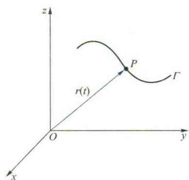
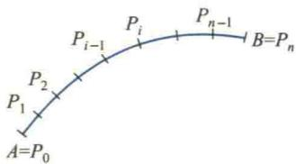

import ExerciseTrigger from '@/components/exercises/ExerciseTrigger.astro';
import QRCodeVideo from '@/components/QRCodeVideo.astro';

import Guide from '@/components/Guide.astro';
import Knowledge from '@/components/Knowledge.astro';
import Example from '@/components/Example.astro';
import Analysis from '@/components/Analysis.astro';
import Solution from '@/components/Solution.astro';
import Variant from '@/components/Variant.astro';
import Note from '@/components/Note.astro';
import SideNote from '@/components/SideNote.astro';
import Block from '@/components/Block.astro';
import Method from '@/components/Method.astro';
import Exercise from '@/components/Exercise.astro';

本节从空间曲线和曲面的参数表示出发，应用多元函数微分学的知识，以向量为工具，研究空间曲线的切线与法平面、以及曲面的切平面与法线。

## 6.1 空间曲线的切线与法平面

### 1. 曲线的参数方程

我们知道，平面曲线可以用参数方程 $x=x(t), y=y(t) \ (\alpha \leqslant t \leqslant \beta)$ 来表示。例如，椭圆 $\frac{x^2}{a^2} + \frac{y^2}{b^2} = 1$ 的参数方程是 $x=a\cos t, y=b\sin t \ (0 \leqslant t \leqslant 2\pi)$；空间直线 $L$ 的参数方程是

$$

\boldsymbol{r} = \boldsymbol{r}_0 + t\boldsymbol{a} \quad (-\infty < t < +\infty), \tag{6.1}

$$

或

$$

\begin{cases}
x = x_0 + lt, \\
y = y_0 + mt, \quad (-\infty < t < +\infty), \\
z = z_0 + nt
\end{cases}

$$

其中 $\boldsymbol{r}=(x,y,z)$ 为直线 $L$ 上动点 $P(x,y,z)$ 的向径，$\boldsymbol{r}_0=(x_0,y_0,z_0)$ 为直线 $L$ 上的已知定点 $(x_0,y_0,z_0)$ 的向径，$\boldsymbol{a}=(l,m,n)$ 为直线 $L$ 的方向向量。

由直线 $L$ 的参数方程可见，对于任一实数 $t$，按所给法则，在空间确定了唯一的点 $(x,y,z)$。因此，直线 $L$ 可以看作是从区间 $(-\infty, +\infty)$ 到 $\mathbf{R}^3$ 的映射 $\boldsymbol{r}(t)=\boldsymbol{r}_0+t\boldsymbol{a}$ 的像。

对于一般的空间曲线 $\Gamma$，也可看作是从区间 $[\alpha, \beta]$ 到 $\mathbf{R}^3$ 的一个连续映射 $\boldsymbol{r}$ 的像 $\{\boldsymbol{r}(t) \mid \alpha \leqslant t \leqslant \beta\}$，$\boldsymbol{r}(t)$ 就是向径 $\overrightarrow{OP}$（图 5.24）。当 $t$ 在区间 $[\alpha, \beta]$ 上变化时，向径 $\overrightarrow{OP}$ 端点 $P$ 的轨迹就是曲线 $\Gamma$。它的方程可表示为

$$

\boldsymbol{r} = \boldsymbol{r}(t) = (x(t), y(t), z(t)) \quad (\alpha \leqslant t \leqslant \beta), \tag{6.2}

$$

或

$$

\begin{cases}
x = x(t), \\
y = y(t), \\
z = z(t)
\end{cases} \quad (\alpha \leqslant t \leqslant \beta), \tag{6.3}

$$

称 (6.2) 或 (6.3) 式为空间曲线 $\Gamma$ 的参数方程。

<figure class="vp-figure">
  
  <figcaption>图 5.24 空间曲线 $\Gamma$ 的向径 $\boldsymbol{r}(t)$</figcaption>
</figure>

<Example title="例 6.1 螺旋线的参数方程">
在机械工程中常常遇到一种空间曲线，称为螺旋线，其形成规律是：动点 $P$ 沿半径为 $a$ 的圆周做匀速转动，而这圆周所在的平面又在空间做等速平移，移动的方向与圆周所在平面垂直。试推导此动点轨迹的方程。

**解** 取运动开始时（设 $t=0$）圆周的中心为坐标原点 $O$，圆周所在的平面为 $xOy$ 坐标面，$OP_0$ 的方向为 $x$ 轴的正向，其中 $P_0$ 为运动开始时动点的位置。圆周所在平面移动的方向为 $z$ 轴的正向（图 5.25）。

设点 $P$ 转动的角速度为 $\omega$，圆周沿 $z$ 轴方向移动的速度为 $v$，点 $P_0$ 的坐标为 $(a,0,0)$，于是经过时间 $t$ 后，动点沿圆周转动了一个角度 $\omega t$，并在 $z$ 轴方向上上升了一段距离 $QP = vt$。所以在时刻 $t$，动点的坐标是

$$

x = a\cos \omega t, \quad y = a\sin \omega t, \quad z = vt, \quad t \in [0, +\infty).

$$

这就是螺旋线的参数方程，写成向量形式就是

$$

\boldsymbol{r} = (a\cos \omega t, a\sin \omega t, vt), \quad t \in [0, +\infty).

$$

如果取 $\theta = \omega t$ 作变参量，便有

$$

x = a\cos \theta, \quad y = a\sin \theta, \quad z = k\theta, \quad \theta \in [0, +\infty),

$$

其中 $k = \frac{v}{\omega}$。可见因变参量的不同选择，曲线可以有不同的参数方程。
</Example>

<figure class="vp-figure">
  
  <figcaption>图 5.25 螺旋线的几何构造</figcaption>
</figure>

### 2. 简单曲线与有向曲线

设空间曲线 $\Gamma$ 的方程为 $\boldsymbol{r}=\boldsymbol{r}(t) \ (\alpha \leqslant t \leqslant \beta)$。如果向量值函数 $\boldsymbol{r}(t)$ 在 $[\alpha, \beta]$ 上连续，则 $\Gamma$ 为连续曲线；如果 $\Gamma$ 为连续曲线，且 $\forall t_1, t_2 \in (\alpha, \beta), t_1 \neq t_2$，均有 $\boldsymbol{r}(t_1) \neq \boldsymbol{r}(t_2)$，即在 $(\alpha, \beta)$ 上 $\boldsymbol{r}$ 为单射，则称 $\Gamma$ 为简单曲线。容易看出，简单曲线就是自身不相交的连续曲线。对于选定了参数 $t$ 的曲线 $\Gamma$，我们规定：增大的方向为 $\Gamma$ 的正向（自然地，$t$ 减小的方向，称 $\Gamma$ 的负向）。例如，螺旋线 $\boldsymbol{r} = (a\cos \theta, a\sin \theta, k\theta) \ (k>0)$ 的正向为上升的方向。对于规定了正向的曲线，称其为有向曲线。以下讨论的曲线均指有向曲线。

### 3. 空间曲线的切线与法平面

设空间简单曲线 $\Gamma$ 的方程为

$$

\boldsymbol{r} = \boldsymbol{r}(t) = (x(t), y(t), z(t)) \quad (\alpha \leqslant t \leqslant \beta),

$$

其中向量值函数 $\boldsymbol{r}(t)$ 在 $[\alpha, \beta]$ 上可导，其导数记作 $\dot{\boldsymbol{r}}(t)$，且有

$$

\dot{\boldsymbol{r}}(t) = (\dot{x}(t), \dot{y}(t), \dot{z}(t)) \neq \boldsymbol{0} \quad (\alpha \leqslant t \leqslant \beta).

$$

我们来讨论 $\Gamma$ 在点 $P_0(x(t_0), y(t_0), z(t_0))$ 处的切线方程。

与平面曲线的切线一样，空间曲线上点 $P_0$ 处的切线也定义为曲线上点 $P_0$ 的割线 $P_0P$，当点 $P$ 沿曲线趋于点 $P_0$ 时的极限位置 $P_0T$（图 5.26）。要求此切线的方程，关键在于求出它的一个方向向量。为此，在 $\Gamma$ 上点 $P_0$ 的邻近取点 $P(x(t_0+\Delta t), y(t_0+\Delta t), z(t_0+\Delta t))$，点 $P_0$ 与 $P$ 所对应的向径分别为 $\boldsymbol{r}(t_0)$ 与 $\boldsymbol{r}(t_0+\Delta t)$。从而向量

$$

\overrightarrow{P_0P} = \boldsymbol{r}(t_0+\Delta t) - \boldsymbol{r}(t_0) = \Delta \boldsymbol{r}

$$

为割线 $P_0P$ 的一个方向向量。容易看出，向量

$$

\frac{\overrightarrow{P_0P}}{\Delta t} = \frac{\Delta \boldsymbol{r}}{\Delta t} \tag{6.3}

$$

也是割线 $P_0P$ 的一个方向向量，而且不论 $\Delta t$ 是正的还是负的，$\frac{\Delta \boldsymbol{r}}{\Delta t}$ 的方向始终与曲线 $\Gamma$ 的参数 $t$ 增大的方向（即 $\Gamma$ 的正向）相一致。令 $\Delta t \to 0$，对 (6.3) 式两端取极限得

$$

\lim_{\Delta t \to 0} \frac{\overrightarrow{P_0P}}{\Delta t} = \lim_{\Delta t \to 0} \frac{\Delta \boldsymbol{r}}{\Delta t} = \dot{\boldsymbol{r}}(t_0).

$$

由于 $\boldsymbol{r}(t)$ 的连续性，当 $\Delta t \to 0$ 时，$\overrightarrow{P_0P} = \Delta \boldsymbol{r} \to \boldsymbol{0}$，点 $P$ 沿曲线 $\Gamma$ 趋于点 $P_0$，从而割线 $P_0P$ 变成了切线 $P_0T$，而割线的方向向量变成了相应切线的方向向量 $\dot{\boldsymbol{r}}(t_0)$。由此可见：向径 $\boldsymbol{r}(t)$ 的导数 $\dot{\boldsymbol{r}}(t_0)$ 在几何上就表示曲线 $\Gamma$ 在相应点 $P_0$ 处的切线 $P_0T$ 的一个方向向量，而且它的方向与 $\Gamma$ 的正向相一致，称它为 $\Gamma$ 在点 $P_0$ 处的切向量。

<figure class="vp-figure">
  
  <figcaption>图 5.26 空间曲线切线的几何定义</figcaption>
</figure>

<SideNote title="注意">
曲线的正向总规定为对应于 $t$ 增大的方向。因此，当 $\Delta t > 0$ 时，$\Delta \boldsymbol{r} = \boldsymbol{r}(t_0+\Delta t) - \boldsymbol{r}(t_0)$ 与曲线正向一致，从而 $\frac{\Delta \boldsymbol{r}}{\Delta t}$ 与曲线正向也一致；当 $\Delta t < 0$ 时，$\Delta \boldsymbol{r}$ 的方向与曲线正向相反，但由于 $\Delta t < 0$，故 $\frac{\Delta \boldsymbol{r}}{\Delta t}$ 的方向仍与曲线正向一致，从而切向量 $\dot{\boldsymbol{r}}(t_0)$ 的方向始终指向曲线的正向。它的模为

$$

\|\dot{\boldsymbol{r}}(t_0)\| = \sqrt{\dot{x}^2(t_0) + \dot{y}^2(t_0) + \dot{z}^2(t_0)}.

$$

</SideNote>

利用直线方程的向量形式，可将曲线 $\Gamma$ 在 $P_0(\boldsymbol{r}(t_0))$ 处切线的向量方程写为

$$

\boldsymbol{\rho} = \boldsymbol{r}(t_0) + t\dot{\boldsymbol{r}}(t_0), \tag{6.4}

$$

其中 $\boldsymbol{\rho}=(x,y,z)$ 为切线上动点 $P(x,y,z)$ 的向径，$t \in \mathbf{R}$ 为参数。消去参数 $t$，即得该切线的对称式方程

$$

\frac{x - x(t_0)}{\dot{x}(t_0)} = \frac{y - y(t_0)}{\dot{y}(t_0)} = \frac{z - z(t_0)}{\dot{z}(t_0)}. \tag{6.5}

$$

由以上可知，当 $\boldsymbol{r}=\boldsymbol{r}(t)$ 可导，且 $\dot{\boldsymbol{r}}(t) \neq \boldsymbol{0} \ (\alpha \leqslant t \leqslant \beta)$ 时，曲线 $\Gamma$ 各点处都存在切线。进一步，如果 $\dot{\boldsymbol{r}}(t)$ 在 $[\alpha, \beta]$ 上连续，则切线方向连续变化。一般地，称切线方向连续变化的曲线为光滑曲线。因此，当函数 $\boldsymbol{r}(t)$ 在 $[\alpha, \beta]$ 上有连续的导数且 $\dot{\boldsymbol{r}}(t) \neq \boldsymbol{0} \ (\alpha \leqslant t \leqslant \beta)$ 时，曲线 $\boldsymbol{r}=\boldsymbol{r}(t) \ (\alpha \leqslant t \leqslant \beta)$ 为光滑曲线。如果曲线 $\Gamma$ 不是光滑曲线，但将其分成若干段后，每段都是光滑曲线，则称 $\Gamma$ 为分段光滑曲线。

过曲线 $\Gamma$ 上点 $P_0$ 且与点 $P_0$ 处的切线垂直的任一直线称为此曲线 $\Gamma$ 在 $P_0$ 处的法线，这些法线显然位于同一平面内，此平面称为 $\Gamma$ 在点 $P_0$ 的法平面。显然 $\dot{\boldsymbol{r}}(t_0)$ 是法平面的一个法向量，于是法平面的方程是

$$

\dot{\boldsymbol{r}}(t_0) \cdot [\boldsymbol{\rho} - \boldsymbol{r}(t_0)] = 0,

$$

或

$$

\dot{x}(t_0)[x - x(t_0)] + \dot{y}(t_0)[y - y(t_0)] + \dot{z}(t_0)[z - z(t_0)] = 0, \tag{6.6}

$$

其中 $\boldsymbol{\rho}=(x,y,z)$ 是法平面上点 $(x,y,z)$ 的向径。

如果曲线 $\Gamma$ 是由两柱面的交线给出，设它的方程为

$$

\begin{cases}
y = y(x), \\
z = z(x)
\end{cases} \quad (a \leqslant x \leqslant b),

$$

把 $x$ 看作参数，上式也可写成参数方程形式

$$

x = x, \quad y = y(x), \quad z = z(x) \quad (a \leqslant x \leqslant b),

$$

那么 $\Gamma$ 上与参数 $x=x_0$ 相对应的点处的切线方程是

$$

\frac{x - x_0}{1} = \frac{y - y(x_0)}{\dot{y}(x_0)} = \frac{z - z(x_0)}{\dot{z}(x_0)}, \tag{6.7}

$$

法平面方程是

$$

x - x_0 + \dot{y}(x_0)[y - y(x_0)] + \dot{z}(x_0)[z - z(x_0)] = 0. \tag{6.8}

$$

如果曲线 $\Gamma$ 的方程由一般形式方程

$$

\begin{cases}
F(x,y,z) = 0, \\
G(x,y,z) = 0
\end{cases} \tag{6.9}

$$

给出，且在点 $P_0(x_0,y_0,z_0)$ 的某邻域内方程组 (6.9) 满足隐函数存在定理的条件，不妨设

$$

\left. \frac{\partial(F,G)}{\partial(y,z)} \right|_{P_0} \neq 0,

$$

那么在点 $P_0$ 的某邻域内由 (6.9) 式确定了两个具有连续导数的一元隐函数 $y=y(x)$ 和 $z=z(x)$。由隐函数求导法求出 $\dot{y}(x_0)$ 和 $\dot{z}(x_0)$ 之后，代入 (6.7) 和 (6.8) 式，即得曲线 $\Gamma$ 在点 $P_0$ 处的切线方程和法平面方程。

<SideNote title="注意">
在曲线 $\boldsymbol{r}=\boldsymbol{r}(t)$ 上，$\mathrm{d}\boldsymbol{r} = (\mathrm{d}x, \mathrm{d}y, \mathrm{d}z) = (\dot{x}, \dot{y}, \dot{z})\mathrm{d}t$ 与 $(\dot{x}, \dot{y}, \dot{z})$ 共线，因而向量 $(\mathrm{d}x, \mathrm{d}y, \mathrm{d}z)$ 也是曲线 $\boldsymbol{r}=\boldsymbol{r}(t)$ 的一个切向量。因此，求曲线 (6.9) 在点 $P_0$ 处的切向量也可以用下面的方法：由 (6.9) 式两端求全微分，并将点 $P_0$ 代入，得

$$

\begin{cases}
F_x(P_0)\mathrm{d}x + F_y(P_0)\mathrm{d}y + F_z(P_0)\mathrm{d}z = 0, \\
G_x(P_0)\mathrm{d}x + G_y(P_0)\mathrm{d}y + G_z(P_0)\mathrm{d}z = 0.
\end{cases}

$$

将上式看作是以 $\mathrm{d}x, \mathrm{d}y, \mathrm{d}z$ 为未知量的齐次线性代数方程组，由于其所含方程数 (2) 小于未知量数 (3)，由线性代数的知识知它必有非零解，求出它的任意一个非零解 $(\mathrm{d}x, \mathrm{d}y, \mathrm{d}z)|_{P_0}$，便是曲线 (6.9) 在点 $P_0$ 处的一个切向量。
</SideNote>

<Example title="例 6.2 求曲线交线处的切线与法平面">
求曲线 $\begin{cases} 2x^2+y^2+z^2=45 \\ x^2+2y^2=z \end{cases}$ 在点 $P_0(-2,1,6)$ 处的切线与法平面方程。

**解** 由曲线方程两端求全微分，利用一阶全微分形式不变性，得

$$

\begin{cases}
4x\mathrm{d}x + 2y\mathrm{d}y + 2z\mathrm{d}z = 0, \\
2x\mathrm{d}x + 4y\mathrm{d}y - \mathrm{d}z = 0.
\end{cases}

$$

将点 $P_0$ 的坐标代入，得

$$

\begin{cases}
4\mathrm{d}x - 2\mathrm{d}y - 12\mathrm{d}z = 0, \\
-4\mathrm{d}x + 4\mathrm{d}y - \mathrm{d}z = 0.
\end{cases}

$$

（注：此处根据原书计算过程，代入 $P_0(-2,1,6)$ 后应为 $4(-2)\mathrm{d}x + 2(1)\mathrm{d}y + 2(6)\mathrm{d}z = -8\mathrm{d}x + 2\mathrm{d}y + 12\mathrm{d}z = 0$，化简为 $4\mathrm{d}x - \mathrm{d}y - 6\mathrm{d}z = 0$。原书此处可能有笔误或印刷问题，以下按原书结果进行）

容易求出这个齐次线性代数方程组的一个非零解是

$$

(\mathrm{d}x, \mathrm{d}y, \mathrm{d}z)|_{P_0} = (25, 28, 12),

$$

它就是曲线在点 $P_0$ 处的一个切向量。从而切线的方程是

$$

\frac{x+2}{25} = \frac{y-1}{28} = \frac{z-6}{12},

$$

法平面方程是

$$

25(x+2) + 28(y-1) + 12(z-6) = 0,

$$

或

$$

25x + 28y + 12z - 50 = 0.

$$

</Example>

## 6.2 弧长

### 1. 弧长的定义与计算

弧长是指一般曲线的长度，这在直观上是容易理解的。但直至目前，我们并未严格地定义它，更不知如何计算它。我们知道，对于联结两点 $P_1(x_1,y_1,z_1)$ 与 $P_2(x_2,y_2,z_2)$ 的直线段，其长度为

$$

\|\overrightarrow{P_1P_2}\| = \sqrt{(x_1-x_2)^2 + (y_1-y_2)^2 + (z_1-z_2)^2}. \tag{6.10}

$$

对于曲线段，当弧段很短时可以近似地看成是直线段，从而可以利用公式 (6.10) 来近似计算它的长度。因此，我们可以利用积分的思想来定义和计算曲线的弧长。

<Knowledge title="定义 6.1 (弧长)">
设简单曲线 $\Gamma$ 的方程是 $\boldsymbol{r}=\boldsymbol{r}(t) = (x(t), y(t), z(t)) \ (\alpha \leqslant t \leqslant \beta)$。$\Gamma$ 的两个端点 $A, B$ 分别对应于向径 $\boldsymbol{r}(\alpha), \boldsymbol{r}(\beta)$，在 $\Gamma$ 上介于 $A$ 和 $B$ 之间沿着参数 $t$ 增大的方向依次取 $n-1$ 个分点 $P_1, P_2, \dots, P_{n-1}$（图 5.27），它们把 $\Gamma$ 分成了 $n$ 段。用直线段把相邻点联结起来，即得一折线，它的长度是

$$

s_n = \sum_{i=1}^n \|\overrightarrow{P_{i-1}P_i}\|,

$$

其中记 $A=P_0, B=P_n$。如果不论分点如何选取，当 $d = \max_{1 \leqslant i \leqslant n} \|\overrightarrow{P_{i-1}P_i}\| \to 0$ 时，折线的长度 $s_n$ 有确定的极限 $s$，则称 $\Gamma$ 为可求长的曲线，且称这个极限值 $s$ 为 $\Gamma$ 的长度，或 $\Gamma$ 的弧长，即

$$

s = \lim_{d \to 0} \sum_{i=1}^n \|\overrightarrow{P_{i-1}P_i}\|.

$$

</Knowledge>

<figure class="vp-figure">
  
  <figcaption>图 5.27 弧长定义的折线逼近过程</figcaption>
</figure>

<Knowledge title="定理 6.1 (弧长的计算公式)">
设在 $[\alpha, \beta]$ 上 $\dot{\boldsymbol{r}}(t)$ 连续且 $\dot{\boldsymbol{r}}(t) \neq \boldsymbol{0}$，则曲线 $\boldsymbol{r}=\boldsymbol{r}(t) \ (\alpha \leqslant t \leqslant \beta)$ 可求长的曲线，且 $\Gamma$ 的长度为

$$

s = \int_\alpha^\beta \|\dot{\boldsymbol{r}}(t)\| \mathrm{d}t = \int_\alpha^\beta \sqrt{[\dot{x}(t)]^2 + [\dot{y}(t)]^2 + [\dot{z}(t)]^2} \mathrm{d}t. \tag{6.11}

$$

</Knowledge>

**证** 设分点 $P_i$ 对应于参数 $t_i \ (i=0, 1, \dots, n)$，其中 $t_0=\alpha, t_n=\beta$。这样便有

$$

\alpha = t_0 < t_1 < \dots < t_{n-1} < t_n = \beta.

$$

首先求 $\|\overrightarrow{P_{i-1}P_i}\|$ 的表达式。由于

$$

\|\overrightarrow{P_{i-1}P_i}\| = \|\boldsymbol{r}(t_i) - \boldsymbol{r}(t_{i-1})\| = \sqrt{(\Delta x_i)^2 + (\Delta y_i)^2 + (\Delta z_i)^2},

$$

利用 Lagrange 微分中值公式得

$$

\|\overrightarrow{P_{i-1}P_i}\| = \sqrt{[\dot{x}(\xi_i)]^2 + [\dot{y}(\eta_i)]^2 + [\dot{z}(\zeta_i)]^2} \Delta t_i,

$$

其中 $\Delta t_i = t_i - t_{i-1}, \ \xi_i, \eta_i, \zeta_i \in (t_{i-1}, t_i), \ i=1, 2, \dots, n$。

为了使上式右端根式中的函数在同一点处取值，将其变形得到

$$

\|\overrightarrow{P_{i-1}P_i}\| = \sqrt{[\dot{x}(\xi_i)]^2 + [\dot{y}(\xi_i)]^2 + [\dot{z}(\xi_i)]^2} \Delta t_i + R_i \Delta t_i = \|\dot{\boldsymbol{r}}(\xi_i)\| \Delta t_i + R_i \Delta t_i,

$$

其中

$$

R_i = \sqrt{[\dot{x}(\xi_i)]^2 + [\dot{y}(\eta_i)]^2 + [\dot{z}(\zeta_i)]^2} - \sqrt{[\dot{x}(\xi_i)]^2 + [\dot{y}(\xi_i)]^2 + [\dot{z}(\xi_i)]^2}. \tag{6.12}

$$

于是

$$

s_n = \sum_{i=1}^n \|\overrightarrow{P_{i-1}P_i}\| = \sum_{i=1}^n \|\dot{\boldsymbol{r}}(\xi_i)\| \Delta t_i + \sum_{i=1}^n R_i \Delta t_i. \tag{6.13}

$$

令 $\lambda = \max \Delta t_i$，由积分的定义和存在定理，易知

$$

\lim_{\lambda \to 0} \sum_{i=1}^n \|\dot{\boldsymbol{r}}(\xi_i)\| \Delta t_i = \int_\alpha^\beta \|\dot{\boldsymbol{r}}(t)\| \mathrm{d}t. \tag{6.14}

$$

这样，由 (6.13) 式及 (6.14) 式便知，要证明 (6.11) 式成立，只要证明

$$

\lim_{\lambda \to 0} \sum_{i=1}^n R_i \Delta t_i = 0. \tag{6.15}

$$

为此，我们来估计 $R_i$。利用不等式：

$$

|\sqrt{a_1^2 + a_2^2 + a_3^2} - \sqrt{b_1^2 + b_2^2 + b_3^2}| \leqslant |a_1 - b_1| + |a_2 - b_2| + |a_3 - b_3|,

$$

由 (6.12) 式便得

$$

|R_i| \leqslant |\dot{y}(\eta_i) - \dot{y}(\xi_i)| + |\dot{z}(\zeta_i) - \dot{z}(\xi_i)|.

$$

因为 $\dot{y}(t), \dot{z}(t)$ 在 $[\alpha, \beta]$ 上连续，从而在 $[\alpha, \beta]$ 上一致连续，所以 $\forall \varepsilon > 0, \exists \delta = \delta(\varepsilon) > 0$，只要 $|t' - t''| < \delta$，就有

$$

|\dot{y}(t') - \dot{y}(t'')| < \varepsilon, \quad |\dot{z}(t') - \dot{z}(t'')| < \varepsilon.

$$

特别地，当 $\lambda = \max \Delta t_i < \delta$ 时，有

$$

|R_i| < 2\varepsilon, \quad \left| \sum_{i=1}^n R_i \Delta t_i \right| < 2\varepsilon(\beta - \alpha),

$$

从而 (6.15) 式成立。

<ExerciseTrigger chapter={5} section="5.6" title="5.6 多元函数微分学在几何上的简单应用 课后真题与自测练习" />
