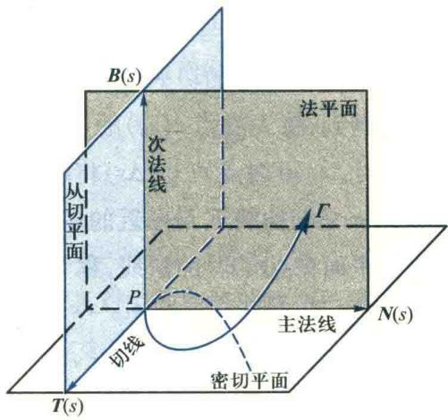
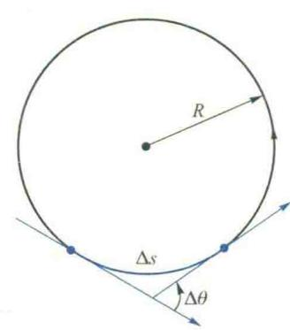
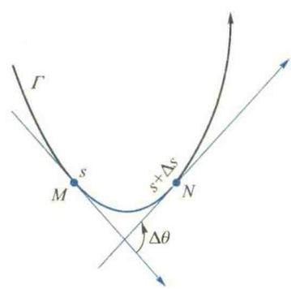
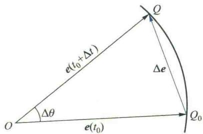
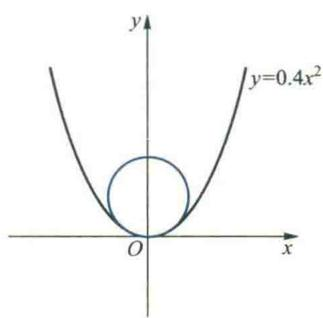
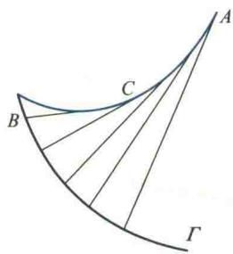

import Guide from '@/components/Guide.astro';
import Knowledge from '@/components/Knowledge.astro';
import Example from '@/components/Example.astro';
import Analysis from '@/components/Analysis.astro';
import Solution from '@/components/Solution.astro';
import Variant from '@/components/Variant.astro';
import Note from '@/components/Note.astro';
import Block from '@/components/Block.astro';
import Method from '@/components/Method.astro';

本节将利用多元函数微分学的知识和向量工具对空间曲线的性态作进一步的研究.为此,我们先介绍 Frenet 活动标架,然后利用它来讨论曲线的曲率与挠率.

## 7.1 Frenet 标架

在曲线的研究中,用曲线上建立活动的坐标系来取代原有固定的直角坐标系会带来许多方便.例如,船在大海中航行,对于时刻t在海平面上或空中所发现的目标,往往以此时刻船的位置为坐标原点所建立的某一坐标系来测量目标的位置.当t变化时,这一坐标系将作为一刚体随船的航线而变化.

回顾空间直角坐标系,我们是用三个相互正交的平面的交线来构造坐标架的.要在曲线上建立活动的坐标架,自然也希望寻找三个由曲线特征所确定的相互正交的平面,用它们的交线来构造坐标架.以下设曲线 $\Gamma$ 的自然参数方程为 $r=r(s)$ , 而 $\Gamma$ 的一般参数方程用 $r=r(t)$ 表示.为了区分它们的导数,我们用 $r', r'', \cdots$ 分别表示 $\frac{dr}{ds}, \frac{d^{2}r}{ds^{2}}, \cdots$ , 用 $\dot{r}, \ddot{r}, \cdots$ 分别表示 $\frac{dr}{dt}, \frac{d^{2}r}{dt^{2}}, \cdots$ , 并且假定所出现的函数 r 的导数都是连续的.

## 1. 法平面与切线

设 $r'(s) \neq 0$ . 在上一节中已经指出, $r'(s_0)$ 是 $\Gamma$ 在点 $r(s_0)$ 处其正向与 $\Gamma$ 正向一致的单位切向量, 记作 $T(s_0)$ . 即

$$

\boldsymbol {T} (s _ {0}) = \boldsymbol {r} ^ {\prime} (s _ {0}),\tag{7.1}

$$

于是 $\Gamma$ 在点 $r(s_0)$ 的法平面方程为

$$

\left(\boldsymbol {\rho} - \boldsymbol {r} (s _ {0})\right) \cdot \boldsymbol {r} ^ {\prime} (s _ {0}) = 0,

$$

其中 $\rho$ 是法平面上动点的向径. $\Gamma$ 在点 $r(s_{0})$ 的切线方程为

$$

\boldsymbol {\rho} = \boldsymbol {r} (s _ {0}) + \lambda \boldsymbol {r} ^ {\prime} (s _ {0}),

$$

其中 $\rho$ 是切线上动点的向径, $\lambda \in R$ 为参数.

## 2. 密切平面与次法线

通过 $\Gamma$ 上点 $r(s_0)$ 的切线的平面称为 $\Gamma$ 在点 $r(s_0)$ 的切平面. 显然, 这种切平面有无穷多个, 其中哪一个与曲线 $\Gamma$ 最贴近呢? 如果 $\Gamma$ 是平面曲线, 那么显然 $\Gamma$ 所在的平面就是与 $\Gamma$ 最贴近的切平面. 当 $\Gamma$ 是空间曲线时, 与它最贴近的切平面可以用如下的方法得到: 将 $\Gamma$ 在点 $r(s_0)$ 的切线与 $\Gamma$ 上 $r(s_0)$ 邻近的点 $r(s_0 + \Delta s)$ 所确定的平面记作 $\pi'$ , 当 $\Delta s \to 0$ 时点 $r(s_0 + \Delta s)$ 将沿 $\Gamma$ 趋于点 $r(s_0)$ , 如果此时 $\pi'$ 有极限位置 $\pi$ , 那么就认为 $\pi$ 是与曲线 $\Gamma$ 最贴近的切平面, 称它为曲线 $\Gamma$ 在点 $r(s_0)$ 处的密切平面; 而把密切平面在点 $r(s_0)$ 的法线, 称为曲线 $\Gamma$ 在点 $r(s_0)$ 的次法线. 下面来求它们的方程.

由平面 $\pi'$ 的构造可知，向量 $r'(s_0)$ 与 $r(s_0 + \Delta s) - r(s_0)$ 均在 $\pi'$ 上，从而 $\pi'$ 的法向量可取为

$$

\boldsymbol {r} ^ {\prime} (s _ {0}) \times (\boldsymbol {r} (s _ {0} + \Delta s) - \boldsymbol {r} (s _ {0})).

$$

对向量 $\boldsymbol{r}(s_{0}+\Delta s)-\boldsymbol{r}(s_{0})$ 的各分量分别应用一元函数的 Taylor 公式, 可得

$$

\boldsymbol {r} (s _ {0} + \Delta s) - \boldsymbol {r} (s _ {0}) = \boldsymbol {r} ^ {\prime} (s _ {0}) \Delta s + \frac {1}{2 !} (\boldsymbol {r} ^ {\prime \prime} (s _ {0}) + \varepsilon) \Delta s ^ {2},

$$

其中 $\Delta s\to0$ 时 $\varepsilon\to0$ . 注意到 $r'(s_{0})\times r'(s_{0})=0$ , 从而

$$

\boldsymbol {r} ^ {\prime} (s _ {0}) \times (\boldsymbol {r} (s _ {0} + \Delta s) - \boldsymbol {r} (s _ {0})) = \frac {\Delta s ^ {2}}{2} \boldsymbol {r} ^ {\prime} (s _ {0}) \times (\boldsymbol {r} ^ {\prime \prime} (s _ {0}) + \varepsilon),

$$

所以， $\boldsymbol{r}^{\prime}(s_{0})\times(\boldsymbol{r}^{\prime\prime}(s_{0})+\boldsymbol{\varepsilon})$ 也是 $\pi^{\prime}$ 的法向量. 令 $\Delta s\to0$ ，得这个向量积的极限为 $\boldsymbol{r}^{\prime}(s_{0})\times\boldsymbol{r}^{\prime\prime}(s_{0})$ . 因此，当 $\boldsymbol{r}^{\prime}(s_{0})\times\boldsymbol{r}^{\prime\prime}(s_{0})\neq\mathbf{0}$ 时，可得 $\Gamma$ 在点 $\boldsymbol{r}(s_{0})$ 次法线的方向向量（简称为次法向量）为

$$

\boldsymbol {r} ^ {\prime} (s _ {0}) \times \boldsymbol {r} ^ {\prime \prime} (s _ {0}).

$$

由于 $\|r'(s)\|=1$ ，即向量 $r'(s)$ 的模不变，由本章习题5.5(A)第4题可知

$$

\boldsymbol {r} ^ {\prime} (s _ {0}) \perp \boldsymbol {r} ^ {\prime \prime} (s _ {0}),\tag{7.2}

$$

于是由向量积的定义可知， $\Gamma$ 在点 $\boldsymbol{r}(s_{0})$ 处的单位次法向量（记为 $\boldsymbol{B}(s_{0})$ ）为

$$

\boldsymbol {B} \left(s _ {0}\right) = \frac {\boldsymbol {r} ^ {\prime} \left(s _ {0}\right) \times \boldsymbol {r} ^ {\prime \prime} \left(s _ {0}\right)}{\| \boldsymbol {r} ^ {\prime} \left(s _ {0}\right) \times \boldsymbol {r} ^ {\prime \prime} \left(s _ {0}\right) \|} = \frac {\boldsymbol {r} ^ {\prime} \left(s _ {0}\right) \times \boldsymbol {r} ^ {\prime \prime} \left(s _ {0}\right)}{\| \boldsymbol {r} ^ {\prime \prime} \left(s _ {0}\right) \|}.\tag{7.3}

$$

所以， $\Gamma$ 在点 $\boldsymbol{r}(s_{0})$ 的密切平面方程为

$$

\boldsymbol {B} (s _ {0}) \cdot (\boldsymbol {\rho} - \boldsymbol {r} (s _ {0})) = 0,

$$

或

$$

\left(\boldsymbol {r} ^ {\prime} \left(s _ {0}\right) \times \boldsymbol {r} ^ {\prime \prime} \left(s _ {0}\right)\right) \cdot (\boldsymbol {\rho} - \boldsymbol {r} \left(s _ {0}\right)) = 0.

$$

$\Gamma$ 在 $\boldsymbol{r}(s_{0})$ 处的次法线方程为

$$

\boldsymbol {\rho} = \boldsymbol {r} (s _ {0}) + \lambda \boldsymbol {B} (s _ {0}),

$$

或

$$

\boldsymbol {\rho} = \boldsymbol {r} (s _ {0}) + \lambda (\boldsymbol {r} ^ {\prime} (s _ {0}) \times \boldsymbol {r} ^ {\prime \prime} (s _ {0})).

$$

## 3. 从切平面与主法线

由 $\Gamma$ 在点 $\boldsymbol{r}(s_{0})$ 即点 P 的切向量 $\boldsymbol{T}(s_{0})=\boldsymbol{r}^{\prime}(s_{0})$ 与次法向量 $\boldsymbol{B}(s_{0})$ 所确定的平面, 称为曲线 $\Gamma$ 在点 $\boldsymbol{r}(s_{0})$ 的从切平面(图 5.34), 它显然既垂直于法平面也垂直于密切平面. 从切平面在点 $\boldsymbol{r}(s_{0})$ 的法线称为曲线 $\Gamma$ 在点 $\boldsymbol{r}(s_{0})$ 的主法线, 并取

$$

\boldsymbol {N} (s _ {0}) = \boldsymbol {B} (s _ {0}) \times \boldsymbol {T} (s _ {0})\tag{7.4}

$$

作为 $\Gamma$ 在点 $\boldsymbol{r}(s_{0})$ 的主法线的单位方向

图 5.34

向量(简称为单位主法向量).于是 $\Gamma$ 过点 $\boldsymbol{r}(s_{0})$ 的从切平面与主法线的方程分别为

$$

\left(\boldsymbol {\rho} - \boldsymbol {r} \left(s _ {0}\right)\right) \cdot \boldsymbol {N} \left(s _ {0}\right) = 0, \quad \boldsymbol {\rho} = \boldsymbol {r} \left(s _ {0}\right) + \lambda \boldsymbol {N} \left(s _ {0}\right).

$$

主法向量的表达式(7.4)还可以简化.把表达式(7.3)与(7.1)代入(7.4)得

$$

\boldsymbol {N} (s _ {0}) = \frac {1}{\| \boldsymbol {r} ^ {\prime \prime} (s _ {0}) \|} (\boldsymbol {r} ^ {\prime} (s _ {0}) \times \boldsymbol {r} ^ {\prime \prime} (s _ {0})) \times \boldsymbol {r} ^ {\prime} (s _ {0}),

$$

再由(7.2)式可知, $N(s_{0})$ 与 $r''(s_{0})$ 平行且同向.又由于 $\|N(s_{0})\|=1$ ,所以

$$

N (s _ {0}) = \frac {\boldsymbol {r} ^ {\prime \prime} (s _ {0})}{\| \boldsymbol {r} ^ {\prime \prime} (s _ {0}) \|}.\tag{7.5}

$$

容易看出,曲线 $\Gamma$ 在点 $r(s_{0})$ 处的从切平面、密切平面和法平面相互正交,它们的三条交线分别是 $\Gamma$ 的切线、主法线和次法线(图 5.34).而相互正交的三个单位向量 T,N 和 B 构成以点 P 为原点的空间(右手)直角坐标系,称为曲线 $\Gamma$ 在点 $P=r(s_{0})$ 处的 Frenet 标架.当点 P 沿曲线 $\Gamma$ 移动时,这个标架贴附在 $\Gamma$ 上作为一个刚体

随之而移动,因此又称其为活动标架.

以上,标架向量 T, N, B 是在曲线 $\Gamma$ 的方程由自然参数方程 $\boldsymbol{r} = \boldsymbol{r}(s)$ 给出的情形下推导出的. 如果 $\Gamma$ 的方程由一般参数方程 $\boldsymbol{r} = \boldsymbol{r}(t)$ 给出, 则可以证明(习题 5.7(A) 第 1 题), 当 $\dot{\boldsymbol{r}}(t_0) \neq \boldsymbol{0}, \ddot{\boldsymbol{r}}(t_0) \neq \boldsymbol{0}$ 时, $\Gamma$ 上点 $\boldsymbol{r}(t_0)$ 处的单位切向量 $\boldsymbol{T}(t_0)$ 及单位次法向量 $\boldsymbol{B}(t_0)$ 的计算公式分别为

$$

\pmb {T} (t _ {0}) = \frac {\dot {\pmb {r}} (t _ {0})}{\| \dot {\pmb {r}} (t _ {0}) \|} \quad \text {与} \quad \pmb {B} (t _ {0}) = \frac {\dot {\pmb {r}} (t _ {0}) \times \ddot {\pmb {r}} (t _ {0})}{\| \dot {\pmb {r}} (t _ {0}) \times \ddot {\pmb {r}} (t _ {0}) \|},\tag{7.6}

$$

而当按照(7.6)式算出 $T(t_{0})$ 及 $B(t_{0})$ 时，则 $r(t_{0})$ 处的单位主法向量 $N(t_{0})$ 便可由公式 $N(t_{0})=B(t_{0})\times T(t_{0})$ 算出。上述向量 $T(t_{0}),N(t_{0}),B(t_{0})$ 即构成 $\Gamma$ 上 $r(t_{0})$ 处的Frenet标架向量。

<Example title="例 7.1">
求螺旋线 $r=(a\cos t, a\sin t, kt)$ 的 Frenet 标架、密切平面以及从切平面的方程.

<Solution title="解">
由于

$\dot{\boldsymbol{r}} = (-a\sin t, a\cos t, k)$ , $\ddot{\boldsymbol{r}} = (-a\cos t, -a\sin t, 0)$ , $\dot{\boldsymbol{r}} \times \ddot{\boldsymbol{r}} = a(k\sin t, -k\cos t, a)$ ,

所以

$$

\| \dot {\boldsymbol {r}} \| = \sqrt {a ^ {2} + k ^ {2}}, \quad \| \dot {\boldsymbol {r}} \times \ddot {\boldsymbol {r}} \| = a \sqrt {a ^ {2} + k ^ {2}}.

$$

于是由公式(7.6)即得

$$

T = \frac {\dot {r}}{\| \dot {r} \|} = \frac {1}{\sqrt {a ^ {2} + k ^ {2}}} (- a \sin t, a \cos t, k),

$$

$$

\boldsymbol {B} = \frac {\dot {\boldsymbol {r}} \times \ddot {\boldsymbol {r}}}{\| \dot {\boldsymbol {r}} \times \ddot {\boldsymbol {r}} \|} = \frac {1}{\sqrt {a ^ {2} + k ^ {2}}} (k \sin t, - k \cos t, a),

$$

从而得

$$

\boldsymbol {N} = \boldsymbol {B} \times \boldsymbol {T} = (- \cos t, - \sin t, 0).

$$

上述三向量 T, N, B 所构成的坐标系即为所求 Frenet 标架.

密切平面的方程为

$$

\boldsymbol {B} (t) \cdot (\boldsymbol {\rho} - \boldsymbol {r} (t)) = 0,

$$

即

$$

k \sin t (x - a \cos t) - k \cos t (y - a \sin t) + a (z - k t) = 0.

$$

从切平面的方程为

$$

\boldsymbol {N} (t) \cdot (\boldsymbol {\rho} - \boldsymbol {r} (t)) = 0,

$$

即

$$

- \cos t (x - a \cos t) - \sin t (y - a \sin t) = 0.

$$
</Solution>
</Example>

## 7.2 曲率

## 1. 曲率的定义与计算

通俗地讲,所谓曲率就是指曲线上各点的弯曲程度.在工程技术、生产实践和自然科学中,不少问题与曲线的弯曲程度有关.例如,在铁路转弯处,铁道的外轨要比内轨高,而且转弯愈急,也即“弯曲”愈大处,内、外轨的高度差也就愈大,这是由于做转动的列车在“弯曲”较大处所受的向心力愈大的缘故.再如,车床的主轴由于自重总会

产生弯曲变形,如果弯曲过大,就将影响车床的精度和正常运行.为了从数量上刻画曲线的弯曲程度,需要引入一个度量概念——曲率.

如果所考察的平面曲线 $\Gamma$ 是半径为 R 的圆周（图 5.35），曲线上各点处的弯曲程度是一样的。这时，我们可以用单位弧段上，曲线切线所转过的角度即 $\frac{\Delta\theta}{\Delta s}$ 来度量曲线的弯曲程度，其中 $\Delta\theta$ 是在弧段 $\Delta s$ 上切线所转过的角度。显然对圆周来说，

  

图5.35

$$

\frac {\Delta \theta}{\Delta s} = C (\text {常数}).

$$

即,曲线上切线的转角 $\theta$ 随弧长 s 均匀变化.所以,我们就用 $\frac{\Delta\theta}{\Delta s}$ 来作为圆周弯曲程度的度量,称为圆周的曲率.

对一般的曲线来说,各点处的弯曲程度不尽相同(图5.36),换句话说,曲线上切线的转角 $\theta$ 随弧长s的变化是非均匀的.这时 $\frac{\Delta\theta}{\Delta s}$ 并非常数,它只能表示从 $s_{0}$ 到 $s_{0}+\Delta s$ 弧段上的平均弯曲程度,称为平均曲率.为了精确地刻画曲线在一点的弯曲程度,需要令 $\Delta s\rightarrow0$ ,对平均曲率取极限.容易看出,这就要利用导数的概念.为此,我们引入以下定义:

  

图 5.36

<Knowledge title="定义 7.1">
(曲率) 设空间光滑曲线 $\Gamma$ 的方程为

$r=r(s)$ ( $a\leqslant s\leqslant b$ ), 其中 s 为自然参数, $\Gamma$ 上点 M 对应的参数为 s, $\Gamma$ 上点 M 附近点 N 对应的参数为 $s+\Delta s$ , $\Gamma$ 在点 M 处的切线向量 $r'(s)$ 与点 N 处的切线向量 $r'(s+\Delta s)$ 的夹角为 $\Delta\theta$ , 称极限值

$$

\lim _ {\Delta s \rightarrow 0} \left| \frac {\Delta \theta}{\Delta s} \right|

$$

为 $\Gamma$ 在点 $M$ 处的曲率，记为 $\kappa$ （读作 kappa），即

$$

\kappa = \lim _ {\Delta s \rightarrow 0} \left| \frac {\Delta \theta}{\Delta s} \right|.

$$

根据定义,曲率 $\kappa$ 显然与切线向量 $r'(s)$ 有关,那么它们的关系究竟如何?曲率又该如何计算?下面就来讨论这些问题.为此,先来证明下述简单命题.

引理 设 $\boldsymbol{e}(t)$ 为定义在 $U(t_{0})\subseteq\mathbb{R}$ 上的单位向量值函数， $\Delta\boldsymbol{e}=\boldsymbol{e}(t_{0}+\Delta t)-\boldsymbol{e}(t_{0})$ ， $\Delta\theta$ 为 $\boldsymbol{e}(t_{0})$ 与 $\boldsymbol{e}(t_{0}+\Delta t)$ 的夹角，则

$$

\lim _ {\Delta t \rightarrow 0} \left\| \frac {\Delta e}{\Delta \theta} \right\| = 1.\tag{7.7}

$$

<Solution title="证明">
把向量 $\boldsymbol{e}(t)$ 的起点固定在空间一点（例如坐标原点），则当 t 在 $U(t_{0})$ 中变化时， $\boldsymbol{e}(t)$ 的终点轨迹便是单位球面上的一段曲线。设 $\boldsymbol{e}(t_{0})$ 与 $\boldsymbol{e}(t_{0}+\Delta t)$ 的终点分别为 $Q_{0}$ 与 Q，则 $\Delta e=\overrightarrow{Q_{0}Q}$ （图 5.37）。于是，对于任意固定的 Q，在 $\triangle OQ_{0}Q$ 内有

  

图5.37

$$

\| \Delta e \| = \| \overrightarrow {Q _ {0} Q} \| = 2 \| e (t _ {0}) \| \sin \frac {| \Delta \theta |}{2} = 2 \sin \frac {| \Delta \theta |}{2},

$$

从而

$$

\lim _ {\Delta t \rightarrow 0} \left\| \frac {\Delta e}{\Delta \theta} \right\| = \lim _ {\Delta \theta \rightarrow 0} \frac {2 \sin \frac {| \Delta \theta |}{2}}{| \Delta \theta |} = 1.

$$

由上述引理立即可以导出曲率 $\kappa$ 的计算公式.
</Solution>
</Knowledge>

<Knowledge title="定理 7.1">
设空间曲线 $\Gamma$ 的方程为 $r = r(s), s$ 为自然参数, $r(s)$ 二阶可导. 则 $\Gamma$ 上点 $r(s)$ 处的曲率为

$$

\kappa (s) = \left\| r ^ {\prime \prime} (s) \right\|.\tag{7.8}

$$

<Solution title="证明">
我们知道 $T(s)=r'(s)$ 是 $\Gamma$ 在点 $r(s)$ 处与 $\Gamma$ 正向一致的单位切向量. 设 $T(s)$ 与 $T(s+\Delta s)$ 的夹角为 $\Delta\theta$ ，则由曲率的定义及 (7.7) 式，注意到 $\Delta T=\Delta e$ ，可得

$$

\begin{array}{r l}\kappa (s)&= \lim _ {\Delta s \rightarrow 0} \left| \frac {\Delta \theta}{\Delta s} \right| = \lim _ {\Delta s \rightarrow 0} \left\| \frac {\Delta T}{\Delta \theta} \right\| \cdot \lim _ {\Delta s \rightarrow 0} \left| \frac {\Delta \theta}{\Delta s} \right|\\&= \lim _ {\Delta s \rightarrow 0} \left(\left\| \frac {\Delta T}{\Delta \theta} \right\|\left| \frac {\Delta \theta}{\Delta s} \right|\right) = \lim _ {\Delta s \rightarrow 0} \left\| \frac {\Delta T}{\Delta s} \right\|\end{array}

$$

$$

= \left\| T ^ {\prime} (s) \right\| = \left\| r ^ {\prime \prime} (s) \right\|. \quad ⅰ

$$

推论 设空间曲线 $\Gamma$ 由一般的参数方程 $r = r(t)$ 给定, $r(t)$ 二阶可导且 $\dot{r}(t) \neq 0$ , 则 $\Gamma$ 在点 $r(t)$ 的曲率为
</Solution>
</Knowledge>

<Note>
注意到曲率 $\kappa$ 等于 $r(s)$ 的切向量 $T(s)$ 的导数的模. 由于 $T(s)$ 刻画切线的方向, 因而由

$$

\kappa = \parallel T ^ {\prime} (s) \parallel

$$

$$

\kappa (t) = \frac {\| \dot {\boldsymbol {r}} (t) \times \ddot {\boldsymbol {r}} (t) \|}{\| \dot {\boldsymbol {r}} (t) \| ^ {3}}.

$$
</Note>

<Solution title="证明">
由链式法则可知

(7.9)

可见,曲率可看作是切线方向对弧长的转动率,转动越“快”则曲率越大.另一方面,由于切向量T在密切平面上,因此,曲率 $\kappa$ 实际上反映了曲线上各点在其密切平面上的弯曲程度.

$$

\boldsymbol {r} ^ {\prime} (s) = \frac {\mathrm{d} \boldsymbol {r}}{\mathrm{d} s} = \frac {\mathrm{d} \boldsymbol {r}}{\mathrm{d} t} \cdot \frac {\mathrm{d} t}{\mathrm{d} s}, \quad \boldsymbol {r} ^ {\prime \prime} (s) = \frac {\mathrm{d} ^ {2} \boldsymbol {r}}{\mathrm{d} s ^ {2}} = \frac {\mathrm{d} ^ {2} \boldsymbol {r}}{\mathrm{d} t ^ {2}} \cdot \left(\frac {\mathrm{d} t}{\mathrm{d} s}\right) ^ {2} + \frac {\mathrm{d} \boldsymbol {r}}{\mathrm{d} t} \cdot \frac {\mathrm{d} ^ {2} t}{\mathrm{d} s ^ {2}}.\tag{7.10}

$$
</Solution>

<Note>
到 $\| r'(s) \| = 1$ ，利用向量积的定义与(7.2)式，由(7.8)式可得

$$

\kappa (s) = \left\| \boldsymbol {r} ^ {\prime \prime} (s) \right\| = \left\| \boldsymbol {r} ^ {\prime \prime} (s) \times \boldsymbol {r} ^ {\prime} (s) \right\|.

$$

将(7.10)式代入上式右端并注意到 $\dot{s}(t)=\|\dot{r}(t)\|$ ，得

$$

\kappa (t) = \left\| \left(\frac {\mathrm{d} t}{\mathrm{d} s}\right) ^ {3} \ddot {\boldsymbol {r}} \times \dot {\boldsymbol {r}} + \frac {\mathrm{d} ^ {2} t}{\mathrm{d} s ^ {2}} \frac {\mathrm{d} t}{\mathrm{d} s} \dot {\boldsymbol {r}} \times \dot {\boldsymbol {r}} \right\| = \frac {\| \dot {\boldsymbol {r}} \times \ddot {\boldsymbol {r}} \|}{\| \dot {\boldsymbol {r}} \| ^ {3}}.

$$

对于平面曲线 $\boldsymbol{r}=(x(t),y(t),0)$ ，由(7.9)式易得

$$

\kappa = \frac {\left| \dot {x} \ddot {y} - \dot {y} \ddot {x} \right|}{\left[ (\dot {x}) ^ {2} + (\dot {y}) ^ {2} \right] ^ {3 / 2}}.\tag{7.11}

$$

对于平面曲线 $y = y(x)$ ，即 $r = (x, y(x), 0)$ ，若 $y(x)$ 二阶可导，则由（7.11）式易得

$$

\kappa = \frac {\mid y ^ {\prime \prime} \mid}{\left[ 1 + \left(y ^ {\prime}\right) ^ {2} \right] ^ {3 / 2}}.\tag{7.12}

$$
</Note>

<Example title="例 7.2">
证明：曲线 L 为直线的充分必要条件是其曲率处处为零.

<Solution title="证明">
必要性 设 L 为直线, 取其长度 s 为参数, 得其方程为

$$

\pmb {r} = \pmb {r} _ {0} + s \pmb {e} _ {l} (\pmb {e} _ {l} \text {为直线} L \text {的单位方向向量})

$$

于是

$$

\boldsymbol {r} ^ {\prime} = \boldsymbol {e} _ {l}, \quad \boldsymbol {r} ^ {\prime \prime} = \boldsymbol {0},

$$

故由(7.8)式知 $\kappa(s)\equiv0$ .

充分性 设 L 的曲率 $\kappa \equiv 0$ ，即 $\|\boldsymbol{r}''(s)\| \equiv 0$ ，从而

$$

\boldsymbol {r} ^ {\prime \prime} (s) = \boldsymbol {0}.

$$

令 $r(s)=(x(s),y(s),z(s))$ ，便有

$$

x ^ {\prime \prime} (s) = 0, \quad y ^ {\prime \prime} (s) = 0, \quad z ^ {\prime \prime} (s) = 0.

$$

积分两次得

$$

x (s) = c _ {1} s + \bar {c} _ {1}, \quad y (s) = c _ {2} s + \bar {c} _ {2}, \quad z (s) = c _ {3} s + \bar {c} _ {3}.

$$

这就是以 s 为参数的空间直线的参数方程.
</Solution>
</Example>

<Example title="例 7.3">
求半径为 R 的圆的曲率.

<Solution title="解">
法一 取圆心为坐标原点 O, 建立平面直角坐标系. 则圆的参数方程为

$$

\left\{ \begin{array}{l l} x = R \cos t, \\ y = R \sin t \end{array} \right. (0 \leqslant t \leqslant 2 \pi).

$$

故

$$

\dot {x} = - R \sin t, \quad \ddot {x} = - R \cos t, \quad \dot {y} = R \cos t, \quad \ddot {y} = - R \sin t.

$$

代入公式(7.11)中可算得

$$

\kappa = \frac {1}{R}.

$$

法二 在圆周上任取两点 $P_{1}, P_{2}$ , 圆在点 $P_{1}$ 与 $P_{2}$ 切线的夹角 $\Delta \theta$ 等于 $OP_{1}$ 与 $OP_{2}$ 所夹的圆心角, 其中 $O$ 为圆心. 于是弧长

$$

\Delta s = \widehat {P _ {1} P _ {2}} = R \Delta \theta .

$$

由曲率定义直接可得

$$

\kappa = \lim _ {\Delta s \rightarrow 0} \left| \frac {\Delta \theta}{\Delta s} \right| = \frac {1}{R}.

$$

由此可见,圆周上各点的弯曲程度相同,且曲率等于半径的倒数,半径愈小,曲率愈大.这是与实际情况相符合的.
</Solution>
</Example>

<Example title="例 7.4">
求螺旋线 $r=(a\cos t, a\sin t, kt)$ 的曲率.

<Solution title="解">
由于

$$

\dot {\boldsymbol {r}} (t) = (- a \sin t, a \cos t, k), \quad \ddot {\boldsymbol {r}} (t) = (- a \cos t, - a \sin t, 0),

$$

从而

$$

\dot {\boldsymbol {r}} \times \ddot {\boldsymbol {r}} = (k a \sin t, - k a \cos t, a ^ {2}),

$$

$$

\| \dot {\boldsymbol {r}} \times \ddot {\boldsymbol {r}} \| = a \sqrt {a ^ {2} + k ^ {2}}, \| \dot {\boldsymbol {r}} \| = \sqrt {a ^ {2} + k ^ {2}}.

$$

于是由公式(7.9)得

$$

\kappa = \frac {a}{a ^ {2} + k ^ {2}}. \quad \text {   Ⅱ   }

$$
</Solution>
</Example>

## 2. 曲率半径与曲率圆

如上所述,曲率是曲线在各点处弯曲程度的度量.曲线在不同的点处其弯曲程度可能不同,为了更形象地表示出曲线在一点处的弯曲程度,下面引入曲率圆的概念.先设 P 为平面曲线 $\Gamma$ 上一点,过点 P 在 $\Gamma$ 所在平面上作此曲线的法线,再在曲线凹向一侧的法线上取点 $Q$ 使 $\| \overrightarrow{PQ} \| = \frac{1}{\kappa}$ , 其中 $\kappa$ 是 $\Gamma$ 在点 $P$ 的曲率. 以点 $Q$ 为圆心、 $\| \overrightarrow{PQ} \|$ 为半径的圆称为平面曲线 $\Gamma$ 在点 $P$ 处的曲率圆, 显然, 曲率圆与曲线 $\Gamma$ 在点 $P$ 处相切且有相同的曲率, 因此, 曲率圆的弯曲程度形象地表示了 $\Gamma$ 在点 $P$ 处的弯曲程度.

如果 $\Gamma$ 是一空间曲线, 那么在点 $P$ 与 $\Gamma$ 最贴近的切平面是点 $P$ 处的密切平面 $\pi$ . 在点 $P$ 处曲线的主法线上取点 $Q$ , 使 $\overrightarrow{PQ}$ 的正向与 $N(s)$ 的正向相同, 且使 $\| \overrightarrow{PQ} \| = \frac{1}{\kappa}$ . 以 $Q$ 为圆心、 $\frac{1}{\kappa}$ 为半径且在平面 $\pi$ 上的圆称为 $\Gamma$ 在点 $P$ 处的曲率圆或密切圆 (图5.38). 此曲率圆的圆心 $Q$ 与半径 $R$ 分别称为曲线 $\Gamma$ 在点 $P$ 处的曲率中心与曲率半径. 于是若取弧长作参数, 则曲率中心的向径 $r_Q$ 与曲率半径 $R$ 分别为

  

图5.38

$$

\boldsymbol {r} _ {Q} = \boldsymbol {r} _ {P} (s) + R (s) \boldsymbol {N} (s),\tag{7.13}

$$

及

$$

R = \frac {1}{\kappa}.\tag{7.14}

$$

其中 $r_{p}$ 为点P的向径.

当 $\Gamma$ 为平面曲线时, 密切平面就是 $\Gamma$ 所在的平面, 而主法线就是 $\Gamma$ 的法线. 这时 (7.13) 与 (7.14) 就分别是平面曲线 $\Gamma$ 在点 P 的曲率中心的向径和曲率半径的表达式.

<Example title="例 7.5">
列车在从直道进入弯道时,为什么常会产生摇晃震动?怎样去减小这种摇晃?

<Solution title="解">
列车在拐弯时将受到向心力的作用,如果向心力的变化不连续,则将产生摇晃.由力学知识可知,轨道上一点处向心力的大小为 $\frac{mv^{2}}{R}$ ,其中m是物体的质量,v是运动的速度,R是轨道在该点处的曲率半径.如果让列车由直道直接进入圆弧形轨道(图5.39),尽管轨道是光滑连接的,但是由于直线的曲率半径为无穷大,因而在轨道的连接点B处,向心力的大小将发生跳跃.这就会导致摇晃震动.为了减小摇晃,必须让轨道的曲率半径 R 连续变化. 容易求得立方抛物线 $y=ax^{3}(a>0)$ 在任一点的曲率半径为

$$

R = \frac {(1 + 9 a ^ {2} x ^ {4}) ^ {3 / 2}}{6 a | x |},

$$

当 $x \neq 0$ 时, $R$ 随 $x$ 连续变化, 且当 $x \to 0$ 时 $R$ 趋于无穷大. 因此, 如果我们在修筑铁路时, 先在直道末端接上一段立方抛物线 $\widehat{BC}$ (图5.40), 再在立方抛物线上选取适当的点 $C$ 处与圆弧形轨道 $\widehat{CD}$ 相接, 使此立方抛物线在点 $C$ 处的曲率半径近似于圆弧 $\widehat{CD}$ 的半径. 这样, 在从直轨 $\widehat{AB}$ 转入弯轨 $\widehat{BCD}$ 时, 曲率半径 $R$ 将接近连续变化. 从而减小列车的摇晃震动.
</Solution>
</Example>

<Example title="例 7.6">
设工件内表面的截线为抛物线 y = 0.4x²（单位: cm）（图 5.41）。现在要用砂轮磨削其内表面，问用直径多大的砂轮才比较合适？

<Solution title="解">
为了在磨削时不使砂轮磨削到工件里面去, 即多磨掉不应磨去的部分, 砂轮的半径应小于工件截线上各点处曲率半径的最小值. 为此先求抛物线 $y = 0.4x^{2}$ 上任一点 $(x, y)$ 处的曲率半径. 由于

$$

y ^ {\prime} = 0. 8 x, \quad y ^ {\prime \prime} = 0. 8,

$$

所以曲率半径 $R$ 为

$$

R = \frac {1}{\kappa} = \frac {\left(1 + y ^ {\prime 2}\right) ^ {\frac {3}{2}}}{| y ^ {\prime \prime} |} = \frac {(1 + 0 . 6 4 x ^ {2}) ^ {\frac {3}{2}}}{0 . 8}.

$$

容易求出在抛物线的顶点(0,0)处曲率半径 R 取到最小值

$$

\min R (x) = \frac {1}{0 . 8} = 1. 2 5,

$$

所以选用砂轮的直径应略小于 2.5 cm.

  

图5.39

  

图5.40

  

图5.41
</Solution>
</Example>

## \*3. 渐伸线与渐屈线

若一条曲线 C 上任一点的切线均为另一条曲线 $\Gamma$ 相应点的法线，则称 C 为 $\Gamma$ 的渐屈线，称 $\Gamma$ 为 C 的渐伸线（图 5.42）。容易看出，用一条柔软而无伸缩的线贴附在曲线 C 上，固定点 A 如图 5.42 所示，将线的另一端 B 沿 C 的切线方向拉紧，逐渐展开，则点 B 的轨迹就是 C 的渐伸线 $\Gamma$ 。

下面我们来求已知曲线 C 的渐伸线 $\Gamma$ 的方程. 设 C 的方程为 $r = r(s)$ ，所求渐伸线的方程为 $\boldsymbol{\rho} = \boldsymbol{\rho}(s)$ . 由渐伸线的定义可知

$$

\boldsymbol {\rho} (s) = \boldsymbol {r} (s) + \alpha (s) \boldsymbol {T} (s),\tag{7.15}

$$

其中 $T(s)$ 为曲线 C 的单位切向量, $\alpha(s)$ 为待定数量值函数. 为求 $\alpha(s)$ , 将 (7.15) 式两端对 s 求导, 并注意到 $T(s) = r'(s)$ , 得

  

图5.42

$$

\boldsymbol {\rho} ^ {\prime} (s) = [ 1 + \alpha^ {\prime} (s) ] \boldsymbol {r} ^ {\prime} (s) + \alpha (s) \boldsymbol {r} ^ {\prime \prime} (s).

$$

两端点乘 $r'(s)$ ，由于 $r'(s) \perp r''(s)$ ，可得

$$

\boldsymbol {\rho} ^ {\prime} (s) \cdot \boldsymbol {r} ^ {\prime} (s) = 1 + \alpha^ {\prime} (s).

$$

<Note>
到 $\boldsymbol{\rho}'(s)$ 是渐伸线 $\Gamma$ 的切向量, 由渐伸线的定义知

$$

\boldsymbol {\rho} ^ {\prime} (s) \cdot \boldsymbol {r} ^ {\prime} (s) = 0,

$$

从而有

$$

1 + \alpha^ {\prime} (s) = 0.

$$
</Note>

<Solution title="解">
得

$$

\alpha (s) = a - s,

$$

其中 a 为任意常数. 代入(7.15)式便得渐伸线 $\Gamma$ 的方程为

$$

\boldsymbol {\rho} (s) = \boldsymbol {r} (s) + (a - s) \boldsymbol {T} (s).

$$

对于渐屈线的方程本书不作一般讨论.仅指出下述的简单情形:平面曲线的曲率中心轨迹就是此曲线的渐屈线(证明从略).因此,平面曲线 $r=r(s)$ 的渐屈线方程就是(7.13)式.
</Solution>

<Example title="例 7.7">
求椭圆 $\frac{x^{2}}{a^{2}}+\frac{y^{2}}{b^{2}}=1$ 的渐屈线方程.

<Solution title="解">
若利用公式(7.13)需要引入弧长参数比较麻烦.我们直接根据曲率中心的定义来求此渐屈线方程.设椭圆上点的向径为 $r(t)$ ，所求渐屈线上点的向径为 $\rho(t)$ .将所给椭圆看成一空间曲线,化成参数方程为

$$

\boldsymbol {r} (t) = (a \cos t, b \sin t, 0), t \in [ 0, 2 \pi ],

$$

其单位切向量为

$$

\boldsymbol {e} _ {r} (t) = \frac {\dot {\boldsymbol {r}} (t)}{\| \dot {\boldsymbol {r}} (t) \|} = \frac {1}{\sqrt {a ^ {2} \sin^ {2} t + b ^ {2} \cos^ {2} t}} (- a \sin t, b \cos t, 0).

$$

从而椭圆上点 $r(t)$ （凹向一侧）的单位法向量为

$$

\boldsymbol {e} _ {n} (t) = (0, 0, 1) \times \boldsymbol {e} _ {r} (t) = \frac {1}{\sqrt {a ^ {2} \sin^ {2} t + b ^ {2} \cos^ {2} t}} (- b \cos t, - a \sin t, 0).

$$

于是由曲率中心的定义有

$$

\boldsymbol {\rho} (t) = \boldsymbol {r} (t) + R (t) \boldsymbol {e} _ {n} (t).\tag{7.16}

$$

由(7.14)式与(7.11)式可得

$$

R (t) = \frac {1}{\kappa (t)} = \frac {\left(a ^ {2} \sin^ {2} t + b ^ {2} \cos^ {2} t\right) ^ {3 / 2}}{a b},

$$

把 $r(t)$ , $R(t)$ , $e_{n}(t)$ 代入(7.16)式后化简即得所求渐屈线的方程为

$$

\boldsymbol {\rho} (t) = \left(\frac {1}{a} (a ^ {2} - b ^ {2}) \cos^ {3} t, - \frac {1}{b} (a ^ {2} - b ^ {2}) \sin^ {3} t, 0\right), t \in [ 0, 2 \pi ],

$$

或化成直角坐标方程为

$$

(a x) ^ {2 / 3} + (b y) ^ {2 / 3} = (a ^ {2} - b ^ {2}) ^ {2 / 3}. \quad \text {I}

$$

渐伸线与渐屈线在机械原理中有着重要的应用.
</Solution>
</Example>

## 7.3 挠率

如上所述,曲率是从曲线 $\Gamma$ 在点 P (即 $r(s)$ ) 处的密切平面上考察 $\Gamma$ 的弯曲程度. 对空间曲线 $\Gamma$ 来说, 它可能同时还向点 P 的密切平面之外弯曲, 我们把这种弯曲叫做扭曲. 现在, 我们来考察 $\Gamma$ 在点 P 的扭曲情况, 换句话说, 就是研究 $\Gamma$ 在点 P 处偏离密切平面的情况.

当曲线 $\Gamma$ 扭曲时, 随着点在曲线 $\Gamma$ 上移动, 相应的密切平面的位置将随着改变, 从而它的次法向量也将随之而转动. 在本节 7.2 段已经指出, 曲率 $\kappa(s) = \| T'(s) \|$ 反映了曲线切线方向的转动快慢程度, 同理, $\| B'(s) \|$ 反映了曲线次法线方向的转动快慢程度, 因而它刻画了曲线偏离密切平面的程度, 即曲线扭曲的程度. 现在我们来考察向量 $B'(s)$ .

因为 $B(s)$ 是单位向量, 故有 $B'(s) \perp B(s)$ . 又由 $B(s) = T(s) \times N(s)$ 求导得

$$

\boldsymbol {B} ^ {\prime} = \boldsymbol {T} ^ {\prime} \times \boldsymbol {N} + \boldsymbol {T} \times \boldsymbol {N} ^ {\prime},\tag{7.17}

$$

<Note>
$N=\frac{r''}{\parallel r'' \parallel}=\frac{T'}{\parallel T' \parallel}$ ，从而有 $T'\times N=0$ 。代入上式得

$$

\boldsymbol {B} ^ {\prime} = \boldsymbol {T} \times \boldsymbol {N} ^ {\prime},\tag{7.18}

$$

这表明 $B^{\prime} \perp T$ ，前已说明 $B^{\prime} \perp B$ ，故 $B^{\prime}$ 必与 $B \times T$ （即 N）是共线的，不妨设

$$

\boldsymbol {B} ^ {\prime} = - \tau \boldsymbol {N},\tag{7.19}

$$

其中 $\tau$ 为一数量, 为确定 $\tau$ , 用 N 与上式两端作内积, 得

$$

\tau = - \boldsymbol {B} ^ {\prime} \cdot \boldsymbol {N},

$$

而且由(7.19)式知 $\parallel B^{\prime}\parallel=\left|\tau\right|$ .
</Note>

<Knowledge title="定义 7.2">
(挠率) 称

$$

\tau (s) = - \boldsymbol {B} ^ {\prime} (s) \cdot \boldsymbol {N} (s)\tag{7.20}

$$

为曲线 $r=r(s)$ 在点 $r(s)$ 处的挠率.

根据前面的分析,挠率 $\tau(s)$ 的绝对值 $\left|\tau(s)\right|=\left\|\boldsymbol{B}^{\prime}(s)\right\|$ , 反映了曲线在点 $\boldsymbol{r}(s)$ 处的扭曲程度.

由定义 7.2 可以导出挠率的另一计算公式(证略).

$$

\tau (s) = \frac {\left[ \begin{array}{l l l} \boldsymbol {r} ^ {\prime} (s) & \boldsymbol {r} ^ {\prime \prime} (s) & \boldsymbol {r} ^ {\prime \prime \prime} (s) \end{array} \right]}{\| \boldsymbol {r} ^ {\prime \prime} (s) \| ^ {2}}.\tag{7.21}

$$

如果曲线的方程为

$$

\boldsymbol {r} = \boldsymbol {r} (t) = (x (t), y (t), z (t)), \quad t _ {1} \leqslant t \leqslant t _ {2}.

$$

那么, 当 $\dot{\boldsymbol{r}}(t) \times \ddot{\boldsymbol{r}}(t) \neq \mathbf{0}$ 时, 由变换 $s = s(t)$ 不难将曲线的挠率公式 (7.21) 转换 (习题 5.7(A) 第 13 题) 为

$$

\tau (t) = \frac {\left[ \begin{array}{l l l} \dot {\boldsymbol {r}} (t) & \ddot {\boldsymbol {r}} (t) & \dddot {\boldsymbol {r}} (t) \end{array} \right]}{\| \dot {\boldsymbol {r}} (t) \times \ddot {\boldsymbol {r}} (t) \| ^ {2}}.\tag{7.22}

$$
</Knowledge>

<Example title="例 7.8">
证明：曲线 $r=r(s)$ 是平面曲线的充要条件是其上任一点的挠率为零.

<Solution title="证明">
必要性 设 $r = r(s)$ 是平面曲线, 从而其任一点的密切平面都是同一平面, 即曲线 $r = r(s)$ 所在的平面, 于是次法向量 $B(s)$ 是一常向量. 由 (7.20) 式知

$$

\tau (s) = - \boldsymbol {B} ^ {\prime} \cdot \boldsymbol {N} \equiv 0.

$$

充分性 设 $\tau(s) \equiv 0$ ，则由(7.19)式得 $B' \equiv 0$ ，由其坐标式易知 $B$ 为一常向量，记为 $B_0$ 。由于 $T \perp B$ ，因而 $T \cdot B_0 = 0$ ，即 $r'(s) \cdot B_0 = 0$ ，从而

$$

\left(\boldsymbol {r} (s) \cdot \boldsymbol {B} _ {0}\right) ^ {\prime} = 0.

$$

将上式两端积分得

$$

\pmb {r} (s) \cdot \pmb {B} _ {0} = C (\text {常数}),

$$

令 s=0, 得 $C=r(0)\cdot B_{0}$ , 代入上式得

$$

(\boldsymbol {r} (s) - \boldsymbol {r} (0)) \cdot \boldsymbol {B} _ {0} = 0,

$$

故曲线上任一点 $r(s)$ 均在过点 $r(0)$ 且以 $B_{0}$ 为法向量的平面上, 故为平面曲线.
</Solution>
</Example>

<Example title="例 7.9">
求螺旋线 $r(t)=(a\cos t, a\sin t, kt)$ 的挠率.

<Solution title="解">
由于

$$

\dot {\boldsymbol {r}} (t) = (- a \sin t, a \cos t, k), \quad \ddot {\boldsymbol {r}} (t) = (- a \cos t, - a \sin t, 0),

$$

$$

\ddot {\boldsymbol {r}} (t) = (a \sin t, - a \cos t, 0).

$$

于是

$$

[ \dot {\textbf {r}} \ddot {\textbf {r}} \dddot {\textbf {r}} ] = \left| \begin{array}{c c c} - a \sin t & a \cos t & k \\ - a \cos t & - a \sin t & 0 \\ a \sin t & - a \cos t & 0 \end{array} \right| = k a ^ {2},

$$

$$

\left\| \dot {\boldsymbol {r}} \times \ddot {\boldsymbol {r}} \right\| ^ {2} = a ^ {2} \left(a ^ {2} + k ^ {2}\right),

$$

所以,由公式(7.22)得

$$

\tau (t) = \frac {k a ^ {2}}{a ^ {2} (a ^ {2} + k ^ {2})} = \frac {k}{a ^ {2} + k ^ {2}}.

$$
</Solution>
</Example>

<Block title="习题5.7">
(A)

1. 如果曲线的方程为 $r=r(t)$ （t 为一般参数），试推导标架向量 T, B 的计算公式 (7.6).

2. 求下列曲线的 Frenet 标架；

(1) $r=(\cos^{3}t,\sin^{3}t,\cos2t)$ ; (2) $r=(3t-t^{3},3t^{2},3t+t^{3})$ ;

(3) $r=(a(1-\sin t),a(1-\cos t),bt)\quad(a>0,b>0).$

3. 求曲线 $r=(a\cos t, b\sin t, e^{t})$ 在 t=0 处的密切平面和从切平面的方程.

4. 求曲线 $r=(\operatorname{ch}t,\operatorname{sh}t,t)$ 在其上任意一点处的次法线和主法线的方程.

5. 证明: 螺旋线 $r=(a\cos t, a\sin t, bt)$ 上任意一点处的主法线都与 z 轴垂直相交.

6. 设曲线 $\Gamma$ 的方程为 $r = r(t)$ , 其中 $r \in C^{(2)}$ , $P_0$ (即 $r(t_0)$ ) 及 $P$ (即 $r(t_0 + \Delta t)$ ) 是 $\Gamma$ 上两点, 且 $\dot{r}(t_0) \times \ddot{r}(t_0) \neq 0$ . 记 $\Gamma$ 在 $P$ 的切线为 $l$ , 过 $P_0$ 及 $l$ 的平面为 $\pi'$ . 证明: 当 $P$ 沿 $\Gamma$ 趋于 $P_0$ 时, 平面 $\pi'$ 的极限位置为 $\Gamma$ 在 $P_0$ 的密切平面.

7. 求第 2 题中各曲线的曲率.

8. 求下列平面曲线在指定点处的曲率：

(1) $y = 4x - x^2$ ，在其顶点处；

(2) $y = \sin x$ ，在点 $\left(\frac{\pi}{2}, 1\right)$ 处；

(3) $r=(a\cos^{3}t,a\sin^{3}t)$ ，在 $t=t_{0}$ 处；

(4) $r=(a(t-\sin t),a(1-\cos t))$ ，在 $t=t_{0}$ 处.

9. 曲线 $y=\ln x$ 上哪一点处的曲率半径最小？求出该点处的曲率半径.

10. 求曲线 $y=e^{x}$ 在点 $(0,1)$ 处的曲率圆的方程.

11. 一飞机沿抛物线路径 $y=\frac{x^{2}}{10\ 000}$ (y 轴铅直向上, 单位: m) 做俯冲飞行, 在坐标原点 O 处飞行的速度为 $v=200\ m/s$ , 飞行员体重 G=70 kg. 求飞机俯冲至最低点 (即原点 O) 处时座椅对飞行员的反作用力.

12. 证明: 螺旋线 $r=(a\cos t, a\sin t, bt)$ 的曲率中心轨迹仍然是螺旋线.

13. 证明挠率的计算公式(7.22).

14. 求第 2 题中各曲线的挠率.

(B)

1. 求抛物线 $y^{2}=2px$ 的渐屈线方程.

2. 求螺旋线 $r=(a\cos t, a\sin t, bt)$ 的渐伸线方程，并证明这些渐伸线都是平面曲线.

3. 设 $\overline{\Gamma}$ 为曲线 $\Gamma$ 的曲率中心轨迹. 证明：在对应点，曲线 $\overline{\Gamma}$ 的切线与曲线 $\Gamma$ 的切线垂直.

4. 求曲线 $\left\{\begin{aligned} x+\operatorname{sh} x &= y + \sin y, \\ z + e^{z} &= x + 1 + \ln(x + 1) \end{aligned}\right.$ 在点 $O(0,0,0)$ 处的曲率和 Frenet 标架.

5. 证明：

(1) 若曲线在每一点处的切线都经过一个定点, 则该曲线必是一条直线;

(2) 若曲线在每一点处的密切平面都经过一个定点, 则该曲线必是一条平面曲线.
</Block>
