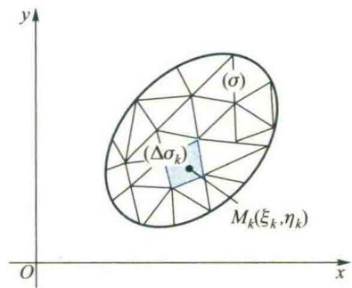

import ExerciseTrigger from '@/components/exercises/ExerciseTrigger.astro';
import QRCodeVideo from '@/components/QRCodeVideo.astro';

import Guide from '@/components/Guide.astro';
import Knowledge from '@/components/Knowledge.astro';
import Example from '@/components/Example.astro';
import Analysis from '@/components/Analysis.astro';
import Solution from '@/components/Solution.astro';
import Variant from '@/components/Variant.astro';
import Note from '@/components/Note.astro';
import SideNote from '@/components/SideNote.astro';
import Block from '@/components/Block.astro';
import Method from '@/components/Method.astro';
import Exercise from '@/components/Exercise.astro';

本节介绍与方向性无关的多元函数积分，称为多元数量值函数的积分或第一大类型积分，讲解其概念与性质。

我们在第三章中所讨论过的定积分，其被积函数是一元函数，积分范围是区间，因而它一般只能用来研究分布在某一区间上的量的求和问题，例如平面曲线梯形的面积、细棒的质量等。但是在科学技术中，往往还会碰到许多非均匀分布在平面或空间中的某种几何形体上的可加量的求和问题，例如，空间区域的体积，平面薄板、空间物体或物质曲线和曲面的质量等。这时就需要把定积分的概念加以推广，来讨论被积函数是多元函数而积分范围是平面或空间中某一几何形体的积分，即多元函数的积分。

多元函数积分的种类较多，但可以从是否考虑方向性，把它们划分为两大类型。本章先介绍与方向性无关的多元函数积分，称为多元数量值函数的积分或第一大类型积分，讲解其概念、性质、计算和应用，包括含参变量的积分，然后结合场论介绍与方向性有关的第二大类型积分。

## 1.1 物体质量的计算

设有一质量非均匀分布的物体，其密度是点 $M$ 的连续函数 $\mu = f(M)$。如果函数 $f$ 已知，怎样求解物体的质量呢？

在定积分中，我们已经讲解了求线密度为 $\mu = f(M) = f(x)$ 的细棒 $AB$（图 6.1）质量的思想和步骤。当线密度 $\mu$ 为常量时，物质是均匀分布在区间 $[a, b]$ 上的。这时棒 $AB$ 的质量 $m$ 可简单地利用乘法得到：
$m = \mu \cdot (b - a)$。当 $\mu = f(x)$ 是连续变量时，物质在 $[a, b]$ 上是非均匀分布的。

<figure class="vp-figure">
  
  <figcaption>图 6.1</figcaption>
</figure>

为了运用物质为均匀分布的已知结果去解决非均匀分布的问题，我们采用了“分”、“匀”、“合”、“精”四个步骤，将线密度为 $\mu = f(x)$ 的细棒 $AB$ 的质量 $m$ 化为下述定积分来求：

$$

m = \lim_{\max \Delta x_k \to 0} \sum_{k=1}^n f(\xi_k) \Delta x_k = \int_a^b f(x) \mathrm{d}x \tag{1.1}

$$

对于平面或空间内的物体，当其密度函数 $\mu = f(M)$ 已知时，其质量的计算也可通过“分”、“匀”、“合”、“精”的步骤来解决。例如，对平面薄板来说，假设它所占的平面区域为 $\sigma$（图 6.2），其面密度 $\mu = f(M)$ 在 $\sigma$ 上连续，我们可以按下述步骤来计算它的质量。

**分**：把薄板所在的区域 $\sigma$ 任意地划分为 $n$ 个子域 $(\Delta \sigma_k) \ (k = 1, 2, \dots, n)$，它们的面积记作 $\Delta \sigma_k$（图 6.2）。

**匀**：当子域 $(\Delta \sigma_k)$ 很小时，其上的物质可以近似地看成是均匀分布的，也就是说，密度函数 $f(M)$ 在 $(\Delta \sigma_k)$ 上可以近似看作是常数，即等于 $(\Delta \sigma_k)$ 内任一点 $M_k$ 的值 $f(M_k)$，从而 $(\Delta \sigma_k)$ 上质量 $\Delta m_k$ 的近似值为

$$

\Delta m_k \approx f(M_k) \Delta \sigma_k

$$

**合**：把所有 $\Delta m_k$ 的近似值加起来，就得到薄板质量 $m$ 的近似值为

$$

m = \sum_{k=1}^n \Delta m_k \approx \sum_{k=1}^n f(M_k) \Delta \sigma_k

$$

**精**：$\sigma$ 的所有子域 $(\Delta \sigma_k) \ (k = 1, 2, \dots, n)$ 被划分得越小，上述近似值的近似程度就越高。设 $d$ 为这 $n$ 个子域 $(\Delta \sigma_k)$ 的直径中的最大者，当子域的数目 $n$ 无限增大，而且 $d$ 趋于零时，每一子域都无限缩小，我们将上述近似值的极限规定为此薄板的质量 $m$，即

$$

m = \lim_{d \to 0} \sum_{k=1}^n f(M_k) \Delta \sigma_k \tag{1.2}

$$

<figure class="vp-figure">
  
  <figcaption>图 6.2</figcaption>
</figure>

<SideNote title="注">
  闭区域的直径是指此闭区域中任意两点间距离的最大值。
</SideNote>

可见，薄板的质量也可由一个和式的极限来确定。和式极限 (1.2) 与 (1.1) 式中的和式极限形式上完全一样，唯一的差别是 (1.1) 式中的每一项是函数在子区间上任一点 $M_k$ 的函数值乘以该子区间的长度，而 (1.2) 式中的每一项是函数在平面子域上任一点 $M_k$ 的函数值乘以该子域的面积。这种差别是由质量分布的范围不同所引起的。

一般说来，设有物质非均匀分布在某一几何形体 $(\Omega)$ 上的物体（这里的几何形体 $(\Omega)$ 可以是直线段、平面或空间区域，一片曲面或一段曲线），其密度函数 $\mu = f(M)$ 在 $(\Omega)$ 上连续，可以完全依照上面的四个步骤来计算其质量。

**分**：把 $(\Omega)$ 任意地划分为 $n$ 个部分，记作 $(\Delta \Omega_k), k = 1, 2, \dots, n$，并把 $(\Delta \Omega_k)$ 的度量（例如面积、体积、曲面面积、曲线的弧长等）记为 $\Delta \Omega_k$。

**匀**：把 $(\Delta \Omega_k)$ 上物质的分布近似看成是均匀的，即在 $(\Delta \Omega_k)$ 上把密度函数 $\mu = f(M)$ 近似看作是等于其中任一点 $M_k$ 处的函数值 $f(M_k)$，从而 $(\Delta \Omega_k)$ 上质量 $\Delta m_k$ 的近似值为

$$

\Delta m_k \approx f(M_k) \Delta \Omega_k

$$

**合**：把所有上述近似值加起来得到此物体质量的近似值为

$$

m = \sum_{k=1}^n \Delta m_k \approx \sum_{k=1}^n f(M_k) \Delta \Omega_k

$$

**精**：设 $d$ 为 $n$ 个 $(\Delta \Omega_k)$ 直径中的最大者，当 $d \to 0$ 时上述和式的极限值就是此物体的质量 $m$，即

$$

m = \sum_{k=1}^n \Delta m_k = \lim_{d \to 0} \sum_{k=1}^n f(M_k) \Delta \Omega_k \tag{1.3}

$$

## 1.2 多元数量值函数积分的概念

从上面求质量的问题中我们看到，尽管物质分布的几何形体可以不同，甚至涉及不同维度的空间，但是通过点函数从数量关系来看，求质量的问题都归结为求同一形式和式的极限 (1.3)。在科学技术中还有大量类似的问题，例如各种物体的质心和转动惯量、平面或空间几何形体的面积或体积等，都可以看成是分布在某一几何形体上的可加量的求和问题，从而最终可归结为形如 (1.3) 的和式的极限问题而得到解决。为了从数量关系上给出解决这类问题的一般方法，我们抛弃它们的具体意义，仅保留其数学结构的特征，给出以下多元函数积分的概念。

<Knowledge title="定义 1.1 (多元数量值函数积分)">
设 $(\Omega)$ 表示一个有界的几何形体，它是可度量的（即可求长或可求面积或可求体积），函数 $f$ 是定义在 $(\Omega)$ 上的有界数量值函数。

将 $(\Omega)$ 任意地划分为 $n$ 个小部分 $(\Delta \Omega_k), k = 1, 2, \dots, n$，用 $\Delta \Omega_k$ 表示 $(\Delta \Omega_k)$ 的度量。任取点 $M_k \in (\Delta \Omega_k)$，作乘积

$$

f(M_k) \Delta \Omega_k, \quad k = 1, 2, \dots, n

$$

作和式

$$

\sum_{k=1}^n f(M_k) \Delta \Omega_k

$$

如果不论 $(\Omega)$ 怎样划分，点 $M_k$ 在 $(\Delta \Omega_k)$ 中怎样选取，当所有 $(\Delta \Omega_k)$ 的直径的最大值 $d \to 0$ 时上述和式都趋于同一个常数，那么，称函数 $f$ 在 $(\Omega)$ 上可积，且称此常数为多元数量值函数 $f$ 在 $(\Omega)$ 上的积分，在不致混淆的情况下，也简称为函数 $f$ 在 $(\Omega)$ 上的积分，记作

$$

\int_{(\Omega)} f(M) \mathrm{d}\Omega = \lim_{d \to 0} \sum_{k=1}^n f(M_k) \Delta \Omega_k \tag{1.4}

$$

其中 $(\Omega)$ 称为积分域，$f$ 称为被积函数，$f(M) \mathrm{d}\Omega$ 称为被积式或积分微元。
</Knowledge>

<SideNote title="注">
  定义之中之所以要求 $f$ 在 $(\Omega)$ 上有界，是因为依照第三章定积分定义边注（第 175 页）中的证明可知：当 $f$ 在 $(\Omega)$ 上无界时，积分 (1.4) 一定不存在。
</SideNote>

下面，我们根据积分域 $(\Omega)$ 的不同类型，分别给出积分 (1.4) 的具体表达式和名称。

(1) 如果 $(\Omega)$ 是 $x$ 轴上的闭区间 $[a, b]$，那么 $f$ 就是定义在区间 $[a, b]$ 上的一元函数，$\Delta \Omega_k$ 就是子区间的长度 $\Delta x_k$，从而 (1.4) 式可以具体地写成

$$

\int_{(\Omega)} f(M) \mathrm{d}\Omega = \lim_{d \to 0} \sum_{k=1}^n f(\xi_k) \Delta x_k

$$

而积分 $\int_{(\Omega)} f(M) \mathrm{d}\Omega$ 就是定积分 $\int_a^b f(x) \mathrm{d}x$。

<QRCodeVideo id="6.1.1" title="数量值函数积分概念的实质" url="#" />

(2) 如果 $(\Omega)$ 是 $xOy$ 平面上的区域 $(\sigma)$，那么 $f$ 就是定义在 $(\sigma)$ 上的二元函数，$\Delta \Omega_k$ 就是子区域的面积 $\Delta \sigma_k$，从而 (1.4) 式也可更具体地写成

$$

\int_{(\Omega)} f(M) \mathrm{d}\Omega = \lim_{d \to 0} \sum_{k=1}^n f(\xi_k, \eta_k) \Delta \sigma_k

$$

称为 $f$ 在区域 $(\sigma)$ 上的二重积分，其中 $(\xi_k, \eta_k)$ 就是点 $M_k$ 的直角坐标。为了明确二重积分有两个独立的积分变量，我们常用两个积分符号把二重积分表示为

$$

\iint_{(\sigma)} f(x, y) \mathrm{d}\sigma = \lim_{d \to 0} \sum_{k=1}^n f(\xi_k, \eta_k) \Delta \sigma_k

$$

其中 $(\sigma)$ 就是二重积分的积分域，$\mathrm{d}\sigma$ 称为面积微元。

(3) 如果 $(\Omega)$ 为三维空间的区域 $(V)$，那么 $f$ 就是定义在 $(V)$ 上的三元函数，$\Delta \Omega_k$ 就是子区域的体积 $\Delta V_k$。为了明确显示这时的积分有三个独立的积分变量，我们常采用三个积分符号，而把 (1.4) 式具体写成

$$

\iiint_{(V)} f(x, y, z) \mathrm{d}V = \lim_{d \to 0} \sum_{k=1}^n f(\xi_k, \eta_k, \zeta_k) \Delta V_k

$$

称为 $f$ 在区域 $(V)$ 上的三重积分，其中 $(\xi_k, \eta_k, \zeta_k)$ 为点 $M_k$ 的直角坐标，$(V)$ 是三重积分的积分域，$\mathrm{d}V$ 称为体积微元。

(4) 如果 $(\Omega)$ 为一条平面（或空间）的曲线弧段 $(C)$，那么 $f$ 就是定义在弧段 $(C)$ 上的二元（或三元）函数，$\Delta \Omega_k$ 就是子弧段的弧长 $\Delta s_k$，于是 (1.4) 式可以具体写成

$$

\int_{(C)} f(x, y) \mathrm{d}s = \lim_{d \to 0} \sum_{k=1}^n f(\xi_k, \eta_k) \Delta s_k

$$

（或 $\int_{(C)} f(x, y, z) \mathrm{d}s = \lim_{d \to 0} \sum_{k=1}^n f(\xi_k, \eta_k, \zeta_k) \Delta s_k$），
称为 $f$ 在曲线段 $(C)$ 上对弧长的曲线积分，也称为第一型线积分，其中 $(C)$ 称为积分路径。被积函数形式上是二元（或三元）函数，但是由于点 $M$ 在曲线 $(C)$ 上变动，它的坐标将受到 $(C)$ 的方程的约束，所以实质上独立的变量只有一个。这也是为什么只用一个积分符号去表示曲线积分的原因。

(5) 如果 $(\Omega)$ 为一片曲面 $(S)$，那么 $f$ 就是定义在 $(S)$ 上的三元函数，$\Delta \Omega_k$ 就是子曲面的面积 $\Delta S_k$。由于点 $M$ 在曲面 $(S)$ 上变化，它的坐标 $x, y, z$ 中只有两个是独立的，因此我们用两个积分符号来表示这类积分，而将 (1.4) 式具体写为

$$

\iint_{(S)} f(x, y, z) \mathrm{d}S = \lim_{d \to 0} \sum_{k=1}^n f(\xi_k, \eta_k, \zeta_k) \Delta S_k

$$

称为 $f$ 在曲面 $(S)$ 上对面积的曲面积分，也称为第一型面积积分。

<SideNote title="注">
  这里我们将二重、三重积分、第一型线、面积积分用几何形体上的积分统一定义，不仅避免了烦琐的重复，而且突出了它们的共同性与解决问题的思想和步骤，也便于理解它们的差异仅在于积分域的不同。
</SideNote>

## 1.3 积分存在的条件与性质

在多元数量值函数积分的定义中，要求不论 $(\Omega)$ 怎样划分，不论点 $M_k$ 在 $(\Delta \Omega_k)$ 中怎样选取，当所有 $(\Delta \Omega_k)$ 的直径的最大值 $d \to 0$ 时和式均趋于同一个数，这时，我们才说积分存在，或 $f$ 在 $(\Omega)$ 上可积。

类似于定积分，可以证明（从略），若 $(\Omega)$ 是有界闭集且可度量，$f \in C((\Omega))$，则 $f$ 在 $(\Omega)$ 上一定可积。

下面我们在 $(\Omega)$ 是有界集、可度量且被积函数可积的前提下来讨论积分的主要性质，它们的证明与定积分中相应性质类似。

### 1. 线性性

(1) $\int_{(\Omega)} k f(M) \mathrm{d}\Omega = k \int_{(\Omega)} f(M) \mathrm{d}\Omega, \quad k$ 为一常数；

(2) $\int_{(\Omega)} [f(M) \pm g(M)] \mathrm{d}\Omega = \int_{(\Omega)} f(M) \mathrm{d}\Omega \pm \int_{(\Omega)} g(M) \mathrm{d}\Omega$。

### 2. 对积分域的可加性

设 $(\Omega) = (\Omega_1) \cup (\Omega_2)$，且 $(\Omega_1)$ 与 $(\Omega_2)$ 除边界点外无公共部分，则

$$

\int_{(\Omega)} f(M) \mathrm{d}\Omega = \int_{(\Omega_1)} f(M) \mathrm{d}\Omega + \int_{(\Omega_2)} f(M) \mathrm{d}\Omega

$$

### 3. 积分不等式

(1) 若 $f(M) \le g(M), \forall M \in (\Omega)$，则

$$

\int_{(\Omega)} f(M) \mathrm{d}\Omega \le \int_{(\Omega)} g(M) \mathrm{d}\Omega

$$

(2) $\left| \int_{(\Omega)} f(M) \mathrm{d}\Omega \right| \le \int_{(\Omega)} |f(M)| \mathrm{d}\Omega$

(3) 若 $l \le f(M) \le L, \forall M \in (\Omega)$，则

$$

l\Omega \le \int_{(\Omega)} f(M) \mathrm{d}\Omega \le L\Omega

$$

### 4. 中值定理

设 $f \in C((\Omega))$, $(\Omega)$ 为一有界连通闭集，则在 $(\Omega)$ 上至少存在一点 $P$，使

$$

\int_{(\Omega)} f(M) \mathrm{d}\Omega = f(P) \Omega

$$

<QRCodeVideo id="6.1.2" title="多元数量值函数积分中定理的证明" url="#" />

<ExerciseTrigger chapter={6} section="6.1" title="6.1 多元数量值函数积分的概念与性质 课后真题与自测练习" />
