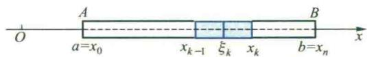

import ExerciseTrigger from '@/components/exercises/ExerciseTrigger.astro';
import QRCodeVideo from '@/components/QRCodeVideo.astro';

import Guide from '@/components/Guide.astro';
import Knowledge from '@/components/Knowledge.astro';
import Example from '@/components/Example.astro';
import Analysis from '@/components/Analysis.astro';
import Solution from '@/components/Solution.astro';
import Variant from '@/components/Variant.astro';
import Note from '@/components/Note.astro';
import Block from '@/components/Block.astro';
import Method from '@/components/Method.astro';
import Exercise from '@/components/Exercise.astro';

## 1.1 物体质量的计算

设有一质量非均匀分布的物体,其密度是点 M 的连续函数 $\mu=f(M)$ . 如果函数 f 已知,怎样来求物体的质量呢?

在定积分中,我们已经讲解了求线密度为 $\mu=f(M)=f(x)$ 的细棒 AB（图 6.1）质量的思想和步骤.当线密度 $\mu$ 为常量时,物质是均匀分布在区间 $[a,b]$ 上的.这时棒

AB 的质量 m 可简单地利用乘法得到: $m=\mu\cdot(b-a)$ . 当 $\mu=f(x)$ 是连续变量时, 物质在 $[a,b]$ 上是非均匀分布的.

<figure class="vp-figure">
  
  <figcaption>图6.1</figcaption>
</figure>

为了运用物质为均匀分布的已知结果去解决非均匀分布的问题,我们采用了“分”“匀”“合”“精”四个步骤,将线密度为 $\mu=f(x)$ 的细棒 AB 的质量 m 化为下述定积分来求:

$$
m = \lim _ {\max \Delta x _ {i} \rightarrow 0} \sum_ {k = 1} ^ {n} f (\xi_ {k}) \Delta x _ {k} = \int_ {a} ^ {b} f (x) \mathrm{d} x.\tag{1.1}
$$

对于平面或空间内的物体,当其密度函数 $\mu=f(M)$ 已知时,其质量的计算也可通过“分”“匀”“合”“精”的步骤来解决.例如,对平面薄板来说,假设它所占的平面区域为 $(\sigma)$ (图 6.2),其面密度 $\mu=f(M)$ 在 $(\sigma)$ 上连续,我们可按下述步骤来计算它的质量.

分 把薄板所在的区域( $\sigma$ )任意地划分为 n 个子域( $\Delta\sigma_{k}$ )( $k=1,2,\cdots,n$ )它们的面积记作 $\Delta\sigma_{k}$ （图 6.2）.

图6.2

匀 当子域 $(\Delta \sigma_{k})$ 很小时，其上的物质可以近似地看成是均匀分布的，也就是说，密度函数 $f(M)$ 在 $(\Delta \sigma_{k})$ 上可以近似地看作是常数，即等于 $(\Delta \sigma_{k})$ 内的任一点 $M_{k}$ 的值 $f(M_{k})$ ，从而 $(\Delta \sigma_{k})$ 上质量 $\Delta m_{k}$ 的近似值为

$$
\Delta m _ {k} \approx f (M _ {k}) \Delta \sigma_ {k}.
$$

合 把所有 $\Delta m_{k}$ 的近似值加起来, 就得到薄板质量 m 的近似值为

$$
m = \sum_ {k = 1} ^ {n} \Delta m _ {k} \approx \sum_ {k = 1} ^ {n} f (M _ {k}) \Delta \sigma_ {k}.
$$

精 $(\sigma)$ 的所有子域 $(\Delta\sigma_{k})(k=1,2,\cdots,n)$ 被划分得越小，上述近似值的近似程度就越高。设 d 为这 n 个子域 $(\Delta\sigma_{k})$ 的直径 ① 中的最大者，当子域的数目 n 无限增大，而且 d 趋于零时，每一子域都无限缩小，我们把上述近似值的极限规定为此薄板的质量 m，即

$$
m = \lim _ {d \to 0} \sum_ {k = 1} ^ {n} f (M _ {k}) \Delta \sigma_ {k}. \quad \text {I}\tag{1.2}
$$

可见,薄板的质量也可由一个和式的极限来确定.和式极限(1.2)与(1.1)式中的和式极限形式上完全一样,唯一的差别是(1.1)式中的每一项是函数在子区间上任一点 $M_{k}$ 的函数值乘该子区间的长度,而(1.2)式中的每一项是函数在平面子域上任一点 $M_{k}$ 的函数值乘该子域的面积.这种差别是由于质量分布的范围不同所引起的.

一般说来,设有一物质非均匀分布在某一几何形体( $\Omega$ )上的物体(这里的几何形体( $\Omega$ )可以是直线段、平面或空间区域,一片曲面或一段曲线),其密度函数 $\mu=f(M)$ 在( $\Omega$ )上连续,可以完全依照上面的四个步骤来计算其质量.

分 把 $(\Omega)$ 任意地划分为 n 个部分, 记作 $(\Delta\Omega_{k}), k=1,2,\cdots,n.$ 并把 $(\Delta\Omega_{k})$ 的度量(例如面积、体积、曲面面积、曲线的弧长等)记为 $\Delta\Omega_{k}$ .

匀 把 $(\Delta\Omega_{k})$ 上物质的分布近似看成是均匀的, 即在 $(\Delta\Omega_{k})$ 上把密度函数 $\mu=f(M)$ 近似看作是等于其中任一点 $M_{k}$ 处的函数值 $f(M_{k})$ , 从而 $(\Delta\Omega_{k})$ 上质量 $\Delta m_{k}$ 的近似值为

$$
\Delta m _ {k} \approx f (M _ {k}) \Delta \Omega_ {k}.
$$

合 把所有上述近似值加起来得此物体质量的近似值为

$$
m = \sum_ {k = 1} ^ {n} \Delta m _ {k} \approx \sum_ {k = 1} ^ {n} f (M _ {k}) \Delta \Omega_ {k}.
$$

精 设 d 为 n 个 $(\Delta\Omega_{k})$ 直径 ① 中的最大者, 当 $d \to 0$ 时上述和式的极限值就是此物体的质量 m, 即

$$
m = \sum_ {k = 1} ^ {n} \Delta m _ {k} = \lim _ {d \rightarrow 0} \sum_ {k = 1} ^ {n} f (M _ {k}) \Delta \Omega_ {k}.\tag{1.3}
$$

## 1.2 多元数量值函数积分的概念

从上面求质量的问题中我们看到,尽管物质分布的几何形体可以不同,甚至涉及不同维数的空间,但是通过点函数从数量关系来看,求质量的问题都归结为求同一形式和式的极限(1.3).在科学技术中还有大量类似的问题,例如各种物体的质心和转动惯量、平面或空间几何形体的面积或体积等,都可以看成是分布在某一几何形体上的可加量的求和问题,从而最终都可归结为形如(1.3)的和式的极限问题而得到解决.为了从数量关系上给出解决这类问题的一般方法,我们抛开它们的具体意义,仅保留其数学结构的特征,给出以下多元函数积分的概念.

<Knowledge title="定义 1.1 多元数量值函数积分">
设 $(\Omega)$ 表示一个有界的几何形体, 它是可度量的(即可求长或可求面积或可求体积), 函数 f 是定义在 $(\Omega)$ 上的有界数量值函数.
</Knowledge>

定义中之所以要求f在 $(\Omega)$ 上有界,是因为仿照第三章定积分定义边注(第175页)中的证明可知:当f在 $(\Omega)$ 上无界时,积分(1.4)一定不存在.

将 $(\Omega)$ 任意地划分为n个小部分 $(\Delta\Omega_{k}), k=1,2,\cdots,n.$ 用 $\Delta\Omega_{k}$ 表示 $(\Delta\Omega_{k})$ 的度量.

任取点 $M_{k}\in (\Delta \Omega_{k})$ ，作乘积

$$
f (M _ {k}) \Delta \Omega_ {k}, \quad k = 1, 2, \dots , n.
$$

作和式

$$
\sum_ {k = 1} ^ {n} f (M _ {k}) \Delta \Omega_ {k}.
$$

如果不论 $(\Omega)$ 怎样划分，点 $M_{k}$ 在 $(\Delta \Omega_{k})$ 中怎样选取，当所有 $(\Delta \Omega_{k})$ 的直径的最大值 $d\to 0$ 时上述和式都趋于同一常数，那么，称函数 $f$ 在 $(\Omega)$ 上可积，且称此常数为多元数量值函数 $f$ 在 $(\Omega)$ 上的积分，在不致混淆的情况下，也简称为函数 $f$ 在 $(\Omega)$ 上的积分，记作

$$
\int_ {(\Omega)} f (M) \mathrm{d} \Omega = \lim _ {d \rightarrow 0} \sum_ {k = 1} ^ {n} f (M _ {k}) \Delta \Omega_ {k},\tag{1.4}
$$

其中 $(\Omega)$ 称为积分域 ① ，f称为被积函数， $f(M)\mathrm{d}\Omega$ 称为被积式或积分微元.

下面,我们根据积分域 $(\Omega)$ 的不同类型,分别给出积分(1.4)的具体表达式和名称.

（1）如果 $(\Omega)$ 是 $x$ 轴上的闭区间 $[a,b]$ ，那么 $f$ 就是定义在区间 $[a,b]$ 上的一元函数， $\Delta \Omega_{k}$ 就是子区间的长度 $\Delta x_{k}$ ，从而(1.4)式可以具体地写成

$$
\int_ {(\Omega)} f (M) \mathrm{d} \Omega = \lim _ {d \to 0} \sum_ {k = 1} ^ {n} f (\xi_ {k}) \Delta x _ {k},
$$

<QRCodeVideo id="6.1.1" title="数量值函数积分概念的实质." url="HTTP://2D.HEP.CN/1254052/10" />

而积分 $\int_{(\Omega)} f(M) \mathrm{d}\Omega$ 就是定积分 $\int_{a}^{b} f(x) \mathrm{d}x$ .

(2) 如果 $(\Omega)$ 是 xOy 平面上的区域 $(\sigma)$② ，那么 f 就是定义在 $(\sigma)$ 上的二元函数， $\Delta\Omega_{k}$ 就是子区域的面积 $\Delta\sigma_{k}$ ，从而 (1.4) 式也可更具体地写成

$$
\int_ {(\Omega)} f (M) \mathrm{d} \Omega = \lim _ {d \to 0} \sum_ {k = 1} ^ {n} f (\xi_ {k}, \eta_ {k}) \Delta \sigma_ {k},
$$

称为 $f$ 在区域 $(\sigma)$ 上的二重积分，其中 $(\xi_k, \eta_k)$ 就是点 $M_k$ 的直角坐标。为了明确显示二重积分有两个独立的积分变量，我们常用两个积分符号把二重积分表示为

$$
\iint_ {(\sigma)} f (x, y) \mathrm{d} \sigma = \lim _ {d \rightarrow 0} \sum_ {k = 1} ^ {n} f (\xi_ {k}, \eta_ {k}) \Delta \sigma_ {k},
$$

其中 $(\sigma)$ 就是二重积分的积分域, $d\sigma$ 称为面积微元.

（3）如果 $(\Omega)$ 为三维空间的区域 $(V)$ ，那么 $f$ 就是定义在 $(V)$ 上的三元函数， $\Delta \Omega_{k}$ 就是子区域的体积 $\Delta V_{k}$ . 为了明确显示这时的积分有三个独立的积分变量，我们常采用三个积分符号，而把(1.4)式具体写成

$$
\iiint_ {(V)} f (x, y, z) \mathrm{d} V = \lim _ {d \rightarrow 0} \sum_ {k = 1} ^ {n} f (\xi_ {k}, \eta_ {k}, \zeta_ {k}) \Delta V _ {k},
$$

称为f在区域(V)上的三重积分,其中 $(\xi_{k},\eta_{k},\zeta_{k})$ 为点 $M_{k}$ 的直角坐标,(V)是三重积分的积分域,dV称为体积微元.

(4) 如果 $(\Omega)$ 为一条平面(或空间)的曲线弧段(C)，那么f就是定义在弧段(C)上的二元(或三元)函数， $\Delta\Omega_{k}$ 就是子弧段的弧长 $\Delta s_{k}$ ，于是(1.4)式可以具体写成

$$
\begin{array}{r l} & {\int_ {(C)} f (x, y) \mathrm{d} s = \lim _ {d \to 0} \sum_ {k = 1} ^ {n} f (\xi_ {k}, \eta_ {k}) \Delta s _ {k}} \\ & {\left(\text {或} \int_ {(C)} f (x, y, z) \mathrm{d} s = \lim _ {d \to 0} \sum_ {k = 1} ^ {n} f (\xi_ {k}, \eta_ {k}, \zeta_ {k}) \Delta s _ {k}\right),} \end{array}
$$

称为 $f$ 在曲线段 $(C)$ 上对弧长的曲线积分, 也称为第一型线积分, 其中 $(C)$ 称为积分路径. 被积函数形式上是二元 (或三元) 函数, 但是由于点 $M$ 在曲线 $(C)$ 上变动, 它的坐标将受到 $(C)$ 的方程的约束, 所以实质上独立的变量只有一个. 这也是为什么只用一个积分符号去表示曲线积分的原因.

（5）如果 $(\Omega)$ 为一片曲面 $(S)$ ，那么 $f$ 就是定义在 $(S)$ 上的三元函数， $\Delta \Omega_{k}$ 就是子曲面的面积 $\Delta S_{k}$ . 由于点 $M$ 在曲面 $(S)$ 上变化，它的坐标 $x, y, z$ 中只有两个是独立的，因此我们用两个积分符号来表示这类积分，而将(1.4)式具体写为

$$
\iint_ {(S)} f (x, y, z) \mathrm{d} S = \lim _ {d \rightarrow 0} \sum_ {k = 1} ^ {n} f (\xi_ {k}, \eta_ {k}, \zeta_ {k}) \Delta S _ {k},
$$

称为f在曲面(S)上对面积的曲面积分,也称为第一型面积分.

我们看到,多元函数的积分虽然类型多样,但都是形同(1.4)式的和式极限,只不过被积函数的定义域是不同的几何形体罢了.这反映了在不同几何形体( $\Omega$ )上对非均匀分布可加量求和问题的需要.例如,如果物质连续分布在空间区域(V)上,那注:这里我们将二重、三重积分,第一型线、面积分用几何形体上的积分统一定义,不仅避免了烦琐的重复,而且突出了它们的共性与解决问题的思想和步骤,也便于理解它们的差异仅在于积分域的不同.

么在密度函数 $\mu (x,y,z)$ 已知的情况下，(V)的质量就是 $\mu$ 在(V)上的三重积分 $\iiint_{(V)}\mu (x,y,z)\mathrm{d}V;$ 如果物质连续分布在一片曲面(S)上，那么在密度函数 $\mu (x,y,z)$ 已知的情况下，(S) 的质量就是 $\mu$ 在 (S) 上对面积的曲面积分 $\iint_{(S)} \mu(x, y, z) \, \mathrm{d}S.$

## 1.3 积分存在的条件和性质

在多元数量值函数积分的定义中,要求不论 $(\Omega)$ 怎样划分,不论点 $M_{k}$ 在 $(\Delta\Omega_{k})$ 中怎样选取,当所有 $(\Delta\Omega_{k})$ 的直径的最大值 $d\to0$ 时和式均趋于同一个数.这时,我们才说积分存在,或f在 $(\Omega)$ 上可积.

类似于定积分,可以证明(从略),若 $(\Omega)$ 是有界闭集且可度量, $f\in C((\Omega))$ ,则f在 $(\Omega)$ 上一定可积.

下面我们在 $(\Omega)$ 是有界闭集、可度量且被积函数可积的前提下来讨论积分的主要性质，它们的证明与定积分中相应性质类似.

### 1. 线性性质

(1) $\int_{(\Omega)} kf(M)\mathrm{d}\Omega = k\int_{(\Omega)} f(M)\mathrm{d}\Omega, k$ 为一常数；

(2) $\int_{(\Omega)} [f(M) \pm g(M)] \, \mathrm{d}\Omega = \int_{(\Omega)} f(M) \, \mathrm{d}\Omega \pm \int_{(\Omega)} g(M) \, \mathrm{d}\Omega$ .

2. 对积分域的可加性 设 $(\Omega)=(\Omega_{1})\cup(\Omega_{2})$ ，且 $(\Omega_{1})$ 与 $(\Omega_{2})$ 除边界点外无公共部分，则

$$
\int_ {(\Omega)} f (M) \mathrm{d} \Omega = \int_ {(\Omega_ {1})} f (M) \mathrm{d} \Omega + \int_ {(\Omega_ {2})} f (M) \mathrm{d} \Omega .
$$

### 3. 积分不等式

(1) 若 $f(M) \leqslant g(M)$ , $\forall M \in (\Omega)$ , 则

$$
\int_ {(\Omega)} f (M) \mathrm{d} \Omega \leqslant \int_ {(\Omega)} g (M) \mathrm{d} \Omega ;
$$

<QRCodeVideo id="6.1.2" title="多元数量值函数积分中值定理的证明." url="HTTP://2D.HEP.CN/1254052/11" />

(2) $\left|\int_{(\Omega)}f(M)\mathrm{d}\Omega \right| \leqslant \int_{(\Omega)}|f(M)|\mathrm{d}\Omega;$

(3) 若 $l \leqslant f(M) \leqslant L, \forall M \in (\Omega)$ , 则

$$
l \Omega \leqslant \int_ {(\Omega)} f (M) \mathrm{d} \Omega \leqslant L \Omega .
$$

4. 中值定理 设 $f \in C((\Omega))$ , (Ω)为一有界连通闭集, 则在(Ω)上至少存在一点P, 使

$$
\int_ {(\Omega)} f (M) \mathrm{d} \Omega = f (P) \Omega .
$$

<Block title="习题6.1">
**（A）**

1. 当 $f(M)=1$ 时, 积分 $\int_{(\Omega)}f(M)\mathrm{d}\Omega$ 的值表示什么意义?

2. 积分 $\int_{(\Omega)} f(M) \mathrm{d}\Omega$ 定义中的所有 $(\Delta \Omega_k)$ 的直径的最大值 $d \to 0$ 能否用所有 $(\Delta \Omega_k)$ 的度量的最大值趋于零代替，为什么？

3. 试说明二重积分、三重积分与定积分的共同点和不同点.

4. 就二重积分证明积分对积分域的可加性.

5. 利用积分的性质在所给区域上比较下列积分的大小：

(1) $\iint_{(\sigma)} (x + y) \mathrm{d}\sigma$ 与 $\iint_{(\sigma)} (x + y)^2 \mathrm{d}\sigma, (\sigma) = \{(x, y) | x \geqslant 0, y \geqslant 0, x + y \leqslant 1\}$ ;

(2) $\iint_{(\sigma)} (x^2 + y^2)^2 \mathrm{d}\sigma$ 与 $\iint_{(\sigma)} (x^2 + y^2)^3 \mathrm{d}\sigma, (\sigma) = \{(x, y) | 1 \leqslant x^2 + y^2 \leqslant 4\}$ ;

(3) $\iint_{(\sigma_1)} (x^2 + y^2) \, \mathrm{d}\sigma$ 与 $\iint_{(\sigma_2)} (x^2 + y^2) \, \mathrm{d}\sigma, (\sigma_1) = \{(x, y) | x^2 + y^2 \leqslant 1\}, (\sigma_2) = \{(x, y) | x^2 + y^2 \leqslant 4\}$ ;

(4) $\iint_{\langle \sigma_1\rangle}x^2 y\mathrm{d}\sigma$ 与 $\iint_{\langle \sigma_2\rangle}x^2 y\mathrm{d}\sigma ,(\sigma_1) = \{(x,y)\mid x^2 +y^2\leqslant 1,y\geqslant 0\} ,(\sigma_2) = \{(x,y)\mid x^2 +y^2\leqslant 1\} .$

**（B）**

1. 证明：若 $f(M)$ 在 $(\Omega)$ 上连续， $(\Omega)$ 是紧的且可度量， $f(M) \geqslant 0$ ，但 $f(M) \neq 0$ ，则

$$
\int_ {(\Omega)} f (M) \mathrm{d} \Omega > 0.
$$

2. 证明反常积分中值定理: 若 $(\Omega)$ 是紧的且可度量的连通集, $f(M)$ , $g(M)$ 在 $(\Omega)$ 上连续, $g(M)$ 在 $(\Omega)$ 上不变号, 则在 $(\Omega)$ 中至少存在一点 P, 使得

$$
\int_ {(\Omega)} f (M) g (M) \mathrm{d} \Omega = f (P) \int_ {(\Omega)} g (M) \mathrm{d} \Omega .
$$

3. 比较下列积分的大小：

$\iint_{(\sigma_{1})}xy\mathrm{d}\sigma,(\sigma_{1})$ 是由 x=0,y=0 与 $x+y=3$ 所围成的平面区域，

$\iint_{(\sigma_{2})}xy\mathrm{d}\sigma,(\sigma_{2})$ 是由 $x=-1,y=0$ 与 $x+y=3$ 所围成的平面区域.

4. 设 $f(x, y)$ 为连续函数，求

$$
\lim _ {r \to 0 ^ {+}} \frac {1}{\pi r ^ {2}} \iint_ {(\sigma_ {r})} f (x, y) \mathrm{d} \sigma ,
$$

其中 $(\sigma_r) = \{(x,y) | (x - x_0)^2 + (y - y_0)^2 \leqslant r^2\}$ .

5. 设 $f(x, y)$ 在平面有界闭区域 $(\sigma)$ 上连续，证明：若 $f(x, y)$ 在 $(\sigma)$ 上非负，且 $\iint_{(\sigma)} f(x, y) \, \mathrm{d}\sigma = 0$ ，则有 $f(x, y) \equiv 0, \forall (x, y) \in (\sigma)$ .
</Block>

<ExerciseTrigger chapter={6} section="6.1" title="6.1 多元数量值函数积分的概念与性质 课后真题与自测练习" />
